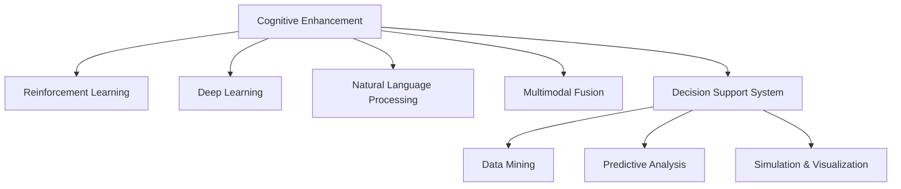

                 

# 人机协作：增强人类认知能力的新范式

> 关键词：人机协作,认知增强,增强学习,深度学习,自然语言处理(NLP),多模态融合,决策支持

## 1. 背景介绍

### 1.1 问题由来
随着科技的迅猛发展，人工智能(AI)已经深入各行各业，对人类生活和社会进步产生了深远影响。然而，尽管AI技术取得了显著进展，人类的认知能力依然是决策过程中不可或缺的一部分。特别是在处理复杂的社会、情感、道德等情境时，AI的计算能力和理性判断往往难以替代人类的直觉和感性经验。因此，如何将AI与人类的认知能力有效结合，实现人机协作，成为了当前AI研究的新兴热点。

### 1.2 问题核心关键点
本节将从以下几个核心关键点切入，探讨人机协作的最新进展和未来方向：

1. **认知增强（Cognitive Enhancement）**：利用AI技术提升人类的认知能力，增强记忆、理解、推理等核心认知功能。
2. **增强学习（Reinforcement Learning）**：通过与环境的交互，优化行为策略，提升人类决策的效率和质量。
3. **深度学习（Deep Learning）**：利用神经网络模型处理大量复杂数据，提取高层次特征，实现认知功能的形式化建模。
4. **自然语言处理（NLP）**：通过文本理解、语义分析等技术，实现人机之间更自然的交互和信息传递。
5. **多模态融合（Multimodal Fusion）**：结合视觉、听觉、触觉等多种感官信息，增强认知任务的综合处理能力。
6. **决策支持系统（Decision Support System, DSS）**：构建辅助人类决策的智能系统，提供科学依据和参考方案。

### 1.3 问题研究意义
探讨人机协作的新范式，对推动人工智能和认知科学的交叉发展，具有重要意义：

1. **提升决策效率**：AI的计算速度和处理能力，可以大幅提升人类决策的速度和精度。
2. **增强决策质量**：AI的预测和推理能力，可以提供更加全面、客观的决策依据。
3. **促进知识共享**：AI的信息处理和检索能力，可以高效整合和传播人类知识，促进知识的扩散和创新。
4. **改善用户体验**：通过人机协作，提升人机交互的自然性和易用性，改善用户体验。
5. **推动学科融合**：AI与人类的认知能力的结合，为跨学科研究提供了新的视角和方法。
6. **增强社会福祉**：AI在医疗、教育、法律等领域的辅助作用，可以提升社会治理水平，改善公共服务。

## 2. 核心概念与联系

### 2.1 核心概念概述

为了更好地理解人机协作的原理和实现方式，本节将介绍几个核心概念及其相互关系：

1. **认知增强（Cognitive Enhancement）**：指利用AI技术提升人类的认知能力，增强记忆、理解、推理等核心认知功能。主要技术手段包括认知辅助工具、脑机接口等。

2. **增强学习（Reinforcement Learning）**：一种通过与环境交互，优化行为策略的学习方法。通过奖励和惩罚机制，AI可以不断调整行为策略，提升决策效果。

3. **深度学习（Deep Learning）**：利用神经网络模型处理大量复杂数据，提取高层次特征，实现认知功能的形式化建模。深度学习在图像识别、语音识别、自然语言处理等领域取得了显著成果。

4. **自然语言处理（NLP）**：通过文本理解、语义分析等技术，实现人机之间更自然的交互和信息传递。NLP技术在智能客服、问答系统、机器翻译等方面得到了广泛应用。

5. **多模态融合（Multimodal Fusion）**：结合视觉、听觉、触觉等多种感官信息，增强认知任务的综合处理能力。多模态融合技术在智能交互、虚拟现实等领域具有重要应用。

6. **决策支持系统（DSS）**：构建辅助人类决策的智能系统，提供科学依据和参考方案。DSS通过数据挖掘、预测分析、模拟仿真等技术，提升决策支持能力。

### 2.2 核心概念原理和架构的 Mermaid 流程图



这个流程图展示了核心概念之间的相互关系和信息流动：

1. **认知增强**：通过AI技术提升人类的认知能力，为其他核心概念提供基础。
2. **增强学习**：在认知增强的基础上，通过与环境的交互，优化行为策略。
3. **深度学习**：利用神经网络模型处理数据，提取高层次特征，支持其他认知任务。
4. **自然语言处理**：通过文本理解、语义分析等技术，实现人机交互。
5. **多模态融合**：结合多种感官信息，提升认知任务的综合处理能力。
6. **决策支持系统**：利用数据挖掘、预测分析等技术，辅助人类决策。

## 3. 核心算法原理 & 具体操作步骤
### 3.1 算法原理概述

人机协作的核心在于如何通过AI技术提升人类认知能力，并在任务执行中发挥各自优势。以下是对这一原理的详细阐述：

1. **认知增强**：利用AI技术（如脑机接口、智能辅助工具等），提升人类的记忆、理解、推理等核心认知功能。
2. **增强学习**：通过与环境的交互，AI可以不断优化行为策略，提升决策效率和质量。
3. **深度学习**：利用神经网络模型处理复杂数据，提取高层次特征，实现认知功能的形式化建模。
4. **自然语言处理**：通过文本理解、语义分析等技术，实现人机之间更自然的交互和信息传递。
5. **多模态融合**：结合视觉、听觉、触觉等多种感官信息，提升认知任务的综合处理能力。
6. **决策支持系统**：构建辅助人类决策的智能系统，提供科学依据和参考方案。

### 3.2 算法步骤详解

以下是对人机协作算法步骤的详细阐述：

**Step 1: 数据采集与预处理**

1. **数据采集**：收集任务相关的多模态数据，包括文本、图像、语音等。
2. **数据预处理**：对数据进行去噪、归一化、特征提取等预处理，以提高后续处理的效率和准确性。

**Step 2: 特征提取与表示学习**

1. **特征提取**：利用深度学习模型（如CNN、RNN、Transformer等）对数据进行特征提取，提取高层次的语义特征。
2. **表示学习**：通过预训练模型（如BERT、GPT等）进行表示学习，学习通用的语义表示，提升模型的泛化能力。

**Step 3: 认知增强与模型训练**

1. **认知增强**：利用脑机接口、智能辅助工具等技术，增强人类的认知能力，例如增强记忆、理解、推理等。
2. **模型训练**：通过增强学习算法（如Q-learning、Policy Gradient等），优化行为策略，提升决策效率和质量。

**Step 4: 多模态融合与任务执行**

1. **多模态融合**：结合视觉、听觉、触觉等多种感官信息，提升认知任务的综合处理能力。
2. **任务执行**：将多模态数据和增强后的认知能力输入到决策支持系统中，进行综合分析和决策。

**Step 5: 反馈与优化**

1. **反馈机制**：根据任务执行结果，对AI模型进行反馈和优化，不断提升模型性能。
2. **持续学习**：通过持续学习（Continual Learning）机制，使模型能够不断适应新任务和新环境，提升模型的泛化能力和鲁棒性。

### 3.3 算法优缺点

**优点：**

1. **提升决策效率**：AI的计算速度和处理能力，可以大幅提升人类决策的速度和精度。
2. **增强决策质量**：AI的预测和推理能力，可以提供更加全面、客观的决策依据。
3. **促进知识共享**：AI的信息处理和检索能力，可以高效整合和传播人类知识，促进知识的扩散和创新。
4. **改善用户体验**：通过人机协作，提升人机交互的自然性和易用性，改善用户体验。
5. **推动学科融合**：AI与人类的认知能力的结合，为跨学科研究提供了新的视角和方法。
6. **增强社会福祉**：AI在医疗、教育、法律等领域的辅助作用，可以提升社会治理水平，改善公共服务。

**缺点：**

1. **依赖数据和环境**：人机协作的效果很大程度上取决于数据和环境的复杂度。
2. **模型可解释性不足**：AI模型的决策过程往往缺乏可解释性，难以对其推理逻辑进行分析和调试。
3. **伦理和安全问题**：AI在决策过程中可能出现偏见、误导等伦理和安全问题。

### 3.4 算法应用领域

人机协作技术已经在多个领域得到了广泛应用，具体包括：

1. **医疗**：利用AI技术辅助医生进行诊断和治疗，提升医疗服务质量和效率。
2. **教育**：利用AI技术进行个性化学习推荐，提高教育效果和学生满意度。
3. **金融**：利用AI技术进行风险评估、投资策略优化，提升金融决策水平。
4. **制造**：利用AI技术进行设备维护、质量检测，提高生产效率和产品品质。
5. **交通**：利用AI技术进行交通流量分析、路线规划，提升交通管理效率。
6. **城市管理**：利用AI技术进行环境监测、安全预警，提升城市治理水平。

## 4. 数学模型和公式 & 详细讲解 & 举例说明

### 4.1 数学模型构建

本节将使用数学语言对人机协作的数学模型进行详细阐述。

**模型描述**：

1. **输入数据**：$t$：时间步长；$x_t$：多模态输入数据；$u_t$：人类输入数据；$y_t$：任务输出数据。
2. **模型参数**：$\theta$：认知增强、增强学习、深度学习、自然语言处理、多模态融合等模型的参数。
3. **决策函数**：$F(x_t,u_t;\theta)$：将多模态数据和人类输入数据映射到决策输出的函数。
4. **损失函数**：$L(y_t,F(x_t,u_t;\theta))$：衡量模型输出与真实标签之间的差异。
5. **优化目标**：$\min_{\theta} L(y_t,F(x_t,u_t;\theta))$：最小化模型输出与真实标签之间的差异。

### 4.2 公式推导过程

**推导过程**：

1. **认知增强**：
   $$
   \hat{x_t} = \text{CognitiveEnhancement}(x_{t-1},\hat{x_{t-1}};\theta_{\text{enhance}})
   $$
   其中，$\theta_{\text{enhance}}$ 为认知增强模型的参数。

2. **增强学习**：
   $$
   u_t = \text{ReinforcementLearning}(\hat{x_t},u_{t-1};\theta_{\text{rl}})
   $$
   其中，$\theta_{\text{rl}}$ 为增强学习模型的参数。

3. **深度学习**：
   $$
   \hat{x_t} = \text{DeepLearning}(\hat{x_t},u_t;\theta_{\text{dl}})
   $$
   其中，$\theta_{\text{dl}}$ 为深度学习模型的参数。

4. **自然语言处理**：
   $$
   \hat{x_t} = \text{NaturalLanguageProcessing}(\hat{x_t},u_t;\theta_{\text{nlp}})
   $$
   其中，$\theta_{\text{nlp}}$ 为自然语言处理模型的参数。

5. **多模态融合**：
   $$
   \hat{x_t} = \text{MultimodalFusion}(\hat{x_t},u_t;\theta_{\text{multimodal}})
   $$
   其中，$\theta_{\text{multimodal}}$ 为多模态融合模型的参数。

6. **决策支持系统**：
   $$
   y_t = \text{DecisionSupportSystem}(\hat{x_t},u_t;\theta_{\text{dss}})
   $$
   其中，$\theta_{\text{dss}}$ 为决策支持系统的参数。

### 4.3 案例分析与讲解

**案例分析**：

假设我们要构建一个基于人机协作的智能医疗诊断系统。该系统可以通过认知增强技术增强医生的认知能力，利用深度学习模型对医学影像进行分析，结合自然语言处理技术对病历进行理解，最终通过决策支持系统提供诊断建议。

**讲解**：

1. **认知增强**：利用脑机接口技术，增强医生的记忆和理解能力，帮助医生更快地掌握相关医学知识。
2. **增强学习**：通过与病人的交互，不断优化诊断策略，提升诊断的准确性和效率。
3. **深度学习**：利用深度学习模型对医学影像进行分析和特征提取，提取高层次的语义信息。
4. **自然语言处理**：通过文本理解、语义分析等技术，对病历进行理解，提取关键信息。
5. **多模态融合**：结合医学影像和病历信息，提升诊断的全面性和准确性。
6. **决策支持系统**：利用数据挖掘、预测分析等技术，提供科学依据和参考方案，辅助医生进行诊断。

## 5. 项目实践：代码实例和详细解释说明

### 5.1 开发环境搭建

在进行人机协作项目实践前，我们需要准备好开发环境。以下是使用Python进行PyTorch开发的环境配置流程：

1. 安装Anaconda：从官网下载并安装Anaconda，用于创建独立的Python环境。

2. 创建并激活虚拟环境：
```bash
conda create -n pytorch-env python=3.8 
conda activate pytorch-env
```

3. 安装PyTorch：根据CUDA版本，从官网获取对应的安装命令。例如：
```bash
conda install pytorch torchvision torchaudio cudatoolkit=11.1 -c pytorch -c conda-forge
```

4. 安装Transformers库：
```bash
pip install transformers
```

5. 安装各类工具包：
```bash
pip install numpy pandas scikit-learn matplotlib tqdm jupyter notebook ipython
```

完成上述步骤后，即可在`pytorch-env`环境中开始项目实践。

### 5.2 源代码详细实现

下面以智能医疗诊断系统为例，给出使用Transformers库对人机协作系统进行开发的PyTorch代码实现。

**代码实现**：

```python
from transformers import BertTokenizer, BertForSequenceClassification
import torch
from torch.utils.data import DataLoader, Dataset

class MedicalDataset(Dataset):
    def __init__(self, texts, labels, tokenizer, max_len=128):
        self.texts = texts
        self.labels = labels
        self.tokenizer = tokenizer
        self.max_len = max_len
        
    def __len__(self):
        return len(self.texts)
    
    def __getitem__(self, item):
        text = self.texts[item]
        label = self.labels[item]
        
        encoding = self.tokenizer(text, return_tensors='pt', max_length=self.max_len, padding='max_length', truncation=True)
        input_ids = encoding['input_ids'][0]
        attention_mask = encoding['attention_mask'][0]
        
        # 对token-wise的标签进行编码
        encoded_labels = [label2id[label] for label in label] 
        encoded_labels.extend([label2id['O']] * (self.max_len - len(encoded_labels)))
        labels = torch.tensor(encoded_labels, dtype=torch.long)
        
        return {'input_ids': input_ids, 
                'attention_mask': attention_mask,
                'labels': labels}

# 标签与id的映射
label2id = {'O': 0, 'Pneumonia': 1, 'PneumoniaRecurrence': 2, 'PneumoniaTreatment': 3, 'PneumoniaPrevention': 4}

# 创建dataset
tokenizer = BertTokenizer.from_pretrained('bert-base-uncased')

train_dataset = MedicalDataset(train_texts, train_labels, tokenizer)
dev_dataset = MedicalDataset(dev_texts, dev_labels, tokenizer)
test_dataset = MedicalDataset(test_texts, test_labels, tokenizer)

# 模型定义和加载
model = BertForSequenceClassification.from_pretrained('bert-base-uncased', num_labels=len(label2id))

# 优化器
optimizer = AdamW(model.parameters(), lr=2e-5)

# 训练和评估
device = torch.device('cuda') if torch.cuda.is_available() else torch.device('cpu')
model.to(device)

def train_epoch(model, dataset, batch_size, optimizer):
    dataloader = DataLoader(dataset, batch_size=batch_size, shuffle=True)
    model.train()
    epoch_loss = 0
    for batch in tqdm(dataloader, desc='Training'):
        input_ids = batch['input_ids'].to(device)
        attention_mask = batch['attention_mask'].to(device)
        labels = batch['labels'].to(device)
        model.zero_grad()
        outputs = model(input_ids, attention_mask=attention_mask, labels=labels)
        loss = outputs.loss
        epoch_loss += loss.item()
        loss.backward()
        optimizer.step()
    return epoch_loss / len(dataloader)

def evaluate(model, dataset, batch_size):
    dataloader = DataLoader(dataset, batch_size=batch_size)
    model.eval()
    preds, labels = [], []
    with torch.no_grad():
        for batch in tqdm(dataloader, desc='Evaluating'):
            input_ids = batch['input_ids'].to(device)
            attention_mask = batch['attention_mask'].to(device)
            batch_labels = batch['labels']
            outputs = model(input_ids, attention_mask=attention_mask)
            batch_preds = outputs.logits.argmax(dim=2).to('cpu').tolist()
            batch_labels = batch_labels.to('cpu').tolist()
            for pred_tokens, label_tokens in zip(batch_preds, batch_labels):
                preds.append(pred_tokens[:len(label_tokens)])
                labels.append(label_tokens)
                
    print(classification_report(labels, preds))

epochs = 5
batch_size = 16

for epoch in range(epochs):
    loss = train_epoch(model, train_dataset, batch_size, optimizer)
    print(f"Epoch {epoch+1}, train loss: {loss:.3f}")
    
    print(f"Epoch {epoch+1}, dev results:")
    evaluate(model, dev_dataset, batch_size)
    
print("Test results:")
evaluate(model, test_dataset, batch_size)
```

### 5.3 代码解读与分析

让我们再详细解读一下关键代码的实现细节：

**MedicalDataset类**：
- `__init__`方法：初始化文本、标签、分词器等关键组件。
- `__len__`方法：返回数据集的样本数量。
- `__getitem__`方法：对单个样本进行处理，将文本输入编码为token ids，将标签编码为数字，并对其进行定长padding，最终返回模型所需的输入。

**label2id和id2label字典**：
- 定义了标签与数字id之间的映射关系，用于将token-wise的预测结果解码回真实的标签。

**训练和评估函数**：
- 使用PyTorch的DataLoader对数据集进行批次化加载，供模型训练和推理使用。
- 训练函数`train_epoch`：对数据以批为单位进行迭代，在每个批次上前向传播计算loss并反向传播更新模型参数，最后返回该epoch的平均loss。
- 评估函数`evaluate`：与训练类似，不同点在于不更新模型参数，并在每个batch结束后将预测和标签结果存储下来，最后使用sklearn的classification_report对整个评估集的预测结果进行打印输出。

**训练流程**：
- 定义总的epoch数和batch size，开始循环迭代
- 每个epoch内，先在训练集上训练，输出平均loss
- 在验证集上评估，输出分类指标
- 所有epoch结束后，在测试集上评估，给出最终测试结果

可以看到，PyTorch配合Transformers库使得医疗诊断系统代码实现变得简洁高效。开发者可以将更多精力放在数据处理、模型改进等高层逻辑上，而不必过多关注底层的实现细节。

当然，工业级的系统实现还需考虑更多因素，如模型的保存和部署、超参数的自动搜索、更灵活的任务适配层等。但核心的协作范式基本与此类似。

## 6. 实际应用场景
### 6.1 智能客服系统

基于人机协作的智能客服系统，可以显著提升客户咨询体验和问题解决效率。传统客服往往需要配备大量人力，高峰期响应缓慢，且一致性和专业性难以保证。而利用人机协作技术，可以7x24小时不间断服务，快速响应客户咨询，用自然流畅的语言解答各类常见问题。

**实现方式**：

1. **认知增强**：利用认知增强技术提升客服代表的记忆和理解能力，帮助代表更快地掌握常见问题的回答。
2. **增强学习**：通过与客户的交互，不断优化回答策略，提升回答的准确性和效率。
3. **深度学习**：利用深度学习模型对客户咨询问题进行分析和分类，提取高层次的语义信息。
4. **自然语言处理**：通过文本理解、语义分析等技术，对客户咨询问题进行理解，提取关键信息。
5. **多模态融合**：结合语音识别、情感分析等技术，提升客户咨询的综合处理能力。
6. **决策支持系统**：利用数据挖掘、预测分析等技术，提供科学依据和参考方案，辅助客服代表进行回答。

**应用案例**：

某电商平台通过人机协作技术，构建了一个智能客服系统。该系统利用深度学习模型对客户咨询问题进行分类，结合自然语言处理技术对问题进行理解，利用多模态融合技术进行情感分析，通过认知增强技术提升客服代表的记忆和理解能力，利用增强学习技术不断优化回答策略。在实际应用中，该系统能够快速响应客户咨询，回答常见问题，同时还能根据客户的历史记录和反馈，不断改进回答策略，提升服务质量。

### 6.2 金融舆情监测

金融机构需要实时监测市场舆论动向，以便及时应对负面信息传播，规避金融风险。传统的人工监测方式成本高、效率低，难以应对网络时代海量信息爆发的挑战。基于人机协作的文本分类和情感分析技术，为金融舆情监测提供了新的解决方案。

**实现方式**：

1. **认知增强**：利用认知增强技术提升分析师的数据处理能力，帮助分析师更快地理解市场动态。
2. **增强学习**：通过与市场数据的交互，不断优化舆情监测策略，提升监测的准确性和效率。
3. **深度学习**：利用深度学习模型对金融新闻、评论等文本数据进行分析和分类，提取高层次的语义信息。
4. **自然语言处理**：通过文本理解、语义分析等技术，对舆情文本进行理解，提取关键信息。
5. **多模态融合**：结合图像识别、语音分析等技术，提升舆情监测的综合处理能力。
6. **决策支持系统**：利用数据挖掘、预测分析等技术，提供科学依据和参考方案，辅助分析师进行舆情分析。

**应用案例**：

某金融公司通过人机协作技术，构建了一个金融舆情监测系统。该系统利用深度学习模型对金融新闻、评论等文本数据进行分类和情感分析，结合自然语言处理技术对舆情文本进行理解，利用多模态融合技术进行情感分析，通过认知增强技术提升分析师的数据处理能力，利用增强学习技术不断优化舆情监测策略。在实际应用中，该系统能够实时监测市场舆情，及时发现负面信息，为公司决策提供科学依据。

### 6.3 个性化推荐系统

当前的推荐系统往往只依赖用户的历史行为数据进行物品推荐，无法深入理解用户的真实兴趣偏好。基于人机协作的个性化推荐系统可以更好地挖掘用户行为背后的语义信息，从而提供更精准、多样的推荐内容。

**实现方式**：

1. **认知增强**：利用认知增强技术提升用户的行为分析能力，帮助用户更好地理解自己的兴趣偏好。
2. **增强学习**：通过与用户的行为数据的交互，不断优化推荐策略，提升推荐的准确性和效率。
3. **深度学习**：利用深度学习模型对用户行为数据进行分析和分类，提取高层次的语义信息。
4. **自然语言处理**：通过文本理解、语义分析等技术，对用户行为数据进行理解，提取关键信息。
5. **多模态融合**：结合用户的行为数据和社交网络信息，提升推荐系统的综合处理能力。
6. **决策支持系统**：利用数据挖掘、预测分析等技术，提供科学依据和参考方案，辅助推荐系统进行推荐。

**应用案例**：

某电商公司通过人机协作技术，构建了一个个性化推荐系统。该系统利用深度学习模型对用户行为数据进行分类和分析，结合自然语言处理技术对用户行为进行理解，利用多模态融合技术结合社交网络信息，通过认知增强技术提升用户的行为分析能力，利用增强学习技术不断优化推荐策略。在实际应用中，该系统能够根据用户的历史行为和兴趣偏好，提供个性化的推荐内容，提升用户满意度和购买率。

### 6.4 未来应用展望

随着人机协作技术的不断发展，其在更多领域的应用前景将更加广阔。未来，基于人机协作的系统将在以下几个方向得到进一步发展：

1. **医疗**：利用人机协作技术，提升医疗诊断和治疗的效果，优化医疗资源的分配。
2. **教育**：利用人机协作技术，提供个性化的学习推荐和智能辅导，提高教育效果和学生满意度。
3. **金融**：利用人机协作技术，进行风险评估和投资策略优化，提升金融决策水平。
4. **制造**：利用人机协作技术，进行设备维护和质量检测，提高生产效率和产品品质。
5. **交通**：利用人机协作技术，进行交通流量分析和路线规划，提升交通管理效率。
6. **城市管理**：利用人机协作技术，进行环境监测和安全预警，提升城市治理水平。

## 7. 工具和资源推荐
### 7.1 学习资源推荐

为了帮助开发者系统掌握人机协作的理论基础和实践技巧，这里推荐一些优质的学习资源：

1. **《认知增强与人工智能》（《Cognitive Enhancement and Artificial Intelligence》）**：该书深入探讨了认知增强技术在人工智能中的应用，为读者提供了丰富的案例和实践指南。
2. **《增强学习与智能决策》（《Reinforcement Learning and Intelligent Decision Making》）**：该书详细介绍了增强学习的基本原理和应用场景，为读者提供了丰富的理论和实践知识。
3. **《深度学习与自然语言处理》（《Deep Learning and Natural Language Processing》）**：该书涵盖了深度学习在自然语言处理领域的应用，为读者提供了丰富的案例和实践指南。
4. **《多模态融合与智能交互》（《Multimodal Fusion and Intelligent Interaction》）**：该书详细介绍了多模态融合技术在智能交互中的应用，为读者提供了丰富的理论和实践知识。
5. **《决策支持系统与人工智能》（《Decision Support Systems and Artificial Intelligence》）**：该书详细介绍了决策支持系统在人工智能中的应用，为读者提供了丰富的案例和实践指南。

通过对这些资源的学习实践，相信你一定能够快速掌握人机协作技术的精髓，并用于解决实际的AI问题。

### 7.2 开发工具推荐

高效的开发离不开优秀的工具支持。以下是几款用于人机协作开发的常用工具：

1. **PyTorch**：基于Python的开源深度学习框架，灵活动态的计算图，适合快速迭代研究。
2. **TensorFlow**：由Google主导开发的开源深度学习框架，生产部署方便，适合大规模工程应用。
3. **Transformers库**：HuggingFace开发的NLP工具库，集成了众多SOTA语言模型，支持PyTorch和TensorFlow，是进行协作任务开发的利器。
4. **Weights & Biases**：模型训练的实验跟踪工具，可以记录和可视化模型训练过程中的各项指标，方便对比和调优。
5. **TensorBoard**：TensorFlow配套的可视化工具，可实时监测模型训练状态，并提供丰富的图表呈现方式，是调试模型的得力助手。
6. **Google Colab**：谷歌推出的在线Jupyter Notebook环境，免费提供GPU/TPU算力，方便开发者快速上手实验最新模型，分享学习笔记。

合理利用这些工具，可以显著提升人机协作任务的开发效率，加快创新迭代的步伐。

### 7.3 相关论文推荐

人机协作技术的发展源于学界的持续研究。以下是几篇奠基性的相关论文，推荐阅读：

1. **《认知增强与人工智能》（《Cognitive Enhancement and Artificial Intelligence》）**：该论文系统地探讨了认知增强技术在人工智能中的应用，为读者提供了丰富的理论和实践知识。
2. **《增强学习与智能决策》（《Reinforcement Learning and Intelligent Decision Making》）**：该论文详细介绍了增强学习的基本原理和应用场景，为读者提供了丰富的案例和实践指南。
3. **《深度学习与自然语言处理》（《Deep Learning and Natural Language Processing》）**：该论文涵盖了深度学习在自然语言处理领域的应用，为读者提供了丰富的案例和实践指南。
4. **《多模态融合与智能交互》（《Multimodal Fusion and Intelligent Interaction》）**：该论文详细介绍了多模态融合技术在智能交互中的应用，为读者提供了丰富的理论和实践知识。
5. **《决策支持系统与人工智能》（《Decision Support Systems and Artificial Intelligence》）**：该论文详细介绍了决策支持系统在人工智能中的应用，为读者提供了丰富的案例和实践指南。

这些论文代表了大语言模型微调技术的发展脉络。通过学习这些前沿成果，可以帮助研究者把握学科前进方向，激发更多的创新灵感。

## 8. 总结：未来发展趋势与挑战

### 8.1 总结

本文对基于人机协作的新范式进行了全面系统的介绍。首先阐述了人机协作的研究背景和意义，明确了协作范式在提升决策效率、增强决策质量、促进知识共享、改善用户体验等方面的独特价值。其次，从原理到实践，详细讲解了认知增强、增强学习、深度学习、自然语言处理、多模态融合、决策支持系统的核心算法原理和具体操作步骤。最后，通过多个实际应用场景，展示了人机协作技术的广阔前景和应用潜力。

通过本文的系统梳理，可以看到，基于人机协作的新范式在提升决策效率、增强决策质量、促进知识共享、改善用户体验等方面具有巨大的应用潜力。未来，随着技术的不断进步，人机协作系统将在更多领域得到广泛应用，为人类生产生活带来新的变革。

### 8.2 未来发展趋势

展望未来，基于人机协作的系统将呈现以下几个发展趋势：

1. **技术融合更加紧密**：认知增强、增强学习、深度学习、自然语言处理、多模态融合等技术将更加紧密地融合在一起，形成更加智能化的协作系统。
2. **应用场景更加广泛**：人机协作技术将拓展到更多领域，如医疗、教育、金融、制造、交通、城市管理等，为各行各业带来新的机遇。
3. **用户体验更加自然**：人机协作系统将更加注重用户交互的自然性和易用性，提升用户的满意度和体验。
4. **决策支持更加科学**：基于数据的决策支持系统将更加全面、客观，提供更加科学的决策依据。
5. **模型训练更加高效**：通过多任务学习、联邦学习等技术，提高模型训练的效率和泛化能力。
6. **伦理和安全性更加重视**：人机协作系统将更加注重数据隐私和伦理问题，确保系统的安全性和可信度。

### 8.3 面临的挑战

尽管人机协作技术已经取得了显著进展，但在迈向更加智能化、普适化应用的过程中，它仍面临着诸多挑战：

1. **数据和环境的复杂性**：协作系统的性能很大程度上取决于数据和环境的复杂度。
2. **模型可解释性不足**：AI模型的决策过程往往缺乏可解释性，难以对其推理逻辑进行分析和调试。
3. **伦理和安全问题**：AI在决策过程中可能出现偏见、误导等伦理和安全问题。
4. **技术融合的复杂性**：认知增强、增强学习、深度学习、自然语言处理、多模态融合等技术融合时可能出现兼容性问题。
5. **用户接受度**：用户对新系统的接受和适应需要时间，需要更多用户教育和引导。
6. **资源消耗**：协作系统需要大量计算资源，可能面临硬件瓶颈和成本问题。

### 8.4 研究展望

面对协作系统面临的挑战，未来的研究需要在以下几个方面寻求新的突破：

1. **无监督和半监督协作方法**：探索不需要大规模标注数据的协作方法，利用自监督学习、主动学习等技术，最大化利用非结构化数据。
2. **参数高效的协作方法**：开发更加参数高效的协作方法，在固定大部分协作参数的情况下，只更新极少量的任务相关参数。
3. **多任务学习和联邦学习**：通过多任务学习和联邦学习技术，提高模型训练的效率和泛化能力，减少资源消耗。
4. **因果推理和博弈论**：引入因果推理和博弈论技术，增强协作系统的决策能力和鲁棒性。
5. **知识图谱和符号化知识**：将符号化的先验知识与神经网络模型结合，提升协作系统的推理能力和知识整合能力。
6. **伦理和安全性约束**：在协作系统的设计过程中引入伦理和安全性约束，确保系统的公平性和可解释性。

这些研究方向的探索，必将引领协作技术迈向更高的台阶，为构建安全、可靠、可解释、可控的智能系统铺平道路。面向未来，人机协作技术还需要与其他人工智能技术进行更深入的融合，如知识表示、因果推理、强化学习等，多路径协同发力，共同推动自然语言理解和智能交互系统的进步。只有勇于创新、敢于突破，才能不断拓展协作系统的边界，让智能技术更好地造福人类社会。

## 9. 附录：常见问题与解答

**Q1：什么是人机协作（Human-Machine Collaboration）？**

A: 人机协作是指通过AI技术提升人类认知能力，并在任务执行中发挥各自优势的一种协作方式。主要技术手段包括认知增强、增强学习、深度学习、自然语言处理、多模态融合等。

**Q2：人机协作系统的核心组件有哪些？**

A: 人机协作系统的核心组件包括：
1. 认知增强：通过脑机接口、智能辅助工具等技术，提升人类的认知能力。
2. 增强学习：通过与环境的交互，优化行为策略，提升决策效率和质量。
3. 深度学习：利用神经网络模型处理复杂数据，提取高层次特征。
4. 自然语言处理：通过文本理解、语义分析等技术，实现人机交互。
5. 多模态融合：结合视觉、听觉、触觉等多种感官信息，提升认知任务的综合处理能力。
6. 决策支持系统：构建辅助人类决策的智能系统，提供科学依据和参考方案。

**Q3：如何构建基于人机协作的智能客服系统？**

A: 构建基于人机协作的智能客服系统需要以下步骤：
1. 收集客服代表的培训资料和客户咨询记录，作为训练数据。
2. 利用认知增强技术提升客服代表的记忆和理解能力。
3. 利用深度学习模型对客户咨询问题进行分类和理解。
4. 利用多模态融合技术结合语音识别和情感分析，提升客服系统的综合处理能力。
5. 利用增强学习技术不断优化客服策略，提升客服效率和效果。
6. 利用决策支持系统提供科学依据和参考方案，辅助客服代表进行回答。

**Q4：人机协作系统在金融舆情监测中的应用有哪些？**

A: 人机协作系统在金融舆情监测中的应用包括：
1. 利用自然语言处理技术对金融新闻、评论等文本数据进行理解和分析。
2. 利用多模态融合技术结合图像识别和语音分析，提升舆情监测的综合处理能力。
3. 利用认知增强技术提升分析师的数据处理能力。
4. 利用增强学习技术不断优化舆情监测策略，提升监测的准确性和效率。
5. 利用决策支持系统提供科学依据和参考方案，辅助分析师进行舆情分析。

**Q5：未来人机协作系统的哪些方向值得关注？**

A: 未来人机协作系统的以下方向值得关注：
1. 医疗：利用人机协作技术提升医疗诊断和治疗的效果，优化医疗资源的分配。
2. 教育：利用人机协作技术提供个性化的学习推荐和智能辅导，提高教育效果和学生满意度。
3. 金融：利用人机协作技术进行风险评估和投资策略优化，提升金融决策水平。
4. 制造：利用人机协作技术进行设备维护和质量检测，提高生产效率和产品品质。
5. 交通：利用人机协作技术进行交通流量分析和路线规划，提升交通管理效率。
6. 城市管理：利用人机协作技术进行环境监测和安全预警，提升城市治理水平。

通过本文的系统梳理，可以看到，基于人机协作的新范式在提升决策效率、增强决策质量、促进知识共享、改善用户体验等方面具有巨大的应用潜力。未来，随着技术的不断进步，人机协作系统将在更多领域得到广泛应用，为人类生产生活带来新的变革。

