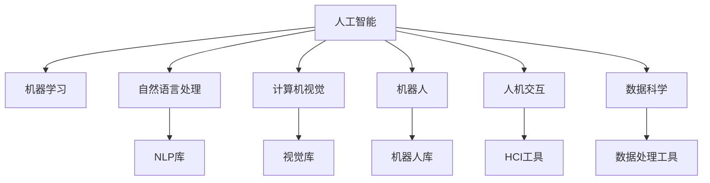

                 

# 人机协同：未来工作的核心驱动力

> 关键词：人工智能,机器学习,人机协同,工作自动化,机器智能,数据驱动,人机协作

## 1. 背景介绍

### 1.1 问题由来
随着人工智能技术的飞速发展，机器学习、自然语言处理、计算机视觉等技术已经广泛应用于各行各业。特别是在智能制造、智慧城市、自动驾驶等领域，AI正逐步改变着我们的工作方式和生产效率。然而，机器智能与人类智慧的结合，是否能够实现真正的“人机协同”，成为当前技术界和业界的热点话题。

### 1.2 问题核心关键点
未来工作场景中的人机协同，旨在通过人机互动、合作、互补，实现更高效、更精确、更创新的工作目标。其核心关键点包括：
- 自动化与智能化：利用AI技术提升工作的自动化程度，减少重复性、体力劳动。
- 增强人类能力：通过机器辅助，帮助人类在复杂的决策、创新性任务中发挥更大作用。
- 跨界融合：不同领域、不同行业的AI应用可以相互借鉴、整合，实现更广泛的技术协同。
- 高效协同：机器与人的交互界面设计，确保操作简便、协同顺畅。
- 数据驱动：利用大数据、机器学习等技术，提升决策的科学性和准确性。

### 1.3 问题研究意义
人机协同作为未来工作的核心驱动力，具有重要的研究意义：

1. 提高工作效率：通过自动化和智能化，减少重复性劳动，提升工作质量与效率。
2. 优化资源配置：智能化的决策支持系统，可以实现资源的最优配置，降低成本。
3. 促进知识共享：AI系统可以存储、处理大量信息，加速知识传播与创新。
4. 改善用户体验：AI技术的应用，可以提供个性化服务，提升用户体验。
5. 推动行业创新：人机协同在各个行业的渗透应用，可以推动产业升级与创新。

## 2. 核心概念与联系

### 2.1 核心概念概述

为人机协同技术，本节将介绍几个密切相关的核心概念：

- 人工智能(Artificial Intelligence, AI)：通过算法、计算、数据处理等手段，模拟人类的智能行为，使机器具备一定的感知、学习、决策能力。
- 机器学习(Machine Learning, ML)：利用数据训练算法模型，使机器具备从数据中学习规律，进行预测、分类、聚类等任务的能力。
- 自然语言处理(Natural Language Processing, NLP)：使机器能够理解、处理、生成自然语言，实现人机交互。
- 计算机视觉(Computer Vision, CV)：使机器能够“看”和“理解”图像、视频等视觉信息，进行图像识别、目标检测等任务。
- 机器人(Robotics)：结合机械、电子、控制技术，实现自主移动、操作、执行任务的智能机器。
- 人机交互(Human-Computer Interaction, HCI)：研究人与计算机交互的原理、方法、技术，提升人机协同的效率和体验。
- 数据科学(Data Science)：通过数据挖掘、统计分析、机器学习等技术，进行数据驱动的决策与优化。

这些核心概念之间的逻辑关系可以通过以下Mermaid流程图来展示：



这个流程图展示了一个AI系统的核心组件及其相互关系：

1. 人工智能作为核心，包含机器学习、NLP、CV、机器人等技术模块。
2. 人机交互与人机协同紧密相连，是实现智能化应用的重要界面。
3. 数据科学为AI系统提供了数据支持，是训练模型的重要基础。

## 3. 核心算法原理 & 具体操作步骤
### 3.1 算法原理概述

人机协同的核心在于，通过机器学习算法，构建能够理解、处理人类指令的系统，并能够根据上下文进行智能决策。其核心算法包括：

- 感知学习(Perception Learning)：使机器能够从视觉、听觉、语言等多种感官输入中，准确获取信息。
- 语言理解(Language Understanding)：通过自然语言处理技术，使机器能够理解、生成自然语言。
- 决策推理(Decision Reasoning)：利用逻辑推理、统计分析等方法，进行决策与规划。
- 动作执行(Action Execution)：使机器能够根据决策结果，执行相应的动作。

人机协同的技术流程可以概括为以下几个步骤：

1. 数据获取与预处理。
2. 特征提取与表示。
3. 模型训练与优化。
4. 交互界面设计。
5. 协同交互与反馈。

### 3.2 算法步骤详解

#### 1. 数据获取与预处理

数据获取是实现人机协同的基础。需要收集不同类型的数据，如文本、图像、视频、语音等。这些数据需要经过清洗、标注、归一化等预处理，以提高后续算法的准确性。

以文本数据为例，数据预处理步骤包括：

- 文本清洗：去除无用字符、停用词、噪音等，提高数据质量。
- 分词与标注：将文本进行分词，标注词性、实体等信息。
- 数据增强：通过同义词替换、数据扩充等技术，丰富训练样本。
- 数据归一化：将不同长度的文本归一化到相同长度，便于后续处理。

#### 2. 特征提取与表示

特征提取是机器学习的重要环节。需要将原始数据转换为机器可以理解和处理的形式，如数值化、向量表示等。常见的特征提取方法包括：

- Bag of Words: 将文本转换为词频向量，反映单词出现的频率。
- TF-IDF: 结合词频和逆文档频率，提高关键词的区分度。
- Word Embedding: 将单词映射到低维向量空间，保留语义信息。
- Convolutional Neural Networks(CNN): 用于图像特征提取，提取局部特征。
- Recurrent Neural Networks(RNN): 用于序列数据特征提取，捕捉时间序列信息。

#### 3. 模型训练与优化

模型训练是实现人机协同的关键步骤。需要选择合适的算法，利用训练集进行模型训练，并通过验证集调整模型参数。常见的训练算法包括：

- 监督学习(Supervised Learning): 利用有标签数据进行模型训练，如分类、回归、序列预测等。
- 无监督学习(Unsupervised Learning): 利用无标签数据进行模型训练，如聚类、降维、特征提取等。
- 半监督学习(Semi-supervised Learning): 结合少量有标签数据和大量无标签数据进行模型训练。
- 强化学习(Reinforcement Learning): 通过奖励反馈，训练智能体执行最优策略。

#### 4. 交互界面设计

交互界面设计是人机协同的重要环节。需要设计简洁、高效、易用的界面，方便用户进行操作。常见的界面设计方法包括：

- GUI界面设计：利用图形界面，提供直观的交互体验。
- 语音交互设计：利用语音识别和合成技术，实现语音输入输出。
- 自然语言交互设计：利用NLP技术，实现自然语言输入输出。
- 手势交互设计：利用传感器和图像处理技术，实现手势控制。

#### 5. 协同交互与反馈

协同交互是人机协同的核心目标。需要设计合理的交互机制，实现人机间的即时沟通与协作。常见的协同交互机制包括：

- 多模态交互：结合视觉、听觉、触觉等多种感官输入，提高交互效率。
- 智能决策：利用机器学习算法，进行智能化决策与执行。
- 用户反馈：根据用户反馈，实时调整算法和模型参数，提高用户体验。
- 知识共享：利用知识库和数据共享，提升协同效率。

### 3.3 算法优缺点

人机协同技术具有以下优点：

1. 提高效率：通过自动化和智能化，减少重复性劳动，提升工作效率。
2. 优化决策：利用数据驱动和算法优化，提高决策的科学性和准确性。
3. 降低成本：通过自动化和智能化，减少人工操作和错误，降低生产成本。
4. 增强人机互动：通过人机协同，提升用户体验和满意度。
5. 推动创新：利用智能化技术，激发新的创意和应用场景。

同时，人机协同技术也存在一些缺点：

1. 依赖数据质量：数据质量和预处理对协同效果有很大影响，数据不足或质量差会降低效果。
2. 算法复杂度高：机器学习算法复杂度高，需要大量计算资源和时间进行训练和优化。
3. 技术瓶颈：现有技术在复杂任务和特定场景下仍存在局限，需要进一步突破。
4. 人机交互复杂：设计合理的人机交互界面，需要考虑用户需求和体验，存在一定的挑战。
5. 伦理与安全问题：智能化技术可能带来伦理和安全问题，如隐私保护、算法偏见等。

### 3.4 算法应用领域

人机协同技术已经广泛应用于多个领域，包括：

- 智能制造：利用机器视觉、机器人技术，实现自动化生产。
- 智慧城市：通过智能交通、安防、医疗等系统，提升城市治理水平。
- 自动驾驶：结合计算机视觉、传感器、深度学习等技术，实现自动驾驶。
- 虚拟助手：利用自然语言处理和智能决策，实现个性化助手服务。
- 智能客服：通过智能对话系统和推荐算法，提升客户服务质量。
- 健康医疗：利用智能诊断、个性化治疗等技术，提升医疗服务水平。
- 教育培训：利用智能推荐、在线辅导等技术，提升教育效果。

除了上述这些应用外，人机协同技术还将进一步渗透到更多场景中，为各行各业带来变革性影响。

## 4. 数学模型和公式 & 详细讲解 & 举例说明

### 4.1 数学模型构建

人机协同的技术模型可以通过数学语言进行严格刻画。

以智能客服系统为例，假设系统由文本分类、意图识别、对话生成等模块组成。定义输入为$x \in \mathbb{R}^n$，输出为$y \in \{0,1\}$，系统模型为$h: \mathbb{R}^n \rightarrow \mathbb{R}$。

训练过程可描述为：

1. 特征提取：将输入文本$x$转化为数值特征向量$x' \in \mathbb{R}^d$。
2. 模型训练：利用训练数据$D=\{(x_i,y_i)\}_{i=1}^N$，优化模型参数$\theta$，使得$h(x')$逼近$y$。
3. 预测输出：利用测试数据$D'$，计算模型预测输出$\hat{y} = \sigma(h(x'))$，其中$\sigma$为激活函数。
4. 评价指标：利用精度、召回率、F1值等指标评估模型性能。

数学模型可以表示为：

$$
h(x') = \theta^T\phi(x')
$$

其中$\theta \in \mathbb{R}^m$为模型参数，$\phi: \mathbb{R}^n \rightarrow \mathbb{R}^m$为特征映射函数。

### 4.2 公式推导过程

以文本分类为例，推导交叉熵损失函数及其梯度的计算公式。

假设模型$h$在输入$x$上的输出为$\hat{y} \in [0,1]$，表示样本属于正类的概率。真实标签$y \in \{0,1\}$。则二分类交叉熵损失函数定义为：

$$
\ell(h(x),y) = -[y\log h(x)+(1-y)\log(1-h(x))]
$$

将其代入经验风险公式，得：

$$
\mathcal{L}(\theta) = -\frac{1}{N}\sum_{i=1}^N [y_i\log h(x_i)+(1-y_i)\log(1-h(x_i))]
$$

根据链式法则，损失函数对参数$\theta_k$的梯度为：

$$
\frac{\partial \mathcal{L}(\theta)}{\partial \theta_k} = -\frac{1}{N}\sum_{i=1}^N (\frac{y_i}{h(x_i)}-\frac{1-y_i}{1-h(x_i)}) \frac{\partial h(x_i)}{\partial \theta_k}
$$

其中$\frac{\partial h(x_i)}{\partial \theta_k}$可进一步递归展开，利用自动微分技术完成计算。

在得到损失函数的梯度后，即可带入参数更新公式，完成模型的迭代优化。重复上述过程直至收敛，最终得到适应下游任务的最优模型参数$\theta^*$。

### 4.3 案例分析与讲解

以智能客服系统为例，详细讲解模型的构建和优化过程。

1. 数据获取与预处理：收集客户咨询的历史文本数据，进行清洗、标注和归一化处理。
2. 特征提取与表示：利用词袋模型或Word Embedding技术，将文本转化为数值特征向量。
3. 模型训练与优化：选择合适算法（如逻辑回归、决策树、神经网络等），利用训练数据进行模型训练和优化。
4. 交互界面设计：设计简洁易用的界面，方便客户输入咨询内容。
5. 协同交互与反馈：将模型预测输出与客户反馈结合，不断优化模型性能。

## 5. 项目实践：代码实例和详细解释说明

### 5.1 开发环境搭建

在进行人机协同实践前，我们需要准备好开发环境。以下是使用Python进行TensorFlow开发的环境配置流程：

1. 安装Anaconda：从官网下载并安装Anaconda，用于创建独立的Python环境。

2. 创建并激活虚拟环境：
```bash
conda create -n tf-env python=3.8 
conda activate tf-env
```

3. 安装TensorFlow：根据CUDA版本，从官网获取对应的安装命令。例如：
```bash
conda install tensorflow -c tf -c conda-forge
```

4. 安装相关库：
```bash
pip install pandas numpy scikit-learn tensorflow estimator tflearn
```

5. 安装可视化工具：
```bash
pip install matplotlib
```

完成上述步骤后，即可在`tf-env`环境中开始人机协同实践。

### 5.2 源代码详细实现

这里以智能客服系统为例，给出使用TensorFlow进行文本分类的PyTorch代码实现。

首先，定义文本分类的数据处理函数：

```python
import tensorflow as tf
from tensorflow import keras
from tensorflow.keras.preprocessing.text import Tokenizer
from tensorflow.keras.preprocessing.sequence import pad_sequences

# 加载数据集
train_data = ('文本1', '文本2', ...)
train_labels = (1, 0, 1, ...)

# 数据预处理
tokenizer = Tokenizer(num_words=10000)
tokenizer.fit_on_texts(train_data)
sequences = tokenizer.texts_to_sequences(train_data)
padded_sequences = pad_sequences(sequences, maxlen=100, padding='post', truncating='post')

# 定义模型
model = keras.Sequential([
    keras.layers.Embedding(input_dim=10000, output_dim=32),
    keras.layers.Conv1D(64, 3, activation='relu'),
    keras.layers.GlobalMaxPooling1D(),
    keras.layers.Dense(1, activation='sigmoid')
])

# 编译模型
model.compile(optimizer='adam', loss='binary_crossentropy', metrics=['accuracy'])

# 训练模型
model.fit(padded_sequences, train_labels, epochs=10, validation_split=0.2)
```

然后，定义交互界面：

```python
from flask import Flask, request, jsonify

app = Flask(__name__)

@app.route('/predict', methods=['POST'])
def predict():
    data = request.json
    text = data['text']
    sequence = tokenizer.texts_to_sequences([text])
    padded_sequence = pad_sequences(sequence, maxlen=100, padding='post', truncating='post')
    result = model.predict(padded_sequence)
    return jsonify({'prediction': result[0]})

if __name__ == '__main__':
    app.run(debug=True)
```

最后，启动服务：

```bash
python app.py
```

在浏览器中输入`http://127.0.0.1:5000/predict`，即可进行文本分类的预测。

### 5.3 代码解读与分析

让我们再详细解读一下关键代码的实现细节：

**文本分类代码**：
- `Tokenizer`：用于将文本转换为数值序列。
- `pad_sequences`：将不同长度的文本序列填充到相同长度，方便输入模型。
- `Sequential`：利用Keras搭建线性神经网络模型。
- `compile`：定义模型优化器和损失函数，并进行编译。
- `fit`：利用训练数据进行模型训练。

**交互界面代码**：
- `Flask`：搭建Web应用，处理请求和响应。
- `@app.route`：定义路由，指定预测接口。
- `request.json`：从客户端获取JSON数据。
- `texts_to_sequences`：将文本转换为序列。
- `pad_sequences`：处理序列长度。
- `model.predict`：进行模型预测。

通过以上代码，可以看出TensorFlow和Keras在搭建和训练人机协同模型的便捷性。

## 6. 实际应用场景

### 6.1 智能客服系统

智能客服系统通过人机协同，可以实现7x24小时不间断服务，快速响应客户咨询，提升客户满意度。在技术实现上，可以收集企业内部的历史客服对话记录，将问题和最佳答复构建成监督数据，在此基础上对预训练模型进行微调。微调后的模型能够自动理解用户意图，匹配最合适的答案模板进行回复。对于客户提出的新问题，还可以接入检索系统实时搜索相关内容，动态组织生成回答。如此构建的智能客服系统，能大幅提升客户咨询体验和问题解决效率。

### 6.2 金融舆情监测

金融机构需要实时监测市场舆论动向，以便及时应对负面信息传播，规避金融风险。传统的人工监测方式成本高、效率低，难以应对网络时代海量信息爆发的挑战。基于人机协同的文本分类和情感分析技术，为金融舆情监测提供了新的解决方案。

具体而言，可以收集金融领域相关的新闻、报道、评论等文本数据，并对其进行主题标注和情感标注。在此基础上对预训练语言模型进行微调，使其能够自动判断文本属于何种主题，情感倾向是正面、中性还是负面。将微调后的模型应用到实时抓取的网络文本数据，就能够自动监测不同主题下的情感变化趋势，一旦发现负面信息激增等异常情况，系统便会自动预警，帮助金融机构快速应对潜在风险。

### 6.3 个性化推荐系统

当前的推荐系统往往只依赖用户的历史行为数据进行物品推荐，无法深入理解用户的真实兴趣偏好。基于人机协同的个性化推荐系统，可以利用NLP技术，分析用户评论、反馈等信息，挖掘用户的兴趣点。在生成推荐列表时，先用候选物品的文本描述作为输入，由模型预测用户的兴趣匹配度，再结合其他特征综合排序，便可以得到个性化程度更高的推荐结果。

### 6.4 未来应用展望

随着人机协同技术的不断发展，其在更多领域的应用前景愈加广阔。

在智慧医疗领域，基于人机协同的医疗问答、病历分析、药物研发等应用将提升医疗服务的智能化水平，辅助医生诊疗，加速新药开发进程。

在智能教育领域，人机协同可应用于作业批改、学情分析、知识推荐等方面，因材施教，促进教育公平，提高教学质量。

在智慧城市治理中，人机协同技术可应用于城市事件监测、舆情分析、应急指挥等环节，提高城市管理的自动化和智能化水平，构建更安全、高效的未来城市。

此外，在人机协同技术在企业生产、社会治理、文娱传媒等众多领域，AI应用也将不断涌现，为NLP技术带来了全新的突破。随着技术的日益成熟，人机协同必将在构建人机协同的智能时代中扮演越来越重要的角色。

## 7. 工具和资源推荐
### 7.1 学习资源推荐

为了帮助开发者系统掌握人机协同的理论基础和实践技巧，这里推荐一些优质的学习资源：

1. 《机器学习》课程：斯坦福大学开设的机器学习课程，系统讲解了机器学习的基础概念和算法。

2. 《深度学习》课程：吴恩达的深度学习课程，详细介绍了深度学习模型的构建与优化。

3. 《自然语言处理》课程：CMU大学开设的自然语言处理课程，介绍了NLP技术的核心思想和应用场景。

4. 《人机交互设计》课程：麻省理工学院的人机交互设计课程，介绍了人机交互的界面设计原理和方法。

5. 《TensorFlow官方文档》：TensorFlow的官方文档，提供了全面的API文档和开发指南。

6. Kaggle：数据科学竞赛平台，提供丰富的数据集和机器学习竞赛，帮助开发者提升实战能力。

通过对这些资源的学习实践，相信你一定能够快速掌握人机协同的核心技术和实践方法。

### 7.2 开发工具推荐

高效的开发离不开优秀的工具支持。以下是几款用于人机协同开发的常用工具：

1. TensorFlow：由Google主导开发的开源深度学习框架，生产部署方便，适合大规模工程应用。

2. Keras：基于TensorFlow等后端的高级神经网络API，提供了便捷的模型构建与训练功能。

3. PyTorch：Facebook开发的深度学习框架，灵活高效，适合学术研究和快速迭代。

4. TensorBoard：TensorFlow配套的可视化工具，可实时监测模型训练状态，提供丰富的图表呈现方式。

5. Weights & Biases：模型训练的实验跟踪工具，可以记录和可视化模型训练过程中的各项指标，方便对比和调优。

6. Jupyter Notebook：开源的交互式编程环境，支持Python等语言，提供丰富的代码块和数据可视化功能。

合理利用这些工具，可以显著提升人机协同任务的开发效率，加快创新迭代的步伐。

### 7.3 相关论文推荐

人机协同作为未来工作的核心驱动力，其相关研究涉及多个领域，以下是几篇奠基性的相关论文，推荐阅读：

1. AlphaGo：通过深度强化学习，实现围棋冠军级水平的智能决策。

2. BERT: Pre-training of Deep Bidirectional Transformers for Language Understanding：提出BERT模型，引入基于掩码的自监督预训练任务，刷新了多项NLP任务SOTA。

3. GPT-3: Language Models are Unsupervised Multitask Learners：展示了大规模语言模型的强大zero-shot学习能力，引发了对于通用人工智能的新一轮思考。

4. Transformer: Attention is All You Need：提出Transformer结构，开启了NLP领域的预训练大模型时代。

5. RNNs, Sequence Models and Learning to Execute：介绍递归神经网络模型，用于序列数据的特征提取。

这些论文代表了大模型协同技术的发展脉络。通过学习这些前沿成果，可以帮助研究者把握学科前进方向，激发更多的创新灵感。

## 8. 总结：未来发展趋势与挑战

### 8.1 总结

本文对基于机器学习的人机协同技术进行了全面系统的介绍。首先阐述了人机协同技术的背景和意义，明确了其作为未来工作核心驱动力的重要地位。其次，从原理到实践，详细讲解了人机协同的数学模型和关键步骤，给出了人机协同任务开发的完整代码实例。同时，本文还广泛探讨了人机协同技术在智能客服、金融舆情、个性化推荐等多个行业领域的应用前景，展示了其广阔的应用潜力。

通过本文的系统梳理，可以看到，基于机器学习的人机协同技术正在成为NLP领域的重要范式，极大地拓展了智能系统的应用边界，催生了更多的落地场景。受益于深度学习和大数据的推动，人机协同技术在未来将有望取得更大的突破，带来更深远的影响。

### 8.2 未来发展趋势

展望未来，人机协同技术将呈现以下几个发展趋势：

1. 多模态融合：将视觉、听觉、触觉等多种模态数据融合，提升人机交互的丰富性和效率。

2. 智能决策：利用深度学习、强化学习等技术，提升智能决策的准确性和鲁棒性。

3. 实时性增强：通过优化模型结构，提升计算效率，实现更实时、更高效的人机协同系统。

4. 跨界应用：人机协同技术将广泛应用于更多领域，如医疗、教育、交通等，推动各行各业的数字化转型。

5. 数据驱动：通过大数据、云计算等技术，实现数据驱动的智能化决策与优化。

6. 个性化定制：利用用户数据，实现更加个性化的服务与体验。

7. 伦理与安全：在算法设计中引入伦理导向的评估指标，确保人机协同系统的安全性与公平性。

这些趋势凸显了人机协同技术的广阔前景。这些方向的探索发展，必将进一步提升人机协同系统的智能化水平，为构建更加高效、可靠、可控的智能系统铺平道路。

### 8.3 面临的挑战

尽管人机协同技术已经取得了显著进展，但在迈向更加智能化、普适化应用的过程中，仍面临诸多挑战：

1. 数据质量和预处理：高质量的数据是实现人机协同的基础，但数据获取和预处理仍然存在一定的难度。

2. 算法复杂度高：人机协同涉及多个算法模块，算法复杂度高，需要大量计算资源和时间进行训练和优化。

3. 人机交互设计：设计合理的人机交互界面，需要考虑用户需求和体验，存在一定的挑战。

4. 伦理与安全问题：智能化技术可能带来伦理和安全问题，如隐私保护、算法偏见等。

5. 资源和硬件瓶颈：大规模人机协同系统需要高计算能力和高性能硬件支持，存在一定的瓶颈。

6. 跨领域应用：人机协同技术在不同领域的应用，需要考虑领域特定的需求和技术瓶颈。

这些挑战需要进一步研究和突破，才能实现人机协同技术的全面落地和应用。

### 8.4 研究展望

未来研究在人机协同技术领域还需要在以下几个方面寻求新的突破：

1. 多模态融合：研究如何将视觉、听觉、触觉等多种模态数据融合，提升人机交互的丰富性和效率。

2. 智能决策：利用深度学习、强化学习等技术，提升智能决策的准确性和鲁棒性。

3. 实时性增强：优化模型结构，提升计算效率，实现更实时、更高效的人机协同系统。

4. 跨界应用：人机协同技术将广泛应用于更多领域，如医疗、教育、交通等，推动各行各业的数字化转型。

5. 数据驱动：通过大数据、云计算等技术，实现数据驱动的智能化决策与优化。

6. 个性化定制：利用用户数据，实现更加个性化的服务与体验。

7. 伦理与安全：在算法设计中引入伦理导向的评估指标，确保人机协同系统的安全性与公平性。

这些研究方向将引领人机协同技术迈向更高的台阶，为构建安全、可靠、可解释、可控的智能系统铺平道路。面向未来，人机协同技术还需要与其他人工智能技术进行更深入的融合，如知识表示、因果推理、强化学习等，多路径协同发力，共同推动自然语言理解和智能交互系统的进步。只有勇于创新、敢于突破，才能不断拓展语言模型的边界，让智能技术更好地造福人类社会。

## 9. 附录：常见问题与解答

**Q1：人机协同技术是否适用于所有行业？**

A: 人机协同技术在多数行业都具备广泛的应用前景，尤其是在自动化程度高、数据量大的领域，如制造业、金融、医疗、教育等。但在一些特定领域，如农业、艺术等，可能需要针对性地进行技术适配和改进。

**Q2：人机协同如何保证系统的安全性？**

A: 人机协同系统需要在设计和实现中引入伦理导向的评估指标，如隐私保护、算法偏见等，确保系统的安全性与公平性。同时，需要通过定期的监控和维护，及时发现并修复潜在的安全漏洞。

**Q3：人机协同系统如何实现个性化定制？**

A: 利用用户数据，通过深度学习算法进行建模，实现对用户行为的预测和推荐。同时，可以引入自然语言处理技术，提升用户界面的人性化体验。

**Q4：人机协同系统如何提升决策的科学性？**

A: 利用大数据、机器学习等技术，进行数据驱动的决策与优化。通过模型训练和调优，提高决策的准确性和鲁棒性。同时，可以通过多模态融合、智能决策等技术，提升决策的全面性和科学性。

**Q5：人机协同系统如何提升用户体验？**

A: 设计简洁、高效、易用的界面，方便用户进行操作。通过人机协同，提升用户的操作效率和满意度。同时，利用个性化推荐、智能客服等技术，提升用户体验。

---

作者：禅与计算机程序设计艺术 / Zen and the Art of Computer Programming

