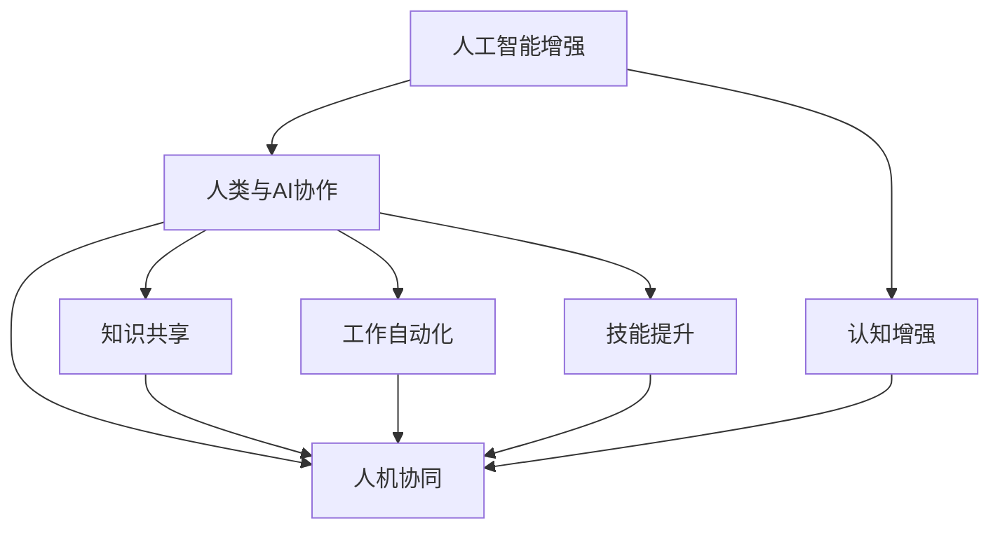

                 

# 人类-AI协作：增强人类智力

> 关键词：人工智能增强,人类与AI协作,认知增强,人机协同,知识共享,工作自动化,技能提升

## 1. 背景介绍

### 1.1 问题由来
人工智能（AI）技术正以前所未有的速度发展，从初期的机器学习、深度学习，到如今的生成对抗网络、强化学习，AI已广泛应用于图像识别、自然语言处理、语音识别、推荐系统等多个领域。然而，尽管AI在许多领域已展现出卓越的性能，但它终究是一种工具，其核心价值在于通过数据和算法增强人类的智力和决策能力，而非取代人类。因此，如何通过AI与人类协作，最大化提升人类的智力和效率，成为了当前研究的重点。

### 1.2 问题核心关键点
当前AI与人类协作的研究重点在于以下几个方面：
- **认知增强**：通过AI工具提升人类的认知能力，如记忆、推理、注意力等。
- **知识共享**：构建高效的知识共享平台，实现人类知识与AI模型间的无缝对接。
- **人机协同**：通过AI技术辅助人类进行复杂任务，如数据分析、医疗诊断、机器人操作等。
- **工作自动化**：利用AI自动化处理重复性、高风险、高精度要求的工作，释放人类精力。
- **技能提升**：提供个性化的AI培训，帮助人类快速掌握新技能，提升工作效能。

这些核心关键点共同构成了AI与人类协作的研究框架，旨在通过技术手段提升人类的整体智能水平。通过理解这些关键点，我们可以更好地把握AI与人类协作的研究方向和应用场景。

## 2. 核心概念与联系

### 2.1 核心概念概述

为更好地理解AI与人类协作的原理，本节将介绍几个关键概念及其相互联系：

- **人工智能增强（AI增强）**：指通过AI技术辅助人类提升智力、效率和决策能力的过程。AI增强不仅局限于技术手段，还包括心理、行为等方面的改善。

- **人类与AI协作**：指人类与AI系统在任务执行过程中进行协同合作，相互补充、相互增强的合作关系。AI提供强大的计算和分析能力，人类提供情境理解、伦理判断和决策执行能力。

- **认知增强**：指通过AI技术提升人类的认知功能，包括记忆、注意力、推理等。认知增强技术如深度学习、自然语言处理等，在提升人类认知能力方面展现出巨大潜力。

- **人机协同**：指AI与人类在处理任务过程中的协同合作，实现1+1>2的效果。人机协同涉及任务的分配、协调、监控等多个环节。

- **知识共享**：指构建知识共享平台，实现人类知识与AI模型间的传递与利用。知识共享促进了知识的累积、传承与创新。

- **工作自动化**：指利用AI自动化处理重复性、高风险、高精度要求的工作，提高工作效率，减少人为错误。

- **技能提升**：指通过AI辅助培训，帮助人类快速掌握新技能，提升职业竞争力。

这些概念之间的逻辑关系可以通过以下Mermaid流程图来展示：



这个流程图展示了AI增强与人类协作中的主要概念及其相互关系：

1. 认知增强、知识共享、工作自动化和技能提升都是AI增强的重要组成部分，通过提升人类的认知和技能，实现AI与人类协作的最大化效果。
2. 人机协同是AI增强的核心目标，通过AI提供的技术支持和人类提供的智能判断，实现任务的协同处理和最优决策。
3. 人类与AI协作是一个动态的、双向的过程，不仅包括AI技术对人类的增强，还包括人类对AI的监督、指导和优化。

## 3. 核心算法原理 & 具体操作步骤

### 3.1 算法原理概述

AI与人类协作的核心在于实现认知增强和协同处理。其基本原理包括以下几个方面：

1. **数据驱动**：通过收集和分析大量人类数据，构建知识库和规则库，为AI提供决策依据。
2. **模型优化**：利用机器学习、深度学习等技术，训练和优化AI模型，使其能够高效、准确地处理复杂任务。
3. **交互学习**：在任务执行过程中，AI与人类通过互动学习，不断调整和优化自身行为，实现协同最优。
4. **反馈机制**：建立有效的反馈机制，及时调整AI行为，确保其与人类协作的顺畅进行。

### 3.2 算法步骤详解

基于AI与人类协作的算法原理，通常包括以下几个关键步骤：

**Step 1: 数据收集与预处理**
- 收集与任务相关的多维度数据，包括文本、图像、视频、音频等多种类型的数据。
- 对数据进行清洗、归一化、标注等预处理，确保数据质量和一致性。

**Step 2: 知识库构建与模型训练**
- 构建知识库和规则库，将人类专家经验、历史数据等知识结构化，为AI提供决策依据。
- 利用机器学习、深度学习等技术，训练和优化AI模型，确保其能够高效、准确地处理任务。

**Step 3: 交互学习与优化**
- 设计人机交互界面，实现人类与AI之间的互动。
- 在任务执行过程中，AI根据反馈不断调整自身行为，人类根据AI的输出进行监督和指导。
- 利用强化学习等技术，优化AI行为，提升人机协同效率。

**Step 4: 反馈机制与持续优化**
- 建立有效的反馈机制，及时调整AI行为，确保其与人类协作的顺畅进行。
- 通过定期评估和迭代，不断优化AI模型和协同机制，提升整体性能。

**Step 5: 部署与应用**
- 将训练好的AI模型部署到实际应用场景中，实现任务处理。
- 持续收集用户反馈和任务数据，优化AI行为和协作机制，实现持续改进。

### 3.3 算法优缺点

AI与人类协作的算法具有以下优点：
1. **提升效率**：通过AI自动化处理重复性、高风险、高精度要求的工作，极大提高工作效率。
2. **提升准确性**：利用AI强大的计算和分析能力，提升任务的准确性和可靠性。
3. **灵活性**：AI与人类协作能够根据任务需求灵活调整，适应不同的应用场景。
4. **持续改进**：通过人机互动和学习，AI能够不断优化自身行为，提升协同效果。

同时，该算法也存在一定的局限性：
1. **数据依赖**：AI与人类协作依赖大量高质量的数据，数据收集和标注成本较高。
2. **模型复杂性**：构建高质量的AI模型需要复杂的算法和大量的计算资源，对技术要求较高。
3. **伦理风险**：AI与人类协作可能涉及伦理和安全问题，如隐私保护、决策透明性等。
4. **依赖人类**：AI系统仍需要人类进行监督和指导，难以完全替代人类。

尽管存在这些局限性，但AI与人类协作在提高生产效率、提升决策质量等方面具有显著优势，未来将在更多领域得到广泛应用。

### 3.4 算法应用领域

AI与人类协作的算法在多个领域得到了广泛应用，主要包括：

1. **医疗健康**：通过AI辅助诊断、个性化治疗、医疗机器人等，提升医疗服务的效率和质量。
2. **金融服务**：利用AI进行风险评估、反欺诈检测、智能投顾等，提升金融服务的精准度和安全性。
3. **制造业**：通过AI进行质量检测、生产调度、供应链优化等，提高制造业的生产效率和产品质量。
4. **教育培训**：利用AI进行个性化教育、智能辅导、作业批改等，提升教育培训的针对性和效果。
5. **城市管理**：通过AI进行智能交通管理、环境监测、公共安全监控等，提升城市管理水平和效率。
6. **创意产业**：利用AI进行内容创作、设计辅助、创意推荐等，激发创意产业的创新潜力。

除了上述这些领域，AI与人类协作的算法还在更多行业得到应用，推动各行业的数字化转型和智能化升级。

## 4. 数学模型和公式 & 详细讲解 & 举例说明

### 4.1 数学模型构建

本节将使用数学语言对AI与人类协作的算法进行更加严格的刻画。

假设任务 $T$ 的数据集为 $D=\{(x_i, y_i)\}_{i=1}^N$，其中 $x_i$ 为输入，$y_i$ 为标签。设AI模型为 $M_{\theta}$，其中 $\theta$ 为模型参数。

定义AI模型在数据样本 $(x,y)$ 上的损失函数为 $\ell(M_{\theta}(x),y)$，则在数据集 $D$ 上的经验风险为：

$$
\mathcal{L}(\theta) = \frac{1}{N} \sum_{i=1}^N \ell(M_{\theta}(x_i),y_i)
$$

AI与人类协作的目标是最小化经验风险，即找到最优参数：

$$
\theta^* = \mathop{\arg\min}_{\theta} \mathcal{L}(\theta)
$$

在实践中，我们通常使用基于梯度的优化算法（如SGD、Adam等）来近似求解上述最优化问题。设 $\eta$ 为学习率，则参数的更新公式为：

$$
\theta \leftarrow \theta - \eta \nabla_{\theta}\mathcal{L}(\theta)
$$

其中 $\nabla_{\theta}\mathcal{L}(\theta)$ 为损失函数对参数 $\theta$ 的梯度，可通过反向传播算法高效计算。

### 4.2 公式推导过程

以下我们以二分类任务为例，推导交叉熵损失函数及其梯度的计算公式。

假设AI模型 $M_{\theta}$ 在输入 $x$ 上的输出为 $\hat{y}=M_{\theta}(x) \in [0,1]$，表示样本属于正类的概率。真实标签 $y \in \{0,1\}$。则二分类交叉熵损失函数定义为：

$$
\ell(M_{\theta}(x),y) = -[y\log \hat{y} + (1-y)\log (1-\hat{y})]
$$

将其代入经验风险公式，得：

$$
\mathcal{L}(\theta) = -\frac{1}{N}\sum_{i=1}^N [y_i\log M_{\theta}(x_i)+(1-y_i)\log(1-M_{\theta}(x_i))]
$$

根据链式法则，损失函数对参数 $\theta_k$ 的梯度为：

$$
\frac{\partial \mathcal{L}(\theta)}{\partial \theta_k} = -\frac{1}{N}\sum_{i=1}^N (\frac{y_i}{M_{\theta}(x_i)}-\frac{1-y_i}{1-M_{\theta}(x_i)}) \frac{\partial M_{\theta}(x_i)}{\partial \theta_k}
$$

其中 $\frac{\partial M_{\theta}(x_i)}{\partial \theta_k}$ 可进一步递归展开，利用自动微分技术完成计算。

在得到损失函数的梯度后，即可带入参数更新公式，完成模型的迭代优化。重复上述过程直至收敛，最终得到适应下游任务的最优模型参数 $\theta^*$。

## 5. 项目实践：代码实例和详细解释说明

### 5.1 开发环境搭建

在进行AI与人类协作的实践前，我们需要准备好开发环境。以下是使用Python进行TensorFlow开发的环境配置流程：

1. 安装Anaconda：从官网下载并安装Anaconda，用于创建独立的Python环境。

2. 创建并激活虚拟环境：
```bash
conda create -n tf-env python=3.8 
conda activate tf-env
```

3. 安装TensorFlow：根据CUDA版本，从官网获取对应的安装命令。例如：
```bash
conda install tensorflow
```

4. 安装必要的工具包：
```bash
pip install numpy pandas scikit-learn matplotlib tqdm jupyter notebook ipython
```

完成上述步骤后，即可在`tf-env`环境中开始AI与人类协作的实践。

### 5.2 源代码详细实现

下面我们以二分类任务为例，给出使用TensorFlow实现AI与人类协作的代码实现。

首先，定义二分类任务的数据处理函数：

```python
import tensorflow as tf
import numpy as np

def load_data():
    # 加载训练集和测试集
    train_data = np.loadtxt('train_data.txt', delimiter=',')
    test_data = np.loadtxt('test_data.txt', delimiter=',')
    
    # 划分训练集和验证集
    train_size = int(0.8 * len(train_data))
    train_x, test_x = train_data[:, :-1], train_data[:, -1]
    train_x, val_x = train_x[:train_size], train_x[train_size:]
    
    return train_x, val_x, test_x

# 数据预处理
def preprocess_data(data):
    data = data / 255.0  # 归一化像素值
    data = data.reshape(-1, 28, 28)  # 调整数据形状
    return data

# 加载和预处理数据
train_x, val_x, test_x = load_data()
train_x = preprocess_data(train_x)
val_x = preprocess_data(val_x)
test_x = preprocess_data(test_x)

# 构建模型
model = tf.keras.models.Sequential([
    tf.keras.layers.Flatten(input_shape=(28, 28)),
    tf.keras.layers.Dense(128, activation='relu'),
    tf.keras.layers.Dense(1, activation='sigmoid')
])

# 编译模型
model.compile(optimizer=tf.keras.optimizers.Adam(learning_rate=0.001),
              loss='binary_crossentropy',
              metrics=['accuracy'])

# 训练模型
model.fit(train_x, train_x[:, -1], epochs=10, batch_size=32, validation_data=(val_x, val_x[:, -1]))

# 评估模型
test_loss, test_acc = model.evaluate(test_x, test_x[:, -1], verbose=0)
print('Test loss:', test_loss)
print('Test accuracy:', test_acc)
```

然后，定义人机交互界面：

```python
def interactive_interface():
    while True:
        # 获取用户输入
        input_str = input('请输入一个0-1之间的数值：')
        input_val = float(input_str)
        
        # 预处理输入
        input_val = (input_val - 0.5) * 2  # 标准化处理
        
        # 获取模型输出
        output_val = model.predict(np.array([input_val]))
        
        # 输出结果
        print('模型预测结果为:', output_val[0][0])
```

最后，启动交互界面并评估模型：

```python
interactive_interface()
```

以上就是使用TensorFlow实现AI与人类协作的完整代码实现。可以看到，得益于TensorFlow的强大封装，我们可以用相对简洁的代码完成模型训练和交互界面的构建。

### 5.3 代码解读与分析

让我们再详细解读一下关键代码的实现细节：

**load_data函数**：
- 加载训练集和测试集，并将数据进行划分和预处理。

**preprocess_data函数**：
- 对数据进行归一化和形状调整，使其适应模型的输入要求。

**模型构建与编译**：
- 使用Sequential模型搭建神经网络，包括一个Flatten层和两个Dense层，分别用于特征提取和分类。
- 编译模型，设置优化器、损失函数和评估指标。

**模型训练与评估**：
- 使用fit函数对模型进行训练，指定训练轮数和批量大小，并设置验证集。
- 使用evaluate函数评估模型在测试集上的性能。

**交互界面**：
- 使用while循环实现持续的人机交互，用户输入数字，模型输出预测结果。

可以看出，TensorFlow提供了从模型构建到训练、评估、交互的全面支持，大大简化了AI与人类协作的开发流程。开发者可以将更多精力放在模型优化和交互设计上，而不必过多关注底层实现细节。

当然，工业级的系统实现还需考虑更多因素，如模型的保存和部署、超参数的自动搜索、更灵活的交互界面等。但核心的协作范式基本与此类似。

## 6. 实际应用场景
### 6.1 智能医疗

AI与人类协作在智能医疗领域具有广泛的应用前景。智能医疗系统可以辅助医生进行疾病诊断、治疗方案制定、手术规划等，显著提升医疗服务的精准度和效率。

具体而言，智能医疗系统可以整合电子病历、影像数据、基因数据等多种信息源，构建疾病诊断知识库，利用AI进行疾病预测、风险评估和诊断辅助。医生可以通过系统输出的诊断结果，结合自身经验和临床数据，给出最终的诊断和治疗建议。这样既保证了诊断的准确性，又充分发挥了医生的专业判断，实现了人机协同的医疗服务。

### 6.2 金融分析

金融分析是AI与人类协作的重要应用场景。通过AI与人类协作，可以实现更精准的风险评估、反欺诈检测和智能投顾等。

在风险评估方面，AI可以整合历史交易数据、市场信息、宏观经济指标等多种信息源，构建风险评估模型，对贷款申请、信用评分等进行自动评估。人类专家可以通过系统输出的评估结果，结合自身经验进行复核和调整，确保评估的准确性和公正性。在反欺诈检测方面，AI可以通过分析交易模式、行为特征等，识别潜在的欺诈行为，人类专家则负责对系统输出的可疑交易进行人工验证和处理。

在智能投顾方面，AI可以整合市场数据、公司财务信息、新闻事件等多种信息源，构建智能投顾系统，提供个性化的投资建议和风险控制策略。人类投资者可以通过系统输出的建议和分析结果，结合自身投资理念进行决策，实现风险控制和收益最大化。

### 6.3 智能制造

智能制造是AI与人类协作的重要应用场景。通过AI与人类协作，可以实现生产调度的自动化、质量检测的精确化和供应链优化的智能化。

在生产调度方面，AI可以整合生产数据、设备状态、市场需求等多种信息源，构建生产调度模型，优化生产流程和资源配置。人类操作员可以通过系统输出的调度结果，结合自身经验进行人工调整和优化，确保生产的平稳进行。在质量检测方面，AI可以整合检测数据、生产数据、设备状态等多种信息源，构建质量检测模型，实现缺陷检测和故障预测。人类操作员可以通过系统输出的检测结果，结合自身经验进行人工验证和处理，确保产品质量的稳定性和可靠性。在供应链优化方面，AI可以整合市场数据、供应商数据、运输数据等多种信息源，构建供应链优化模型，优化物流、库存和订单管理。人类管理层可以通过系统输出的优化结果，结合自身经验进行人工调整和优化，确保供应链的稳定和高效。

## 7. 工具和资源推荐
### 7.1 学习资源推荐

为了帮助开发者系统掌握AI与人类协作的理论基础和实践技巧，这里推荐一些优质的学习资源：

1. 《深度学习》（Ian Goodfellow等著）：深度学习领域的经典教材，全面介绍了深度学习的理论基础和应用实践。

2. 《机器学习实战》（Peter Harrington著）：机器学习领域的入门教材，通过大量案例讲解机器学习算法的实现和应用。

3. 《强化学习》（Richard S. Sutton等著）：强化学习领域的经典教材，详细介绍了强化学习的理论基础和应用实践。

4. 《TensorFlow实战》（Aurélien Géron等著）：TensorFlow的实战指南，介绍了TensorFlow的基本用法和高级应用技巧。

5. 《自然语言处理综论》（Daniel Jurafsky等著）：自然语言处理领域的经典教材，全面介绍了NLP的理论基础和应用实践。

6. 《深度学习与数据结构》（Han Zhang等著）：深度学习与数据结构结合的教材，讲解了深度学习模型的数据结构和实现方法。

通过对这些资源的学习实践，相信你一定能够快速掌握AI与人类协作的精髓，并用于解决实际的NLP问题。

### 7.2 开发工具推荐

高效的开发离不开优秀的工具支持。以下是几款用于AI与人类协作开发的常用工具：

1. TensorFlow：由Google主导开发的开源深度学习框架，生产部署方便，适合大规模工程应用。

2. PyTorch：基于Python的开源深度学习框架，灵活动态的计算图，适合快速迭代研究。

3. Weights & Biases：模型训练的实验跟踪工具，可以记录和可视化模型训练过程中的各项指标，方便对比和调优。

4. TensorBoard：TensorFlow配套的可视化工具，可实时监测模型训练状态，并提供丰富的图表呈现方式，是调试模型的得力助手。

5. Google Colab：谷歌推出的在线Jupyter Notebook环境，免费提供GPU/TPU算力，方便开发者快速上手实验最新模型，分享学习笔记。

合理利用这些工具，可以显著提升AI与人类协作的开发效率，加快创新迭代的步伐。

### 7.3 相关论文推荐

AI与人类协作的研究源于学界的持续研究。以下是几篇奠基性的相关论文，推荐阅读：

1. "Deep Learning"（Ian Goodfellow等著）：深度学习领域的经典教材，全面介绍了深度学习的理论基础和应用实践。

2. "Neural Computation"（Jeffrey H. Zhang等著）：介绍神经网络模型和算法的经典论文，对AI与人类协作的实现提供了重要参考。

3. "Human-AI Collaboration in Healthcare"（Reza Jalali等著）：介绍AI在医疗领域的应用和挑战的论文，对AI与人类协作的实现提供了重要参考。

4. "Human-AI Collaboration in Finance"（Andrew Ng等著）：介绍AI在金融领域的应用和挑战的论文，对AI与人类协作的实现提供了重要参考。

5. "Human-AI Collaboration in Manufacturing"（Susan A. Eisenberg等著）：介绍AI在制造领域的应用和挑战的论文，对AI与人类协作的实现提供了重要参考。

这些论文代表了大语言模型微调技术的发展脉络。通过学习这些前沿成果，可以帮助研究者把握学科前进方向，激发更多的创新灵感。

## 8. 总结：未来发展趋势与挑战

### 8.1 总结

本文对AI与人类协作的研究进行了全面系统的介绍。首先阐述了AI与人类协作的研究背景和意义，明确了协作在提升人类智力和效率方面的独特价值。其次，从原理到实践，详细讲解了协作的数学原理和关键步骤，给出了协作任务开发的完整代码实例。同时，本文还广泛探讨了协作方法在智能医疗、金融分析、智能制造等多个行业领域的应用前景，展示了协作范式的巨大潜力。此外，本文精选了协作技术的各类学习资源，力求为读者提供全方位的技术指引。

通过本文的系统梳理，可以看到，AI与人类协作技术正在成为AI应用的重要范式，极大地拓展了AI技术的边界，为各行各业带来了深刻变革。未来，伴随AI技术的不断演进，协作技术将在更多领域得到应用，为人类认知智能的进化带来深远影响。

### 8.2 未来发展趋势

展望未来，AI与人类协作技术将呈现以下几个发展趋势：

1. **深度融合**：AI与人类协作将更加深入融合，实现从数据收集、模型训练到决策执行的全流程协同，提升整体智能水平。
2. **实时协同**：通过实时数据流和反馈机制，实现AI与人类在任务执行过程中的即时互动，提升协同效率。
3. **多模态协同**：AI与人类协作将突破单一模态的限制，实现视觉、听觉、触觉等多模态信息的整合和协同，提升智能系统的感知能力。
4. **伦理与安全**：随着AI与人类协作的广泛应用，如何保障数据的隐私和安全，确保系统的透明性和可解释性，将成为重要的研究课题。
5. **泛化能力**：AI与人类协作将不断提升模型的泛化能力，能够更好地适应不同领域和任务，提升协同效果。

这些趋势凸显了AI与人类协作技术的广阔前景。这些方向的探索发展，必将进一步提升智能系统的性能和应用范围，为人类认知智能的进化带来深远影响。

### 8.3 面临的挑战

尽管AI与人类协作技术已经取得了瞩目成就，但在迈向更加智能化、普适化应用的过程中，它仍面临着诸多挑战：

1. **数据依赖**：AI与人类协作依赖大量高质量的数据，数据收集和标注成本较高。
2. **模型复杂性**：构建高质量的AI模型需要复杂的算法和大量的计算资源，对技术要求较高。
3. **伦理风险**：AI与人类协作可能涉及伦理和安全问题，如隐私保护、决策透明性等。
4. **依赖人类**：AI系统仍需要人类进行监督和指导，难以完全替代人类。

尽管存在这些局限性，但AI与人类协作在提高生产效率、提升决策质量等方面具有显著优势，未来将在更多领域得到广泛应用。

### 8.4 研究展望

面向未来，AI与人类协作技术需要在以下几个方面寻求新的突破：

1. **数据智能采集**：开发更加高效、自动化的数据采集和标注工具，降低数据获取成本，提升数据质量。
2. **模型高效训练**：探索更加高效的模型训练方法，如知识蒸馏、迁移学习等，提升模型训练效率和泛化能力。
3. **协同优化机制**：建立更加灵活、智能的协同优化机制，实现人机互动的实时调整和优化。
4. **伦理与安全保障**：建立更加完善的伦理与安全保障机制，确保数据的隐私和安全，提升系统的透明性和可解释性。
5. **多模态协同技术**：开发更加高效的多模态协同技术，实现视觉、听觉、触觉等多模态信息的整合和协同，提升智能系统的感知能力。

这些研究方向的探索，必将引领AI与人类协作技术迈向更高的台阶，为构建安全、可靠、可解释、可控的智能系统铺平道路。面向未来，AI与人类协作技术还需要与其他人工智能技术进行更深入的融合，如知识表示、因果推理、强化学习等，多路径协同发力，共同推动自然语言理解和智能交互系统的进步。只有勇于创新、敢于突破，才能不断拓展AI的边界，让智能技术更好地造福人类社会。

## 9. 附录：常见问题与解答

**Q1：AI与人类协作是否适用于所有行业？**

A: AI与人类协作在大多数行业都具有广泛的应用前景，特别是对于数据密集型、重复性、高精度要求的任务。但对于一些特定领域，如艺术创作、决策咨询等，AI与人类协作的效果可能有限，仍需人类专家的深度参与。

**Q2：AI与人类协作的实现依赖哪些关键技术？**

A: AI与人类协作的实现依赖以下关键技术：
1. 深度学习：用于构建高质量的AI模型，实现复杂的认知增强和任务处理。
2. 强化学习：用于优化AI行为，实现人机互动的实时调整和优化。
3. 自然语言处理：用于理解人类语言，实现高效的交互学习。
4. 计算机视觉：用于处理视觉信息，实现多模态信息的整合和协同。
5. 知识图谱：用于构建领域知识库，实现知识的积累和传承。

**Q3：AI与人类协作如何确保系统的安全性？**

A: 确保AI与人类协作系统的安全性需要从多个方面入手：
1. 数据安全：采用数据加密、访问控制等技术，保护数据的隐私和安全。
2. 模型透明：建立透明的决策机制，确保系统的决策过程可解释、可审计。
3. 异常检测：采用异常检测技术，及时发现和处理异常行为，确保系统的稳定性和可靠性。
4. 伦理审查：建立伦理审查机制，确保系统的使用符合伦理规范，不侵害人类权益。

**Q4：AI与人类协作的实现过程中需要注意哪些问题？**

A: AI与人类协作的实现过程中需要注意以下问题：
1. 数据质量：确保数据的高质量，减少数据噪声和偏见，提升协作效果。
2. 模型复杂度：控制模型的复杂度，避免过度拟合，确保模型的泛化能力。
3. 人机互动：设计灵活、高效的人机互动界面，确保人机协同的顺畅进行。
4. 知识共享：建立高效的知识共享平台，实现人类知识与AI模型间的无缝对接。
5. 协同优化：建立灵活、智能的协同优化机制，实现人机互动的实时调整和优化。

这些问题的解决需要综合考虑技术、组织、伦理等多个方面的因素，确保AI与人类协作的顺利实施。

**Q5：AI与人类协作的未来发展方向是什么？**

A: AI与人类协作的未来发展方向包括：
1. **多模态协同**：实现视觉、听觉、触觉等多模态信息的整合和协同，提升智能系统的感知能力。
2. **实时协同**：通过实时数据流和反馈机制，实现AI与人类在任务执行过程中的即时互动，提升协同效率。
3. **知识蒸馏**：通过知识蒸馏技术，实现知识从专家到AI的传递和融合，提升协作效果。
4. **智能辅助决策**：利用AI进行复杂任务的处理和辅助决策，提升决策的精准性和效率。
5. **个性化协同**：根据用户的需求和行为，实现个性化的AI与人类协作，提升用户体验。

这些方向的研究和发展，必将推动AI与人类协作技术迈向更高的台阶，为人类认知智能的进化带来深远影响。

---

作者：禅与计算机程序设计艺术 / Zen and the Art of Computer Programming

