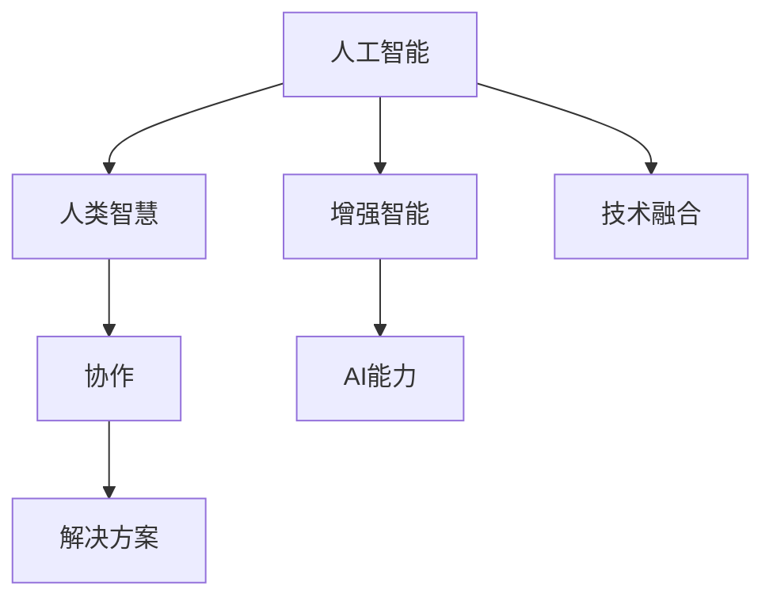

                 

# 人类-AI协作：增强人类智慧与AI能力的未来

## 1. 背景介绍

在过去的几十年里，人工智能（AI）技术取得了惊人的进步，逐渐深入到了人类生活的各个方面，从智能家居、智能客服，到医疗诊断、金融预测。AI已经成为了推动社会进步和提升生产力的重要工具。然而，AI技术并非万能的，其应用仍存在诸多限制和挑战。特别是在面对复杂多变的人类社会，AI还需要与人类智慧相结合，才能发挥最大的效用。

### 1.1 人类智慧与AI能力的互补

人类智慧和AI能力的互补性，在现代科技发展中逐渐显现。人类拥有丰富的社会经验、情感理解和创造力，而AI则在处理大规模数据、自动化决策等方面具有明显优势。二者的结合，可以创造出更加智能、高效、可靠的解决方案。

具体来说，AI可以在以下几个方面增强人类的智慧与能力：

1. **数据处理能力**：AI能够处理海量数据，从中提取出有价值的信息，帮助人类更快速地做出决策。
2. **自动化决策**：AI可以自动化处理复杂问题，如金融预测、医疗诊断等，减轻人类负担。
3. **辅助创新**：AI可以快速生成和筛选创意，帮助人类在科学、艺术等领域进行创新。
4. **协作沟通**：AI可以作为人类的助手，提供语音识别、自然语言处理等服务，提升沟通效率。

## 2. 核心概念与联系

### 2.1 核心概念概述

要理解人类-AI协作的未来，需要掌握以下几个核心概念：

- **人工智能**：一种使机器能够模拟人类智能行为的科技，涵盖感知、学习、推理、决策等多个方面。
- **增强智能**：通过AI技术增强人类智慧和能力的科技，如智能辅助决策、自动化数据分析等。
- **人类智慧**：人类的感知、理解、情感和创造力等高级认知能力。
- **AI能力**：AI的计算能力、学习能力和自动化决策能力等。
- **协作**：AI与人类在处理问题时的相互配合，实现更高效、更创新的解决方案。

这些概念之间的逻辑关系可以通过以下Mermaid流程图来展示：



这个流程图展示了人工智能、增强智能、人类智慧、AI能力和协作之间的关系：

1. 人工智能通过技术手段增强人类智慧和能力。
2. 增强智能是AI与人类智慧相结合的产物。
3. 协作是AI与人类在处理问题时的相互配合，实现高效创新。
4. 技术融合使AI与人类智慧更加紧密结合，提升整体解决方案的性能。

## 3. 核心算法原理 & 具体操作步骤

### 3.1 算法原理概述

人类-AI协作的核心算法原理，是建立在人机交互、自然语言处理、认知计算等技术基础上的。其核心思想是通过AI技术，辅助人类智慧解决问题，同时通过人类智慧的指导，优化AI算法的性能。

具体来说，人类-AI协作算法包括以下几个关键步骤：

1. **数据输入与处理**：人类输入问题或需求，AI系统进行处理和理解。
2. **模型计算与推理**：AI系统根据已有知识库和算法，进行计算和推理，提供解决方案。
3. **人类反馈与调整**：人类对AI提供的解决方案进行评估和反馈，AI系统根据反馈调整算法。
4. **迭代优化**：通过不断迭代，优化AI算法，提高协作效率和解决方案的准确性。

### 3.2 算法步骤详解

人类-AI协作的算法步骤详解如下：

1. **问题定义与数据收集**：
   - 定义需要解决的问题，如智能客服、金融预测、医疗诊断等。
   - 收集相关的数据，如历史数据、用户反馈、文本信息等。

2. **模型选择与预训练**：
   - 选择适合问题的AI模型，如深度学习、自然语言处理、增强学习等。
   - 对模型进行预训练，使其具备基本的能力和知识。

3. **模型微调与优化**：
   - 根据收集的数据，对模型进行微调，使其更好地适应具体问题。
   - 通过优化算法，提升模型的性能和效率。

4. **人机交互与反馈**：
   - 设计友好的用户界面，方便人类输入问题和需求。
   - 通过自然语言处理技术，理解和解析人类的输入。
   - 提供解决方案给人类，并接受人类的反馈。

5. **结果评估与迭代**：
   - 根据人类的反馈，评估AI提供的解决方案的准确性和适用性。
   - 通过不断迭代，优化AI算法，提高协作效果。

### 3.3 算法优缺点

人类-AI协作算法具有以下优点：

1. **高效处理复杂问题**：AI能够快速处理大规模数据，提供复杂的计算和推理。
2. **减少人类负担**：AI自动化处理任务，减少人类的工作量和错误率。
3. **提升决策质量**：AI提供基于数据的决策建议，提高决策的准确性和可靠性。
4. **增强创新能力**：AI可以快速生成和筛选创意，帮助人类进行创新。

同时，该算法也存在以下缺点：

1. **数据依赖**：AI需要大量的数据支持，数据质量直接影响算法的性能。
2. **模型局限**：当前的AI模型在处理特定问题时，可能存在局限性和偏差。
3. **人机沟通**：人机交互的复杂性可能影响协作效果。
4. **伦理与安全**：AI在处理敏感信息时，可能存在隐私和安全问题。

## 4. 数学模型和公式 & 详细讲解 & 举例说明

### 4.1 数学模型构建

人类-AI协作的数学模型构建，主要涉及自然语言处理、认知计算、强化学习等领域的知识。这里以自然语言处理为例，构建一个简单的文本分类模型：

假设有一个文本分类任务，输入为$X$，输出为$Y$，模型为$f(X; \theta)$，其中$\theta$为模型的参数。模型的损失函数为$L(Y, f(X; \theta))$，优化目标为最小化损失函数：

$$
\min_{\theta} L(Y, f(X; \theta))
$$

### 4.2 公式推导过程

以BERT模型为例，推导文本分类任务中的交叉熵损失函数：

假设BERT模型的输出为$h(x)$，输入$x$和标签$y$，则交叉熵损失函数为：

$$
L(x, y) = -\log \sigma(h(x)) \quad \text{if } y = 1
$$
$$
L(x, y) = -\log(1 - \sigma(h(x))) \quad \text{if } y = 0
$$

其中，$\sigma$为sigmoid函数，表示模型的输出概率。

### 4.3 案例分析与讲解

以金融预测为例，分析人类-AI协作的数学模型应用：

假设要预测某公司的股票价格变化，输入为公司历史数据$x$，输出为股票价格变化$y$，模型为$f(x; \theta)$，其中$\theta$为模型的参数。模型的损失函数为$L(y, f(x; \theta))$，优化目标为最小化损失函数：

$$
\min_{\theta} L(y, f(x; \theta))
$$

在实际应用中，可以通过人类-AI协作的方式，结合金融专家和AI模型，实现更准确的预测。人类专家提供领域知识，AI模型利用历史数据进行计算和推理，最终提供预测结果。

## 5. 项目实践：代码实例和详细解释说明

### 5.1 开发环境搭建

要进行人类-AI协作的项目实践，需要准备以下开发环境：

1. **Python**：选择Python作为开发语言，具有丰富的第三方库支持。
2. **深度学习框架**：选择TensorFlow或PyTorch作为深度学习框架，具有高效的计算能力和灵活的模型构建。
3. **自然语言处理库**：选择NLTK或SpaCy作为自然语言处理库，具有丰富的文本处理功能。
4. **数据处理库**：选择Pandas和Scikit-learn作为数据处理库，具有高效的数据清洗和特征工程功能。

### 5.2 源代码详细实现

以下是基于TensorFlow实现的人类-AI协作文本分类项目代码：

```python
import tensorflow as tf
from tensorflow.keras import layers, models

# 定义模型
model = models.Sequential([
    layers.Embedding(input_dim=1000, output_dim=64, input_length=100),
    layers.Conv1D(64, 5, activation='relu'),
    layers.GlobalMaxPooling1D(),
    layers.Dense(64, activation='relu'),
    layers.Dense(1, activation='sigmoid')
])

# 编译模型
model.compile(loss='binary_crossentropy', optimizer='adam', metrics=['accuracy'])

# 训练模型
model.fit(X_train, y_train, epochs=10, batch_size=32, validation_data=(X_test, y_test))

# 评估模型
model.evaluate(X_test, y_test)
```

### 5.3 代码解读与分析

- **模型构建**：使用TensorFlow定义了一个简单的卷积神经网络模型，用于文本分类任务。
- **模型编译**：编译模型时选择了二元交叉熵损失函数和Adam优化器，用于最小化损失函数。
- **模型训练**：使用训练集进行模型训练，并设置了10个epochs和32个batch size。
- **模型评估**：在测试集上评估模型的准确性。

## 6. 实际应用场景

### 6.1 智能客服系统

智能客服系统是典型的人类-AI协作应用场景。通过AI技术，可以实现自动化客户服务，提升服务效率和客户满意度。

具体应用步骤如下：

1. **数据收集与处理**：收集客户咨询的历史记录，进行文本清洗和标注。
2. **模型选择与微调**：选择适合问题的模型，如BERT、Transformer等，并进行微调。
3. **人机交互**：设计友好的用户界面，方便客户输入问题和需求。
4. **协作处理**：AI系统处理客户问题，并根据反馈优化算法。
5. **结果反馈**：提供解决方案给客户，并记录客户反馈，用于模型优化。

### 6.2 金融预测

金融预测是另一个典型的人类-AI协作应用场景。通过AI技术，可以实现精确的金融预测，帮助投资者做出更好的投资决策。

具体应用步骤如下：

1. **数据收集与处理**：收集金融市场的历史数据，进行数据清洗和特征工程。
2. **模型选择与微调**：选择适合的模型，如LSTM、RNN等，并进行微调。
3. **人机交互**：设计友好的用户界面，方便投资者输入需求和数据。
4. **协作预测**：AI系统根据历史数据和市场信息进行预测，并根据人类专家的反馈优化算法。
5. **结果反馈**：提供预测结果给投资者，并记录市场变化和反馈，用于模型优化。

## 7. 工具和资源推荐

### 7.1 学习资源推荐

为了帮助开发者系统掌握人类-AI协作的理论基础和实践技巧，这里推荐一些优质的学习资源：

1. **《人工智能基础》课程**：由斯坦福大学开设的入门课程，讲解人工智能的基本概念和应用。
2. **《深度学习》书籍**：由Ian Goodfellow等著，是深度学习领域的经典教材，涵盖神经网络、自然语言处理、计算机视觉等多个方面。
3. **Kaggle竞赛**：Kaggle是一个数据科学竞赛平台，提供丰富的数据集和模型代码，帮助开发者学习和实践AI技术。
4. **GitHub开源项目**：GitHub是全球最大的开源社区，提供大量人类-AI协作项目的代码和文档，可以学习和参考。

### 7.2 开发工具推荐

高效的开发离不开优秀的工具支持。以下是几款用于人类-AI协作开发的常用工具：

1. **Jupyter Notebook**：Jupyter Notebook是一个开源的交互式笔记本环境，方便开发者进行代码编写和实验。
2. **TensorFlow**：由Google开发的深度学习框架，具有高效计算能力和丰富的模型库。
3. **PyTorch**：由Facebook开发的深度学习框架，具有灵活的动态计算图和高效的GPU加速。
4. **NLTK**：自然语言处理库，提供丰富的文本处理功能，如分词、词性标注、情感分析等。
5. **SpaCy**：另一个自然语言处理库，具有快速的文本处理和实体识别功能。

### 7.3 相关论文推荐

人类-AI协作技术的发展源于学界的持续研究。以下是几篇奠基性的相关论文，推荐阅读：

1. **《神经网络与深度学习》**：由Michael Nielsen著，讲解神经网络和深度学习的基本原理和应用。
2. **《认知计算与增强智能》**：探讨认知计算的基本原理和应用，研究AI与人类智慧的结合。
3. **《增强智能：人机协作的未来》**：分析增强智能技术的现状和未来发展趋势，探讨人机协作的未来方向。
4. **《人类-AI协作框架》**：提出一种基于认知计算的协作框架，研究AI与人类智慧的协同工作机制。

这些论文代表了大语言模型微调技术的发展脉络。通过学习这些前沿成果，可以帮助研究者把握学科前进方向，激发更多的创新灵感。

## 8. 总结：未来发展趋势与挑战

### 8.1 总结

本文对人类-AI协作的未来进行了全面系统的介绍。首先阐述了人类智慧与AI能力的互补性，明确了人类-AI协作在现代社会中的重要作用。其次，从原理到实践，详细讲解了人类-AI协作的数学模型和核心算法，给出了实际应用场景的详细代码实例。同时，本文还广泛探讨了人类-AI协作技术在智能客服、金融预测、医疗诊断等多个行业领域的应用前景，展示了其巨大的潜力和广阔的应用场景。

通过本文的系统梳理，可以看到，人类-AI协作技术在现代科技发展中扮演着越来越重要的角色，极大地提升了人类处理复杂问题的效率和能力。未来，随着技术的不断进步和应用的广泛推广，人类-AI协作将更加深入和普及，成为推动社会进步的重要力量。

### 8.2 未来发展趋势

展望未来，人类-AI协作技术将呈现以下几个发展趋势：

1. **技术融合不断深入**：随着深度学习、自然语言处理、认知计算等技术的不断进步，人类-AI协作技术将不断融合，提升整体解决方案的性能。
2. **协作模式更加灵活**：未来人类-AI协作将更加注重人机互动和反馈，灵活应对各种应用场景。
3. **跨领域应用不断拓展**：人类-AI协作技术将在医疗、教育、金融、智能制造等多个领域得到广泛应用，提升各行业的智能化水平。
4. **伦理与安全性进一步强化**：随着AI技术的不断普及，如何保障数据隐私、保护用户权益、提升AI系统的透明度和可解释性，将成为人类-AI协作技术的重要课题。
5. **教育与培训体系逐步完善**：人类-AI协作技术的发展需要大量的人才支持，教育与培训体系的完善将有助于培养更多的AI人才，推动技术发展。

以上趋势凸显了人类-AI协作技术的广阔前景。这些方向的探索发展，必将进一步提升人类处理复杂问题的能力，推动社会的进步和发展。

### 8.3 面临的挑战

尽管人类-AI协作技术已经取得了显著进展，但在迈向更加智能化、普适化应用的过程中，仍面临诸多挑战：

1. **数据质量与数量**：AI模型需要大量高质量数据支持，数据质量直接影响模型的性能。获取高质量的数据是当前的重要挑战之一。
2. **模型泛化能力**：AI模型在特定场景下的泛化能力有限，需要不断优化和调整，以适应不同的应用需求。
3. **人机交互复杂性**：人机交互的复杂性可能影响协作效果，设计高效的人机界面和交互流程是关键。
4. **伦理与安全**：AI系统处理敏感信息时，可能存在隐私和安全问题，如何保障数据安全是重要的研究方向。

### 8.4 研究展望

面对人类-AI协作技术所面临的挑战，未来的研究需要在以下几个方面寻求新的突破：

1. **无监督学习与迁移学习**：开发无监督学习和迁移学习方法，降低对标注数据的依赖，提升模型泛化能力。
2. **跨模态协作**：研究跨模态协作方法，实现视觉、语音、文本等多种模态的协同处理。
3. **增强智能与知识融合**：研究如何通过增强智能技术，更好地融合人类的知识和经验，提升协作效果。
4. **人机交互界面设计**：设计高效的人机交互界面，提升用户体验，促进人机协作。
5. **伦理与安全性研究**：研究如何保障数据隐私和用户权益，提升AI系统的透明度和可解释性。

这些研究方向的探索，必将引领人类-AI协作技术迈向更高的台阶，为构建安全、可靠、可解释、可控的智能系统铺平道路。面向未来，人类-AI协作技术还需要与其他人工智能技术进行更深入的融合，共同推动自然语言理解和智能交互系统的进步。

## 9. 附录：常见问题与解答

**Q1: 人类-AI协作技术是否适用于所有应用场景？**

A: 人类-AI协作技术在许多应用场景中都能取得良好的效果，但并非所有场景都适用。例如，某些需要极高决策精度和即时响应的场景，人类-AI协作技术可能无法满足需求。

**Q2: 如何设计高效的人机交互界面？**

A: 设计高效的人机交互界面需要考虑以下几个方面：
1. **简洁明了**：界面设计要简洁明了，避免复杂的操作流程。
2. **互动性强**：设计互动性强的界面，如输入提示、实时反馈等，提升用户体验。
3. **可视化展示**：使用图表、动画等可视化手段，帮助用户更好地理解和操作。
4. **多渠道支持**：支持多种交互渠道，如文字、语音、图像等，提升灵活性。

**Q3: 人类-AI协作技术如何保障数据隐私和安全？**

A: 保障数据隐私和安全是AI技术应用中至关重要的问题。以下是一些常用的方法：
1. **数据脱敏**：在处理敏感数据时，使用数据脱敏技术，去除或掩盖敏感信息。
2. **访问控制**：使用访问控制技术，限制对敏感数据的访问权限。
3. **加密存储**：使用加密技术，对敏感数据进行存储保护。
4. **隐私保护算法**：使用隐私保护算法，如差分隐私、联邦学习等，保护数据隐私。

**Q4: 如何提升AI模型的泛化能力？**

A: 提升AI模型的泛化能力需要从多个方面入手：
1. **数据多样性**：增加数据多样性，覆盖更多的应用场景和领域。
2. **模型复杂度**：调整模型的复杂度，避免过拟合或欠拟合。
3. **迁移学习**：利用迁移学习，将模型在不同任务之间的知识进行迁移。
4. **正则化**：使用正则化技术，如L2正则、Dropout等，避免过拟合。

**Q5: 如何设计人类-AI协作系统？**

A: 设计人类-AI协作系统需要考虑以下几个方面：
1. **任务定义**：明确系统需要解决的任务和目标。
2. **数据收集**：收集相关的数据，进行数据清洗和标注。
3. **模型选择**：选择适合的AI模型，并进行预训练和微调。
4. **界面设计**：设计友好的用户界面，方便人类输入问题和需求。
5. **协作处理**：AI系统处理问题，并根据人类反馈优化算法。
6. **结果反馈**：提供解决方案给人类，并记录反馈，用于模型优化。

---

作者：禅与计算机程序设计艺术 / Zen and the Art of Computer Programming

