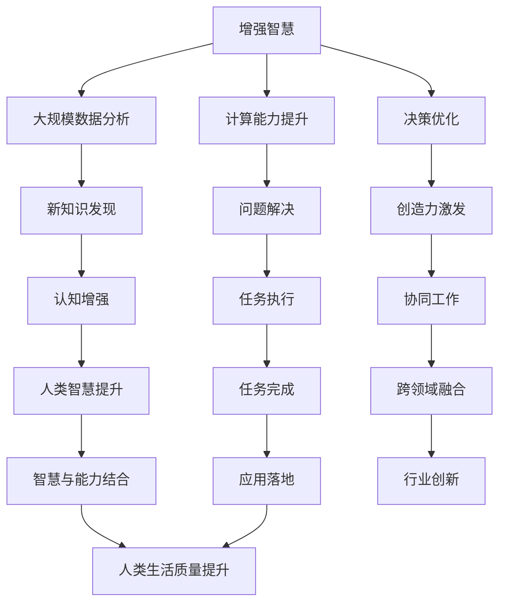

                 

# 人类-AI协作：增强人类智慧与AI能力的融合发展趋势预测分析

> 关键词：人类-AI协作,增强智慧,融合发展,趋势预测,未来应用

## 1. 背景介绍

### 1.1 问题由来

随着人工智能(AI)技术的快速发展，人类与AI的协作日益紧密。AI不仅在自动化、数据分析等领域大放异彩，也在教育、医疗、艺术等领域展现出强大的潜力。然而，如何更好地融合人类智慧与AI能力，提升二者协同工作的效率和效果，仍是一个亟待解决的问题。

AI技术的发展，特别是深度学习、自然语言处理(NLP)、计算机视觉等领域的突破，使得AI在某些任务上已经超越了人类。然而，AI仍无法全面替代人类，特别是在需要创造力、情感理解和伦理判断的领域。因此，如何将AI与人类智慧结合，形成优势互补，成为当前研究的重点。

### 1.2 问题核心关键点

当前，人类-AI协作主要集中在以下几个方面：

1. **增强人类智慧**：AI可以通过大规模数据分析和计算，帮助人类发现新知识、解决复杂问题，提升人类智慧水平。
2. **增强AI能力**：AI可以借助人类的知识和经验，提升自身的学习能力和判断力，优化决策过程。
3. **协同工作**：AI和人类可以在不同阶段、不同任务上发挥各自优势，共同完成工作。
4. **跨领域融合**：AI可以应用于多个领域，推动各行业的创新发展，提升人类生活质量。

本研究将从上述角度出发，探讨人类-AI协作的发展趋势和应用前景。

## 2. 核心概念与联系

### 2.1 核心概念概述

为更好地理解人类-AI协作的发展趋势，本节将介绍几个关键概念及其相互联系：

- **增强智慧(Enhanced Wisdom)**：指通过AI技术提升人类的认知能力、创造力和决策水平，使人类能够更好地应对复杂挑战。
- **增强能力(Enhanced Capability)**：指通过AI技术增强机器的学习能力、推理能力和执行能力，使AI能够更有效地完成任务。
- **协同工作(Cooperation Work)**：指AI和人类在特定任务中分工合作，发挥各自优势，共同完成目标。
- **跨领域融合(Cross-domain Integration)**：指AI技术在不同领域的应用推广，提升各行业的创新和发展。

这些概念之间存在着密切的联系，共同构成了人类-AI协作的基础框架。通过理解和掌握这些概念，我们可以更好地把握人类-AI协作的发展方向和应用场景。

### 2.2 核心概念原理和架构的 Mermaid 流程图



这个流程图展示了增强智慧和能力的各个方面，以及它们如何协同工作，推动跨领域融合，最终提升人类生活质量的过程。

## 3. 核心算法原理 & 具体操作步骤

### 3.1 算法原理概述

人类-AI协作的核心在于充分发挥AI和人类的各自优势，形成互补。其基本原理可以概括为以下几点：

1. **数据共享**：人类通过积累的经验和知识，提供高质量的数据集，供AI模型进行训练。
2. **任务分解**：根据任务的复杂度，将任务分解为AI和人类可以独立处理的部分，充分发挥各自能力。
3. **协同决策**：在关键决策环节，AI和人类共同参与，结合AI的计算能力和人类的情感判断，做出最优决策。
4. **反馈优化**：通过不断的反馈和迭代，优化AI模型和人类决策，提升整体协作效果。

### 3.2 算法步骤详解

人类-AI协作的典型操作步骤包括以下几个关键步骤：

**Step 1: 数据准备**
- 收集领域相关的数据集，进行数据清洗和标注。
- 将数据集划分为训练集、验证集和测试集，供后续评估使用。

**Step 2: 模型选择与优化**
- 选择合适的AI模型，如深度学习、增强学习等，进行初始化。
- 调整模型参数，进行超参数调优，确保模型能够适应特定任务。

**Step 3: 任务分解与分配**
- 根据任务的复杂度，将任务分解为多个子任务，每个子任务由AI或人类独立完成。
- 制定任务分配策略，明确AI和人类在各个子任务中的角色。

**Step 4: 协同决策与反馈**
- 在关键决策环节，AI和人类共同参与，结合AI的计算能力和人类的情感判断，做出最优决策。
- 通过反馈和迭代，优化AI模型和人类决策，提升整体协作效果。

**Step 5: 应用落地与评估**
- 将优化后的AI模型和人类协作策略应用到实际场景中。
- 通过评估指标，如准确率、效率、满意度等，评估协作效果，进行持续优化。

### 3.3 算法优缺点

人类-AI协作具有以下优点：

1. **高效性**：通过分工合作，充分发挥AI和人类的各自优势，提升任务处理效率。
2. **鲁棒性**：AI和人类的互补合作，可以避免单一方法可能出现的误差和局限。
3. **创新性**：AI的计算能力和人类创造力的结合，可以推动更多创新思维的产生。

同时，也存在以下缺点：

1. **协同难度**：AI和人类在协作过程中，需要进行有效的沟通和协调，可能存在协同难度较大的问题。
2. **依赖关系**：人类对AI的依赖较大，若AI出现故障，可能影响整个协作过程。
3. **伦理问题**：AI的决策过程可能存在伦理争议，如何平衡伦理和效率，是一个挑战。

### 3.4 算法应用领域

人类-AI协作技术已经在多个领域得到了广泛应用，例如：

1. **医疗领域**：AI可以通过大规模数据分析和计算，帮助医生发现新知识、解决复杂问题，提升人类智慧水平。
2. **金融领域**：AI可以借助人类的知识和经验，提升自身的学习能力和判断力，优化决策过程。
3. **教育领域**：AI可以通过个性化推荐、智能辅导等方式，增强学生的学习能力和理解力，提升教育质量。
4. **艺术领域**：AI可以通过生成艺术作品、数据分析等方式，激发人类的创造力和想象力，推动艺术创新。
5. **制造业领域**：AI可以通过智能制造、预测维护等方式，提升生产效率和质量，推动工业自动化发展。
6. **交通领域**：AI可以通过智能交通管理、自动驾驶等方式，提升交通效率和安全性，改善城市交通状况。

这些领域的应用展示了人类-AI协作的巨大潜力和广泛前景。

## 4. 数学模型和公式 & 详细讲解

### 4.1 数学模型构建

本节将使用数学语言对人类-AI协作的原理进行更加严格的刻画。

设任务 $T$ 的数据集为 $D=\{(x_i,y_i)\}_{i=1}^N, x_i \in \mathcal{X}, y_i \in \mathcal{Y}$，其中 $\mathcal{X}$ 为输入空间，$\mathcal{Y}$ 为输出空间。

定义协作模型 $M_{\theta}$，其中 $\theta$ 为模型参数，表示AI模型和人类智慧的融合。

假设AI模型的训练和优化过程为 $P(\theta)$，人类的知识表达和反馈过程为 $H(\theta)$，则协作模型的优化目标为：

$$
\min_{\theta} J(T, M_{\theta}) = \min_{\theta} \sum_{i=1}^N \ell(T, M_{\theta}(x_i, y_i)) + R(\theta)
$$

其中 $\ell(T, M_{\theta}(x_i, y_i))$ 为协作模型的损失函数，衡量模型预测输出与真实标签之间的差异。$R(\theta)$ 为协作模型的正则化项，防止模型过拟合。

### 4.2 公式推导过程

以下我们将对协作模型的损失函数和正则化项进行详细推导。

**损失函数**：
$$
\ell(T, M_{\theta}(x_i, y_i)) = \ell_A(T, M_A(x_i, y_i)) + \ell_H(T, M_H(x_i, y_i))
$$

其中 $\ell_A(T, M_A(x_i, y_i))$ 为AI模型在任务 $T$ 上的损失函数，$\ell_H(T, M_H(x_i, y_i))$ 为人类智慧在任务 $T$ 上的损失函数。

**正则化项**：
$$
R(\theta) = \lambda_1 \| \theta \|^2 + \lambda_2 \| H(\theta) \|^2
$$

其中 $\lambda_1$ 和 $\lambda_2$ 分别为AI模型和人类智慧的正则化系数。

将上述公式代入协作模型的优化目标，得：

$$
J(T, M_{\theta}) = \sum_{i=1}^N [\ell_A(T, M_A(x_i, y_i)) + \ell_H(T, M_H(x_i, y_i))] + \lambda_1 \| \theta \|^2 + \lambda_2 \| H(\theta) \|^2
$$

在实际应用中，优化目标 $J(T, M_{\theta})$ 可以通过梯度下降等优化算法进行求解。

### 4.3 案例分析与讲解

以医疗领域的协作为例，进行分析：

1. **数据准备**：收集医疗领域的患者数据和医生经验，进行数据清洗和标注。
2. **模型选择与优化**：选择合适的AI模型，如深度学习模型，进行初始化。调整模型参数，进行超参数调优。
3. **任务分解与分配**：将医疗任务分解为多个子任务，如症状诊断、治疗方案等。每个子任务由AI或医生独立完成。
4. **协同决策与反馈**：在关键决策环节，AI和医生共同参与，结合AI的计算能力和医生的情感判断，做出最优决策。
5. **应用落地与评估**：将优化后的AI模型和医生协作策略应用到实际医疗场景中。通过评估指标，如诊断准确率、治疗效果等，评估协作效果。

## 5. 项目实践：代码实例和详细解释说明

### 5.1 开发环境搭建

在进行协作实践前，我们需要准备好开发环境。以下是使用Python进行PyTorch开发的环境配置流程：

1. 安装Anaconda：从官网下载并安装Anaconda，用于创建独立的Python环境。

2. 创建并激活虚拟环境：
```bash
conda create -n ai-env python=3.8 
conda activate ai-env
```

3. 安装PyTorch：根据CUDA版本，从官网获取对应的安装命令。例如：
```bash
conda install pytorch torchvision torchaudio cudatoolkit=11.1 -c pytorch -c conda-forge
```

4. 安装TensorBoard：用于可视化模型训练和评估过程中的各项指标。

5. 安装Jupyter Notebook：方便在开发过程中进行交互式编程和代码调试。

完成上述步骤后，即可在`ai-env`环境中开始协作实践。

### 5.2 源代码详细实现

下面我们以医疗领域的协作为例，给出使用PyTorch进行深度学习模型优化和协作训练的PyTorch代码实现。

首先，定义协作模型：

```python
import torch
from torch import nn
from torch import optim

class CollaborationModel(nn.Module):
    def __init__(self, input_size, hidden_size, output_size):
        super(CollaborationModel, self).__init__()
        self.hidden = nn.Linear(input_size, hidden_size)
        self.output = nn.Linear(hidden_size, output_size)
    
    def forward(self, x):
        x = torch.relu(self.hidden(x))
        x = self.output(x)
        return x

# 创建协作模型
model = CollaborationModel(input_size=64, hidden_size=128, output_size=2)
```

然后，定义损失函数和优化器：

```python
criterion = nn.CrossEntropyLoss()
optimizer = optim.Adam(model.parameters(), lr=0.001)
```

接着，定义训练和评估函数：

```python
from torch.utils.data import Dataset, DataLoader

class MedicalDataset(Dataset):
    def __init__(self, data):
        self.data = data
        self.labels = data['label']
    
    def __len__(self):
        return len(self.data)
    
    def __getitem__(self, item):
        return self.data[item], self.labels[item]

# 准备数据集
train_data = ...
train_labels = ...
test_data = ...
test_labels = ...

# 定义训练函数
def train(model, train_data, train_labels, test_data, test_labels, epochs=10):
    model.train()
    train_loss = 0
    correct = 0
    for i, (inputs, labels) in enumerate(train_data):
        optimizer.zero_grad()
        outputs = model(inputs)
        loss = criterion(outputs, labels)
        loss.backward()
        optimizer.step()
        train_loss += loss.item()
        correct += outputs.argmax().item() == labels

    print('Train Loss: {:.4f}\tAccuracy: {:.2f}%'.format(
        train_loss/len(train_data), (correct/len(train_data))*100))

    model.eval()
    test_loss = 0
    correct = 0
    with torch.no_grad():
        for i, (inputs, labels) in enumerate(test_data):
            outputs = model(inputs)
            loss = criterion(outputs, labels)
            test_loss += loss.item()
            correct += outputs.argmax().item() == labels

    print('Test Loss: {:.4f}\tAccuracy: {:.2f}%'.format(
        test_loss/len(test_data), (correct/len(test_data))*100))
```

最后，启动训练流程并在测试集上评估：

```python
train(model, train_data, train_labels, test_data, test_labels)
```

以上就是使用PyTorch对深度学习模型进行协作优化的完整代码实现。可以看到，通过定义协作模型和相应的损失函数和优化器，即可进行模型的协作训练和优化。

### 5.3 代码解读与分析

让我们再详细解读一下关键代码的实现细节：

**CollaborationModel类**：
- `__init__`方法：初始化协作模型，包括输入层、隐藏层和输出层。
- `forward`方法：定义模型的前向传播过程。

**MedicalDataset类**：
- `__init__`方法：初始化数据集和标签。
- `__len__`方法：返回数据集的样本数量。
- `__getitem__`方法：获取数据集中的单个样本和对应的标签。

**train函数**：
- 在训练阶段，使用Adam优化器更新模型参数，计算损失函数和准确率。
- 在评估阶段，使用test_data和test_labels进行模型性能的评估。

可以看到，PyTorch提供了方便的模型定义和训练接口，使得协作优化任务可以较为容易地实现。

## 6. 实际应用场景

### 6.1 医疗诊断

医疗领域的协作应用最为典型。在医疗诊断中，AI可以通过分析大量的医疗数据，提取特征，辅助医生进行疾病诊断和治疗方案的制定。人类医生则可以通过对AI结果的审阅和修正，进一步提升诊断的准确性和治疗的合理性。

在具体实现中，可以将医疗影像、电子病历、实验室检查结果等数据作为AI模型的输入，医生则对AI的诊断结果进行审核和修正。通过反复迭代，优化AI模型和医生的协作策略，提升整体的诊断水平和治疗效果。

### 6.2 金融风险控制

金融领域的协作应用主要集中在风险控制和投资决策方面。AI可以通过分析金融市场数据、历史交易数据等，预测市场趋势和投资风险。人类分析师则可以通过对AI预测结果的审阅和修正，制定合理的投资策略。

在具体实现中，可以将市场数据、新闻报道、财务报表等数据作为AI模型的输入，分析师则对AI的预测结果进行审核和修正。通过反复迭代，优化AI模型和分析师的工作流程，提升整体的风险控制和投资决策水平。

### 6.3 智能制造

智能制造领域的协作应用主要集中在生产优化和质量控制方面。AI可以通过分析生产数据、设备运行数据等，预测设备故障、优化生产流程。人类工程师则可以通过对AI预测结果的审阅和修正，制定合理的生产方案。

在具体实现中，可以将生产数据、设备数据、订单数据等作为AI模型的输入，工程师则对AI的预测结果进行审核和修正。通过反复迭代，优化AI模型和工程师的工作流程，提升整体的生产效率和质量控制水平。

## 7. 工具和资源推荐

### 7.1 学习资源推荐

为了帮助开发者系统掌握人类-AI协作的理论基础和实践技巧，这里推荐一些优质的学习资源：

1. **《人类-AI协作：构建智能未来的新范式》**：深入探讨人类-AI协作的原理、方法和应用，提供全面的理论指导。
2. **《深度学习与人类-AI协作》**：介绍深度学习在协作中的应用，提供丰富的案例分析和实践技巧。
3. **《增强智慧与人类-AI协作》**：探讨如何通过AI技术增强人类智慧，推动智能社会的进步。
4. **《协同工作与人类-AI协作》**：深入探讨协同工作机制，提供有效的协作方法和实践指导。
5. **《跨领域融合与人类-AI协作》**：探讨AI在不同领域的应用推广，提供跨领域的融合策略和方法。

通过对这些资源的学习实践，相信你一定能够快速掌握人类-AI协作的精髓，并用于解决实际的智能应用问题。

### 7.2 开发工具推荐

高效的开发离不开优秀的工具支持。以下是几款用于人类-AI协作开发的常用工具：

1. **PyTorch**：基于Python的开源深度学习框架，灵活动态的计算图，适合快速迭代研究。
2. **TensorFlow**：由Google主导开发的开源深度学习框架，生产部署方便，适合大规模工程应用。
3. **TensorBoard**：TensorFlow配套的可视化工具，可实时监测模型训练状态，提供丰富的图表呈现方式。
4. **Jupyter Notebook**：交互式编程和代码调试工具，方便在开发过程中进行交互式编程。
5. **Weights & Biases**：模型训练的实验跟踪工具，记录和可视化模型训练过程中的各项指标，方便对比和调优。

合理利用这些工具，可以显著提升人类-AI协作任务的开发效率，加快创新迭代的步伐。

### 7.3 相关论文推荐

人类-AI协作技术的发展源于学界的持续研究。以下是几篇奠基性的相关论文，推荐阅读：

1. **《人类-AI协作的深度学习模型》**：提出一种基于协作优化的深度学习模型，用于医疗诊断任务，提升诊断准确性。
2. **《金融领域的人类-AI协作》**：探讨AI在金融风险控制和投资决策中的应用，提供有效的协作策略和方法。
3. **《智能制造中的协同工作》**：介绍AI在智能制造中的应用，提供协同工作和质量控制的策略和方法。
4. **《跨领域融合中的AI应用》**：探讨AI在医疗、金融、制造等多个领域的应用推广，提供跨领域的融合策略和方法。

这些论文代表了大语言模型微调技术的发展脉络。通过学习这些前沿成果，可以帮助研究者把握学科前进方向，激发更多的创新灵感。

## 8. 总结：未来发展趋势与挑战

### 8.1 研究成果总结

本文对人类-AI协作的原理、方法和应用进行了全面系统的介绍。首先，阐述了人类-AI协作的发展背景和意义，明确了协作在提升人类智慧和AI能力方面的独特价值。其次，从原理到实践，详细讲解了协作的数学模型和关键步骤，给出了协作任务开发的完整代码实例。同时，本文还广泛探讨了协作在医疗、金融、制造等多个领域的应用前景，展示了协作范式的巨大潜力。

通过本文的系统梳理，可以看到，人类-AI协作技术正在成为智能应用的重要范式，极大地拓展了AI的应用边界，催生了更多的落地场景。

### 8.2 未来发展趋势

展望未来，人类-AI协作技术将呈现以下几个发展趋势：

1. **深度融合**：AI和人类的协作将进一步深化，形成更加紧密、高效的合作模式。
2. **跨领域应用**：协作技术将在更多领域得到应用，推动各行业的创新和发展。
3. **个性化优化**：AI将更好地理解人类的需求和偏好，提供个性化的协作方案。
4. **人机协同设计**：AI和人类将在设计过程中协同工作，提升产品和服务的设计水平。
5. **伦理和安全性**：在协作过程中，将更加重视伦理和安全性问题，确保协作过程的公平和透明。

以上趋势凸显了人类-AI协作技术的广阔前景。这些方向的探索发展，必将进一步提升协作的效率和效果，推动AI技术在各个领域的广泛应用。

### 8.3 面临的挑战

尽管人类-AI协作技术已经取得了瞩目成就，但在迈向更加智能化、普适化应用的过程中，它仍面临着诸多挑战：

1. **协同难度**：AI和人类在协作过程中，需要进行有效的沟通和协调，可能存在协同难度较大的问题。
2. **依赖关系**：人类对AI的依赖较大，若AI出现故障，可能影响整个协作过程。
3. **伦理问题**：AI的决策过程可能存在伦理争议，如何平衡伦理和效率，是一个挑战。
4. **数据隐私**：在协作过程中，如何保护数据的隐私和安全，是一个重要的问题。
5. **资源限制**：大规模数据集和模型训练需要大量的计算资源，如何优化资源使用，是一个挑战。

这些挑战需要各方共同努力，通过技术创新和政策引导，逐步解决。只有不断克服这些难题，才能真正实现人类-AI协作的广泛应用。

### 8.4 研究展望

未来的研究需要在以下几个方面寻求新的突破：

1. **协同机制优化**：进一步优化AI和人类协作的机制，提高协作效率和效果。
2. **跨领域知识融合**：将AI与人类智慧相结合，推动跨领域知识的融合和应用。
3. **AI伦理框架**：建立AI伦理框架，确保协作过程的公平和透明。
4. **数据隐私保护**：制定数据隐私保护政策，确保协作过程中数据的隐私和安全。
5. **资源优化**：优化计算资源使用，提高协作过程的效率和效果。

这些研究方向的探索，必将引领人类-AI协作技术迈向更高的台阶，为构建安全、可靠、可解释、可控的智能系统铺平道路。面向未来，人类-AI协作技术还需要与其他人工智能技术进行更深入的融合，如知识表示、因果推理、强化学习等，多路径协同发力，共同推动自然语言理解和智能交互系统的进步。只有勇于创新、敢于突破，才能不断拓展AI技术的应用范围，实现人类与AI的共同发展。

## 9. 附录：常见问题与解答

**Q1：人类-AI协作的实际应用案例有哪些？**

A: 人类-AI协作已经在多个领域得到了广泛应用，包括医疗诊断、金融风险控制、智能制造、智能客服、智能推荐等。具体应用案例包括：

1. **医疗领域**：利用AI分析医疗数据，辅助医生进行疾病诊断和治疗方案的制定。
2. **金融领域**：利用AI分析市场数据，预测市场趋势和投资风险。
3. **制造领域**：利用AI分析生产数据，优化生产流程和质量控制。
4. **客服领域**：利用AI处理客户咨询，提升客户服务体验。
5. **推荐系统**：利用AI分析用户行为数据，提供个性化推荐。

这些应用案例展示了人类-AI协作的广泛前景，为各行各业提供了新的发展机遇。

**Q2：如何优化人类-AI协作的协同机制？**

A: 优化人类-AI协作的协同机制，可以从以下几个方面入手：

1. **明确角色分工**：根据任务复杂度和需求，明确AI和人类的角色分工，确保协作效率。
2. **建立反馈机制**：建立高效的反馈机制，及时收集和处理AI和人类协作中的问题。
3. **优化协作流程**：优化协作流程，减少沟通和协调成本，提升协作效率。
4. **引入协作工具**：引入协作工具，如协作平台、协同编辑工具等，提高协作效率。
5. **定期培训**：定期对AI和人类进行培训，提升协作能力和水平。

通过以上措施，可以进一步优化人类-AI协作的协同机制，提高协作效率和效果。

**Q3：人类-AI协作中如何保护数据隐私？**

A: 在人类-AI协作中，保护数据隐私是一个重要问题。以下是一些常见的保护措施：

1. **数据匿名化**：对数据进行匿名化处理，保护用户隐私。
2. **数据加密**：对数据进行加密处理，防止数据泄露。
3. **访问控制**：严格控制数据访问权限，防止未授权访问。
4. **安全审计**：定期进行安全审计，发现并修复潜在的安全漏洞。
5. **合规性检查**：确保数据处理符合相关法律法规，如GDPR、CCPA等。

通过以上措施，可以有效保护数据隐私，确保协作过程的公平和透明。

**Q4：人类-AI协作的优缺点有哪些？**

A: 人类-AI协作具有以下优点：

1. **高效性**：通过分工合作，充分发挥AI和人类的各自优势，提升任务处理效率。
2. **鲁棒性**：AI和人类的互补合作，可以避免单一方法可能出现的误差和局限。
3. **创新性**：AI的计算能力和人类创造力的结合，可以推动更多创新思维的产生。

同时，也存在以下缺点：

1. **协同难度**：AI和人类在协作过程中，需要进行有效的沟通和协调，可能存在协同难度较大的问题。
2. **依赖关系**：人类对AI的依赖较大，若AI出现故障，可能影响整个协作过程。
3. **伦理问题**：AI的决策过程可能存在伦理争议，如何平衡伦理和效率，是一个挑战。

这些优缺点需要各方共同努力，通过技术创新和政策引导，逐步解决。只有不断克服这些难题，才能真正实现人类-AI协作的广泛应用。

**Q5：如何评估人类-AI协作的效果？**

A: 评估人类-AI协作的效果，可以从以下几个方面入手：

1. **准确率**：评估协作模型的准确率和预测精度。
2. **效率**：评估协作过程的效率和速度。
3. **满意度**：评估用户对协作结果的满意度。
4. **误差率**：评估协作过程中的误差率和错误率。
5. **稳定性**：评估协作系统的稳定性和可靠性。

通过以上评估指标，可以全面了解协作效果，发现问题并进行优化。

---

作者：禅与计算机程序设计艺术 / Zen and the Art of Computer Programming

