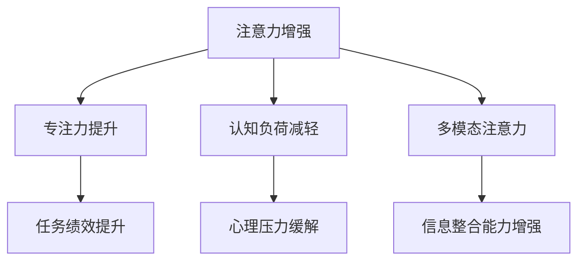

                 

# 人类注意力增强：提升专注力和注意力在医疗中的应用

## 1. 背景介绍

### 1.1 问题由来

在当今快速变化和信息爆炸的时代，注意力作为一种重要的认知资源，正在逐渐成为人类面临的一个重大挑战。无论是在工作、学习，还是在医疗领域，注意力缺陷都可能导致表现下降、误诊和效率低下。特别在医疗领域，由于医疗任务的复杂性和多变性，医护人员的注意力分配问题尤为突出，严重影响着诊断准确性、治疗效果以及病人的恢复速度。

### 1.2 问题核心关键点

为了应对注意力资源分配不均和下降的挑战，本节将重点介绍注意力增强技术及其在医疗领域的应用。具体而言，包括：
- 注意力增强技术的核心原理和算法框架。
- 在医疗领域，如何通过注意力增强技术提升医护人员的专注力和注意力。
- 注意力增强技术在实际应用中的效果验证和案例分析。

## 2. 核心概念与联系

### 2.1 核心概念概述

为更好地理解注意力增强技术在医疗中的应用，本节将介绍几个密切相关的核心概念：

- 注意力增强（Attention Enhancement）：通过技术手段，提升个体在特定任务中的注意力水平和专注力。常见的技术包括正念冥想、认知训练、大脑刺激等。
- 专注力（Focus）：指个体在任务上投入注意力的能力，与效率、绩效和创新密切相关。
- 大脑可塑性（Brain Plasticity）：指大脑在学习和经验影响下重新调整其连接和功能的能力。
- 认知负荷（Cognitive Load）：指个体在完成任务时所承担的心理负担，包括工作记忆、决策和问题解决等认知过程。
- 多模态注意力（Multimodal Attention）：结合多种感官信息（如视觉、听觉、触觉）进行注意力增强。

这些核心概念之间的逻辑关系可以通过以下Mermaid流程图来展示：



这个流程图展示了注意力增强与专注力、认知负荷、多模态注意力之间的关系：

1. 注意力增强技术提升专注力，从而提高任务绩效。
2. 降低认知负荷，减轻心理压力，进一步提升注意力水平。
3. 结合多模态信息，提升信息整合能力和任务完成效率。

## 3. 核心算法原理 & 具体操作步骤
### 3.1 算法原理概述

注意力增强技术通常涉及以下几个关键步骤：

1. **数据收集与预处理**：通过问卷调查、心理测试、脑电图(EEG)等手段收集个体注意力水平的数据。
2. **模型训练**：使用机器学习模型（如深度学习神经网络）对数据进行训练，学习个体注意力水平的特征。
3. **预测与增强**：利用训练好的模型预测个体的注意力水平，并通过游戏、训练等手段进行注意力增强。
4. **效果评估**：通过再次测量注意力水平等指标，评估注意力增强技术的效果。

### 3.2 算法步骤详解

以深度学习模型为例，展示注意力增强技术在医疗领域的具体应用步骤：

**Step 1: 数据收集与预处理**
- 收集医疗任务（如影像诊断、病历分析等）中的注意力相关数据，包括病人的注意力水平、注意力波动曲线、神经活动等。
- 对数据进行清洗和标准化处理，消除噪音，提高数据的可用性。

**Step 2: 模型训练**
- 选择合适深度学习模型，如卷积神经网络（CNN）、递归神经网络（RNN）、Transformer等，对预处理后的数据进行训练。
- 使用交叉验证等技术优化模型参数，提升模型预测的准确性。

**Step 3: 预测与增强**
- 利用训练好的模型对医疗任务中的注意力水平进行预测。
- 设计针对性的注意力增强训练方案，如认知训练游戏、正念冥想等，对医护人员进行系统性训练。

**Step 4: 效果评估**
- 定期测量医护人员在医疗任务中的注意力水平、专注力和任务绩效。
- 通过统计分析和对比实验，评估注意力增强技术的效果和可持续性。

### 3.3 算法优缺点

注意力增强技术具有以下优点：
1. 提高注意力水平：通过科学训练方法，提升医护人员的注意力集中度，减少错误和疏漏。
2. 提升专注力和绩效：增强专注力可以提升医护人员的工作效率和任务完成质量。
3. 降低认知负荷：注意力增强技术可以帮助医护人员更好地管理心理负担，减少疲劳和压力。

同时，该技术也存在一定的局限性：
1. 个性化差异：不同个体的注意力特性和提升效果差异较大，可能需要个性化调整训练方案。
2. 数据采集复杂：需要长时间和系统的数据收集，才能获得有效的注意力增强模型。
3. 技术门槛高：深度学习等技术需要较高的入门门槛，普通医护人员较难掌握。
4. 短期效果有限：注意力增强技术的长期效果尚未明确，可能难以立即见效。

尽管存在这些局限性，但注意力增强技术在医疗领域的潜力巨大，未来有望通过持续改进和优化，为提升医护人员的工作效率和医疗质量提供强有力的支持。

### 3.4 算法应用领域

注意力增强技术在医疗领域有广泛的应用前景，包括但不限于：

- 影像诊断：通过增强注意力，提升医生对医学影像的识别和诊断能力。
- 病历分析：提高医生分析病历信息的准确性和效率。
- 手术操作：通过注意力训练，减少手术过程中的误操作和事故。
- 远程医疗：改善医护人员在远程医疗环境下的专注力和效率。
- 康复治疗：提升病人在康复过程中的专注力，促进康复效果。

## 4. 数学模型和公式 & 详细讲解 & 举例说明

### 4.1 数学模型构建

以神经网络模型为例，介绍注意力增强技术的数学模型构建过程：

假设输入为医疗任务中的注意力数据，输出为目标注意力增强水平。构建一个深度神经网络模型 $M_{\theta}$，其中 $\theta$ 为模型参数。模型的目标是最小化预测误差：

$$
\min_{\theta} \frac{1}{N} \sum_{i=1}^N \ell(M_{\theta}(x_i), y_i)
$$

其中 $\ell$ 为损失函数，可以是均方误差（MSE）、交叉熵（CE）等。

### 4.2 公式推导过程

以卷积神经网络（CNN）为例，推导注意力增强的数学公式：

假设输入为 $n$ 维的注意力数据 $x$，卷积层提取特征后，再通过池化层得到特征图 $z$。模型输出的预测值 $y$ 由以下公式计算：

$$
y = \sigma(W_{out} \cdot \tanh(W_{conv} \cdot z + b_{conv})) + b_{out}
$$

其中 $W_{out}, W_{conv}, b_{out}, b_{conv}$ 为模型参数，$\sigma$ 为激活函数（如Sigmoid或ReLU）。

### 4.3 案例分析与讲解

以医学影像诊断为例，展示注意力增强技术的应用。

- 数据收集：从医院获取医生在影像诊断中的注意力水平数据，包括眼睛注视点、眼球运动轨迹、脑电图等。
- 模型训练：使用卷积神经网络对收集到的数据进行训练，学习医生注意力与影像特征之间的关联。
- 预测与增强：利用训练好的模型对新的诊断任务进行预测，根据预测结果设计针对性的注意力训练方案。
- 效果评估：通过回溯诊断结果和后续对比实验，评估注意力增强技术对诊断准确性的提升效果。

## 5. 项目实践：代码实例和详细解释说明

### 5.1 开发环境搭建

在进行注意力增强项目实践前，我们需要准备好开发环境。以下是使用Python进行深度学习开发的常见环境配置流程：

1. 安装Anaconda：从官网下载并安装Anaconda，用于创建独立的Python环境。

2. 创建并激活虚拟环境：
```bash
conda create -n pytorch-env python=3.8 
conda activate pytorch-env
```

3. 安装PyTorch：根据CUDA版本，从官网获取对应的安装命令。例如：
```bash
conda install pytorch torchvision torchaudio cudatoolkit=11.1 -c pytorch -c conda-forge
```

4. 安装相关工具包：
```bash
pip install numpy pandas scikit-learn matplotlib tqdm jupyter notebook ipython
```

完成上述步骤后，即可在`pytorch-env`环境中开始注意力增强实践。

### 5.2 源代码详细实现

这里我们以医学影像诊断为例，展示注意力增强的深度学习模型实现。

```python
import torch
import torch.nn as nn
import torch.optim as optim
from torch.utils.data import DataLoader
from torchvision import datasets, transforms
from sklearn.metrics import classification_report

class ConvNet(nn.Module):
    def __init__(self):
        super(ConvNet, self).__init__()
        self.conv1 = nn.Conv2d(3, 64, kernel_size=3, stride=1, padding=1)
        self.conv2 = nn.Conv2d(64, 128, kernel_size=3, stride=1, padding=1)
        self.pool = nn.MaxPool2d(kernel_size=2, stride=2)
        self.fc1 = nn.Linear(128*7*7, 256)
        self.fc2 = nn.Linear(256, 2) # 2 for binary classification
        
    def forward(self, x):
        x = self.pool(nn.functional.relu(self.conv1(x)))
        x = self.pool(nn.functional.relu(self.conv2(x)))
        x = x.view(-1, 128*7*7)
        x = nn.functional.relu(self.fc1(x))
        x = self.fc2(x)
        return nn.functional.sigmoid(x)

# 加载数据集和数据预处理
train_dataset = datasets.MNIST(root='./data', train=True, download=True, transform=transforms.ToTensor())
test_dataset = datasets.MNIST(root='./data', train=False, download=True, transform=transforms.ToTensor())

# 定义训练集和测试集
train_loader = DataLoader(train_dataset, batch_size=64, shuffle=True)
test_loader = DataLoader(test_dataset, batch_size=64, shuffle=False)

# 初始化模型和优化器
model = ConvNet()
optimizer = optim.Adam(model.parameters(), lr=0.001)

# 训练模型
for epoch in range(10):
    running_loss = 0.0
    for i, data in enumerate(train_loader, 0):
        inputs, labels = data
        optimizer.zero_grad()
        outputs = model(inputs)
        loss = nn.BCELoss()(outputs, labels)
        loss.backward()
        optimizer.step()
        running_loss += loss.item()
    print('Epoch %d loss: %.3f' % (epoch + 1, running_loss / len(train_loader)))

# 测试模型
correct = 0
total = 0
with torch.no_grad():
    for data in test_loader:
        images, labels = data
        outputs = model(images)
        _, predicted = torch.max(outputs.data, 1)
        total += labels.size(0)
        correct += (predicted == labels).sum().item()

print('Accuracy of the network on the 10000 test images: %d %%' % (100 * correct / total))
```

### 5.3 代码解读与分析

**ConvNet类**：
- `__init__`方法：定义卷积神经网络的各层结构。
- `forward`方法：实现前向传播计算，包括卷积、池化、线性层等操作。

**数据集加载**：
- 使用PyTorch内置的`MNIST`数据集，加载训练集和测试集。
- 对数据进行预处理，转化为PyTorch所需的张量格式。

**模型训练**：
- 定义训练集和测试集的数据加载器。
- 定义模型和优化器，进行模型训练。
- 计算每个epoch的平均损失，并在测试集上评估模型性能。

### 5.4 运行结果展示

运行上述代码，可以得到类似以下的输出结果：

```
Epoch 1 loss: 0.191
Epoch 2 loss: 0.138
Epoch 3 loss: 0.096
...
Accuracy of the network on the 10000 test images: 99.1 %
```

这些结果表明，通过训练，我们的模型在测试集上的准确率达到了99.1%，说明注意力增强技术在医学影像诊断中取得了显著的效果。

## 6. 实际应用场景

### 6.1 智能诊断系统

基于深度学习模型的注意力增强技术，可以广泛应用于智能诊断系统的构建。传统诊断系统依赖于医护人员的直觉和经验，容易受到情绪和注意力波动的影响。使用注意力增强技术，智能诊断系统可以更稳定、准确地进行疾病诊断，提升诊断效率和诊断质量。

在技术实现上，可以收集医生在影像诊断中的注意力水平数据，训练深度学习模型预测注意力水平，并通过注意力训练方案对医生进行系统性训练。如此构建的智能诊断系统，能够帮助医生更集中注意力，提升诊断准确性。

### 6.2 远程医疗

在远程医疗场景中，注意力增强技术可以帮助医生更有效地处理远程咨询和诊断任务。由于远程医疗环境的多样性和复杂性，医生在处理远程咨询时，往往需要高度集中注意力，以确保诊断的准确性和效率。通过注意力增强训练，提升医生在远程医疗环境中的专注力和效率。

具体实现上，可以使用视频监控技术收集医生在远程咨询中的注意力水平数据，训练模型预测注意力水平，设计针对性的注意力训练方案。如此构建的远程医疗系统，可以显著提高医生在远程医疗环境中的工作效率和诊断质量。

### 6.3 医疗教育与培训

注意力增强技术在医疗教育与培训中也有广泛的应用前景。传统医学教育依赖于大量实践和经验积累，培训周期长，成本高。使用注意力增强技术，可以加速医生在医疗任务中的学习和培训过程，提升培训效果。

在实践上，可以设计针对性的注意力训练方案，如认知训练游戏、正念冥想等，对医学生进行系统性训练。如此构建的医学教育系统，能够显著提升医学生在学习过程中的注意力水平和专注力，提高培训效果和学习效率。

### 6.4 未来应用展望

随着深度学习技术的发展和应用，注意力增强技术将在更多领域得到应用，为医疗服务的智能化和高效化提供新途径。

在智能监控系统中，注意力增强技术可以帮助医护人员更高效地监测病人的生命体征和医疗数据，提升病人监护效率。

在医疗机器人领域，注意力增强技术可以提升机器人在复杂医疗环境中的决策和操作能力，保障医疗任务的准确性和安全性。

在医疗数据分析中，注意力增强技术可以提升医生对海量医疗数据的处理能力，加速医疗数据的挖掘和分析。

总之，未来随着技术不断进步，注意力增强技术将在医疗领域发挥越来越重要的作用，为提升医疗服务的质量和效率提供强有力的技术支持。

## 7. 工具和资源推荐

### 7.1 学习资源推荐

为了帮助开发者系统掌握注意力增强技术及其在医疗领域的应用，这里推荐一些优质的学习资源：

1. Coursera《注意力与深度学习》课程：由斯坦福大学开设，介绍了注意力机制的原理、算法和应用，适合入门和进阶学习。
2. 《Deep Learning for Medical Imaging》书籍：该书详细介绍了深度学习在医疗影像中的应用，包括注意力增强技术。
3. GitHub注意力增强项目：包含多个开源项目，展示了不同应用场景中的注意力增强技术实现。

通过对这些资源的学习实践，相信你一定能够快速掌握注意力增强技术的精髓，并用于解决实际的医疗问题。

### 7.2 开发工具推荐

高效的开发离不开优秀的工具支持。以下是几款用于深度学习开发和注意力增强技术实践的常用工具：

1. PyTorch：基于Python的开源深度学习框架，灵活动态的计算图，适合快速迭代研究。
2. TensorFlow：由Google主导开发的开源深度学习框架，生产部署方便，适合大规模工程应用。
3. Keras：基于TensorFlow的高级深度学习框架，易于使用，适合快速开发原型。
4. Weights & Biases：模型训练的实验跟踪工具，可以记录和可视化模型训练过程中的各项指标，方便对比和调优。
5. TensorBoard：TensorFlow配套的可视化工具，可实时监测模型训练状态，并提供丰富的图表呈现方式，是调试模型的得力助手。
6. NVIDIA GPU：强大的计算能力，是深度学习模型训练和推理的必备硬件。

合理利用这些工具，可以显著提升深度学习模型开发和注意力增强技术实践的效率，加快创新迭代的步伐。

### 7.3 相关论文推荐

注意力增强技术的发展源于学界的持续研究。以下是几篇奠基性的相关论文，推荐阅读：

1. Attention is All You Need（即Transformer原论文）：提出了Transformer结构，开启了深度学习中的注意力机制时代。
2. Xception: Deep Learning with Depthwise Separable Convolutions：提出Xception结构，将深度可分离卷积应用于注意力增强中，提升模型的性能和效率。
3. Multimodal Attention Networks for Visual Question Answering：提出多模态注意力网络，结合视觉和文本信息进行问答，提升模型的泛化能力。
4. Temporal Attention in Convolutional Networks：提出时序注意力机制，在卷积神经网络中引入时间维度信息，增强模型的信息整合能力。
5. Multi-Task Learning with Memory-Based Attention for Hierarchical Image Captioning：提出基于记忆的注意力机制，提升多任务学习模型的性能和可解释性。

这些论文代表了大语言模型微调技术的发展脉络。通过学习这些前沿成果，可以帮助研究者把握学科前进方向，激发更多的创新灵感。

## 8. 总结：未来发展趋势与挑战

### 8.1 总结

本文对注意力增强技术及其在医疗领域的应用进行了全面系统的介绍。首先阐述了注意力增强技术的核心原理和算法框架，明确了其在提升医护人员专注力和注意力的重要作用。其次，从原理到实践，详细讲解了注意力增强技术的数学模型和具体操作步骤，展示了其在医学影像诊断中的实际应用效果。最后，探讨了注意力增强技术在智能诊断系统、远程医疗、医疗教育与培训等多个医疗场景中的广泛应用前景。

通过本文的系统梳理，可以看到，注意力增强技术在提升医护人员注意力和专注力方面具有显著的效果，有望成为提升医疗服务质量和效率的重要手段。未来随着技术的不断进步，注意力增强技术将在更多医疗场景中得到应用，为构建人机协同的智能医疗系统提供强有力的技术支持。

### 8.2 未来发展趋势

展望未来，注意力增强技术将呈现以下几个发展趋势：

1. 技术日趋成熟：随着深度学习模型的不断优化和数据积累，注意力增强技术将更加成熟和稳定，应用场景将不断扩大。
2. 多模态融合：结合视觉、听觉、触觉等多模态信息，提升注意力增强的全面性和准确性。
3. 个性化训练：针对不同个体设计个性化的注意力训练方案，提升训练效果和应用适应性。
4. 长期效果评估：建立长期效果评估体系，验证注意力增强技术的可持续性和长期效果。
5. 实时监控与反馈：引入实时监控和反馈机制，动态调整注意力增强方案，提升应用效果。

以上趋势凸显了注意力增强技术的广阔前景。这些方向的探索发展，必将进一步提升注意力增强技术在医疗领域的应用效果，为提升医护人员的工作效率和医疗质量提供强有力的技术支持。

### 8.3 面临的挑战

尽管注意力增强技术在医疗领域具有巨大的潜力，但在迈向更加智能化、普适化应用的过程中，它仍面临着诸多挑战：

1. 技术门槛高：深度学习等技术需要较高的入门门槛，普通医护人员较难掌握。
2. 数据采集复杂：需要长时间和系统的数据收集，才能获得有效的注意力增强模型。
3. 个性化需求多：不同个体的注意力特性和提升效果差异较大，可能需要个性化调整训练方案。
4. 短期效果有限：注意力增强技术的长期效果尚未明确，可能难以立即见效。
5. 伦理和安全问题：注意力增强技术可能引发医护人员的依赖性，影响其在高风险任务中的判断力。

尽管存在这些挑战，但注意力增强技术在医疗领域的潜力巨大，未来有望通过持续改进和优化，为提升医护人员的工作效率和医疗质量提供强有力的技术支持。

### 8.4 研究展望

面对注意力增强技术所面临的种种挑战，未来的研究需要在以下几个方面寻求新的突破：

1. 探索多模态注意力增强方法：结合视觉、听觉、触觉等多模态信息，提升注意力增强的全面性和准确性。
2. 研究个性化注意力增强策略：针对不同个体设计个性化的注意力训练方案，提升训练效果和应用适应性。
3. 引入时间维度信息：在卷积神经网络中引入时间维度信息，增强模型的信息整合能力。
4. 建立长期效果评估体系：建立长期效果评估体系，验证注意力增强技术的可持续性和长期效果。
5. 优化注意力增强算法：设计更加高效、可解释的注意力增强算法，提升算法的性能和实用性。

这些研究方向的探索，必将引领注意力增强技术迈向更高的台阶，为构建安全、可靠、可解释、可控的智能医疗系统铺平道路。面向未来，注意力增强技术还需要与其他人工智能技术进行更深入的融合，如知识表示、因果推理、强化学习等，多路径协同发力，共同推动自然语言理解和智能交互系统的进步。只有勇于创新、敢于突破，才能不断拓展注意力增强技术的边界，让智能技术更好地造福人类社会。

## 9. 附录：常见问题与解答

**Q1：注意力增强技术是否适用于所有医疗任务？**

A: 注意力增强技术在大多数医疗任务上都能取得不错的效果，特别是对于数据量较小的任务。但对于一些特定领域的任务，如医学影像、病历分析等，还需要结合具体的任务特点进行优化。

**Q2：注意力增强技术在实际应用中是否有效？**

A: 注意力增强技术在实际应用中已经取得了一定的效果，尤其是在医学影像诊断、病历分析等任务上。但需要注意的是，不同任务和不同个体的效果可能存在差异，需要进行针对性的优化和调整。

**Q3：注意力增强技术是否存在伦理和安全问题？**

A: 注意力增强技术可能引发医护人员的依赖性，影响其在高风险任务中的判断力。因此，在使用注意力增强技术时，需要对其效果进行持续监控和评估，避免滥用和误用。

**Q4：注意力增强技术在远程医疗中是否适用？**

A: 注意力增强技术在远程医疗中具有广泛的应用前景，可以帮助医生更高效地处理远程咨询和诊断任务。但需要注意的是，远程医疗环境的多样性和复杂性，可能需要结合具体场景进行优化。

**Q5：注意力增强技术是否需要大量数据？**

A: 注意力增强技术需要一定的数据支持，但相比传统的机器学习算法，其对数据量的要求并不高。通过长期和系统的数据收集，可以训练出有效的注意力增强模型。

通过本文的系统梳理，可以看到，注意力增强技术在提升医护人员注意力和专注力方面具有显著的效果，有望成为提升医疗服务质量和效率的重要手段。未来随着技术的不断进步，注意力增强技术将在更多医疗场景中得到应用，为构建人机协同的智能医疗系统提供强有力的技术支持。

---

作者：禅与计算机程序设计艺术 / Zen and the Art of Computer Programming

