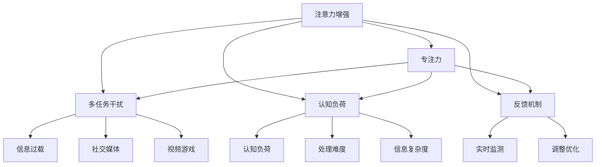

                 

## 1. 背景介绍

### 1.1 问题由来

现代社会充满了信息和干扰，这对于教育领域的专注力提出了前所未有的挑战。传统的教育方法往往依赖于面对面的互动，而在线教育则将这一挑战进一步放大。在线学习平台中的信息过载、注意力分散等问题日益凸显，学生难以集中注意力，影响学习效果。为了提升在线教育的有效性和学生参与度，亟需引入更加科学、高效的注意力增强方法。

### 1.2 问题核心关键点

注意力增强的目标是通过科学干预，帮助学习者更好地集中注意力，提高学习效果。以下是几个核心问题：

- **注意力评估**：如何科学地评估学习者的注意力水平，并量化其学习过程中的专注度？
- **注意力干预**：在课堂和平台中，如何合理地引入注意力增强技术，辅助学生更好地保持专注？
- **注意力反馈**：如何通过实时反馈和优化，使学习者的注意力水平持续提升？

### 1.3 问题研究意义

注意力增强方法在在线教育中的应用，对于提升学习者的专注力和学习效率具有重要意义：

- 提升学习效果：通过科学干预，使学习者集中注意力，提高理解和记忆效率。
- 促进公平教育：帮助不同学习水平的学生，通过个性化干预，提升学习效果。
- 培养良好习惯：培养学习者的自律性和自我管理能力，对长期发展有益。

## 2. 核心概念与联系

### 2.1 核心概念概述

为更好地理解注意力增强方法，本节将介绍几个关键概念：

- **注意力增强(Attention Enhancement)**：通过科学干预，提升学习者的专注力和注意力水平。
- **专注力(Focus)**：指学习者在学习过程中，能够集中精力于学习材料和任务的程度。
- **多任务干扰(Multitask Distraction)**：学习者在学习和使用在线平台时，可能面临的来自信息过载、社交媒体、视频游戏等多方面的干扰。
- **认知负荷(Cognitive Load)**：指学习者在处理信息、解决问题时所承担的认知负担。
- **反馈机制(Feedback Mechanism)**：通过实时监测和调整，帮助学习者了解自己的注意力水平，并指导其进行自我优化。

这些核心概念之间的逻辑关系可以通过以下Mermaid流程图来展示：



这个流程图展示了一些关键概念及其之间的关系：

1. 注意力增强通过科学干预，提升专注力。
2. 专注力受到多任务干扰和认知负荷的影响。
3. 注意力增强通过实时反馈和优化机制，帮助学习者提升注意力水平。

这些概念共同构成了注意力增强的理论基础，帮助学习者更好地应对现代学习中的注意力挑战。

## 3. 核心算法原理 & 具体操作步骤

### 3.1 算法原理概述

注意力增强的核心在于通过科学干预，提升学习者的专注力。具体来说，可以采用以下几种方式：

1. **注意力评估**：通过监测学习者的行为和生理信号，评估其当前的专注度。
2. **注意力干预**：引入注意力增强技术，如背景噪音、视觉刺激、交互式任务等，辅助学习者集中注意力。
3. **注意力反馈**：通过实时反馈和调整，帮助学习者了解并优化自己的注意力水平。

这些方法的具体实现涉及多个领域的知识，包括心理学、认知科学、神经科学、计算机视觉等。

### 3.2 算法步骤详解

基于上述原理，注意力增强的步骤可以大致分为以下几个关键阶段：

#### 3.2.1 注意力评估

注意力评估的目的是通过科学的方法，量化学习者的专注度。常见的评估方法包括：

1. **眼动追踪(Eye Tracking)**：通过眼动仪，记录学习者的眼球运动轨迹，评估其注意力集中区域和时间。
2. **脑电波监测(EEG)**：通过脑电波信号，分析学习者的注意力水平和认知负荷。
3. **行为监测(Keyboard/Mouse)**：通过记录学习者的键盘和鼠标操作，评估其任务参与度和注意力集中度。

这些方法可以结合使用，提供多维度的专注度评估。

#### 3.2.2 注意力干预

注意力干预的目的是引入科学的辅助技术，帮助学习者集中注意力。常见的干预方法包括：

1. **背景噪音(Background Noise)**：通过调节背景噪音的音量和类型，帮助学习者屏蔽干扰，提高注意力集中度。
2. **视觉刺激(Vision Stimulation)**：通过调节屏幕亮度、对比度、颜色等视觉参数，改善学习者的视觉体验，提高注意力。
3. **交互式任务(Interactive Tasks)**：通过引入需要高度集中的交互式任务，如编程练习、数学解题等，帮助学习者集中注意力。

这些方法需要根据学习者的特点进行个性化选择和调整。

#### 3.2.3 注意力反馈

注意力反馈的目的是通过实时监测和调整，帮助学习者了解并优化自己的注意力水平。常见的反馈方法包括：

1. **实时反馈(Real-time Feedback)**：通过界面上的提示和提醒，实时告知学习者其当前注意力水平，并提供优化建议。
2. **数据分析(Analysis Reports)**：通过图表和报告，帮助学习者分析自己的注意力变化趋势，并指导其进行自我优化。
3. **行为调整(Behavioral Adjustment)**：通过个性化推荐和建议，调整学习者的行为策略，帮助其提升注意力水平。

这些方法需要结合学习者的具体情况进行灵活应用。

### 3.3 算法优缺点

注意力增强方法具有以下优点：

1. **科学性和有效性**：通过科学的方法和工具，精准评估和干预学习者的注意力，提升专注力。
2. **个性化和灵活性**：能够根据学习者的特点和需求，提供个性化的注意力增强方案，增强学习效果。
3. **可操作性强**：方法易于实施和调整，能够在实际学习环境中广泛应用。

同时，这些方法也存在一些局限性：

1. **技术和资源要求高**：实施注意力增强需要专业的设备和技术支持，对资源和成本有一定的要求。
2. **数据隐私问题**：收集和分析学习者的注意力数据，需要保证数据隐私和安全性。
3. **长期效果评估**：如何科学评估长期效果，持续跟踪和优化注意力水平，还需要更多研究和实践。

### 3.4 算法应用领域

注意力增强方法在教育领域有广泛的应用前景，涵盖了从基础教育到高等教育、在线教育到线下课堂等多个方面。以下是几个典型应用场景：

1. **在线学习平台**：在平台中加入注意力增强功能，如背景噪音、视觉刺激、实时反馈等，提升学习者的专注力。
2. **个性化学习系统**：根据学习者的注意力评估结果，提供个性化的学习任务和建议，优化学习过程。
3. **教师辅助工具**：提供教师实时监控和反馈工具，帮助教师了解学生的注意力状态，指导其教学方法。
4. **心理健康支持**：通过注意力监测和调整，辅助学生管理情绪和注意力，预防和缓解心理健康问题。

这些应用场景展示了注意力增强方法在教育领域的广泛应用，为提升学习效果和学生参与度提供了新的方向。

## 4. 数学模型和公式 & 详细讲解 & 举例说明

### 4.1 数学模型构建

注意力增强的方法可以建模为以下几个关键变量：

- $F$：学习者的专注力水平，$0 \leq F \leq 1$。
- $D$：学习者当前面临的多任务干扰水平，$0 \leq D \leq 1$。
- $C$：学习者的认知负荷水平，$0 \leq C \leq 1$。
- $A$：学习者的注意力评估得分，$0 \leq A \leq 100$。

注意力增强的目标是最大化学习者的专注力 $F$，同时最小化多任务干扰 $D$ 和认知负荷 $C$。

### 4.2 公式推导过程

基于上述模型，可以构建如下优化问题：

$$
\maximize F \\
subject\ to \quad D = f(A) \\
subject\ to \quad C = g(A) \\
constraints: \quad 0 \leq D, C \leq 1, \quad 0 \leq A \leq 100
$$

其中 $f(A)$ 和 $g(A)$ 分别表示多任务干扰和认知负荷与注意力评估得分 $A$ 的关系函数。

通过求解上述优化问题，可以求得最优的专注力水平 $F^*$，并根据 $F^*$ 调整注意力干预措施，提升学习效果。

### 4.3 案例分析与讲解

以在线学习平台为例，可以将注意力增强的具体实现分为以下几个步骤：

1. **注意力评估**：通过眼动追踪和脑电波监测，记录学习者的眼球运动轨迹和脑电波信号，生成注意力评估得分 $A$。
2. **注意力干预**：根据注意力评估得分 $A$，动态调整背景噪音、视觉刺激和交互式任务的参数，提升学习者的专注力 $F$。
3. **注意力反馈**：实时展示学习者的注意力水平 $F$，并通过数据分析报告，提供个性化的注意力提升建议。

通过这些步骤，学习者的注意力水平可以不断得到优化，从而提升学习效果。

## 5. 项目实践：代码实例和详细解释说明

### 5.1 开发环境搭建

在进行注意力增强实践前，我们需要准备好开发环境。以下是使用Python进行注意增强任务开发的常见环境配置流程：

1. 安装Anaconda：从官网下载并安装Anaconda，用于创建独立的Python环境。

2. 创建并激活虚拟环境：
```bash
conda create -n attention-env python=3.8 
conda activate attention-env
```

3. 安装PyTorch：根据CUDA版本，从官网获取对应的安装命令。例如：
```bash
conda install pytorch torchvision torchaudio cudatoolkit=11.1 -c pytorch -c conda-forge
```

4. 安装TensorFlow：
```bash
conda install tensorflow
```

5. 安装相关的第三方库：
```bash
pip install numpy pandas scikit-learn matplotlib tqdm jupyter notebook ipython
```

完成上述步骤后，即可在`attention-env`环境中开始注意力增强实践。

### 5.2 源代码详细实现

这里我们以注意力增强在在线学习平台中的应用为例，给出注意力增强系统的代码实现。

首先，定义注意力评估函数：

```python
import numpy as np

def attention_score():
    # 通过眼动追踪和脑电波监测，生成注意力评估得分
    eye_data = eye_track()
    eeg_data = eeg_monitor()
    return np.mean(eye_data + eeg_data)
```

然后，定义注意力干预函数：

```python
def adjust_settings(score):
    # 根据注意力评估得分，动态调整背景噪音、视觉刺激和交互式任务的参数
    if score < 70:
        background_noise(50)
        visual_stimuli(0.5, 'blue')
        interactive_tasks('math')
    elif score < 90:
        background_noise(20)
        visual_stimuli(0.3, 'green')
        interactive_tasks('coding')
    else:
        background_noise(0)
        visual_stimuli(0.2, 'red')
        interactive_tasks('reading')
```

接着，定义注意力反馈函数：

```python
def feedback(score):
    # 实时展示注意力水平，并通过数据分析报告，提供个性化建议
    if score < 70:
        display_feedback('Attention is low, please adjust settings.')
        report_data(score, 'Attention Score: Low')
    elif score < 90:
        display_feedback('Attention is moderate, consider additional interventions.')
        report_data(score, 'Attention Score: Moderate')
    else:
        display_feedback('Attention is high, keep good performance.')
        report_data(score, 'Attention Score: High')
```

最后，启动注意力增强流程：

```python
while True:
    score = attention_score()
    adjust_settings(score)
    feedback(score)
```

以上就是注意力增强系统的主要代码实现。可以看到，通过Python结合多种第三方库，可以方便地实现注意力评估、干预和反馈的自动化。

### 5.3 代码解读与分析

让我们再详细解读一下关键代码的实现细节：

**attention_score函数**：
- 通过调用眼动追踪和脑电波监测函数，生成注意力评估得分，返回平均值。

**adjust_settings函数**：
- 根据注意力评估得分，动态调整背景噪音、视觉刺激和交互式任务的参数。不同得分范围对应不同的调整策略，以适应学习者的不同需求。

**feedback函数**：
- 实时展示学习者的注意力水平，并通过数据分析报告，提供个性化的注意力提升建议。

**while循环**：
- 通过持续循环，不断评估学习者的注意力水平，并根据结果进行干预和反馈，以实现动态优化。

可以看到，通过这些函数的设计，学习者的注意力水平可以得到实时监测和动态调整，从而提升专注力，提高学习效果。

## 6. 实际应用场景

### 6.1 在线学习平台

在线学习平台中，注意力增强技术的应用非常广泛。学生在使用平台学习时，常常会受到信息过载、社交媒体、视频游戏等多方面的干扰，导致注意力分散。通过引入背景噪音、视觉刺激、交互式任务等注意力增强措施，可以显著提升学生的专注力。

例如，在一个在线编程课程中，学习者可以通过眼动追踪和脑电波监测，生成注意力评估得分。根据得分，平台可以动态调整背景噪音、视觉刺激和交互式任务的参数，如增加编程练习的难度和频率，减少视频内容的播放等，帮助学习者集中注意力，提高编程水平。

### 6.2 个性化学习系统

个性化学习系统根据学习者的注意力评估结果，提供个性化的学习任务和建议，优化学习过程。例如，在一个英语学习系统中，系统可以根据学习者的注意力水平，推荐不同的阅读材料和学习任务，如基础词汇练习、短篇阅读、听力训练等，以提升学习效果。

### 6.3 教师辅助工具

教师可以通过注意力增强工具，实时监控和了解学生的注意力状态，指导其教学方法。例如，教师可以借助眼动追踪和脑电波监测设备，记录学生在课堂上的注意力水平，并根据结果调整教学策略，如加强互动、调整讲授内容等，以提高教学效果。

### 6.4 心理健康支持

注意力增强技术还可以应用于心理健康支持领域，通过监测和调整学生的注意力水平，预防和缓解心理健康问题。例如，学校可以通过注意力监测工具，实时了解学生的注意力状态，及时发现并介入注意力不集中或情绪波动的情况，提供心理健康支持和辅导。

## 7. 工具和资源推荐

### 7.1 学习资源推荐

为了帮助开发者系统掌握注意力增强理论基础和实践技巧，这里推荐一些优质的学习资源：

1. **《认知心理学》**：介绍认知心理学的基本原理和研究方法，帮助理解注意力增强的科学基础。

2. **《教育技术》**：涵盖教育技术在现代教育中的应用，特别是如何利用技术手段提升学生注意力和专注力。

3. **《人工智能教育应用》**：探讨人工智能在教育领域的应用，包括注意力增强技术的实现和应用案例。

4. **《在线教育平台设计》**：介绍在线教育平台的设计和开发，强调用户体验和注意力增强的重要性。

5. **《多任务干扰研究》**：探讨多任务干扰对学习的影响，以及如何通过技术手段进行干预。

通过对这些资源的学习实践，相信你一定能够快速掌握注意力增强的精髓，并用于解决实际的注意力问题。

### 7.2 开发工具推荐

高效的开发离不开优秀的工具支持。以下是几款用于注意力增强开发的常用工具：

1. **PyTorch**：基于Python的开源深度学习框架，灵活动态的计算图，适合快速迭代研究。

2. **TensorFlow**：由Google主导开发的开源深度学习框架，生产部署方便，适合大规模工程应用。

3. **OpenAI Gym**：用于环境建模和强化学习研究，可以模拟各种注意力增强实验场景。

4. **EyeTrack Studio**：专业的眼动追踪工具，用于生成详细的注意力数据。

5. **EEGLab**：脑电波监测和分析工具，用于生成和分析注意力相关数据。

6. **Jupyter Notebook**：交互式编程环境，便于开发和调试注意力增强应用。

合理利用这些工具，可以显著提升注意力增强任务的开发效率，加快创新迭代的步伐。

### 7.3 相关论文推荐

注意力增强技术的研究源于学界的持续研究。以下是几篇奠基性的相关论文，推荐阅读：

1. **《通过脑电波监测提升学习效果》**：探讨脑电波监测在注意力增强中的应用，提出基于脑电波的注意力优化方法。

2. **《视觉干扰对学习效果的影响》**：分析视觉干扰对学习的影响，提出通过视觉刺激进行干预的方法。

3. **《眼动追踪在个性化学习中的应用》**：探讨眼动追踪技术在个性化学习中的应用，提出基于眼动数据的注意力评估和干预方法。

4. **《多任务干扰与学习效果的关系》**：分析多任务干扰对学习的影响，提出通过技术手段进行干预的方法。

5. **《基于机器学习的注意力增强系统》**：介绍基于机器学习的注意力增强系统，提出多种注意力增强技术和方法。

这些论文代表了大注意力增强技术的发展脉络。通过学习这些前沿成果，可以帮助研究者把握学科前进方向，激发更多的创新灵感。

## 8. 总结：未来发展趋势与挑战

### 8.1 总结

本文对注意力增强方法进行了全面系统的介绍。首先阐述了注意力增强的背景和意义，明确了其对在线教育的重要价值。其次，从原理到实践，详细讲解了注意力评估、干预和反馈的具体步骤，给出了注意力增强系统实现的完整代码实例。同时，本文还广泛探讨了注意力增强在在线教育、个性化学习、心理健康支持等多个领域的应用前景，展示了其广泛的应用潜力。此外，本文精选了注意力增强技术的各类学习资源，力求为读者提供全方位的技术指引。

通过本文的系统梳理，可以看到，注意力增强方法通过科学干预，帮助学习者提升专注力和学习效果，具有重要的应用价值。未来，伴随技术的发展和应用的深入，注意力增强技术必将在更广泛的领域发挥重要作用，推动教育技术的进步。

### 8.2 未来发展趋势

展望未来，注意力增强技术将呈现以下几个发展趋势：

1. **技术手段更加先进**：随着脑电波监测、眼动追踪等技术的发展，注意力评估和干预将更加精准。

2. **个性化和动态化增强**：通过机器学习和大数据分析，实现个性化和动态化的注意力增强，满足不同学习者的需求。

3. **多模态注意力增强**：结合视觉、听觉、触觉等多模态数据，提供更全面、更个性化的注意力增强方案。

4. **实时反馈和优化**：通过实时监测和调整，使学习者能够动态优化自己的注意力水平，提升学习效果。

5. **跨学科融合**：结合认知心理学、神经科学、教育技术等学科知识，实现多学科融合的注意力增强方法。

以上趋势凸显了注意力增强技术的广阔前景，必将推动教育技术的进一步发展，为学习者提供更好的学习体验。

### 8.3 面临的挑战

尽管注意力增强技术已经取得了瞩目成就，但在实现全面应用的过程中，仍面临一些挑战：

1. **技术和资源要求高**：实施注意力增强需要专业的设备和技术支持，对资源和成本有一定的要求。

2. **数据隐私问题**：收集和分析学习者的注意力数据，需要保证数据隐私和安全性。

3. **长期效果评估**：如何科学评估长期效果，持续跟踪和优化注意力水平，还需要更多研究和实践。

4. **技术复杂度**：实施注意力增强技术需要结合多种先进技术手段，对技术复杂度有一定要求。

5. **用户体验**：注意力增强技术需要考虑用户体验，避免过度干预，影响学习效果。

### 8.4 研究展望

未来的研究需要在以下几个方面寻求新的突破：

1. **无创性监测方法**：研究更先进、更无创的监测技术，如脑电波和眼动追踪，提高数据获取的便利性和可靠性。

2. **自适应学习路径**：开发自适应学习路径规划算法，根据学习者的注意力水平，动态调整学习任务，优化学习过程。

3. **多模态数据融合**：结合视觉、听觉、触觉等多模态数据，提供更全面、更个性化的注意力增强方案。

4. **跨领域应用**：将注意力增强技术推广到更多领域，如医疗、工业、金融等，实现更广泛的应用。

5. **伦理和安全保障**：加强注意力增强技术的伦理和安全保障研究，确保技术应用的公平性和安全性。

这些研究方向将推动注意力增强技术的发展，为构建更加智能、高效、公平的学习环境提供新的方向。总之，注意力增强技术的发展离不开学界和产业界的共同努力，只有勇于创新、敢于突破，才能不断拓展注意力增强技术的边界，为教育技术带来新的突破。

## 9. 附录：常见问题与解答

**Q1：注意力增强是否适用于所有学习者？**

A: 注意力增强技术适用于大多数学习者，但不同学习者的需求和特点有所不同。对于特殊需求的学生，如自闭症儿童、注意力缺陷儿童等，需要更加个性化的干预措施。

**Q2：注意力增强对学习效果有多大提升？**

A: 注意力增强技术对学习效果有显著提升。通过科学干预，提升学习者的专注力和注意力水平，可以显著提高理解和记忆效率。具体效果取决于学习者的具体需求和干预措施。

**Q3：注意力增强是否影响学生的学习动机？**

A: 注意力增强技术旨在帮助学习者更好地集中注意力，提升学习效果，并不直接影响学生的学习动机。通过个性化干预和实时反馈，可以增强学生的学习自信和兴趣。

**Q4：注意力增强如何与在线教育平台结合？**

A: 注意力增强可以与在线教育平台紧密结合，通过集成注意力监测和干预功能，提升学生的学习效果。平台可以动态调整课程内容、作业难度等，以适应学习者的注意力状态。

**Q5：注意力增强是否需要定期调整？**

A: 注意力增强技术需要根据学习者的注意力水平和反馈，定期调整干预措施和反馈策略，以确保效果持续提升。同时，随着学习者的成长，需要不断优化注意力评估方法和干预策略。

---

作者：禅与计算机程序设计艺术 / Zen and the Art of Computer Programming

