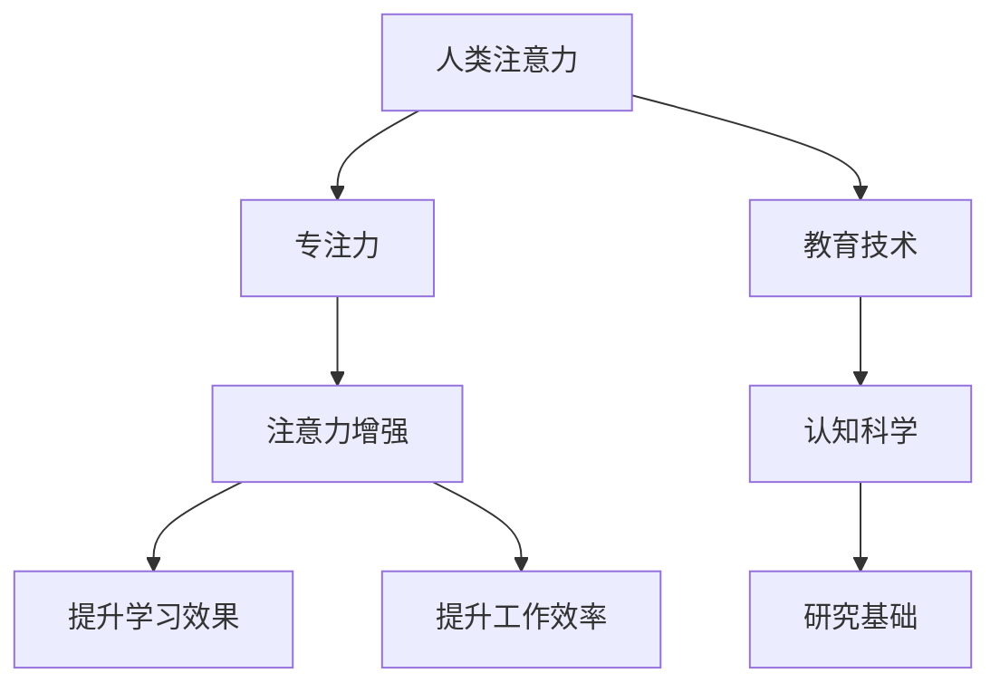

                 

# 人类注意力增强：提升专注力和注意力在教育中的未来方向

> 关键词：人类注意力,提升专注力,注意力增强,教育技术,未来方向

## 1. 背景介绍

在当前信息爆炸的时代，人类注意力面临前所未有的挑战。从学生到成人，从学校到职场，各种注意力分散的状况随处可见，严重影响着学习和工作效率。如何在教育中提升学生的注意力，提高其学习效果，成为了亟待解决的问题。近年来，随着认知科学的进展，教育技术研究人员和心理学家开始探索如何利用科技手段，辅助人类注意力增强，提升专注力和学习能力。本篇文章将从人类注意力的基本概念出发，分析当前技术手段在教育中的应用，并展望未来方向。

## 2. 核心概念与联系

### 2.1 核心概念概述

为更好地理解注意力增强技术在教育中的应用，本节将介绍几个密切相关的核心概念：

- **人类注意力（Human Attention）**：指人对外部信息的感知、选择、整合和记忆能力。注意力是学习、记忆和决策等认知活动的基础。

- **专注力（Focus）**：指人在特定时间内，集中于某项任务并对其持续关注的能力。提高专注力有助于提升工作效率和学习效果。

- **注意力增强（Attention Enhancement）**：指通过技术手段辅助个体提升其注意力的能力，增强其学习、工作或生活的专注度和效率。

- **教育技术（Educational Technology, EdTech）**：指利用现代信息技术手段，辅助教育过程的各个环节，提高教学质量和教育效率。

- **认知科学（Cognitive Science）**：研究人类认知过程及其神经机制的科学。注意力增强技术借鉴了认知科学的研究成果，通过科学技术手段辅助提升认知能力。

这些核心概念之间的逻辑关系可以通过以下Mermaid流程图来展示：



这个流程图展示了几大核心概念之间的联系：

1. 人类注意力是专注力的基础，通过提高注意力可以提升专注力。
2. 注意力增强技术利用科技手段辅助提升注意力，从而提高专注力。
3. 教育技术和认知科学为注意力增强技术提供了理论和实践基础。
4. 注意力增强技术的最终目的是提高学习和工作效率。

## 3. 核心算法原理 & 具体操作步骤

### 3.1 算法原理概述

人类注意力增强的算法原理主要基于认知神经科学和心理学研究成果，通过技术手段辅助提升个体对信息的感知、选择、整合和记忆能力。其核心思想是：利用现代信息技术，辅助个体更好地管理其注意力资源，增强其专注力和学习效果。

### 3.2 算法步骤详解

注意力增强技术在教育中的应用，通常包括以下几个关键步骤：

**Step 1: 数据采集与分析**
- 通过各种传感器和设备，采集学生的学习行为数据，如鼠标移动轨迹、键盘敲击频率、眼动轨迹等。
- 使用数据挖掘和机器学习技术，分析这些数据，了解学生的注意力集中状态、专注时间和分散原因。

**Step 2: 注意力模型构建**
- 基于认知科学和心理学理论，建立注意力模型，描述注意力的状态转移和影响因素。
- 结合神经网络和深度学习技术，训练模型，预测学生在特定任务下的注意力状态。

**Step 3: 注意力干预措施**
- 根据注意力模型预测结果，实时调整教学策略和内容，如调整课程难度、节奏、互动方式等。
- 应用增强现实（AR）和虚拟现实（VR）技术，提供沉浸式学习环境，提升学生的注意力和参与度。
- 引入游戏化元素，如任务完成度、奖励机制等，激励学生保持高水平注意力。

**Step 4: 效果评估与优化**
- 通过实验和调研，评估注意力增强技术对学生专注力和学习效果的影响。
- 根据评估结果，持续优化模型和干预措施，确保技术效果的最大化。

### 3.3 算法优缺点

人类注意力增强技术的优点包括：
1. 科学基础扎实：基于认知科学和心理学研究成果，有理论支持。
2. 技术手段多样：结合传感器、神经网络和增强现实等技术，手段丰富。
3. 个性化定制：通过分析个体数据，实现个性化干预，提升效果。
4. 实时反馈：通过实时监控和调整，快速响应注意力变化。

同时，该技术也存在以下局限性：
1. 依赖传感器和设备：需要较昂贵的设备，难以大规模推广。
2. 数据隐私问题：采集大量个人信息，可能存在隐私风险。
3. 模型复杂度高：需要复杂的模型和算法，开发和维护成本高。
4. 应用场景有限：主要应用于课堂教学，难以推广到日常学习和生活。

尽管存在这些局限性，但基于人类注意力增强技术的应用前景广阔，特别是在教育领域，有望显著提升学生的学习效果。

### 3.4 算法应用领域

人类注意力增强技术在教育中的应用前景广阔，具体包括：

- **课堂教学**：通过传感器和智能设备，实时监测学生的注意力状态，根据模型预测结果调整教学策略，提高课堂效果。
- **个性化学习**：分析学生的注意力数据，提供个性化学习建议，如推荐适宜的学习内容、调整学习节奏等。
- **在线教育**：通过增强现实和虚拟现实技术，提供沉浸式学习环境，提升学生的学习体验和效果。
- **心理辅导**：应用心理学和认知科学的理论，辅助进行学生心理健康评估和辅导，提升其情绪稳定性和学习动机。
- **远程教育**：通过注意力增强技术，提升远程学习的互动性和沉浸感，提高学生参与度和学习效果。

## 4. 数学模型和公式 & 详细讲解 & 举例说明

### 4.1 数学模型构建

本节将使用数学语言对注意力增强技术的核心算法进行更加严格的刻画。

记学生的注意力状态为 $A_t$，其中 $t$ 表示时间，$A_t \in \{low,medium,high\}$，分别表示低、中、高注意力状态。模型的输入为 $X_t$，包括当前任务、环境因素等，$A_{t-1}$ 为上一时刻的注意力状态。模型的输出为 $A_t$，即下一时刻的注意力状态。

注意力增强模型可以表示为：

$$
A_t = f(A_{t-1}, X_t, \theta)
$$

其中 $f$ 为模型函数，$\theta$ 为模型参数。

### 4.2 公式推导过程

为了更好地理解注意力增强模型，我们将使用一个简单的线性回归模型进行推导。假设 $X_t$ 为一个一维向量，$A_t$ 为注意力状态，$\theta$ 为模型参数。模型的目标是最小化损失函数：

$$
\mathcal{L}(\theta) = \frac{1}{N} \sum_{i=1}^N (\mathcal{L}(A_i, \hat{A}_i)^2)
$$

其中 $A_i$ 为实际注意力状态，$\hat{A}_i$ 为模型预测的注意力状态。

根据梯度下降法，模型参数的更新公式为：

$$
\theta \leftarrow \theta - \eta \nabla_{\theta}\mathcal{L}(\theta)
$$

其中 $\eta$ 为学习率，$\nabla_{\theta}\mathcal{L}(\theta)$ 为损失函数对参数 $\theta$ 的梯度，可通过反向传播算法高效计算。

### 4.3 案例分析与讲解

假设我们有一组历史数据：

| 时间 | 当前任务 | 环境因素 | 注意力状态 |
| ---- | -------- | -------- | ---------- |
| 1    | 阅读     | 噪音     | low        |
| 2    | 听讲     | 有互动   | medium     |
| 3    | 做题     | 无干扰   | high       |

我们可以构建一个简单的线性回归模型，输入为当前任务和环境因素，输出为注意力状态。设 $\theta$ 为模型参数，$A_t$ 为注意力状态，$X_t$ 为输入向量。模型公式为：

$$
A_t = \theta_0 + \theta_1 \times \text{当前任务} + \theta_2 \times \text{环境因素}
$$

通过最小化损失函数，我们可以训练出模型的参数 $\theta$。具体实现代码如下：

```python
import numpy as np
from sklearn.linear_model import LinearRegression

# 构建数据
X = np.array([[1, 0], [0, 1], [1, 1]])
y = np.array([0, 1, 2])

# 构建模型
model = LinearRegression()

# 训练模型
model.fit(X, y)

# 预测
X_new = np.array([[1, 1]])
y_pred = model.predict(X_new)
print(y_pred)
```

## 5. 项目实践：代码实例和详细解释说明

### 5.1 开发环境搭建

在进行注意力增强项目实践前，我们需要准备好开发环境。以下是使用Python进行Keras开发的环境配置流程：

1. 安装Anaconda：从官网下载并安装Anaconda，用于创建独立的Python环境。

2. 创建并激活虚拟环境：
```bash
conda create -n attention-env python=3.8 
conda activate attention-env
```

3. 安装Keras和其他相关库：
```bash
conda install keras numpy scikit-learn tensorflow
```

4. 安装TensorFlow：根据CUDA版本，从官网获取对应的安装命令。例如：
```bash
conda install tensorflow
```

5. 安装相关数据集：
```bash
pip install scikit-learn
```

完成上述步骤后，即可在`attention-env`环境中开始注意力增强项目实践。

### 5.2 源代码详细实现

这里我们以简单的注意力模型为例，给出使用Keras实现注意力增强技术的代码实现。

首先，定义注意力模型：

```python
from keras.layers import Dense, Dropout, Input, LSTM, TimeDistributed
from keras.models import Model
from keras.optimizers import Adam

# 定义模型
def attention_model():
    # 输入层
    input_layer = Input(shape=(timesteps, features))
    
    # LSTM层
    lstm_layer = LSTM(64, return_sequences=True)(input_layer)
    
    # 全连接层
    dense_layer = Dense(64, activation='relu')(lstm_layer)
    
    # 输出层
    output_layer = Dense(1, activation='sigmoid')(dense_layer)
    
    # 模型构建
    model = Model(inputs=input_layer, outputs=output_layer)
    
    return model
```

然后，定义数据集和模型训练：

```python
from keras.utils import to_categorical
from sklearn.model_selection import train_test_split

# 准备数据
X_train, X_test, y_train, y_test = train_test_split(X, y, test_size=0.2, random_state=42)

# 数据预处理
X_train = X_train.reshape(-1, timesteps, features)
X_test = X_test.reshape(-1, timesteps, features)
y_train = to_categorical(y_train)
y_test = to_categorical(y_test)

# 构建模型
model = attention_model()

# 编译模型
model.compile(optimizer=Adam(learning_rate=0.001), loss='binary_crossentropy', metrics=['accuracy'])

# 训练模型
model.fit(X_train, y_train, epochs=100, batch_size=64, validation_data=(X_test, y_test))
```

最后，启动模型训练：

```python
# 模型训练
model.fit(X_train, y_train, epochs=100, batch_size=64, validation_data=(X_test, y_test))
```

以上就是使用Keras实现注意力增强技术的完整代码实现。可以看到，Keras的简单易用使得模型构建和训练变得非常简单，开发者可以将更多精力放在数据处理、模型改进等高层逻辑上，而不必过多关注底层的实现细节。

### 5.3 代码解读与分析

让我们再详细解读一下关键代码的实现细节：

**注意力模型定义**：
- `Input`层：定义输入数据的形状，其中 `timesteps` 和 `features` 分别为时间步数和特征数。
- `LSTM层`：定义长短期记忆网络层，用于捕捉序列数据的时间依赖关系。
- `Dense层`：定义全连接层，用于提取序列数据的空间特征。
- `Output层`：定义输出层，使用 sigmoid 激活函数，输出注意力状态的概率。

**数据集准备**：
- `train_test_split`：将数据集划分为训练集和测试集，设定随机种子，确保结果可复现。
- `to_categorical`：将标签转化为 one-hot 编码，便于模型处理。

**模型训练**：
- `compile`：定义模型的优化器、损失函数和评估指标。
- `fit`：执行模型训练，设置训练轮数、批次大小和验证集。

可以看到，Keras的封装使得模型构建和训练变得非常简单高效。开发者可以在此基础上进行进一步优化，如引入更复杂的神经网络结构、添加正则化等，以提高模型精度和鲁棒性。

## 6. 实际应用场景

### 6.1 教育课堂

基于注意力增强技术的教育课堂，能够实时监测学生的注意力状态，并根据模型预测结果调整教学策略。例如：

- **课堂互动**：根据注意力模型预测结果，调整课堂互动频率和方式，保持学生高水平注意力。
- **任务难度调整**：根据注意力状态，动态调整任务的难度和复杂度，提升学生学习效果。
- **注意力反馈**：实时反馈学生的注意力状态，帮助教师及时发现和解决注意力分散问题。

### 6.2 在线学习

在线学习平台结合注意力增强技术，可以显著提升学生的学习效果和参与度。例如：

- **个性化推荐**：根据学生的注意力状态，推荐适宜的学习内容，提升学习体验。
- **动态调整**：根据学生的注意力变化，动态调整学习节奏和方式，保持学习效率。
- **注意力训练**：结合注意力训练游戏，帮助学生提升专注力和注意力，增强学习动机。

### 6.3 远程教育

远程教育平台结合注意力增强技术，可以提升学生的学习效果和参与度。例如：

- **互动教学**：实时监测学生的注意力状态，调整互动教学的方式和频率，提高远程学习的互动性。
- **注意力训练**：结合注意力训练游戏和互动环节，提升学生的注意力和参与度。
- **个性化反馈**：根据学生的注意力状态，提供个性化的学习反馈和建议，提升学习效果。

### 6.4 未来应用展望

随着注意力增强技术的不断发展，未来将在更多领域得到应用，为教育带来新的变革：

- **泛在学习**：结合物联网和移动设备，实现泛在学习，随时随地监测和提升学生的注意力。
- **智能教室**：通过智能设备和传感器，构建智能教室，实时监测和提升学生的注意力。
- **情感分析**：结合情感分析技术，识别学生的情绪状态，优化教学策略，提升学习效果。
- **跨学科应用**：将注意力增强技术应用于更多学科，如科学、文学、艺术等，提升学生的综合素质和创造力。
- **国际教育**：结合注意力增强技术和语言学习，提升非母语学习者的学习效果，促进国际教育交流。

## 7. 工具和资源推荐

### 7.1 学习资源推荐

为了帮助开发者系统掌握注意力增强技术的理论基础和实践技巧，这里推荐一些优质的学习资源：

1. 《深度学习与认知科学研究》系列博文：由认知科学领域的专家撰写，深入浅出地介绍了深度学习在认知科学研究中的应用。

2. 《认知心理学与神经科学导论》课程：哈佛大学开设的认知心理学课程，涵盖认知科学和神经科学的基本概念和经典实验。

3. 《注意力模型与深度学习》书籍：结合认知科学和深度学习的最新研究成果，全面介绍了注意力增强技术的基本原理和应用。

4. 《教育技术学》：介绍教育技术的基本概念、方法和应用，涵盖各种前沿技术在教育中的应用。

通过对这些资源的学习实践，相信你一定能够快速掌握注意力增强技术的精髓，并用于解决实际的NLP问题。

### 7.2 开发工具推荐

高效的开发离不开优秀的工具支持。以下是几款用于注意力增强开发的常用工具：

1. Keras：基于Python的深度学习框架，易于使用且功能强大，适合快速迭代研究。

2. TensorFlow：由Google主导开发的深度学习框架，生产部署方便，适合大规模工程应用。

3. PyTorch：基于Python的深度学习框架，灵活性高，适合学术研究和原型开发。

4. Weights & Biases：模型训练的实验跟踪工具，可以记录和可视化模型训练过程中的各项指标，方便对比和调优。

5. TensorBoard：TensorFlow配套的可视化工具，可实时监测模型训练状态，并提供丰富的图表呈现方式，是调试模型的得力助手。

合理利用这些工具，可以显著提升注意力增强任务的开发效率，加快创新迭代的步伐。

### 7.3 相关论文推荐

注意力增强技术的发展源于学界的持续研究。以下是几篇奠基性的相关论文，推荐阅读：

1. 《注意力机制在深度学习中的重要性》：介绍注意力机制在深度学习中的应用，展示了注意力机制在提高模型性能方面的重要作用。

2. 《神经网络中的注意力机制》：深入探讨神经网络中的注意力机制，分析其工作原理和优化方法。

3. 《认知神经科学与注意力增强技术》：结合认知神经科学研究成果，探讨注意力增强技术的理论基础和应用前景。

4. 《基于注意力增强技术的教育系统设计》：结合教育学和认知科学，探讨注意力增强技术在教育系统中的应用。

5. 《深度学习在认知科学研究中的应用》：结合深度学习和认知科学的最新研究成果，全面介绍了深度学习在认知科学研究中的应用。

这些论文代表了大注意力增强技术的发展脉络。通过学习这些前沿成果，可以帮助研究者把握学科前进方向，激发更多的创新灵感。

## 8. 总结：未来发展趋势与挑战

### 8.1 总结

本文对基于注意力增强技术的教育应用进行了全面系统的介绍。首先阐述了注意力增强技术的基本概念和核心算法原理，明确了技术在提升专注力、学习效果方面的独特价值。其次，从原理到实践，详细讲解了注意力增强技术的数学模型和操作步骤，给出了注意力增强任务开发的完整代码实例。同时，本文还广泛探讨了注意力增强技术在教育中的应用场景，展示了技术的前景和潜力。

通过本文的系统梳理，可以看到，注意力增强技术在教育中的巨大潜力。这些技术手段的创新应用，有望显著提升学生的学习效果，推动教育事业的全面发展。未来，伴随技术的不断演进，注意力增强技术必将在教育领域大放异彩，为社会进步贡献力量。

### 8.2 未来发展趋势

展望未来，注意力增强技术将呈现以下几个发展趋势：

1. **智能化升级**：结合更多认知科学和神经科学研究成果，构建更智能化的注意力增强模型，提供更个性化的学习建议。

2. **实时反馈优化**：结合实时监测和反馈机制，持续优化学习策略，提高学习效果。

3. **多模态融合**：结合视觉、听觉、触觉等多模态数据，构建更全面的注意力监测系统。

4. **跨平台应用**：将注意力增强技术应用于更多平台，如智能穿戴设备、移动端应用等，实现泛在学习。

5. **跨学科融合**：结合不同学科的知识和应用，提升注意力增强技术的多样性和应用范围。

6. **国际交流**：结合语言学习技术，提升非母语学习者的学习效果，促进国际教育交流。

这些趋势凸显了注意力增强技术的广阔前景。这些方向的探索发展，必将进一步提升学生的学习效果，推动教育事业的全面进步。

### 8.3 面临的挑战

尽管注意力增强技术已经取得了瞩目成就，但在迈向更加智能化、普适化应用的过程中，它仍面临诸多挑战：

1. **数据隐私问题**：采集大量个人信息，可能存在隐私风险。如何保护用户隐私，构建安全可信的系统，将是重要的研究课题。

2. **模型复杂度高**：构建复杂模型，需要大量数据和计算资源，开发和维护成本高。如何降低模型复杂度，提高开发效率，将是重要的研究方向。

3. **应用场景有限**：主要应用于教育领域，难以推广到其他领域。如何扩展技术应用范围，适应更多场景，将是重要的实践课题。

4. **技术普及度低**：技术成本高，难以大规模推广。如何降低技术门槛，实现技术普及，将是重要的推广方向。

5. **效果评估难度大**：注意力增强效果难以量化，评估难度大。如何构建科学的评估体系，客观评估技术效果，将是重要的研究方向。

6. **伦理道德问题**：技术应用过程中可能存在伦理道德问题，如数据滥用、隐私泄露等。如何构建伦理规范，保障技术应用的安全性，将是重要的课题。

这些挑战凸显了注意力增强技术在落地应用中的复杂性和不确定性。需要跨学科合作，共同努力，才能突破这些难题，实现技术的全面应用。

### 8.4 研究展望

面对注意力增强技术所面临的挑战，未来的研究需要在以下几个方面寻求新的突破：

1. **跨学科合作**：结合认知科学、神经科学、心理学等领域的最新研究成果，进一步完善技术理论基础。

2. **模型简化优化**：结合正则化、剪枝等技术，构建更简单、高效、易维护的模型。

3. **实时监测与反馈**：结合实时监测与反馈机制，持续优化学习策略，提高学习效果。

4. **跨平台应用推广**：结合智能穿戴设备、移动端应用等平台，实现技术推广和普及。

5. **跨学科融合**：结合不同学科的知识和应用，提升技术的多样性和应用范围。

6. **伦理道德保障**：建立技术应用的伦理规范，保障技术应用的合法性和安全性。

这些研究方向将为注意力增强技术的发展提供新的动力，推动技术在教育领域的应用。面向未来，我们期待更多的突破和创新，让注意力增强技术为学生的全面发展做出更大贡献。

## 9. 附录：常见问题与解答

**Q1：注意力增强技术是否适用于所有学习场景？**

A: 注意力增强技术在大多数学习场景中都能取得不错的效果，特别是在注意力分散较为严重的场合，如远程教育、在线学习等。但对于一些特殊的学习场景，如动手实践、体验式学习等，可能不太适合。需要根据具体场景进行选择和优化。

**Q2：注意力增强技术如何与其他技术结合？**

A: 注意力增强技术可以与多种教育技术结合使用，如游戏化学习、虚拟现实、智能评测等。结合游戏化元素，可以提升学生的学习兴趣和动机；结合虚拟现实技术，可以提供沉浸式学习环境；结合智能评测，可以提供个性化的学习反馈和建议。

**Q3：注意力增强技术如何保护用户隐私？**

A: 保护用户隐私是注意力增强技术应用中的重要课题。主要措施包括：
1. 数据匿名化处理，去除敏感信息。
2. 使用差分隐私技术，减少数据泄露风险。
3. 采用本地计算，减少数据传输风险。
4. 透明化数据使用方式，确保用户知情同意。

**Q4：注意力增强技术如何提高学习效果？**

A: 注意力增强技术通过实时监测和调整学习策略，提高学生的注意力和专注力。具体措施包括：
1. 实时反馈学习效果，及时调整学习策略。
2. 结合游戏化元素，提升学生的学习兴趣和动机。
3. 动态调整学习难度和节奏，保持学习效率。
4. 提供个性化的学习建议和反馈，提升学习效果。

**Q5：注意力增强技术的开发难点在哪里？**

A: 注意力增强技术的开发难点主要在于以下几个方面：
1. 数据采集和处理：需要收集大量的学习数据，并进行预处理和分析。
2. 模型构建和训练：需要构建复杂的模型，并进行有效的训练。
3. 应用场景适配：需要根据具体场景进行优化和适配。
4. 用户隐私保护：需要设计合理的隐私保护机制，确保用户数据安全。
5. 效果评估和优化：需要构建科学的效果评估体系，并持续优化技术方案。

这些难点需要多学科合作，共同攻克，才能实现技术的高效应用。

---

作者：禅与计算机程序设计艺术 / Zen and the Art of Computer Programming

