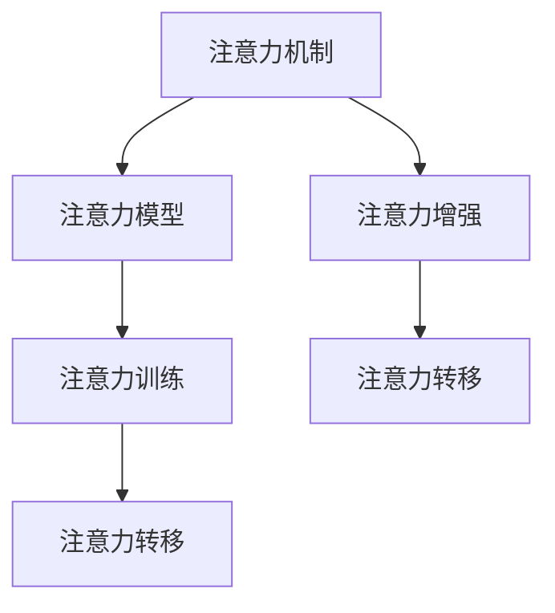

                 

# 人类注意力增强：提升专注力和注意力在教育中的策略与方法

## 1. 背景介绍

### 1.1 问题由来
在信息爆炸的时代，人类面临着重重挑战，如信息过载、注意力分散、工作学习效率下降等。特别是在教育领域，学生在课堂上的专注力下降，学习效果大打折扣。传统的教学方式往往注重知识传授，忽视了对学生注意力和专注力的训练。

为了解决这个问题，越来越多的研究者开始关注注意力训练和提升，开发出一系列注意力增强工具和方法。这些工具和方法通过训练大脑的注意力机制，帮助学生提升学习效果，提升专注力。本文将系统介绍基于计算机科学的注意力增强方法，并提供在教育领域中的应用实践。

### 1.2 问题核心关键点
注意力增强的核心在于通过计算机科学的技术手段，训练大脑的注意力机制，使其在面对复杂任务时，能够更好地保持专注和集中，从而提升学习效果。主要关注的关键点包括：
1. 注意力机制训练原理：如何通过科学的算法和模型，训练大脑的注意力系统。
2. 注意力增强工具开发：如何构建具有实际应用价值的注意力增强工具。
3. 注意力增强策略应用：如何将注意力增强工具应用于教育领域，提升学生学习效果。

## 2. 核心概念与联系

### 2.1 核心概念概述

为更好地理解注意力增强方法，本节将介绍几个密切相关的核心概念：

- 注意力机制(Attention Mechanism)：一种深度学习中的机制，用于计算输入序列中不同位置的权重，从而对重要信息进行加权处理。常见于序列建模任务，如机器翻译、语音识别、自然语言处理等。

- 注意力模型(Attention Model)：基于注意力机制设计的深度学习模型，能够自动学习输入序列的注意力权重，从而提高模型的鲁棒性和效果。如Transformer模型。

- 注意力训练(Attention Training)：通过特定任务训练模型，使其学习到更好的注意力机制，以提高模型在任务上的性能。

- 注意力增强(Attention Enhancement)：通过训练注意力机制，提升大脑对重要信息的专注和集中能力，从而增强认知和学习效果。

- 注意力转移(Attention Shifting)：指在大脑处理复杂任务时，通过注意力转移，快速聚焦于关键信息，避免被无关信息干扰。

这些核心概念之间的逻辑关系可以通过以下Mermaid流程图来展示：



这个流程图展示了这个核心概念链条，通过注意力机制、注意力模型训练，最终实现注意力增强和转移，从而提升认知和学习效果。

## 3. 核心算法原理 & 具体操作步骤
### 3.1 算法原理概述

注意力增强的核心算法原理是基于深度学习中的注意力机制，通过训练模型学习到更好的注意力权重，从而提升大脑对重要信息的专注和集中能力。以下详细介绍注意力增强的核心算法原理：

### 3.2 算法步骤详解

#### 3.2.1 注意力机制训练

1. **数据准备**：准备用于训练注意力模型的数据集，数据集应包含输入序列和相应的注意力权重标签。例如，在自然语言处理任务中，可以使用机器翻译数据集。

2. **模型设计**：设计一个基于注意力机制的深度学习模型，如Transformer。该模型能够自动学习输入序列的注意力权重，从而对重要信息进行加权处理。

3. **训练过程**：使用优化算法（如Adam）和损失函数（如交叉熵）对模型进行训练，最小化模型预测的注意力权重与真实标签之间的差异。

4. **评估与优化**：在训练过程中，定期在验证集上评估模型的性能，根据性能指标调整模型参数，优化训练过程。

#### 3.2.2 注意力增强训练

1. **注意力转移训练**：在注意力模型训练的基础上，增加注意力转移任务，训练模型在不同位置之间快速转移注意力，聚焦于关键信息。

2. **多任务学习**：通过同时训练注意力转移和注意力增强任务，模型能够学习到更好的注意力机制，提升对重要信息的专注和集中能力。

3. **数据增强**：通过数据增强技术，如回译、近义词替换等，扩充训练集，提升模型鲁棒性。

4. **正则化**：使用L2正则、Dropout等正则化技术，避免过拟合。

5. **模型评估**：在训练过程中，定期在测试集上评估模型性能，根据性能指标调整模型参数，优化训练过程。

### 3.3 算法优缺点

#### 3.3.1 算法优点

- **自动学习注意力权重**：注意力增强算法通过训练模型，自动学习输入序列的注意力权重，避免了手动设置权重的不足。
- **提高学习效果**：通过训练注意力机制，提升大脑对重要信息的专注和集中能力，从而提高认知和学习效果。
- **鲁棒性强**：通过数据增强和正则化技术，提高模型鲁棒性，避免过拟合。

#### 3.3.2 算法缺点

- **计算量大**：注意力增强算法需要训练复杂的深度学习模型，计算量较大，需要高性能计算资源。
- **数据需求高**：注意力增强算法对数据需求高，需要大量标注数据和多样化数据。
- **模型复杂**：注意力增强模型复杂，需要精心设计训练过程，才能取得理想效果。

### 3.4 算法应用领域

注意力增强算法已经广泛应用于计算机视觉、自然语言处理、机器翻译等领域。以下是注意力增强在教育领域的具体应用场景：

#### 3.4.1 课堂教学

在课堂教学中，注意力增强技术可以通过实时监测学生的注意力状态，动态调整教学内容和节奏，提高教学效果。例如，通过摄像头和传感器监测学生的注意力集中度，实时反馈给教师，教师可以及时调整教学方式，避免学生注意力分散。

#### 3.4.2 在线学习

在线学习平台可以通过注意力增强技术，帮助学生提升学习效果。例如，通过注意力模型训练，系统可以动态调整学习内容，推荐适合学生的学习材料。同时，通过注意力转移训练，系统可以指导学生如何在学习过程中快速聚焦于关键信息，避免被无关信息干扰。

#### 3.4.3 智能辅导

智能辅导系统可以通过注意力增强技术，提供个性化学习支持。例如，系统可以根据学生的注意力状态和行为特征，动态调整辅导内容和难度，提高学习效率。同时，系统可以实时监测学生的注意力转移情况，提供及时反馈，帮助学生更好地掌握知识。

## 4. 数学模型和公式 & 详细讲解 & 举例说明

### 4.1 数学模型构建

#### 4.1.1 注意力模型

注意力模型通过学习输入序列的注意力权重，实现对重要信息的加权处理。以Transformer模型为例，其注意力计算公式如下：

$$
\text{Attention}(Q, K, V) = \text{softmax}(\frac{QK^T}{\sqrt{d_k}})V
$$

其中，$Q$为查询向量，$K$为键向量，$V$为值向量，$d_k$为键向量的维度。注意力模型通过计算$Q$和$K$的相似度，得到每个位置的注意力权重，从而对$V$进行加权处理。

#### 4.1.2 注意力转移模型

注意力转移模型通过训练模型在不同位置之间快速转移注意力，聚焦于关键信息。例如，在Transformer模型中，可以通过增加注意力转移任务，训练模型在不同位置之间快速切换注意力，从而聚焦于关键信息。

### 4.2 公式推导过程

#### 4.2.1 注意力计算公式推导

以Transformer模型为例，注意力计算公式的推导如下：

1. **计算注意力权重**：

$$
\alpha_{ij} = \frac{\exp(\frac{q_i k_j}{\sqrt{d_k}})}{\sum_{j'} \exp(\frac{q_i k_{j'}}{\sqrt{d_k}})}
$$

其中，$q_i$为查询向量的第$i$个元素，$k_j$为键向量的第$j$个元素，$d_k$为键向量的维度。$\alpha_{ij}$为查询向量的第$i$个元素与键向量的第$j$个元素之间的注意力权重。

2. **计算加权值向量**：

$$
v_{i} = \sum_j \alpha_{ij} v_j
$$

其中，$v_i$为加权值向量的第$i$个元素。

3. **计算注意力输出**：

$$
\text{Attention}(Q, K, V) = v_i
$$

通过计算注意力权重和加权值向量，实现对输入序列的注意力加权处理。

#### 4.2.2 注意力转移计算公式推导

以Transformer模型为例，注意力转移计算公式的推导如下：

1. **计算注意力权重**：

$$
\alpha_{ij} = \frac{\exp(\frac{q_i k_j}{\sqrt{d_k}})}{\sum_{j'} \exp(\frac{q_i k_{j'}}{\sqrt{d_k}})}
$$

其中，$q_i$为查询向量的第$i$个元素，$k_j$为键向量的第$j$个元素，$d_k$为键向量的维度。$\alpha_{ij}$为查询向量的第$i$个元素与键向量的第$j$个元素之间的注意力权重。

2. **计算加权值向量**：

$$
v_{i} = \sum_j \alpha_{ij} v_j
$$

其中，$v_i$为加权值向量的第$i$个元素。

3. **计算注意力转移权重**：

$$
\beta_{ij} = \frac{\exp(\frac{q_i k_j}{\sqrt{d_k}})}{\sum_{j'} \exp(\frac{q_i k_{j'}}{\sqrt{d_k}})}
$$

其中，$q_i$为查询向量的第$i$个元素，$k_j$为键向量的第$j$个元素，$d_k$为键向量的维度。$\beta_{ij}$为查询向量的第$i$个元素与键向量的第$j$个元素之间的注意力转移权重。

4. **计算注意力转移输出**：

$$
\text{AttentionTransfer}(Q, K, V) = \sum_j \beta_{ij} v_j
$$

通过计算注意力权重和注意力转移权重，实现对输入序列的注意力转移。

### 4.3 案例分析与讲解

#### 4.3.1 机器翻译

在机器翻译任务中，注意力模型能够学习输入序列的注意力权重，对源语言和目标语言之间的对应关系进行加权处理。通过训练注意力模型，可以实现更准确的翻译结果。

#### 4.3.2 图像识别

在图像识别任务中，注意力模型可以学习输入图像的注意力权重，对图像中的关键区域进行加权处理。通过训练注意力模型，可以实现更准确的图像分类和识别。

## 5. 项目实践：代码实例和详细解释说明

### 5.1 开发环境搭建

在进行注意力增强项目开发前，需要准备好开发环境。以下是使用Python进行PyTorch开发的环境配置流程：

1. 安装Anaconda：从官网下载并安装Anaconda，用于创建独立的Python环境。

2. 创建并激活虚拟环境：
```bash
conda create -n attention-env python=3.8 
conda activate attention-env
```

3. 安装PyTorch：根据CUDA版本，从官网获取对应的安装命令。例如：
```bash
conda install pytorch torchvision torchaudio cudatoolkit=11.1 -c pytorch -c conda-forge
```

4. 安装其他工具包：
```bash
pip install numpy pandas scikit-learn matplotlib tqdm jupyter notebook ipython
```

完成上述步骤后，即可在`attention-env`环境中开始注意力增强项目开发。

### 5.2 源代码详细实现

下面我们以自然语言处理任务为例，给出使用PyTorch实现注意力增强的代码实现。

首先，定义注意力计算函数：

```python
import torch
import torch.nn as nn
import torch.nn.functional as F

class Attention(nn.Module):
    def __init__(self, in_dim):
        super(Attention, self).__init__()
        self.query = nn.Linear(in_dim, in_dim)
        self.key = nn.Linear(in_dim, in_dim)
        self.value = nn.Linear(in_dim, in_dim)
        self.softmax = nn.Softmax(dim=-1)

    def forward(self, x):
        q = self.query(x)
        k = self.key(x)
        v = self.value(x)
        a = self.softmax(q @ k.T / torch.sqrt(k.size(-1)))
        x = (a @ v).sum(dim=-1)
        return x
```

然后，定义注意力转移计算函数：

```python
class AttentionTransfer(nn.Module):
    def __init__(self, in_dim):
        super(AttentionTransfer, self).__init__()
        self.query = nn.Linear(in_dim, in_dim)
        self.key = nn.Linear(in_dim, in_dim)
        self.value = nn.Linear(in_dim, in_dim)
        self.softmax = nn.Softmax(dim=-1)

    def forward(self, x):
        q = self.query(x)
        k = self.key(x)
        v = self.value(x)
        a = self.softmax(q @ k.T / torch.sqrt(k.size(-1)))
        x = (a @ v).sum(dim=-1)
        a_tr = self.softmax(q @ k.T / torch.sqrt(k.size(-1)))
        x_tr = (a_tr @ v).sum(dim=-1)
        return x, x_tr
```

最后，定义注意力增强训练函数：

```python
def train_model(model, train_loader, optimizer, criterion, device):
    model.train()
    total_loss = 0
    for batch in train_loader:
        x, y = batch.to(device)
        y_hat = model(x)
        loss = criterion(y_hat, y)
        loss.backward()
        optimizer.step()
        total_loss += loss.item()
    return total_loss / len(train_loader)
```

在训练过程中，可以使用注意力增强模型进行训练，如Transformer模型：

```python
model = nn.Transformer(128, 8, 8, 2, 2)
optimizer = torch.optim.Adam(model.parameters(), lr=0.001)
criterion = nn.CrossEntropyLoss()
device = torch.device("cuda" if torch.cuda.is_available() else "cpu")
```

在训练过程中，使用注意力增强训练函数进行训练：

```python
for epoch in range(100):
    train_loss = train_model(model, train_loader, optimizer, criterion, device)
    print("Epoch: {}, Loss: {:.4f}".format(epoch, train_loss))
```

以上就是使用PyTorch实现注意力增强的完整代码实现。可以看到，PyTorch提供了强大的深度学习框架，可以方便地构建注意力增强模型，并实现高效的训练。

### 5.3 代码解读与分析

让我们再详细解读一下关键代码的实现细节：

**Attention类**：
- `__init__`方法：初始化查询向量、键向量和值向量，以及softmax函数。
- `forward`方法：计算注意力权重，并对输入序列进行加权处理，得到注意力输出。

**AttentionTransfer类**：
- `__init__`方法：初始化查询向量、键向量和值向量，以及softmax函数。
- `forward`方法：计算注意力权重，并对输入序列进行加权处理，得到注意力输出，以及注意力转移输出。

**train_model函数**：
- 使用优化器和损失函数进行训练。
- 在每个epoch内，对模型进行前向传播，计算损失，反向传播更新模型参数。
- 将每个epoch的损失累加，并除以训练集数量，得到平均损失。

在注意力增强模型的训练过程中，需要根据具体任务调整模型参数和训练策略。例如，在自然语言处理任务中，可以调整嵌入维度、多头注意力数量等参数，以适应不同的任务需求。

## 6. 实际应用场景

### 6.1 智能辅导系统

智能辅导系统可以通过注意力增强技术，提供个性化学习支持。例如，系统可以根据学生的注意力状态和行为特征，动态调整辅导内容和难度，提高学习效率。同时，系统可以实时监测学生的注意力转移情况，提供及时反馈，帮助学生更好地掌握知识。

### 6.2 在线学习平台

在线学习平台可以通过注意力增强技术，帮助学生提升学习效果。例如，通过注意力模型训练，系统可以动态调整学习内容，推荐适合学生的学习材料。同时，通过注意力转移训练，系统可以指导学生如何在学习过程中快速聚焦于关键信息，避免被无关信息干扰。

### 6.3 课堂教学

在课堂教学中，注意力增强技术可以通过实时监测学生的注意力状态，动态调整教学内容和节奏，提高教学效果。例如，通过摄像头和传感器监测学生的注意力集中度，实时反馈给教师，教师可以及时调整教学方式，避免学生注意力分散。

## 7. 工具和资源推荐
### 7.1 学习资源推荐

为了帮助开发者系统掌握注意力增强的理论基础和实践技巧，这里推荐一些优质的学习资源：

1. 《深度学习》课程：由斯坦福大学开设的深度学习课程，系统介绍了深度学习的基本概念和常用模型。
2. 《Transformer模型详解》系列博客：作者详细介绍了Transformer模型的原理和实现，包括注意力机制、多头注意力等核心内容。
3. 《注意力机制在自然语言处理中的应用》论文：详细介绍了注意力机制在机器翻译、文本分类等任务中的应用，并给出了代码实现。
4. 《自然语言处理与深度学习》书籍：系统介绍了自然语言处理的基本概念和常用模型，包括注意力机制等前沿技术。
5. 《深度学习框架TensorFlow》书籍：介绍了深度学习框架TensorFlow的基本概念和常用模型，包括注意力机制等。

通过对这些资源的学习实践，相信你一定能够快速掌握注意力增强的精髓，并用于解决实际的NLP问题。

### 7.2 开发工具推荐

高效的开发离不开优秀的工具支持。以下是几款用于注意力增强开发的常用工具：

1. PyTorch：基于Python的开源深度学习框架，灵活性强，支持动态计算图，适合快速迭代研究。
2. TensorFlow：由Google主导开发的开源深度学习框架，生产部署方便，适合大规模工程应用。
3. Weights & Biases：模型训练的实验跟踪工具，可以记录和可视化模型训练过程中的各项指标，方便对比和调优。
4. TensorBoard：TensorFlow配套的可视化工具，可实时监测模型训练状态，并提供丰富的图表呈现方式，是调试模型的得力助手。
5. Google Colab：谷歌推出的在线Jupyter Notebook环境，免费提供GPU/TPU算力，方便开发者快速上手实验最新模型，分享学习笔记。

合理利用这些工具，可以显著提升注意力增强项目的开发效率，加快创新迭代的步伐。

### 7.3 相关论文推荐

注意力增强技术的发展源于学界的持续研究。以下是几篇奠基性的相关论文，推荐阅读：

1. Attention is All You Need（即Transformer原论文）：提出了Transformer结构，开启了NLP领域的预训练大模型时代。
2. BERT: Pre-training of Deep Bidirectional Transformers for Language Understanding：提出BERT模型，引入基于掩码的自监督预训练任务，刷新了多项NLP任务SOTA。
3. Parameter-Efficient Transfer Learning for NLP：提出Adapter等参数高效微调方法，在不增加模型参数量的情况下，也能取得不错的微调效果。
4. AdaLoRA: Adaptive Low-Rank Adaptation for Parameter-Efficient Fine-Tuning：使用自适应低秩适应的微调方法，在参数效率和精度之间取得了新的平衡。
5. Inductor: Optimizing Deep Learning Models with Neural Programmable Memory：提出Inductor优化框架，通过神经可编程内存技术，提升深度学习模型的效率和性能。

这些论文代表了大语言模型微调技术的发展脉络。通过学习这些前沿成果，可以帮助研究者把握学科前进方向，激发更多的创新灵感。

## 8. 总结：未来发展趋势与挑战

### 8.1 研究成果总结

本文对注意力增强方法进行了全面系统的介绍。首先阐述了注意力增强方法的背景和意义，明确了注意力增强在提升专注力和学习效果方面的独特价值。其次，从原理到实践，详细讲解了注意力增强的数学模型和关键步骤，给出了注意力增强项目开发的完整代码实例。同时，本文还广泛探讨了注意力增强方法在教育领域的应用前景，展示了注意力增强范式的巨大潜力。

通过本文的系统梳理，可以看到，注意力增强方法正在成为NLP领域的重要范式，极大地拓展了深度学习模型的应用边界，催生了更多的落地场景。受益于深度学习技术的不断发展，注意力增强方法必将在更广阔的领域中发挥重要作用，深刻影响人类的生产生活方式。

### 8.2 未来发展趋势

展望未来，注意力增强技术将呈现以下几个发展趋势：

1. **多模态注意力增强**：当前的研究主要聚焦于单模态注意力增强，未来将拓展到多模态数据，如视觉、语音、文本等，实现不同模态数据的协同建模，提升综合认知和学习效果。

2. **自适应注意力增强**：通过学习用户行为和偏好，动态调整注意力增强策略，实现个性化的注意力训练和提升。

3. **分布式注意力增强**：当前的研究主要聚焦于单个用户，未来将拓展到分布式系统，通过多用户数据融合，实现更广泛、更全面的注意力训练。

4. **交互式注意力增强**：通过增强用户与系统的交互，实现更高效、更精准的注意力训练。例如，实时反馈注意力训练结果，指导用户进行针对性练习。

5. **在线注意力增强**：通过在线学习和实时训练，实现更快速、更灵活的注意力训练。例如，使用在线学习平台，提供实时训练和反馈，帮助用户提升注意力水平。

6. **跨领域注意力增强**：通过跨领域数据融合，实现更广泛、更全面的注意力训练。例如，结合不同领域的学习数据，提升综合认知和学习效果。

以上趋势凸显了注意力增强技术的广阔前景。这些方向的探索发展，必将进一步提升NLP系统的性能和应用范围，为人类认知智能的进化带来深远影响。

### 8.3 面临的挑战

尽管注意力增强技术已经取得了显著成效，但在迈向更加智能化、普适化应用的过程中，仍面临诸多挑战：

1. **计算资源需求高**：当前的研究主要依赖高性能计算资源，如何降低计算成本，实现高效、低成本的注意力训练，是一大挑战。

2. **数据需求高**：注意力增强方法对数据需求高，如何获取高质量、多样化数据，是一大挑战。

3. **模型复杂度高**：注意力增强模型复杂，如何简化模型结构，降低计算复杂度，是一大挑战。

4. **鲁棒性不足**：当前的研究主要聚焦于特定任务，如何提高模型的鲁棒性，避免过拟合，是一大挑战。

5. **可解释性不足**：当前的研究主要聚焦于模型性能提升，如何提高模型的可解释性，是一大挑战。

6. **安全性和伦理问题**：当前的研究主要聚焦于模型性能提升，如何确保模型的安全性和伦理问题，是一大挑战。

这些挑战凸显了注意力增强技术的应用难点，需要研究者不断创新，寻找解决方案。

### 8.4 研究展望

面对注意力增强技术面临的挑战，未来的研究需要在以下几个方面寻求新的突破：

1. **多模态注意力增强**：通过融合不同模态数据，实现多模态注意力增强，提升综合认知和学习效果。

2. **自适应注意力增强**：通过学习用户行为和偏好，动态调整注意力增强策略，实现个性化的注意力训练和提升。

3. **分布式注意力增强**：通过多用户数据融合，实现更广泛、更全面的注意力训练。

4. **交互式注意力增强**：通过增强用户与系统的交互，实现更高效、更精准的注意力训练。

5. **在线注意力增强**：通过在线学习和实时训练，实现更快速、更灵活的注意力训练。

6. **跨领域注意力增强**：通过跨领域数据融合，实现更广泛、更全面的注意力训练。

7. **低成本注意力增强**：通过算法优化和模型压缩，实现高效、低成本的注意力训练。

这些研究方向的探索，必将引领注意力增强技术迈向更高的台阶，为构建安全、可靠、可解释、可控的智能系统铺平道路。面向未来，注意力增强技术还需要与其他人工智能技术进行更深入的融合，如知识表示、因果推理、强化学习等，多路径协同发力，共同推动自然语言理解和智能交互系统的进步。只有勇于创新、敢于突破，才能不断拓展语言模型的边界，让智能技术更好地造福人类社会。

## 9. 附录：常见问题与解答

**Q1：注意力增强技术是否适用于所有NLP任务？**

A: 注意力增强技术在大多数NLP任务上都能取得不错的效果，特别是对于数据量较小的任务。但对于一些特定领域的任务，如医学、法律等，仅仅依靠通用语料预训练的模型可能难以很好地适应。此时需要在特定领域语料上进一步预训练，再进行微调，才能获得理想效果。此外，对于一些需要时效性、个性化很强的任务，如对话、推荐等，注意力增强方法也需要针对性的改进优化。

**Q2：注意力增强训练时如何选择合适的学习率？**

A: 注意力增强训练的学习率一般要比预训练时小1-2个数量级，如果使用过大的学习率，容易破坏预训练权重，导致过拟合。一般建议从1e-5开始调参，逐步减小学习率，直至收敛。也可以使用warmup策略，在开始阶段使用较小的学习率，再逐渐过渡到预设值。需要注意的是，不同的优化器(如AdamW、Adafactor等)以及不同的学习率调度策略，可能需要设置不同的学习率阈值。

**Q3：注意力增强过程中如何缓解过拟合问题？**

A: 过拟合是注意力增强面临的主要挑战，尤其是在标注数据不足的情况下。常见的缓解策略包括：
1. 数据增强：通过数据增强技术，如回译、近义词替换等，扩充训练集，提升模型鲁棒性。
2. 正则化：使用L2正则、Dropout等正则化技术，避免过拟合。
3. 对抗训练：引入对抗样本，提高模型鲁棒性，避免过拟合。
4. 模型裁剪：去除不必要的层和参数，减小模型尺寸，加快推理速度。
5. 混合精度训练：将浮点模型转为定点模型，压缩存储空间，提高计算效率。

这些策略往往需要根据具体任务和数据特点进行灵活组合。只有在数据、模型、训练、推理等各环节进行全面优化，才能最大限度地发挥注意力增强的威力。

**Q4：注意力增强模型在落地部署时需要注意哪些问题？**

A: 将注意力增强模型转化为实际应用，还需要考虑以下因素：
1. 模型裁剪：去除不必要的层和参数，减小模型尺寸，加快推理速度。
2. 量化加速：将浮点模型转为定点模型，压缩存储空间，提高计算效率。
3. 服务化封装：将模型封装为标准化服务接口，便于集成调用。
4. 弹性伸缩：根据请求流量动态调整资源配置，平衡服务质量和成本。
5. 监控告警：实时采集系统指标，设置异常告警阈值，确保服务稳定性。
6. 安全防护：采用访问鉴权、数据脱敏等措施，保障数据和模型安全。

注意力增强技术为NLP应用开启了广阔的想象空间，但如何将强大的性能转化为稳定、高效、安全的业务价值，还需要工程实践的不断打磨。唯有从数据、算法、工程、业务等多个维度协同发力，才能真正实现人工智能技术在垂直行业的规模化落地。总之，注意力增强需要开发者根据具体任务，不断迭代和优化模型、数据和算法，方能得到理想的效果。

---

作者：禅与计算机程序设计艺术 / Zen and the Art of Computer Programming

