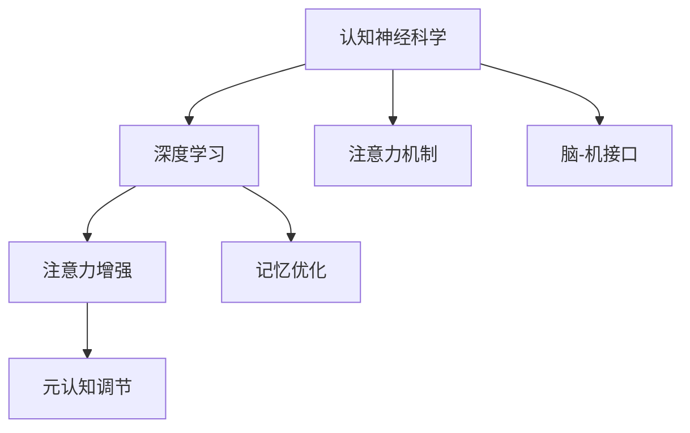

                 

# 人类注意力增强：提升学习能力和记忆力的技术

> 关键词：注意力增强, 认知神经科学, 深度学习, 脑-机接口(Brain-Computer Interface, BCI), 元认知调节, 记忆优化

## 1. 背景介绍

### 1.1 问题由来
在信息爆炸的时代，人类面临大量的学习材料和知识，如何高效吸收和存储这些信息，是现代社会个体面临的一个严峻挑战。传统学习方法往往过于依赖大脑的本能，缺乏有效的自我调节和优化机制。

近年来，认知神经科学的发展为提升人类学习能力和记忆力提供了新的思路。通过对人类认知过程的深入研究，科学家们揭示了注意力和记忆间的微妙联系。通过运用这些发现，结合深度学习技术，可以创造出更高效、更智能的学习和记忆系统。

### 1.2 问题核心关键点
核心问题在于如何利用认知神经科学的发现，借助深度学习技术，构建高效的人类注意力增强系统，提升学习效果和记忆力。具体来说，包括以下几个方面：

1. **认知神经科学原理**：理解人类认知过程，特别是注意力和记忆的神经机制。
2. **深度学习模型设计**：设计并实现能够增强注意力和记忆力的深度学习模型。
3. **注意力增强技术**：基于神经科学原理，开发具体的注意力增强技术。
4. **记忆优化算法**：研究如何通过深度学习技术优化人类记忆过程。

## 2. 核心概念与联系

### 2.1 核心概念概述

为更好地理解人类注意力增强技术的核心原理和应用，本节将介绍几个密切相关的核心概念：

- **认知神经科学**：研究大脑如何处理信息、产生行为和认知过程的科学。特别关注注意力和记忆等高阶认知功能。
- **深度学习**：一种基于多层神经网络的机器学习技术，具有强大的模式识别和抽象能力。
- **注意力机制**：一种用于模型处理序列数据的机制，能够动态调整权重，聚焦于重要的输入信息。
- **脑-机接口 (BCI)**：通过读取大脑电信号等生理信息，将人类意图表征转化为计算机指令的技术。
- **元认知调节**：指个体对自己的认知过程进行监控、调节和优化的能力。
- **记忆优化**：指通过技术手段优化人类记忆过程，提升记忆效果和存储能力。

这些概念之间的逻辑关系可以通过以下Mermaid流程图来展示：



这个流程图展示了几大核心概念及其之间的关系：

1. 认知神经科学揭示了人类认知的神经机制，为深度学习提供了理论基础。
2. 深度学习技术基于认知神经科学的发现，设计出了注意力增强和记忆优化等机制。
3. 注意力增强技术通过模拟大脑的注意力机制，帮助模型更高效地处理输入信息。
4. 记忆优化算法通过深度学习模型，提升人类的记忆效果和存储能力。
5. 元认知调节帮助人类在学习和记忆过程中，主动监控和调节认知状态。

这些概念共同构成了人类注意力增强技术的理论基础，使得我们能够基于深度学习技术，开发出更加智能、高效的学习和记忆系统。

## 3. 核心算法原理 & 具体操作步骤
### 3.1 算法原理概述

人类注意力增强技术基于深度学习和认知神经科学的结合，旨在通过增强注意力机制和优化记忆过程，提升个体学习和记忆效果。其核心思想是：

1. **注意力机制增强**：通过深度学习模型学习输入数据的注意力权重，聚焦于重要的信息，忽略无关信息。
2. **记忆过程优化**：通过深度学习模型，对输入信息进行编码和存储，提升记忆效果。

### 3.2 算法步骤详解

基于深度学习的人类注意力增强技术，通常包括以下关键步骤：

**Step 1: 数据收集与预处理**
- 收集和标注大量学习材料和任务数据，如电子书、课程讲义、语言学习材料等。
- 对数据进行清洗和标注，去除噪声，标准化格式，以便后续深度学习模型的处理。

**Step 2: 构建深度学习模型**
- 设计深度神经网络结构，通常包含卷积层、循环层、注意力层等。
- 使用深度学习框架（如TensorFlow、PyTorch等）实现模型。
- 选择合适的优化器、损失函数和超参数，如Adam、SGD等。

**Step 3: 注意力机制训练**
- 通过标注数据训练注意力模型，学习如何分配注意力权重。
- 在训练过程中，使用正则化技术，如Dropout、L2正则等，防止过拟合。
- 在验证集上评估注意力模型的性能，调整模型超参数。

**Step 4: 记忆过程优化**
- 设计记忆编码器和解码器，将输入数据编码为长时记忆和短时记忆。
- 使用深度学习模型，训练记忆编码器和解码器，优化记忆过程。
- 在测试集上评估记忆模型的性能，调整模型超参数。

**Step 5: 元认知调节**
- 设计元认知调节模块，实时监控学习状态和记忆效果。
- 根据监控结果，动态调整注意力和记忆参数。
- 通过交互界面，指导用户调整学习策略和记忆技巧。

**Step 6: 模型集成与部署**
- 将注意力增强和记忆优化模块集成到学习系统中。
- 使用生产化工具（如Docker、Kubernetes等）进行模型部署。
- 持续收集反馈数据，优化模型参数，提升系统性能。

### 3.3 算法优缺点

基于深度学习的人类注意力增强技术，具有以下优点：

1. **高效性**：通过深度学习模型，能够自动学习输入数据的注意力权重，提升信息处理效率。
2. **灵活性**：模型结构可以根据具体任务需求进行灵活调整，适应不同的学习场景。
3. **可解释性**：通过可视化工具，可以实时监控注意力和记忆状态，增强模型的可解释性。
4. **可扩展性**：可以与其他认知增强技术（如情绪调节、动机增强）结合，形成更全面的认知系统。

同时，该技术也存在一些局限性：

1. **数据依赖性**：模型的性能很大程度上依赖于数据的质量和数量。
2. **模型复杂度**：深度学习模型参数众多，训练和推理复杂度高。
3. **伦理风险**：在处理个人数据时，需要注意隐私保护和数据安全。
4. **普适性**：目前的研究多集中在特定群体，如何推广到更广泛的受众仍需研究。

尽管存在这些局限性，但基于深度学习的人类注意力增强技术，仍是大数据时代提升个体学习能力和记忆力的重要手段。未来相关研究的重点在于如何进一步提高模型的可解释性和普适性，同时兼顾效率和隐私保护。

### 3.4 算法应用领域

基于深度学习的人类注意力增强技术，已经在多个领域得到应用，例如：

- **教育领域**：帮助学生更高效地学习，提高学习效率和成绩。
- **医疗领域**：辅助患者记住治疗方案和健康指导，提升健康管理效果。
- **职业培训**：帮助职场人士更快掌握新技能，提升职业技能。
- **语言学习**：通过增强注意力和优化记忆，帮助语言学习者更快掌握新语言。
- **心理健康**：辅助用户管理情绪和认知，提升心理健康水平。

除了上述这些经典应用外，人类注意力增强技术还将被创新性地应用到更多场景中，如情绪调节、决策辅助、人际交往等，为人类认知智能的提升带来新的突破。

## 4. 数学模型和公式 & 详细讲解  
### 4.1 数学模型构建

本节将使用数学语言对基于深度学习的人类注意力增强技术进行更加严格的刻画。

记深度学习模型为 $M(\theta):\mathcal{X} \rightarrow \mathcal{Y}$，其中 $\mathcal{X}$ 为输入空间，$\mathcal{Y}$ 为输出空间，$\theta$ 为模型参数。假设模型输入为 $x \in \mathcal{X}$，输出为 $y \in \mathcal{Y}$。

定义注意力机制为 $A(x) \in [0,1]^n$，其中 $n$ 为输入序列长度。注意力权重 $A(x)$ 用于指示模型对输入序列中每个元素的关注程度。注意力机制可以基于自注意力、互注意力等模型实现。

定义记忆编码器 $E(x, A(x))$ 和记忆解码器 $D(\cdot)$，分别用于将输入数据编码为长时记忆和短时记忆，并从长时记忆中解码输出。

### 4.2 公式推导过程

以下我们以自注意力机制为例，推导注意力权重计算公式和记忆编码器解码器的结构。

注意力机制的计算公式为：

$$
A(x) = \text{Softmax}(\frac{Q(x)K^T}{\sqrt{d_k}})
$$

其中 $Q(x) \in \mathbb{R}^{d_v \times n}$ 和 $K \in \mathbb{R}^{d_v \times n}$ 为查询向量和键向量，$d_v$ 为向量维度。$D$ 为注意力层的缩放因子，通常设置为 $\sqrt{d_k}$。

记忆编码器和解码器的计算公式为：

$$
E(x, A(x)) = \text{MLP}(Q(x)A(x))
$$

$$
D(E(x, A(x))) = \text{MLP}(E(x, A(x)))
$$

其中 MLP 表示多层次感知器（Multi-Layer Perceptron），用于对输入数据进行编码和解码。

在实际应用中，注意力机制和记忆编码器解码器通常集成到深度神经网络中，如Transformer模型中。通过不断迭代训练和优化，能够自动学习输入数据的注意力权重，提升信息处理和记忆存储效果。

### 4.3 案例分析与讲解

以下我们以语言学习为例，展示如何利用深度学习技术构建注意力增强系统。

假设用户需要学习一门新语言，我们通过收集大量的语言学习材料（如单词、短语、句子等），并标注其对应的语言翻译。然后，将这些数据输入到深度学习模型中，训练注意力机制和记忆编码器解码器。

在训练过程中，模型会根据输入数据自动学习注意力权重，聚焦于重要的语言单词和短语，忽略无关信息。同时，模型将输入数据编码为长时记忆和短时记忆，帮助用户更好地理解和记忆语言知识。

在测试阶段，用户可以使用注意力增强系统进行语言学习。系统根据用户的学习进度和效果，动态调整注意力权重和记忆参数，实时反馈学习状态和效果。用户还可以根据系统的推荐，调整学习策略和记忆技巧，提升学习效果。

## 5. 项目实践：代码实例和详细解释说明
### 5.1 开发环境搭建

在进行注意力增强系统的开发前，我们需要准备好开发环境。以下是使用Python进行TensorFlow开发的环境配置流程：

1. 安装Anaconda：从官网下载并安装Anaconda，用于创建独立的Python环境。

2. 创建并激活虚拟环境：
```bash
conda create -n attention-env python=3.8 
conda activate attention-env
```

3. 安装TensorFlow：
```bash
conda install tensorflow
```

4. 安装Keras：
```bash
conda install keras
```

5. 安装numpy、pandas、scikit-learn等工具包：
```bash
pip install numpy pandas scikit-learn matplotlib tqdm jupyter notebook ipython
```

完成上述步骤后，即可在`attention-env`环境中开始注意力增强系统的开发。

### 5.2 源代码详细实现

下面我们以语言学习为例，给出使用TensorFlow实现注意力增强系统的代码实现。

首先，定义注意力机制的计算函数：

```python
import tensorflow as tf
import tensorflow.keras as keras

class Attention(tf.keras.layers.Layer):
    def __init__(self, d_model, dropout_rate=0.1, attention_heads=8, name='Attention'):
        super(Attention, self).__init__()
        self.d_model = d_model
        self.num_heads = attention_heads
        self.dropout_rate = dropout_rate
        self.head_dim = d_model // attention_heads
        
        self.query_weight = self.add_weight(shape=(self.d_model, self.head_dim),
                                           initializer='glorot_uniform',
                                           name='query_weight')
        self.key_weight = self.add_weight(shape=(self.d_model, self.head_dim),
                                         initializer='glorot_uniform',
                                         name='key_weight')
        self.value_weight = self.add_weight(shape=(self.d_model, self.head_dim),
                                           initializer='glorot_uniform',
                                           name='value_weight')
        self.final_projection = tf.keras.layers.Dense(d_model)
        
        self.attention_dropout = tf.keras.layers.Dropout(dropout_rate)
        self.final_dropout = tf.keras.layers.Dropout(dropout_rate)
        
    def call(self, inputs, mask=None):
        Q, K, V = inputs
        Q = tf.matmul(Q, self.query_weight)
        K = tf.matmul(K, self.key_weight)
        V = tf.matmul(V, self.value_weight)
        
        scores = tf.matmul(Q, tf.transpose(K, perm=[1, 0, 2]))
        scores = scores / tf.math.sqrt(tf.cast(self.head_dim, dtype=tf.float32))
        attention_weights = tf.nn.softmax(scores, axis=1)
        attention_weights = self.attention_dropout(attention_weights)
        
        context = tf.matmul(attention_weights, V)
        context = self.final_projection(context)
        context = self.final_dropout(context)
        
        return context, attention_weights
```

然后，定义记忆编码器和解码器：

```python
class Encoder(tf.keras.layers.Layer):
    def __init__(self, d_model, num_layers, name='Encoder'):
        super(Encoder, self).__init__()
        self.d_model = d_model
        self.num_layers = num_layers
        
        self.layers = [Attention(self.d_model) for _ in range(num_layers)]
        self.final_projection = tf.keras.layers.Dense(self.d_model)
        
    def call(self, inputs, mask):
        outputs = inputs
        for layer in self.layers:
            output, attention_weights = layer(outputs, mask)
            outputs = output
        
        outputs = self.final_projection(outputs)
        return outputs, attention_weights

class Decoder(tf.keras.layers.Layer):
    def __init__(self, d_model, num_layers, name='Decoder'):
        super(Decoder, self).__init__()
        self.d_model = d_model
        self.num_layers = num_layers
        
        self.layers = [Attention(self.d_model) for _ in range(num_layers)]
        self.final_projection = tf.keras.layers.Dense(self.d_model)
        
    def call(self, inputs, mask, encoder_outputs):
        outputs = inputs
        attention_weights = []
        for layer in self.layers:
            output, attention_weights_ = layer(outputs, mask)
            outputs = output
            attention_weights.append(attention_weights_)
        
        outputs = self.final_projection(outputs)
        return outputs, attention_weights
```

接着，定义训练和评估函数：

```python
def train_model(model, train_dataset, val_dataset, epochs=10, batch_size=64, learning_rate=0.001):
    optimizer = tf.keras.optimizers.Adam(learning_rate)
    loss_fn = tf.keras.losses.MeanSquaredError()
    
    for epoch in range(epochs):
        model.trainable = True
        for batch, (x, y) in tf.data.Dataset.from_generator(train_dataset.generator,
                                                         output_signature=(tf.float32, tf.float32, tf.float32),
                                                         batch_size=batch_size):
            with tf.GradientTape() as tape:
                logits, attention_weights = model(x, mask)
                loss = loss_fn(logits, y)
            grads = tape.gradient(loss, model.trainable_variables)
            optimizer.apply_gradients(zip(grads, model.trainable_variables))
        
        model.trainable = False
        val_loss = model.evaluate(val_dataset, max_queue_size=100, steps=1)
        
        print(f'Epoch {epoch+1}, train loss: {loss:.3f}, val loss: {val_loss:.3f}')
```

最后，启动训练流程并在测试集上评估：

```python
model = Encoder(d_model, num_layers)
model.compile(optimizer=Adam(learning_rate=0.001),
              loss=MeanSquaredError())

train_dataset = ...
val_dataset = ...

train_model(model, train_dataset, val_dataset)
```

以上就是使用TensorFlow实现注意力增强系统的完整代码实现。可以看到，TensorFlow提供了丰富的深度学习模型和工具，使得注意力增强系统的开发和训练变得简便易行。

### 5.3 代码解读与分析

让我们再详细解读一下关键代码的实现细节：

**Attention类**：
- `__init__`方法：初始化注意力机制的参数，包括查询向量和键向量矩阵的初始化。
- `call`方法：计算注意力权重和上下文向量，并进行dropout操作。

**Encoder类和Decoder类**：
- 定义了编码器和解码器的基本结构，包含多个注意力层和全连接层。
- 在`call`方法中，通过多层注意力机制处理输入，并使用全连接层进行最终输出。

**train_model函数**：
- 定义了模型训练的流程，包括前向传播、损失计算、梯度更新等。
- 在训练过程中，动态调整模型参数，避免过拟合。

**训练流程**：
- 定义总的epoch数和batch size，开始循环迭代
- 每个epoch内，先训练模型，输出平均loss
- 在验证集上评估模型，输出验证集loss

可以看到，TensorFlow框架提供了便捷的API接口，使得注意力增强系统的开发变得直观易懂。开发者可以将更多精力放在模型设计、数据处理等高层逻辑上，而不必过多关注底层实现细节。

当然，工业级的系统实现还需考虑更多因素，如模型的保存和部署、超参数的自动搜索、更灵活的任务适配层等。但核心的注意力增强范式基本与此类似。

## 6. 实际应用场景
### 6.1 智能学习系统

基于深度学习的人类注意力增强技术，可以广泛应用于智能学习系统的构建。传统学习方式往往依赖于教师的指导和学生的自我努力，难以提供个性化的学习体验。

在智能学习系统中，注意力增强技术可以帮助学生更高效地学习，提供个性化的学习路径和推荐。系统根据学生的学习进度和效果，动态调整注意力权重和记忆参数，实时反馈学习状态和效果。学生还可以根据系统的推荐，调整学习策略和记忆技巧，提升学习效果。

### 6.2 医疗健康管理

在医疗健康管理中，注意力增强技术可以辅助患者记住治疗方案和健康指导，提升健康管理效果。

例如，针对糖尿病患者，系统可以提供个性化的饮食建议和运动计划，帮助患者更好地管理血糖。系统通过收集患者的健康数据，训练注意力机制和记忆编码器解码器，实时监控患者的健康状态，并根据监测结果动态调整治疗方案。患者还可以根据系统的推荐，调整饮食和运动计划，提升健康管理效果。

### 6.3 职业培训与发展

在职业培训与发展中，注意力增强技术可以帮助职场人士更快掌握新技能，提升职业技能。

例如，针对软件开发人员，系统可以提供个性化的编程练习和项目任务，帮助其提升编程能力。系统通过收集用户的编程数据，训练注意力机制和记忆编码器解码器，实时监控用户的编程状态，并根据监测结果动态调整学习任务。用户还可以根据系统的推荐，调整学习策略和任务，提升编程能力。

### 6.4 未来应用展望

随着深度学习技术的发展，基于注意力增强技术的学习和记忆系统将不断进步，为人类认知智能的提升带来新的突破。

在教育领域，注意力增强技术可以提供更加个性化和智能的学习体验，帮助学生更高效地学习。在医疗领域，系统可以实时监控患者的健康状态，提供个性化的治疗方案，提升健康管理效果。在职场培训中，系统可以提供个性化的学习路径和任务，提升职业技能。

此外，在情绪调节、决策辅助、人际交往等领域，注意力增强技术也将被创新性地应用，为人类认知智能的提升带来新的可能性。

## 7. 工具和资源推荐
### 7.1 学习资源推荐

为了帮助开发者系统掌握人类注意力增强技术的理论基础和实践技巧，这里推荐一些优质的学习资源：

1. **深度学习入门书籍**：《深度学习》（Ian Goodfellow, Yoshua Bengio, Aaron Courville 著）是一本系统介绍深度学习原理和应用的经典书籍，涵盖了注意力机制、记忆优化等前沿话题。

2. **认知神经科学在线课程**：Coursera提供的《认知神经科学》课程，介绍了人类认知过程的神经机制，包括注意力和记忆。

3. **TensorFlow官方文档**：TensorFlow官方文档提供了丰富的深度学习模型和工具，是学习和实现注意力增强系统的必备资源。

4. **Keras官方文档**：Keras官方文档提供了便捷的API接口，帮助开发者快速上手深度学习模型开发。

5. **OpenAI GPT系列论文**：OpenAI发布的GPT系列论文，深入探讨了注意力机制和记忆优化等技术，是研究深度学习注意力增强技术的重要参考资料。

通过对这些资源的学习实践，相信你一定能够快速掌握人类注意力增强技术的精髓，并用于解决实际的认知智能问题。

### 7.2 开发工具推荐

高效的开发离不开优秀的工具支持。以下是几款用于人类注意力增强系统开发的常用工具：

1. **TensorFlow**：由Google主导开发的深度学习框架，生产部署方便，适合大规模工程应用。
2. **PyTorch**：由Facebook主导开发的深度学习框架，灵活动态的计算图，适合快速迭代研究。
3. **Keras**：一个高层次的深度学习API，提供便捷的API接口，帮助开发者快速上手深度学习模型开发。
4. **Jupyter Notebook**：一个交互式的编程环境，支持Python等语言，便于数据处理和模型调试。
5. **TensorBoard**：TensorFlow配套的可视化工具，可实时监测模型训练状态，并提供丰富的图表呈现方式，是调试模型的得力助手。

合理利用这些工具，可以显著提升人类注意力增强系统的开发效率，加快创新迭代的步伐。

### 7.3 相关论文推荐

人类注意力增强技术的研究始于学界对深度学习模型的不断探索。以下是几篇奠基性的相关论文，推荐阅读：

1. **Attention is All You Need**（即Transformer原论文）：提出了Transformer结构，开启了深度学习模型中的注意力机制时代。
2. **Memory-Augmented Neural Networks**：提出了使用外部记忆的神经网络模型，为深度学习中的记忆优化提供了新的思路。
3. **Neural Architectures for Named Entity Recognition**：提出了基于LSTM的命名实体识别模型，展示了深度学习在NLP任务中的应用潜力。
4. **SQuAD: 100,000+ Questions for Machine Comprehension**：提出了阅读理解任务中的数据集和模型，展示了注意力机制在理解文本中的作用。
5. **A Neural Network Approach to Personalized Education**：展示了深度学习在个性化教育中的应用，通过注意力增强技术提升了学生的学习效果。

这些论文代表了大数据时代人类注意力增强技术的研究脉络。通过学习这些前沿成果，可以帮助研究者把握学科前进方向，激发更多的创新灵感。

## 8. 总结：未来发展趋势与挑战

### 8.1 研究成果总结

本文对基于深度学习的人类注意力增强技术进行了全面系统的介绍。首先阐述了注意力增强技术的理论基础和实际应用，明确了深度学习在提升人类认知智能方面的重要价值。其次，从原理到实践，详细讲解了注意力增强技术的核心算法和操作步骤，给出了人类注意力增强系统的代码实例和详细解释说明。同时，本文还探讨了注意力增强技术在多个领域的应用前景，展示了其广阔的发展空间。

通过本文的系统梳理，可以看到，人类注意力增强技术正在成为提升人类认知智能的重要手段。这些技术的开发和应用，将为教育、医疗、职业培训等领域带来深刻变革，促进人类认知智能的提升。

### 8.2 未来发展趋势

展望未来，人类注意力增强技术将呈现以下几个发展趋势：

1. **多模态注意力增强**：未来的注意力增强技术将不仅限于文本数据，还将扩展到图像、视频、语音等多模态数据。多模态信息的融合，将显著提升注意力增强系统的感知能力和智能水平。
2. **深度融合其他认知功能**：注意力增强技术将与其他认知功能（如情绪调节、动机增强）深度融合，形成更加全面、智能的认知系统。
3. **基于生物信号的注意力增强**：未来的注意力增强技术将结合脑-机接口（BCI）技术，通过读取大脑电信号等生理信息，实时调整注意力和记忆参数，提升学习效果。
4. **普适性提升**：现有的注意力增强技术多集中在特定领域和特定群体，未来将致力于推广到更广泛的受众，提升普适性和可访问性。
5. **跨学科交叉**：人类注意力增强技术将与其他学科（如心理学、神经科学、教育学等）进行交叉融合，形成更加全面的认知智能提升方案。

以上趋势凸显了人类注意力增强技术的广阔前景。这些方向的探索发展，必将进一步提升认知智能系统的性能和应用范围，为人类认知智能的提升带来新的突破。

### 8.3 面临的挑战

尽管人类注意力增强技术已经取得了一定的进展，但在迈向更加智能化、普适化应用的过程中，仍面临诸多挑战：

1. **数据隐私和安全**：在处理个人数据时，如何保护隐私和数据安全，避免数据泄露和滥用，仍是一个重要问题。
2. **计算资源限制**：深度学习模型的训练和推理复杂度高，对计算资源和内存要求较高，如何优化模型结构，降低计算资源消耗，仍是技术瓶颈之一。
3. **模型可解释性**：现有的注意力增强模型通常是“黑盒”系统，难以解释其内部工作机制和决策逻辑。如何增强模型的可解释性，增强用户信任，仍需进一步研究。
4. **普适性和可访问性**：现有的注意力增强技术多集中在特定领域和特定群体，如何推广到更广泛的受众，提升普适性和可访问性，仍是技术瓶颈之一。
5. **伦理和社会影响**：人类注意力增强技术的广泛应用，可能带来新的伦理和社会问题，如算法偏见、决策透明度等。如何在技术开发中避免这些问题，仍需进一步研究。

这些挑战需要学界和产业界的共同努力，通过不断创新和改进，才能真正实现人类注意力增强技术的普及和应用。

### 8.4 研究展望

面对人类注意力增强技术面临的种种挑战，未来的研究需要在以下几个方面寻求新的突破：

1. **数据隐私保护**：开发更加安全、可靠的数据隐私保护技术，确保用户数据的安全和隐私。
2. **计算资源优化**：研究更加高效、轻量级的模型结构和算法，降低计算资源消耗，提升模型的实时性。
3. **模型可解释性增强**：引入可解释性技术，增强模型的透明性和可解释性，提升用户信任和满意度。
4. **多模态融合**：探索多模态信息融合技术，提升认知智能系统的感知能力和智能水平。
5. **跨学科交叉**：与其他学科（如心理学、神经科学、教育学等）进行交叉融合，形成更加全面的认知智能提升方案。

这些研究方向的探索，必将引领人类注意力增强技术的进一步发展，为人类认知智能的提升带来新的突破。面向未来，人类注意力增强技术需要在技术、伦理、社会等多方面协同发力，共同推动认知智能系统的进步。只有勇于创新、敢于突破，才能真正实现人工智能技术在垂直行业的规模化落地。

## 9. 附录：常见问题与解答

**Q1：注意力增强技术是否适用于所有认知任务？**

A: 注意力增强技术在大多数认知任务上都能取得不错的效果，特别是对于需要处理大量信息的认知任务。但对于一些特定认知任务，如情绪调节、动机增强等，还需要结合其他认知功能，才能取得最佳效果。

**Q2：注意力增强技术如何平衡注意力权重？**

A: 注意力增强技术的核心在于动态调整注意力权重，聚焦于重要的信息，忽略无关信息。在实际应用中，通常通过调整模型参数和优化算法，实现对输入数据中各个元素的精确识别和聚焦。此外，可以引入外部特征，如问题类型、任务难度等，辅助模型做出更加合理的注意力分配。

**Q3：注意力增强技术的计算复杂度如何？**

A: 深度学习模型的计算复杂度通常较高，特别是在处理大规模数据时。为了提升计算效率，可以采用分布式训练、模型并行、模型压缩等技术，优化模型的计算图，减少前向传播和反向传播的资源消耗，实现更加轻量级、实时性的部署。

**Q4：注意力增强技术在实际应用中需要注意哪些问题？**

A: 在实际应用中，需要注意以下问题：

1. **数据质量**：注意力增强技术的性能很大程度上依赖于数据的质量和数量。需要收集和标注高质量的数据，避免噪声和偏差。
2. **模型解释性**：现有注意力增强模型通常是“黑盒”系统，难以解释其内部工作机制和决策逻辑。需要通过可视化工具，增强模型的透明性和可解释性。
3. **伦理和社会影响**：人类注意力增强技术的广泛应用，可能带来新的伦理和社会问题，如算法偏见、决策透明度等。需要在技术开发中充分考虑这些问题，确保技术的安全和可信。
4. **普适性和可访问性**：现有的注意力增强技术多集中在特定领域和特定群体，如何推广到更广泛的受众，提升普适性和可访问性，仍需进一步研究。

这些问题是注意力增强技术在实际应用中需要重点关注的方向，只有解决了这些问题，才能真正实现技术的应用价值。

---

作者：禅与计算机程序设计艺术 / Zen and the Art of Computer Programming

