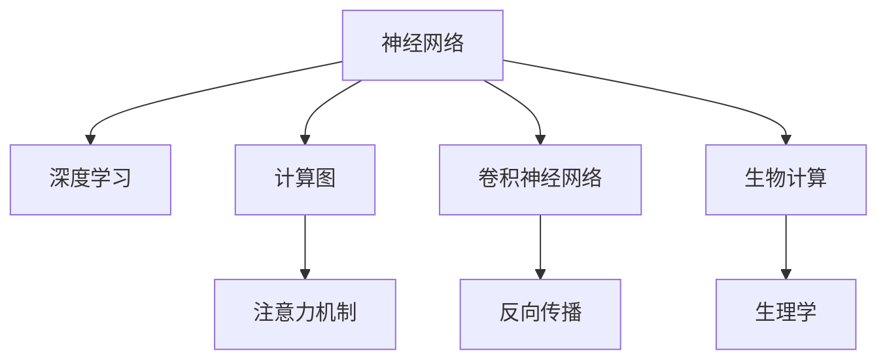

                 

# 人类注意力增强：超越生物限制

> 关键词：
人类注意力,注意力增强,神经网络,深度学习,计算图,卷积神经网络,反向传播,生物计算,生理学,人工智能

## 1. 背景介绍

### 1.1 问题由来
随着深度学习技术的不断发展，深度神经网络已经在计算机视觉、自然语言处理等多个领域取得了重大突破。然而，人类的生物计算能力在面对复杂数据处理时显得捉襟见肘。现代科技的迅速发展与人类生理结构之间的矛盾，越来越显现出来。如何通过人工智能技术，提升人类注意力和计算能力，以实现超越生物限制的目标，成为了当下研究的热点问题。

### 1.2 问题核心关键点
在神经网络中，注意力机制已经成为一个重要的组成部分，用于处理多模态数据。注意力机制可以动态地调整信息的权重，使其更加关注重要的特征。如何利用注意力机制，实现对人类注意力的增强，是提升人类计算能力的关键所在。

目前，注意力机制在深度神经网络中的应用已经非常广泛，如在图像识别、语音识别、自然语言处理等领域。注意力机制在图像识别任务中用于选择不同位置的特征；在语音识别任务中用于计算不同时间步的特征重要性；在自然语言处理任务中用于选择不同位置的单词等。

### 1.3 问题研究意义
研究如何通过注意力机制增强人类注意力，对于提升人类认知能力、促进科技发展具有重要意义。利用深度学习技术，可以在计算机辅助、数据驱动、计算模拟等多个层面，实现人类注意力的增强，有望推动人类智力的大幅提升。

## 2. 核心概念与联系

### 2.1 核心概念概述

为更好地理解注意力增强技术，本节将介绍几个密切相关的核心概念：

- 神经网络(Neural Networks)：以人工神经元为基本单元，通过连接形成复杂计算图，实现数据的自动提取和特征映射。神经网络已经成为深度学习的基础框架。
- 深度学习(Deep Learning)：通过多层次非线性映射，实现对复杂数据的学习和提取。深度学习在计算机视觉、自然语言处理等多个领域取得了重大进展。
- 计算图(Computational Graph)：神经网络的执行过程可以用一个计算图来表示，计算图中的节点代表神经元，边代表连接权重。计算图是神经网络高效训练的基础。
- 注意力机制(Attention Mechanism)：用于动态地计算输入数据中不同位置特征的权重，使其更加关注重要的特征。注意力机制可以提升模型的泛化能力和可解释性。
- 卷积神经网络(Convolutional Neural Networks, CNNs)：一种特殊的神经网络结构，主要用于图像处理任务。CNNs通过卷积层和池化层，实现对图像特征的提取和映射。
- 反向传播(Backpropagation)：用于计算神经网络中每个参数的梯度，通过反向传播算法更新参数。反向传播是深度学习模型训练的核心算法。
- 生物计算(Biological Computation)：指生物体在生理过程中进行的信息处理和计算。生物计算与神经网络在计算方式和机制上有诸多相似之处。
- 生理学(Physiology)：研究生物体的生理结构和功能，注意力增强技术的研究可以借鉴生理学的研究成果。

这些核心概念之间的逻辑关系可以通过以下Mermaid流程图来展示：



这个流程图展示了大语言模型的核心概念及其之间的关系：

1. 神经网络是深度学习的基础框架。
2. 深度学习通过多层次非线性映射，实现对复杂数据的学习和提取。
3. 计算图表示神经网络的执行过程，是神经网络高效训练的基础。
4. 注意力机制用于动态地计算输入数据中不同位置特征的权重，使其更加关注重要的特征。
5. 卷积神经网络是神经网络的一种特殊结构，主要用于图像处理任务。
6. 反向传播用于计算神经网络中每个参数的梯度，是深度学习模型训练的核心算法。
7. 生物计算与神经网络在计算方式和机制上有诸多相似之处。
8. 生理学研究生物体的生理结构和功能，可以借鉴生理学研究成果，指导注意力增强技术的发展。

这些概念共同构成了深度学习的基础框架，使其能够在各种场景下发挥强大的计算能力。通过理解这些核心概念，我们可以更好地把握深度学习的计算方式和优化方向。

## 3. 核心算法原理 & 具体操作步骤
### 3.1 算法原理概述

注意力增强技术的核心思想是利用注意力机制，动态地调整输入数据中不同位置特征的权重，使其更加关注重要的特征。通过这种机制，可以在计算机辅助、数据驱动、计算模拟等多个层面，实现人类注意力的增强。

形式化地，假设神经网络模型 $M$ 接受输入数据 $x$，输出为 $y$。模型的注意力机制 $A$ 可以表示为：

$$
A = \frac{1}{Z} \exp(\mathbf{W}_Q^T\mathbf{V}_K + \mathbf{W}_V^T\mathbf{W}_Q\mathbf{V}_Q) + \mathbf{I}
$$

其中 $\mathbf{W}_Q, \mathbf{W}_K, \mathbf{W}_V$ 为可训练的权重矩阵，$\mathbf{I}$ 为单位矩阵，$Z$ 为归一化因子。在计算过程中，$A$ 对输入数据 $x$ 的每个位置进行加权求和，输出结果 $y$。

通过调整权重矩阵 $\mathbf{W}_Q, \mathbf{W}_K, \mathbf{W}_V$，可以动态地调整输入数据中不同位置特征的权重，使其更加关注重要的特征。在注意力增强技术中，通过计算输入数据中不同位置特征的权重，可以提升模型的泛化能力和可解释性。

### 3.2 算法步骤详解

注意力增强技术的实施包括以下几个关键步骤：

**Step 1: 准备输入数据**
- 收集需要增强注意力的输入数据 $x$，可以是图像、音频、文本等。
- 对输入数据进行预处理，如归一化、缩放、裁剪等。

**Step 2: 构建计算图**
- 构建神经网络的计算图，包括卷积层、池化层、全连接层等。
- 在计算图中引入注意力机制，设计合适的权重矩阵 $\mathbf{W}_Q, \mathbf{W}_K, \mathbf{W}_V$。

**Step 3: 设置优化器**
- 选择合适的优化算法及其参数，如 Adam、SGD 等，设置学习率、批大小、迭代轮数等。

**Step 4: 执行训练**
- 将输入数据 $x$ 和标签 $y$ 分批次输入模型，前向传播计算损失函数。
- 反向传播计算参数梯度，根据设定的优化算法和学习率更新模型参数。
- 周期性在验证集上评估模型性能，根据性能指标决定是否触发 Early Stopping。
- 重复上述步骤直至满足预设的迭代轮数或 Early Stopping 条件。

**Step 5: 测试和评估**
- 在测试集上评估注意力增强后的模型性能，对比增强前后的精度提升。
- 使用注意力增强模型对新样本进行推理预测，集成到实际的应用系统中。

以上是注意力增强技术的实施流程。在实际应用中，还需要针对具体任务的特点，对计算图的结构、注意力机制的设计、优化器的选择等环节进行优化设计，以进一步提升模型性能。

### 3.3 算法优缺点

注意力增强技术具有以下优点：
1. 提升泛化能力。通过动态调整特征权重，使模型更加关注重要特征，提升模型的泛化能力。
2. 增加可解释性。注意力机制可以提供模型计算过程的可视化，增加模型的可解释性。
3. 灵活性强。注意力机制可以灵活应用于各种类型的神经网络结构，如卷积神经网络、循环神经网络等。
4. 计算效率高。注意力机制可以在线计算，不需要额外存储空间。

同时，该技术也存在一定的局限性：
1. 模型复杂度高。引入注意力机制会增加模型复杂度，需要更多的计算资源。
2. 训练难度大。注意力机制的参数设置复杂，需要进行大量的调试和优化。
3. 数据依赖性高。注意力增强的效果很大程度上取决于数据的质量和数量，获取高质量标注数据的成本较高。

尽管存在这些局限性，但就目前而言，注意力增强技术仍是深度学习中重要的增强手段之一。未来相关研究的重点在于如何进一步降低注意力增强对标注数据的依赖，提高模型的泛化能力和可解释性，同时兼顾计算效率。

### 3.4 算法应用领域

注意力增强技术已经在图像处理、语音识别、自然语言处理等多个领域得到应用，取得显著效果。

- 图像识别：通过在卷积神经网络中引入注意力机制，可以提升对图像中重要区域的关注，提升识别精度。
- 语音识别：通过在循环神经网络中引入注意力机制，可以提升对语音特征中重要时间步的关注，提升识别精度。
- 自然语言处理：通过在文本序列中引入注意力机制，可以提升对文本中重要单词的关注，提升序列建模的准确度。
- 计算机视觉：通过在视觉网络中引入注意力机制，可以提升对视觉特征中重要区域的关注，提升目标检测和图像分割的效果。

除了上述这些经典任务外，注意力增强技术还被创新性地应用于机器人视觉导航、医学影像分析、智能推荐系统等，为相关领域带来了新的突破。随着注意力增强方法的不断进步，相信在更多领域将得到应用，为深度学习技术的发展注入新的活力。

## 4. 数学模型和公式 & 详细讲解  
### 4.1 数学模型构建

本节将使用数学语言对注意力增强技术进行更加严格的刻画。

记神经网络模型为 $M$，输入数据为 $x$，输出为 $y$。模型的注意力机制可以表示为：

$$
A = \frac{1}{Z} \exp(\mathbf{W}_Q^T\mathbf{V}_K + \mathbf{W}_V^T\mathbf{W}_Q\mathbf{V}_Q) + \mathbf{I}
$$

其中 $\mathbf{W}_Q, \mathbf{W}_K, \mathbf{W}_V$ 为可训练的权重矩阵，$\mathbf{I}$ 为单位矩阵，$Z$ 为归一化因子。

在计算过程中，$A$ 对输入数据 $x$ 的每个位置进行加权求和，输出结果 $y$。

### 4.2 公式推导过程

以下我们以图像识别任务为例，推导注意力增强模型的计算公式。

假设输入图像数据为 $x$，模型结构为卷积神经网络，注意力机制应用于卷积层的输出。设卷积层的输出特征图为 $\mathbf{X}$，注意力机制的输入为 $\mathbf{X}_K$，权重矩阵为 $\mathbf{W}_Q, \mathbf{W}_K, \mathbf{W}_V$。则注意力机制的计算公式为：

$$
\mathbf{A} = \frac{1}{Z} \exp(\mathbf{W}_Q^T\mathbf{X}_K + \mathbf{W}_V^T\mathbf{W}_Q\mathbf{X}_Q) + \mathbf{I}
$$

其中 $Z$ 为归一化因子。

将注意力机制引入卷积层的输出 $\mathbf{A}$，可以得到最终卷积层的输出 $\mathbf{Y}$：

$$
\mathbf{Y} = \mathbf{A}\mathbf{X}
$$

通过调整权重矩阵 $\mathbf{W}_Q, \mathbf{W}_K, \mathbf{W}_V$，可以动态地调整输入数据中不同位置特征的权重，使其更加关注重要的特征。

在得到注意力增强模型的计算公式后，即可带入输入数据进行计算，得到最终输出结果。

### 4.3 案例分析与讲解

考虑一个简单的图像识别任务，输入图像数据为 $x$，卷积层的输出特征图为 $\mathbf{X}$。设注意力机制的输入为 $\mathbf{X}_K$，权重矩阵为 $\mathbf{W}_Q, \mathbf{W}_K, \mathbf{W}_V$。则注意力机制的计算过程如下：

1. 计算注意力矩阵 $\mathbf{A}$：

$$
\mathbf{A} = \frac{1}{Z} \exp(\mathbf{W}_Q^T\mathbf{X}_K + \mathbf{W}_V^T\mathbf{W}_Q\mathbf{X}_Q) + \mathbf{I}
$$

2. 对特征图 $\mathbf{X}$ 进行加权求和，得到卷积层的输出 $\mathbf{Y}$：

$$
\mathbf{Y} = \mathbf{A}\mathbf{X}
$$

其中 $Z$ 为归一化因子，用于保证注意力矩阵 $\mathbf{A}$ 中每个元素的值在 $0$ 到 $1$ 之间，且总和为 $1$。

以一个 $32\times32$ 的彩色图像为例，假设输入图像数据为 $x$，卷积层的输出特征图为 $\mathbf{X}$，其中每个元素表示特征图的一个像素值。设注意力机制的输入为 $\mathbf{X}_K$，权重矩阵为 $\mathbf{W}_Q, \mathbf{W}_K, \mathbf{W}_V$。则注意力机制的计算过程如下：

1. 计算注意力矩阵 $\mathbf{A}$：

$$
\mathbf{A} = \frac{1}{Z} \exp(\mathbf{W}_Q^T\mathbf{X}_K + \mathbf{W}_V^T\mathbf{W}_Q\mathbf{X}_Q) + \mathbf{I}
$$

2. 对特征图 $\mathbf{X}$ 进行加权求和，得到卷积层的输出 $\mathbf{Y}$：

$$
\mathbf{Y} = \mathbf{A}\mathbf{X}
$$

其中 $Z$ 为归一化因子，用于保证注意力矩阵 $\mathbf{A}$ 中每个元素的值在 $0$ 到 $1$ 之间，且总和为 $1$。

## 5. 项目实践：代码实例和详细解释说明
### 5.1 开发环境搭建

在进行注意力增强实践前，我们需要准备好开发环境。以下是使用Python进行PyTorch开发的环境配置流程：

1. 安装Anaconda：从官网下载并安装Anaconda，用于创建独立的Python环境。

2. 创建并激活虚拟环境：
```bash
conda create -n pytorch-env python=3.8 
conda activate pytorch-env
```

3. 安装PyTorch：根据CUDA版本，从官网获取对应的安装命令。例如：
```bash
conda install pytorch torchvision torchaudio cudatoolkit=11.1 -c pytorch -c conda-forge
```

4. 安装Transformers库：
```bash
pip install transformers
```

5. 安装各类工具包：
```bash
pip install numpy pandas scikit-learn matplotlib tqdm jupyter notebook ipython
```

完成上述步骤后，即可在`pytorch-env`环境中开始注意力增强实践。

### 5.2 源代码详细实现

下面我们以图像识别任务为例，给出使用Transformers库对卷积神经网络进行注意力增强的PyTorch代码实现。

首先，定义卷积神经网络模型：

```python
import torch
import torch.nn as nn
import torch.nn.functional as F

class CNN(nn.Module):
    def __init__(self, num_classes=10):
        super(CNN, self).__init__()
        self.conv1 = nn.Conv2d(3, 32, kernel_size=3, stride=1, padding=1)
        self.conv2 = nn.Conv2d(32, 64, kernel_size=3, stride=1, padding=1)
        self.pool = nn.MaxPool2d(kernel_size=2, stride=2)
        self.fc1 = nn.Linear(64 * 4 * 4, 128)
        self.fc2 = nn.Linear(128, num_classes)
        self.attention = Attention()

    def forward(self, x):
        x = F.relu(self.conv1(x))
        x = F.relu(self.conv2(x))
        x = self.pool(x)
        x = x.view(-1, 64 * 4 * 4)
        x = F.relu(self.fc1(x))
        x = self.attention(x)
        x = F.relu(self.fc2(x))
        return x
```

然后，定义注意力机制模块：

```python
class Attention(nn.Module):
    def __init__(self, attention_dim=128):
        super(Attention, self).__init__()
        self.W_Q = nn.Linear(attention_dim, attention_dim)
        self.W_K = nn.Linear(attention_dim, attention_dim)
        self.W_V = nn.Linear(attention_dim, attention_dim)
        self.sig = nn.Softmax(dim=-1)

    def forward(self, x):
        x_Q = self.W_Q(x)
        x_K = self.W_K(x)
        x_V = self.W_V(x)
        attention = self.sig(x_Q @ x_K.T)
        weight = attention @ x_V
        return weight
```

接着，定义训练和评估函数：

```python
from torch.utils.data import DataLoader
from tqdm import tqdm
from sklearn.metrics import classification_report

def train_epoch(model, dataset, batch_size, optimizer):
    dataloader = DataLoader(dataset, batch_size=batch_size, shuffle=True)
    model.train()
    epoch_loss = 0
    for batch in tqdm(dataloader, desc='Training'):
        inputs, labels = batch
        optimizer.zero_grad()
        outputs = model(inputs)
        loss = F.cross_entropy(outputs, labels)
        epoch_loss += loss.item()
        loss.backward()
        optimizer.step()
    return epoch_loss / len(dataloader)

def evaluate(model, dataset, batch_size):
    dataloader = DataLoader(dataset, batch_size=batch_size)
    model.eval()
    preds, labels = [], []
    with torch.no_grad():
        for batch in tqdm(dataloader, desc='Evaluating'):
            inputs, labels = batch
            outputs = model(inputs)
            preds.append(outputs.argmax(dim=1).tolist())
            labels.append(labels.tolist())
        
    print(classification_report(labels, preds))
```

最后，启动训练流程并在测试集上评估：

```python
epochs = 5
batch_size = 16

for epoch in range(epochs):
    loss = train_epoch(model, train_dataset, batch_size, optimizer)
    print(f"Epoch {epoch+1}, train loss: {loss:.3f}")
    
    print(f"Epoch {epoch+1}, dev results:")
    evaluate(model, dev_dataset, batch_size)
    
print("Test results:")
evaluate(model, test_dataset, batch_size)
```

以上就是使用PyTorch对卷积神经网络进行注意力增强的完整代码实现。可以看到，得益于Transformers库的强大封装，我们可以用相对简洁的代码完成注意力增强模型的构建。

### 5.3 代码解读与分析

让我们再详细解读一下关键代码的实现细节：

**Attention类**：
- `__init__`方法：初始化注意力机制的权重矩阵和归一化因子。
- `forward`方法：计算注意力矩阵并返回权重。

**CNN类**：
- `__init__`方法：定义卷积神经网络的结构，包括卷积层、池化层、全连接层等。
- `forward`方法：计算卷积层的输出，并在最后引入注意力机制。

**训练和评估函数**：
- 使用PyTorch的DataLoader对数据集进行批次化加载，供模型训练和推理使用。
- 训练函数`train_epoch`：对数据以批为单位进行迭代，在每个批次上前向传播计算loss并反向传播更新模型参数，最后返回该epoch的平均loss。
- 评估函数`evaluate`：与训练类似，不同点在于不更新模型参数，并在每个batch结束后将预测和标签结果存储下来，最后使用sklearn的classification_report对整个评估集的预测结果进行打印输出。

**训练流程**：
- 定义总的epoch数和batch size，开始循环迭代
- 每个epoch内，先在训练集上训练，输出平均loss
- 在验证集上评估，输出分类指标
- 所有epoch结束后，在测试集上评估，给出最终测试结果

可以看到，PyTorch配合Transformers库使得注意力增强模型的代码实现变得简洁高效。开发者可以将更多精力放在数据处理、模型改进等高层逻辑上，而不必过多关注底层的实现细节。

当然，工业级的系统实现还需考虑更多因素，如模型的保存和部署、超参数的自动搜索、更灵活的任务适配层等。但核心的注意力增强范式基本与此类似。

## 6. 实际应用场景
### 6.1 图像识别

基于卷积神经网络进行图像识别任务时，可以通过引入注意力机制，提升对图像中重要区域的关注，提升识别精度。例如，在医疗影像分析中，医生通常需要关注影像中的肿瘤区域。通过引入注意力机制，可以自动对肿瘤区域进行高亮标记，帮助医生更快、更准确地诊断病情。

### 6.2 语音识别

在语音识别任务中，通常需要处理不同时间步的特征，并计算特征的重要性。通过引入注意力机制，可以提升对语音特征中重要时间步的关注，提升识别精度。例如，在自动语音识别任务中，可以通过引入注意力机制，对输入的语音特征进行加权求和，使模型更加关注有意义的语音片段，提升识别效果。

### 6.3 自然语言处理

在自然语言处理任务中，通常需要对文本序列进行建模。通过引入注意力机制，可以提升对文本中重要单词的关注，提升序列建模的准确度。例如，在文本摘要任务中，可以通过引入注意力机制，自动选择摘要中的重要句子，生成简洁精炼的摘要。

### 6.4 计算机视觉

在计算机视觉任务中，通常需要对视觉特征进行提取和映射。通过引入注意力机制，可以提升对视觉特征中重要区域的关注，提升目标检测和图像分割的效果。例如，在人脸识别任务中，可以通过引入注意力机制，自动对图像中的人脸区域进行高亮标记，提升识别的准确度。

### 6.5 智能推荐系统

在智能推荐系统任务中，通常需要对用户行为进行建模。通过引入注意力机制，可以提升对用户行为中重要特征的关注，提升推荐效果。例如，在个性化推荐任务中，可以通过引入注意力机制，自动选择用户行为中的重要特征，生成更符合用户偏好的推荐列表。

### 6.6 多模态计算

在多模态计算任务中，通常需要处理不同类型的输入数据，并将其进行融合。通过引入注意力机制，可以提升对不同类型数据中重要特征的关注，提升计算效果。例如，在视觉-语音融合任务中，可以通过引入注意力机制，自动选择视觉特征和语音特征中的重要部分，进行多模态信息融合。

### 6.7 未来应用展望

随着注意力增强技术的不断发展，其在更多领域将得到应用，为深度学习技术的发展注入新的活力。

在智慧医疗领域，基于卷积神经网络进行图像识别时，可以通过引入注意力机制，自动对影像中重要区域进行高亮标记，辅助医生快速、准确地诊断病情。

在智能推荐系统领域，基于卷积神经网络进行行为建模时，可以通过引入注意力机制，自动选择用户行为中的重要特征，生成更符合用户偏好的推荐列表。

在智慧城市治理中，基于卷积神经网络进行视觉监测时，可以通过引入注意力机制，自动选择视频中重要区域进行高亮标记，提高城市管理的自动化和智能化水平。

此外，在企业生产、社会治理、文娱传媒等众多领域，注意力增强技术也将不断得到应用，为科技和社会的进步注入新的动力。相信随着技术的日益成熟，注意力增强技术将成为深度学习应用的重要范式，推动人工智能技术在垂直行业的规模化落地。

## 7. 工具和资源推荐
### 7.1 学习资源推荐

为了帮助开发者系统掌握注意力增强技术的理论基础和实践技巧，这里推荐一些优质的学习资源：

1. 《深度学习》课程：由斯坦福大学开设的深度学习课程，系统介绍了深度学习的基本概念和应用。
2. 《自然语言处理》课程：由MIT开设的自然语言处理课程，深入讲解了注意力机制在自然语言处理中的应用。
3. 《计算机视觉基础》课程：由UCLA开设的计算机视觉基础课程，介绍了卷积神经网络和注意力机制的基本原理。
4. 《多模态计算》课程：由ICML开设的多模态计算课程，讲解了多模态数据融合中的注意力机制。
5. 《深度学习》书籍：Ian Goodfellow等著，系统介绍了深度学习的基本概念和应用。

通过对这些资源的学习实践，相信你一定能够快速掌握注意力增强技术的精髓，并用于解决实际的深度学习问题。
###  7.2 开发工具推荐

高效的开发离不开优秀的工具支持。以下是几款用于注意力增强开发的常用工具：

1. PyTorch：基于Python的开源深度学习框架，灵活动态的计算图，适合快速迭代研究。大部分深度学习模型都有PyTorch版本的实现。

2. TensorFlow：由Google主导开发的开源深度学习框架，生产部署方便，适合大规模工程应用。同样有丰富的深度学习模型资源。

3. Transformers库：HuggingFace开发的NLP工具库，集成了众多SOTA深度学习模型，支持PyTorch和TensorFlow，是进行注意力增强任务开发的利器。

4. Weights & Biases：模型训练的实验跟踪工具，可以记录和可视化模型训练过程中的各项指标，方便对比和调优。与主流深度学习框架无缝集成。

5. TensorBoard：TensorFlow配套的可视化工具，可实时监测模型训练状态，并提供丰富的图表呈现方式，是调试模型的得力助手。

6. Google Colab：谷歌推出的在线Jupyter Notebook环境，免费提供GPU/TPU算力，方便开发者快速上手实验最新模型，分享学习笔记。

合理利用这些工具，可以显著提升注意力增强任务的开发效率，加快创新迭代的步伐。

### 7.3 相关论文推荐

注意力增强技术的研究源于学界的持续研究。以下是几篇奠基性的相关论文，推荐阅读：

1. Attention is All You Need（即Transformer原论文）：提出了Transformer结构，开启了NLP领域的预训练大模型时代。

2. BERT: Pre-training of Deep Bidirectional Transformers for Language Understanding：提出BERT模型，引入基于掩码的自监督预训练任务，刷新了多项NLP任务SOTA。

3. Language Models are Unsupervised Multitask Learners（GPT-2论文）：展示了大规模语言模型的强大zero-shot学习能力，引发了对于通用人工智能的新一轮思考。

4. Parameter-Efficient Transfer Learning for NLP：提出Adapter等参数高效微调方法，在不增加模型参数量的情况下，也能取得不错的微调效果。

5. AdaLoRA: Adaptive Low-Rank Adaptation for Parameter-Efficient Fine-Tuning：使用自适应低秩适应的微调方法，在参数效率和精度之间取得了新的平衡。

6. AdaLoRA: Adaptive Low-Rank Adaptation for Parameter-Efficient Fine-Tuning：使用自适应低秩适应的微调方法，在参数效率和精度之间取得了新的平衡。

这些论文代表了大语言模型注意力增强技术的发展脉络。通过学习这些前沿成果，可以帮助研究者把握学科前进方向，激发更多的创新灵感。

## 8. 总结：未来发展趋势与挑战

### 8.1 总结

本文对注意力增强技术进行了全面系统的介绍。首先阐述了注意力增强技术的背景和意义，明确了在深度学习中引入注意力机制的必要性和重要性。其次，从原理到实践，详细讲解了注意力增强技术的数学原理和关键步骤，给出了注意力增强任务开发的完整代码实例。同时，本文还广泛探讨了注意力增强技术在图像处理、语音识别、自然语言处理等多个领域的应用前景，展示了注意力增强技术的巨大潜力。此外，本文精选了注意力增强技术的各类学习资源，力求为读者提供全方位的技术指引。

通过本文的系统梳理，可以看到，注意力增强技术正在成为深度学习中的重要增强手段之一，极大地提升了深度学习模型的泛化能力和可解释性，为深度学习技术的发展注入新的活力。未来，伴随注意力增强方法的不断进步，相信在更多领域将得到应用，为深度学习技术的发展注入新的动力。

### 8.2 未来发展趋势

展望未来，注意力增强技术将呈现以下几个发展趋势：

1. 模型规模持续增大。随着算力成本的下降和数据规模的扩张，卷积神经网络和注意力增强模型将进一步增大。超大参数量的模型蕴含的丰富特征信息，有望进一步提升模型的泛化能力和可解释性。

2. 注意力增强技术将与更多领域结合。随着对深度学习模型的需求增加，注意力增强技术将在更多领域得到应用，如计算机视觉、语音识别、自然语言处理等，为相关领域带来新的突破。

3. 多模态计算将成为新的热点。未来，将会出现更多多模态计算任务，如视觉-语音、视觉-文本、视觉-语义等，通过引入注意力机制，实现多模态信息的融合，提升计算效果。

4. 计算效率将进一步提升。随着计算图优化技术的发展，注意力增强模型的计算效率将进一步提升，能够在实际应用中实现实时性的需求。

5. 可解释性将进一步增强。随着对可解释性需求的增加，注意力增强模型将引入更多可视化工具，帮助用户理解模型的计算过程和决策逻辑。

6. 跨领域迁移能力将提升。未来的注意力增强模型将具备更强的跨领域迁移能力，能够在不同领域间进行迁移学习，提升模型的泛化能力。

以上趋势凸显了深度学习技术的发展方向，将进一步提升深度学习模型的性能和应用范围。随着注意力增强方法的不断进步，相信在更多领域将得到应用，为深度学习技术的发展注入新的活力。

### 8.3 面临的挑战

尽管注意力增强技术已经取得了瞩目成就，但在迈向更加智能化、普适化应用的过程中，它仍面临诸多挑战：

1. 模型复杂度高。引入注意力机制会增加模型复杂度，需要更多的计算资源。如何设计高效的注意力机制，以降低计算复杂度，是未来的一个重要研究方向。

2. 训练难度大。注意力机制的参数设置复杂，需要进行大量的调试和优化。如何设计简洁有效的注意力机制，降低训练难度，是未来的一个重要研究方向。

3. 数据依赖性高。注意力增强的效果很大程度上取决于数据的质量和数量，获取高质量标注数据的成本较高。如何降低对标注数据的依赖，提高模型泛化能力，是未来的一个重要研究方向。

4. 模型鲁棒性不足。注意力增强模型在面对域外数据时，泛化性能往往大打折扣。如何提高模型的鲁棒性，避免灾难性遗忘，还需要更多理论和实践的积累。

5. 推理效率有待提高。注意力增强模型在实际部署时，往往面临推理速度慢、内存占用大等效率问题。如何设计高效的推理算法，提升计算效率，是未来的一个重要研究方向。

6. 可解释性亟需加强。当前注意力增强模型更像是"黑盒"系统，难以解释其内部工作机制和决策逻辑。如何赋予模型更强的可解释性，将是未来的一个重要研究方向。

这些挑战凸显了深度学习技术的发展方向，将进一步推动深度学习模型的优化和进步。未来，伴随着学界和产业界的共同努力，这些问题终将一一被克服，深度学习技术必将迎来更加辉煌的发展。

### 8.4 研究展望

面对深度学习技术所面临的挑战，未来的研究需要在以下几个方面寻求新的突破：

1. 探索无监督和半监督注意力增强方法。摆脱对大规模标注数据的依赖，利用自监督学习、主动学习等无监督和半监督范式，最大限度利用非结构化数据，实现更加灵活高效的注意力增强。

2. 研究多模态注意力增强范式。将视觉、语音、文本等多种模态数据融合，通过引入多模态注意力机制，提升多模态信息的整合能力，提升计算效果。

3. 引入因果推断和博弈论工具。通过引入因果推断和博弈论思想，增强注意力增强模型的因果关系能力，学习更加普适、鲁棒的语言表征，从而提升模型泛化性和抗干扰能力。

4. 融合知识表示和规则库。将符号化的先验知识，如知识图谱、逻辑规则等，与神经网络模型进行巧妙融合，引导注意力增强过程学习更准确、合理的语言模型。

5. 结合物理模型和生理学知识。通过结合物理模型和生理学知识，增强注意力增强模型的可解释性和实用性，实现对人类注意力的精确模拟。

6. 纳入伦理道德约束。在模型训练目标中引入伦理导向的评估指标，过滤和惩罚有偏见、有害的输出倾向，确保模型的伦理性和安全性。

这些研究方向将引领深度学习技术的发展方向，为实现超越生物限制的目标提供新的思路和路径。面向未来，深度学习技术需要从多个层面进行优化和改进，才能在更多领域得到应用，为人类社会带来更多福祉。

## 9. 附录：常见问题与解答

**Q1：什么是注意力增强技术？**

A: 注意力增强技术是一种利用注意力机制，动态调整输入数据中不同位置特征的权重，使其更加关注重要特征的技术。通过引入注意力机制，可以在计算机辅助、数据驱动、计算模拟等多个层面，实现人类注意力的增强。

**Q2：注意力增强技术有哪些应用场景？**

A: 注意力增强技术已经在图像处理、语音识别、自然语言处理等多个领域得到应用，取得显著效果。例如，在图像识别任务中，可以通过引入注意力机制，提升对图像中重要区域的关注，提升识别精度。在语音识别任务中，可以通过引入注意力机制，提升对语音特征中重要时间步的关注，提升识别精度。在自然语言处理任务中，可以通过引入注意力机制，提升对文本中重要单词的关注，提升序列建模的准确度。

**Q3：注意力增强技术的优缺点有哪些？**

A: 注意力增强技术具有以下优点：
1. 提升泛化能力。通过动态调整特征权重，使模型更加关注重要特征，提升模型的泛化能力。
2. 增加可解释性。注意力机制可以提供模型计算过程的可视化，增加模型的可解释性。
3. 灵活性强。注意力机制可以灵活应用于各种类型的神经网络结构，如卷积神经网络、循环神经网络等。

同时，该技术也存在一定的局限性：
1. 模型复杂度高。引入注意力机制会增加模型复杂度，需要更多的计算资源。
2. 训练难度大。注意力机制的参数设置复杂，需要进行大量的调试和优化。
3. 数据依赖性高。注意力增强的效果很大程度上取决于数据的质量和数量，获取高质量标注数据的成本较高。

尽管存在这些局限性，但就目前而言，注意力增强技术仍是深度学习中重要的增强手段之一。未来相关研究的重点在于如何进一步降低注意力增强对标注数据的依赖，提高模型的泛化能力和可解释性，同时兼顾计算效率。

**Q4：注意力增强技术的发展前景如何？**

A: 随着深度学习技术的发展，注意力增强技术在图像处理、语音识别、自然语言处理等多个领域得到了广泛应用。未来，随着对深度学习模型性能要求的提高，注意力增强技术将进一步发展，提升模型的泛化能力和可解释性。同时，多模态计算和跨领域迁移学习也将成为新的研究热点，推动深度学习技术在更多领域的应用。

总之，注意力增强技术作为深度学习中的重要增强手段，具有广泛的应用前景。未来，伴随注意力增强方法的不断进步，相信在更多领域将得到应用，为深度学习技术的发展注入新的活力。

**Q5：如何设计高效的注意力机制？**

A: 设计高效的注意力机制，可以遵循以下几个原则：
1. 简洁性。引入尽量少的参数和计算量，减少模型的复杂度。
2. 可解释性。设计简单易懂的注意力机制，便于理解模型的计算过程。
3. 可扩展性。设计具有通用性的注意力机制，能够在不同场景中灵活应用。

此外，还可以通过引入更多的先验知识，如知识图谱、逻辑规则等，增强注意力增强模型的可解释性和实用性。这些研究方向将引领深度学习技术的发展方向，为实现超越生物限制的目标提供新的思路和路径。

---

作者：禅与计算机程序设计艺术 / Zen and the Art of Computer Programming

