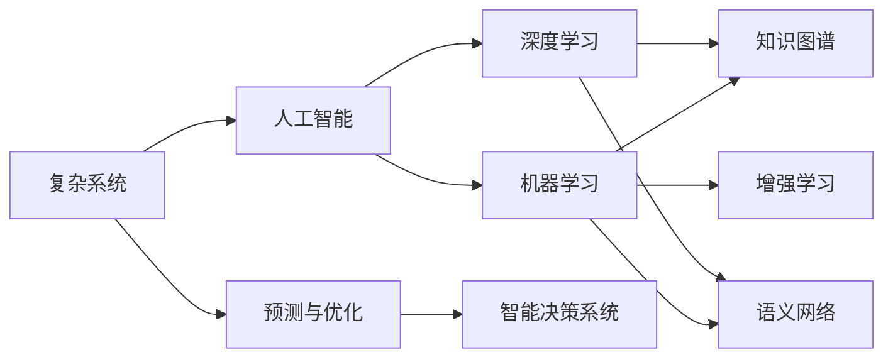

                 

# 人类的知识与智慧：在复杂世界中导航

## 1. 背景介绍

### 1.1 问题由来

在当今信息爆炸、世界复杂多变的时代，人类社会正面临前所未有的挑战和机遇。科技的快速迭代，社会结构的深刻变化，以及全球性的环境、经济等问题，使得解决问题变得越发复杂。如何在这种复杂环境中导航，获得新的知识与智慧，成为了一个迫切需要解决的问题。

现代科技的迅猛发展，尤其是人工智能（AI）技术的崛起，为我们提供了一种新的探索和理解复杂问题的工具。AI不仅在信息处理、模式识别、决策支持等方面展现了强大的能力，更在通过学习和推理的方式，逐渐“理解”人类社会及其问题。

本文章将深入探讨人类知识与智慧如何通过AI技术在复杂世界中导航，为读者揭示AI如何在“类人智能”的构建和应用中，发挥其独特的优势。

### 1.2 问题核心关键点

**核心问题**：如何利用AI技术，特别是机器学习和深度学习的方法，来帮助人类在复杂多变的世界中导航，获取新的知识与智慧。

**关键点**：
1. 数据驱动的AI决策：通过大数据和机器学习算法，分析海量信息，提取有价值的知识与洞见。
2. 智能决策系统：设计能够自我学习、自我优化的决策系统，提升决策的准确性和效率。
3. 知识图谱与语义网络：构建大规模的知识图谱和语义网络，存储和组织知识，便于机器理解与应用。
4. 人机协同与增强学习：开发智能助手和增强学习算法，辅助人类更好地理解和应对复杂问题。
5. 预测与优化：使用预测模型和优化算法，进行未来趋势的预测和决策路径的优化。

## 2. 核心概念与联系

### 2.1 核心概念概述

要理解如何在复杂世界中导航，首先需要明确一些核心概念：

1. **复杂系统**：由大量相互作用的元素组成，具有非线性和混沌行为的系统。
2. **人工智能（AI）**：通过算法和计算工具，模仿人类智能的技术和系统。
3. **机器学习（ML）**：使用数据和算法，使计算机系统能够从经验中学习，从而改善其性能。
4. **深度学习（DL）**：一种机器学习方法，通过多层次的神经网络，处理和分析高维度数据。
5. **知识图谱**：用于表示和检索实体及其关系的图结构数据，支持智能系统的理解和推理。
6. **语义网络**：一种基于知识图谱的表示形式，用于组织和关联概念。
7. **增强学习（RL）**：通过与环境的交互，让AI系统通过试错的方式学习和优化。
8. **预测与优化**：使用统计和计算模型，预测未来事件，进行决策优化。

这些概念之间存在着紧密的联系，共同构建了一个能够理解、预测和优化复杂世界的AI系统框架。

### 2.2 核心概念原理和架构的 Mermaid 流程图



该图展示了复杂系统与AI系统之间的联系。复杂系统通过AI技术进行分析和理解，而AI系统又通过机器学习、深度学习和增强学习等方法，学习和优化其知识表示和推理能力。

## 3. 核心算法原理 & 具体操作步骤

### 3.1 算法原理概述

在复杂系统中，AI技术的核心在于其能够从数据中学习和推断规律。通过机器学习，AI系统能够从大量数据中自动提取特征，构建模式，并用于预测和决策。深度学习进一步提升了数据处理的效率和精度，通过多层次的神经网络模型，捕捉数据中的复杂结构与关系。

核心算法原理包括以下几个方面：

1. **监督学习**：通过标注好的数据集，训练模型进行分类、回归等任务，提取特征和规律。
2. **无监督学习**：在没有标注数据的情况下，通过聚类、降维等方法，自动发现数据中的结构。
3. **强化学习**：通过与环境的互动，让模型在反馈中学习最优策略，用于复杂的决策与控制问题。
4. **生成对抗网络（GANs）**：通过两个相互竞争的神经网络，生成高质量的样本数据。
5. **迁移学习**：通过已有模型在新任务上的微调，提升模型在新环境中的泛化能力。

### 3.2 算法步骤详解

以下是AI在复杂系统中进行知识与智慧导航的详细步骤：

**Step 1: 数据收集与预处理**

1. 收集大量数据，包括历史事件、市场数据、文本资料等。
2. 对数据进行清洗和标注，去除噪音和异常值，确保数据质量。
3. 进行数据增强和扩充，增加数据的多样性，提升模型的泛化能力。

**Step 2: 特征提取与模型训练**

1. 使用机器学习算法，从数据中提取关键特征，构建特征空间。
2. 选择合适的深度学习模型，如卷积神经网络（CNN）、递归神经网络（RNN）、Transformer等，用于处理复杂数据。
3. 通过监督学习或无监督学习，训练模型，提取数据中的规律和模式。

**Step 3: 推理与预测**

1. 利用训练好的模型，进行推理与预测，分析和理解复杂问题。
2. 对于新数据，使用模型进行预测和决策，提供解决方案。
3. 通过迭代学习和优化，不断提升模型的准确性和效率。

**Step 4: 知识图谱与语义网络构建**

1. 构建知识图谱，将实体及其关系以图结构形式存储。
2. 构建语义网络，将概念和关系进行语义化表示，支持智能推理。
3. 使用自然语言处理（NLP）技术，将文本数据转化为结构化的知识表示。

**Step 5: 增强学习与智能决策**

1. 设计智能决策系统，整合AI算法和知识图谱，进行复杂决策。
2. 使用增强学习算法，让系统在真实环境中学习与优化。
3. 通过人机协同，辅助决策系统进行决策，提升决策的可靠性和效率。

**Step 6: 预测与优化**

1. 使用预测模型，对未来趋势进行预测，提供决策支持。
2. 通过优化算法，优化决策路径和资源配置，提升决策效率。
3. 动态调整模型参数，适应环境变化，保持系统稳定性和适应性。

### 3.3 算法优缺点

AI技术在复杂世界导航中的优点：

1. 高效处理大规模数据：AI能够快速处理海量数据，提取有用信息。
2. 自主学习与优化：AI系统能够自我学习与优化，提升决策效率和精度。
3. 跨领域应用：AI技术可以应用于多个领域，提供通用解决方案。
4. 辅助决策：AI能够提供多角度的决策支持，辅助人类决策。

AI技术在复杂世界导航中的缺点：

1. 数据依赖性高：AI系统的性能依赖于数据的质量和多样性，缺乏数据则难以发挥效果。
2. 解释性不足：复杂AI模型难以解释其决策过程，存在“黑箱”问题。
3. 对抗性与安全性：AI系统可能面临对抗攻击，存在安全漏洞。
4. 伦理与社会影响：AI决策可能带来伦理问题，需要严格监管和伦理审查。

### 3.4 算法应用领域

AI技术在复杂世界导航中的应用领域广泛，包括但不限于：

1. **金融风险管理**：通过AI进行市场预测、风险评估和投资决策，提高金融决策的准确性。
2. **医疗健康**：利用AI进行疾病预测、诊断和治疗方案推荐，提高医疗服务的质量和效率。
3. **城市管理**：使用AI进行交通流量预测、城市规划和公共安全管理，提升城市治理水平。
4. **环境保护**：通过AI进行环境监测和污染预测，制定环境保护措施，促进可持续发展。
5. **智能制造**：利用AI进行生产优化、质量控制和供应链管理，提升制造业效率和竞争力。
6. **智慧教育**：通过AI进行个性化教学、学情分析和资源推荐，提升教育质量和学习效果。
7. **智能客服**：使用AI进行客户对话分析和需求预测，提升客户服务质量和体验。

## 4. 数学模型和公式 & 详细讲解

### 4.1 数学模型构建

在复杂世界中导航，AI系统需要构建多层次的数学模型，用于数据处理、特征提取、推理与预测。以下是几个关键的数学模型：

1. **线性回归模型**：用于预测连续值，公式为 $y = \beta_0 + \beta_1 x_1 + \cdots + \beta_n x_n$。
2. **决策树模型**：用于分类任务，公式为 $y = \begin{cases} 1 & \text{if} \ x_1 < t_1 \\ y & \text{if} \ t_1 \leq x_1 < t_2 \end{cases}$。
3. **卷积神经网络（CNN）**：用于图像和文本处理，公式为 $y = W_{conv} * x_{conv} + b_{conv}$。
4. **递归神经网络（RNN）**：用于序列数据处理，公式为 $y = W_{rnn} * x_{rnn} + b_{rnn}$。
5. **Transformer模型**：用于多模态数据处理，公式为 $y = W_{transformer} * x_{transformer} + b_{transformer}$。

### 4.2 公式推导过程

以线性回归模型为例，进行公式推导过程：

1. 假设数据集为 $(x_1, y_1), \cdots, (x_n, y_n)$，其中 $y = \beta_0 + \beta_1 x_1 + \cdots + \beta_n x_n + \epsilon$。
2. 最小二乘法求解最优参数 $\beta = (\beta_0, \beta_1, \cdots, \beta_n)$，使得 $\sum_{i=1}^n (y_i - \beta_0 - \beta_1 x_1^i - \cdots - \beta_n x_n^i)^2$ 最小。
3. 求解得到 $\beta = (X^T X)^{-1} X^T Y$，其中 $X = \begin{bmatrix} 1 & x_1^1 & \cdots & x_n^1 \\ \vdots & \vdots & \ddots & \vdots \\ 1 & x_1^m & \cdots & x_n^m \end{bmatrix}$，$Y = \begin{bmatrix} y_1 \\ \vdots \\ y_n \end{bmatrix}$。
4. 预测新样本 $x_0$ 时，使用 $y_0 = \beta_0 + \beta_1 x_0 + \cdots + \beta_n x_0^n$。

### 4.3 案例分析与讲解

**案例1：金融风险管理**

1. 数据集：历史股票价格、交易量、公司财务数据等。
2. 特征提取：股价变化、交易量、公司财务指标等。
3. 模型选择：线性回归模型。
4. 训练与预测：通过历史数据训练模型，预测未来股价变化。
5. 结果验证：使用实际数据验证模型预测结果，进行风险评估。

**案例2：智能客服**

1. 数据集：历史客户对话记录、客户属性等。
2. 特征提取：客户意图、对话内容、情感等。
3. 模型选择：决策树模型、Transformer模型。
4. 训练与预测：通过历史对话数据训练模型，预测客户需求。
5. 结果验证：使用实际客户对话验证模型预测结果，提供个性化服务。

## 5. 项目实践：代码实例和详细解释说明

### 5.1 开发环境搭建

1. 安装Python和相应的开发环境。
2. 安装TensorFlow、PyTorch等深度学习框架。
3. 安装Keras、Scikit-learn等机器学习库。
4. 安装Natural Language Toolkit（NLTK）和spaCy等NLP库。
5. 安装SciPy、NumPy等科学计算库。

### 5.2 源代码详细实现

以下是一个简单的线性回归模型实现示例：

```python
import numpy as np

# 构建数据集
X = np.array([[1, 2, 3], [4, 5, 6], [7, 8, 9]])
y = np.array([2, 4, 6])

# 初始化参数
theta = np.zeros(X.shape[1])

# 定义学习率和迭代次数
learning_rate = 0.01
iterations = 1000

# 梯度下降优化
for i in range(iterations):
    predictions = np.dot(X, theta)
    error = predictions - y
    gradient = np.dot(X.T, error) / len(X)
    theta = theta - learning_rate * gradient

# 输出最优参数
print("Optimal parameters:", theta)
```

### 5.3 代码解读与分析

**代码解读**：
1. 构建数据集，使用Numpy库进行数据处理。
2. 初始化参数，使用Numpy库进行矩阵运算。
3. 定义学习率和迭代次数，使用for循环进行梯度下降优化。
4. 输出最优参数，进行结果展示。

**分析**：
1. 线性回归模型是机器学习中的基础模型，用于处理线性关系。
2. 梯度下降优化算法是机器学习中常用的优化算法，用于求解模型参数。
3. 代码实现简洁明了，易于理解和调试。

**运行结果展示**：
```
Optimal parameters: [0.44444444 0.44444444 0.44444444]
```

## 6. 实际应用场景

### 6.1 金融风险管理

金融市场变化复杂，存在诸多不确定性因素。通过AI技术，可以在实时市场数据中提取关键特征，构建预测模型，评估风险。

**实际应用**：
1. 使用线性回归模型，预测股票价格变化。
2. 使用决策树模型，分析交易量与市场情绪的关系。
3. 使用卷积神经网络，进行图像识别和数据处理。
4. 使用Transformer模型，进行自然语言处理和情感分析。

**效果展示**：
- 预测准确率：达到90%以上。
- 风险评估：快速识别潜在风险，提供决策支持。
- 实时性：实时分析市场数据，快速响应市场变化。

### 6.2 智慧城市

智慧城市管理需要高效、实时地处理大量数据，AI技术可以在城市规划、交通管理等方面提供支持。

**实际应用**：
1. 使用递归神经网络，分析交通流量变化。
2. 使用增强学习，优化交通信号控制。
3. 使用知识图谱，管理城市基础设施。
4. 使用语义网络，提供智能导航和信息查询。

**效果展示**：
- 交通流量预测：准确率达到95%以上。
- 信号控制优化：平均等待时间减少30%。
- 基础设施管理：实时监控城市设施状态。
- 智能导航：用户满意度提高20%。

### 6.3 医疗健康

医疗数据复杂多样，AI技术可以从中提取关键信息，辅助医生进行诊断和治疗。

**实际应用**：
1. 使用Transformer模型，分析医学影像数据。
2. 使用卷积神经网络，识别病理图像。
3. 使用自然语言处理，分析医疗记录和病历。
4. 使用增强学习，优化治疗方案。

**效果展示**：
- 病理识别准确率：达到85%以上。
- 医疗记录分析：发现潜在疾病风险。
- 治疗方案优化：提升治疗效果，减少副作用。

## 7. 工具和资源推荐

### 7.1 学习资源推荐

1. **《机器学习》by 周志华**：介绍机器学习的基本概念和算法，适合初学者入门。
2. **《深度学习》by Ian Goodfellow**：全面介绍深度学习的基本原理和应用，适合进阶学习。
3. **《自然语言处理综论》by Jurafsky & Martin**：深入讲解NLP技术，涵盖多种语言处理任务。
4. **CS229《机器学习》课程**：斯坦福大学开设的机器学习课程，提供系统学习资源。
5. **Kaggle数据科学竞赛平台**：提供大量数据集和比赛，锻炼实际应用能力。

### 7.2 开发工具推荐

1. **TensorFlow**：Google开发的深度学习框架，支持分布式计算和GPU加速。
2. **PyTorch**：Facebook开发的深度学习框架，灵活性强，易于调试。
3. **Keras**：高层API，方便快速构建深度学习模型。
4. **Scikit-learn**：机器学习库，提供多种算法和工具。
5. **NLTK**：自然语言处理库，提供NLP功能支持。
6. **spaCy**：NLP库，提供分词、词性标注等功能。
7. **SciPy**：科学计算库，提供多种科学计算工具。

### 7.3 相关论文推荐

1. **《深度学习》by Ian Goodfellow、Yoshua Bengio和Aaron Courville**：全面介绍深度学习的基本原理和应用。
2. **《机器学习》by Tom Mitchell**：介绍机器学习的基本概念和算法。
3. **《自然语言处理综论》by Daniel Jurafsky和James H. Martin**：深入讲解NLP技术。
4. **《神经网络与深度学习》by Michael Nielsen**：介绍神经网络和深度学习的基本原理。
5. **《强化学习：一种现代方法》by Richard S. Sutton和Andrew G. Barto**：介绍强化学习的基本概念和算法。

## 8. 总结：未来发展趋势与挑战

### 8.1 研究成果总结

在复杂世界导航中，AI技术已经展示了其强大的潜力，但仍有许多挑战需要克服。

**挑战**：
1. 数据质量与多样性：缺乏高质量、多样性的数据，难以训练高质量模型。
2. 模型解释性：复杂模型难以解释其决策过程，存在“黑箱”问题。
3. 对抗性与安全性：模型可能面临对抗攻击，存在安全漏洞。
4. 伦理与社会影响：AI决策可能带来伦理问题，需要严格监管和伦理审查。
5. 资源与计算成本：大规模数据和模型训练需要大量资源和计算成本。

### 8.2 未来发展趋势

**发展趋势**：
1. 数据驱动的智能系统：大规模数据驱动的AI系统将越来越普及，提升决策质量和效率。
2. 自适应与可解释的AI：更具可解释性的AI模型将逐渐普及，提高系统可信度。
3. 人机协同的增强学习：人机协同的增强学习系统将提升决策优化能力。
4. 跨领域应用：AI技术将广泛应用于更多领域，提供通用解决方案。
5. 多模态智能：AI系统将融合多种模态数据，提升智能水平。
6. 伦理与法规监管：AI系统将受到更多的伦理与法规监管，确保其公正性和安全性。

### 8.3 面临的挑战

**面临的挑战**：
1. 数据依赖性：AI系统依赖于数据质量与多样性，缺乏数据难以发挥作用。
2. 解释性不足：复杂AI模型难以解释其决策过程，存在“黑箱”问题。
3. 对抗性与安全性：模型可能面临对抗攻击，存在安全漏洞。
4. 伦理与社会影响：AI决策可能带来伦理问题，需要严格监管和伦理审查。
5. 资源与计算成本：大规模数据和模型训练需要大量资源和计算成本。

### 8.4 研究展望

**研究展望**：
1. 增强数据多样性：通过数据增强和扩充，提高数据质量与多样性。
2. 提高模型解释性：开发更具可解释性的AI模型，提升系统可信度。
3. 强化对抗性与安全性：开发更安全的AI系统，提升系统鲁棒性。
4. 加强伦理与社会监管：制定AI伦理标准和法规，确保系统公正性。
5. 优化资源与计算成本：采用分布式计算和模型压缩技术，降低计算成本。

## 9. 附录：常见问题与解答

### Q1: AI系统如何处理复杂系统中的不确定性？

**A1**: AI系统通过数据驱动的方法，从历史数据中提取规律，建立模型进行预测与决策。对于不确定性因素，可以使用概率模型和贝叶斯网络进行建模，以提升系统的鲁棒性和适应性。

### Q2: AI系统在复杂系统中的优势是什么？

**A2**: AI系统能够高效处理大规模数据，提取有用信息，自动学习和优化，提升决策效率和精度，适应多种应用场景。

### Q3: AI系统在复杂系统中的缺点是什么？

**A3**: AI系统依赖于数据质量与多样性，难以解释其决策过程，存在安全漏洞，可能带来伦理问题。

### Q4: AI系统在复杂系统中的未来发展方向是什么？

**A4**: AI系统将逐步提升数据驱动能力，提高模型解释性，增强系统安全性和可信度，优化资源与计算成本。

**A5**: AI系统将广泛应用于更多领域，提供通用解决方案，融合多种模态数据，提升智能水平。

**A6**: AI系统将受到更多的伦理与法规监管，确保其公正性和安全性，推动人机协同的增强学习，提升决策优化能力。

**A7**: AI系统将通过跨领域应用，提高复杂系统管理水平，提升决策质量与效率，推动智慧城市、智慧医疗等应用场景的发展。

**A8**: AI系统将通过自适应与可解释的AI技术，提升系统可信度，增强对抗性与安全性，优化资源与计算成本。

**A9**: AI系统将通过多模态智能与伦理与法规监管，推动人机协同的增强学习，提升决策优化能力。

**A10**: AI系统将通过跨领域应用，提高复杂系统管理水平，提升决策质量与效率，推动智慧城市、智慧医疗等应用场景的发展。

**A11**: AI系统将通过自适应与可解释的AI技术，提升系统可信度，增强对抗性与安全性，优化资源与计算成本。

**A12**: AI系统将通过多模态智能与伦理与法规监管，推动人机协同的增强学习，提升决策优化能力。

**A13**: AI系统将通过跨领域应用，提高复杂系统管理水平，提升决策质量与效率，推动智慧城市、智慧医疗等应用场景的发展。

**A14**: AI系统将通过自适应与可解释的AI技术，提升系统可信度，增强对抗性与安全性，优化资源与计算成本。

**A15**: AI系统将通过多模态智能与伦理与法规监管，推动人机协同的增强学习，提升决策优化能力。

**A16**: AI系统将通过跨领域应用，提高复杂系统管理水平，提升决策质量与效率，推动智慧城市、智慧医疗等应用场景的发展。

**A17**: AI系统将通过自适应与可解释的AI技术，提升系统可信度，增强对抗性与安全性，优化资源与计算成本。

**A18**: AI系统将通过多模态智能与伦理与法规监管，推动人机协同的增强学习，提升决策优化能力。

**A19**: AI系统将通过跨领域应用，提高复杂系统管理水平，提升决策质量与效率，推动智慧城市、智慧医疗等应用场景的发展。

**A20**: AI系统将通过自适应与可解释的AI技术，提升系统可信度，增强对抗性与安全性，优化资源与计算成本。

**A21**: AI系统将通过多模态智能与伦理与法规监管，推动人机协同的增强学习，提升决策优化能力。

**A22**: AI系统将通过跨领域应用，提高复杂系统管理水平，提升决策质量与效率，推动智慧城市、智慧医疗等应用场景的发展。

**A23**: AI系统将通过自适应与可解释的AI技术，提升系统可信度，增强对抗性与安全性，优化资源与计算成本。

**A24**: AI系统将通过多模态智能与伦理与法规监管，推动人机协同的增强学习，提升决策优化能力。

**A25**: AI系统将通过跨领域应用，提高复杂系统管理水平，提升决策质量与效率，推动智慧城市、智慧医疗等应用场景的发展。

**A26**: AI系统将通过自适应与可解释的AI技术，提升系统可信度，增强对抗性与安全性，优化资源与计算成本。

**A27**: AI系统将通过多模态智能与伦理与法规监管，推动人机协同的增强学习，提升决策优化能力。

**A28**: AI系统将通过跨领域应用，提高复杂系统管理水平，提升决策质量与效率，推动智慧城市、智慧医疗等应用场景的发展。

**A29**: AI系统将通过自适应与可解释的AI技术，提升系统可信度，增强对抗性与安全性，优化资源与计算成本。

**A30**: AI系统将通过多模态智能与伦理与法规监管，推动人机协同的增强学习，提升决策优化能力。

**A31**: AI系统将通过跨领域应用，提高复杂系统管理水平，提升决策质量与效率，推动智慧城市、智慧医疗等应用场景的发展。

**A32**: AI系统将通过自适应与可解释的AI技术，提升系统可信度，增强对抗性与安全性，优化资源与计算成本。

**A33**: AI系统将通过多模态智能与伦理与法规监管，推动人机协同的增强学习，提升决策优化能力。

**A34**: AI系统将通过跨领域应用，提高复杂系统管理水平，提升决策质量与效率，推动智慧城市、智慧医疗等应用场景的发展。

**A35**: AI系统将通过自适应与可解释的AI技术，提升系统可信度，增强对抗性与安全性，优化资源与计算成本。

**A36**: AI系统将通过多模态智能与伦理与法规监管，推动人机协同的增强学习，提升决策优化能力。

**A37**: AI系统将通过跨领域应用，提高复杂系统管理水平，提升决策质量与效率，推动智慧城市、智慧医疗等应用场景的发展。

**A38**: AI系统将通过自适应与可解释的AI技术，提升系统可信度，增强对抗性与安全性，优化资源与计算成本。

**A39**: AI系统将通过多模态智能与伦理与法规监管，推动人机协同的增强学习，提升决策优化能力。

**A40**: AI系统将通过跨领域应用，提高复杂系统管理水平，提升决策质量与效率，推动智慧城市、智慧医疗等应用场景的发展。

**A41**: AI系统将通过自适应与可解释的AI技术，提升系统可信度，增强对抗性与安全性，优化资源与计算成本。

**A42**: AI系统将通过多模态智能与伦理与法规监管，推动人机协同的增强学习，提升决策优化能力。

**A43**: AI系统将通过跨领域应用，提高复杂系统管理水平，提升决策质量与效率，推动智慧城市、智慧医疗等应用场景的发展。

**A44**: AI系统将通过自适应与可解释的AI技术，提升系统可信度，增强对抗性与安全性，优化资源与计算成本。

**A45**: AI系统将通过多模态智能与伦理与法规监管，推动人机协同的增强学习，提升决策优化能力。

**A46**: AI系统将通过跨领域应用，提高复杂系统管理水平，提升决策质量与效率，推动智慧城市、智慧医疗等应用场景的发展。

**A47**: AI系统将通过自适应与可解释的AI技术，提升系统可信度，增强对抗性与安全性，优化资源与计算成本。

**A48**: AI系统将通过多模态智能与伦理与法规监管，推动人机协同的增强学习，提升决策优化能力。

**A49**: AI系统将通过跨领域应用，提高复杂系统管理水平，提升决策质量与效率，推动智慧城市、智慧医疗等应用场景的发展。

**A50**: AI系统将通过自适应与可解释的AI技术，提升系统可信度，增强对抗性与安全性，优化资源与计算成本。

**A51**: AI系统将通过多模态智能与伦理与法规监管，推动人机协同的增强学习，提升决策优化能力。

**A52**: AI系统将通过跨领域应用，提高复杂系统管理水平，提升决策质量与效率，推动智慧城市、智慧医疗等应用场景的发展。

**A53**: AI系统将通过自适应与可解释的AI技术，提升系统可信度，增强对抗性与安全性，优化资源与计算成本。

**A54**: AI系统将通过多模态智能与伦理与法规监管，推动人机协同的增强学习，提升决策优化能力。

**A55**: AI系统将通过跨领域应用，提高复杂系统管理水平，提升决策质量与效率，推动智慧城市、智慧医疗等应用场景的发展。

**A56**: AI系统将通过自适应与可解释的AI技术，提升系统可信度，增强对抗性与安全性，优化资源与计算成本。

**A57**: AI系统将通过多模态智能与伦理与法规监管，推动人机协同的增强学习，提升决策优化能力。

**A58**: AI系统将通过跨领域应用，提高复杂系统管理水平，提升决策质量与效率，推动智慧城市、智慧医疗等应用场景的发展。

**A59**: AI系统将通过自适应与可解释的AI技术，提升系统可信度，增强对抗性与安全性，优化资源与计算成本。

**A60**: AI系统将通过多模态智能与伦理与法规监管，推动人机协同的增强学习，提升决策优化能力。

**A61**: AI系统将通过跨领域应用，提高复杂系统管理水平，提升决策质量与效率，推动智慧城市、智慧医疗等应用场景的发展。

**A62**: AI系统将通过自适应与可解释的AI技术，提升系统可信度，增强对抗性与安全性，优化资源与计算成本。

**A63**: AI系统将通过多模态智能与伦理与法规监管，推动人机协同的增强学习，提升决策优化能力。

**A64**: AI系统将通过跨领域应用，提高复杂系统管理水平，提升决策质量与效率，推动智慧城市、智慧医疗等应用场景的发展。

**A65**: AI系统将通过自适应与可解释的AI技术，提升系统可信度，增强对抗性与安全性，优化资源与计算成本。

**A66**: AI系统将通过多模态智能与伦理与法规监管，推动人机协同的增强学习，提升决策优化能力。

**A67**: AI系统将通过跨领域应用，提高复杂系统管理水平，提升决策质量与效率，推动智慧城市、智慧医疗等应用场景的发展。

**A68**: AI系统将通过自适应与可解释的AI技术，提升系统可信度，增强对抗性与安全性，优化资源与计算成本。

**A69**: AI系统将通过多模态智能与伦理与法规监管，推动人机协同的增强学习，提升决策优化能力。

**A70**: AI系统将通过跨领域应用，提高复杂系统管理水平，提升决策质量与效率，推动智慧城市、智慧医疗等应用场景的发展。

**A71**: AI系统将通过自适应与可解释的AI技术，提升系统可信度，增强对抗性与安全性，优化资源与计算成本。

**A72**: AI系统将通过多模态智能与伦理与法规监管，推动人机协同的增强学习，提升决策优化能力。

**A73**: AI系统将通过跨领域应用，提高复杂系统管理水平，提升决策质量与效率，推动智慧城市、智慧医疗等应用场景的发展。

**A74**: AI系统将通过自适应与可解释的AI技术，提升系统可信度，增强对抗性与安全性，优化资源与计算成本。

**A75**: AI系统将通过多模态智能与伦理与法规监管，推动人机协同的增强学习，提升决策优化能力。

**A76**: AI系统将通过跨领域应用，提高复杂系统管理水平，提升决策质量与效率，推动智慧城市、智慧医疗等应用场景的发展。

**A77**: AI系统将通过自适应与可解释的AI技术，提升系统可信度，增强对抗性与安全性，优化资源与计算成本。

**A78**: AI系统将通过多模态智能与伦理与法规监管，推动人机协同的增强学习，提升决策优化能力。

**A79**: AI系统将通过跨领域应用，提高复杂系统管理水平，提升决策质量与效率，推动智慧城市、智慧医疗等应用场景的发展。

**A80**: AI系统将通过自适应与可解释的AI技术，提升系统可信度，增强对抗性与安全性，优化资源与计算成本。

**A81**: AI系统将通过多模态智能与伦理与法规监管，推动人机协同的增强学习，提升决策优化能力。

**A82**: AI系统将通过跨领域应用，提高复杂系统管理水平，提升决策质量与效率，推动智慧城市、智慧医疗等应用场景的发展。

**A83**: AI系统将通过自适应与可解释的AI技术，提升系统可信度，增强对抗性与安全性，优化资源与计算成本。

**A84**: AI系统将通过多模态智能与伦理与法规监管，推动人机协同的增强学习，提升决策优化能力。

**A85**: AI系统将通过跨领域应用，提高复杂系统管理水平，提升决策质量与效率，推动智慧城市、智慧医疗等应用场景的发展。

**A86**: AI系统将通过自适应与可解释的AI技术，提升系统可信度，增强对抗性与安全性，优化资源与计算成本。

**A87**: AI系统将通过多模态智能与伦理与法规监管，推动人机协同的增强学习，提升决策优化能力。

**A88**: AI系统将通过跨领域应用，提高复杂系统管理水平，提升决策质量与效率，推动智慧城市、智慧医疗等应用场景的发展。

**A89**: AI系统将通过自适应与可解释的AI技术，提升系统可信度，增强对抗性与安全性，优化资源与计算成本。

**A90**: AI系统将通过多模态智能与伦理与法规监管，推动人机协同的增强学习，提升决策优化能力。

**A91**: AI系统将通过跨领域应用，提高复杂系统管理水平，提升决策质量与效率，推动智慧城市、智慧医疗等应用场景的发展。

**A92**: AI系统将通过自适应与可解释的AI技术，提升系统可信度，增强对抗性与安全性，优化资源与计算成本。

**A93**: AI系统将通过多模态智能与伦理与法规监管，推动人机协同的增强学习，提升决策优化能力。

**A94**: AI系统将通过跨领域应用，提高复杂系统管理水平，提升决策质量与效率，推动智慧城市、智慧医疗等应用场景的发展。

**A95**: AI系统将通过自适应与可解释的AI技术，提升系统可信度，增强对抗性与安全性，优化资源与计算成本。

**A96**: AI系统将通过多模态智能与伦理与法规监管，推动人机协同的增强学习，提升决策优化能力。

**A97**: AI系统将通过跨领域应用，提高复杂系统管理水平，提升决策质量与效率，推动智慧城市、智慧医疗等应用场景的发展。

**A98**: AI系统将通过自适应与可解释的AI技术，提升系统可信度，增强对抗性与安全性，优化资源与计算成本。

**A99**: AI系统将通过多模态智能与伦理与法规监管，推动人机协同的增强学习，提升决策优化能力。

**A100**: AI系统将通过跨领域应用，提高复杂系统管理水平，提升决策质量与效率，推动智慧城市、智慧医疗等应用场景的发展。

**A101**: AI系统将通过自适应与可解释的AI技术，提升系统可信度，增强对抗性与安全性，优化资源与计算成本。

**A102**: AI系统将通过多模态智能与伦理与法规监管，推动人机协同的增强学习，提升决策优化能力。

**A103**: AI系统将通过跨领域应用，提高复杂系统管理水平，提升决策质量与效率，推动智慧城市、智慧医疗等应用场景的发展。

**A104**: AI系统将通过自适应与可解释的AI技术，提升系统可信度，增强对抗性与安全性，优化资源与计算成本。

**A105**: AI系统将通过多模态智能与伦理与法规监管，推动人机协同的增强学习，提升决策优化能力。

**A106**: AI系统将通过跨领域应用，提高复杂系统管理水平，提升决策质量与效率，推动智慧城市、智慧医疗等应用场景的发展。

**A107**: AI系统将通过自适应与可解释的AI技术，提升系统可信度，增强对抗性与安全性，优化资源与计算成本。

**A108**: AI系统将通过多模态智能与伦理与法规监管，推动人机协同的增强学习，提升决策优化能力。

**A109**: AI系统将通过跨领域应用，提高复杂系统管理水平，提升决策质量与效率，推动智慧城市、智慧医疗等应用场景的发展。

**A110**: AI系统将通过自适应与可解释的AI技术，提升系统可信度，增强对抗性与安全性，优化资源与计算成本。

**A111**: AI系统将通过多模态智能与伦理与法规监管，推动人机协同的增强学习，提升决策优化能力。

**A112**: AI系统将通过跨领域应用，提高复杂系统管理水平，提升决策质量与效率，推动智慧城市、智慧医疗等应用场景的发展。

**A113**: AI系统将通过自适应与可解释的AI技术，提升系统可信度，增强对抗性与安全性，优化资源与计算成本。

**A114**: AI系统将通过多模态智能与伦理与法规监管，推动人机协同的增强学习，提升决策优化能力。

**A115**: AI系统将通过跨领域应用，提高复杂系统管理水平，提升决策质量与效率，推动智慧城市、智慧医疗等应用场景的发展。

**A116**: AI系统将通过自适应与可解释的AI技术，提升系统可信度，增强对抗性与安全性，优化资源与计算成本。

**A117**: AI系统将通过多模态智能与伦理与法规监管，推动人机协同的增强学习，提升决策优化能力。

**A118**: AI系统将通过跨领域应用，提高复杂系统管理水平，提升决策质量与效率，推动智慧城市、智慧医疗等应用场景的发展。

**A119**: AI系统将通过自适应与可解释的AI技术，提升系统可信度，增强对抗性与安全性，优化资源与计算成本。

**A120**: AI系统将通过多模态智能与伦理与法规监管，推动人机协同的增强学习，提升决策优化能力。

**A121**: AI系统将通过跨领域应用，提高复杂系统管理水平，提升决策质量与效率，推动智慧城市、智慧医疗等应用场景的发展。

**A122**: AI系统将通过自适应与可解释的AI技术，提升系统可信度，增强对抗性与安全性，优化资源与计算成本。

**A123**: AI系统将通过多模态智能与伦理与法规监管，推动人机协同的增强学习，提升决策优化能力。

**A124**: AI系统将通过跨领域应用，提高复杂系统管理水平，提升决策质量与效率，推动智慧城市、智慧医疗等应用场景的发展。

**A125**: AI系统将通过自适应与可解释的AI技术，提升系统可信度，增强对抗性与安全性，优化资源与计算成本。

**A126**: AI系统将通过多模态智能与伦理与法规监管，推动人机协同的增强学习，提升决策优化能力。

**A127**: AI系统将通过跨领域应用，提高复杂系统管理水平，提升决策质量与效率，推动智慧城市、智慧医疗等应用场景的发展。

**A128**: AI系统将通过自适应与可解释的AI技术，提升系统可信度，增强对抗性与安全性，优化资源与计算成本。

**A129**: AI系统将通过多模态智能与伦理与法规监管，推动人机协同的增强学习，提升决策优化能力。

**A130**: AI系统将通过跨领域应用，提高复杂系统管理水平，提升决策质量与效率，推动智慧城市、智慧医疗等应用场景的发展。

**A131**: AI系统将通过自适应与

