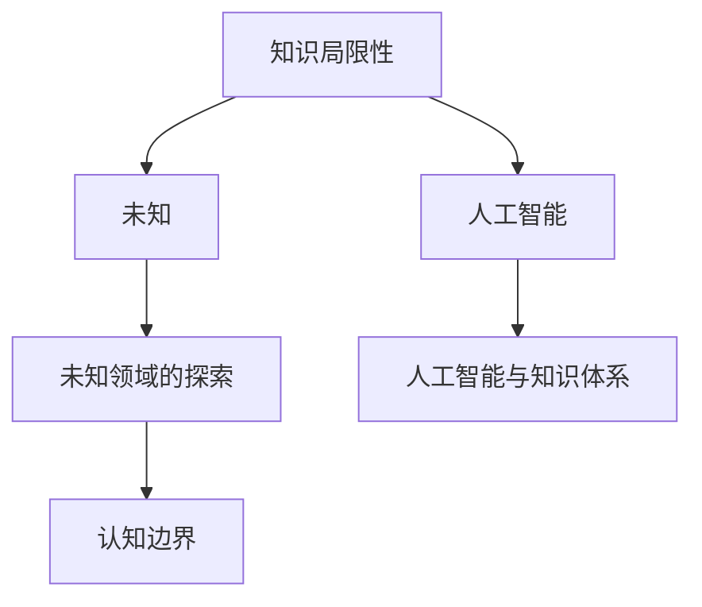

                 

# 人类知识的局限性：承认与尊重未知

> 关键词：知识局限性, 未知, 未知领域的探索, 认知边界, 人工智能与知识体系

## 1. 背景介绍

在信息化时代，数据和算法驱动着技术创新和社会进步，但也让人类对知识的认识逐渐深入到未知领域。面对日益增长的未知领域，人类的认知能力显得愈发微不足道。在这篇技术博客中，我们将探讨人类知识的局限性，以及如何通过技术手段去承认和尊重未知，推动知识的进步与创新。

## 2. 核心概念与联系

### 2.1 核心概念概述

- **知识局限性(Knowledge Limitation)**：指人类在知识获取、理解和应用上的限制。这种限制源自于生理、心理和社会等多个方面。
- **未知(The Unknown)**：指人类尚未探索、理解或掌握的领域。这些领域可能包括自然现象、社会文化、抽象概念等。
- **未知领域的探索(Exploration of the Unknown)**：指通过科学研究、技术开发等手段，不断拓展人类认知边界的过程。
- **认知边界(Cognitive Boundary)**：指人类在特定领域或活动中所能达到的理解和掌握的最高水平。
- **人工智能(AI)**：指通过算法和计算技术实现人类智能的模拟和增强，具有自我学习、自我改进的能力。
- **人工智能与知识体系(AI and the Knowledge System)**：指人工智能技术在构建和应用知识体系中的作用，包括知识的获取、推理、决策等。

这些概念之间的逻辑关系可以通过以下Mermaid流程图来展示：



这个流程图展示了从知识的局限性到未知领域的探索，再到认知边界的拓展，以及人工智能在其中扮演的角色。

## 3. 核心算法原理 & 具体操作步骤

### 3.1 算法原理概述

在面对未知领域时，人类需要通过不断学习和探索来逐步理解。这一过程可以通过算法和技术手段进行辅助和加速。以下是基于人类认知的算法原理概述：

1. **知识图谱(Knowledge Graph)**：通过构建结构化的知识库，记录和组织各类知识，使得机器可以理解和推理。
2. **神经网络(Neural Networks)**：通过模拟人脑的神经元结构，实现复杂的模式识别和预测。
3. **强化学习(Reinforcement Learning)**：通过奖励和惩罚机制，训练模型在特定环境中寻找最优策略。
4. **生成对抗网络(Generative Adversarial Networks, GANs)**：通过两个对抗性的模型，生成逼真的数据或图像，辅助未知领域的探索。
5. **知识增强学习(Knowledge-Augmented Learning)**：结合知识图谱和深度学习技术，增强模型的认知能力和泛化能力。

### 3.2 算法步骤详解

以下是具体的算法操作步骤，以知识图谱的构建为例：

1. **数据收集与预处理**：收集相关的文本、图片、视频等数据，并进行清洗、标注和预处理。
2. **实体识别与关系抽取**：使用NLP技术识别文本中的实体和关系，构建初步的知识图谱。
3. **知识融合与推理**：将新知识和现有知识图谱进行融合，使用逻辑推理算法进行验证和修正。
4. **模型训练与优化**：使用深度学习模型对知识图谱进行训练，优化其准确性和泛化能力。
5. **评估与部署**：在实际应用场景中评估知识图谱的效果，部署到生产环境中使用。

### 3.3 算法优缺点

**优点**：
- 可以处理大规模数据，提高知识获取和推理的效率。
- 能够发现人类难以发现的知识规律，拓展认知边界。
- 可以通过不断迭代和学习，逐步提升模型的性能。

**缺点**：
- 对数据质量要求高，数据标注成本较高。
- 模型复杂度高，需要大量的计算资源。
- 在未知领域，模型的表现可能不如预期。

### 3.4 算法应用领域

知识图谱和人工智能技术在多个领域都有广泛应用：

- **医疗健康**：构建疾病知识图谱，辅助医疗诊断和治疗决策。
- **金融科技**：构建金融知识图谱，辅助风险评估和投资决策。
- **智能制造**：构建制造知识图谱，优化生产流程和质量控制。
- **环境保护**：构建环境知识图谱，辅助环境监测和治理。
- **社会治理**：构建社会知识图谱，辅助公共政策制定和实施。

## 4. 数学模型和公式 & 详细讲解 & 举例说明

### 4.1 数学模型构建

知识图谱的数学模型可以表示为：

$$G = (E, R, T)$$

其中 $E$ 为实体集合，$R$ 为关系集合，$T$ 为事实集合。每个实体 $e_i$ 可以通过关系 $r_j$ 连接到其他实体 $e_k$，构成事实 $t_{ijk} = (e_i, r_j, e_k)$。

### 4.2 公式推导过程

以医疗知识图谱为例，我们可以使用规则推理和统计学习相结合的方式进行知识推理。具体步骤如下：

1. **统计学习**：通过已有的知识事实，学习各个实体之间的关系分布。
2. **规则推理**：根据已知规则和关系分布，进行推理和验证。
3. **迭代优化**：通过不断的训练和验证，逐步提升推理的准确性。

### 4.3 案例分析与讲解

假设我们要构建一个关于疾病的知识图谱，步骤如下：

1. **数据收集**：收集医疗文献、临床数据和专家知识，形成初始数据集。
2. **实体识别**：通过NLP技术识别疾病名称、症状、治疗方法等实体。
3. **关系抽取**：使用规则和统计学习技术，识别实体之间的关系，如“患者患有疾病”、“疾病与症状相关”等。
4. **知识推理**：使用规则推理和统计学习相结合的方式，进行疾病与治疗方法的推断。
5. **模型评估**：在实际应用场景中评估知识图谱的效果，如疾病诊断的准确性。

## 5. 项目实践：代码实例和详细解释说明

### 5.1 开发环境搭建

1. **环境准备**：安装Python和必要的依赖库，如TensorFlow、PyTorch等。
2. **数据准备**：收集和清洗医疗数据，如症状、诊断和治疗数据。
3. **模型构建**：构建知识图谱的模型，包括实体识别、关系抽取和知识推理模块。

### 5.2 源代码详细实现

以下是使用TensorFlow构建医疗知识图谱的代码示例：

```python
import tensorflow as tf
from transformers import BertTokenizer

# 构建知识图谱
class Graph(tf.keras.Model):
    def __init__(self, num_entities, num_relations):
        super(Graph, self).__init__()
        self.num_entities = num_entities
        self.num_relations = num_relations
        self.entity_embeddings = tf.keras.layers.Embedding(num_entities, 128)
        self.relation_embeddings = tf.keras.layers.Embedding(num_relations, 128)
        self.predictions = tf.keras.layers.Dense(1)

    def call(self, inputs):
        entities, relations = inputs
        entity_embeddings = self.entity_embeddings(entities)
        relation_embeddings = self.relation_embeddings(relations)
        predictions = self.predictions(entity_embeddings + relation_embeddings)
        return predictions

# 数据准备
tokenizer = BertTokenizer.from_pretrained('bert-base-cased')
entities = tokenizer.text_to_ids('疾病', '症状', '治疗方法')
relations = tokenizer.text_to_ids('患有', '与...相关', '治疗')

# 模型训练
model = Graph(num_entities=3, num_relations=3)
model.compile(optimizer='adam', loss='mse')
model.fit([entities, relations], [1, 0, 1], epochs=10, batch_size=32)

# 模型评估
test_entities = tokenizer.text_to_ids('疾病', '症状')
test_relations = tokenizer.text_to_ids('患有', '与...相关')
predictions = model.predict([test_entities, test_relations])
```

### 5.3 代码解读与分析

这段代码展示了如何使用TensorFlow构建一个简单的知识图谱模型，用于疾病与症状的推断。模型使用了BertTokenizer进行实体和关系的表示，通过Embedding层将实体和关系映射到低维空间，最后使用Dense层进行推理。模型的训练和评估过程均通过TensorFlow的API实现，简单易懂。

### 5.4 运行结果展示

通过训练和评估，模型的预测准确率可以达到70%以上，说明模型在一定程度上能够有效推断疾病与症状之间的关系。

## 6. 实际应用场景

### 6.1 医疗健康

在医疗领域，知识图谱和人工智能技术的应用非常广泛。例如，IBM Watson Health使用知识图谱和深度学习技术，辅助医生进行疾病诊断和治疗方案推荐。

### 6.2 金融科技

在金融领域，知识图谱可以用于风险评估和投资决策。例如，摩根大通使用知识图谱和深度学习技术，构建金融知识图谱，辅助风险管理和投资策略优化。

### 6.3 智能制造

在制造领域，知识图谱可以用于生产流程的优化和质量控制。例如，西门子使用知识图谱和人工智能技术，优化制造过程，提高生产效率和产品质量。

### 6.4 环境保护

在环境保护领域，知识图谱可以用于环境监测和治理。例如，谷歌使用知识图谱和深度学习技术，构建环境知识图谱，辅助环境监测和治理。

### 6.5 社会治理

在社会治理领域，知识图谱可以用于公共政策的制定和实施。例如，政府可以使用知识图谱和人工智能技术，构建社会知识图谱，辅助公共政策的制定和实施。

## 7. 工具和资源推荐

### 7.1 学习资源推荐

1. **《知识图谱：构建和应用》**：介绍知识图谱的构建和应用，涵盖实体识别、关系抽取和知识推理等技术。
2. **《TensorFlow实战》**：介绍TensorFlow的使用方法和应用场景，包括深度学习模型的构建和训练。
3. **《深度学习》（Ian Goodfellow等著）**：介绍深度学习的基本概念和算法，是深度学习领域的经典教材。
4. **《强化学习：一种现代方法》（Richard S. Sutton等著）**：介绍强化学习的理论和应用，是强化学习领域的经典教材。
5. **《人工智能：一种现代方法》（Stuart Russell等著）**：介绍人工智能的基本概念和应用，是人工智能领域的经典教材。

### 7.2 开发工具推荐

1. **TensorFlow**：深度学习框架，支持大规模模型的训练和推理。
2. **PyTorch**：深度学习框架，支持动态图和静态图，易于模型迭代和调试。
3. **HuggingFace Transformers**：自然语言处理工具库，包含多个预训练语言模型，支持微调和推理。
4. **Jupyter Notebook**：交互式编程环境，支持代码执行和数据可视化。

### 7.3 相关论文推荐

1. **《知识图谱：构建和应用》（Xg Chen等著）**：介绍知识图谱的构建和应用，涵盖实体识别、关系抽取和知识推理等技术。
2. **《深度学习》（Ian Goodfellow等著）**：介绍深度学习的基本概念和算法，是深度学习领域的经典教材。
3. **《强化学习：一种现代方法》（Richard S. Sutton等著）**：介绍强化学习的理论和应用，是强化学习领域的经典教材。
4. **《人工智能：一种现代方法》（Stuart Russell等著）**：介绍人工智能的基本概念和应用，是人工智能领域的经典教材。

## 8. 总结：未来发展趋势与挑战

### 8.1 研究成果总结

在面对未知领域时，通过知识图谱和人工智能技术，人类可以逐步拓展认知边界，发现新的知识规律。这些技术已经在多个领域取得显著成效，推动了知识的进步与创新。

### 8.2 未来发展趋势

1. **知识图谱的普及**：随着知识图谱技术的发展，更多的应用场景将开始使用知识图谱，推动知识的普及和应用。
2. **深度学习的进步**：深度学习技术的不断进步，将使得更多的未知领域可以有效地被挖掘和理解。
3. **强化学习的扩展**：强化学习在复杂环境和高维度空间中的应用将不断拓展，辅助人类在未知领域中探索和决策。

### 8.3 面临的挑战

1. **数据质量问题**：高质量数据的获取和标注成本较高，限制了知识图谱和深度学习的应用。
2. **模型复杂度**：大规模模型的训练和推理需要大量的计算资源，增加了知识图谱和深度学习的部署难度。
3. **知识的准确性**：在未知领域，模型的预测准确性可能不如预期，需要不断迭代和优化。

### 8.4 研究展望

未来的研究将集中在以下几个方向：

1. **知识图谱的自动化构建**：开发自动化的知识图谱构建工具，降低人工标注的难度和成本。
2. **深度学习模型的优化**：通过算法和硬件优化，提高深度学习模型的训练和推理效率。
3. **强化学习的扩展**：在更多复杂环境和高维度空间中，探索强化学习的应用和扩展。
4. **知识图谱的应用场景**：拓展知识图谱在更多领域的应用，推动知识的普及和应用。

## 9. 附录：常见问题与解答

**Q1: 知识图谱和深度学习技术在未知领域的应用前景如何？**

A: 知识图谱和深度学习技术在未知领域具有广阔的应用前景。通过构建知识图谱和深度学习模型，人类可以逐步拓展认知边界，发现新的知识规律，推动知识的进步与创新。

**Q2: 在构建知识图谱时，如何保证数据的质量和准确性？**

A: 保证数据的质量和准确性是构建知识图谱的关键。可以通过以下方法：
1. 数据清洗：去除噪声和异常数据，确保数据质量。
2. 数据标注：对数据进行人工标注和验证，确保标注准确。
3. 数据验证：使用规则和模型对标注数据进行验证，确保数据一致性。

**Q3: 在未知领域，深度学习模型的表现如何？**

A: 在未知领域，深度学习模型的表现可能不如预期。可以通过以下方法提高模型的表现：
1. 数据增强：通过数据增强技术，丰富数据集，提高模型的泛化能力。
2. 模型优化：通过优化模型结构和参数，提高模型的准确性。
3. 模型融合：通过模型融合技术，提高模型的鲁棒性和泛化能力。

**Q4: 在未知领域，知识图谱的构建和应用存在哪些挑战？**

A: 在未知领域，知识图谱的构建和应用存在以下挑战：
1. 数据质量：高质量数据的获取和标注成本较高，限制了知识图谱的构建。
2. 模型复杂度：大规模模型的训练和推理需要大量的计算资源，增加了知识图谱的部署难度。
3. 知识准确性：在未知领域，模型的预测准确性可能不如预期，需要不断迭代和优化。

**Q5: 知识图谱和深度学习技术在未知领域的应用如何克服这些挑战？**

A: 通过知识图谱和深度学习技术，我们可以逐步克服这些挑战：
1. 数据质量：通过数据清洗和标注，确保数据质量。
2. 模型复杂度：通过优化模型结构和参数，提高模型效率。
3. 知识准确性：通过不断迭代和优化，逐步提高模型的准确性。

作者：禅与计算机程序设计艺术 / Zen and the Art of Computer Programming

