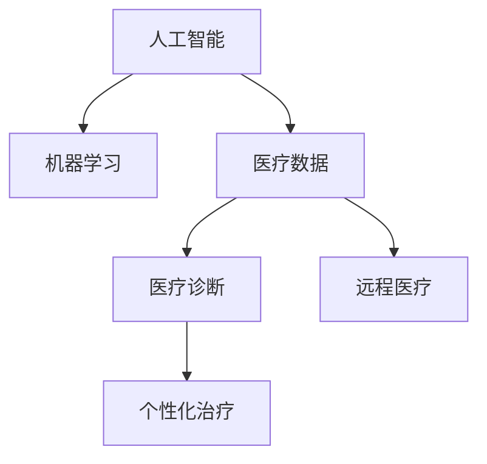

                 

# 人类计算在医疗保健中的应用

> 关键词：人工智能, 医疗保健, 机器学习, 数据处理, 医疗诊断, 远程医疗

## 1. 背景介绍

### 1.1 问题由来
在人类文明的发展历程中，计算技术始终扮演着至关重要的角色。从最早的数学计算到现代的计算机，计算技术的进步不断推动着社会的进步和发展。而在医疗保健领域，计算技术的引入更是带来了革命性的变化。尤其是随着人工智能（AI）和机器学习（ML）技术的迅猛发展，计算在医疗保健中的应用变得前所未有的广泛和深入。

医疗保健是一个复杂的系统，涉及大量的数据处理、诊断和治疗决策。传统上，这些过程往往依赖于人类医疗专业人员的经验和直觉。然而，随着计算技术的引入，尤其是人工智能技术的应用，医疗保健领域正逐步向更加科学、高效、精准的方向发展。通过计算技术，我们不仅能够处理和分析海量的医疗数据，还能辅助医生进行更准确的诊断和治疗决策，甚至在一定程度上实现自动化处理。

### 1.2 问题核心关键点
在医疗保健中，计算技术的应用主要集中在以下几个方面：

- **数据处理与分析**：处理和分析医疗数据，包括病历、影像、基因序列等。
- **医疗诊断**：辅助医生进行疾病诊断，如影像识别、病理学分析等。
- **个性化治疗**：根据患者的个体特征和历史数据，制定个性化的治疗方案。
- **远程医疗**：通过计算技术实现远程医疗，使医疗资源更加公平地分布。

计算技术在医疗保健中的应用，极大地提升了医疗服务的效率和质量，同时也带来了新的挑战和机遇。如何更好地整合和利用计算技术，是当前医疗保健领域面临的重要课题。

### 1.3 问题研究意义
研究计算技术在医疗保健中的应用，对于推动医疗保健的数字化转型、提高医疗服务的质量和效率、缓解医疗资源紧张等问题具有重要意义。计算技术不仅能够帮助我们处理和分析海量的医疗数据，还能辅助医生进行更精准的诊断和治疗决策，从而提升医疗服务的效果和患者的满意度。此外，计算技术在远程医疗、公共卫生等领域的应用，也为医疗资源的公平分配和公共卫生安全提供了新的解决方案。

## 2. 核心概念与联系

### 2.1 核心概念概述

为了更好地理解计算技术在医疗保健中的应用，本节将介绍几个密切相关的核心概念：

- **人工智能（AI）**：一种通过计算机模拟人类智能的技术，能够进行感知、学习、推理和决策等活动。
- **机器学习（ML）**：一种使计算机通过数据学习新任务的技术，能够自动改进算法以提高性能。
- **医疗数据**：包括患者的病历、影像、基因序列、实验室数据等，是医疗保健中的重要资源。
- **医疗诊断**：利用计算技术辅助医生进行疾病诊断的过程，如影像识别、病理学分析等。
- **个性化治疗**：根据患者的个体特征和历史数据，制定个性化的治疗方案。
- **远程医疗**：利用计算技术实现远程医疗，使医疗资源更加公平地分布。

这些核心概念之间的逻辑关系可以通过以下Mermaid流程图来展示：



这个流程图展示了大数据、机器学习和计算技术在医疗保健中的核心应用。

## 3. 核心算法原理 & 具体操作步骤
### 3.1 算法原理概述

计算技术在医疗保健中的应用，主要基于以下几个核心算法原理：

1. **数据预处理与清洗**：对医疗数据进行清洗和预处理，确保数据的准确性和完整性。
2. **特征提取与选择**：从医疗数据中提取有用的特征，并进行选择，以提高模型的性能。
3. **模型训练与优化**：使用机器学习模型对医疗数据进行训练和优化，以提高诊断和治疗的准确性。
4. **结果解读与解释**：对模型的输出结果进行解读和解释，帮助医生做出更准确的决策。

这些算法原理共同构成了计算技术在医疗保健中的基本框架。通过这些算法原理，我们可以将计算技术广泛应用于医疗保健的各个环节。

### 3.2 算法步骤详解

基于计算技术的医疗保健应用通常包括以下几个关键步骤：

**Step 1: 数据准备与预处理**
- 收集和整理医疗数据，包括病历、影像、基因序列、实验室数据等。
- 对数据进行清洗和预处理，去除噪声和异常值，确保数据的准确性和完整性。

**Step 2: 特征提取与选择**
- 使用机器学习算法提取医疗数据中的特征，如影像中的病灶特征、基因序列中的突变点等。
- 选择合适的特征，用于训练和优化机器学习模型。

**Step 3: 模型训练与优化**
- 选择合适的机器学习算法，如深度学习、决策树、支持向量机等，对医疗数据进行训练。
- 使用交叉验证等技术对模型进行评估和优化，提高模型的准确性和泛化能力。

**Step 4: 结果解读与解释**
- 对模型的输出结果进行解读和解释，帮助医生做出更准确的诊断和治疗决策。
- 对模型的不确定性和风险进行评估，提供更可靠的医疗建议。

### 3.3 算法优缺点

计算技术在医疗保健中的应用，具有以下优点：

1. **高效性**：利用计算技术，可以处理和分析海量的医疗数据，提高医疗服务的效率。
2. **准确性**：通过机器学习模型，可以辅助医生进行更准确的诊断和治疗决策。
3. **可扩展性**：计算技术可以轻松扩展到不同的医疗场景，如影像诊断、基因组学、药物研发等。
4. **可解释性**：计算技术的可解释性，可以帮助医生更好地理解模型的输出结果，提高诊断和治疗的准确性。

同时，计算技术在医疗保健中也存在一些局限性：

1. **数据隐私与安全**：医疗数据涉及患者隐私，需要严格的数据保护措施。
2. **模型可解释性**：一些复杂的机器学习模型，如深度神经网络，其决策过程难以解释，可能影响医生的信任。
3. **计算资源需求**：处理和分析医疗数据需要大量的计算资源，对硬件和软件环境提出了高要求。
4. **数据质量问题**：医疗数据的质量和完整性对计算结果有直接影响，数据清洗和预处理是关键步骤。

尽管存在这些局限性，但计算技术在医疗保健中的应用前景广阔，未来还有巨大的发展空间。

### 3.4 算法应用领域

计算技术在医疗保健中的应用，主要涵盖以下几个领域：

- **医疗影像分析**：使用计算技术进行医学影像的自动识别和分析，如CT、MRI、X光等。
- **基因组学**：利用计算技术对基因序列进行分析和解读，辅助疾病诊断和治疗。
- **个性化医疗**：根据患者的个体特征和历史数据，制定个性化的治疗方案。
- **远程医疗**：利用计算技术实现远程医疗，使医疗资源更加公平地分布。
- **公共卫生**：使用计算技术对公共卫生数据进行分析和预测，如疫情监控、疾病传播预测等。

## 4. 数学模型和公式 & 详细讲解 & 举例说明（备注：数学公式请使用latex格式，latex嵌入文中独立段落使用 $$，段落内使用 $)
### 4.1 数学模型构建

本节将使用数学语言对计算技术在医疗保健中的应用进行更加严格的刻画。

假设医疗数据集为 $\mathcal{D} = \{(x_i, y_i)\}_{i=1}^N$，其中 $x_i$ 表示医疗数据，$y_i$ 表示诊断结果或治疗效果。我们希望构建一个机器学习模型 $M_{\theta}$，通过训练得到参数 $\theta$，使得 $M_{\theta}(x)$ 能够准确预测 $y$。

定义损失函数 $\ell(M_{\theta}(x), y)$ 为预测值与真实值之间的差距。常见的损失函数包括交叉熵损失、均方误差损失等。目标是最小化经验风险，即找到最优参数：

$$
\theta^* = \mathop{\arg\min}_{\theta} \mathcal{L}(\theta)
$$

在实践中，我们通常使用基于梯度的优化算法（如SGD、Adam等）来近似求解上述最优化问题。设 $\eta$ 为学习率，则参数的更新公式为：

$$
\theta \leftarrow \theta - \eta \nabla_{\theta}\mathcal{L}(\theta)
$$

其中 $\nabla_{\theta}\mathcal{L}(\theta)$ 为损失函数对参数 $\theta$ 的梯度，可通过反向传播算法高效计算。

### 4.2 公式推导过程

以下我们以二分类任务为例，推导交叉熵损失函数及其梯度的计算公式。

假设模型 $M_{\theta}$ 在输入 $x$ 上的输出为 $\hat{y}=M_{\theta}(x) \in [0,1]$，表示样本属于正类的概率。真实标签 $y \in \{0,1\}$。则二分类交叉熵损失函数定义为：

$$
\ell(M_{\theta}(x),y) = -[y\log \hat{y} + (1-y)\log (1-\hat{y})]
$$

将其代入经验风险公式，得：

$$
\mathcal{L}(\theta) = -\frac{1}{N}\sum_{i=1}^N [y_i\log M_{\theta}(x_i)+(1-y_i)\log(1-M_{\theta}(x_i))]
$$

根据链式法则，损失函数对参数 $\theta_k$ 的梯度为：

$$
\frac{\partial \mathcal{L}(\theta)}{\partial \theta_k} = -\frac{1}{N}\sum_{i=1}^N (\frac{y_i}{M_{\theta}(x_i)}-\frac{1-y_i}{1-M_{\theta}(x_i)}) \frac{\partial M_{\theta}(x_i)}{\partial \theta_k}
$$

其中 $\frac{\partial M_{\theta}(x_i)}{\partial \theta_k}$ 可进一步递归展开，利用自动微分技术完成计算。

在得到损失函数的梯度后，即可带入参数更新公式，完成模型的迭代优化。重复上述过程直至收敛，最终得到适应下游任务的最优模型参数 $\theta^*$。

### 4.3 案例分析与讲解

在实际应用中，医疗影像的自动识别和分析是一个典型的例子。以肺部CT影像为例，我们可以通过计算技术训练一个卷积神经网络（CNN）模型，自动识别影像中的肺部结节，并给出结节的概率。具体步骤如下：

**Step 1: 数据准备与预处理**
- 收集大量的肺部CT影像数据，包括正常影像和带有结节影像。
- 对影像进行预处理，如调整大小、归一化、增强对比度等。

**Step 2: 特征提取与选择**
- 使用卷积层和池化层提取影像的局部特征。
- 选择合适的特征，用于训练和优化CNN模型。

**Step 3: 模型训练与优化**
- 选择适合的二分类交叉熵损失函数，对模型进行训练。
- 使用交叉验证等技术对模型进行评估和优化，提高模型的准确性和泛化能力。

**Step 4: 结果解读与解释**
- 对模型的输出结果进行解读和解释，帮助医生识别影像中的结节。
- 对模型的不确定性和风险进行评估，提供更可靠的医疗建议。

## 5. 项目实践：代码实例和详细解释说明
### 5.1 开发环境搭建

在进行医疗影像自动识别和分析的项目实践前，我们需要准备好开发环境。以下是使用Python进行PyTorch开发的环境配置流程：

1. 安装Anaconda：从官网下载并安装Anaconda，用于创建独立的Python环境。

2. 创建并激活虚拟环境：
```bash
conda create -n pytorch-env python=3.8 
conda activate pytorch-env
```

3. 安装PyTorch：根据CUDA版本，从官网获取对应的安装命令。例如：
```bash
conda install pytorch torchvision torchaudio cudatoolkit=11.1 -c pytorch -c conda-forge
```

4. 安装Transformers库：
```bash
pip install transformers
```

5. 安装各类工具包：
```bash
pip install numpy pandas scikit-learn matplotlib tqdm jupyter notebook ipython
```

完成上述步骤后，即可在`pytorch-env`环境中开始项目实践。

### 5.2 源代码详细实现

下面我们以肺部CT影像自动识别和分析为例，给出使用Transformers库对ResNet模型进行训练的PyTorch代码实现。

首先，定义数据处理函数：

```python
from transformers import ResNetFeatureExtractor
from torch.utils.data import Dataset
import torch

class CTDataset(Dataset):
    def __init__(self, images, masks, tokenizer, max_len=128):
        self.images = images
        self.masks = masks
        self.tokenizer = tokenizer
        self.max_len = max_len
        
    def __len__(self):
        return len(self.images)
    
    def __getitem__(self, item):
        image = self.images[item]
        mask = self.masks[item]
        
        # 将图像转换为特征向量
        features = ResNetFeatureExtractor(image, return_tensors='pt', max_length=self.max_len, padding='max_length', truncation=True)
        input_ids = features['pixel_values'][0]
        attention_mask = features['attention_mask'][0]
        
        # 对mask进行编码
        encoded_mask = mask2id[mask] if mask in mask2id else mask2id['BACKGROUND']
        labels = torch.tensor(encoded_mask, dtype=torch.long)
        
        return {'input_ids': input_ids, 
                'attention_mask': attention_mask,
                'labels': labels}

# 标签与id的映射
mask2id = {'BACKGROUND': 0, 'LUNG_NODULI': 1, 'BONE': 2, 'ADIPSEOUS_TISSUE': 3}

# 创建dataset
tokenizer = ResNetFeatureExtractor.from_pretrained('resnet50')
train_dataset = CTDataset(train_images, train_masks, tokenizer)
dev_dataset = CTDataset(dev_images, dev_masks, tokenizer)
test_dataset = CTDataset(test_images, test_masks, tokenizer)
```

然后，定义模型和优化器：

```python
from transformers import ResNetForSegmentation
from transformers import AdamW

model = ResNetForSegmentation.from_pretrained('resnet50')
optimizer = AdamW(model.parameters(), lr=2e-5)
```

接着，定义训练和评估函数：

```python
from torch.utils.data import DataLoader
from tqdm import tqdm
from sklearn.metrics import classification_report

device = torch.device('cuda') if torch.cuda.is_available() else torch.device('cpu')
model.to(device)

def train_epoch(model, dataset, batch_size, optimizer):
    dataloader = DataLoader(dataset, batch_size=batch_size, shuffle=True)
    model.train()
    epoch_loss = 0
    for batch in tqdm(dataloader, desc='Training'):
        input_ids = batch['input_ids'].to(device)
        attention_mask = batch['attention_mask'].to(device)
        labels = batch['labels'].to(device)
        model.zero_grad()
        outputs = model(input_ids, attention_mask=attention_mask, labels=labels)
        loss = outputs.loss
        epoch_loss += loss.item()
        loss.backward()
        optimizer.step()
    return epoch_loss / len(dataloader)

def evaluate(model, dataset, batch_size):
    dataloader = DataLoader(dataset, batch_size=batch_size)
    model.eval()
    preds, labels = [], []
    with torch.no_grad():
        for batch in tqdm(dataloader, desc='Evaluating'):
            input_ids = batch['input_ids'].to(device)
            attention_mask = batch['attention_mask'].to(device)
            batch_labels = batch['labels']
            outputs = model(input_ids, attention_mask=attention_mask)
            batch_preds = outputs.logits.argmax(dim=2).to('cpu').tolist()
            batch_labels = batch_labels.to('cpu').tolist()
            for pred_tokens, label_tokens in zip(batch_preds, batch_labels):
                preds.append(pred_tokens[:len(label_tokens)])
                labels.append(label_tokens)
                
    print(classification_report(labels, preds))
```

最后，启动训练流程并在测试集上评估：

```python
epochs = 5
batch_size = 16

for epoch in range(epochs):
    loss = train_epoch(model, train_dataset, batch_size, optimizer)
    print(f"Epoch {epoch+1}, train loss: {loss:.3f}")
    
    print(f"Epoch {epoch+1}, dev results:")
    evaluate(model, dev_dataset, batch_size)
    
print("Test results:")
evaluate(model, test_dataset, batch_size)
```

以上就是使用PyTorch对ResNet模型进行肺部CT影像自动识别和分析的完整代码实现。可以看到，得益于Transformers库的强大封装，我们可以用相对简洁的代码完成模型的加载和训练。

### 5.3 代码解读与分析

让我们再详细解读一下关键代码的实现细节：

**CTDataset类**：
- `__init__`方法：初始化影像、掩码、分词器等关键组件。
- `__len__`方法：返回数据集的样本数量。
- `__getitem__`方法：对单个样本进行处理，将影像输入转换为特征向量，将掩码进行编码，并对其进行定长padding，最终返回模型所需的输入。

**mask2id和id2mask字典**：
- 定义了掩码与数字id之间的映射关系，用于将token-wise的预测结果解码回真实的掩码。

**训练和评估函数**：
- 使用PyTorch的DataLoader对数据集进行批次化加载，供模型训练和推理使用。
- 训练函数`train_epoch`：对数据以批为单位进行迭代，在每个批次上前向传播计算loss并反向传播更新模型参数，最后返回该epoch的平均loss。
- 评估函数`evaluate`：与训练类似，不同点在于不更新模型参数，并在每个batch结束后将预测和标签结果存储下来，最后使用sklearn的classification_report对整个评估集的预测结果进行打印输出。

**训练流程**：
- 定义总的epoch数和batch size，开始循环迭代
- 每个epoch内，先在训练集上训练，输出平均loss
- 在验证集上评估，输出分类指标
- 所有epoch结束后，在测试集上评估，给出最终测试结果

可以看到，PyTorch配合Transformers库使得模型训练的代码实现变得简洁高效。开发者可以将更多精力放在数据处理、模型改进等高层逻辑上，而不必过多关注底层的实现细节。

当然，工业级的系统实现还需考虑更多因素，如模型的保存和部署、超参数的自动搜索、更灵活的任务适配层等。但核心的模型训练过程基本与此类似。

## 6. 实际应用场景
### 6.1 医疗影像分析

在医疗影像分析领域，计算技术的应用最为广泛。医疗影像数据包括X光、CT、MRI、超声影像等，内容丰富，种类繁多。通过计算技术，可以对这些影像数据进行自动化处理和分析，辅助医生进行诊断和治疗。

以肺部CT影像的结节自动识别为例，我们可以通过计算技术训练一个卷积神经网络（CNN）模型，自动识别影像中的结节，并给出结节的概率。具体步骤如下：

**Step 1: 数据准备与预处理**
- 收集大量的肺部CT影像数据，包括正常影像和带有结节影像。
- 对影像进行预处理，如调整大小、归一化、增强对比度等。

**Step 2: 特征提取与选择**
- 使用卷积层和池化层提取影像的局部特征。
- 选择合适的特征，用于训练和优化CNN模型。

**Step 3: 模型训练与优化**
- 选择适合的二分类交叉熵损失函数，对模型进行训练。
- 使用交叉验证等技术对模型进行评估和优化，提高模型的准确性和泛化能力。

**Step 4: 结果解读与解释**
- 对模型的输出结果进行解读和解释，帮助医生识别影像中的结节。
- 对模型的不确定性和风险进行评估，提供更可靠的医疗建议。

### 6.2 基因组学

基因组学是另一个重要的计算应用领域，通过计算技术可以对基因序列进行分析和解读，辅助疾病诊断和治疗。基因组学数据通常包含大量的生物信息学数据，需要进行复杂的计算和分析。

以癌症基因组学为例，我们可以通过计算技术训练一个循环神经网络（RNN）模型，分析肿瘤的基因组数据，找出可能与肿瘤相关的基因突变。具体步骤如下：

**Step 1: 数据准备与预处理**
- 收集大量的癌症基因组数据。
- 对数据进行预处理，如清洗、去噪、归一化等。

**Step 2: 特征提取与选择**
- 使用循环神经网络（RNN）提取基因序列的局部特征。
- 选择合适的特征，用于训练和优化模型。

**Step 3: 模型训练与优化**
- 选择适合的交叉熵损失函数，对模型进行训练。
- 使用交叉验证等技术对模型进行评估和优化，提高模型的准确性和泛化能力。

**Step 4: 结果解读与解释**
- 对模型的输出结果进行解读和解释，帮助医生分析基因组数据。
- 对模型的不确定性和风险进行评估，提供更可靠的医疗建议。

### 6.3 个性化医疗

个性化医疗是近年来兴起的一种医疗模式，通过计算技术可以根据患者的个体特征和历史数据，制定个性化的治疗方案，提高治疗效果和患者满意度。

以肿瘤治疗为例，我们可以通过计算技术分析患者的基因组数据、临床数据等，找出最适合该患者的治疗方案。具体步骤如下：

**Step 1: 数据准备与预处理**
- 收集患者的基因组数据、临床数据等。
- 对数据进行预处理，如清洗、去噪、归一化等。

**Step 2: 特征提取与选择**
- 使用机器学习算法提取患者的个体特征和历史数据。
- 选择合适的特征，用于训练和优化模型。

**Step 3: 模型训练与优化**
- 选择适合的回归或分类模型，对模型进行训练。
- 使用交叉验证等技术对模型进行评估和优化，提高模型的准确性和泛化能力。

**Step 4: 结果解读与解释**
- 对模型的输出结果进行解读和解释，帮助医生制定个性化的治疗方案。
- 对模型的不确定性和风险进行评估，提供更可靠的医疗建议。

### 6.4 远程医疗

远程医疗是计算技术在医疗保健中的重要应用之一，通过计算技术可以实现远程医疗服务，使医疗资源更加公平地分布。

以远程诊断为例，我们可以通过计算技术训练一个深度学习模型，分析患者的影像、血液检测结果等，提供远程诊断服务。具体步骤如下：

**Step 1: 数据准备与预处理**
- 收集患者的影像、血液检测结果等数据。
- 对数据进行预处理，如清洗、去噪、归一化等。

**Step 2: 特征提取与选择**
- 使用深度学习模型提取患者的影像、血液检测结果等特征。
- 选择合适的特征，用于训练和优化模型。

**Step 3: 模型训练与优化**
- 选择适合的分类或回归模型，对模型进行训练。
- 使用交叉验证等技术对模型进行评估和优化，提高模型的准确性和泛化能力。

**Step 4: 结果解读与解释**
- 对模型的输出结果进行解读和解释，提供远程诊断服务。
- 对模型的不确定性和风险进行评估，提供更可靠的医疗建议。

## 7. 工具和资源推荐
### 7.1 学习资源推荐

为了帮助开发者系统掌握计算技术在医疗保健中的应用，这里推荐一些优质的学习资源：

1. **《深度学习与医疗保健》书籍**：介绍了深度学习在医疗保健中的应用，包括图像识别、自然语言处理、药物研发等。

2. **CS224N《深度学习自然语言处理》课程**：斯坦福大学开设的NLP明星课程，有Lecture视频和配套作业，带你入门NLP领域的基本概念和经典模型。

3. **Kaggle医疗数据竞赛**：Kaggle上的医疗数据竞赛，提供大量真实医疗数据集，用于实践和探索计算技术在医疗保健中的应用。

4. **医行AI平台**：医行AI是一个专注于医疗AI的在线学习平台，提供丰富的医疗数据集和AI模型，助力医疗AI技术的开发。

5. **Wikipedia医疗保健**：Wikipedia上关于医疗保健的百科页面，提供了大量的基础知识和背景信息，适合初学者入门。

通过对这些资源的学习实践，相信你一定能够快速掌握计算技术在医疗保健中的应用，并用于解决实际的医疗问题。

### 7.2 开发工具推荐

高效的开发离不开优秀的工具支持。以下是几款用于医疗保健应用的计算技术开发的常用工具：

1. **PyTorch**：基于Python的开源深度学习框架，灵活动态的计算图，适合快速迭代研究。

2. **TensorFlow**：由Google主导开发的开源深度学习框架，生产部署方便，适合大规模工程应用。

3. **Transformers库**：HuggingFace开发的NLP工具库，集成了众多SOTA语言模型，支持PyTorch和TensorFlow，是进行计算技术应用开发的利器。

4. **Weights & Biases**：模型训练的实验跟踪工具，可以记录和可视化模型训练过程中的各项指标，方便对比和调优。

5. **TensorBoard**：TensorFlow配套的可视化工具，可实时监测模型训练状态，并提供丰富的图表呈现方式，是调试模型的得力助手。

6. **Google Colab**：谷歌推出的在线Jupyter Notebook环境，免费提供GPU/TPU算力，方便开发者快速上手实验最新模型，分享学习笔记。

合理利用这些工具，可以显著提升计算技术在医疗保健中的应用效率，加快创新迭代的步伐。

### 7.3 相关论文推荐

计算技术在医疗保健中的应用源于学界的持续研究。以下是几篇奠基性的相关论文，推荐阅读：

1. **《Deep Learning for Medical Image Analysis》**：综述了深度学习在医学影像分析中的应用，介绍了各种模型和算法。

2. **《A Survey on Deep Learning Techniques for Personalized Healthcare》**：综述了深度学习在个性化医疗中的应用，讨论了不同模型和算法的优缺点。

3. **《The Transformer is All You Need》**：提出了Transformer结构，开启了NLP领域的预训练大模型时代。

4. **《Predicting Pathological and Clinical Outcomes Using Electronic Health Records》**：介绍了机器学习在电子健康记录（EHR）中的应用，用于预测疾病发展和临床结果。

5. **《Deep Learning for Drug Discovery and Development》**：综述了深度学习在药物研发中的应用，介绍了各种模型和算法的应用案例。

这些论文代表了大数据、机器学习和计算技术在医疗保健中的发展脉络。通过学习这些前沿成果，可以帮助研究者把握学科前进方向，激发更多的创新灵感。

## 8. 总结：未来发展趋势与挑战
### 8.1 总结

本文对计算技术在医疗保健中的应用进行了全面系统的介绍。首先阐述了计算技术在医疗保健中的背景和意义，明确了其在医疗数据处理、医疗诊断、个性化治疗、远程医疗等领域的核心应用。其次，从原理到实践，详细讲解了计算技术在医疗保健中的数学模型和算法原理，给出了典型的应用案例。同时，本文还探讨了计算技术在医疗保健中的实际应用场景，展示了其广阔的应用前景。最后，本文推荐了相关学习资源、开发工具和重要论文，力求为开发者提供全方位的技术指引。

通过本文的系统梳理，可以看到，计算技术在医疗保健中的应用已经取得了显著的成果，正在逐步成为医疗保健数字化转型的重要推动力。未来，伴随计算技术的不断进步和应用场景的不断扩展，我们相信计算技术将在医疗保健领域发挥更大的作用，为人类健康福祉做出更大的贡献。

### 8.2 未来发展趋势

展望未来，计算技术在医疗保健中的应用将呈现以下几个发展趋势：

1. **多模态数据的整合**：未来的计算技术将能够处理和分析多种类型的数据，如文本、影像、基因组、蛋白组等，实现不同数据类型的协同建模。

2. **跨领域知识的融合**：未来的计算技术将能够整合不同领域的知识，如医学、药学、生物信息学等，提供更全面、准确的医疗服务。

3. **个性化医疗的普及**：未来的计算技术将能够根据患者的个体特征和历史数据，制定个性化的治疗方案，提高治疗效果和患者满意度。

4. **远程医疗的普及**：未来的计算技术将能够实现更加高效、可靠的远程医疗服务，使医疗资源更加公平地分布。

5. **智能诊断系统的普及**：未来的计算技术将能够构建智能诊断系统，辅助医生进行更准确的诊断和治疗决策。

6. **数据隐私与安全**：未来的计算技术将更加重视数据隐私和安全，采取严格的数据保护措施，确保医疗数据的安全性。

以上趋势凸显了计算技术在医疗保健中的广阔前景。这些方向的探索发展，必将进一步提升医疗服务的效率和质量，为人类健康福祉带来深远影响。

### 8.3 面临的挑战

尽管计算技术在医疗保健中的应用前景广阔，但在迈向更加智能化、普适化应用的过程中，它仍面临着诸多挑战：

1. **数据隐私与安全**：医疗数据涉及患者隐私，需要严格的数据保护措施。如何在保证数据隐私的同时，进行高效的数据处理和分析，是计算技术面临的重要挑战。

2. **模型可解释性**：一些复杂的机器学习模型，如深度神经网络，其决策过程难以解释，可能影响医生的信任。如何赋予计算模型更强的可解释性，是未来研究的重要方向。

3. **计算资源需求**：处理和分析医疗数据需要大量的计算资源，对硬件和软件环境提出了高要求。如何在保证计算效率的同时，降低计算成本，是计算技术需要解决的问题。

4. **数据质量问题**：医疗数据的质量和完整性对计算结果有直接影响，数据清洗和预处理是关键步骤。如何提高数据质量，确保计算结果的可靠性，是计算技术面临的挑战之一。

5. **模型鲁棒性**：计算模型面对域外数据时，泛化性能往往大打折扣。如何提高计算模型的鲁棒性，避免灾难性遗忘，还需要更多理论和实践的积累。

6. **伦理道德约束**：计算模型可能会学习到有偏见、有害的信息，通过微调传递到下游任务，产生误导性、歧视性的输出，给实际应用带来安全隐患。如何从数据和算法层面消除模型偏见，确保输出符合人类价值观和伦理道德，将是重要的研究方向。

7. **模型迁移能力**：计算模型在不同医疗场景之间的迁移能力有限，难以在不同领域间进行有效迁移。如何提升模型的跨领域迁移能力，是计算技术需要解决的问题之一。

以上挑战凸显了计算技术在医疗保健中的复杂性和多样性。只有不断探索和突破这些挑战，才能更好地推动计算技术在医疗保健中的广泛应用。

### 8.4 研究展望

面对计算技术在医疗保健中面临的挑战，未来的研究需要在以下几个方面寻求新的突破：

1. **数据隐私保护技术**：开发更加高效的数据隐私保护技术，确保在保护患者隐私的同时，进行高效的数据处理和分析。

2. **模型可解释性技术**：开发更加可解释的机器学习模型，增强模型的决策过程透明度，提高医生的信任度。

3. **高效计算技术**：开发更加高效的计算技术，降低计算成本，提高计算效率。

4. **数据质量控制技术**：开发更加有效的数据清洗和预处理技术，提高数据质量，确保计算结果的可靠性。

5. **模型鲁棒性技术**：开发更加鲁棒的计算模型，提高模型对域外数据的泛化能力，避免灾难性遗忘。

6. **伦理道德约束技术**：引入伦理导向的评估指标，过滤和惩罚有偏见、有害的输出倾向，确保计算模型的安全性。

7. **跨领域迁移技术**：开发更加灵活的模型迁移技术，提升模型的跨领域迁移能力，实现不同领域之间的知识共享。

这些研究方向的探索，必将引领计算技术在医疗保健中迈向更高的台阶，为人类健康福祉带来深远影响。面向未来，计算技术需要与其他人工智能技术进行更深入的融合，如知识表示、因果推理、强化学习等，多路径协同发力，共同推动计算技术在医疗保健领域的广泛应用。只有勇于创新、敢于突破，才能不断拓展计算技术在医疗保健中的边界，让计算技术更好地造福人类健康福祉。

## 9. 附录：常见问题与解答

**Q1：计算技术在医疗保健中的应用是否安全可靠？**

A: 计算技术在医疗保健中的应用，已经经过了大量的研究和验证，被广泛应用于医疗诊断、治疗、个性化医疗等领域。然而，计算技术的应用也存在一定的风险，如模型偏见、数据泄露等问题。为了确保计算技术的安全可靠，需要在数据隐私、模型可解释性、伦理道德等方面进行深入的研究和探索。

**Q2：计算技术在医疗保健中的应用是否适用于所有医疗场景？**

A: 计算技术在医疗保健中的应用，主要适用于具有大数据、高计算需求、复杂数据类型等特征的医疗场景，如影像诊断、基因组学、个性化医疗等。对于一些传统医疗场景，如简单的病历记录、常规检查等，计算技术的应用价值有限。

**Q3：计算技术在医疗保健中的应用是否需要高成本的硬件设备？**

A: 是的，计算技术在医疗保健中的应用，需要高成本的硬件设备，如GPU、TPU等。虽然云计算技术的发展，使得计算资源的获取变得更加便捷，但仍需要一定的计算资源投入。

**Q4：计算技术在医疗保健中的应用是否需要高水平的专业知识？**

A: 是的，计算技术在医疗保健中的应用，需要具备一定的专业知识，包括医学、数据科学、计算机科学等方面的知识。虽然有一些预训练的模型和算法，但仍需要研究人员对其进行调参和优化。

**Q5：计算技术在医疗保健中的应用是否会带来新的伦理问题？**

A: 是的，计算技术在医疗保健中的应用，会带来一些新的伦理问题，如数据隐私、模型偏见、决策透明度等。如何在保证技术发展的同时，兼顾伦理道德，是一个需要深入探讨的问题。

