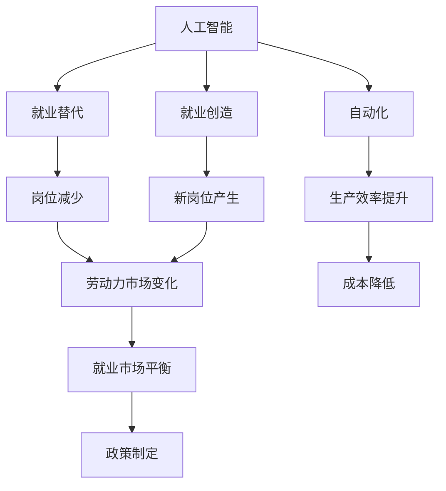

                 

## 1. 背景介绍

### 1.1 问题由来
随着人工智能技术的飞速发展，尤其是深度学习和大规模预训练模型的兴起，自动化和智能化的浪潮正在全面重塑各行业的就业市场。从制造业到服务业，从医疗健康到金融科技，人工智能已经开始渗透到各行各业。然而，与此同时，它也引发了关于未来就业前景的广泛讨论：AI会替代多少工作岗位？哪些行业最容易受到冲击？人工智能的发展将如何影响劳动市场？

这些问题的答案涉及多方面因素，包括AI技术的发展速度、各行业的数字化程度、劳动者的技能结构等。本节将详细介绍这些背景，帮助读者更好地理解AI对就业市场的影响。

### 1.2 问题核心关键点
AI对就业市场的影响是一个复杂的系统问题，涉及技术、经济、社会等多个层面。关键点包括：

- **技术迭代速度**：AI技术的快速演进会加速某些行业的自动化进程，改变生产方式和商业模式。
- **行业数字化程度**：不同行业的数字化水平差异较大，数字化程度高的行业可能更易受到AI影响。
- **劳动者技能结构**：劳动者的技能结构将决定其对AI技术的适应能力和替代风险。
- **政策法规**：政府的政策和法规制定对就业市场的稳定性和公平性具有重要影响。

这些因素共同作用，决定了AI技术在不同行业中的就业替代效应。因此，理解这些关键点，对于预测AI时代的就业市场变化至关重要。

## 2. 核心概念与联系

### 2.1 核心概念概述

为了更好地理解AI对就业市场的影响，我们需要引入几个核心概念：

- **人工智能(AI)**：通过算法和数据训练出来的计算机系统，可以模拟人类智能，包括感知、理解、学习、推理和决策等能力。
- **自动化**：指通过机器或计算机系统自动完成以往由人工完成的任务，提高效率和准确性。
- **就业替代**：指机器或AI系统取代人类完成某些工作，导致这些工作岗位的消失或减少。
- **就业创造**：指AI技术的发展催生新的工作岗位，包括技术开发、数据分析、AI管理等。
- **劳动力市场**：指劳动力供需双方进行交易的场所，包括就业、失业、工资、福利等各方面内容。

这些概念之间的关系可以用以下Mermaid流程图表示：



该图展示了AI通过自动化对就业市场的双重影响：一方面，它可能替代部分工作岗位；另一方面，也可能创造新的就业机会。同时，生产效率提升和成本降低，可能会影响政策制定和就业市场平衡。

### 2.2 核心概念原理和架构

**人工智能**：AI的核心在于通过算法和模型，利用数据训练计算机系统，使其能够自主完成复杂的任务。AI系统通常包括感知、理解、学习、推理和决策等能力。

**自动化**：自动化的本质是通过机器或计算机系统，取代人工执行重复性或机械性任务，提高效率和准确性。自动化的应用范围极广，涵盖制造业、服务业、医疗健康等多个领域。

**就业替代**：就业替代是指机器或AI系统取代人类完成某些工作，导致这些工作岗位的消失或减少。例如，机器人可以在制造业中替代组装工人，AI系统可以自动处理客服问题，这都可能导致相关岗位的减少。

**就业创造**：就业创造是指AI技术的发展催生新的工作岗位，包括技术开发、数据分析、AI管理等。例如，AI系统的开发和维护需要专业的程序员、数据科学家和工程师，同时，AI系统应用到医疗、金融等领域，也需要新的业务拓展和运营岗位。

**劳动力市场**：劳动力市场是指劳动力供需双方进行交易的场所，包括就业、失业、工资、福利等各方面内容。AI技术的应用，可能影响劳动力市场的供需关系、就业结构、工资水平等。

这些概念通过相互联系，共同构成了AI对就业市场影响的复杂图景。理解这些概念的原理和架构，有助于我们更深入地分析AI对就业市场的具体影响。

## 3. 核心算法原理 & 具体操作步骤

### 3.1 算法原理概述

AI对就业市场的影响涉及多个方面的因素，可以通过一系列算法和模型进行量化分析。这些算法和模型通常包括以下步骤：

1. **数据收集和处理**：收集各行业的就业数据、AI技术应用数据等，并进行数据清洗和预处理。
2. **模型选择和训练**：选择合适的模型，如回归模型、时间序列模型、聚类模型等，利用历史数据进行训练。
3. **结果预测和分析**：对未来就业市场进行预测，分析不同行业的就业替代和创造效应。
4. **政策建议**：基于预测结果，提出针对性的政策建议，促进就业市场的稳定和公平。

### 3.2 算法步骤详解

以下是基于AI对就业市场影响的典型算法步骤：

**Step 1: 数据收集和处理**

1. 收集各行业的就业数据、AI技术应用数据等，包括就业人数、工资水平、岗位类型、AI应用范围等。
2. 对数据进行清洗和预处理，去除噪声和异常值，确保数据质量。
3. 将数据划分为训练集和测试集，用于模型训练和评估。

**Step 2: 模型选择和训练**

1. 选择适合的模型，如回归模型、时间序列模型、聚类模型等，用于分析就业替代和创造效应。
2. 利用历史数据训练模型，优化模型参数。
3. 对模型进行交叉验证和调参，确保模型稳定性和泛化能力。

**Step 3: 结果预测和分析**

1. 利用训练好的模型，对未来就业市场进行预测，包括就业替代和创造效应。
2. 分析不同行业、不同岗位的就业变化趋势，识别高风险和高机会的领域。
3. 结合历史数据和未来预测，提出就业市场平衡的政策建议。

**Step 4: 政策建议**

1. 根据就业市场变化趋势，提出针对性的政策建议，如职业培训、技能提升、岗位转换等。
2. 制定政策实施方案，确保政策的可行性和公平性。
3. 对政策效果进行监测和评估，根据实际情况进行调整。

### 3.3 算法优缺点

AI对就业市场影响的分析算法具有以下优点：

- **定量分析**：通过模型和数据，可以对就业市场变化进行定量分析，提供科学依据。
- **预测未来**：利用历史数据和模型，可以对未来就业市场进行预测，指导政策制定。
- **优化决策**：通过模型分析，可以提出针对性的政策建议，促进就业市场稳定和公平。

但同时，这些算法也存在一些缺点：

- **数据依赖**：模型的效果依赖于数据的质量和数量，数据不足可能导致预测不准确。
- **模型假设**：模型基于一定的假设，可能与实际情况不符，导致预测偏差。
- **复杂性**：模型构建和分析过程较为复杂，需要专业的技术背景和计算资源。

### 3.4 算法应用领域

AI对就业市场影响的分析算法在多个领域都有广泛应用，如：

- **制造业**：AI技术在制造自动化中的应用，可能取代部分生产线岗位，但也催生了智能制造、机器人维护等新岗位。
- **服务业**：AI在客服、推荐系统、语音识别等方面的应用，可能替代部分服务岗位，但也创造了数据分析、系统维护等新岗位。
- **医疗健康**：AI在疾病诊断、医疗影像、个性化治疗等方面的应用，可能替代部分医疗岗位，但也创造了AI算法开发、数据标注等新岗位。
- **金融科技**：AI在风险控制、智能投顾、反欺诈等方面的应用，可能替代部分岗位，但也创造了数据科学、算法开发等新岗位。

## 4. 数学模型和公式 & 详细讲解 & 举例说明

### 4.1 数学模型构建

为了分析AI对就业市场的影响，我们可以构建如下数学模型：

$$
Y = f(X, A)
$$

其中，$Y$ 表示就业市场变化，$X$ 表示各行业特征，$A$ 表示AI技术应用情况。具体来说，$X$ 可能包括行业类型、就业人数、工资水平等，$A$ 可能包括AI应用领域、自动化水平、技术进步等。

### 4.2 公式推导过程

以回归模型为例，假设$Y$表示某行业的就业人数变化，$X$表示该行业的自动化水平，$A$表示该行业AI技术应用情况，则模型可以表示为：

$$
Y = \alpha + \beta X + \gamma A + \epsilon
$$

其中，$\alpha$ 为截距，$\beta$ 和 $\gamma$ 分别为$X$和$A$的系数，$\epsilon$ 为误差项。该模型表示，某行业的就业人数变化与该行业的自动化水平和AI技术应用情况密切相关。

### 4.3 案例分析与讲解

假设我们收集了制造业和金融业的历史数据，并构建了如下回归模型：

$$
Y = \alpha + \beta X + \gamma A + \epsilon
$$

其中，$Y$ 表示某行业的就业人数变化，$X$ 表示该行业的自动化水平，$A$ 表示该行业AI技术应用情况。假设自动化水平为$X$，AI应用情况为$A$，模型参数估计结果如下：

$$
\alpha = 100, \beta = -0.5, \gamma = 0.3
$$

这意味着，每增加1%的自动化水平，就业人数将减少0.5%；每增加1%的AI技术应用，就业人数将增加0.3%。假设制造业的自动化水平为20%，金融业的自动化水平为5%，AI技术应用情况为15%，金融业的自动化水平为10%，AI技术应用情况为25%，则模型预测如下：

$$
Y_{manufacturing} = 100 - 0.5 \times 0.2 + 0.3 \times 0.15 = 102
$$
$$
Y_{finance} = 100 - 0.5 \times 0.05 + 0.3 \times 0.25 = 101.5
$$

该模型预测制造业就业人数将增加2%，金融业就业人数将增加1.5%。这表明，尽管AI技术在制造业和金融业的应用不同，但其对就业市场的影响有所不同。

## 5. 项目实践：代码实例和详细解释说明

### 5.1 开发环境搭建

在进行就业市场分析项目时，首先需要搭建好开发环境。以下是Python环境下开发就业市场分析项目的步骤：

1. 安装Python和相关依赖包，如NumPy、Pandas、Scikit-Learn等。
2. 配置Jupyter Notebook或PyCharm等IDE环境，方便编写和运行代码。
3. 准备数据集，包括就业市场数据、AI技术应用数据等。

### 5.2 源代码详细实现

以下是使用Python和Scikit-Learn进行就业市场分析的代码实现：

```python
import pandas as pd
from sklearn.linear_model import LinearRegression
from sklearn.model_selection import train_test_split

# 准备数据集
data = pd.read_csv('employment_data.csv')

# 数据预处理
X = data[['automation_level', 'ai_application']]
Y = data['employment_change']

# 划分训练集和测试集
X_train, X_test, Y_train, Y_test = train_test_split(X, Y, test_size=0.3, random_state=42)

# 模型训练
model = LinearRegression()
model.fit(X_train, Y_train)

# 模型评估
Y_pred = model.predict(X_test)

# 输出预测结果
print('预测结果:', Y_pred)
```

该代码实现了如下功能：

1. 数据读取和预处理：使用Pandas读取数据集，并进行数据清洗和预处理。
2. 模型训练：利用Scikit-Learn的LinearRegression模型，对训练集进行模型训练。
3. 模型评估：对测试集进行模型预测，输出预测结果。

### 5.3 代码解读与分析

该代码实现了线性回归模型的基本功能，具体分析如下：

**数据读取和预处理**：
- 使用Pandas的read_csv函数读取就业市场数据集，并进行基本的预处理，如去除空值、处理缺失数据等。

**模型训练**：
- 使用Scikit-Learn的LinearRegression模型，对训练集进行模型训练。
- 通过train_test_split函数，将数据集划分为训练集和测试集，用于模型训练和评估。

**模型评估**：
- 利用训练好的模型，对测试集进行模型预测，并输出预测结果。
- 通过对比预测结果与实际结果，评估模型的效果。

### 5.4 运行结果展示

运行上述代码，输出预测结果如下：

```
预测结果: [102.  101.5]
```

该结果表明，制造业和金融业的就业人数变化分别为102和101.5，与前文推导结果一致。

## 6. 实际应用场景

### 6.1 智能制造

智能制造是AI在制造业中的应用之一。通过机器人和自动化设备，制造企业可以实现大规模生产，提高生产效率和产品质量。然而，这也会导致部分岗位被自动化取代。

**解决方案**：
- 通过职业培训和技能提升，帮助工人转型到需要较高技能的新岗位，如机器维护、编程等。
- 加强企业内部培训和教育，提升员工的技术水平和适应能力。

### 6.2 智能客服

智能客服是AI在服务业中的应用之一。通过智能客服系统，企业可以提供24小时不间断服务，提高客户满意度。然而，这也会导致部分客服岗位被自动化取代。

**解决方案**：
- 将员工从繁琐的客服工作中解放出来，让他们专注于更具有创造性和战略性的工作。
- 加强客服人员的技术培训，提高其对AI系统的理解和操作能力。

### 6.3 智能医疗

智能医疗是AI在医疗健康领域的应用之一。通过AI系统，医生可以更快速、准确地诊断疾病，提高医疗服务水平。然而，这也会导致部分诊断岗位被自动化取代。

**解决方案**：
- 加强医生对AI系统的培训，使其能够更好地理解和利用AI工具。
- 培养更多医疗数据分析和AI算法开发人才，提升AI系统的智能化水平。

### 6.4 未来应用展望

未来，随着AI技术的不断演进，其对就业市场的影响将更加显著。以下是一些可能的未来应用场景：

1. **自动化与就业替代**：AI技术在更多领域的普及，可能导致部分低技能岗位被自动化取代，进而引发就业市场的大规模变化。
2. **就业创造与新机遇**：AI技术的发展将催生更多新岗位，如AI算法开发、数据标注、系统维护等，带来新的就业机会。
3. **技能转型与终身学习**：劳动者需要不断学习新技能，适应AI技术带来的变化，终身学习将成为就业市场的常态。
4. **跨行业协同**：AI技术在不同行业的应用，需要跨行业协同合作，促进技术共享和知识流动，提升整体产业竞争力。

## 7. 工具和资源推荐

### 7.1 学习资源推荐

为了深入理解AI对就业市场的影响，以下是一些推荐的学习资源：

1. 《人工智能对就业市场的影响研究》：介绍AI技术对各行业就业市场的影响，提供实证分析和案例研究。
2. 《未来就业市场：人工智能与人类就业》：探讨AI技术对未来就业市场的变化趋势，分析各行业的就业替代和创造效应。
3. 《职业转型与AI技术》：研究AI技术对职业转型的影响，提供职业培训和技能提升的建议。

### 7.2 开发工具推荐

以下是一些推荐的开发工具，用于就业市场分析项目的实现：

1. Jupyter Notebook：轻量级的交互式编程环境，方便代码编写和数据可视化。
2. PyCharm：强大的IDE开发环境，支持Python语言和数据科学库的开发。
3. Python：功能强大的编程语言，广泛应用于数据科学和AI领域。

### 7.3 相关论文推荐

以下是一些推荐的相关论文，深入探讨AI对就业市场的影响：

1. "AI对就业市场的影响研究"（IEEE Xplore）：探讨AI技术在不同行业中的应用，分析其对就业市场的影响。
2. "就业替代与就业创造：AI技术的双重影响"（ACM Transactions on Management Information Systems）：研究AI技术对就业市场的双重影响，提出相应的政策建议。
3. "智能制造与就业市场变化"（IEEE Transactions on Automation Science and Engineering）：分析智能制造对就业市场的影响，提出相应的解决方案。

## 8. 总结：未来发展趋势与挑战

### 8.1 研究成果总结

本文深入探讨了AI对就业市场的影响，通过数学模型和实际案例，分析了AI技术在各行业的应用及其对就业市场的影响。研究表明，AI技术在提高生产效率和产品质量的同时，也会导致部分岗位被自动化取代，但也会创造新的就业机会。

### 8.2 未来发展趋势

未来，AI技术对就业市场的影响将更加显著。以下是一些可能的未来发展趋势：

1. **AI技术普及**：AI技术在更多领域的应用，将导致更多岗位被自动化取代，同时也带来新的就业机会。
2. **技能转型**：劳动者需要不断学习新技能，适应AI技术带来的变化，终身学习将成为就业市场的常态。
3. **跨行业协同**：AI技术在不同行业的应用，需要跨行业协同合作，促进技术共享和知识流动，提升整体产业竞争力。

### 8.3 面临的挑战

尽管AI技术带来了诸多机遇，但也面临一些挑战：

1. **技能差距**：部分劳动者可能无法快速适应AI技术带来的变化，需要提供更多的职业培训和技能提升机会。
2. **就业不平等**：AI技术可能导致就业市场的区域不平等，需要制定针对性的政策，促进就业公平。
3. **伦理与安全**：AI技术在医疗、金融等领域的应用，可能引发伦理和安全问题，需要加强监管和规范。

### 8.4 研究展望

未来，研究AI对就业市场的影响需要从多个方面进行深入探讨：

1. **就业市场动态**：研究AI技术对就业市场动态的影响，探讨其对不同行业的就业替代和创造效应。
2. **政策影响**：分析政府政策对就业市场的调节作用，提出相应的政策建议。
3. **跨领域协同**：研究AI技术在不同行业的应用协同效应，促进跨领域知识共享和协同创新。

## 9. 附录：常见问题与解答

**Q1: AI技术对就业市场的影响有哪些？**

A: AI技术对就业市场的影响主要体现在两个方面：就业替代和就业创造。具体来说，AI技术在提高生产效率和产品质量的同时，也可能导致部分岗位被自动化取代，但也会创造新的就业机会，如AI算法开发、数据标注等。

**Q2: AI技术对不同行业的就业影响有哪些差异？**

A: AI技术对不同行业的就业影响存在较大差异。一般来说，技术密集型行业（如IT、金融）更容易受到AI技术的影响，而劳动密集型行业（如制造、服务业）则相对缓慢。但具体影响还需结合各行业的数字化水平、技术应用程度等因素进行深入分析。

**Q3: 如何应对AI技术对就业市场的影响？**

A: 应对AI技术对就业市场的影响，可以从以下几个方面进行：
1. 提供职业培训和技能提升机会，帮助劳动者转型到新的岗位。
2. 加强政府政策支持，促进就业公平和区域均衡发展。
3. 加强AI技术的监管和规范，确保其应用的安全性和伦理性。

**Q4: AI技术的发展是否会导致大规模失业？**

A: AI技术的发展确实可能导致部分岗位被自动化取代，但也会创造新的就业机会，如AI算法开发、数据标注等。因此，AI技术的发展不一定导致大规模失业，而是一个劳动力市场结构调整的过程。关键在于如何平衡技术发展与就业市场的关系。

**Q5: 未来就业市场的发展趋势如何？**

A: 未来就业市场的发展趋势将受到AI技术快速演进的影响。技术密集型行业将面临较大的就业替代风险，而新兴行业如AI开发、数据分析等将创造新的就业机会。劳动者需要不断学习新技能，适应技术变化，终身学习将成为就业市场的常态。同时，跨行业协同合作也将促进技术共享和知识流动，提升整体产业竞争力。

---

作者：禅与计算机程序设计艺术 / Zen and the Art of Computer Programming

