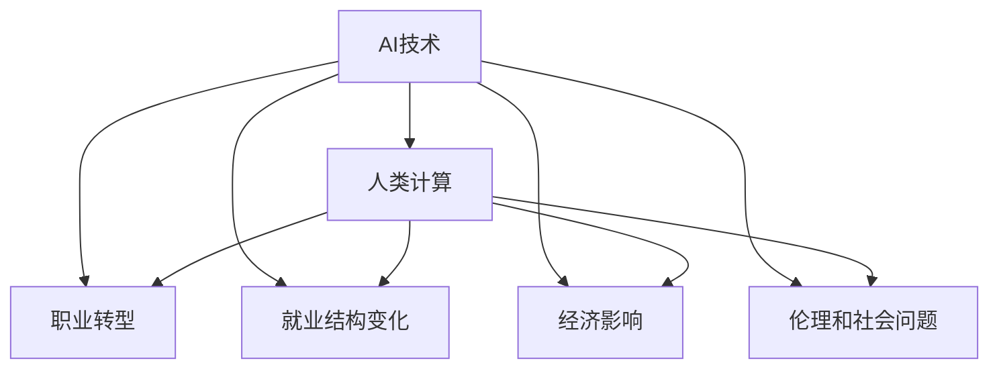

                 

## 1. 背景介绍

### 1.1 问题由来
在人工智能(AI)技术蓬勃发展的背景下，人类计算的未来趋势及其对就业市场的影响已成为学术界和产业界关注的焦点。AI技术的广泛应用，使得许多传统职业面临着前所未有的挑战和变革。如何在AI时代中保持就业市场的稳定和可持续发展，已成为当务之急。

### 1.2 问题核心关键点
人类计算在AI时代的演变主要涉及以下几个核心问题：

- **职业转型**：AI技术的发展可能导致某些职业的消失，同时催生新的职业机会。如何促进职业转型和再培训，使劳动者适应新的就业环境？
- **就业结构变化**：AI技术将改变就业市场的供需结构，使得对高技能劳动力的需求增加，同时对低技能劳动力的需求减少。如何调整教育培训体系，以满足未来就业市场的需求？
- **经济影响**：AI技术的应用可能会改变经济增长模式，提升劳动生产率，但同时也可能加剧收入不平等。如何平衡技术进步与社会福利，确保经济增长惠及全社会？
- **伦理和社会问题**：AI技术的应用可能带来隐私泄露、就业歧视等伦理和社会问题。如何制定相应的政策和规范，确保技术应用的公平性和透明性？

这些核心问题构成了本文的研究框架，旨在通过深入分析AI技术对就业市场的深远影响，为政府、企业和教育机构提供有价值的参考。

## 2. 核心概念与联系

### 2.1 核心概念概述

为更好地理解AI时代下人类计算的演变，本节将介绍几个关键概念：

- **AI技术**：以机器学习和深度学习为代表的人工智能技术，能够处理大规模数据，并从中提取规律和知识。
- **人类计算**：涉及人的智力、技能和经验，通过计算完成各种任务。在AI时代，人类计算与机器计算紧密结合，共同完成复杂任务。
- **职业转型**：由于AI技术的发展，部分传统职业可能被取代，劳动者需要重新学习新技能，适应新的工作环境。
- **就业结构变化**：AI技术的应用将改变劳动力市场的需求结构，导致不同技能层次的劳动市场供需关系发生变化。
- **经济影响**：AI技术的广泛应用可能会改变经济增长模式，提高生产效率，但同时也可能加剧收入不平等。
- **伦理和社会问题**：AI技术的应用可能带来隐私泄露、就业歧视等伦理和社会问题。

这些概念之间的逻辑关系可以通过以下Mermaid流程图来展示：



这个流程图展示了几大核心概念之间的内在联系：

1. AI技术推动人类计算的发展。
2. 职业转型与就业结构变化互为因果，共同影响就业市场。
3. AI技术的应用直接影响经济增长模式。
4. 伦理和社会问题伴随着AI技术的应用和普及。

这些概念共同构成了AI时代下人类计算的演进图景，有助于理解AI技术的广泛影响。

## 3. 核心算法原理 & 具体操作步骤

### 3.1 算法原理概述

AI技术在人类计算中的应用主要基于监督学习、强化学习、生成对抗网络等算法原理。通过这些算法，AI系统能够自动处理大量数据，并从中提取规律和知识，辅助人类完成复杂任务。

- **监督学习**：通过有标签的数据集，训练模型以预测新数据。监督学习适用于分类、回归等任务。
- **强化学习**：通过与环境的互动，优化决策策略以最大化奖励。强化学习适用于游戏、机器人控制等任务。
- **生成对抗网络**：通过两个对抗的神经网络，生成逼真的数据样本。生成对抗网络适用于数据增强、图像生成等任务。

### 3.2 算法步骤详解

AI技术在人类计算中的应用通常包括以下几个关键步骤：

**Step 1: 数据准备**
- 收集和清洗与任务相关的数据集。
- 将数据集划分为训练集、验证集和测试集。

**Step 2: 模型选择与训练**
- 根据任务类型选择合适的算法模型。
- 在训练集上使用优化算法对模型进行训练。

**Step 3: 模型评估与优化**
- 在验证集上评估模型的性能。
- 根据评估结果调整模型参数和训练策略。

**Step 4: 部署与集成**
- 将训练好的模型部署到实际应用场景中。
- 与现有系统集成，实现功能增强。

**Step 5: 监控与反馈**
- 在生产环境中持续监控模型性能。
- 根据反馈信息调整模型参数，持续优化模型表现。

### 3.3 算法优缺点

AI技术在人类计算中的应用具有以下优点：

- **高效性**：AI技术能够处理海量数据，提供高效的计算和决策支持。
- **普适性**：AI技术可以应用于各种行业和任务，推动跨领域的技术创新。
- **可扩展性**：AI技术的算法和模型可以灵活扩展，适应不同规模和复杂度的任务。

同时，AI技术也存在一些局限性：

- **可解释性不足**：许多AI模型如深度学习，缺乏可解释性，难以理解其内部工作机制。
- **依赖高质量数据**：AI模型的效果很大程度上依赖于输入数据的质量和多样性。
- **资源消耗大**：AI技术需要大量计算资源和数据存储，可能带来成本压力。
- **伦理和法律问题**：AI技术的应用可能涉及隐私保护、知识产权等法律和伦理问题。

### 3.4 算法应用领域

AI技术在人类计算中的应用广泛，涵盖了以下几个主要领域：

- **医疗**：AI技术可以辅助诊断、治疗方案制定、药物研发等，提升医疗服务的效率和准确性。
- **金融**：AI技术可以用于风险评估、欺诈检测、投资决策等，提升金融服务的智能水平。
- **制造业**：AI技术可以用于预测维护、质量控制、供应链管理等，优化生产流程，降低成本。
- **交通**：AI技术可以用于交通流量预测、自动驾驶、智能交通管理等，提升交通安全和效率。
- **教育**：AI技术可以用于个性化学习、智能评估、课程设计等，提升教育质量和公平性。

这些应用领域展示了AI技术的强大潜力和广泛应用，对未来的社会和经济发展具有深远影响。

## 4. 数学模型和公式 & 详细讲解 & 举例说明

### 4.1 数学模型构建

本文将通过数学模型来深入分析AI技术在人类计算中的应用。

假设我们有一个分类任务，目标是识别输入数据 $x$ 属于哪个类别 $y \in \{1,2,\ldots,k\}$。使用监督学习中的逻辑回归模型，构建如下数学模型：

$$
\hat{y} = \sigma(\beta_0 + \beta_1x_1 + \ldots + \beta_px_p)
$$

其中，$\sigma$ 为逻辑函数，$\beta_0,\beta_1,\ldots,\beta_p$ 为模型参数，$x_1,\ldots,x_p$ 为输入特征。

### 4.2 公式推导过程

对上述模型进行最小化损失函数 $L$ 的梯度下降优化：

$$
L(\beta_0,\beta_1,\ldots,\beta_p) = -\frac{1}{N}\sum_{i=1}^N [y_i\log \hat{y_i} + (1-y_i)\log (1-\hat{y_i})]
$$

求解最优参数 $\beta_0,\beta_1,\ldots,\beta_p$：

$$
\frac{\partial L}{\partial \beta_j} = -\frac{1}{N}\sum_{i=1}^N [y_i(\hat{y_i}-1)x_j - (1-y_i)\hat{y_i}x_j]
$$

使用梯度下降算法更新参数：

$$
\beta_j \leftarrow \beta_j - \eta\frac{\partial L}{\partial \beta_j}
$$

其中 $\eta$ 为学习率，为避免梯度爆炸，通常设置较小的学习率。

### 4.3 案例分析与讲解

假设我们有一个文本分类任务，使用预训练的BERT模型进行微调。首先将文本 $x$ 输入BERT模型，得到嵌入表示 $\vec{x}$，然后将其输入到逻辑回归模型，输出预测类别 $\hat{y}$。

对于单个样本 $(x,y)$，其损失函数为：

$$
L(x,y) = -[y\log \hat{y} + (1-y)\log (1-\hat{y})]
$$

在训练集上使用梯度下降算法更新模型参数：

$$
\theta \leftarrow \theta - \eta\nabla_{\theta}L(\theta)
$$

其中 $\theta$ 为模型参数，$\eta$ 为学习率。

## 5. 项目实践：代码实例和详细解释说明

### 5.1 开发环境搭建

在进行AI项目实践前，我们需要准备好开发环境。以下是使用Python进行TensorFlow开发的环境配置流程：

1. 安装Anaconda：从官网下载并安装Anaconda，用于创建独立的Python环境。

2. 创建并激活虚拟环境：
```bash
conda create -n tf-env python=3.8 
conda activate tf-env
```

3. 安装TensorFlow：根据CUDA版本，从官网获取对应的安装命令。例如：
```bash
conda install tensorflow tensorflow-gpu -c tf -c conda-forge
```

4. 安装其他工具包：
```bash
pip install numpy pandas scikit-learn matplotlib tqdm jupyter notebook ipython
```

完成上述步骤后，即可在`tf-env`环境中开始AI项目实践。

### 5.2 源代码详细实现

下面我们以文本分类任务为例，给出使用TensorFlow对BERT模型进行微调的代码实现。

首先，定义文本分类的模型：

```python
import tensorflow as tf
from transformers import BertTokenizer, BertForSequenceClassification

tokenizer = BertTokenizer.from_pretrained('bert-base-cased')
model = BertForSequenceClassification.from_pretrained('bert-base-cased', num_labels=2)

# 定义损失函数
loss = tf.keras.losses.SparseCategoricalCrossentropy(from_logits=True)

# 定义优化器
optimizer = tf.keras.optimizers.AdamW(learning_rate=2e-5)

# 定义评估指标
accuracy = tf.keras.metrics.SparseCategoricalAccuracy('accuracy')

# 定义模型
@tf.function
def train_step(inputs, labels):
    with tf.GradientTape() as tape:
        outputs = model(inputs, training=True)
        loss_value = loss(labels, outputs)

    gradients = tape.gradient(loss_value, model.trainable_variables)
    optimizer.apply_gradients(zip(gradients, model.trainable_variables))

    accuracy_value = accuracy(labels, outputs)

    return loss_value, accuracy_value
```

然后，定义训练和评估函数：

```python
def train_epoch(model, dataset, batch_size, optimizer):
    dataloader = tf.data.Dataset.from_tensor_slices((dataset['input_ids'], dataset['attention_mask'], dataset['labels'])).batch(batch_size)
    for batch in dataloader:
        inputs, attention_mask, labels = batch
        loss_value, accuracy_value = train_step(inputs, labels)
        tf.print('Epoch: {}, Loss: {}, Accuracy: {}'.format(epoch+1, loss_value.numpy(), accuracy_value.numpy()))

def evaluate(model, dataset, batch_size):
    dataloader = tf.data.Dataset.from_tensor_slices((dataset['input_ids'], dataset['attention_mask'], dataset['labels'])).batch(batch_size)
    for batch in dataloader:
        inputs, attention_mask, labels = batch
        loss_value, accuracy_value = train_step(inputs, labels)
        tf.print('Epoch: {}, Loss: {}, Accuracy: {}'.format(epoch+1, loss_value.numpy(), accuracy_value.numpy()))
```

最后，启动训练流程并在测试集上评估：

```python
epochs = 5
batch_size = 16

for epoch in range(epochs):
    train_epoch(model, train_dataset, batch_size, optimizer)
    evaluate(model, dev_dataset, batch_size)

print('Test results:')
evaluate(model, test_dataset, batch_size)
```

以上就是使用TensorFlow对BERT进行文本分类任务微调的完整代码实现。可以看到，TensorFlow与Transformers库的结合，使得模型微调的代码实现变得简洁高效。

### 5.3 代码解读与分析

让我们再详细解读一下关键代码的实现细节：

**模型定义**：
- `BertForSequenceClassification`：用于序列分类任务的BERT模型。
- `BertTokenizer`：用于分词和编码的BERT分词器。
- `loss`：交叉熵损失函数。
- `optimizer`：AdamW优化器。
- `accuracy`：准确率评估指标。
- `train_step`：定义单步训练过程，使用TensorFlow计算图优化。

**训练和评估函数**：
- `train_epoch`：在训练集上迭代训练模型，打印每个epoch的损失和准确率。
- `evaluate`：在验证集上评估模型性能，打印每个epoch的损失和准确率。

**训练流程**：
- 定义总的epoch数和batch size，开始循环迭代
- 每个epoch内，在训练集上训练模型，输出每个epoch的损失和准确率
- 在验证集上评估，输出每个epoch的损失和准确率
- 所有epoch结束后，在测试集上评估，给出最终测试结果

可以看到，TensorFlow与Transformers库的结合，使得模型微调的代码实现变得简洁高效。开发者可以将更多精力放在数据处理、模型改进等高层逻辑上，而不必过多关注底层的实现细节。

当然，工业级的系统实现还需考虑更多因素，如模型的保存和部署、超参数的自动搜索、更灵活的任务适配层等。但核心的微调范式基本与此类似。

## 6. 实际应用场景

### 6.1 医疗诊断

AI技术在医疗领域的应用已经初见成效。通过深度学习模型，AI可以辅助医生进行疾病诊断、治疗方案制定、药物研发等工作，显著提升医疗服务的效率和准确性。

以病理图像分析为例，AI模型能够自动识别病理切片中的病变区域，快速生成病理报告，辅助医生诊断。同时，AI技术还可以预测患者的疾病风险，提供个性化的治疗方案，优化医疗资源分配。

### 6.2 金融风控

AI技术在金融领域的应用也逐步深入。通过数据分析和机器学习模型，AI可以用于风险评估、欺诈检测、投资决策等，提升金融服务的智能水平。

例如，银行可以利用AI模型进行贷款审批，自动评估借款人的信用风险，降低不良贷款率。保险公司则可以通过AI技术预测客户理赔概率，优化理赔流程，提升客户满意度。

### 6.3 智能制造

AI技术在制造业中的应用主要集中在智能制造、预测维护、质量控制等方面。通过数据分析和机器学习模型，AI可以优化生产流程，提升生产效率，降低成本。

例如，工厂可以利用AI模型进行设备预测维护，提前发现设备故障，减少停机时间。同时，AI技术还可以用于质量控制，实时检测产品缺陷，提高产品质量和生产效率。

### 6.4 智能交通

AI技术在交通领域的应用主要集中在自动驾驶、交通流量预测、智能交通管理等方面。通过数据分析和机器学习模型，AI可以提升交通安全和效率，减少交通拥堵。

例如，自动驾驶车辆可以利用AI技术实现自动驾驶，提升行驶安全和效率。交通管理系统则可以通过AI技术预测交通流量，优化交通信号，缓解交通拥堵。

### 6.5 智能教育

AI技术在教育领域的应用主要集中在个性化学习、智能评估、课程设计等方面。通过数据分析和机器学习模型，AI可以提升教育质量和公平性，促进教育公平。

例如，AI系统可以根据学生的学习行为和成绩，推荐个性化的学习资源和课程，提高学习效率。同时，AI技术还可以用于智能评估，自动批改作业，提供及时反馈，提升教学质量。

## 7. 工具和资源推荐

### 7.1 学习资源推荐

为了帮助开发者系统掌握AI技术在人类计算中的应用，这里推荐一些优质的学习资源：

1. 《深度学习》系列书籍：由多位知名学者和从业者合著，全面介绍深度学习的基础知识和应用场景。
2. 《Python深度学习》课程：由Udacity开设的深度学习入门课程，涵盖深度学习的基本概念和编程技巧。
3. TensorFlow官方文档：TensorFlow的官方文档，包含大量教程和示例，是学习TensorFlow的必备资料。
4. PyTorch官方文档：PyTorch的官方文档，提供详细的API文档和示例代码。
5. Coursera深度学习课程：由斯坦福大学和深度学习领域多位知名学者开设，涵盖深度学习的理论和实践。

通过对这些资源的学习实践，相信你一定能够快速掌握AI技术在人类计算中的应用，并用于解决实际的NLP问题。

### 7.2 开发工具推荐

高效的开发离不开优秀的工具支持。以下是几款用于AI项目开发的常用工具：

1. TensorFlow：由Google主导开发的深度学习框架，支持多种计算图和分布式训练，适合大规模工程应用。
2. PyTorch：由Facebook主导开发的深度学习框架，灵活易用，适合快速迭代研究。
3. Keras：高级神经网络API，基于TensorFlow和Theano等后端，支持快速搭建和训练模型。
4. Weights & Biases：模型训练的实验跟踪工具，可以记录和可视化模型训练过程中的各项指标，方便对比和调优。
5. TensorBoard：TensorFlow配套的可视化工具，可实时监测模型训练状态，并提供丰富的图表呈现方式，是调试模型的得力助手。

合理利用这些工具，可以显著提升AI项目开发效率，加快创新迭代的步伐。

### 7.3 相关论文推荐

AI技术在人类计算中的应用源于学界的持续研究。以下是几篇奠基性的相关论文，推荐阅读：

1. AlphaGo Zero：通过强化学习技术，谷歌DeepMind开发的围棋AI程序，实现自我学习，达到人类顶尖水平。
2. Transformer：提出Transformer结构，谷歌DeepMind开发的NLP领域预训练大模型，开启了NLP领域的预训练大模型时代。
3. Generative Adversarial Networks（GANs）：提出生成对抗网络，Goodfellow等人提出的用于生成逼真图像和数据的深度学习模型。
4. DeepMind AlphaFold：通过深度学习技术，DeepMind开发的蛋白质折叠预测模型，在蛋白质结构预测领域取得突破性进展。
5. OpenAI Codex：由OpenAI开发的用于代码生成的预训练大模型，能够生成高质量的代码和解释，推动编程自动化。

这些论文代表了大规模深度学习技术的发展脉络。通过学习这些前沿成果，可以帮助研究者把握学科前进方向，激发更多的创新灵感。

## 8. 总结：未来发展趋势与挑战

### 8.1 总结

本文对AI技术在人类计算中的应用进行了全面系统的介绍。首先阐述了AI技术在各领域的应用，明确了其在提高生产力、提升服务质量等方面的独特价值。其次，从原理到实践，详细讲解了AI技术的核心算法和操作步骤，给出了AI项目开发的完整代码实例。同时，本文还广泛探讨了AI技术在医疗、金融、制造、交通、教育等多个行业领域的应用前景，展示了AI技术的强大潜力和广泛应用。

通过本文的系统梳理，可以看到，AI技术在人类计算中的应用前景广阔，正逐步改变各行各业的运营模式和生产方式。未来，伴随AI技术的持续演进，其在各领域的广泛应用将进一步推动经济社会的发展和进步。

### 8.2 未来发展趋势

展望未来，AI技术在人类计算中的应用将呈现以下几个发展趋势：

1. 技术普及加速：随着AI技术的日益成熟，AI技术的应用将越来越普及，逐步渗透到各个行业和领域。
2. 人机协同增强：AI技术的发展将进一步增强人机协同，使得人类与机器共同完成复杂任务，提升工作效率和质量。
3. 跨领域融合深化：AI技术将在更多领域进行融合应用，实现跨领域的技术创新和产业升级。
4. 伦理和社会问题关注：随着AI技术的应用越来越广泛，伦理和社会问题将越来越受到关注，相关法律法规和伦理规范将不断完善。
5. 技术标准化和规范化：AI技术的应用将逐步走向标准化和规范化，提高技术的可解释性和可控性。

这些趋势凸显了AI技术在人类计算中的重要地位，将进一步推动经济社会的发展和进步。

### 8.3 面临的挑战

尽管AI技术在人类计算中的应用取得了显著成就，但在迈向更加智能化、普适化应用的过程中，它仍面临着诸多挑战：

1. 技术成熟度不足：AI技术在处理复杂任务和处理不确定性方面仍存在局限，需要进一步提高技术成熟度。
2. 伦理和社会问题：AI技术的应用可能带来隐私泄露、就业歧视等伦理和社会问题，需要制定相应的政策和规范。
3. 资源消耗大：AI技术的应用需要大量计算资源和数据存储，可能带来成本压力。
4. 技术普及难度：AI技术的应用需要相应的技术储备和基础设施，普及难度较大。

### 8.4 研究展望

面对AI技术在人类计算中的应用面临的挑战，未来的研究需要在以下几个方面寻求新的突破：

1. 提高技术成熟度：进一步提升AI技术的算法和模型精度，提高处理复杂任务和不确定性的能力。
2. 解决伦理和社会问题：制定相应的政策和规范，确保AI技术的公平性、透明性和可解释性。
3. 降低资源消耗：采用更高效的数据存储和计算技术，降低AI技术的应用成本。
4. 促进技术普及：通过开源社区和学术界共同努力，降低AI技术的普及难度，推动技术普惠。

这些研究方向的探索，必将引领AI技术在人类计算中的应用迈向更高的台阶，为构建安全、可靠、可解释、可控的智能系统铺平道路。面向未来，AI技术需要在保持技术领先的同时，更加注重伦理和社会问题，推动技术公平和普惠。

## 9. 附录：常见问题与解答

**Q1：AI技术在各领域的应用前景如何？**

A: AI技术在各领域的应用前景广阔，涵盖了医疗、金融、制造业、交通、教育等多个行业。AI技术通过自动化、智能化手段，提升各行业的生产效率和服务质量，推动产业升级和创新。

**Q2：AI技术在应用过程中需要注意哪些问题？**

A: AI技术在应用过程中需要注意以下几个问题：
1. 技术成熟度：AI技术在处理复杂任务和处理不确定性方面仍存在局限，需要进一步提高技术成熟度。
2. 伦理和社会问题：AI技术的应用可能带来隐私泄露、就业歧视等伦理和社会问题，需要制定相应的政策和规范。
3. 资源消耗：AI技术的应用需要大量计算资源和数据存储，可能带来成本压力。
4. 技术普及难度：AI技术的应用需要相应的技术储备和基础设施，普及难度较大。

**Q3：如何应对AI技术在各领域的应用挑战？**

A: 应对AI技术在各领域的应用挑战，需要从以下几个方面进行努力：
1. 提高技术成熟度：进一步提升AI技术的算法和模型精度，提高处理复杂任务和不确定性的能力。
2. 解决伦理和社会问题：制定相应的政策和规范，确保AI技术的公平性、透明性和可解释性。
3. 降低资源消耗：采用更高效的数据存储和计算技术，降低AI技术的应用成本。
4. 促进技术普及：通过开源社区和学术界共同努力，降低AI技术的普及难度，推动技术普惠。

这些努力将有助于解决AI技术在各领域的应用挑战，推动AI技术在人类计算中的广泛应用。

---

作者：禅与计算机程序设计艺术 / Zen and the Art of Computer Programming

