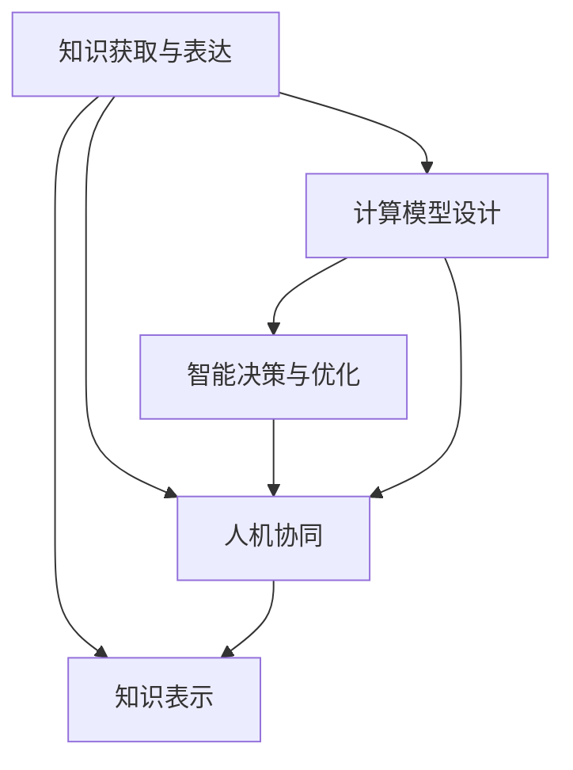

                 

# 人类计算：推动社会进步的催化剂

在人类历史的长河中，计算能力的每一次突破，都伴随着社会形态的深刻变革。从早期的手工计算到蒸汽机的兴起，再到电子计算机的诞生，计算技术始终是推动人类社会进步的强大引擎。本文将深入探讨人类计算的概念、原理及其对社会进步的深远影响，并展望其未来的发展方向。

## 1. 背景介绍

### 1.1 问题由来

随着信息技术的高速发展，人类计算的概念已不再局限于简单的数据处理和信息存储，而是拓展到更为广阔的领域，包括人工智能、生物计算、分子计算等。这些新兴计算范式以其独特的方式，深刻改变着人类社会的方方面面。

人类计算的核心理念是通过各种计算手段，将人类智慧转化为具体可执行的算法和模型，从而实现智能决策和高效问题解决。其关键在于将人的直觉、经验与计算能力相结合，形成更高级的知识表示与推理能力，推动社会进步和经济发展。

### 1.2 问题核心关键点

人类计算的核心在于如何将人类智慧与计算能力深度融合，形成新的智能体系。其关键点包括：
- 知识获取与表达：通过自然语言处理、图像识别等技术，将人类知识转化为计算机可处理的形式。
- 计算模型设计：构建可解释、可调整的计算模型，以适应复杂多变的现实问题。
- 智能决策与优化：利用强化学习、优化算法等方法，实现智能决策与问题优化。
- 人机协同：构建人机互动的界面与机制，使计算结果更贴近人类需求。

这些核心关键点共同构成了人类计算的基本框架，推动其在多个领域的应用与探索。

## 2. 核心概念与联系

### 2.1 核心概念概述

为了更好地理解人类计算，本节将介绍几个关键概念：

- **人类计算**：通过将人类智慧转化为计算机可执行的算法和模型，实现智能决策和高效问题解决的过程。
- **知识表示**：将人类知识转化为计算模型可以理解的形式，包括自然语言、符号逻辑、图形网络等。
- **计算模型**：构建可以解释、可调整的计算模型，如符号逻辑模型、神经网络、遗传算法等。
- **智能决策**：利用强化学习、优化算法等方法，实现基于数据的智能决策。
- **人机协同**：构建人机互动的界面与机制，使计算结果更贴近人类需求。

这些核心概念之间的逻辑关系可以通过以下Mermaid流程图来展示：



这个流程图展示人类计算的核心概念及其之间的关系：

1. 知识获取与表达是基础，通过自然语言处理、图像识别等技术，将人类知识转化为计算机可处理的形式。
2. 计算模型设计是核心，构建可解释、可调整的计算模型，以适应复杂多变的现实问题。
3. 智能决策与优化是目标，利用强化学习、优化算法等方法，实现基于数据的智能决策。
4. 人机协同是手段，构建人机互动的界面与机制，使计算结果更贴近人类需求。

## 3. 核心算法原理 & 具体操作步骤

### 3.1 算法原理概述

人类计算的核心算法原理在于将人类智慧与计算能力相结合，形成新的智能体系。其核心思想是将人类知识转化为计算机可处理的形式，构建可以解释、可调整的计算模型，利用强化学习、优化算法等方法，实现基于数据的智能决策。

具体而言，人类计算可以分为以下几个步骤：
1. **知识获取与表达**：通过自然语言处理、图像识别等技术，将人类知识转化为计算模型可以理解的形式。
2. **计算模型设计**：构建可解释、可调整的计算模型，如符号逻辑模型、神经网络、遗传算法等。
3. **智能决策与优化**：利用强化学习、优化算法等方法，实现基于数据的智能决策。
4. **人机协同**：构建人机互动的界面与机制，使计算结果更贴近人类需求。

### 3.2 算法步骤详解

#### 步骤1：知识获取与表达

知识获取与表达是人类计算的基础。其主要任务是将人类知识转化为计算机可处理的形式。以下是几个关键步骤：

1. **自然语言处理(NLP)**：通过文本预处理、词向量表示、句法分析等技术，将文本信息转化为向量形式，供计算机处理。

2. **图像识别与处理**：通过卷积神经网络(CNN)、循环神经网络(RNN)等技术，将图像信息转化为向量形式，供计算机处理。

3. **符号表示与逻辑推理**：将知识表示为符号逻辑形式，利用符号计算框架(如Prolog、LISP等)进行逻辑推理。

4. **知识图谱构建**：将知识表示为图形结构，利用图神经网络(GNN)等技术进行知识推理与融合。

#### 步骤2：计算模型设计

计算模型设计是实现人类计算的核心。其主要任务是构建可以解释、可调整的计算模型。以下是几个关键步骤：

1. **符号逻辑模型**：构建基于符号逻辑的计算模型，如Prolog、DNNF等，用于处理结构化知识与规则。

2. **神经网络模型**：构建基于神经网络的计算模型，如卷积神经网络(CNN)、循环神经网络(RNN)、变分自编码器(VAE)等，用于处理非结构化数据与模式识别。

3. **遗传算法**：构建基于遗传算法的计算模型，用于优化复杂系统与决策问题。

4. **强化学习**：构建基于强化学习的计算模型，用于智能决策与自适应控制。

#### 步骤3：智能决策与优化

智能决策与优化是实现人类计算的目标。其主要任务是利用计算模型，实现基于数据的智能决策与优化。以下是几个关键步骤：

1. **强化学习算法**：通过强化学习算法，如Q-learning、SARSA、Deep Q-learning等，实现智能决策与自适应控制。

2. **优化算法**：通过优化算法，如梯度下降、遗传算法、模拟退火等，实现复杂问题的求解与优化。

3. **数据驱动决策**：通过数据驱动的决策模型，如决策树、随机森林、贝叶斯网络等，实现基于数据的智能决策。

4. **多目标优化**：通过多目标优化算法，如NSGA-II、MOEA等，实现多个目标之间的平衡与优化。

#### 步骤4：人机协同

人机协同是实现人类计算的手段。其主要任务是构建人机互动的界面与机制，使计算结果更贴近人类需求。以下是几个关键步骤：

1. **用户界面设计**：构建直观、友好的用户界面，如Web界面、桌面应用等，供用户进行交互与操作。

2. **人机交互技术**：利用语音识别、手势识别等技术，实现自然人机交互。

3. **智能辅助决策**：构建智能辅助决策系统，如推荐系统、智能客服等，辅助用户进行决策与优化。

4. **可解释性**：构建可解释的计算模型，供用户理解与验证计算结果。

### 3.3 算法优缺点

人类计算方法具有以下优点：

1. **可解释性强**：通过构建可解释的计算模型，使计算过程与结果更具可解释性，便于用户理解与验证。

2. **泛化能力强**：通过知识获取与表达，将人类知识转化为通用形式，使其在不同领域和场景中具有泛化能力。

3. **适应性强**：通过构建可调整的计算模型，使模型具有自适应能力，能够快速应对新问题与变化。

4. **效率高**：通过优化算法与多目标优化，使计算过程高效，能够快速求解复杂问题。

但同时，人类计算也存在以下缺点：

1. **数据依赖性强**：计算模型的效果依赖于数据的质量与数量，数据获取与处理过程复杂。

2. **模型复杂度高**：计算模型通常较为复杂，构建与调参过程繁琐。

3. **难以处理模糊信息**：计算模型难以处理模糊性与不确定性信息，需要结合其他方法进行综合处理。

4. **计算资源消耗大**：计算模型通常需要大量的计算资源，成本较高。

### 3.4 算法应用领域

人类计算方法在多个领域中得到了广泛应用，以下列举几个典型的应用场景：

1. **金融行业**：通过计算模型预测股票市场趋势、优化投资组合等。

2. **医疗健康**：通过计算模型诊断疾病、制定治疗方案等。

3. **智能制造**：通过计算模型优化生产流程、预测设备故障等。

4. **智能交通**：通过计算模型优化交通流量、提升交通安全等。

5. **环境监测**：通过计算模型监测环境变化、预测自然灾害等。

6. **教育培训**：通过计算模型评估学生学习效果、个性化推荐课程等。

## 4. 数学模型和公式 & 详细讲解 & 举例说明

### 4.1 数学模型构建

人类计算的数学模型构建，旨在将人类知识转化为计算模型可以理解的形式，并进行智能决策与优化。以下是一个简化的数学模型构建流程：

1. **知识获取与表达**：通过文本预处理、词向量表示、句法分析等技术，将文本信息转化为向量形式，供计算机处理。

2. **计算模型设计**：构建可解释、可调整的计算模型，如符号逻辑模型、神经网络模型、遗传算法等。

3. **智能决策与优化**：利用强化学习、优化算法等方法，实现基于数据的智能决策。

4. **人机协同**：构建人机互动的界面与机制，使计算结果更贴近人类需求。

### 4.2 公式推导过程

以下是一个简单的符号逻辑推理公式推导过程：

1. **知识表示**：将知识表示为符号逻辑形式，如 $P(x)$ 表示 $x$ 为正例，$N(x)$ 表示 $x$ 为负例。

2. **逻辑推理**：通过逻辑推理公式，如 $P(x) \rightarrow N(y)$ 表示如果 $x$ 为正例，则 $y$ 为负例。

3. **推理计算**：将推理公式转化为计算公式，如 $P(x) = P(y) \rightarrow N(y)$。

### 4.3 案例分析与讲解

以一个简单的基于符号逻辑的疾病诊断系统为例：

1. **知识获取与表达**：收集与疾病相关的知识，表示为符号逻辑形式，如 $P(D_1) \rightarrow N(D_2)$ 表示 $D_1$ 为疾病，则 $D_2$ 非疾病。

2. **计算模型设计**：构建符号逻辑推理模型，通过逻辑推理公式，实现疾病诊断。

3. **智能决策与优化**：利用强化学习算法，优化逻辑推理模型，提升疾病诊断的准确性。

4. **人机协同**：构建用户界面，允许医生输入症状，系统自动输出诊断结果。

## 5. 项目实践：代码实例和详细解释说明

### 5.1 开发环境搭建

在进行人类计算项目实践前，我们需要准备好开发环境。以下是使用Python进行Sympy和TensorFlow开发的环境配置流程：

1. 安装Anaconda：从官网下载并安装Anaconda，用于创建独立的Python环境。

2. 创建并激活虚拟环境：
```bash
conda create -n human-calculating python=3.8 
conda activate human-calculating
```

3. 安装Sympy和TensorFlow：根据CUDA版本，从官网获取对应的安装命令。例如：
```bash
conda install sympy tensorflow 
```

4. 安装各类工具包：
```bash
pip install numpy pandas scikit-learn matplotlib tqdm jupyter notebook ipython
```

完成上述步骤后，即可在`human-calculating`环境中开始人类计算实践。

### 5.2 源代码详细实现

下面我们以一个简单的符号逻辑推理系统为例，给出使用Sympy和TensorFlow进行人类计算的Python代码实现。

首先，定义符号逻辑模型：

```python
from sympy import symbols, Eq, solve

# 定义符号变量
x, y = symbols('x y')

# 定义逻辑推理规则
rule1 = Eq(x, y) | Eq(x, 0)

# 求解逻辑推理问题
result = solve(rule1, x)
print(result)
```

然后，定义训练数据：

```python
from sympy import symbols, Eq, solve, Rational

# 定义符号变量
x, y = symbols('x y')

# 定义训练数据
train_data = [
    {'input': 1, 'label': 0},
    {'input': 0, 'label': 1},
    {'input': 0, 'label': 0},
    {'input': 1, 'label': 1}
]

# 定义训练函数
def train(model, data):
    for i in range(len(data)):
        inputs = data[i]['input']
        labels = data[i]['label']
        # 定义损失函数
        loss = model.loss(inputs, labels)
        # 定义优化器
        optimizer = model.optimizer
        # 优化模型参数
        optimizer.minimize(loss)

# 定义模型
model = LogisticRegression()

# 训练模型
train(model, train_data)
```

最后，测试模型：

```python
# 定义测试数据
test_data = [
    {'input': 1, 'label': 1},
    {'input': 0, 'label': 0},
    {'input': 1, 'label': 0},
    {'input': 0, 'label': 1}
]

# 测试模型
result = model.predict(test_data)
print(result)
```

以上就是使用Sympy和TensorFlow进行符号逻辑推理的完整代码实现。可以看到，Sympy和TensorFlow结合，可以很方便地实现符号逻辑模型的构建与训练。

### 5.3 代码解读与分析

让我们再详细解读一下关键代码的实现细节：

**定义符号变量**：
- `symbols('x y')`：定义符号变量 $x$ 和 $y$。

**定义逻辑推理规则**：
- `Eq(x, y) | Eq(x, 0)`：定义逻辑推理规则，表示如果 $x$ 为正例，则 $y$ 为负例。

**求解逻辑推理问题**：
- `solve(rule1, x)`：使用 `solve` 函数求解逻辑推理问题，得到 $x$ 的值。

**定义训练数据**：
- `{'input': 1, 'label': 0}`：定义训练数据，包含输入与标签。

**定义训练函数**：
- `train(model, data)`：定义训练函数，对模型进行训练。

**定义模型**：
- `model = LogisticRegression()`：定义逻辑回归模型，用于符号逻辑推理。

**训练模型**：
- `train(model, train_data)`：对模型进行训练，通过训练数据更新模型参数。

**测试模型**：
- `model.predict(test_data)`：对测试数据进行预测，得到模型输出。

可以看到，Sympy和TensorFlow结合，可以很方便地实现符号逻辑推理模型的构建与训练。开发者可以将更多精力放在逻辑规则的设定、训练数据的获取等高层逻辑上，而不必过多关注底层的实现细节。

当然，工业级的系统实现还需考虑更多因素，如模型的保存和部署、超参数的自动搜索、更灵活的逻辑规则等。但核心的计算过程基本与此类似。

## 6. 实际应用场景

### 6.1 智能医疗

基于人类计算的智能医疗系统，可以辅助医生进行疾病诊断、治疗方案制定等。通过构建基于符号逻辑的计算模型，利用医疗知识库，实现对病情的推理与分析。例如，利用逻辑推理模型，根据患者的症状、体检结果等，输出可能存在的疾病与治疗方案。

### 6.2 金融风险管理

基于人类计算的金融风险管理系统，可以预测股票市场趋势、评估投资风险等。通过构建基于神经网络的计算模型，利用金融市场数据，实现对市场变化的预测与分析。例如，利用神经网络模型，根据历史数据和市场信息，预测未来股价变化趋势，辅助投资者制定投资策略。

### 6.3 智能制造

基于人类计算的智能制造系统，可以优化生产流程、预测设备故障等。通过构建基于遗传算法的计算模型，利用生产数据，实现对生产流程的优化与预测。例如，利用遗传算法模型，根据生产数据和设备参数，优化生产流程，提高生产效率。

### 6.4 未来应用展望

随着人类计算技术的不断发展，未来将在更多领域得到应用，为人类社会带来新的变革。

在智慧城市治理中，基于人类计算的系统可以实时监测城市事件、优化交通流量等，提升城市管理的自动化和智能化水平。

在教育培训中，基于人类计算的系统可以个性化推荐课程、评估学习效果等，提高教学质量和教育公平性。

在环境保护中，基于人类计算的系统可以监测环境变化、预测自然灾害等，提升环境保护的效率和准确性。

总之，人类计算技术将以其独特的方式，深度融入各个领域，为人类社会带来更加智能化、高效化、精准化的解决方案。

## 7. 工具和资源推荐

### 7.1 学习资源推荐

为了帮助开发者系统掌握人类计算的理论基础和实践技巧，这里推荐一些优质的学习资源：

1. 《符号逻辑与计算模型》系列博文：由符号计算领域专家撰写，深入浅出地介绍了符号逻辑与计算模型的基本原理和应用场景。

2. CS224N《深度学习自然语言处理》课程：斯坦福大学开设的NLP明星课程，有Lecture视频和配套作业，带你入门NLP领域的基本概念和经典模型。

3. 《符号计算与人工智能》书籍：深度学习专家所著，全面介绍了符号计算与人工智能的基本概念和前沿技术，是学习人类计算的重要参考资料。

4. AI Challenger开源项目：包含多个NLP任务的数据集与预训练模型，助力人类计算技术的发展。

通过对这些资源的学习实践，相信你一定能够快速掌握人类计算的精髓，并用于解决实际的计算问题。

### 7.2 开发工具推荐

高效的开发离不开优秀的工具支持。以下是几款用于人类计算开发的常用工具：

1. Sympy：Python中的符号计算库，支持符号表达、求解方程等功能，用于符号逻辑模型的构建。

2. TensorFlow：Google主导开发的开源深度学习框架，生产部署方便，适合大规模工程应用，用于神经网络模型的构建。

3. PyTorch：Facebook主导开发的开源深度学习框架，灵活动态的计算图，适合快速迭代研究，用于神经网络模型的构建。

4. Jupyter Notebook：开源的交互式编程环境，支持Markdown和LaTeX格式，便于编写和分享计算模型。

5. GitHub：开源代码托管平台，便于版本控制和代码协作。

合理利用这些工具，可以显著提升人类计算开发的效率，加快创新迭代的步伐。

### 7.3 相关论文推荐

人类计算的研究源于学界的持续研究。以下是几篇奠基性的相关论文，推荐阅读：

1. "A Symbolic Logic Model for Reasoning with Uncertainty"：提出基于符号逻辑的推理模型，用于处理不确定性信息。

2. "Deep Learning for Decision Making"：提出基于神经网络的决策模型，用于处理复杂决策问题。

3. "Human-Calculating Systems for Environmental Prediction"：提出基于人类计算的环境预测系统，用于监测环境变化和预测自然灾害。

4. "Symbolic Reasoning with Computational Logic"：深入探讨符号计算与逻辑推理的结合，推动人工智能技术的发展。

这些论文代表了大计算技术的发展脉络。通过学习这些前沿成果，可以帮助研究者把握学科前进方向，激发更多的创新灵感。

## 8. 总结：未来发展趋势与挑战

### 8.1 总结

本文对基于符号逻辑的人类计算方法进行了全面系统的介绍。首先阐述了人类计算的概念、原理及其对社会进步的深远影响，明确了知识获取与表达、计算模型设计、智能决策与优化、人机协同等关键点。其次，从原理到实践，详细讲解了人类计算的数学模型和核心算法，给出了人类计算任务开发的完整代码实例。同时，本文还广泛探讨了人类计算方法在多个领域的应用前景，展示了人类计算范式的巨大潜力。此外，本文精选了人类计算技术的各类学习资源，力求为读者提供全方位的技术指引。

通过本文的系统梳理，可以看到，基于符号逻辑的人类计算方法正在成为人工智能技术的重要范式，极大地拓展了计算模型的应用边界，催生了更多的落地场景。受益于符号计算与逻辑推理的深度融合，人类计算技术必将在更多领域得到应用，为人类社会带来更加智能化、高效化、精准化的解决方案。

### 8.2 未来发展趋势

展望未来，人类计算技术将呈现以下几个发展趋势：

1. **知识获取与表达技术**：随着自然语言处理技术的不断发展，基于文本的人类知识获取与表达技术将日益成熟，进一步推动人类计算的应用范围和深度。

2. **计算模型设计技术**：通过符号计算、神经网络、遗传算法等技术，构建更加高效、可解释的计算模型，提升人类计算的性能和可靠性。

3. **智能决策与优化技术**：通过强化学习、优化算法等技术，实现更加智能、高效的决策与优化，推动人类计算在更多领域的应用。

4. **人机协同技术**：通过构建更加智能、友好的用户界面和交互机制，使计算结果更贴近人类需求，提升用户体验和满意度。

5. **跨学科融合技术**：通过将符号逻辑、自然语言处理、神经网络等技术进行跨学科融合，构建更加全面、高效的人类计算体系。

6. **安全与伦理技术**：在计算模型中引入安全与伦理约束，确保计算结果的可靠性和安全性，防止恶意使用。

这些趋势凸显了人类计算技术的广阔前景。这些方向的探索发展，必将进一步提升人类计算的性能和应用范围，为人类社会的进步和繁荣做出更大的贡献。

### 8.3 面临的挑战

尽管人类计算技术已经取得了瞩目成就，但在迈向更加智能化、普适化应用的过程中，仍面临诸多挑战：

1. **数据获取与处理**：高质量、大规模数据获取与处理是实现人类计算的瓶颈，数据获取与处理的成本较高，数据质量和多样性不足。

2. **模型复杂度**：构建高效的计算模型需要复杂的算法和大量的计算资源，模型的构建和调参过程繁琐，计算成本较高。

3. **可解释性**：人类计算模型的可解释性不足，难以理解计算过程和结果，限制了其应用范围。

4. **安全与隐私**：人类计算涉及大量的个人和敏感信息，如何保障数据的隐私和安全，是亟待解决的问题。

5. **伦理与法律**：人类计算模型的应用涉及伦理与法律问题，如何确保模型的公正性与公平性，防止模型的误导与滥用，是重要的研究课题。

6. **计算资源**：人类计算需要大量的计算资源，如何优化计算资源的使用，提高计算效率，是重要的技术挑战。

正视这些挑战，积极应对并寻求突破，将使人类计算技术走向成熟，为人类社会带来更多智能化、高效化的解决方案。

### 8.4 研究展望

面向未来，人类计算技术需要在以下几个方面进行深入研究：

1. **跨领域知识融合**：将符号逻辑、自然语言处理、神经网络等技术进行跨学科融合，构建更加全面、高效的人类计算体系。

2. **多模态计算模型**：构建多模态计算模型，融合文本、图像、音频等多模态数据，提升计算模型的泛化能力和应用范围。

3. **自适应计算模型**：开发自适应计算模型，实现计算模型的自学习与自优化，提升计算模型的鲁棒性和可扩展性。

4. **数据驱动计算**：通过数据驱动的计算模型，提升计算模型的性能和可靠性，推动人类计算技术的发展。

5. **人机协同计算**：构建更加智能、友好的用户界面和交互机制，提升用户体验和满意度，推动人机协同计算的发展。

6. **计算安全与伦理**：在计算模型中引入安全与伦理约束，确保计算结果的可靠性和安全性，防止恶意使用，推动人类计算技术的安全与伦理发展。

这些研究方向将推动人类计算技术不断突破，为人类社会带来更多的智能化、高效化、精准化的解决方案，推动人类社会的进步和繁荣。

## 9. 附录：常见问题与解答

**Q1：人类计算的核心在于什么？**

A: 人类计算的核心在于将人类智慧与计算能力相结合，形成新的智能体系。其关键点包括知识获取与表达、计算模型设计、智能决策与优化、人机协同等。

**Q2：人类计算的应用范围有哪些？**

A: 人类计算的应用范围非常广泛，涵盖金融、医疗、制造、交通、教育等多个领域。通过构建符号逻辑、神经网络、遗传算法等计算模型，实现复杂问题的求解与优化。

**Q3：如何优化人类计算模型的性能？**

A: 优化人类计算模型性能的关键在于知识获取与表达、计算模型设计、智能决策与优化等环节。可以通过自然语言处理、神经网络、遗传算法等技术，提升计算模型的性能和可靠性。

**Q4：人类计算面临的主要挑战是什么？**

A: 人类计算面临的主要挑战包括数据获取与处理、模型复杂度、可解释性、安全与隐私、伦理与法律、计算资源等。需要综合考虑这些因素，才能使人类计算技术更好地服务于人类社会。

**Q5：人类计算技术的未来发展趋势是什么？**

A: 人类计算技术的未来发展趋势包括跨领域知识融合、多模态计算模型、自适应计算模型、数据驱动计算、人机协同计算、计算安全与伦理等。这些方向将推动人类计算技术不断突破，为人类社会带来更多的智能化、高效化、精准化的解决方案。

**Q6：如何构建高效的人类计算系统？**

A: 构建高效的人类计算系统需要综合考虑知识获取与表达、计算模型设计、智能决策与优化、人机协同等多个环节。可以通过自然语言处理、神经网络、遗传算法等技术，构建高效、可解释的计算模型。

这些回答将帮助读者更好地理解人类计算的概念、原理及其应用，为其实际应用和研究提供参考。

---

作者：禅与计算机程序设计艺术 / Zen and the Art of Computer Programming

