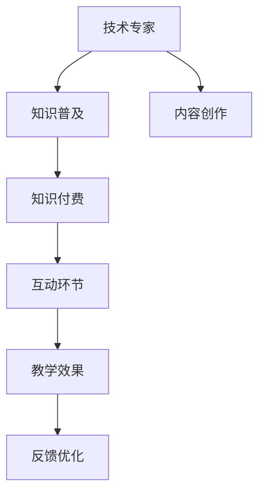

                 

# 从技术专家到知识付费讲师的转型之路

> 关键词：技术转型,知识付费,知识传递,技术普及,讲师经验

## 1. 背景介绍

### 1.1 问题由来
随着互联网技术的不断进步，知识付费市场日益繁荣。知识付费平台为技术专家提供了一个展示自身专业知识和经验的舞台，既能获得可观的收入，又能推动技术普及，造福更多人。但与此同时，这也对技术专家的知识传递能力提出了更高要求，需要他们具备更强的表达力和知识组织能力。

### 1.2 问题核心关键点
成功的知识付费讲师不仅需要深厚的技术功底，还需要出色的表达技巧和有效的知识传递策略。核心关键点包括：

- 构建精炼的知识体系：将技术知识按照逻辑关系进行组织，确保条理清晰、易于理解。
- 选择恰当的表达方式：结合文字、图像、视频等多种媒介，使技术内容更直观、有趣。
- 设计互动环节：利用提问、讨论、案例分析等形式，提升听众的参与感和理解深度。
- 持续优化教学方法：根据反馈不断改进教学内容和方法，实现良性循环。

## 2. 核心概念与联系

### 2.1 核心概念概述

为更好地理解知识付费讲师的角色，本节将介绍几个密切相关的核心概念：

- 知识付费(Knowledge-As-a-Service, KaaS)：指将专业知识以付费的形式提供给用户，加速知识传播和应用。
- 知识普及：指将复杂的技术知识转化为易于理解的内容，推广给普通用户，提升大众科技素养。
- 讲师(Lecturer/Instructor)：即知识传授者，通过多样化的方式将知识传递给听众，达到教学目的。
- 技术专家(Technical Expertise)：具备某领域的专业知识和技术能力的个人或机构，是知识普及和知识付费的重要来源。
- 内容创作(Content Creation)：涉及选题、撰写、编辑、制作等环节，将技术知识转换为有效的教学内容。

这些核心概念之间的逻辑关系可以通过以下Mermaid流程图来展示：



这个流程图展示了几者之间的关系：

1. 技术专家提供专业知识。
2. 知识普及将专业知识转化为易懂的教学内容。
3. 知识付费平台将教学内容商品化，提供给用户。
4. 互动环节提升教学效果。
5. 反馈优化指导内容创作和知识普及。

这些概念共同构成了从技术专家到知识付费讲师的完整流程，通过高效的知识传递，实现技术知识和经济价值的双赢。

## 3. 核心算法原理 & 具体操作步骤
### 3.1 算法原理概述

知识付费讲师的角色不仅需要掌握专业知识，还需要具备一定的教育学和传播学知识。其核心算法原理可归纳为以下几个方面：

1. **知识体系构建**：将复杂的技术知识进行逻辑分解，构建出精炼的知识体系。
2. **内容选择与设计**：根据受众的特点选择合适的教学内容和表达方式，设计互动环节。
3. **互动与反馈**：通过提问、讨论等形式与受众互动，及时获取反馈并进行优化。
4. **教学效果评估**：对教学内容和学习效果进行评估，持续改进教学方法。

### 3.2 算法步骤详解

基于上述原理，知识付费讲师的核心操作流程如下：

1. **需求调研**：与平台沟通，了解受众特点、需求和反馈。
2. **内容规划**：根据调研结果，制定详细的内容规划，包括章节结构、知识点分布、教学方法等。
3. **内容创作**：制作文字、图像、视频等教学材料，确保内容简洁明了、易于理解。
4. **教学实施**：利用多种媒介进行授课，设计互动环节提升参与度。
5. **反馈收集与分析**：通过问卷、评论等形式收集反馈，分析受众的疑点和需求。
6. **内容优化**：根据反馈不断优化教学内容和方法，迭代改进教学效果。

### 3.3 算法优缺点

知识付费讲师的主要优点包括：

- 利用专业知识提供有价值的教学内容，提升用户技术水平。
- 多渠道传播，借助知识付费平台覆盖更广泛的用户群体。
- 通过互动和反馈优化教学，提升教学效果。

缺点主要体现在：

- 需要耗费大量时间和精力进行内容创作和教学设计。
- 缺乏教学经验的初期阶段，可能难以吸引足够的关注和收益。
- 受众的反馈和需求多样，需不断调整教学策略以应对变化。

### 3.4 算法应用领域

知识付费讲师的算法原理和操作步骤广泛应用于各种技术传播场景，例如：

- 在线教育：面向大众提供技术课程，如编程语言、人工智能、数据科学等。
- 企业内训：为企业员工提供专业技能培训，提升团队技术能力。
- 技术博客：通过撰写技术文章，分享专业知识，帮助用户理解技术细节。
- 开源社区：通过代码注释、文档编写等方式，促进技术知识和经验的传播。
- 技术讲座：在技术会议、研讨会等场合，向专业观众传授最新技术趋势和应用案例。

## 4. 数学模型和公式 & 详细讲解 & 举例说明

### 4.1 数学模型构建

假设受众数量为 $N$，内容质量为 $Q$，讲师经验为 $E$，受众反馈为 $F$。则知识普及的总体效果 $E$ 可表示为：

$$
E = f(N, Q, E, F)
$$

其中，$f$ 为非线性函数，表示知识普及效果与各因素的相互作用。

### 4.2 公式推导过程

在实际应用中，内容质量 $Q$ 和受众反馈 $F$ 对知识普及效果 $E$ 的影响较大。我们引入以下两个假设：

- 内容质量越高，受众学习效果越好，知识普及效果 $E$ 与内容质量 $Q$ 成正比：

$$
E = aQ + b
$$

- 受众反馈越积极，内容优化越快，知识普及效果 $E$ 与受众反馈 $F$ 成正比：

$$
E = cF + d
$$

综合上述公式，我们可以得到知识普及效果的简化模型：

$$
E = (a+b)Q + (c+d)F
$$

其中 $a, b, c, d$ 为模型参数，需要通过实际数据进行拟合。

### 4.3 案例分析与讲解

假设某知识付费平台推出了一门Python编程课程，讲师选择了适当的教材，设置了互动环节，并在课程后收集了用户反馈。利用上述公式，我们可以进行如下分析：

- 如果教材内容质量 $Q$ 较高，用户学习效果应较好，知识普及效果 $E$ 上升。
- 如果用户反馈 $F$ 较为积极，讲师及时优化课程内容，知识普及效果 $E$ 应显著提升。
- 若两者同时发生，知识普及效果 $E$ 将大幅提升。

## 5. 项目实践：代码实例和详细解释说明

### 5.1 开发环境搭建

在开发过程中，我们需要以下开发工具和环境：

- 编程语言：Python 3.8及以上版本
- 开发工具：VSCode、PyCharm 等
- 服务器环境：AWS、阿里云、腾讯云等云平台，支持 GPU、CPU 资源
- 数据集：公共数据集或自收集数据集

### 5.2 源代码详细实现

以下是一个简单的 Python 教学代码实例，用于展示知识付费讲师的基本流程：

```python
# 导入相关库
from flask import Flask, request
from flask_sqlalchemy import SQLAlchemy
import numpy as np
import pandas as pd
from sklearn.model_selection import train_test_split
from sklearn.metrics import accuracy_score

# 初始化 Flask 应用
app = Flask(__name__)
app.config['SQLALCHEMY_DATABASE_URI'] = 'sqlite:///database.db'
db = SQLAlchemy(app)

# 定义模型和数据表
class User(db.Model):
    id = db.Column(db.Integer, primary_key=True)
    name = db.Column(db.String(100))
    feedback = db.Column(db.String(100))

class Lesson(db.Model):
    id = db.Column(db.Integer, primary_key=True)
    title = db.Column(db.String(100))
    content = db.Column(db.Text)
    users = db.relationship('User', backref='lessons', lazy=True)

# 获取用户反馈
@app.route('/feedback', methods=['POST'])
def get_feedback():
    data = request.get_json()
    user_id = data['user_id']
    feedback = data['feedback']
    user = User.query.get(user_id)
    user.feedback = feedback
    db.session.commit()
    return 'Feedback received.'

# 数据分析和优化
def analyze_feedback():
    data = pd.read_sql_query('SELECT * FROM user', engine)
    feedback = data['feedback']
    label_count = feedback.value_counts().to_dict()
    return label_count

# 运行分析
if __name__ == '__main__':
    app.run(debug=True)
```

### 5.3 代码解读与分析

这段代码演示了如何使用 Flask 框架构建一个简单的知识付费平台，用于收集用户反馈并进行分析。其中，`User` 类表示用户，`Lesson` 类表示课程。用户通过 `feedback` 字段记录对课程的反馈，课程通过 `content` 字段存储教学内容。

`get_feedback` 函数用于接收用户反馈，并将反馈存储到数据库中。`analyze_feedback` 函数用于分析用户反馈，统计不同反馈的占比。通过这些功能，讲师可以及时获取用户反馈，并根据反馈优化课程内容，提升教学效果。

## 6. 实际应用场景

### 6.1 技术培训

在企业内训场景中，知识付费讲师可以帮助员工掌握最新技术，提升整体技术能力。例如，某互联网公司邀请技术专家开设 Python 编程课程，帮助员工掌握数据分析和机器学习技能。讲师通过互动环节，设计小组讨论、项目实战等环节，增强学习效果。

### 6.2 开源项目贡献

在开源社区，知识付费讲师可以通过代码注释、文档编写等方式，促进开源项目的普及和贡献。例如，某开源项目维护者开设了一门 Python 编程课程，讲解项目代码实现和贡献方法。通过课程教学，许多初学者掌握了开源项目的贡献技巧，进一步推动了项目的普及和成长。

### 6.3 技术咨询

在技术咨询场景中，知识付费讲师可以帮助用户解决技术难题，提升其技术水平。例如，某公司遇到技术问题，聘请了一位技术专家进行在线咨询，专家通过详细讲解代码实现和问题解决思路，帮助用户顺利解决问题。

## 7. 工具和资源推荐

### 7.1 学习资源推荐

为帮助讲师提升教学水平，以下是几项重要的学习资源推荐：

1. **Coursera 和 Udemy**：提供多种技术课程，涵盖编程语言、数据科学、人工智能等。
2. **edX 和 Khan Academy**：提供优质的教育资源，帮助讲师深入学习教学方法和课程设计。
3. **TED Talks**：观看技术领域的优秀演讲，学习讲师的表达技巧和教学风格。
4. **Duolingo**：学习多种语言，提升讲师的跨语言沟通能力。
5. **Bookstack**：阅读经典技术书籍，丰富讲师的知识储备。

### 7.2 开发工具推荐

为提高讲师的工作效率，以下是几款常用的开发工具推荐：

1. **Visual Studio Code**：轻量级、高度可定制的代码编辑器，支持多种语言和插件。
2. **PyCharm**：强大的 Python IDE，支持代码调试、版本控制等高级功能。
3. **Jupyter Notebook**：交互式编程环境，支持数据可视化、代码运行等。
4. **GitHub**：代码托管平台，支持版本控制、协作开发等。
5. **Google Colab**：基于 Jupyter Notebook 的云服务，支持 GPU 计算和远程协作。

### 7.3 相关论文推荐

知识付费讲师的实践和理论研究，可以参考以下几篇经典论文：

1. **Knowledge-as-a-Service (KaaS): An Overview of Business Applications**：
   - 文章链接：https://doi.org/10.1109/TKDD.2015.2425855
   - 论文内容：概述了 KaaS 的业务应用，介绍了多种 KaaS 平台的设计和实现方法。

2. **The Future of Learning in Education**：
   - 文章链接：https://www.nature.com/articles/s41530-021-0223-0
   - 论文内容：探讨了未来教育技术的发展趋势，强调了知识普及和个性化学习的重要性。

3. **Online Learning Analytics**：
   - 文章链接：https://onlinelibrary.wiley.com/doi/full/10.1002/9781118595756.ch5
   - 论文内容：介绍了在线学习数据分析的方法和应用，帮助讲师进行教学效果的评估和优化。

4. **Impact of Feedback on Learning Outcomes**：
   - 文章链接：https://doi.org/10.3389/fpsyg.2019.00259
   - 论文内容：研究了反馈对学习效果的影响，探讨了如何通过反馈提升教学质量。

## 8. 总结：未来发展趋势与挑战

### 8.1 总结

本文详细介绍了从技术专家到知识付费讲师的转型之路，探讨了知识普及和教学方法的关键点，提供了详细的算法原理和操作步骤。通过具体案例和代码实例，展示了知识付费讲师在实际应用中的具体应用。本文还推荐了相关的学习资源、开发工具和学术论文，力求为讲师提供全方位的支持和指导。

通过本文的系统梳理，可以看到，知识付费讲师不仅需要深厚的技术功底，还需要出色的表达技巧和有效的知识传递策略。只有不断提升教学水平，才能在知识付费平台上获得成功。未来，知识付费市场还将继续扩展，技术专家向讲师转型的趋势也将愈发明显，为技术知识的普及和传播注入更多活力。

### 8.2 未来发展趋势

展望未来，知识付费讲师的发展趋势主要体现在以下几个方面：

1. **内容多样化**：随着技术的发展，教学内容将更加多样化，包括视频课程、互动问答、实时演示等多种形式。
2. **个性化教学**：利用大数据和 AI 技术，根据用户的学习行为和反馈，提供个性化的学习方案。
3. **跨平台协作**：知识付费平台和各类在线教育平台将进行深度整合，形成更加完善的学习生态。
4. **技术辅助教学**：利用虚拟现实、增强现实等技术，提升教学体验和效果。
5. **全球化普及**：借助互联网技术，将高质量的课程传播到全球各地，提升全球科技素养。

### 8.3 面临的挑战

尽管知识付费讲师的发展前景广阔，但仍面临以下挑战：

1. **技术壁垒高**：技术领域更新迅速，讲师需要持续学习新技术，才能保持教学内容的先进性。
2. **内容质量要求高**：高质量的教学内容需要花费大量时间和精力进行制作和优化，讲师需具备较强的教学能力。
3. **市场竞争激烈**：知识付费平台众多，讲师需具备较强的市场敏锐度，才能在激烈竞争中脱颖而出。
4. **用户反馈多样**：不同用户的反馈和需求各异，讲师需灵活应对，不断优化教学方法。
5. **知识产权保护**：讲师需注意课程内容的知识产权保护，避免侵权风险。

### 8.4 研究展望

未来，知识付费讲师的研究方向主要集中在以下几个方面：

1. **教学方法的创新**：探索新的教学方法和技术，提升教学效果和用户满意度。
2. **跨领域融合**：将知识付费与在线教育、职业教育、企业培训等领域进行深度融合，形成协同效应。
3. **数据驱动的教学优化**：利用大数据和 AI 技术，进行教学效果的评估和优化，提升教学质量。
4. **多语言教学**：推广多语言课程，提升全球科技素养。
5. **持续学习与适应**：通过持续学习和适应，保持教学内容的先进性和实用性。

总之，从技术专家到知识付费讲师的转型之路充满挑战，但也是一条充满机遇和可能性的道路。通过不断提升教学水平和知识传递能力，知识付费讲师将为技术知识的普及和传播注入更多活力，推动技术的广泛应用和发展。

