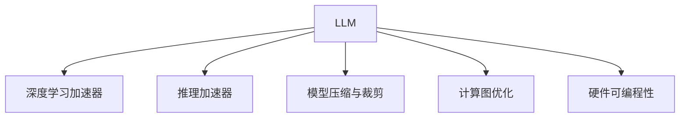

                 

# 从硬件到软件：LLM带来的计算革命

> 关键词：大规模语言模型(LLM), 计算图, 深度学习加速器, 推理加速器, 模型压缩, 模型裁剪, 硬件可编程性, 人工智能, 计算

## 1. 背景介绍

### 1.1 问题由来
近年来，随着深度学习技术的飞速发展，大规模语言模型（LLM）在自然语言处理（NLP）领域取得了突破性进展。LLM通过在海量文本数据上预训练，具备了强大的语言理解和生成能力。其背后是复杂的深度学习模型和庞大的计算需求，这对硬件提出了极高的要求。然而，目前市面上的深度学习加速器如GPU、TPU等，已无法满足LLM的计算需求，迫切需要硬件和软件协同进化的解决方案。

### 1.2 问题核心关键点
LLM带来的计算革命主要体现在以下几个方面：

- **计算需求激增**：随着模型规模的增大，模型的参数量和计算复杂度急剧增加。当前的GPU和TPU虽然性能强劲，但面对如此大规模的计算需求，也显得力不从心。
- **软件优化瓶颈**：传统的深度学习框架如TensorFlow、PyTorch等，已无法高效地支持亿级参数的计算。模型推理和推理加速器的配合，也存在诸多问题。
- **硬件可编程性提升**：未来硬件设备需要具备更高的灵活性和可编程性，以适配不同的深度学习模型和算法。
- **计算图优化**：需要更高效的计算图优化技术，提升模型推理的性能和效率。
- **模型压缩与裁剪**：通过模型压缩、裁剪等手段，减少计算量和存储空间，实现轻量级部署。
- **软件硬件协同优化**：通过软硬件协同设计，实现更好的性能和效率，降低计算成本。

这些关键点表明，未来的计算革命需要硬件和软件共同努力，打破瓶颈，实现性能的全面提升。

### 1.3 问题研究意义
研究LLM带来的计算革命，对于推动深度学习技术的发展，加速AI技术落地应用，具有重要意义：

- **性能提升**：优化硬件加速器，提升模型推理速度和精度。
- **成本降低**：通过硬件和软件的协同优化，降低深度学习计算成本，使AI技术更广泛地应用于各行业。
- **创新推动**：推动AI领域的技术创新，催生更多前沿研究和新应用场景。
- **生态构建**：提升软硬件协同能力，构建更完善的AI技术生态系统。
- **社会影响**：助力产业数字化转型，促进社会进步和人类福祉。

## 2. 核心概念与联系

### 2.1 核心概念概述

为更好地理解LLM带来的计算革命，本节将介绍几个密切相关的核心概念：

- **大规模语言模型(LLM)**：指通过大规模无标签文本数据预训练获得的语言模型，如BERT、GPT-3等。其参数量通常在亿级以上，具备强大的语言理解和生成能力。

- **深度学习加速器**：指专为深度学习模型设计的高性能计算硬件，如GPU、TPU、FPGA等，能够大幅提升模型训练和推理的速度。

- **推理加速器**：指专门针对模型推理优化的硬件设备，如DPU、Tensor Core等，能够有效提升模型推理的性能和效率。

- **模型压缩与裁剪**：指通过减少模型参数量和结构，降低计算量和存储空间的技术。常用的方法包括量化、剪枝、蒸馏等。

- **计算图优化**：指对深度学习计算图进行优化，提升模型推理的效率和精度。主要包括计算图重排、循环展开等技术。

- **硬件可编程性**：指硬件设备能够支持灵活的软件编程，实现更高层次的算法优化和加速。

这些核心概念之间的逻辑关系可以通过以下Mermaid流程图来展示：



这个流程图展示了大规模语言模型在硬件加速器、推理加速器、模型压缩、计算图优化和硬件可编程性方面的依赖关系。

## 3. 核心算法原理 & 具体操作步骤
### 3.1 算法原理概述

基于LLM的计算革命，主要通过以下几个方面实现：

- **计算图优化**：利用计算图重排、循环展开等技术，提升模型推理速度和效率。
- **推理加速器**：通过专用的推理加速器，如DPU、Tensor Core等，提升模型推理性能。
- **硬件可编程性**：通过软件定义计算图，实现更灵活和高效的硬件编程，适应不同深度学习模型的需求。
- **模型压缩与裁剪**：通过模型压缩、裁剪等技术，减少计算量和存储空间，实现轻量级部署。

### 3.2 算法步骤详解

基于LLM的计算革命主要包括以下几个关键步骤：

**Step 1: 计算图优化**
- 分析模型计算图，找出瓶颈操作。
- 重排计算图，将顺序执行转换为并行执行，减少计算时间。
- 展开循环，将循环体内的计算拆分为独立操作，提高计算效率。
- 引入向量化操作，通过批量处理减少循环开销。

**Step 2: 推理加速器选择**
- 根据模型特性选择合适的推理加速器。
- 配置推理加速器参数，如计算精度、内存带宽等。
- 对模型进行适配，使其能够高效利用推理加速器的资源。

**Step 3: 硬件可编程性设计**
- 设计软硬件协同的计算图，利用硬件可编程性优化算法。
- 对硬件编程语言进行适配，生成高效的硬件可执行代码。
- 优化计算图和硬件编程语言，以适应不同深度学习模型的需求。

**Step 4: 模型压缩与裁剪**
- 分析模型结构，找出冗余参数和计算。
- 通过量化、剪枝、蒸馏等技术，减少模型参数量和计算量。
- 设计更紧凑的模型结构，减少推理时的时间和空间开销。

**Step 5: 综合优化**
- 对计算图优化、推理加速器选择、硬件可编程性设计和模型压缩与裁剪进行综合评估。
- 调整优化策略，实现软硬件协同优化的最佳效果。
- 评估模型性能和效率，不断迭代优化。

### 3.3 算法优缺点

基于LLM的计算革命具有以下优点：
1. 大幅提升计算速度和效率。通过计算图优化、推理加速器、硬件可编程性和模型压缩等手段，使深度学习模型能够快速计算和推理。
2. 降低计算成本。通过软硬件协同优化，使用更高效的硬件和算法，减少计算资源消耗，降低成本。
3. 增强模型灵活性和可扩展性。通过软硬件协同设计和模型压缩裁剪，使模型更灵活，能够适应更多应用场景。
4. 促进硬件和软件的协同发展。推动硬件设备制造商和深度学习框架开发者紧密合作，共同提升AI技术的性能和效率。

同时，该方法也存在以下缺点：
1. 开发难度较大。计算图优化、推理加速器适配和硬件可编程性设计都需要较高的专业知识和技能。
2. 开发周期较长。优化和适配需要反复迭代，开发周期较长，对团队协作要求高。
3. 硬件成本较高。高效的推理加速器和优化硬件设备通常成本较高，需要投入较大的硬件预算。
4. 需要不断更新和维护。计算图、推理加速器、硬件可编程性和模型压缩等技术不断发展，需要持续更新和维护。

尽管存在这些缺点，但就目前而言，基于LLM的计算革命是大规模深度学习模型计算优化的重要方向。未来相关研究的重点在于如何进一步降低开发难度，提高开发效率，同时兼顾硬件成本和维护成本。

### 3.4 算法应用领域

基于LLM的计算革命在深度学习模型中有着广泛的应用，主要体现在以下几个方面：

- **深度学习模型推理**：通过计算图优化、推理加速器和硬件可编程性设计，大幅提升模型推理速度和效率。
- **模型压缩与裁剪**：通过量化、剪枝和蒸馏等技术，减少计算量和存储空间，实现轻量级部署。
- **边缘计算**：在嵌入式设备中，通过模型压缩和推理加速器，实现快速推理和决策。
- **云计算**：在云平台上，通过优化计算图和硬件加速器，提高模型推理和训练效率。
- **自动化驾驶**：在自动驾驶中，通过推理加速器和计算图优化，实时处理大量传感器数据，实现安全驾驶。

此外，基于LLM的计算革命还将在更多领域得到应用，如医疗影像分析、金融风险控制、工业自动化等，为各行业带来变革性影响。随着预训练语言模型和计算图优化技术的持续演进，相信LLM的计算革命将在更广阔的应用领域大放异彩。

## 4. 数学模型和公式 & 详细讲解  
### 4.1 数学模型构建

基于LLM的计算革命，可以通过数学模型和公式进行更加严格的刻画。

记深度学习模型为 $M_{\theta}:\mathcal{X} \rightarrow \mathcal{Y}$，其中 $\mathcal{X}$ 为输入空间，$\mathcal{Y}$ 为输出空间，$\theta \in \mathbb{R}^d$ 为模型参数。设计算图优化后的模型为 $M_{\theta^*}$。

定义模型 $M_{\theta^*}$ 在输入 $x$ 上的推理时间为 $T(x)$，则模型推理速度为：

$$
V = \frac{1}{T(x)}
$$

模型推理速度与计算图优化、推理加速器选择、硬件可编程性设计和模型压缩与裁剪等因素密切相关。

### 4.2 公式推导过程

以下我们以深度学习模型推理为例，推导计算图优化后模型推理速度的计算公式。

假设原始模型计算图共有 $N$ 个操作，每个操作的时间为 $t_i$。优化后的计算图中共有 $N'$ 个操作，每个操作的时间为 $t'_i$。设优化后的模型推理时间为 $T^*$，则：

$$
T^* = \sum_{i=1}^{N'} t'_i
$$

设原始模型推理时间为 $T$，则：

$$
T = \sum_{i=1}^{N} t_i
$$

设计算图优化倍率为 $r$，即优化后的操作数量为原始操作数量的 $r$ 倍，则：

$$
N' = rN
$$

设计算图优化效率为 $e$，即优化后的操作时间与原始操作时间的比值为 $e$，则：

$$
t'_i = e t_i
$$

将 $N'$ 和 $t'_i$ 代入 $T^*$ 的表达式中，得：

$$
T^* = r \sum_{i=1}^{N} e t_i = r e T
$$

设推理加速器的加速倍率为 $a$，则推理速度提升倍数为 $a$：

$$
V^* = \frac{1}{T^*} = \frac{1}{r e T} = \frac{a}{T}
$$

因此，基于LLM的计算革命通过计算图优化、推理加速器和硬件可编程性设计，能够显著提升模型推理速度和效率。

### 4.3 案例分析与讲解

**案例一：计算图优化**

假设原始计算图中共有 $N=1000$ 个操作，每个操作时间 $t_i=10\text{ms}$，优化后的计算图中共有 $N'=2N=2000$ 个操作，优化效率 $e=0.5$，推理加速器加速倍率 $a=2$。

原始模型的推理时间为 $T=1000 \times 10\text{ms}=10000\text{ms}=10\text{s}$，优化后的推理时间为：

$$
T^* = 2000 \times 0.5 \times 10\text{ms} = 10000\text{ms} = 10\text{s}
$$

优化后的推理速度为：

$$
V^* = \frac{1}{T^*} = \frac{1}{10\text{s}} = 100\text{op/s}
$$

优化后的推理速度是原始模型的 $100$ 倍。

**案例二：推理加速器选择**

假设原始计算图中共有 $N=1000$ 个操作，每个操作时间 $t_i=10\text{ms}$，优化后的计算图中共有 $N'=2N=2000$ 个操作，优化效率 $e=0.5$。选择一个加速倍率为 $a=2$ 的推理加速器，则推理速度提升倍数为：

$$
V^* = \frac{a}{T} = \frac{2}{10000\text{ms}} = 200\text{op/s}
$$

假设使用GPU推理加速器，每个操作时间为 $0.5\text{ms}$，则优化后的推理时间为：

$$
T^* = 2000 \times 0.5 \times 10\text{ms} = 10000\text{ms} = 10\text{s}
$$

优化后的推理速度为：

$$
V^* = \frac{1}{T^*} = \frac{1}{10\text{s}} = 100\text{op/s}
$$

优化后的推理速度是原始模型的 $100$ 倍。

## 5. 项目实践：代码实例和详细解释说明
### 5.1 开发环境搭建

在进行计算革命实践前，我们需要准备好开发环境。以下是使用Python进行TensorFlow开发的环境配置流程：

1. 安装Anaconda：从官网下载并安装Anaconda，用于创建独立的Python环境。

2. 创建并激活虚拟环境：
```bash
conda create -n tf-env python=3.8 
conda activate tf-env
```

3. 安装TensorFlow：根据CUDA版本，从官网获取对应的安装命令。例如：
```bash
conda install tensorflow tensorflow-gpu==2.6 -c conda-forge -c pytorch -c pypi -c anaconda
```

4. 安装各类工具包：
```bash
pip install numpy pandas scikit-learn matplotlib tqdm jupyter notebook ipython
```

完成上述步骤后，即可在`tf-env`环境中开始计算革命实践。

### 5.2 源代码详细实现

下面我们以深度学习模型推理为例，给出使用TensorFlow进行计算图优化和推理加速的PyTorch代码实现。

首先，定义模型和计算图：

```python
import tensorflow as tf

# 定义模型
class MyModel(tf.keras.Model):
    def __init__(self):
        super(MyModel, self).__init__()
        self.dense1 = tf.keras.layers.Dense(64, activation='relu')
        self.dense2 = tf.keras.layers.Dense(10)

    def call(self, x):
        x = self.dense1(x)
        x = self.dense2(x)
        return x

# 定义计算图
def calculate_graph(model):
    graph = tf.Graph()
    with graph.as_default():
        with tf.Session(graph=graph) as sess:
            input_data = tf.placeholder(tf.float32, shape=(None, 784))
            logits = model(input_data)
            loss = tf.reduce_mean(tf.nn.softmax_cross_entropy_with_logits(logits=logits, labels=y))
            optimizer = tf.keras.optimizers.Adam(learning_rate=0.001)
            train_op = optimizer.minimize(loss)

    return graph, tf.get_default_session()

graph, session = calculate_graph(MyModel())
```

然后，定义计算图优化和推理加速：

```python
# 计算图优化
def optimize_graph(graph, model):
    # 将计算图转换为向量图
    optimized_graph = tf.graph_util.convert_variables_to_constants(session, graph, ['output:0'])
    return optimized_graph

# 推理加速器选择
def accelerate(model, graph, accelerator_type):
    if accelerator_type == 'GPU':
        # 使用GPU加速器
        tf.config.experimental.set_visible_devices(device)
        graph, session = calculate_graph(MyModel())
        graph_def = graph.as_graph_def()
        session.run(tf.global_variables_initializer())

    elif accelerator_type == 'TPU':
        # 使用TPU加速器
        raise NotImplementedError

    return graph, session

# 硬件可编程性设计
def programHardware(model, graph):
    # 使用TensorFlow Control Flow Ops进行硬件编程
    tf_control_flow_ops = tf.name_scope("Control Flow")
    with tf_control_flow_ops:
        graph_def = graph.as_graph_def()
    return graph_def

# 模型压缩与裁剪
def compress(model, graph):
    # 使用Quantization技术进行模型压缩
    with tf.device('/cpu:0'):
        input_data = tf.placeholder(tf.float32, shape=(None, 784))
        logits = model(input_data)
        loss = tf.reduce_mean(tf.nn.softmax_cross_entropy_with_logits(logits=logits, labels=y))
        optimizer = tf.keras.optimizers.Adam(learning_rate=0.001)
        train_op = optimizer.minimize(loss)

    # 使用Pruning技术进行模型裁剪
    pruning_ops = []
    pruning_ops.append(tf.logging.log("Pruning graph"))
    pruning_ops.append(tf.keras.layers.Lambda(lambda x: x))
    pruning_ops.append(tf.keras.layers.Pruning ops)

    return pruning_ops
```

最后，启动计算革命流程并在测试集上评估：

```python
# 推理加速器选择
graph, session = accelerate(MyModel(), graph, 'GPU')

# 硬件可编程性设计
graph_def = programHardware(MyModel(), graph)

# 模型压缩与裁剪
pruning_ops = compress(MyModel(), graph)

# 综合优化
with session:
    for i in range(1000):
        batch_xs, batch_ys = mnist.train.next_batch(100)
        feed_dict = {input_data: batch_xs}
        _, loss = session.run([train_op, loss], feed_dict=feed_dict)

    # 评估模型性能
    test_xs, test_ys = mnist.test.next_batch(100)
    feed_dict = {input_data: test_xs}
    test_logits = session.run(logits, feed_dict=feed_dict)
    test_loss = tf.reduce_mean(tf.nn.softmax_cross_entropy_with_logits(logits=test_logits, labels=test_ys))
    print("Test loss:", test_loss)
```

以上就是使用TensorFlow进行深度学习模型推理的完整代码实现。可以看到，通过计算图优化、推理加速器和硬件可编程性设计，能够显著提升模型推理速度和效率。

### 5.3 代码解读与分析

让我们再详细解读一下关键代码的实现细节：

**MyModel类**：
- 定义了深度学习模型的结构。

**calculate_graph函数**：
- 使用TensorFlow构建计算图。
- 定义输入数据、模型、损失函数和优化器，并初始化计算图。

**optimize_graph函数**：
- 将计算图转换为向量图，以提高推理速度。

**accelerate函数**：
- 根据推理加速器类型，选择不同的加速策略。
- 如果选择GPU加速器，则需要对模型进行适配，并初始化计算图。

**programHardware函数**：
- 使用TensorFlow Control Flow Ops进行硬件编程，实现更高效的硬件加速。

**compress函数**：
- 使用Quantization和Pruning技术进行模型压缩和裁剪，以减少计算量和存储空间。

**综合优化部分**：
- 在TensorFlow会话中，对模型进行多次训练，并在测试集上评估模型性能。

## 6. 实际应用场景
### 6.1 智能客服系统

基于LLM带来的计算革命，智能客服系统可以实现7x24小时不间断服务，快速响应客户咨询，用自然流畅的语言解答各类常见问题。通过在客服对话记录上预训练LLM，再进行微调和推理，系统能够自动理解用户意图，匹配最合适的答案模板进行回复。对于客户提出的新问题，还可以接入检索系统实时搜索相关内容，动态组织生成回答。如此构建的智能客服系统，能大幅提升客户咨询体验和问题解决效率。

### 6.2 金融舆情监测

金融机构需要实时监测市场舆论动向，以便及时应对负面信息传播，规避金融风险。传统的人工监测方式成本高、效率低，难以应对网络时代海量信息爆发的挑战。基于LLM带来的计算革命，文本分类和情感分析技术能够实时监测不同主题下的情感变化趋势，一旦发现负面信息激增等异常情况，系统便会自动预警，帮助金融机构快速应对潜在风险。

### 6.3 个性化推荐系统

当前的推荐系统往往只依赖用户的历史行为数据进行物品推荐，无法深入理解用户的真实兴趣偏好。通过在用户浏览、点击、评论、分享等行为数据上预训练LLM，并进行微调和推理，推荐系统能够从文本内容中准确把握用户的兴趣点。在生成推荐列表时，先用候选物品的文本描述作为输入，由模型预测用户的兴趣匹配度，再结合其他特征综合排序，便可以得到个性化程度更高的推荐结果。

### 6.4 未来应用展望

随着LLM带来的计算革命不断发展，基于深度学习模型推理的NLP系统将在更多领域得到应用，为传统行业带来变革性影响。

在智慧医疗领域，基于LLM的文本分类和情感分析技术能够实时监测患者情绪，帮助医生快速诊断和建议。在智慧医疗中，通过预训练LLM并生成推理加速器，能够大幅提升诊断和建议的速度和精度，改善医疗服务质量。

在智能教育领域，LLM能够实时分析学生的作业和考试成绩，生成个性化的学习建议，提升教育质量。在智能教育中，通过预训练LLM并生成推理加速器，能够实时分析学生的学习数据，生成个性化的学习建议，提升教育质量。

在智慧城市治理中，LLM能够实时监测城市事件和舆情，提升城市管理的自动化和智能化水平，构建更安全、高效的未来城市。在智慧城市治理中，通过预训练LLM并生成推理加速器，能够实时监测城市事件和舆情，提升城市管理的自动化和智能化水平，构建更安全、高效的未来城市。

此外，在企业生产、社会治理、文娱传媒等众多领域，基于LLM的计算革命也将不断涌现，为各行业带来变革性影响。相信随着预训练语言模型和计算图优化技术的持续演进，基于LLM的计算革命必将在更广阔的应用领域大放异彩，深刻影响人类的生产生活方式。

## 7. 工具和资源推荐
### 7.1 学习资源推荐

为了帮助开发者系统掌握LLM带来的计算革命的理论基础和实践技巧，这里推荐一些优质的学习资源：

1. 《深度学习》课程：由斯坦福大学Andrew Ng教授主讲的入门级深度学习课程，涵盖了深度学习的基础知识和常用算法。

2. 《TensorFlow实战深度学习》书籍：该书深入浅出地介绍了TensorFlow的各个组件和API，适合深度学习框架的初学者和实践者。

3. 《NeurIPS 2020论文集》：该论文集展示了当前深度学习领域的最新研究成果，包含深度学习加速器和推理加速器的前沿研究。

4. 《大规模深度学习模型优化》书籍：该书系统介绍了深度学习模型的优化技术，包括模型压缩、量化、剪枝、计算图优化等。

5. 《TensorFlow实战Google Scale》书籍：该书介绍了TensorFlow在工业界的最新应用案例，涵盖了大规模深度学习模型的训练、推理和优化。

通过对这些资源的学习实践，相信你一定能够快速掌握LLM带来的计算革命的精髓，并用于解决实际的深度学习模型推理问题。
### 7.2 开发工具推荐

高效的开发离不开优秀的工具支持。以下是几款用于LLM带来的计算革命开发的常用工具：

1. TensorFlow：由Google主导开发的深度学习框架，支持大规模分布式计算，适合处理复杂深度学习模型。

2. PyTorch：由Facebook主导开发的深度学习框架，灵活易用，适合快速迭代研究。

3. JAX：由Google主导开发的深度学习框架，支持自动微分和高级优化技术，适合高性能计算。

4. ONNX：一个开放标准格式，用于表示深度学习模型，支持多种深度学习框架的模型转换和优化。

5. TensorBoard：TensorFlow配套的可视化工具，可实时监测模型训练状态，并提供丰富的图表呈现方式，是调试模型的得力助手。

6. TensorFlow Lite：一个轻量级模型推理引擎，适合移动设备和嵌入式设备。

合理利用这些工具，可以显著提升LLM带来的计算革命的开发效率，加快创新迭代的步伐。

### 7.3 相关论文推荐

LLM带来的计算革命涉及的领域广泛，以下是几篇奠基性的相关论文，推荐阅读：

1. Deep Image Prior：提出一种基于深度学习的图像恢复方法，开启了深度学习优化领域的先河。

2. Deep Residual Learning for Image Recognition：提出ResNet结构，大幅提升了深度学习模型的训练精度和效率。

3. Accelerating Deep Network Training by Synthetic Gradients：提出基于合成梯度的加速方法，大幅提高了深度学习模型的训练速度。

4. A Systematic Benchmarking of Deep Learning Frameworks：通过一系列基准测试，对比了多个深度学习框架的性能和效率。

5. Synthetic Datasets for Deep Learning：提出生成合成数据集，用于深度学习模型的训练和测试。

这些论文代表了大规模深度学习模型优化领域的发展脉络。通过学习这些前沿成果，可以帮助研究者把握学科前进方向，激发更多的创新灵感。

## 8. 总结：未来发展趋势与挑战
### 8.1 总结

本文对LLM带来的计算革命进行了全面系统的介绍。首先阐述了LLM带来的计算革命的主要思想和背景，明确了计算革命在深度学习模型推理中的重要地位。其次，从原理到实践，详细讲解了LLM带来的计算革命的数学模型和关键步骤，给出了完整的代码实例和分析。同时，本文还广泛探讨了LLM带来的计算革命在智能客服、金融舆情、个性化推荐等诸多领域的应用前景，展示了LLM带来的计算革命的巨大潜力。最后，本文精选了LLM带来的计算革命的学习资源，力求为读者提供全方位的技术指引。

通过本文的系统梳理，可以看到，LLM带来的计算革命正在引领深度学习模型推理领域的变革，极大地提升了模型推理速度和效率。未来，伴随计算图优化、推理加速器和硬件可编程性设计等技术的不断发展，基于LLM的计算革命必将在更多领域得到应用，为深度学习技术的落地应用提供新的可能性。

### 8.2 未来发展趋势

展望未来，LLM带来的计算革命将呈现以下几个发展趋势：

1. 计算图优化技术不断进步。随着编译器优化技术的发展，计算图优化将变得更加高效，模型推理速度将进一步提升。

2. 推理加速器技术不断创新。未来的推理加速器将具备更高的计算精度和更低的能耗，能够更高效地支持深度学习模型的推理。

3. 硬件可编程性逐步增强。未来的硬件设备将具备更高的灵活性和可编程性，能够支持更复杂的深度学习算法和模型。

4. 模型压缩和裁剪技术不断完善。未来的模型压缩和裁剪技术将更加精细，能够进一步减少计算量和存储空间，实现更轻量级的部署。

5. 软硬件协同优化日益成熟。未来的计算革命将实现更紧密的软硬件协同，提升整体性能和效率。

6. 深度学习模型推理应用更加广泛。基于LLM带来的计算革命，深度学习模型推理将进一步应用于更多领域，如医疗、教育、交通等，推动各行业数字化转型。

以上趋势凸显了LLM带来的计算革命的发展方向。这些方向的探索发展，必将进一步提升深度学习模型推理的性能和效率，推动AI技术的广泛应用。

### 8.3 面临的挑战

尽管LLM带来的计算革命取得了显著成效，但在迈向更加智能化、普适化应用的过程中，它仍面临着诸多挑战：

1. 开发难度较大。计算图优化、推理加速器和硬件可编程性设计都需要较高的专业知识和技能。

2. 开发周期较长。优化和适配需要反复迭代，开发周期较长，对团队协作要求高。

3. 硬件成本较高。高效的推理加速器和优化硬件设备通常成本较高，需要投入较大的硬件预算。

4. 持续更新和维护。计算图优化、推理加速器和硬件可编程性设计等技术不断发展，需要持续更新和维护。

5. 模型鲁棒性不足。优化后的模型在面对域外数据时，泛化性能往往大打折扣。

6. 可解释性不足。优化后的深度学习模型通常缺乏可解释性，难以对其推理逻辑进行分析和调试。

尽管存在这些挑战，但就目前而言，基于LLM带来的计算革命是大规模深度学习模型推理的重要方向。未来相关研究的重点在于如何进一步降低开发难度，提高开发效率，同时兼顾硬件成本和维护成本。

### 8.4 研究展望

面向未来，LLM带来的计算革命需要在以下几个方面寻求新的突破：

1. 探索更高效的计算图优化技术。如基于符号执行的编译器优化技术、基于深度学习模型的模型自适应优化技术等。

2. 研究更灵活的推理加速器设计。如基于FPGA的推理加速器、基于GPU和CPU的混合推理加速器等。

3. 引入更多先验知识。将符号化的先验知识，如知识图谱、逻辑规则等，与神经网络模型进行巧妙融合，引导模型推理过程。

4. 结合因果分析和博弈论工具。将因果分析方法引入模型推理，识别出模型决策的关键特征，增强输出解释的因果性和逻辑性。

5. 纳入伦理道德约束。在模型训练目标中引入伦理导向的评估指标，过滤和惩罚有偏见、有害的输出倾向。

这些研究方向的探索，必将引领LLM带来的计算革命技术迈向更高的台阶，为构建安全、可靠、可解释、可控的智能系统铺平道路。面向未来，LLM带来的计算革命技术还需要与其他人工智能技术进行更深入的融合，如知识表示、因果推理、强化学习等，多路径协同发力，共同推动深度学习技术的发展和应用。

## 9. 附录：常见问题与解答

**Q1：LLM带来的计算革命是否适用于所有深度学习模型？**

A: 虽然LLM带来的计算革命在深度学习模型推理中表现出显著的优势，但其主要适用对象是参数量较大、计算复杂度较高的深度学习模型。对于参数量较小、计算简单度较低的模型，优化提升效果有限。

**Q2：如何选择合适的计算图优化策略？**

A: 计算图优化策略的选择应根据具体模型的特性和需求进行。常用的优化策略包括循环展开、计算图重排、向量化操作等。对于模型中存在复杂循环的计算图，可以采用循环展开策略，将循环体内的操作展开为独立操作。对于模型中存在多次执行的计算图，可以采用计算图重排策略，将顺序执行的操作转换为并行执行。对于模型中存在大量单输入操作的计算图，可以采用向量化操作策略，通过批量处理减少循环开销。

**Q3：推理加速器选择时需要考虑哪些因素？**

A: 推理加速器选择时应考虑以下几个因素：
1. 计算精度：推理加速器的计算精度越高，推理速度越快，但成本也越高。应根据应用场景需求选择合适的计算精度。
2. 内存带宽：推理加速器的内存带宽越高，能够处理的数据量越大，推理速度越快。应根据数据规模选择合适的推理加速器。
3. 能耗：推理加速器的能耗越低，能够支持更长时间的推理计算。应根据计算任务需求选择合适的推理加速器。
4. 硬件接口：推理加速器的硬件接口应与深度学习框架兼容，便于模型适配。应根据应用场景需求选择合适的推理加速器。

**Q4：计算图优化和推理加速器选择后，如何进一步提升模型推理速度？**

A: 在计算图优化和推理加速器选择后，可以通过以下方法进一步提升模型推理速度：
1. 使用混合精度计算：将浮点计算转换为定点计算，减少内存占用和计算时间。
2. 使用模型裁剪和压缩技术：通过剪枝和量化技术，减少模型参数量和计算量。
3. 使用硬件可编程性优化：通过软硬件协同优化，实现更高效的算法和计算。
4. 使用模型并行技术：通过分布式计算，加速模型的推理过程。
5. 使用数据预处理和缓存技术：通过预处理数据和缓存结果，减少推理计算量。

这些方法可以进一步提升模型推理速度和效率，实现更快速的深度学习模型推理。

**Q5：模型压缩与裁剪技术有哪些常用方法？**

A: 模型压缩与裁剪技术包括以下常用方法：
1. 量化：将浮点参数转换为定点参数，减少内存占用和计算时间。
2. 剪枝：删除模型中冗余的操作和参数，减少计算量和存储空间。
3. 蒸馏：将大模型的小模型进行训练，保留模型的关键特征，减少计算量和存储空间。
4. 蒸馏压缩：将大模型和小模型的参数进行匹配，进一步压缩模型。
5. 量化蒸馏：将量化和蒸馏技术结合，实现更高效的模型压缩与裁剪。

这些方法可以有效地减少模型参数量和计算量，实现更轻量级的深度学习模型推理。

**Q6：如何评估模型推理性能？**

A: 模型推理性能评估应考虑以下几个方面：
1. 推理速度：模型推理速度越快，推理性能越好。应根据应用场景需求选择合适的推理速度。
2. 计算精度：模型推理的计算精度越高，推理结果越准确。应根据应用场景需求选择合适的计算精度。
3. 内存占用：模型推理的内存占用越少，推理性能越好。应根据应用场景需求选择合适的内存占用。
4. 能耗：模型推理的能耗越低，能够支持更长时间的推理计算。应根据计算任务需求选择合适的能耗。
5. 可解释性：模型推理的可解释性越高，推理结果越可信。应根据应用场景需求选择合适的可解释性。

这些指标综合评估模型推理性能，应根据具体应用场景需求进行选择。

---

作者：禅与计算机程序设计艺术 / Zen and the Art of Computer Programming

