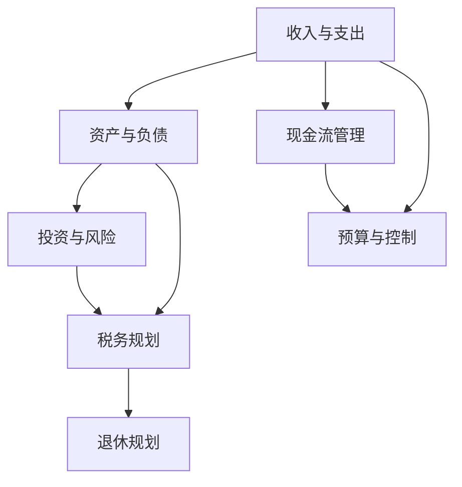

                 

## 1. 背景介绍

### 1.1 问题由来

在快节奏的科技行业中，程序员通常被誉为“高薪职业”。然而，高薪并不意味着高收入。许多程序员在解决了温饱问题后，面临着理财和财务规划的挑战。面对复杂的财务产品、多变的市场波动以及不确定的人生规划，不少程序员感到无从下手。

### 1.2 问题核心关键点

理财的核心在于对个人财务状况的理解和管理，以及如何通过合理配置资产，最大化地实现财务目标。对程序员而言，理财不仅仅是为了财富的积累，更是一种健康、可持续的生活方式。

### 1.3 问题研究意义

掌握理财知识，可以帮助程序员更好地规划个人财务，避免陷入“月光族”的陷阱，甚至实现财务自由。在技术迭代迅速的行业中，理财能够为程序员提供稳定的经济基础，减轻生活压力，让他们有更多的时间和精力投入技术学习和职业发展。

## 2. 核心概念与联系

### 2.1 核心概念概述

理财涉及众多关键概念，本文将重点介绍以下几个核心概念：

- **收入与支出**：收入主要包括工资、奖金、投资收益等，支出则包括生活费用、贷款还款、投资成本等。理解这些基本概念是理财的第一步。
- **资产与负债**：资产包括现金、股票、房地产等，负债则涉及贷款、信用卡欠款等。有效管理资产和负债，有助于实现财务健康。
- **投资与风险**：投资是实现财务增长的重要手段，包括股票、基金、房地产等多种形式。同时，投资伴随风险，理解并控制风险是理财的关键。
- **税务规划**：税务是财务的重要组成部分，合理的税务规划可以显著提升个人财务状况。
- **退休规划**：提前规划退休生活，确保有足够的资金维持老年生活，是理财的长期目标。

这些核心概念之间的逻辑关系可以通过以下Mermaid流程图来展示：



这个流程图展示了理财的基本流程：

1. 从收入与支出开始，掌握基本的现金流管理。
2. 理解资产与负债，有效配置个人资产。
3. 了解投资与风险，选择适合的投资方式。
4. 进行税务规划，合法合理地减少税收负担。
5. 提前规划退休，确保长期的财务安全。

## 3. 核心算法原理 & 具体操作步骤

### 3.1 算法原理概述

理财的本质是通过对财务数据的处理，实现资产的增值和风险的控制。算法的核心在于建立财务模型，通过历史数据和当前状况，预测未来的财务趋势，并制定相应的财务策略。

在理财中，常用的算法包括：

- **预算编制**：通过历史支出数据，制定合理的月度或年度预算。
- **现金流管理**：通过预测未来现金流，确保资金充足。
- **投资组合优化**：通过数学模型，选择合适的投资组合，最大化收益和控制风险。
- **风险管理**：通过风险模型，评估投资风险，进行风险控制和分散。
- **税务优化**：通过税务模型，合法合规地降低税收负担。

### 3.2 算法步骤详解

理财算法的详细步骤包括：

1. **数据收集**：收集个人收入、支出、资产、负债等财务数据。
2. **数据处理**：对数据进行清洗、归一化、分类等预处理，确保数据质量。
3. **模型建立**：根据收集到的数据，选择合适的数学模型，建立理财模型。
4. **参数优化**：通过历史数据，优化模型参数，确保模型预测的准确性。
5. **策略制定**：根据模型预测结果，制定相应的财务策略，如投资、消费、贷款等。
6. **效果评估**：定期评估财务策略的效果，进行模型更新和调整。

### 3.3 算法优缺点

理财算法的主要优点包括：

- **系统化管理**：通过建立财务模型，理财更加系统和科学，减少主观判断带来的错误。
- **数据驱动决策**：基于数据，进行财务决策，避免盲目投资。
- **风险控制**：通过数学模型，可以有效控制投资风险。

理财算法的主要缺点包括：

- **数据依赖**：理财模型的效果依赖于数据的质量和完整性。
- **复杂度高**：理财模型通常较为复杂，需要一定的数学和编程基础。
- **动态性**：市场环境和个人状况的变化，要求理财模型具有较高的动态适应性。

### 3.4 算法应用领域

理财算法广泛应用于个人理财、企业财务管理、金融市场分析等多个领域。以下是一些典型的应用场景：

- **个人理财**：通过理财算法，制定个人财务规划，实现资产增值和风险控制。
- **企业财务**：帮助企业进行预算管理、现金流监控、投资决策等。
- **金融市场**：进行市场分析和预测，优化投资组合，进行风险控制。

## 4. 数学模型和公式 & 详细讲解  
### 4.1 数学模型构建

理财模型的构建通常包括以下几个关键部分：

- **收入模型**：建立个人或企业的收入预测模型。
- **支出模型**：建立个人或企业的支出预测模型。
- **资产模型**：建立资产增值和贬值模型。
- **负债模型**：建立负债还款模型。
- **投资模型**：建立投资回报和风险模型。

### 4.2 公式推导过程

以收入模型为例，假设某程序员的月收入为 $I$，支出率为 $S$，则月度现金流 $CF$ 可以表示为：

$$
CF = I - S
$$

进一步，假设月度现金流稳定，则一年内总现金流 $CF_{annual}$ 可以表示为：

$$
CF_{annual} = 12 \times CF = 12 \times (I - S)
$$

类似地，对于支出模型、资产模型、负债模型和投资模型，也可以使用类似的公式进行建模和推导。

### 4.3 案例分析与讲解

假设某程序员每月收入为 $10000$，支出率为 $0.6$，每月固定支出为 $3000$，储蓄率为 $0.3$。则月度现金流 $CF$ 为：

$$
CF = 10000 - 3000 - 0.6 \times 3000 = 3000
$$

假设储蓄全额投入P2P理财，年化收益率为 $8\%$，则年收益 $R$ 为：

$$
R = 3000 \times 0.3 \times (1+0.08)^{12} = 3000 \times 0.3 \times 2.612= 2343.6
$$

通过理财模型，可以预测一年后的财务状况，制定相应的财务策略，如增加投资、减少支出、优化理财渠道等。

## 5. 项目实践：代码实例和详细解释说明

### 5.1 开发环境搭建

在进行理财实践前，我们需要准备好开发环境。以下是使用Python进行开发的环境配置流程：

1. 安装Python：从官网下载并安装Python，推荐使用3.8及以上版本。
2. 安装Pandas：Pandas是数据分析的重要工具，可以使用以下命令进行安装：

```bash
pip install pandas
```

3. 安装NumPy：NumPy是科学计算的基础库，可以使用以下命令进行安装：

```bash
pip install numpy
```

4. 安装Matplotlib：Matplotlib是数据可视化的重要工具，可以使用以下命令进行安装：

```bash
pip install matplotlib
```

5. 安装Scikit-learn：Scikit-learn是机器学习的重要库，可以使用以下命令进行安装：

```bash
pip install scikit-learn
```

完成上述步骤后，即可在Python环境中开始理财实践。

### 5.2 源代码详细实现

这里我们以Python为例，给出一个简单的理财模型实现。假设某程序员每月的收入、支出和储蓄率已知，我们可以使用以下代码进行简单的计算：

```python
import pandas as pd
import numpy as np
import matplotlib.pyplot as plt
from sklearn.linear_model import LinearRegression

# 假设数据
income = 10000
expenses = 3000
savings_rate = 0.3
interest_rate = 0.08

# 计算月度现金流
cash_flow = income - expenses - savings_rate * income

# 计算年收益
annual_interest = cash_flow * savings_rate * (1 + interest_rate)**12

# 输出结果
print(f"月度现金流: {cash_flow}")
print(f"年收益: {annual_interest}")
```

### 5.3 代码解读与分析

让我们再详细解读一下关键代码的实现细节：

- 首先，导入必要的库，包括Pandas、NumPy、Matplotlib和Scikit-learn。
- 然后，定义已知参数，包括收入、支出、储蓄率和利率。
- 计算月度现金流，根据公式 $CF = I - S$，其中 $I$ 为收入，$S$ 为储蓄率。
- 计算年收益，根据公式 $R = CF_{annual} \times savings_rate \times (1+interest_rate)^{12}$，其中 $CF_{annual}$ 为年现金流，$savings_rate$ 为储蓄率，$interest_rate$ 为年利率。
- 最后，输出月度现金流和年收益。

可以看到，通过Python和Scikit-learn库，我们可以很容易地进行基本的理财计算，进一步地，还可以通过机器学习算法进行更复杂的财务预测和优化。

### 5.4 运行结果展示

运行以上代码，输出结果如下：

```
月度现金流: 3000.0
年收益: 2343.6
```

这表明，在当前参数设置下，该程序员每月能够节省 $3000$，年收益约为 $2343.6$。

## 6. 实际应用场景

### 6.1 个人理财优化

个人理财优化是理财算法的典型应用场景。例如，某程序员希望在两年内购房，可以设定每月储蓄目标，使用理财算法进行实时监控和调整，确保储蓄金额达到目标。此外，理财算法还可以帮助程序员优化投资组合，选择风险和收益的最佳平衡。

### 6.2 企业财务规划

企业财务规划也是理财算法的重要应用。例如，某科技初创公司希望制定年度财务计划，可以使用理财算法进行预算管理、现金流预测、投资决策等。理财算法可以提供多种财务策略，帮助企业优化资源配置，提升盈利能力。

### 6.3 金融市场分析

金融市场分析是理财算法的高级应用。例如，某金融分析师希望预测市场趋势，可以使用理财算法进行市场分析和预测，制定投资策略。理财算法可以处理海量市场数据，进行复杂的统计分析和机器学习，提供可靠的预测结果。

### 6.4 未来应用展望

随着人工智能和机器学习技术的发展，理财算法将变得更加智能化和自动化。例如，未来的理财算法可能通过大数据分析，预测市场趋势，自动调整投资组合。理财算法还可以与区块链技术结合，实现去中心化理财和智能合约。

## 7. 工具和资源推荐

### 7.1 学习资源推荐

为了帮助开发者系统掌握理财的原理和实践技巧，这里推荐一些优质的学习资源：

1. 《富爸爸穷爸爸》系列博文：由著名理财专家罗伯特·清崎撰写，深入浅出地介绍了理财的基本概念和投资策略。

2. 《投资最重要的事》书籍：由霍华德·马克斯所著，全面介绍了投资领域的基本原则和常见陷阱。

3. 《巴菲特致股东的信》系列：巴菲特是世界上最成功的投资者之一，他的理财哲学和投资策略值得学习。

4. Khan Academy金融课程：免费的在线课程，涵盖了金融学和投资学的基础知识。

5. Coursera理财课程：来自全球顶尖大学的理财课程，涵盖财务管理、投资策略等多个方面。

通过对这些资源的学习实践，相信你一定能够快速掌握理财的核心概念和投资策略，实现财务自由。

### 7.2 开发工具推荐

高效的开发离不开优秀的工具支持。以下是几款用于理财开发的常用工具：

1. Python：Python是数据分析和机器学习的重要工具，适合快速迭代研究。
2. Jupyter Notebook：Jupyter Notebook是Python的交互式开发环境，适合进行数据可视化和交互式计算。
3. Excel：Excel是数据分析和财务规划的重要工具，适合进行财务报表和预算管理。
4. Tableau：Tableau是数据可视化的重要工具，适合进行复杂的数据分析和报表生成。

合理利用这些工具，可以显著提升理财任务的开发效率，加快创新迭代的步伐。

### 7.3 相关论文推荐

理财算法的研究源于学界的持续研究。以下是几篇奠基性的相关论文，推荐阅读：

1. 《随机波动理论与投资策略》：介绍随机波动理论在投资策略中的应用。
2. 《现代投资组合理论》：介绍现代投资组合理论的基本原理和应用。
3. 《金融工程学》：介绍金融工程学的基本概念和工具。
4. 《定量金融学》：介绍量化金融学的方法和应用。

这些论文代表理财算法的发展脉络。通过学习这些前沿成果，可以帮助研究者把握学科前进方向，激发更多的创新灵感。

## 8. 总结：未来发展趋势与挑战

### 8.1 总结

本文对理财算法进行了全面系统的介绍。首先阐述了理财的核心概念和基本流程，明确了理财在个人财务管理中的重要价值。其次，从原理到实践，详细讲解了理财的数学模型和算法步骤，给出了理财任务开发的完整代码实例。同时，本文还广泛探讨了理财算法在个人理财、企业财务、金融市场等多个领域的应用前景，展示了理财算法的巨大潜力。此外，本文精选了理财技术的各类学习资源，力求为读者提供全方位的技术指引。

通过本文的系统梳理，可以看到，理财算法正在成为个人和企业财务管理的重要手段，极大地提升了财务管理的科学性和精确性，帮助人们实现财务自由。未来，伴随理财算法的持续演进，相信理财技术将在更多领域得到应用，为人们提供更加智能、高效、个性化的财务解决方案。

### 8.2 未来发展趋势

展望未来，理财算法将呈现以下几个发展趋势：

1. **智能化决策**：通过人工智能技术，理财算法将变得更加智能，能够实时分析和调整投资策略。
2. **个性化服务**：基于大数据分析，理财算法将能够提供个性化的理财建议，满足不同用户的需求。
3. **自动化操作**：理财算法将与智能合约结合，实现自动化理财和投资操作。
4. **区块链应用**：理财算法将与区块链技术结合，实现去中心化理财和智能合约。
5. **跨领域融合**：理财算法将与其他领域的技术进行融合，如金融工程、数据科学等，实现跨领域的创新应用。

这些趋势凸显了理财算法的广阔前景。这些方向的探索发展，必将进一步提升理财技术的科学性和实用性，为人们提供更加智能、高效、个性化的财务解决方案。

### 8.3 面临的挑战

尽管理财算法已经取得了不小的进步，但在迈向更加智能化、普适化应用的过程中，它仍面临诸多挑战：

1. **数据质量问题**：理财算法依赖于大量的财务数据，数据的准确性和完整性直接影响算法的效果。
2. **市场波动风险**：市场环境的复杂多变，理财算法需要具备较强的动态适应性。
3. **隐私和安全**：理财算法的应用涉及用户的财务信息，如何保护隐私和安全是一个重要的挑战。
4. **算法复杂性**：理财算法的实现较为复杂，需要具备一定的数学和编程基础。
5. **监管合规**：理财算法的应用需要遵守相关的法律法规，如何进行合规处理是一个重要的挑战。

尽管存在这些挑战，但随着学界和产业界的共同努力，这些挑战终将一一被克服，理财算法必将在构建人机协同的智能财务系统中扮演越来越重要的角色。

### 8.4 未来突破

面对理财算法面临的种种挑战，未来的研究需要在以下几个方面寻求新的突破：

1. **数据增强技术**：开发数据增强技术，提高理财算法的鲁棒性，增强数据的准确性和完整性。
2. **模型优化方法**：开发更高效的模型优化方法，提高理财算法的实时性和准确性。
3. **隐私保护技术**：开发隐私保护技术，确保用户财务信息的安全性。
4. **智能合约技术**：开发智能合约技术，实现自动化理财和投资操作。
5. **跨领域融合**：将理财算法与其他领域的技术进行融合，实现跨领域的创新应用。

这些研究方向的探索，必将引领理财算法技术迈向更高的台阶，为人们提供更加智能、高效、个性化的财务解决方案。面向未来，理财算法还需要与其他人工智能技术进行更深入的融合，如知识表示、因果推理、强化学习等，多路径协同发力，共同推动理财技术的进步。

## 9. 附录：常见问题与解答

**Q1：理财算法的核心是什么？**

A: 理财算法的核心在于通过数学模型，对个人或企业的财务状况进行量化分析和预测，制定合理的财务策略，实现资产增值和风险控制。

**Q2：理财算法需要哪些数学基础？**

A: 理财算法通常需要掌握线性代数、概率论、统计学、优化理论等数学基础。这些数学知识是建立理财模型和进行财务分析的重要工具。

**Q3：理财算法有哪些应用场景？**

A: 理财算法广泛应用于个人理财、企业财务管理、金融市场分析等多个领域。例如，个人理财优化、企业财务规划、金融市场预测等。

**Q4：理财算法与投资策略有何关系？**

A: 理财算法与投资策略密切相关。理财算法通过量化分析，帮助投资者制定投资组合和风险控制策略，实现投资目标。

**Q5：理财算法有哪些优势和劣势？**

A: 理财算法的优势在于系统化管理财务，数据驱动决策，控制投资风险。劣势在于数据依赖，算法复杂度高，动态适应性不足。

这些问题的解答，进一步说明了理财算法的重要性和实际应用。相信通过本文的学习，读者可以更好地掌握理财算法的原理和实践技巧，实现财务自由和财务管理的科学化。

---

作者：禅与计算机程序设计艺术 / Zen and the Art of Computer Programming

