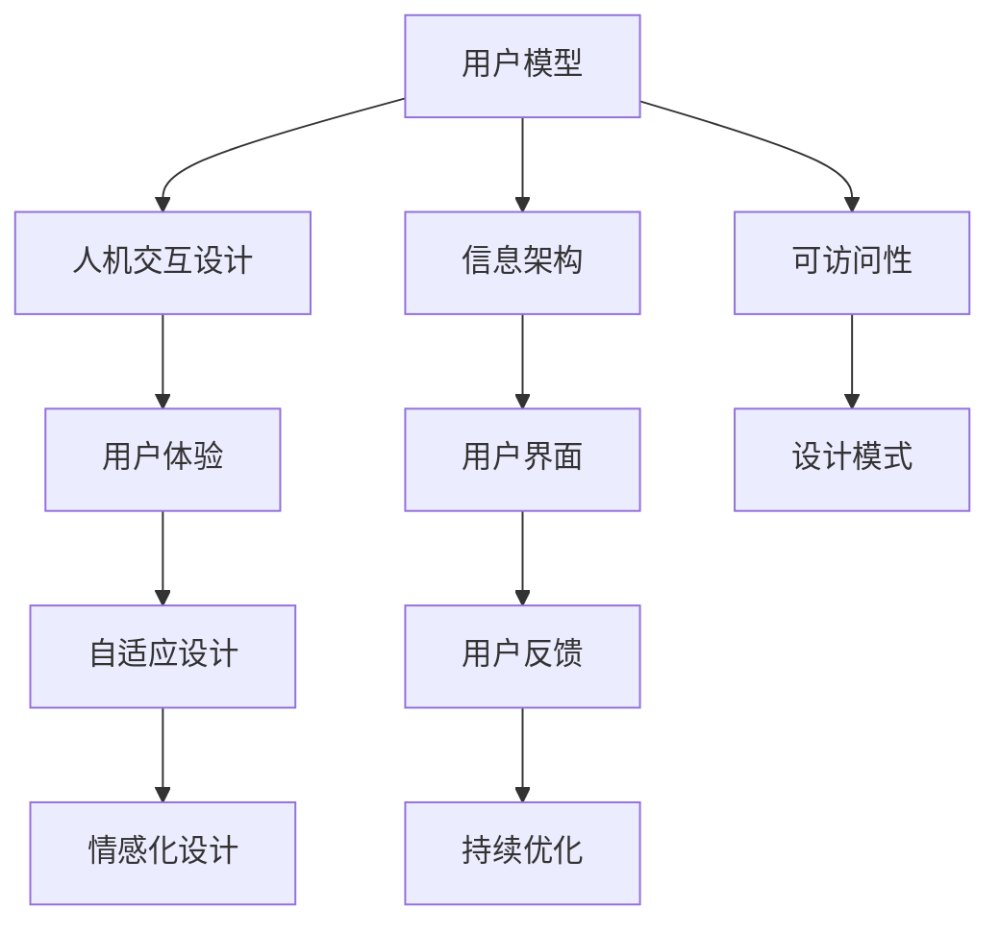

                 

# 以用户为中心：设计友好、易用的人机界面

> 关键词：用户界面(UI), 用户体验(UX), 可访问性(Accessibility), 可定制性(Customization), 自适应设计(Adaptive Design), 情感化设计(Emotion Design), 人机交互(Human-Computer Interaction), 设计模式(Design Pattern)

## 1. 背景介绍

### 1.1 问题由来

随着互联网技术的发展，数字化产品（如网站、移动应用、智能家居等）日益普及，成为了人们日常生活和工作中的重要工具。然而，尽管数字化产品的功能越来越丰富，用户界面的友好性和易用性却常常被忽视，导致用户在使用过程中感到困扰和不适，甚至产生挫败感，进而降低产品的使用率和满意度。

这不仅影响了用户体验，还可能增加用户流失率，从而影响企业的商业收益。因此，如何设计友好、易用的人机界面，成为数字产品开发中的一大挑战。本文将探讨以用户为中心的设计理念，通过深入分析核心概念和实现技术，给出一套全面的设计框架和方法，帮助开发者构建真正满足用户需求的界面。

### 1.2 问题核心关键点

用户界面设计（UI Design）的核心目标是通过视觉、交互等元素的设计，让用户在产品中使用感到愉快、高效。实现这一目标的关键点包括：

- **用户模型分析**：理解目标用户的基本需求、行为习惯、痛点和心理预期。
- **交互设计**：设计简洁、直观、易用的交互流程，减少用户的学习成本和操作负担。
- **信息架构**：合理安排信息的组织和展示，让用户能够快速找到所需信息。
- **视觉设计**：通过色彩、排版、图形等视觉元素，提升界面的美感和辨识度。
- **反馈与互动**：提供及时的反馈和互动，增强用户的参与感和满意度。
- **可访问性和可定制性**：确保界面对不同用户群体（如残障人士、老年用户等）的可访问性，并提供足够的定制选项，满足用户的个性化需求。

## 2. 核心概念与联系

### 2.1 核心概念概述

为更好地理解以用户为中心的设计方法，本节将介绍几个关键概念：

- **用户模型**：基于用户研究，定义目标用户的特征、需求和行为模式。
- **人机交互设计(Human-Computer Interaction, HCI)**：研究如何通过界面设计，增强人机间的有效沟通和互动。
- **信息架构**：一种设计信息组织方式的方法论，以用户为中心，通过层次结构、导航、搜索等手段优化信息查找。
- **用户体验(UX)**：涉及用户与产品交互的所有方面，旨在提供愉悦、高效的使用体验。
- **可访问性(Accessibility)**：确保产品对不同用户群体（如残障人士、老年用户等）的适用性，满足用户的基本需求。
- **自适应设计(Adaptive Design)**：通过设计灵活的交互模式，让用户能根据需要自由调整界面表现形式。
- **情感化设计(Emotion Design)**：利用心理学原理，通过界面元素设计激发用户情感，增强用户粘性和参与感。
- **设计模式(Design Pattern)**：一套经过验证的通用设计方法，可应用于各种产品场景，提高设计效率和效果。

这些概念之间的关系可以通过以下Mermaid流程图来展示：



这个流程图展示了一整套以用户为中心的设计过程，从用户模型出发，通过人机交互、信息架构、视觉设计等手段，最终实现用户体验的提升，并根据用户反馈不断优化。同时，自适应和情感化设计以及设计模式的应用，进一步增强了界面的灵活性和美观度。

## 3. 核心算法原理 & 具体操作步骤
### 3.1 算法原理概述

以用户为中心的设计方法，本质上是一种结合心理学、人机交互、设计理论等交叉学科的知识，旨在通过界面设计提升用户体验的算法范式。其核心原理可归纳为以下几个方面：

1. **用户研究与数据分析**：通过定性研究和定量数据分析，理解用户需求和行为特征，为设计提供数据支撑。
2. **用户模型构建**：基于用户研究，构建目标用户的详细模型，包括用户行为、偏好、认知、情感等。
3. **交互设计**：设计简洁、直观、易用的交互流程，减少用户的学习成本和操作负担，提高任务完成的效率和用户满意度。
4. **信息架构**：合理安排信息的组织和展示，让用户能够快速找到所需信息，减少认知负担。
5. **视觉设计**：通过色彩、排版、图形等视觉元素，提升界面的美感和辨识度，增强用户对产品的认同感。
6. **反馈与互动**：提供及时的反馈和互动，增强用户的参与感和满意度。
7. **可访问性和可定制性**：确保界面对不同用户群体的适用性，并提供足够的定制选项，满足用户的个性化需求。
8. **持续优化**：通过用户反馈和数据驱动的设计迭代，不断优化界面设计，提升用户体验。

### 3.2 算法步骤详解

以用户为中心的设计方法主要包括以下几个关键步骤：

**Step 1: 用户研究与数据分析**

- **用户访谈**：通过一对一访谈，深入了解目标用户的需求、行为和痛点。
- **问卷调查**：设计问卷，收集大量用户对产品功能和界面的反馈和建议。
- **可用性测试**：通过用户测试，观察和记录用户在完成任务时的行为，发现界面中的问题和瓶颈。
- **数据分析**：使用统计工具分析问卷和可用性测试数据，发现用户需求的共性和差异，形成用户画像。

**Step 2: 用户模型构建**

- **用户分群**：根据用户画像，将用户分为不同的群体，分析每个群体的需求和行为特点。
- **用户故事**：定义典型的用户故事，描述用户在特定情境下的行为流程和心理活动。
- **用户角色**：为每个用户群体设计一个角色模型，描述其在产品中的典型行为和心理状态。

**Step 3: 交互设计**

- **任务流程分析**：分析用户完成任务的流程图，设计合理的交互步骤和界面布局。
- **任务简化**：通过减少不必要的操作，优化任务流程，提升任务完成的效率和满意度。
- **反馈设计**：设计明确的反馈机制，如即时提示、成功动画等，增强用户的反馈感和成就感。
- **互动设计**：通过动态效果、互动元素等，增加用户的参与感和趣味性。

**Step 4: 信息架构**

- **信息分类**：根据信息的重要性和相关性，进行分类和组织，形成层次结构。
- **导航设计**：设计简洁明了的导航系统，让用户能够快速找到所需信息。
- **搜索优化**：提供高效的搜索功能，让用户能够迅速定位到目标信息。

**Step 5: 视觉设计**

- **色彩设计**：通过色彩搭配，传达产品的主题和情感，增强界面的吸引力和辨识度。
- **排版设计**：合理安排元素的布局和大小，提升界面的清晰度和易读性。
- **图形设计**：使用合适的图形元素，增强界面的视觉表现力和信息传递效果。

**Step 6: 可访问性和可定制性**

- **可访问性优化**：确保界面对残障人士和其他有特殊需求的用户的适用性，如支持键盘导航、文本放大等。
- **个性化定制**：提供丰富的定制选项，让用户根据自身需求调整界面风格和功能。

**Step 7: 持续优化**

- **用户反馈收集**：通过在线反馈、用户测试等方式，持续收集用户对产品的意见和建议。
- **设计迭代**：基于用户反馈，进行设计迭代，不断优化产品体验。
- **数据驱动决策**：通过数据分析，发现用户需求的变化和新兴趋势，调整设计方向。

### 3.3 算法优缺点

以用户为中心的设计方法具有以下优点：

1. **提升用户体验**：通过深入理解用户需求和行为，设计出直观、易用、高效的界面，提升用户的满意度和忠诚度。
2. **降低用户学习成本**：简洁、直观的交互流程和信息架构，帮助用户快速上手，减少学习成本。
3. **提高任务完成效率**：优化的信息架构和视觉设计，让用户能够迅速找到所需信息，提高任务完成的效率。
4. **增强用户参与感**：通过情感化设计和互动元素，增强用户的参与感和满意度。
5. **适应用户个性化需求**：提供丰富的定制选项，满足用户的个性化需求，提升产品适用性。

同时，该方法也存在一定的局限性：

1. **设计和实现成本高**：用户研究、数据收集、设计迭代等步骤，需要耗费大量时间和资源。
2. **依赖专业人才**：设计和实现过程需要专业设计师、UI/UX工程师等人才的支持，成本较高。
3. **过程复杂**：设计和实现过程较为复杂，需要团队协作和沟通，容易出错。
4. **迭代周期长**：从用户研究到设计迭代，过程周期较长，难以快速响应市场需求。

尽管存在这些局限性，但就目前而言，以用户为中心的设计方法仍是最为主流的设计范式。未来相关研究的重点在于如何进一步简化设计流程，降低成本，缩短迭代周期，同时兼顾可访问性和可定制性等因素。

### 3.4 算法应用领域

以用户为中心的设计方法，在软件开发、网站设计、移动应用开发、智能家居等多个领域得到了广泛应用，为数字化产品的设计提供了有力的支撑。

1. **软件开发**：在软件开发中，通过用户研究和使用数据分析，设计出符合用户需求的UI界面，提升开发效率和用户体验。
2. **网站设计**：网站设计中，通过信息架构和视觉设计，增强网站的导航性和吸引力，提升用户停留时间和转化率。
3. **移动应用开发**：移动应用设计中，通过简洁、直观的交互流程和信息架构，优化用户体验，增加用户粘性和满意度。
4. **智能家居设计**：智能家居设计中，通过用户模型分析和自适应设计，优化界面和交互流程，提升用户的操作便捷性和舒适感。
5. **汽车仪表盘设计**：汽车仪表盘设计中，通过情感化设计和可访问性优化，增强驾驶员的操作便利性和安全性。
6. **健康监测设备设计**：健康监测设备设计中，通过个性化定制和情感化设计，提升用户的健康管理和心理支持。

除了上述这些经典应用领域外，以用户为中心的设计方法也被创新性地应用到更多场景中，如虚拟现实、游戏设计、远程工作平台等，为数字化产品的设计带来了新的突破。

## 4. 数学模型和公式 & 详细讲解 & 举例说明
### 4.1 数学模型构建

以用户为中心的设计方法是一种复杂的设计过程，涉及多个学科的知识和技能。为了更好地理解该方法的数学基础，本节将构建一个简化版的用户界面设计数学模型。

假设用户界面的设计目标是最大化用户满意度 $U$，该满意度可以表示为用户对界面功能的满意度 $S_{\text{function}}$ 和视觉设计的满意度 $S_{\text{visual}}$ 的加权和：

$$
U = \alpha S_{\text{function}} + (1-\alpha) S_{\text{visual}}
$$

其中 $\alpha$ 为功能满意度的权重系数。

功能满意度的数学模型可以表示为任务完成效率 $E_{\text{task}}$ 和任务完成误差 $E_{\text{error}}$ 的加权和：

$$
S_{\text{function}} = E_{\text{task}} - \beta E_{\text{error}}
$$

其中 $\beta$ 为任务完成误差的权重系数。

### 4.2 公式推导过程

1. **任务完成效率 $E_{\text{task}}$**：
   任务完成效率可以通过用户操作时间 $T_{\text{operate}}$ 和任务平均难度 $D_{\text{task}}$ 来表示：
   $$
   E_{\text{task}} = \frac{1}{N} \sum_{i=1}^N \left( \frac{T_{\text{operate}}}{D_{\text{task}}} \right)
   $$
   
   其中 $N$ 为任务总数，$T_{\text{operate}}$ 为第 $i$ 个任务的执行时间，$D_{\text{task}}$ 为第 $i$ 个任务的难度。

2. **任务完成误差 $E_{\text{error}}$**：
   任务完成误差可以通过错误次数 $C_{\text{error}}$ 和任务总数 $N$ 来表示：
   $$
   E_{\text{error}} = \frac{C_{\text{error}}}{N}
   $$

3. **视觉设计满意度 $S_{\text{visual}}$**：
   视觉设计满意度可以通过用户对界面美观度和辨识度的评价 $V_{\text{visual}}$ 来表示：
   $$
   S_{\text{visual}} = \frac{1}{N} \sum_{i=1}^N V_{\text{visual}}
   $$

### 4.3 案例分析与讲解

以一个电商平台的搜索界面设计为例，分析如何通过优化任务完成效率和视觉设计，提升用户满意度。

**用户需求分析**：
- 用户需要在短时间内找到所需商品，并查看详细商品信息。
- 用户需要方便地筛选商品，如价格、品牌、评价等。
- 用户需要能够方便地保存和分享商品信息。

**界面设计优化**：
- 简化搜索界面，减少用户操作步骤，提高搜索效率。
- 设计简洁、清晰的筛选器，让用户能够快速筛选商品。
- 提供详细的商品信息展示和购买链接，减少用户在多个页面间跳转的操作。
- 使用高辨识度的颜色和排版，提升界面美观度和易读性。

**计算用户满意度**：
- 假设界面优化前，用户需要操作 5 次才能找到商品，每次操作时间为 10 秒，任务难度为 2（高）。
- 优化后，用户只需要操作 2 次，每次操作时间为 5 秒，任务难度为 1（低）。
- 用户对界面美观度的评价为 8 分（满分 10 分）。

根据上述数据，计算优化前后的用户满意度：

**优化前**：
- $E_{\text{task}} = \frac{1}{5} \sum_{i=1}^5 \left( \frac{10}{2} \right) = 10$
- $E_{\text{error}} = \frac{0}{5} = 0$
- $S_{\text{function}} = 10 - \beta \cdot 0$
- $S_{\text{visual}} = \frac{8}{5} = 1.6$

假设 $\alpha = 0.5$，则优化前的用户满意度为：
$$
U = 0.5 \cdot 10 + 0.5 \cdot 1.6 = 5.8
$$

**优化后**：
- $E_{\text{task}} = \frac{1}{2} \sum_{i=1}^2 \left( \frac{5}{1} \right) = 5$
- $E_{\text{error}} = \frac{0}{2} = 0$
- $S_{\text{function}} = 5 - \beta \cdot 0$
- $S_{\text{visual}} = \frac{8}{2} = 4$

假设 $\alpha = 0.5$，则优化后的用户满意度为：
$$
U = 0.5 \cdot 5 + 0.5 \cdot 4 = 4.5
$$

从上述计算结果可以看出，通过优化任务完成效率和视觉设计，用户满意度得到了显著提升。这正是以用户为中心的设计方法所追求的目标。

## 5. 项目实践：代码实例和详细解释说明
### 5.1 开发环境搭建

在进行界面设计实践前，我们需要准备好开发环境。以下是使用Python进行Django开发的环境配置流程：

1. 安装Anaconda：从官网下载并安装Anaconda，用于创建独立的Python环境。

2. 创建并激活虚拟环境：
```bash
conda create -n pytorch-env python=3.8 
conda activate pytorch-env
```

3. 安装Django：
```bash
pip install django
```

4. 安装Django Rest Framework（DRF）：
```bash
pip install djangorestframework
```

5. 安装Django Admin：
```bash
pip install django-admin-template
```

6. 安装其他相关库：
```bash
pip install Pillow django-paginator django-simple-history
```

完成上述步骤后，即可在`pytorch-env`环境中开始界面设计实践。

### 5.2 源代码详细实现

下面是一个简单的电商搜索界面的Django应用代码实现，包括用户界面设计和后端API接口设计：

**settings.py**：
```python
# Django settings file
```

**urls.py**：
```python
# Django URL configuration
```

**views.py**：
```python
from django.shortcuts import render
from rest_framework.views import APIView
from rest_framework.response import Response
from .models import Product

class ProductView(APIView):
    def get(self, request):
        products = Product.objects.all()
        serializer = ProductSerializer(products, many=True)
        return Response(serializer.data)

def home(request):
    context = {'products': Product.objects.all()}
    return render(request, 'home.html', context)
```

**models.py**：
```python
from django.db import models

class Product(models.Model):
    name = models.CharField(max_length=100)
    price = models.DecimalField(max_digits=10, decimal_places=2)
    description = models.TextField()

    def __str__(self):
        return self.name
```

**serializers.py**：
```python
from rest_framework import serializers
from .models import Product

class ProductSerializer(serializers.ModelSerializer):
    class Meta:
        model = Product
        fields = '__all__'
```

**home.html**：
```html
<!DOCTYPE html>
<html>
<head>
    <title>Product Search</title>
</head>
<body>
    <h1>Product Search</h1>
    <form action="/search/" method="get">
        <input type="text" name="q" placeholder="Search...">
        <button type="submit">Search</button>
    </form>
    <table>
        <thead>
            <tr>
                <th>Name</th>
                <th>Price</th>
                <th>Description</th>
            </tr>
        </thead>
        <tbody>
            
            <tr>
                <td>{{ product.name }}</td>
                <td>{{ product.price }}</td>
                <td>{{ product.description }}</td>
            </tr>
            
        </tbody>
    </table>
</body>
</html>
```

以上代码实现了一个简单的电商搜索界面，包括搜索框和商品列表。用户可以通过搜索框输入关键词，获取匹配的商品列表。同时，后台API接口可以提供商品列表的JSON数据，支持用户动态加载和搜索商品。

### 5.3 代码解读与分析

让我们再详细解读一下关键代码的实现细节：

**urls.py**：
- 定义了应用的路由规则，包括首页和商品搜索页面的URL映射。

**views.py**：
- `ProductView` 类：定义了一个基于Django Rest Framework的API视图，用于获取所有商品列表的JSON数据。
- `home` 函数：定义了一个Django视图函数，用于渲染首页的HTML模板，并传递商品列表数据。

**models.py**：
- 定义了商品模型的数据结构，包括商品名称、价格和描述等属性。

**serializers.py**：
- 定义了一个Django Rest Framework的序列化器，用于将商品模型数据转换为JSON格式，支持API接口的数据输出。

**home.html**：
- 定义了一个简单的HTML模板，包括搜索框和商品列表的HTML结构。

以上代码实现了一个基本的电商搜索界面，通过Django和Django Rest Framework，实现了前后端分离的设计。用户可以在前端界面进行搜索，后端API接口可以动态加载商品数据，支持用户动态搜索和浏览商品。

## 6. 实际应用场景
### 6.1 智能家居控制界面

智能家居控制界面的设计，需要考虑用户对设备的控制方式、操作习惯和反馈需求。通过以用户为中心的设计方法，可以设计出直观、易用的控制界面，提升用户的使用体验。

例如，通过调研用户的使用场景和习惯，可以设计出一个简洁、直观的智能家居控制界面，包括设备列表、场景设置、定时任务等功能。用户可以通过简单的拖拽操作，自由组合不同的设备，创建个性化的智能场景，如“回家模式”、“离家模式”等。同时，界面提供即时反馈和动画效果，增强用户的互动感和满足感。

### 6.2 健康监测设备界面

健康监测设备界面的设计，需要考虑用户的健康数据管理和隐私保护需求。通过以用户为中心的设计方法，可以设计出符合用户需求的健康监测界面，提升用户的健康管理和使用体验。

例如，通过调研用户的使用习惯和心理需求，可以设计出一个简洁、易于操作的健康监测界面，包括健康数据展示、运动记录、饮食记录等功能。界面提供个性化的健康建议和提醒，帮助用户更好地管理自己的健康状况。同时，界面注重隐私保护，提供数据加密和访问控制等功能，增强用户对健康数据的安全感。

### 6.3 远程工作平台界面

远程工作平台界面的设计，需要考虑用户的工作流程、协作需求和反馈体验。通过以用户为中心的设计方法，可以设计出一个高效、便捷的远程工作平台界面，提升用户的工作效率和满意度。

例如，通过调研用户的工作场景和需求，可以设计出一个简洁、直观的远程工作平台界面，包括任务管理、日程安排、团队协作等功能。界面提供高效的搜索和筛选功能，帮助用户快速找到所需信息。同时，界面注重即时反馈和互动，提供团队协作工具和即时通讯功能，增强用户的参与感和满意度。

### 6.4 未来应用展望

随着数字化产品的不断普及，以用户为中心的设计方法将发挥越来越重要的作用。未来，该方法将进一步融入更多应用场景，为数字化产品设计带来新的突破。

1. **智慧城市界面设计**：智慧城市界面的设计，需要考虑城市管理者和居民的需求和习惯。通过以用户为中心的设计方法，可以设计出直观、易用的智慧城市界面，提升城市管理者和居民的使用体验。
2. **智能交通界面设计**：智能交通界面的设计，需要考虑驾驶员和乘客的需求和习惯。通过以用户为中心的设计方法，可以设计出直观、易用的智能交通界面，提升驾驶员和乘客的使用体验。
3. **智能医疗界面设计**：智能医疗界面的设计，需要考虑患者和医生的需求和习惯。通过以用户为中心的设计方法，可以设计出直观、易用的智能医疗界面，提升患者和医生的使用体验。
4. **智能教育界面设计**：智能教育界面的设计，需要考虑学生和教师的需求和习惯。通过以用户为中心的设计方法，可以设计出直观、易用的智能教育界面，提升学生和教师的使用体验。
5. **智能娱乐界面设计**：智能娱乐界面的设计，需要考虑用户的多样化娱乐需求。通过以用户为中心的设计方法，可以设计出直观、易用的智能娱乐界面，提升用户的娱乐体验。

未来，随着技术的进步和应用场景的拓展，以用户为中心的设计方法将不断演变，为数字化产品的设计提供更全面、更深入的支持。

## 7. 工具和资源推荐
### 7.1 学习资源推荐

为了帮助开发者掌握以用户为中心的设计方法，以下是一些优质的学习资源：

1. **《Don't Make Me Think》**：这是一本经典的用户界面设计书籍，详细介绍了如何设计易用的界面，提高用户的满意度和忠诚度。

2. **《Designing Interfaces》**：这本书介绍了界面设计的各个方面，从界面布局到交互设计，提供了丰富的案例和实例。

3. **《The Design of Everyday Things》**：这是一本经典的设计理论书籍，介绍了设计思维和用户体验的原则和方法。

4. **《UX Design for Beginners》**：这是一份在线教程，适合初学者学习用户体验设计的各个方面，包括用户研究、界面设计、交互设计等。

5. **《Interaction Design Foundation》**：这是一个在线教育平台，提供丰富的用户体验设计课程和案例，适合进阶学习。

6. **《Nielsen's Usability Principles》**：这是Nielsen教授总结的用户界面设计原则，包括可访问性、易用性、简洁性等。

通过这些资源的学习实践，相信你一定能够掌握以用户为中心的设计方法，设计出友好、易用的界面。

### 7.2 开发工具推荐

高效的工具是提高设计效率的关键。以下是几款常用的用户体验设计工具：

1. **Sketch**：这是一个专业的界面设计工具，支持矢量绘图、动画效果等功能，适合设计高保真的原型图。

2. **Adobe XD**：这是另一款界面设计工具，支持交互设计和动画效果，适合设计高保真的原型图和交互原型。

3. **Figma**：这是一个在线设计工具，支持多人协作设计，适合团队合作和远程设计。

4. **InVision Studio**：这是一个设计工具，支持高保真的原型设计和动画效果，适合设计复杂的交互原型。

5. **Balsamiq**：这是一个快速原型设计工具，适合快速设计低保真的原型图。

6. **Axure RP**：这是一个快速原型设计工具，支持复杂的界面设计和交互设计。

通过合理使用这些工具，可以显著提升用户体验设计的工作效率，加快创新迭代的步伐。

### 7.3 相关论文推荐

用户体验设计领域的理论和实践不断发展，以下是几篇重要的相关论文，推荐阅读：

1. **《Designing Interactive Systems》**：这本书介绍了交互设计的基本原理和方法，适合初学者学习。

2. **《Interaction Design: Building Applications and Devices for Human Use》**：这本书介绍了交互设计的应用，包括界面设计、交互设计、用户测试等。

3. **《User-Centered Design》**：这是一本经典的用户界面设计书籍，介绍了用户中心设计的各个方面。

4. **《Design Patterns: Elements of Reusable Object-Oriented Software》**：这本书介绍了经典的设计模式，适合深入学习界面设计中的可重用设计。

5. **《Designing User Interfaces》**：这是一本经典的用户界面设计书籍，介绍了界面设计的各个方面，包括布局、颜色、字体等。

这些论文代表了大用户体验设计的发展脉络。通过学习这些前沿成果，可以帮助研究者把握学科前进方向，激发更多的创新灵感。

## 8. 总结：未来发展趋势与挑战
### 8.1 研究成果总结

以用户为中心的设计方法，经过多年的发展和实践，已经成为用户体验设计的重要范式。其主要研究成果包括：

1. **用户模型分析**：通过用户研究，理解用户需求和行为特征，为设计提供数据支撑。
2. **交互设计优化**：通过简化操作流程和优化任务流程，提升用户任务完成的效率和满意度。
3. **信息架构设计**：通过合理安排信息的组织和展示，减少用户认知负担，提升信息查找效率。
4. **视觉设计提升**：通过色彩、排版、图形等视觉元素，提升界面的美观度和易读性，增强用户对产品的认同感。
5. **反馈与互动设计**：通过提供及时的反馈和互动，增强用户的参与感和满意度。
6. **可访问性和可定制性**：确保界面对不同用户群体的适用性，并提供丰富的定制选项，满足用户的个性化需求。
7. **持续优化**：通过用户反馈和数据驱动的设计迭代，不断优化界面设计，提升用户体验。

### 8.2 未来发展趋势

展望未来，以用户为中心的设计方法将呈现以下几个发展趋势：

1. **多设备协同设计**：随着智能设备的普及，用户在不同设备上的行为和需求存在差异。未来设计将更加注重多设备协同，提供一致、流畅的用户体验。
2. **个性化设计**：通过数据分析和机器学习，设计出更加个性化的界面，满足用户的个性化需求，提升用户满意度和粘性。
3. **自适应设计**：通过自适应设计技术，根据用户的环境和偏好，动态调整界面表现形式，提供更加个性化和灵活的使用体验。
4. **情感化设计**：利用心理学原理，通过界面元素设计激发用户情感，增强用户粘性和参与感。
5. **人机交互的深度融合**：通过增强现实(AR)、虚拟现实(VR)等技术，实现人机交互的深度融合，提升用户沉浸感和互动感。
6. **用户生成内容(UGC)**：利用用户生成内容，增强界面的设计和互动性，提升用户的参与感和满意度。

### 8.3 面临的挑战

尽管以用户为中心的设计方法已经取得了显著成就，但在迈向更加智能化、普适化应用的过程中，仍面临诸多挑战：

1. **设计成本高**：用户研究、数据分析、设计迭代等步骤，需要耗费大量时间和资源。
2. **依赖专业人才**：设计和实现过程需要专业设计师、UI/UX工程师等人才的支持，成本较高。
3. **过程复杂**：设计和实现过程较为复杂，需要团队协作和沟通，容易出错。
4. **迭代周期长**：从用户研究到设计迭代，过程周期较长，难以快速响应市场需求。
5. **数据隐私和安全**：在设计过程中，需要考虑用户数据的隐私和安全问题，保护用户隐私。
6. **跨领域设计**：设计过程中需要考虑不同领域的需求和特点，设计难度较大。

尽管存在这些挑战，但通过不断的技术创新和理论研究，这些难题终将逐步被克服，以用户为中心的设计方法必将在数字化产品的设计中发挥越来越重要的作用。

### 8.4 研究展望

未来，以用户为中心的设计方法需要在以下几个方面寻求新的突破：

1. **设计自动化**：通过自动化设计工具和技术，提高设计效率和精度，降低人工成本。
2. **数据驱动设计**：通过数据分析和机器学习，设计出更加个性化和智能化的界面，满足用户的个性化需求。
3. **多学科融合**：将设计理论与心理学、社会学、工程学等学科相结合，提升设计的多样性和深度。
4. **人机交互的进化**：通过增强现实、虚拟现实等技术，实现人机交互的深度融合，提升用户沉浸感和互动感。
5. **用户生成内容**：利用用户生成内容，增强界面的设计和互动性，提升用户的参与感和满意度。
6. **跨领域应用**：将设计方法应用于更多领域，如医疗、教育、交通等，提升各领域的信息化和智能化水平。

总之，以用户为中心的设计方法将继续引领用户体验设计的未来发展，为数字化产品的设计提供更全面、更深入的支持。

## 9. 附录：常见问题与解答

**Q1：以用户为中心的设计方法是否适用于所有数字化产品？**

A: 以用户为中心的设计方法适用于大多数数字化产品，特别是需要与人交互的产品。但对于一些无需用户交互的产品，如智能传感器、自动化设备等，可能不需要进行详细的设计，但也需要考虑产品的易用性和安全性。

**Q2：用户模型如何构建？**

A: 构建用户模型需要从多个角度入手，包括用户的基本信息、行为特征、需求和心理预期等。可以通过用户访谈、问卷调查、可用性测试等方法获取用户数据，使用数据挖掘和统计分析工具构建用户模型。

**Q3：如何设计高效的用户界面？**

A: 设计高效的用户界面需要从用户需求出发，简化操作流程、优化任务流程、合理安排信息的组织和展示、使用简洁、直观的视觉设计元素等。同时，还需要注重即时反馈和互动，增强用户的参与感和满意度。

**Q4：如何设计可访问性友好的界面？**

A: 设计可访问性友好的界面需要考虑残障人士、老年用户等不同用户群体的需求。可以设计易于导航的界面、提供高对比度模式、支持键盘导航、提供文本放大等功能，确保界面对所有用户群体适用。

**Q5：如何评估用户体验？**

A: 评估用户体验可以采用多种方法，包括用户测试、问卷调查、行为分析等。可以通过测试用户的使用行为和反馈，了解用户的满意度和问题，指导后续设计优化。

**Q6：如何实现用户界面的自适应设计？**

A: 实现用户界面的自适应设计需要考虑不同用户的环境和偏好，设计灵活的交互模式。可以使用JavaScript、CSS等技术，动态调整界面元素的大小和布局，提供个性化的用户界面。

以上问题及解答帮助初学者更好地理解以用户为中心的设计方法，希望这些内容对你有所启发。

---

作者：禅与计算机程序设计艺术 / Zen and the Art of Computer Programming

