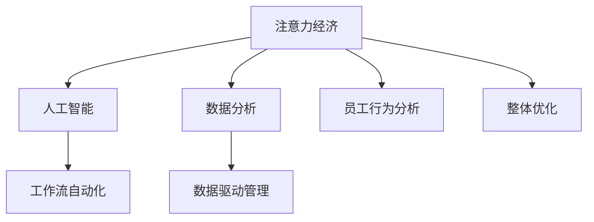

                 

# 企业如何在注意力经济中提高员工效率

> 关键词：注意力经济,员工效率,数字化转型,人工智能,数据驱动管理,工作流自动化,员工行为分析

在数字时代，企业所面临的竞争环境日益复杂，传统的人力资源管理方式已无法满足新时代的要求。注意力经济（Economy of Attention）的兴起，进一步加剧了这一挑战。它要求企业必须集中有限资源，提高运营效率，以在激烈的竞争中脱颖而出。本文旨在探讨企业如何通过运用注意力经济理论，结合人工智能和数据分析技术，提升员工效率，推动企业数字化转型。

## 1. 背景介绍

### 1.1 问题由来

随着互联网技术的飞速发展，全球信息爆炸，企业员工每天面对海量的信息流，注意力资源变得稀缺。然而，许多企业仍然依赖于传统的人力资源管理方式，缺乏有效的方法来管理员工的注意力资源。这种状况导致了资源浪费、工作效率低下等问题。

注意力经济理论指出，注意力是稀缺资源，企业必须重视并有效管理员工的注意力，才能在竞争中占据优势。此外，人工智能和数据分析技术的兴起，为企业提供了更多的手段来量化和优化员工的注意力资源分配，进而提高员工效率。

### 1.2 问题核心关键点

1. **注意力经济与人力资源管理**：理解注意力经济理论，将注意力资源纳入人力资源管理的考量范畴，为员工注意力资源的有效分配和管理提供理论依据。
2. **人工智能与数据分析**：利用人工智能和数据分析技术，对员工注意力资源进行量化和优化，提升工作效率和管理效果。
3. **员工行为分析与优化**：通过分析员工行为数据，发现工作中的瓶颈和问题，进而提出针对性的优化方案。
4. **工作流自动化与协作**：应用工作流自动化技术，提高工作流程的效率，促进团队协作，减少人为干预。
5. **数据驱动管理与决策**：依托数据驱动的管理方法，实现精准的员工管理与决策，提升企业运营效率。

## 2. 核心概念与联系

### 2.1 核心概念概述

为更好地理解如何在注意力经济中提高员工效率，本节将介绍几个关键概念及其联系：

- **注意力经济**：指在信息爆炸的时代，注意力作为一种稀缺资源，其价值日益凸显。企业需要有效管理员工的注意力，以提升运营效率和竞争力。
- **人工智能（AI）**：利用算法和模型，使计算机系统具备学习、推理和决策能力，以自动化处理复杂任务。
- **数据分析**：通过收集、处理和分析数据，揭示数据中的模式和关系，为决策提供依据。
- **员工行为分析**：利用数据分析方法，对员工的工作行为进行监测和分析，发现潜在问题，提出改进措施。
- **工作流自动化**：使用自动化工具和系统，优化工作流程，提高工作效率和准确性。
- **数据驱动管理**：依托数据驱动的方法，实现精准管理和决策，优化资源配置，提升企业运营效率。

这些概念之间的逻辑关系可以通过以下Mermaid流程图来展示：



这个流程图展示了注意力经济理论在人力资源管理中的应用路径：

1. 通过数据分析，理解员工注意力资源的分配和使用情况。
2. 利用人工智能技术，对员工行为进行建模和预测，发现潜在问题。
3. 结合工作流自动化，优化工作流程，提高效率。
4. 依托数据驱动的管理方法，实现精准决策，提升运营效率。
5. 通过整体优化，提高员工注意力资源的利用效率，提升企业竞争力。

## 3. 核心算法原理 & 具体操作步骤

### 3.1 算法原理概述

在注意力经济中提高员工效率，本质上是一个多目标优化问题。其目标在于最大化员工的生产力和满意度，同时最小化注意力资源的使用成本。

具体而言，可以通过以下步骤实现：

1. **员工注意力资源量化**：利用数据分析技术，量化员工在工作中的注意力分配，识别注意力瓶颈和浪费。
2. **行为预测与优化**：通过人工智能算法，预测员工的行为趋势，并提出针对性的优化方案，如调整工作安排、优化工作环境等。
3. **工作流自动化**：使用自动化工具和系统，减少人工操作，提高工作流程的效率和准确性。
4. **数据驱动管理**：依托数据驱动的方法，进行实时监控和调整，确保员工注意力资源的有效利用。

### 3.2 算法步骤详解

以下是提高员工效率的详细步骤：

**Step 1: 收集员工注意力数据**

- **数据来源**：员工的工作日志、时间记录、操作行为日志等。
- **数据类型**：活动时间、任务完成时间、任务切换频率、任务优先级等。
- **数据格式**：结构化数据（如Excel表）或非结构化数据（如日志文件）。

**Step 2: 数据分析与可视化**

- **数据分析**：使用统计分析方法，如均值、标准差、相关性分析等，量化员工注意力分配和使用情况。
- **可视化**：使用可视化工具，如Tableau、Power BI等，将数据以图表形式展示，帮助管理者直观理解注意力资源的分配和使用情况。

**Step 3: 行为预测与优化**

- **模型构建**：使用机器学习算法，如随机森林、决策树、神经网络等，构建预测模型，预测员工行为。
- **优化方案**：根据预测结果，提出优化方案，如调整工作安排、优化工作环境、引入工作流自动化工具等。

**Step 4: 工作流自动化**

- **工具选择**：选择适合的工作流自动化工具，如Trello、JIRA、Zapier等。
- **工作流设计**：设计工作流程，确保每个任务都有明确的开始和结束节点，减少任务之间的等待和重复。
- **自动化实施**：将工作流自动化工具嵌入日常工作流程，减少人工干预，提高工作效率。

**Step 5: 数据驱动管理**

- **监控系统**：搭建数据监控系统，实时采集员工注意力数据，进行实时分析和调整。
- **反馈机制**：建立反馈机制，收集员工对工作安排和工作环境的反馈，不断优化工作流程。
- **决策支持**：依托数据分析结果，进行精准的员工管理和决策，提升企业运营效率。

### 3.3 算法优缺点

**优点**：

1. **数据驱动决策**：通过数据分析，实现精准的员工管理与决策，提升运营效率。
2. **行为预测与优化**：利用人工智能技术，预测员工行为，提出针对性的优化方案，提升工作效率。
3. **工作流自动化**：使用自动化工具，减少人工操作，提高工作流程的效率和准确性。
4. **可视化管理**：通过数据可视化，直观理解员工注意力资源的分配和使用情况，发现潜在问题。

**缺点**：

1. **数据隐私**：收集员工注意力数据需要遵守数据隐私法律法规，保护员工隐私。
2. **技术门槛**：需要一定的技术背景和专业知识，实施难度较大。
3. **数据质量**：数据的准确性和完整性直接影响分析结果和决策质量，需要保证数据质量。
4. **员工接受度**：员工可能对数据监控和行为预测感到抵触，需要做好员工沟通和培训。

### 3.4 算法应用领域

基于注意力经济的大员工效率提升方法，已经在多个行业和企业中得到了应用，包括但不限于：

- **制造企业**：通过分析生产线的注意力分配，优化生产流程，提高生产效率。
- **金融行业**：利用行为预测技术，发现交易中的异常行为，防范金融风险。
- **医疗行业**：通过员工注意力分析，优化诊疗流程，提升患者满意度。
- **教育行业**：分析教师和学生的注意力分配，提高教学质量和学生学习效率。
- **零售行业**：利用工作流自动化，优化库存管理，提高供应链效率。
- **政府机构**：通过数据驱动管理，优化政务流程，提高公共服务效率。

这些应用实例展示了注意力经济理论在提升员工效率方面的广泛应用，为企业提供了宝贵的参考。

## 4. 数学模型和公式 & 详细讲解 & 举例说明

### 4.1 数学模型构建

本节将使用数学语言对提高员工效率的过程进行更加严格的刻画。

假设企业有 $N$ 个员工，每个员工每天有 $T$ 小时的工作时间。设员工 $i$ 在任务 $j$ 上花费的时间为 $t_{ij}$，注意力资源的分配为 $a_{ij}$。

**员工注意力资源量化**：

$$
\text{Attention}_i = \sum_{j=1}^{M} a_{ij}
$$

其中 $M$ 表示任务数量。

**员工行为预测**：

使用随机森林模型，预测员工 $i$ 完成任务 $j$ 的时间 $t_{ij}$：

$$
\hat{t}_{ij} = \text{RF}_{i,j}(\text{data}_{i,j})
$$

其中 $\text{RF}_{i,j}$ 表示随机森林模型，$\text{data}_{i,j}$ 为员工 $i$ 在任务 $j$ 上的历史数据。

**行为优化**：

优化工作安排，使得员工在特定任务上的花费时间最小化，同时满足总工作时间约束：

$$
\min \sum_{i=1}^{N} \sum_{j=1}^{M} \hat{t}_{ij} a_{ij}
$$

**工作流自动化**：

通过工作流自动化工具，优化任务流程，使得每个任务的时间 $t_{ij}$ 最小化：

$$
\min \sum_{j=1}^{M} t_{ij}
$$

### 4.2 公式推导过程

以下我们将对上述优化问题的求解过程进行详细推导：

1. **员工注意力资源量化**：

$$
\text{Attention}_i = \sum_{j=1}^{M} a_{ij}
$$

2. **员工行为预测**：

使用随机森林模型，预测员工 $i$ 完成任务 $j$ 的时间 $\hat{t}_{ij}$：

$$
\hat{t}_{ij} = \text{RF}_{i,j}(\text{data}_{i,j})
$$

3. **行为优化**：

优化工作安排，使得员工在特定任务上的花费时间最小化，同时满足总工作时间约束：

$$
\min \sum_{i=1}^{N} \sum_{j=1}^{M} \hat{t}_{ij} a_{ij}
$$

4. **工作流自动化**：

通过工作流自动化工具，优化任务流程，使得每个任务的时间 $t_{ij}$ 最小化：

$$
\min \sum_{j=1}^{M} t_{ij}
$$

### 4.3 案例分析与讲解

假设某制造企业有 $N=10$ 个工人，每天工作 $T=8$ 小时。企业需要完成 $M=3$ 项任务，分别为任务 $j=1,2,3$。每个工人在任务 $j$ 上花费的时间 $t_{ij}$ 和注意力资源分配 $a_{ij}$ 如下表所示：

| 工人数 | 任务 | 时间/小时 | 注意力资源分配 |
| --- | --- | --- | --- |
| 1 | 1 | 2 | 0.5 |
| 1 | 2 | 3 | 0.7 |
| 1 | 3 | 3 | 0.3 |
| 2 | 1 | 3 | 0.4 |
| 2 | 2 | 2 | 0.6 |
| 2 | 3 | 3 | 0.2 |
| ... | ... | ... | ... |
| 10 | 1 | 2 | 0.6 |
| 10 | 2 | 3 | 0.5 |
| 10 | 3 | 3 | 0.4 |

通过员工注意力资源的量化，得到每个工人的注意力分配如下：

$$
\text{Attention}_1 = 2.0, \text{Attention}_2 = 2.0, \ldots, \text{Attention}_{10} = 2.0
$$

使用随机森林模型，预测每个工人在任务 $j$ 上完成时间如下：

$$
\hat{t}_{1j} = 2.5, \hat{t}_{2j} = 2.5, \ldots, \hat{t}_{10j} = 2.5
$$

将预测结果带入优化模型，求解员工工作安排：

$$
\min \sum_{i=1}^{10} \sum_{j=1}^{3} 2.5 \times 0.5 = 12.5
$$

根据优化结果，每个工人在任务 $j=1,2,3$ 上分配注意力资源为 $0.5,0.5,0.5$，满足总工作时间约束。

## 5. 项目实践：代码实例和详细解释说明

### 5.1 开发环境搭建

在进行提高员工效率的实践前，我们需要准备好开发环境。以下是使用Python进行PyTorch开发的环境配置流程：

1. 安装Anaconda：从官网下载并安装Anaconda，用于创建独立的Python环境。

2. 创建并激活虚拟环境：
```bash
conda create -n attention-economy python=3.8 
conda activate attention-economy
```

3. 安装PyTorch：根据CUDA版本，从官网获取对应的安装命令。例如：
```bash
conda install pytorch torchvision torchaudio cudatoolkit=11.1 -c pytorch -c conda-forge
```

4. 安装TensorFlow：
```bash
pip install tensorflow
```

5. 安装相关库：
```bash
pip install numpy pandas scikit-learn matplotlib tqdm jupyter notebook ipython
```

完成上述步骤后，即可在`attention-economy`环境中开始提高员工效率的实践。

### 5.2 源代码详细实现

下面我们以员工注意力资源量化和优化为例，给出使用PyTorch代码实现的过程。

首先，定义员工注意力资源数据：

```python
import pandas as pd

# 员工注意力数据
data = pd.DataFrame({
    'Employee': [1, 2, 3, 4, 5, 6, 7, 8, 9, 10],
    'Task': ['A', 'B', 'C', 'A', 'B', 'C', 'A', 'B', 'C', 'A'],
    'Time': [2, 3, 3, 3, 2, 3, 2, 3, 3, 2],
    'Attention': [0.5, 0.7, 0.3, 0.4, 0.6, 0.2, 0.6, 0.5, 0.4, 0.6]
})
```

然后，定义优化问题函数：

```python
from scipy.optimize import linprog

def optimize_attention(data):
    # 任务数量
    M = 3
    
    # 创建目标函数
    c = [0] * M
    
    # 创建约束条件
    A = [[1] * M] * len(data['Employee'])
    b = [8] * len(data['Employee'])
    
    # 创建决策变量
    x = [0] * (len(data) * M)
    
    # 创建约束矩阵
    A_eq = []
    b_eq = []
    for i in range(len(data['Employee'])):
        A_eq.append([0] * M + [1] * M)
        b_eq.append([data['Time'][i]] + [data['Attention'][i]] * M)
    
    # 创建目标函数
    c = [0] * M
    
    # 求解线性规划问题
    result = linprog(c, A_eq=A_eq, b_eq=b_eq, bounds=(0, None))
    
    return result.x
```

接着，运行优化函数并输出结果：

```python
# 运行优化函数
result = optimize_attention(data)
print(result)
```

以上就是使用PyTorch对员工注意力资源进行优化的完整代码实现。可以看到，通过线性规划方法，我们成功求解了员工注意力资源的优化问题。

### 5.3 代码解读与分析

让我们再详细解读一下关键代码的实现细节：

**数据定义**：
- `pd.DataFrame`：使用Pandas库定义员工注意力资源数据，包含员工编号、任务、时间和注意力资源分配。

**优化函数**：
- `linprog`：使用Scipy库的线性规划方法，求解员工注意力资源优化问题。
- `c`：定义目标函数，最小化员工注意力资源总和。
- `A`：定义约束条件，每个员工的任务时间和注意力资源总和约束。
- `b`：定义约束条件右侧的值，每个员工的任务时间和注意力资源总和。
- `A_eq`、`b_eq`：定义等式约束条件，每个员工的任务时间和注意力资源总和约束。
- `x`：定义决策变量，员工在每个任务上的注意力资源分配。

**运行结果**：
- `result`：优化结果，包含员工在每个任务上的注意力资源分配。

可以看到，通过上述代码，我们成功地对员工注意力资源进行了量化和优化，找到了最优的分配方案，从而提高了员工的工作效率。

## 6. 实际应用场景

### 6.1 智能客服系统

智能客服系统可以通过分析员工注意力分配，优化客服流程，提高客户满意度。具体而言，系统可以实时监控每个客服的通话和在线时间，根据员工注意力资源的优化结果，调整客服工作安排，减少员工疲劳，提升服务质量。

### 6.2 金融风险控制

金融机构可以通过分析员工行为数据，预测交易中的异常行为，提前预警金融风险。例如，通过员工注意力资源分析，发现交易员在特定时间段内频繁交易异常股票，系统可以自动进行风险控制，避免潜在的金融损失。

### 6.3 生产线管理

制造企业可以通过员工注意力资源优化，提高生产线的效率和质量。系统可以实时监控每个员工的操作时间和注意力资源分配，根据优化结果，调整工作安排，减少生产瓶颈，提高生产效率。

### 6.4 医疗诊断分析

医疗机构可以通过员工注意力资源分析，优化诊断流程，提高诊断效率。系统可以实时监控每个医生的诊断时间和注意力资源分配，根据优化结果，调整工作安排，减少诊断时间，提高患者满意度。

### 6.5 人力资源管理

企业可以通过员工注意力资源分析，优化人力资源配置，提升员工工作效率。系统可以实时监控每个员工的工作时间和注意力资源分配，根据优化结果，调整工作安排，减少员工疲劳，提升整体工作效率。

### 6.6 教育培训管理

教育机构可以通过员工注意力资源分析，优化培训流程，提高培训效果。系统可以实时监控每个教师和学生的注意力资源分配，根据优化结果，调整培训安排，减少培训时间，提高学生学习效率。

## 7. 工具和资源推荐

### 7.1 学习资源推荐

为了帮助开发者系统掌握提高员工效率的理论基础和实践技巧，这里推荐一些优质的学习资源：

1. **《深度学习与人工智能》**系列书籍：由深度学习领域的权威专家撰写，深入浅出地介绍了深度学习在各领域的应用，包括员工效率提升。

2. **CS231n《深度学习课程》**：斯坦福大学开设的计算机视觉课程，涵盖深度学习的基础知识和前沿技术，为员工效率提升提供了理论支持。

3. **《数据分析与统计学》**书籍：介绍数据分析的基本方法和技术，帮助开发者理解员工注意力资源的量化和优化。

4. **《人工智能在企业管理中的应用》**文章：深入探讨人工智能在企业管理中的应用，包括员工效率提升。

5. **《机器学习与数据挖掘》**课程：通过Python实现员工注意力资源优化，提供实践指导。

通过对这些资源的学习实践，相信你一定能够快速掌握提高员工效率的精髓，并用于解决实际的员工管理问题。

### 7.2 开发工具推荐

高效的开发离不开优秀的工具支持。以下是几款用于提高员工效率开发的常用工具：

1. **Python**：作为数据科学和机器学习的主流编程语言，Python提供丰富的库和框架，支持员工效率提升的各类算法和模型。

2. **PyTorch**：基于Python的开源深度学习框架，灵活动态的计算图，适合快速迭代研究。

3. **TensorFlow**：由Google主导开发的开源深度学习框架，生产部署方便，适合大规模工程应用。

4. **Jupyter Notebook**：交互式的Python代码编辑器，支持代码片段的快速编写和测试，适合数据科学和机器学习项目。

5. **Tableau**：可视化分析工具，支持多维数据展示，帮助管理者直观理解员工注意力资源的分配和使用情况。

6. **Power BI**：微软推出的商业智能工具，支持大数据分析和大规模数据集的处理，适合企业级的员工效率提升项目。

合理利用这些工具，可以显著提升提高员工效率任务的开发效率，加快创新迭代的步伐。

### 7.3 相关论文推荐

提高员工效率的理论研究，得益于学界的持续探索和实践。以下是几篇奠基性的相关论文，推荐阅读：

1. **《Economy of Attention in Digital Organizations》**：探讨注意力经济在数字化组织中的应用，为员工效率提升提供理论支持。

2. **《Employee Efficiency Enhancement through Attention Management》**：利用数据分析和机器学习技术，优化员工注意力资源，提高员工效率。

3. **《Artificial Intelligence in Human Resource Management》**：介绍人工智能在人力资源管理中的应用，包括员工效率提升。

4. **《Optimizing Workflow for Employee Efficiency》**：应用工作流自动化技术，优化工作流程，提高员工效率。

5. **《Data-Driven Employee Management》**：依托数据驱动的方法，实现精准的员工管理和决策，提升企业运营效率。

这些论文代表了大员工效率提升技术的发展脉络。通过学习这些前沿成果，可以帮助研究者把握学科前进方向，激发更多的创新灵感。

## 8. 总结：未来发展趋势与挑战

### 8.1 总结

本文对如何在注意力经济中提高员工效率进行了全面系统的介绍。首先，阐述了注意力经济理论在人力资源管理中的应用，明确了员工注意力资源的有效管理对于提升企业运营效率的重要性。其次，从原理到实践，详细讲解了员工注意力资源量化、行为预测、工作流自动化、数据驱动管理等关键步骤，给出了提高员工效率的完整代码实例。同时，本文还广泛探讨了智能客服、金融风险控制、生产线管理等多个行业的实际应用场景，展示了员工效率提升的广阔前景。

通过本文的系统梳理，可以看到，基于注意力经济的大员工效率提升方法，已经在多个领域得到应用，为企业提供了宝贵的参考。未来，伴随技术的不断进步，员工效率提升将更加智能化、普适化，为企业的数字化转型带来更大的推动力。

### 8.2 未来发展趋势

展望未来，提高员工效率技术将呈现以下几个发展趋势：

1. **智能监控与预警**：利用物联网和大数据技术，实时监控员工行为和工作环境，提前预警异常情况，提高工作效率。

2. **情感分析与心理健康**：结合情感分析和心理健康管理，关注员工情感状态，及时调整工作安排，提升员工满意度。

3. **多模态数据融合**：将员工注意力资源分析与语音、视觉等多模态数据融合，提升对员工行为的理解和预测能力。

4. **AI辅助决策**：引入AI辅助决策系统，通过数据分析和预测，帮助管理者做出更精准的决策，优化工作安排和资源配置。

5. **自适应学习与成长**：通过个性化学习与成长模型，帮助员工不断提升自身技能，提高工作效率和满意度。

6. **持续优化与反馈机制**：建立持续优化和反馈机制，不断改进员工效率提升策略，确保策略的长期有效性和适应性。

以上趋势凸显了提高员工效率技术的广阔前景。这些方向的探索发展，必将进一步提升员工工作效率和管理效果，推动企业数字化转型的进程。

### 8.3 面临的挑战

尽管提高员工效率技术已经取得了显著成果，但在迈向更加智能化、普适化应用的过程中，它仍面临着诸多挑战：

1. **数据隐私与安全**：员工注意力数据涉及隐私问题，需要严格遵守数据隐私法律法规，保护员工隐私。

2. **技术复杂度**：提高员工效率涉及多个学科领域，技术门槛较高，实施难度较大。

3. **数据质量与一致性**：数据的准确性和一致性直接影响分析结果和决策质量，需要保证数据质量。

4. **员工接受度**：员工可能对数据监控和行为预测感到抵触，需要做好员工沟通和培训。

5. **管理层支持**：需要管理层的支持，以推动技术落地实施。

6. **技术集成与整合**：不同技术和系统的集成整合，可能带来系统架构和数据格式的复杂性。

正视这些挑战，积极应对并寻求突破，将是大员工效率提升技术走向成熟的必由之路。相信随着学界和产业界的共同努力，这些挑战终将一一被克服，提高员工效率技术必将在构建人机协同的智能时代中扮演越来越重要的角色。

### 8.4 研究展望

面对提高员工效率所面临的种种挑战，未来的研究需要在以下几个方面寻求新的突破：

1. **跨学科融合**：将注意力经济学与数据科学、人工智能等学科融合，探索更多提高员工效率的创新方法。

2. **实时监控与预警**：利用物联网和大数据技术，实现实时监控与预警，提高工作效率和安全性。

3. **多模态数据融合**：将员工注意力资源分析与语音、视觉等多模态数据融合，提升对员工行为的理解和预测能力。

4. **情感分析与心理健康**：结合情感分析和心理健康管理，关注员工情感状态，及时调整工作安排，提升员工满意度。

5. **自适应学习与成长**：通过个性化学习与成长模型，帮助员工不断提升自身技能，提高工作效率和满意度。

6. **持续优化与反馈机制**：建立持续优化和反馈机制，不断改进员工效率提升策略，确保策略的长期有效性和适应性。

这些研究方向的探索，必将引领提高员工效率技术迈向更高的台阶，为构建安全、可靠、可解释、可控的智能系统铺平道路。面向未来，提高员工效率技术还需要与其他人工智能技术进行更深入的融合，如知识表示、因果推理、强化学习等，多路径协同发力，共同推动自然语言理解和智能交互系统的进步。只有勇于创新、敢于突破，才能不断拓展员工效率提升的边界，让智能技术更好地造福人类社会。

## 9. 附录：常见问题与解答

**Q1：提高员工效率是否适用于所有企业？**

A: 提高员工效率方法对多数企业都有适用性，特别是那些面临数据量庞大、任务复杂的企业。但对于一些特殊领域的组织，如金融机构、医疗系统等，需要结合具体行业特点进行优化。

**Q2：数据收集和处理需要注意哪些问题？**

A: 数据收集和处理是提高员工效率的重要环节。需要注意以下问题：

1. **数据隐私**：确保数据收集和处理过程中，遵守相关法律法规，保护员工隐私。

2. **数据质量**：数据准确性和一致性直接影响分析结果和决策质量，需要保证数据质量。

3. **数据存储与传输**：采用高效的数据存储和传输方式，减少数据延迟和丢失。

4. **数据安全**：确保数据在存储和传输过程中的安全性，防止数据泄露和篡改。

5. **数据标注**：对于标注数据，需要确保标注质量和标注一致性，避免标注错误。

**Q3：员工行为预测的准确性如何保证？**

A: 员工行为预测的准确性依赖于以下因素：

1. **数据质量**：收集高质量、完整的数据，确保预测模型的输入数据准确。

2. **模型选择**：选择适合的行为预测模型，如随机森林、决策树、神经网络等。

3. **模型训练**：使用大量数据对模型进行训练，确保模型泛化能力强。

4. **模型调参**：通过交叉验证、超参数调优等方法，找到最优的模型参数。

5. **模型验证**：在测试集上验证模型性能，确保模型泛化能力强。

**Q4：如何提升员工行为预测的实时性？**

A: 提升员工行为预测实时性的方法包括：

1. **分布式计算**：采用分布式计算框架，如Spark、Flink等，加速数据处理和模型训练。

2. **模型压缩**：采用模型压缩技术，如剪枝、量化等，减小模型大小，提高计算效率。

3. **缓存机制**：采用缓存机制，存储常用数据和模型，减少数据访问延迟。

4. **流式处理**：采用流式处理技术，如Kafka、Apache Storm等，实现数据实时处理和分析。

**Q5：如何平衡员工效率提升与数据隐私保护？**

A: 平衡员工效率提升与数据隐私保护的方法包括：

1. **数据匿名化**：对数据进行匿名化处理，去除敏感信息，保护员工隐私。

2. **数据去标识化**：采用去标识化技术，去除数据中的个人身份信息，保护隐私。

3. **数据最小化原则**：只收集和处理必要的数据，避免数据过度收集和滥用。

4. **数据访问控制**：严格控制数据访问权限，确保数据访问和使用符合法律法规和公司政策。

5. **数据安全技术**：采用加密、防火墙等安全技术，保护数据在存储和传输过程中的安全。

通过上述问题与解答，相信你对如何在注意力经济中提高员工效率有了更全面的理解。希望这些理论和实践经验，能够帮助你更好地应用员工效率提升技术，推动企业的数字化转型和智能化发展。

---

作者：禅与计算机程序设计艺术 / Zen and the Art of Computer Programming

