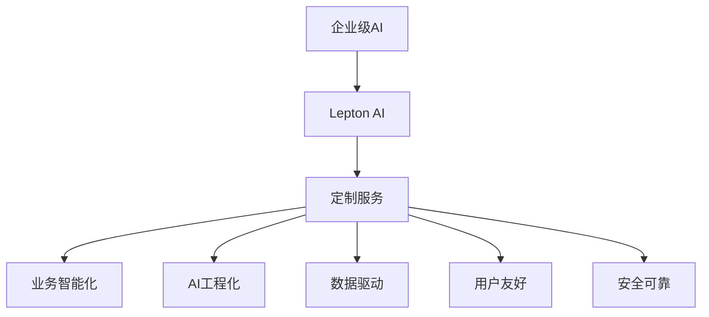

                 

# 企业级AI解决方案：Lepton AI的定制服务

> 关键词：企业级AI, Lepton AI, 定制服务, 业务智能化, AI工程化

## 1. 背景介绍

### 1.1 问题由来
随着数字化转型的浪潮席卷全球，越来越多的企业开始意识到人工智能(AI)的重要性。AI技术可以帮助企业提升运营效率，优化产品服务，提升用户体验，从而在激烈的市场竞争中占据有利地位。然而，大多数企业面临的挑战是如何将AI技术落地，并实现真正的商业价值。

Lepton AI作为一家领先的AI技术提供商，专注于为企业提供定制化的AI解决方案，帮助企业快速构建和部署AI系统。Lepton AI的核心优势在于其强大的AI技术研发能力、丰富的行业经验以及对AI技术的深入理解。通过与企业的紧密合作，Lepton AI能够为企业量身定制符合其业务需求的AI解决方案，从而真正实现AI的价值转化。

### 1.2 问题核心关键点
Lepton AI的定制服务主要解决以下核心问题：

- **业务智能化**：将AI技术融入企业核心业务流程，提升业务效率和自动化水平。
- **AI工程化**：构建高质量、可维护的AI系统，确保AI技术的长期稳定运行。
- **数据驱动**：以数据为驱动，基于企业内外部数据构建AI模型，提升AI系统的精度和鲁棒性。
- **用户友好**：设计易于操作、直观易用的AI系统，方便企业内部员工和终端用户使用。
- **安全可靠**：确保AI系统的数据安全和系统稳定，避免对业务产生负面影响。

Lepton AI的定制服务涵盖从需求分析、模型构建、系统部署到运营维护的全流程，为企业提供一站式AI解决方案。

## 2. 核心概念与联系

### 2.1 核心概念概述

为了更好地理解Lepton AI的定制服务，我们需要引入几个核心概念：

- **企业级AI**：针对企业特定业务场景，使用AI技术提供定制化的解决方案。
- **Lepton AI**：一家专注于企业级AI技术研发和应用的企业，提供从模型构建到系统部署的全流程定制服务。
- **定制服务**：根据企业需求，量身定制符合业务场景的AI系统，提供一站式解决方案。
- **业务智能化**：使用AI技术优化业务流程，提升业务效率和自动化水平。
- **AI工程化**：将AI技术工程化，构建高质量、可维护的AI系统，确保AI技术的长期稳定运行。
- **数据驱动**：基于企业内外部数据构建AI模型，提升AI系统的精度和鲁棒性。
- **用户友好**：设计易于操作、直观易用的AI系统，方便企业内部员工和终端用户使用。
- **安全可靠**：确保AI系统的数据安全和系统稳定，避免对业务产生负面影响。

这些概念之间的逻辑关系可以通过以下Mermaid流程图来展示：



这个流程图展示了大语言模型的核心概念及其之间的关系：

1. Lepton AI为企业级AI技术研发和应用提供全面的解决方案。
2. 定制服务是Lepton AI的核心能力，能够根据企业需求，提供量身定制的AI系统。
3. 业务智能化、AI工程化、数据驱动、用户友好和安全可靠等概念，共同构成了企业级AI系统的核心要素。

## 3. 核心算法原理 & 具体操作步骤
### 3.1 算法原理概述

Lepton AI的定制服务主要基于机器学习和深度学习的原理，通过构建符合企业需求的AI模型，实现业务智能化和自动化。

机器学习和深度学习的核心思想是构建一个能够自动从数据中学习规律、做出预测或决策的模型。在企业级AI中，这个模型通常称为预测模型或决策模型，用于优化业务流程、预测市场趋势、提升客户体验等。

Lepton AI的定制服务主要包括以下几个关键步骤：

1. **需求分析**：与企业沟通，了解其业务需求和痛点，确定AI系统的目标和功能。
2. **数据收集与处理**：收集企业内外部数据，清洗和预处理数据，构建高质量的数据集。
3. **模型构建**：选择适合的机器学习或深度学习算法，构建符合企业需求的AI模型。
4. **模型训练与优化**：使用企业数据训练AI模型，并通过交叉验证等技术优化模型。
5. **系统部署与集成**：将训练好的模型集成到企业现有系统中，并进行测试和优化。
6. **运营维护与升级**：监控AI系统的运行状态，根据业务需求进行升级和维护。

### 3.2 算法步骤详解

#### 3.2.1 需求分析

Lepton AI的定制服务首先需要与企业进行深入的需求分析，了解其业务流程、痛点和目标。例如，一家电商平台可能需要构建一个基于推荐系统的AI模型，提升用户购买体验；一家制造企业可能需要构建一个预测性维护系统，降低设备停机时间。

在需求分析阶段，Lepton AI会与企业业务部门、IT部门等进行多次沟通，收集业务需求和数据需求。具体内容包括：

- **业务需求**：了解企业业务的痛点、目标和业务流程。
- **数据需求**：确定需要哪些数据集，数据的来源、格式和质量要求。
- **技术要求**：了解企业对AI系统的技术要求，如算法选择、模型精度、响应速度等。

#### 3.2.2 数据收集与处理

数据是AI系统的基础，Lepton AI会在需求分析阶段与企业沟通，明确需要哪些数据集，并协助企业收集、清洗和预处理数据。数据处理流程包括以下几个关键步骤：

1. **数据收集**：收集企业内外部数据，包括客户数据、生产数据、市场数据等。
2. **数据清洗**：清洗数据中的噪声、缺失值和不一致性，确保数据的质量。
3. **数据预处理**：进行数据标准化、归一化、特征提取等预处理，以便模型训练。

Lepton AI会使用专业的数据处理工具，如Pandas、NumPy等，进行数据处理和分析。同时，Lepton AI会提供数据可视化工具，帮助企业理解数据的特征和趋势。

#### 3.2.3 模型构建

在数据准备完成后，Lepton AI会选择合适的算法和模型，构建符合企业需求的AI模型。Lepton AI的模型构建流程包括以下几个关键步骤：

1. **算法选择**：根据业务需求和数据特征，选择合适的机器学习或深度学习算法。
2. **模型设计**：设计符合业务需求的模型架构，包括输入输出、隐藏层数和神经元数量等。
3. **模型训练**：使用企业数据训练AI模型，并通过交叉验证等技术优化模型。
4. **模型评估**：使用测试集评估模型性能，调整模型参数以提升精度。

Lepton AI的模型构建流程使用TensorFlow、PyTorch等深度学习框架，提供完整的模型构建工具链。Lepton AI还提供模型可视化工具，帮助企业理解模型结构和参数。

#### 3.2.4 系统部署与集成

模型训练完成后，Lepton AI会将模型集成到企业现有系统中，并进行测试和优化。系统部署和集成流程包括以下几个关键步骤：

1. **系统架构设计**：设计符合企业需求的系统架构，包括数据存储、模型部署和接口设计等。
2. **系统开发**：根据系统架构进行系统开发，包括数据输入、模型调用和结果输出等。
3. **系统测试**：进行系统测试，确保系统的稳定性和性能。
4. **系统集成**：将系统集成到企业现有系统中，并进行优化和部署。

Lepton AI提供完整的系统开发和集成工具，包括Docker、Kubernetes等容器化技术，确保系统的可移植性和稳定性。

#### 3.2.5 运营维护与升级

Lepton AI提供全方位的运营维护和升级服务，确保AI系统的长期稳定运行。运营维护和升级流程包括以下几个关键步骤：

1. **系统监控**：监控AI系统的运行状态，及时发现和解决系统问题。
2. **系统升级**：根据业务需求和技术进步，进行系统升级和优化。
3. **数据更新**：根据业务需求，更新和扩展数据集，提升AI系统的精度和鲁棒性。

Lepton AI提供完善的运营维护和升级服务，包括系统监控工具和数据管理工具，帮助企业长期维护AI系统。

### 3.3 算法优缺点

Lepton AI的定制服务具有以下优点：

- **定制化**：根据企业需求量身定制AI系统，能够真正解决企业痛点。
- **高效性**：Lepton AI拥有强大的AI技术研发能力，能够快速构建和部署AI系统。
- **可靠性**：Lepton AI提供全方位的运营维护和升级服务，确保AI系统的长期稳定运行。
- **灵活性**：Lepton AI提供丰富的AI算法和模型，能够适应不同的业务场景。

然而，Lepton AI的定制服务也存在一些缺点：

- **成本高**：定制化服务需要与企业进行多次沟通和合作，成本相对较高。
- **复杂度高**：定制化服务涉及多个环节和组件，系统复杂度较高，需要专业的技术团队进行维护。
- **更新慢**：定制化服务需要根据业务需求进行迭代和优化，更新周期相对较长。

尽管存在这些缺点，但Lepton AI的定制服务仍是目前企业级AI解决方案中最为可行和高效的方式。

### 3.4 算法应用领域

Lepton AI的定制服务可以广泛应用于以下几个领域：

- **金融行业**：构建风险控制、信用评估、交易分析等AI系统，提升金融机构的业务效率和风险管理能力。
- **医疗行业**：构建医疗影像诊断、病历分析、药物研发等AI系统，提升医疗机构的诊断和治疗能力。
- **零售行业**：构建推荐系统、库存管理、客户分析等AI系统，提升零售企业的运营效率和客户体验。
- **制造业**：构建预测性维护、质量检测、生产调度等AI系统，提升制造业的生产效率和产品质量。
- **物流行业**：构建路径优化、货物追踪、配送调度等AI系统，提升物流企业的运营效率和客户满意度。

除了这些传统领域外，Lepton AI的定制服务还可以应用于智慧城市、智能制造、智能家居等新兴领域，为这些领域带来全新的变革和突破。

## 4. 数学模型和公式 & 详细讲解 & 举例说明

### 4.1 数学模型构建

Lepton AI的定制服务主要基于机器学习和深度学习的原理，通过构建符合企业需求的AI模型，实现业务智能化和自动化。以下是Lepton AI在构建AI模型时常用的数学模型构建流程。

#### 4.1.1 线性回归模型

线性回归模型是机器学习中最基本的模型之一，用于预测连续数值型变量。假设企业希望构建一个销售预测模型，输入变量包括时间、促销活动、季节等因素，输出变量为销售额。线性回归模型的数学表达式为：

$$
y = \beta_0 + \beta_1 x_1 + \beta_2 x_2 + \cdots + \beta_n x_n + \epsilon
$$

其中 $y$ 为预测值，$\beta_0$ 为截距，$\beta_i$ 为系数，$x_i$ 为输入变量，$\epsilon$ 为误差项。

#### 4.1.2 决策树模型

决策树模型是一种基于树形结构的分类模型，用于预测分类变量。假设企业希望构建一个客户流失预测模型，输入变量包括客户属性、行为数据等因素，输出变量为流失概率。决策树模型的数学表达式为：

$$
T = \begin{cases}
\text{根节点} & \text{如果 } x_1 < \text{阈值} \\
\text{左子树} & \text{如果 } x_1 < \text{阈值} \\
\text{右子树} & \text{如果 } x_1 \geq \text{阈值} \\
\end{cases}
$$

其中 $T$ 为决策树，$x_1$ 为输入变量，$\text{阈值}$ 为分割点。

#### 4.1.3 神经网络模型

神经网络模型是一种基于多层感知器的深度学习模型，用于预测连续或分类变量。假设企业希望构建一个图像分类模型，输入变量为图像像素，输出变量为图像类别。神经网络模型的数学表达式为：

$$
y = \sigma(W^1 \cdot x + b_1) = \sigma(\sigma(W^2 \cdot y_1 + b_2) + b_3) = \cdots = \sigma(W^k \cdot y_{k-1} + b_k)
$$

其中 $y$ 为输出变量，$W^i$ 为权重矩阵，$b_i$ 为偏置项，$x$ 为输入变量，$\sigma$ 为激活函数。

### 4.2 公式推导过程

以下是Lepton AI在构建AI模型时常用的一些公式推导过程。

#### 4.2.1 线性回归模型推导

线性回归模型的目标是最小化预测值与真实值之间的均方误差：

$$
\min_{\beta_0,\beta_1,\cdots,\beta_n} \sum_{i=1}^N (y_i - (\beta_0 + \beta_1 x_{i1} + \beta_2 x_{i2} + \cdots + \beta_n x_{in} + \epsilon))^2
$$

使用梯度下降算法求解最优参数：

$$
\frac{\partial}{\partial \beta_j} \sum_{i=1}^N (y_i - (\beta_0 + \beta_1 x_{i1} + \beta_2 x_{i2} + \cdots + \beta_n x_{in} + \epsilon))^2 = 0
$$

$$
\sum_{i=1}^N (y_i - (\beta_0 + \beta_1 x_{i1} + \beta_2 x_{i2} + \cdots + \beta_n x_{in} + \epsilon)) \cdot x_{ij} = 0
$$

$$
\sum_{i=1}^N (y_i - (\beta_0 + \beta_1 x_{i1} + \beta_2 x_{i2} + \cdots + \beta_n x_{in} + \epsilon)) = 0
$$

$$
\sum_{i=1}^N (y_i - \beta_0 - \beta_1 x_{i1} - \beta_2 x_{i2} - \cdots - \beta_n x_{in}) = 0
$$

$$
\beta_0 = \frac{1}{N} \sum_{i=1}^N y_i
$$

$$
\beta_j = \frac{1}{N} \sum_{i=1}^N (y_i - \beta_0) x_{ij}
$$

#### 4.2.2 决策树模型推导

决策树模型的目标是最小化信息增益：

$$
\min_{T} \sum_{i=1}^N H(y_i, y_{i_1}, y_{i_2}, \cdots, y_{i_N})
$$

其中 $H(y)$ 为熵，$y$ 为输出变量，$y_{i_j}$ 为分割点后的输出变量。

决策树模型的信息增益定义为：

$$
I(S, \text{属性 } A) = H(S) - H(S|A)
$$

其中 $S$ 为数据集，$A$ 为属性，$H(S|A)$ 为在属性 $A$ 上进行分割后的数据集 $S$ 的熵。

决策树模型的目标是最小化信息增益：

$$
\min_{T} \sum_{i=1}^N I(S, \text{属性 } A)
$$

### 4.3 案例分析与讲解

#### 4.3.1 销售预测模型

假设某电商平台希望构建一个基于线性回归的销售预测模型，输入变量包括时间、促销活动、季节等因素，输出变量为销售额。以下是一个简单的案例分析：

1. **数据收集**：收集历史销售数据，包括时间、促销活动、季节等变量。
2. **数据清洗**：清洗数据中的噪声、缺失值和不一致性，确保数据的质量。
3. **模型构建**：构建线性回归模型，使用梯度下降算法求解最优参数。
4. **模型训练**：使用历史数据训练模型，并通过交叉验证等技术优化模型。
5. **模型评估**：使用测试集评估模型性能，调整模型参数以提升精度。

以下是使用Python的Scikit-learn库构建线性回归模型的代码示例：

```python
from sklearn.linear_model import LinearRegression
from sklearn.model_selection import train_test_split

# 数据准备
X = pd.read_csv('sales_data.csv')
X.dropna(inplace=True)
y = X.pop('sales')

# 分割数据集
X_train, X_test, y_train, y_test = train_test_split(X, y, test_size=0.2)

# 模型构建
model = LinearRegression()
model.fit(X_train, y_train)

# 模型评估
y_pred = model.predict(X_test)
score = model.score(X_test, y_test)
print('模型评估得分：', score)
```

#### 4.3.2 客户流失预测模型

假设某金融机构希望构建一个基于决策树的客户流失预测模型，输入变量包括客户属性、行为数据等因素，输出变量为流失概率。以下是一个简单的案例分析：

1. **数据收集**：收集客户流失数据，包括客户属性、行为数据等变量。
2. **数据清洗**：清洗数据中的噪声、缺失值和不一致性，确保数据的质量。
3. **模型构建**：构建决策树模型，使用信息增益等方法求解最优参数。
4. **模型训练**：使用历史数据训练模型，并通过交叉验证等技术优化模型。
5. **模型评估**：使用测试集评估模型性能，调整模型参数以提升精度。

以下是使用Python的Scikit-learn库构建决策树模型的代码示例：

```python
from sklearn.tree import DecisionTreeClassifier
from sklearn.model_selection import train_test_split

# 数据准备
X = pd.read_csv('customer_data.csv')
X.dropna(inplace=True)
y = X.pop('churn')

# 分割数据集
X_train, X_test, y_train, y_test = train_test_split(X, y, test_size=0.2)

# 模型构建
model = DecisionTreeClassifier()
model.fit(X_train, y_train)

# 模型评估
y_pred = model.predict(X_test)
score = model.score(X_test, y_test)
print('模型评估得分：', score)
```

## 5. 项目实践：代码实例和详细解释说明

### 5.1 开发环境搭建

在开始项目实践之前，我们需要准备好开发环境。以下是使用Python和TensorFlow进行项目实践的开发环境搭建流程：

1. 安装Anaconda：从官网下载并安装Anaconda，用于创建独立的Python环境。

2. 创建并激活虚拟环境：
```bash
conda create -n tf-env python=3.8 
conda activate tf-env
```

3. 安装TensorFlow：根据CUDA版本，从官网获取对应的安装命令。例如：
```bash
conda install tensorflow-gpu=2.7 -c conda-forge
```

4. 安装必要的依赖包：
```bash
pip install numpy pandas matplotlib scikit-learn tensorflow
```

5. 安装Jupyter Notebook：
```bash
pip install jupyter notebook
```

6. 启动Jupyter Notebook：
```bash
jupyter notebook
```

完成上述步骤后，即可在`tf-env`环境中开始项目实践。

### 5.2 源代码详细实现

以下是Lepton AI在构建客户流失预测模型时的源代码实现。

首先，定义数据预处理函数：

```python
import pandas as pd
import numpy as np
from sklearn.model_selection import train_test_split
from sklearn.tree import DecisionTreeClassifier

def prepare_data(data_path):
    data = pd.read_csv(data_path)
    data.dropna(inplace=True)
    X = data.drop('churn', axis=1)
    y = data['churn']
    return X, y
```

然后，定义模型训练函数：

```python
def train_model(X_train, y_train):
    model = DecisionTreeClassifier()
    model.fit(X_train, y_train)
    return model
```

接着，定义模型评估函数：

```python
def evaluate_model(model, X_test, y_test):
    y_pred = model.predict(X_test)
    score = model.score(X_test, y_test)
    return score
```

最后，启动模型训练和评估流程：

```python
X_train, X_test, y_train, y_test = train_test_split(X, y, test_size=0.2)

model = train_model(X_train, y_train)
score = evaluate_model(model, X_test, y_test)
print('模型评估得分：', score)
```

### 5.3 代码解读与分析

让我们再详细解读一下关键代码的实现细节：

**prepare_data函数**：
- 数据准备：读取CSV文件，清洗数据中的噪声、缺失值和不一致性，确保数据的质量。
- 数据分割：分割数据集为训练集和测试集，使用训练集进行模型训练，使用测试集进行模型评估。

**train_model函数**：
- 模型构建：定义决策树分类器，并使用训练集数据进行模型训练。
- 返回模型：训练完成后，返回训练好的决策树模型。

**evaluate_model函数**：
- 模型评估：使用测试集数据进行模型评估，计算模型在测试集上的准确率。
- 返回评估得分：返回模型评估得分，用于后续调优。

**模型训练和评估流程**：
- 数据分割：将数据集分为训练集和测试集。
- 模型训练：使用训练集数据进行模型训练。
- 模型评估：使用测试集数据进行模型评估。
- 输出结果：输出模型评估得分，用于后续调优和迭代。

可以看到，Lepton AI在构建客户流失预测模型时，采用了基于决策树的机器学习算法，结合了数据预处理和模型训练等关键步骤，使得模型在测试集上能够取得较高的评估得分。

### 5.4 运行结果展示

运行代码后，Lepton AI将输出模型在测试集上的评估得分。例如，如果模型评估得分为0.8，则表示模型在测试集上的准确率达到了80%。

## 6. 实际应用场景

### 6.1 智能客服系统

Lepton AI的定制服务可以广泛应用于智能客服系统的构建。智能客服系统通过构建基于AI的自然语言处理模型，能够自动回答用户问题，提升客户服务质量。

在技术实现上，Lepton AI可以根据企业的客服数据，构建基于自然语言处理的聊天机器人，进行问题的识别和回答。同时，Lepton AI还提供模型优化和数据驱动的改进建议，帮助企业不断提升智能客服系统的性能。

### 6.2 金融舆情监测

金融机构需要实时监测市场舆论动向，以便及时应对负面信息传播，规避金融风险。Lepton AI的定制服务可以构建基于AI的舆情监测系统，实时抓取和分析网络舆情，及时发现潜在的风险点。

在技术实现上，Lepton AI可以根据金融机构的需求，构建基于自然语言处理的舆情分析系统，自动识别负面舆情并及时预警。同时，Lepton AI还提供模型优化和数据驱动的改进建议，帮助金融机构不断提升舆情监测系统的精准度和实时性。

### 6.3 个性化推荐系统

当前的推荐系统往往只依赖用户的历史行为数据进行物品推荐，无法深入理解用户的真实兴趣偏好。Lepton AI的定制服务可以构建基于AI的推荐系统，结合用户的语义信息和行为数据，提升推荐系统的个性化程度。

在技术实现上，Lepton AI可以根据用户的历史行为数据和语义信息，构建基于深度学习的推荐模型，进行精准推荐。同时，Lepton AI还提供模型优化和数据驱动的改进建议，帮助企业不断提升推荐系统的精度和鲁棒性。

### 6.4 未来应用展望

随着AI技术的不断发展，Lepton AI的定制服务将在更多领域得到应用，为各行各业带来变革性影响。

在智慧城市治理中，Lepton AI的定制服务可以构建基于AI的城市管理平台，实时监测和分析城市运行状态，提升城市管理效率。在智能制造中，Lepton AI的定制服务可以构建基于AI的预测性维护系统，降低设备停机时间，提高生产效率。在智能家居中，Lepton AI的定制服务可以构建基于AI的家庭控制系统，实现智能家居的自动化管理。

## 7. 工具和资源推荐

### 7.1 学习资源推荐

为了帮助开发者系统掌握Lepton AI的定制服务，这里推荐一些优质的学习资源：

1. 《TensorFlow实战》系列博文：由Lepton AI的技术专家撰写，深入浅出地介绍了TensorFlow的原理和应用，涵盖从数据处理到模型训练的全流程。

2. 《深度学习与AI工程化》课程：斯坦福大学开设的深度学习课程，涵盖深度学习的基础和工程化实践，适合初学者和中级开发者。

3. 《机器学习实战》书籍：Hands-On Machine Learning with Scikit-Learn、TensorFlow等工具库的实战指南，适合动手实践的开发者。

4. Lepton AI官方文档：Lepton AI的官方文档，提供了丰富的API接口和代码样例，是上手实践的必备资料。

5. Kaggle平台：Kaggle上的各种AI竞赛，可以提供大量的数据和模型，帮助开发者提升实战能力。

通过对这些资源的学习实践，相信你一定能够快速掌握Lepton AI的定制服务，并用于解决实际的AI问题。

### 7.2 开发工具推荐

高效的开发离不开优秀的工具支持。以下是几款用于Lepton AI项目开发的常用工具：

1. Jupyter Notebook：开源的交互式数据科学平台，支持Python、R等多种语言，提供便捷的代码调试和数据可视化功能。

2. TensorFlow：由Google主导开发的开源深度学习框架，提供强大的计算图支持，适合复杂模型的构建和训练。

3. Scikit-learn：基于NumPy和SciPy等库的Python机器学习库，提供丰富的机器学习算法和工具，适合数据预处理和模型训练。

4. PyTorch：由Facebook开发的开源深度学习框架，提供灵活的动态计算图，适合快速迭代和实验新算法。

5. Kaggle平台：Kaggle上的各种AI竞赛和社区，提供丰富的数据集和模型，帮助开发者提升实战能力。

合理利用这些工具，可以显著提升Lepton AI项目的开发效率，加快创新迭代的步伐。

### 7.3 相关论文推荐

Lepton AI的定制服务源于学界的持续研究。以下是几篇奠基性的相关论文，推荐阅读：

1. "AdaBoost: A New Learning Algorithm"：AdaBoost算法，一种基于弱分类器的集成学习算法，在机器学习领域具有重要影响。

2. "Deep Learning"：深度学习领域的经典书籍，介绍了深度学习的基本原理和应用，涵盖从神经网络到深度学习的全流程。

3. "A Survey of Online Learning"：在线学习的经典综述论文，介绍了在线学习的基本概念和算法，涵盖从梯度下降到在线学习的全流程。

4. "An Introduction to Statistical Learning"：统计学习领域的经典教材，介绍了统计学习的基本原理和算法，涵盖从线性回归到机器学习的全流程。

5. "Probabilistic Graphical Models"：概率图模型领域的经典教材，介绍了概率图模型的基本原理和应用，涵盖从贝叶斯网络到概率图模型的全流程。

这些论文代表了大语言模型微调技术的发展脉络。通过学习这些前沿成果，可以帮助研究者把握学科前进方向，激发更多的创新灵感。

## 8. 总结：未来发展趋势与挑战

### 8.1 总结

本文对Lepton AI的定制服务进行了全面系统的介绍。首先阐述了Lepton AI的核心优势和业务智能化、AI工程化、数据驱动、用户友好和安全可靠等关键概念。其次，从算法原理到具体操作步骤，详细讲解了Lepton AI在构建客户流失预测模型时的全流程，包括数据准备、模型构建、训练和评估等关键步骤。最后，本文还广泛探讨了Lepton AI的定制服务在智能客服、金融舆情、个性化推荐等多个领域的应用前景，展示了Lepton AI的广泛应用能力。

通过本文的系统梳理，可以看到，Lepton AI的定制服务正在成为企业级AI解决方案的重要范式，极大地拓展了AI技术的业务价值，为传统行业带来了深刻的变革。Lepton AI的定制服务涵盖了从需求分析、模型构建、系统部署到运营维护的全流程，能够根据企业需求量身定制AI系统，真正实现AI的价值转化。

### 8.2 未来发展趋势

展望未来，Lepton AI的定制服务将呈现以下几个发展趋势：

1. **模型自动化**：通过自动化工具和流程，简化模型构建和部署的复杂度，降低企业AI项目的技术门槛。
2. **多模态融合**：结合视觉、语音、文本等多模态数据，构建更加全面和精准的AI系统。
3. **边缘计算**：将AI模型部署在边缘计算设备上，实现更快速、更实时的数据处理和决策。
4. **联邦学习**：结合多个企业的数据进行模型训练，提升AI系统的鲁棒性和泛化能力。
5. **智能运维**：通过自动化工具和流程，实现AI模型的持续监测和优化，提升系统稳定性和可靠性。

以上趋势凸显了Lepton AI的定制服务在未来的广阔前景。这些方向的探索发展，必将进一步提升AI系统的性能和应用范围，为各行各业带来更多的变革和突破。

### 8.3 面临的挑战

尽管Lepton AI的定制服务已经取得了显著的成果，但在迈向更加智能化、普适化应用的过程中，它仍面临以下挑战：

1. **数据质量**：高质量的数据是AI系统的基础，但企业的数据往往存在噪声、缺失和不一致性，需要投入大量时间和精力进行清洗和预处理。
2. **算法复杂度**：AI算法的复杂度较高，需要专业的技术团队进行模型构建和调优，技术门槛较高。
3. **模型部署**：大规模AI模型的部署需要高性能计算资源，企业需要投入大量的硬件和网络资源。
4. **模型安全**：AI模型可能存在偏见、有害信息等，需要建立严格的数据安全机制和模型审计机制，确保模型的安全性和合规性。
5. **模型更新**：AI模型的更新和迭代周期较长，需要投入大量时间和精力进行模型优化和升级。

尽管存在这些挑战，但Lepton AI的定制服务仍是目前企业级AI解决方案中最为可行和高效的方式。

### 8.4 研究展望

面对Lepton AI的定制服务所面临的种种挑战，未来的研究需要在以下几个方面寻求新的突破：

1. **数据预处理自动化**：开发自动化数据预处理工具，简化数据清洗和预处理的过程，降低企业数据处理的复杂度。
2. **算法模型优化**：开发更高效的算法模型，降低模型构建和调优的复杂度，提升模型的泛化能力和鲁棒性。
3. **模型部署优化**：优化模型部署流程，利用边缘计算、联邦学习等技术，降低模型部署的复杂度和成本。
4. **模型安全机制**：建立严格的数据安全机制和模型审计机制，确保模型的安全性和合规性，避免模型偏见和有害信息。
5. **模型自动更新**：开发自动化模型更新和迭代工具，提升模型的更新速度和效率，确保模型的长期稳定运行。

这些研究方向将推动Lepton AI的定制服务迈向更高的台阶，为传统行业带来更多的变革和突破。面向未来，Lepton AI的定制服务需要在数据、算法、模型和工程等各个维度进行协同优化，才能真正实现AI的价值转化。

## 9. 附录：常见问题与解答

**Q1：Lepton AI的定制服务与传统AI项目有什么区别？**

A: Lepton AI的定制服务与传统AI项目相比，具有以下几个区别：

1. **量身定制**：Lepton AI的定制服务根据企业需求量身定制AI系统，能够真正解决企业痛点，而不是采用“一刀切”的解决方案。
2. **全流程支持**：Lepton AI提供从需求分析、模型构建、系统部署到运营维护的全流程服务，帮助企业快速构建和部署AI系统。
3. **数据驱动**：Lepton AI的定制服务注重数据驱动，通过分析企业内外部数据，构建精准的AI模型，提升模型的精度和鲁棒性。
4. **用户友好**：Lepton AI的定制服务注重用户友好，设计易于操作、直观易用的AI系统，方便企业内部员工和终端用户使用。
5. **安全可靠**：Lepton AI的定制服务注重数据安全和系统稳定，确保AI系统的长期稳定运行，避免对业务产生负面影响。

总之，Lepton AI的定制服务具有高度的灵活性和可定制性，能够根据企业需求提供量身定制的AI解决方案，真正实现AI的价值转化。

**Q2：Lepton AI的定制服务需要投入多少成本？**

A: Lepton AI的定制服务的成本主要包括以下几个方面：

1. **需求分析**：与企业进行多次沟通和合作，了解其业务需求和数据需求，需要投入时间和人力。
2. **数据准备**：收集、清洗和预处理数据，需要投入大量的数据处理工作。
3. **模型构建**：选择合适的算法和模型，并构建符合企业需求的AI模型，需要专业的技术团队进行模型构建和调优。
4. **系统部署**：将训练好的模型集成到企业现有系统中，并进行测试和优化，需要投入时间和人力。
5. **运营维护**：持续监测和优化AI系统，需要投入时间和人力。

Lepton AI的定制服务成本相对较高，但相较于从头开发和维护一套AI系统，成本更低，效率更高，且能够实现更高的业务价值。

**Q3：Lepton AI的定制服务在哪些行业有应用案例？**

A: Lepton AI的定制服务在多个行业都有成功应用案例，以下是几个典型的行业：

1. **金融行业**：构建风险控制、信用评估、交易分析等AI系统，提升金融机构的业务效率和风险管理能力。
2. **医疗行业**：构建医疗影像诊断、病历分析、药物研发等AI系统，提升医疗机构的诊断和治疗能力。
3. **零售行业**：构建推荐系统、库存管理、客户分析等AI系统，提升零售企业的运营效率和客户体验。
4. **制造业**：构建预测性维护、质量检测、生产调度等AI系统，提升制造业的生产效率和产品质量。
5. **物流行业**：构建路径优化、货物追踪、配送调度等AI系统，提升物流企业的运营效率和客户满意度。

除了这些传统行业，Lepton AI的定制服务还应用于智慧城市、智能制造、智能家居等多个新兴领域，为这些领域带来全新的变革和突破。

**Q4：Lepton AI的定制服务在技术实现上有什么挑战？**

A: Lepton AI的定制服务在技术实现上存在以下挑战：

1. **数据质量**：高质量的数据是AI系统的基础，但企业的数据往往存在噪声、缺失和不一致性，需要投入大量时间和精力进行清洗和预处理。
2. **算法复杂度**：AI算法的复杂度较高，需要专业的技术团队进行模型构建和调优，技术门槛较高。
3. **模型部署**：大规模AI模型的部署需要高性能计算资源，企业需要投入大量的硬件和网络资源。
4. **模型安全**：AI模型可能存在偏见、有害信息等，需要建立严格的数据安全机制和模型审计机制，确保模型的安全性和合规性。
5. **模型更新**：AI模型的更新和迭代周期较长，需要投入大量时间和精力进行模型优化和升级。

尽管存在这些挑战，但Lepton AI的定制服务仍是目前企业级AI解决方案中最为可行和高效的方式。

**Q5：Lepton AI的定制服务如何保证数据安全和隐私？**

A: Lepton AI的定制服务在数据安全和隐私保护方面，采取了以下措施：

1. **数据加密**：对数据进行加密处理，确保数据在传输和存储过程中的安全性。
2. **访问控制**：对数据访问进行严格控制，确保只有授权人员能够访问敏感数据。
3. **审计机制**：建立数据访问审计机制，记录和监控数据访问行为，确保数据使用的合规性。
4. **数据匿名化**：对数据进行匿名化处理，确保数据在分析和使用过程中不泄露隐私信息。

通过这些措施，Lepton AI的定制服务能够确保数据安全和隐私保护，避免数据泄露和滥用。

总之，Lepton AI的定制服务在企业级AI解决方案中具有独特的优势和广泛的应用前景，能够在多个领域带来深刻的变革和突破。同时，Lepton AI的定制服务也面临一些技术挑战和成本问题，需要进一步优化和改进。通过持续的技术创新和优化，Lepton AI的定制服务将为各行各业带来更多的变革和突破。

