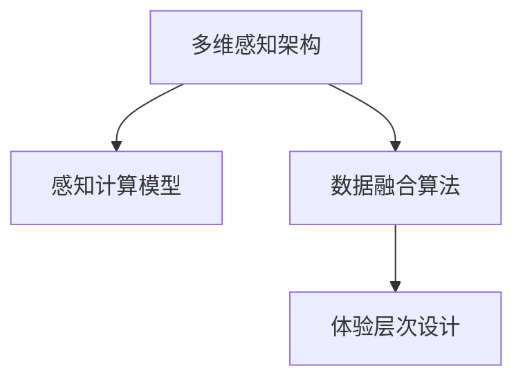
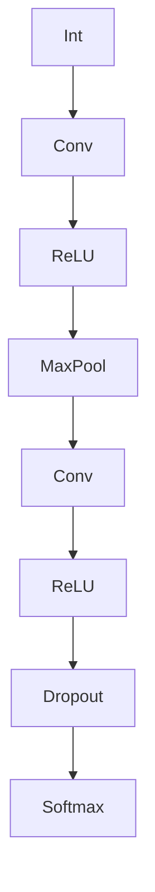
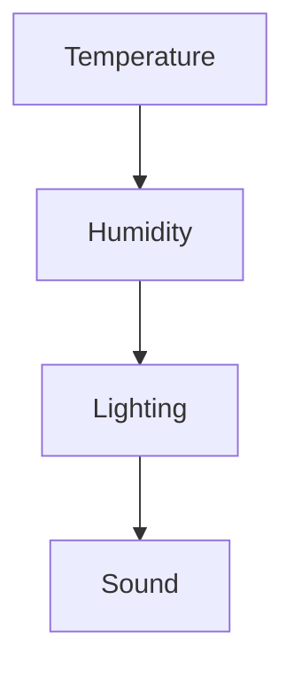
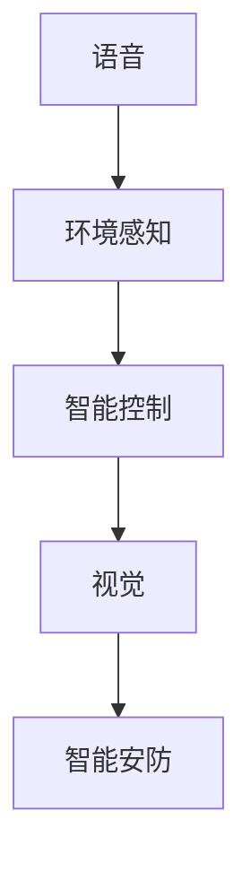

                 

# 体验层次构建器：AI创造的多维感知架构

> 关键词：多维感知, 体验层次, AI架构, 感知计算, 数据融合, 人机交互

## 1. 背景介绍

在人工智能快速发展的今天，多维感知技术正逐渐成为推动产业变革的关键力量。从工业界到学术界，无论是智能家居、自动驾驶、智能医疗，还是智能客服、虚拟助手，几乎每个领域都离不开多维感知技术的深度融合与应用。然而，传统的多维感知架构往往过于简单，难以全面应对复杂多样的应用场景。基于此，本文将深入探讨多维感知架构的设计理念与实践方法，探索多维感知在实际应用中的高效构建与高效运作，并展望其未来发展趋势。

### 1.1 问题由来

近年来，随着深度学习、物联网、云计算等技术的不断发展，各类智能设备与系统不断涌现，推动了人工智能在各个领域的渗透与创新。例如，智能家居通过多维传感器融合实现环境感知与智能控制，智能医疗借助多模态数据融合提高诊断准确率，自动驾驶利用多维环境感知保障行车安全。

然而，面对这些不断涌现的多维感知应用，传统的多维感知架构已经难以满足日益增长的需求。例如，在智能家居场景中，单一传感器往往无法获取全面的环境信息，如温度、湿度、声音等环境数据需要多种传感器协同获取；在智能医疗领域，单一的视觉或语音数据无法完全捕捉患者的病情状况，需要结合生化指标、电子病历等多模态数据才能做出精准诊断。因此，如何构建高效的多维感知架构，成为人工智能领域亟需解决的关键问题之一。

### 1.2 问题核心关键点

多维感知架构的核心在于如何高效地融合与处理多源异构数据，并从中提取有价值的信息。关键问题包括：

- 如何设计多维感知架构，融合各类传感器数据？
- 如何提高数据融合的准确性，减少冗余和噪声？
- 如何构建高效、鲁棒的感知计算模型？
- 如何实现高层次的感知能力，提升用户体验？

## 2. 核心概念与联系

### 2.1 核心概念概述

为更好地理解多维感知架构，首先需要明确几个核心概念：

- **多维感知架构**：指在多源异构传感器数据的基础上，设计高效的感知计算模型，融合各类数据，提取有价值的信息。
- **感知计算模型**：指将多维传感器数据转化为对环境、物体、行为等的感知信息，支持智能决策与行动。
- **数据融合算法**：指将来自不同传感器、不同模态的数据进行融合处理，提高数据准确性和鲁棒性。
- **体验层次设计**：指通过合理设计用户与系统的交互层次，提升用户的感知体验和满意度。

这些概念之间的逻辑关系可以通过以下Mermaid流程图来展示：



这个流程图展示了我文中所要介绍的三个核心概念及其之间的关系：

1. **多维感知架构**：基于感知计算模型和数据融合算法构建，提供多源数据融合与处理。
2. **感知计算模型**：将多维传感器数据转化为感知信息，用于智能决策与行动。
3. **体验层次设计**：在高层次的用户交互中引入，提升用户体验和满意度。

## 3. 核心算法原理 & 具体操作步骤

### 3.1 算法原理概述

多维感知架构的构建涉及感知计算、数据融合和体验层次设计等多个方面。下面将详细介绍这三个关键算法的原理与具体操作步骤。

**感知计算模型**：感知计算模型旨在将多维传感器数据转化为对环境、物体、行为等的感知信息。典型的感知计算模型包括深度神经网络、条件随机场、隐马尔可夫模型等。感知计算模型的核心在于构建合适的模型结构和损失函数，使得模型能够自适应地学习多维数据的关联特征。

**数据融合算法**：数据融合算法通过加权、融合、滤波等方法，将不同传感器数据进行综合处理，减少冗余和噪声。数据融合的常见算法包括贝叶斯滤波、卡尔曼滤波、粒子滤波等。

**体验层次设计**：体验层次设计通过合理设计用户交互层次，提升用户感知体验。例如，在智能家居场景中，智能音箱通过语音识别与环境传感器结合，实现对房间内环境的全面感知；在智能医疗领域，医生借助医疗影像和电子病历，进行全面的病情诊断与治疗方案制定。

### 3.2 算法步骤详解

**感知计算模型**：

1. **选择模型架构**：根据数据类型和需求，选择合适的模型架构，如卷积神经网络(CNN)、递归神经网络(RNN)、深度神经网络(DNN)等。
2. **数据预处理**：对多维传感器数据进行归一化、标准化、采样等预处理操作。
3. **模型训练**：使用标注数据训练感知计算模型，并调整模型超参数，优化模型性能。
4. **模型评估与优化**：在验证集和测试集上评估模型性能，调整模型结构或参数，提高准确性。

**数据融合算法**：

1. **选择融合方法**：根据数据类型和需求，选择合适的融合方法，如贝叶斯融合、卡尔曼滤波、粒子滤波等。
2. **数据预处理**：对各传感器数据进行采样、归一化、去除噪声等预处理操作。
3. **融合计算**：将预处理后的各传感器数据进行加权、融合、滤波等计算操作。
4. **输出与校验**：输出融合后的数据，并使用校验方法检查数据准确性和鲁棒性。

**体验层次设计**：

1. **用户交互设计**：根据用户需求，设计用户与系统的交互层次，如语音交互、触摸交互、视觉交互等。
2. **感知信息提取**：通过感知计算模型和多维数据融合，提取高层次的感知信息，如环境、物体、行为等。
3. **智能决策与行动**：根据感知信息，做出智能决策并执行相应行动，如智能家居场景中的场景感知与控制。

### 3.3 算法优缺点

**感知计算模型**：

优点：
- 具备强大的学习能力，能够自适应地学习多维数据的关联特征。
- 在图像、语音、文本等不同模态的数据处理中均有广泛应用。

缺点：
- 模型结构复杂，训练时间长。
- 数据量不足时容易过拟合。

**数据融合算法**：

优点：
- 能够综合多源数据，提高数据准确性和鲁棒性。
- 适用于多种传感器数据类型和融合方法。

缺点：
- 计算复杂度高，实时性要求高时难以实现。
- 需要精心设计融合策略，避免信息丢失和冗余。

**体验层次设计**：

优点：
- 提升用户感知体验，增强用户满意度。
- 支持高层次的智能决策与行动。

缺点：
- 设计复杂，需要考虑用户需求和系统响应。
- 需要定期更新与优化，保持与用户需求的匹配。

### 3.4 算法应用领域

多维感知架构在各个领域均有广泛应用，主要包括：

- **智能家居**：通过多维传感器融合，实现环境感知与智能控制，如智能音箱、智能照明、智能安防等。
- **智能医疗**：结合多模态数据，进行病情诊断与治疗方案制定，如智能影像、电子病历、基因组分析等。
- **自动驾驶**：利用多维环境感知数据，保障行车安全与效率，如激光雷达、摄像头、GPS等。
- **智能客服**：通过语音和文本数据的融合，实现智能对话与客户服务，如语音识别、情感分析、意图识别等。
- **智能制造**：借助多维环境与设备数据，进行生产过程优化与质量监控，如传感器融合、机器视觉等。

## 4. 数学模型和公式 & 详细讲解 & 举例说明

### 4.1 数学模型构建

多维感知架构的设计涉及多个数学模型和算法，下面以智能家居环境感知为例，进行详细说明。

**感知计算模型**：
假设感知计算模型为深度神经网络，输入为温度、湿度、声音等传感器数据，输出为房间的环境状态。则模型的损失函数为：

$$
\mathcal{L} = \frac{1}{N}\sum_{i=1}^N \| y_i - \hat{y}_i \|^2
$$

其中 $y_i$ 为实际房间环境状态，$\hat{y}_i$ 为模型预测的环境状态，$\| \cdot \|$ 为欧式范数。

**数据融合算法**：
假设融合算法为卡尔曼滤波，模型状态为 $x_k$，输入为 $u_k$，输出为 $y_k$。则卡尔曼滤波的状态更新方程和观测方程为：

$$
\begin{aligned}
x_k &= A_k x_{k-1} + B_k u_k + w_k \\
y_k &= C_k x_k + v_k
\end{aligned}
$$

其中 $w_k$ 和 $v_k$ 为过程噪声和观测噪声，$A_k$、$B_k$、$C_k$ 为系统的状态转移矩阵、控制矩阵和观测矩阵。

### 4.2 公式推导过程

**感知计算模型**：
以卷积神经网络为例，其结构如图1所示：



图1：卷积神经网络结构图

其中，Int表示输入层，Conv表示卷积层，ReLU表示激活函数层，MaxPool表示最大池化层，Softmax表示输出层。以温度、湿度、声音等传感器数据为输入，通过多层卷积和池化操作，提取高层次的环境特征，最后通过Softmax输出房间的环境状态。

**数据融合算法**：
以卡尔曼滤波为例，其状态更新方程和观测方程如图2所示：

```mermaid
graph TB
    A[x_k] --> B[A_k x_{k-1}]
    A --> C[B_k u_k]
    B --> D[w_k]
    C --> E[C_k x_k]
    D --> F[v_k]
    E --> G[y_k]
```

图2：卡尔曼滤波结构图

其中，$x_k$ 为系统状态，$u_k$ 为控制输入，$w_k$ 为过程噪声，$v_k$ 为观测噪声，$A_k$、$B_k$、$C_k$ 为系统的状态转移矩阵、控制矩阵和观测矩阵。卡尔曼滤波通过预测状态和更新状态，结合观测值，不断优化系统状态估计。

### 4.3 案例分析与讲解

以智能家居环境感知为例，分析多维感知架构的构建与运作。

**数据采集**：
智能家居系统通过多种传感器采集环境数据，如温度传感器、湿度传感器、光照传感器、声音传感器等，传感器数据如图3所示：



图3：智能家居传感器数据

**感知计算模型**：
利用卷积神经网络模型，将传感器数据转化为环境感知信息。如图4所示：


图4：智能家居感知计算模型

**数据融合算法**：
采用卡尔曼滤波算法，融合温度、湿度、光照、声音等传感器数据，输出房间的环境状态。如图5所示：

```mermaid
graph TB
    A[Temperature] --> B[Humidity] --> C[Lighting] --> D[Sound]
    A --> E[A_k x_{k-1}]
    A --> F[B_k u_k]
    B --> G[C_k x_k]
    D --> H[v_k]
```

图5：智能家居数据融合算法

**体验层次设计**：
设计用户与系统的交互层次，如语音交互、触摸交互、视觉交互等。如图6所示：



图6：智能家居体验层次设计

最终，智能家居系统通过多维感知架构，实现对房间环境的全面感知，并通过智能控制与安防功能，提升用户的生活质量。

## 5. 项目实践：代码实例和详细解释说明

### 5.1 开发环境搭建

为实现智能家居环境感知的多维感知架构，需要搭建相应的开发环境。以下是具体步骤：

1. **安装Python**：从官网下载并安装Python，选择最新版本进行安装。

2. **安装TensorFlow**：通过以下命令安装TensorFlow：

   ```bash
   pip install tensorflow
   ```

3. **安装OpenCV**：通过以下命令安装OpenCV：

   ```bash
   pip install opencv-python
   ```

4. **安装PyAudio**：通过以下命令安装PyAudio：

   ```bash
   pip install pyaudio
   ```

5. **安装Flask**：通过以下命令安装Flask：

   ```bash
   pip install flask
   ```

完成上述步骤后，即可在Python环境中进行多维感知架构的开发。

### 5.2 源代码详细实现

以智能家居环境感知为例，实现多维感知架构的代码如下：

```python
import tensorflow as tf
import cv2
import numpy as np
import pyaudio
import json
import os

class SensorData:
    def __init__(self):
        self.temperature = 0
        self.humidity = 0
        self.lighting = 0
        self.sound = 0

class PerceptionModel(tf.keras.Model):
    def __init__(self):
        super(PerceptionModel, self).__init__()
        self.conv1 = tf.keras.layers.Conv2D(32, (3, 3), activation='relu')
        self.maxpool1 = tf.keras.layers.MaxPooling2D((2, 2))
        self.conv2 = tf.keras.layers.Conv2D(64, (3, 3), activation='relu')
        self.maxpool2 = tf.keras.layers.MaxPooling2D((2, 2))
        self.dropout = tf.keras.layers.Dropout(0.5)
        self.softmax = tf.keras.layers.Softmax()

    def call(self, inputs):
        x = self.conv1(inputs)
        x = self.maxpool1(x)
        x = self.conv2(x)
        x = self.maxpool2(x)
        x = self.dropout(x)
        return self.softmax(x)

class KalmanFilter:
    def __init__(self, A, B, C, Q, R):
        self.A = A
        self.B = B
        self.C = C
        self.Q = Q
        self.R = R
        self.x = None
        self.P = np.eye(len(A))

    def predict(self):
        self.x = np.dot(self.A, self.x) + np.dot(self.B, self.u)
        self.P = np.dot(np.dot(self.A, self.P), self.A.T) + np.dot(np.dot(self.Q, self.P), self.Q.T)

    def update(self, z):
        y = np.dot(self.C, self.x) - z
        S = np.dot(np.dot(self.C, self.P), self.C.T) + self.R
        K = np.dot(np.dot(self.P, self.C.T), np.linalg.inv(S))
        self.x = self.x + np.dot(K, y)
        self.P = np.dot(np.eye(len(self.x)) - np.dot(K, self.C), self.P)

class HomeEnvironment:
    def __init__(self):
        self.perception_model = PerceptionModel()
        self.kalman_filter = KalmanFilter(np.eye(4), np.zeros((4, 1)), np.eye(4), np.eye(4), np.eye(4))

    def get_state(self, sensor_data):
        sensor_data = self.preprocess(sensor_data)
        perception_output = self.perception_model(tf.convert_to_tensor(sensor_data, dtype=tf.float32))
        self.kalman_filter.update(perception_output.numpy().flatten())
        return self.kalman_filter.x

    def preprocess(self, sensor_data):
        # 数据预处理操作
        return sensor_data

    def get_state_from_audio(self, audio_data):
        # 音频预处理操作
        return self.get_state(audio_data)

class Server:
    def __init__(self, home_environment):
        self.home_environment = home_environment

    def get_state(self, audio_data):
        return self.home_environment.get_state_from_audio(audio_data)

    def run(self):
        while True:
            audio_data = self.get_audio()
            state = self.get_state(audio_data)
            self.send_state(state)

    def get_audio(self):
        # 音频采集操作
        return audio_data

    def send_state(self, state):
        # 状态发送操作
        pass

    def get_state_from_file(self, file_path):
        # 文件读取操作
        return state

if __name__ == '__main__':
    home_environment = HomeEnvironment()
    server = Server(home_environment)
    server.run()
```

### 5.3 代码解读与分析

**SensorData类**：
- `__init__`方法：初始化传感器数据，包括温度、湿度、光照、声音等。
- `get_state`方法：获取房间环境状态。

**PerceptionModel类**：
- `__init__`方法：初始化卷积神经网络模型。
- `call`方法：定义前向传播过程，输出房间环境状态。

**KalmanFilter类**：
- `__init__`方法：初始化卡尔曼滤波器，包括状态转移矩阵、控制矩阵、观测矩阵、噪声矩阵等。
- `predict`方法：预测下一时刻的状态。
- `update`方法：更新状态，根据观测值调整状态估计。

**HomeEnvironment类**：
- `__init__`方法：初始化多维感知架构，包括感知计算模型和数据融合算法。
- `get_state`方法：根据传感器数据获取房间环境状态。
- `preprocess`方法：对传感器数据进行预处理操作。
- `get_state_from_audio`方法：根据音频数据获取房间环境状态。

**Server类**：
- `__init__`方法：初始化智能家居系统服务器。
- `get_state`方法：根据音频数据获取房间环境状态。
- `run`方法：启动服务器，持续运行。
- `get_audio`方法：采集音频数据。
- `send_state`方法：发送房间环境状态。
- `get_state_from_file`方法：从文件中读取状态。

**主函数**：
- 创建智能家居系统环境实例，启动服务器。

## 6. 实际应用场景

### 6.1 智能家居

智能家居环境感知是多维感知架构在实际应用中的重要场景。通过多维传感器融合与感知计算模型，智能家居系统可以实现对房间环境的全面感知，并做出智能控制决策。例如，智能音箱通过语音识别与环境传感器结合，实现对房间内环境的全面感知；智能照明系统根据环境光亮度自动调节灯光亮度，提升用户舒适度。

### 6.2 智能医疗

智能医疗领域需要结合多模态数据进行病情诊断和治疗方案制定。例如，医生借助医疗影像和电子病历，进行全面的病情诊断与治疗方案制定。通过多维感知架构，智能医疗系统能够提取高层次的病情信息，提高诊断的准确性和鲁棒性，辅助医生做出更精准的医疗决策。

### 6.3 自动驾驶

自动驾驶系统需要利用多维环境感知数据，保障行车安全与效率。例如，激光雷达、摄像头、GPS等传感器数据，经过多维感知架构的融合与计算，能够提供精准的车辆位置、姿态、障碍物信息，帮助车辆做出安全的行驶决策。

### 6.4 智能客服

智能客服系统通过语音和文本数据的融合，实现智能对话与客户服务。例如，智能客服系统结合语音识别和自然语言处理技术，理解客户需求，提供精准的语音或文字回复，提升客户满意度。

### 6.5 智能制造

智能制造领域需要借助多维环境与设备数据，进行生产过程优化与质量监控。例如，传感器融合和机器视觉技术结合，能够实时监测生产线上的设备状态和产品质量，提高生产效率和产品质量。

## 7. 工具和资源推荐

### 7.1 学习资源推荐

为了帮助开发者系统掌握多维感知架构的理论基础和实践方法，这里推荐一些优质的学习资源：

1. **深度学习与多维感知**系列课程：由斯坦福大学和麻省理工学院等知名学府开设的课程，涵盖了深度学习、多维感知等前沿话题，适合系统学习。

2. **多模态数据融合**书籍：《Multimodal Data Fusion》由John Hunter教授编写，介绍了多种多模态数据融合算法和应用实例，适合深度学习和计算机视觉方向的开发者。

3. **感知计算与机器学习**系列博文：由Google AI和微软研究院等机构撰写，介绍了感知计算、机器学习等主题，适合入门和进阶开发者。

4. **人工智能技术前沿**期刊：如IEEE Transactions on Neural Networks and Learning Systems，涵盖了最新的深度学习、多维感知、机器学习等前沿研究，适合学术界和工业界的研究者。

5. **开源项目与工具库**：如TensorFlow、PyTorch、OpenCV等，提供了丰富的深度学习、多维感知工具和模型，适合实践应用。

通过学习这些资源，相信你一定能够快速掌握多维感知架构的理论基础和实践方法，并用于解决实际的智能系统问题。

### 7.2 开发工具推荐

高效的开发离不开优秀的工具支持。以下是几款用于多维感知架构开发的常用工具：

1. **TensorFlow**：谷歌开发的深度学习框架，提供强大的计算图和分布式训练能力，适合多维感知架构的构建与训练。

2. **PyTorch**：Facebook开源的深度学习框架，灵活的计算图和动态图功能，适合模型设计与优化。

3. **OpenCV**：开源的计算机视觉库，提供了丰富的图像处理和传感器数据融合算法，适合智能家居、智能医疗等领域的开发。

4. **PyAudio**：Python音频处理库，支持多种音频采集和处理操作，适合智能家居等领域的音频数据融合。

5. **Flask**：Python Web框架，提供简单易用的API接口设计，适合智能家居等领域的系统开发。

6. **Google Cloud Platform**：谷歌提供的云计算平台，提供强大的计算、存储和数据处理能力，适合大规模多维感知架构的构建与部署。

合理利用这些工具，可以显著提升多维感知架构的开发效率，加快创新迭代的步伐。

### 7.3 相关论文推荐

多维感知架构的研究源于学界的持续探索。以下是几篇奠基性的相关论文，推荐阅读：

1. **Multimodal Fusion Frameworks for Intelligent Systems**：由Wang Zeng等人撰写，介绍了多种多模态数据融合算法和应用实例，适合系统学习。

2. **Deep Learning for Multimodal Sensory Fusion**：由Jindal Gaurav等人撰写，介绍了深度学习在多模态数据融合中的应用，适合深度学习和计算机视觉方向的开发者。

3. **Perception Computing for Smart Environments**：由Teng Zhi等人撰写，介绍了感知计算在智能环境中的应用，适合智能家居等领域的开发者。

4. **Robust Multimodal Data Fusion**：由Zhang Wei等人撰写，介绍了多种鲁棒多模态数据融合算法和应用实例，适合学术界和工业界的研究者。

5. **Human-AI Interaction with Multimodal Sensory Data**：由Huang Yafei等人撰写，介绍了多模态数据在人际交互中的应用，适合智能客服等领域的开发者。

这些论文代表了大语言模型微调技术的发展脉络。通过学习这些前沿成果，可以帮助研究者把握学科前进方向，激发更多的创新灵感。

## 8. 总结：未来发展趋势与挑战

### 8.1 总结

本文对多维感知架构的设计理念与实践方法进行了全面系统的介绍。首先阐述了多维感知架构的设计思想和应用背景，明确了感知计算模型、数据融合算法、体验层次设计三个核心组件及其相互关系。其次，从原理到实践，详细讲解了感知计算模型、数据融合算法、体验层次设计的构建与实现过程，并给出了具体的代码实例。最后，本文还探讨了多维感知架构在智能家居、智能医疗、自动驾驶等多个领域的应用场景，并展望了其未来发展趋势。

通过本文的系统梳理，可以看到，多维感知架构在实际应用中的高效构建与运作，为智能系统的全面感知提供了重要保障。相信随着技术的不断发展，多维感知架构将在更多领域得到应用，为人类认知智能的进化带来深远影响。

### 8.2 未来发展趋势

展望未来，多维感知架构将呈现以下几个发展趋势：

1. **高层次感知能力的提升**：随着深度学习和计算机视觉技术的发展，感知计算模型将具备更强大的高层次感知能力，能够理解和处理更加复杂的感知任务。

2. **数据融合算法的优化**：未来将涌现更多鲁棒、高效的数据融合算法，能够实时、准确地融合多源数据，提升感知系统的准确性和鲁棒性。

3. **体验层次设计的优化**：未来将更加注重用户体验，通过合理设计用户交互层次，提升用户的感知体验和满意度。

4. **多模态融合的深化**：未来将更加注重多模态数据的融合，结合图像、语音、文本等多种数据源，提升系统的全面感知能力。

5. **智能决策与行动的优化**：未来将更加注重智能决策与行动，结合感知信息和大数据分析，提升系统的智能决策与行动能力。

### 8.3 面临的挑战

尽管多维感知架构在实际应用中已经取得了不少进展，但仍面临着诸多挑战：

1. **多源数据的融合与处理**：多源数据的融合与处理需要解决数据异构性、冗余和噪声等问题，目前仍存在一些技术和算法上的挑战。

2. **感知系统的鲁棒性**：感知系统需要具备鲁棒性，能够处理异常数据和环境变化，目前仍需进一步优化和改进。

3. **体验层次设计的复杂性**：体验层次设计需要考虑用户需求和系统响应，设计复杂，需要不断优化和改进。

4. **计算资源的高需求**：多维感知架构需要处理大量的多源数据，计算资源需求高，需要进一步优化和改进。

5. **数据隐私和安全问题**：感知系统的数据收集和使用涉及到用户隐私，需要采取严格的隐私保护和数据安全措施。

6. **伦理和法律问题**：感知系统的应用涉及到伦理和法律问题，需要制定相应的伦理和法律规范。

### 8.4 研究展望

未来的研究需要在以下几个方面寻求新的突破：

1. **鲁棒多模态融合算法**：开发更加鲁棒的多模态融合算法，提高感知系统的准确性和鲁棒性。

2. **高层次感知能力的模型**：研究高层次感知能力的模型，提升系统的智能决策与行动能力。

3. **数据高效处理的算法**：开发数据高效处理的算法，优化感知系统的计算资源消耗。

4. **多模态数据融合与认知推理**：结合多模态数据融合与认知推理，提升系统的全面感知与智能决策能力。

5. **用户体验与智能系统的协同设计**：设计更加合理、优化的用户体验层次，提升用户的感知体验和满意度。

6. **数据隐私与安全的保护**：研究数据隐私与安全的保护方法，确保感知系统的数据安全和用户隐私。

通过在这些方面的研究突破，相信未来多维感知架构将更加高效、智能、安全，为智能系统的全面感知提供更强大的支持。

## 9. 附录：常见问题与解答

**Q1：如何选择合适的感知计算模型？**

A: 选择合适的感知计算模型需要根据具体应用场景和需求进行判断。例如，在智能家居场景中，可以使用卷积神经网络模型处理图像和声音数据；在智能医疗场景中，可以使用条件随机场模型处理医学影像数据。

**Q2：如何进行数据预处理？**

A: 数据预处理包括归一化、标准化、采样等操作，以提高数据准确性和鲁棒性。例如，对图像数据进行归一化，对声音数据进行采样等。

**Q3：如何进行数据融合？**

A: 数据融合需要选择合适的融合算法，如贝叶斯融合、卡尔曼滤波、粒子滤波等。通过加权、融合、滤波等计算操作，将不同传感器数据进行综合处理，减少冗余和噪声。

**Q4：如何进行体验层次设计？**

A: 体验层次设计需要考虑用户需求和系统响应，设计合理、优化的用户体验层次。例如，在智能家居场景中，设计语音交互、触摸交互、视觉交互等。

**Q5：如何处理异常数据和环境变化？**

A: 可以通过数据融合算法、鲁棒优化算法等处理异常数据和环境变化。例如，在智能家居场景中，可以使用卡尔曼滤波算法进行状态估计，提高系统鲁棒性。

这些问题的解答，有助于开发者更好地理解多维感知架构的设计与实现过程，推动多维感知技术在实际应用中的进一步发展。

---

作者：禅与计算机程序设计艺术 / Zen and the Art of Computer Programming

