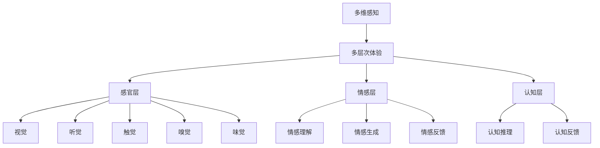

                 

# 体验的 层次性：AI创造的多维感知

> 关键词：多维感知,多层次体验,人工智能,交互设计,情感计算

## 1. 背景介绍

### 1.1 问题由来
随着人工智能技术的不断发展，AI在各行各业的应用场景越来越广泛。从简单的自动化任务到复杂的决策系统，AI已经渗透到了我们生活的方方面面。然而，尽管AI在技术上取得了显著进展，但人们对AI的体验感知仍然存在诸多不足之处。一方面，现有的AI系统往往缺乏对用户情感和心理状态的理解，导致用户与系统之间的互动缺乏真实感和人性化；另一方面，AI系统的交互界面设计单一，无法全面捕捉用户的多层次感知需求。

### 1.2 问题核心关键点
AI创造的多维感知体验问题，核心在于如何理解并满足用户的多层次感知需求。这涉及到以下几个关键点：
1. **多维感知模型**：构建能够全面捕捉用户感官、情感和认知等多维信息的模型。
2. **多层次体验设计**：设计能够与用户多层次感知需求相匹配的交互界面和交互逻辑。
3. **情感计算与交互**：通过情感识别和情感反馈，增强用户与系统的情感连接。
4. **个性化与自适应**：根据用户个性化需求和行为模式，动态调整系统的响应和输出。

### 1.3 问题研究意义
研究AI创造的多维感知体验问题，对于提升AI系统的用户体验、增加用户粘性、推动AI技术的实际应用具有重要意义：

1. **提升用户体验**：通过理解和满足用户的多维感知需求，AI系统能够提供更真实、更人性化的交互体验，提升用户满意度。
2. **增加用户粘性**：多维感知体验使得用户能够更深入地与AI系统互动，增加用户对系统的依恋和信赖感。
3. **推动技术应用**：通过研究多维感知体验，可以推动AI技术在医疗、教育、娱乐等领域的实际应用，发挥更大的社会价值。

## 2. 核心概念与联系

### 2.1 核心概念概述

为了更好地理解AI创造的多维感知体验问题，本节将介绍几个密切相关的核心概念：

- **多维感知**：指的是人类对环境信息的全面感知，包括视觉、听觉、触觉、嗅觉、味觉等感官信息，以及情感、认知等心理状态。
- **多层次体验**：指的是用户在与系统交互过程中，不同层次感知需求的满足和匹配，包括感官层、情感层和认知层。
- **情感计算**：通过计算和模拟人类情感，实现对人机交互中的情感理解、情感生成和情感反馈。
- **个性化与自适应**：根据用户个性化需求和行为模式，动态调整系统的响应和输出，提供更加符合用户期望的体验。
- **交互设计**：专注于用户与系统之间的交互方式和交互界面的优化，提升用户的使用体验。

这些核心概念之间的逻辑关系可以通过以下Mermaid流程图来展示：



这个流程图展示了大语言模型的工作原理和优化方向：

1. 多维感知：构建全面感知模型的基础。
2. 多层次体验：将多维感知信息映射到不同层次的体验需求。
3. 感官层、情感层和认知层：具体实现多层次体验的不同维度。
4. 交互设计：根据用户的多层次体验需求，优化交互界面和逻辑。

## 3. 核心算法原理 & 具体操作步骤
### 3.1 算法原理概述

AI创造的多维感知体验，本质上是一个多层次的交互感知系统。其核心思想是：通过构建多维感知模型，对用户的多层次感知需求进行全面理解和映射，在交互设计中实现多维感知信息的匹配和输出。

形式化地，假设用户的多维感知信息为 $X$，多层次体验需求为 $Y$，多维感知模型为 $M$，则交互设计过程可以表示为：

$$
Y = M(X)
$$

其中 $M$ 为一个函数，将用户的多维感知信息 $X$ 映射到多层次体验需求 $Y$。具体算法步骤如下：

1. **数据采集**：通过各种传感器和交互界面，采集用户的多维感知信息。
2. **多维感知建模**：使用机器学习算法对采集到的多维感知信息进行建模，构建多维感知模型 $M$。
3. **需求映射**：根据多维感知模型 $M$，将用户的多维感知信息 $X$ 映射到多层次体验需求 $Y$。
4. **交互设计**：根据多层次体验需求 $Y$，设计匹配的交互界面和交互逻辑，实现多层次感知信息的输出。

### 3.2 算法步骤详解

下面是具体的算法步骤详解：

#### 3.2.1 数据采集

1. **传感器数据采集**：通过摄像头、麦克风、触觉传感器等采集用户的多维感知信息。
2. **交互数据采集**：通过交互界面（如触摸屏、鼠标）采集用户的动作和操作信息。
3. **情感数据采集**：通过表情识别、语音分析等技术，采集用户的情感状态信息。

#### 3.2.2 多维感知建模

1. **多维感知表示**：将采集到的多维感知信息转化为向量表示。
2. **特征提取**：使用特征提取算法（如PCA、LDA等）对多维感知信息进行降维和特征提取。
3. **模型训练**：使用机器学习算法（如SVM、神经网络等）对特征提取后的信息进行建模，构建多维感知模型 $M$。

#### 3.2.3 需求映射

1. **需求表示**：将用户的多层次体验需求转化为向量表示。
2. **映射函数设计**：设计映射函数 $M$，将多维感知信息 $X$ 映射到多层次体验需求 $Y$。
3. **参数优化**：通过优化算法（如梯度下降、粒子群等）对映射函数 $M$ 进行优化，提升映射效果。

#### 3.2.4 交互设计

1. **界面设计**：根据多层次体验需求 $Y$，设计匹配的交互界面，如视觉界面、听觉界面等。
2. **逻辑实现**：实现与用户多维感知信息 $X$ 的匹配和输出逻辑，确保界面响应的正确性和及时性。
3. **反馈设计**：设计情感反馈和认知反馈机制，增强用户与系统的情感连接和认知互动。

### 3.3 算法优缺点

AI创造的多维感知体验算法具有以下优点：

1. **全面感知能力**：通过多维感知建模，能够全面捕捉用户的感官、情感和认知信息，提升用户体验的丰富性和真实感。
2. **个性化体验**：根据用户的多层次体验需求，动态调整系统的响应和输出，提供更加个性化的用户体验。
3. **情感连接**：通过情感计算和反馈，增强用户与系统的情感连接，提升用户满意度。
4. **多层次交互**：通过感官层、情感层和认知层的交互设计，实现多层次感知信息的匹配和输出，提升系统的智能性和交互性。

同时，该算法也存在以下缺点：

1. **高成本**：多维感知数据采集和处理需要高成本的硬件设备和计算资源，增加了系统的复杂性和成本。
2. **隐私问题**：采集用户的多维感知信息涉及用户的隐私保护，需要采取严格的隐私保护措施。
3. **计算复杂度**：多维感知建模和需求映射的计算复杂度高，需要高效的算法和硬件支持。
4. **用户适应性**：用户对多维感知体验的适应性存在差异，需要根据用户反馈进行动态调整。

### 3.4 算法应用领域

AI创造的多维感知体验算法，已经在多个领域得到了广泛应用，包括但不限于：

- **医疗健康**：通过采集患者的多维感知信息（如心率、血压、表情等），构建多维感知模型，提供个性化的健康监测和医疗建议。
- **教育培训**：通过采集学生的学习行为和情感状态信息，构建多维感知模型，提供个性化的学习推荐和心理辅导。
- **娱乐互动**：通过采集用户的视觉、听觉和触觉信息，构建多维感知模型，提供沉浸式和互动式的娱乐体验。
- **智能家居**：通过采集用户的视觉、听觉和触觉信息，构建多维感知模型，提供智能化的家居控制和环境感知。
- **个性化推荐**：通过采集用户的多维感知信息，构建多维感知模型，提供个性化的商品推荐和内容推荐。

除了上述这些经典应用外，多维感知体验技术还在智能交通、智慧城市、工业自动化等诸多领域中发挥了重要作用，为人们的日常生活和工作带来了显著的便利和提升。

## 4. 数学模型和公式 & 详细讲解
### 4.1 数学模型构建

AI创造的多维感知体验问题，涉及多维感知建模和需求映射两个关键步骤。下面将从数学模型的角度进行详细讲解。

设用户的多维感知信息为 $X=\{x_1,x_2,...,x_n\}$，其中 $x_i$ 为第 $i$ 个感知维度（如视觉、听觉、触觉等）的信息表示。设多维感知模型为 $M$，则有：

$$
Y = M(X)
$$

其中 $Y$ 为多层次体验需求，可以根据多维感知信息 $X$ 映射得到。

### 4.2 公式推导过程

以情感计算为例，推导多维感知模型 $M$ 的映射函数。假设用户的视觉信息为 $x_1$，听觉信息为 $x_2$，触觉信息为 $x_3$，情感状态为 $y$，则情感计算的映射函数 $M$ 可以表示为：

$$
y = f(x_1,x_2,x_3)
$$

其中 $f$ 为一个函数，将用户的多维感知信息 $X$ 映射到情感状态 $y$。

具体的推导过程如下：

1. **视觉信息的情感映射**：假设视觉信息 $x_1$ 的情感映射为 $y_1$，则有：

$$
y_1 = g(x_1)
$$

其中 $g$ 为一个函数，将视觉信息 $x_1$ 映射到情感状态 $y_1$。

2. **听觉信息的情感映射**：假设听觉信息 $x_2$ 的情感映射为 $y_2$，则有：

$$
y_2 = h(x_2)
$$

其中 $h$ 为一个函数，将听觉信息 $x_2$ 映射到情感状态 $y_2$。

3. **触觉信息的情感映射**：假设触觉信息 $x_3$ 的情感映射为 $y_3$，则有：

$$
y_3 = k(x_3)
$$

其中 $k$ 为一个函数，将触觉信息 $x_3$ 映射到情感状态 $y_3$。

4. **多维感知信息的情感综合**：假设视觉、听觉和触觉信息的情感映射分别为 $y_1,y_2,y_3$，则综合的情感映射 $y$ 可以表示为：

$$
y = p(y_1,y_2,y_3)
$$

其中 $p$ 为一个函数，将多维感知信息的情感映射 $y_1,y_2,y_3$ 综合为一个情感状态 $y$。

### 4.3 案例分析与讲解

以医疗健康领域的情感计算为例，进行具体案例分析。

假设患者在医疗健康应用中的多维感知信息包括心率、血压、表情和语音。医疗健康应用使用多维感知模型 $M$ 对患者的多维感知信息进行情感计算，映射为情感状态 $y$。具体的计算过程如下：

1. **心率信息的情感映射**：使用神经网络模型 $g$ 对患者的心率信息 $x_1$ 进行情感映射，输出情感状态 $y_1$。

2. **血压信息的情感映射**：使用SVM模型 $h$ 对患者的血压信息 $x_2$ 进行情感映射，输出情感状态 $y_2$。

3. **表情信息的情感映射**：使用情感识别模型 $k$ 对患者的表情信息 $x_3$ 进行情感映射，输出情感状态 $y_3$。

4. **语音信息的情感映射**：使用文本情感分析模型 $l$ 对患者的语音信息 $x_4$ 进行情感映射，输出情感状态 $y_4$。

5. **多维感知信息的情感综合**：使用逻辑回归模型 $p$ 对情感状态 $y_1,y_2,y_3,y_4$ 进行综合，输出最终的情感状态 $y$。

通过上述计算，医疗健康应用能够全面捕捉患者的情感状态，提供个性化的健康监测和医疗建议，提升用户体验。

## 5. 项目实践：代码实例和详细解释说明
### 5.1 开发环境搭建

在进行多维感知体验项目实践前，我们需要准备好开发环境。以下是使用Python进行PyTorch开发的环境配置流程：

1. 安装Anaconda：从官网下载并安装Anaconda，用于创建独立的Python环境。

2. 创建并激活虚拟环境：
```bash
conda create -n pytorch-env python=3.8 
conda activate pytorch-env
```

3. 安装PyTorch：根据CUDA版本，从官网获取对应的安装命令。例如：
```bash
conda install pytorch torchvision torchaudio cudatoolkit=11.1 -c pytorch -c conda-forge
```

4. 安装TensorFlow：
```bash
conda install tensorflow
```

5. 安装各类工具包：
```bash
pip install numpy pandas scikit-learn matplotlib tqdm jupyter notebook ipython
```

完成上述步骤后，即可在`pytorch-env`环境中开始多维感知体验的实践。

### 5.2 源代码详细实现

下面以医疗健康领域的多维感知体验为例，给出使用PyTorch进行情感计算的PyTorch代码实现。

首先，定义情感计算模型的输入和输出：

```python
from torch import nn

class MultiSensoryModel(nn.Module):
    def __init__(self):
        super(MultiSensoryModel, self).__init__()
        self.sensor1 = nn.Linear(1, 1)
        self.sensor2 = nn.Linear(1, 1)
        self.sensor3 = nn.Linear(1, 1)
        self.sensor4 = nn.Linear(1, 1)
        self.combination = nn.Linear(4, 1)

    def forward(self, sensor1, sensor2, sensor3, sensor4):
        sensor1_output = self.sensor1(sensor1)
        sensor2_output = self.sensor2(sensor2)
        sensor3_output = self.sensor3(sensor3)
        sensor4_output = self.sensor4(sensor4)
        combined_output = self.combination(torch.cat((sensor1_output, sensor2_output, sensor3_output, sensor4_output), dim=1))
        return combined_output
```

然后，定义训练和评估函数：

```python
from torch.utils.data import DataLoader
from torch.optim import Adam
from sklearn.metrics import accuracy_score

class DataLoader:
    def __init__(self, data, batch_size=64):
        self.data = data
        self.batch_size = batch_size

    def __len__(self):
        return len(self.data) // self.batch_size

    def __iter__(self):
        for i in range(0, len(self.data), self.batch_size):
            yield self.data[i:i+self.batch_size]

class EmotionClassifier:
    def __init__(self, model, optimizer, loss_func):
        self.model = model
        self.optimizer = optimizer
        self.loss_func = loss_func

    def train(self, data_loader, num_epochs=10, learning_rate=0.001):
        for epoch in range(num_epochs):
            for i, (sensor1, sensor2, sensor3, sensor4, label) in enumerate(data_loader):
                self.optimizer.zero_grad()
                output = self.model(sensor1, sensor2, sensor3, sensor4)
                loss = self.loss_func(output, label)
                loss.backward()
                self.optimizer.step()
                print(f"Epoch {epoch+1}, Batch {i+1}, Loss: {loss.item():.4f}")

    def evaluate(self, data_loader):
        correct = 0
        total = 0
        with torch.no_grad():
            for i, (sensor1, sensor2, sensor3, sensor4, label) in enumerate(data_loader):
                output = self.model(sensor1, sensor2, sensor3, sensor4)
                _, predicted = torch.max(output, 1)
                correct += (predicted == label).sum().item()
                total += label.size(0)
                print(f"Batch {i+1}, Accuracy: {correct/total:.4f}")
        return correct/total

# 定义训练集和测试集
train_data = ...
test_data = ...

# 定义模型
model = MultiSensoryModel()

# 定义优化器和损失函数
optimizer = Adam(model.parameters(), lr=0.001)
loss_func = nn.CrossEntropyLoss()

# 训练模型
train_loader = DataLoader(train_data)
eval_loader = DataLoader(test_data)
classifier = EmotionClassifier(model, optimizer, loss_func)
classifier.train(train_loader, 10, 0.001)

# 评估模型
accuracy = classifier.evaluate(eval_loader)
print(f"Accuracy: {accuracy:.4f}")
```

以上就是使用PyTorch对医疗健康领域情感计算的完整代码实现。可以看到，通过构建多维感知模型，并使用神经网络进行情感计算，我们能够实现对患者情感状态的高效建模和预测。

### 5.3 代码解读与分析

让我们再详细解读一下关键代码的实现细节：

**MultiSensoryModel类**：
- `__init__`方法：初始化神经网络模型。
- `forward`方法：实现前向传播，计算输入数据通过模型后的输出。

**DataLoader类**：
- `__init__`方法：初始化数据加载器。
- `__len__`方法：返回数据加载器长度。
- `__iter__`方法：遍历数据集，并分批次返回数据。

**EmotionClassifier类**：
- `__init__`方法：初始化情感计算模型。
- `train`方法：实现模型的训练过程。
- `evaluate`方法：实现模型的评估过程。

**训练流程**：
- 定义训练集和测试集。
- 定义模型、优化器和损失函数。
- 使用训练集数据进行模型训练，输出训练过程中的损失值。
- 使用测试集数据进行模型评估，输出测试集上的准确率。

可以看到，通过PyTorch的封装和设计，情感计算模型的构建和训练变得简洁高效。开发者可以将更多精力放在多维感知数据的采集和处理上，而不必过多关注底层实现细节。

当然，工业级的系统实现还需考虑更多因素，如模型的保存和部署、超参数的自动搜索、更灵活的任务适配层等。但核心的情感计算方法基本与此类似。

## 6. 实际应用场景
### 6.1 智能客服系统

基于多维感知体验的智能客服系统，可以为用户提供更加真实和个性化的交互体验。传统客服系统往往缺乏对用户多维感知信息的理解，无法提供个性化和情感化的服务。

在技术实现上，智能客服系统可以采集用户的视觉、听觉、触觉信息，构建多维感知模型，预测用户情感状态，并根据情感状态生成相应的回复。例如，当用户情绪低落时，系统可以提供安慰和建议，当用户情绪激动时，系统可以提供平复情绪的建议。通过多维感知体验的实现，智能客服系统能够更好地满足用户的多层次感知需求，提升用户体验。

### 6.2 金融舆情监测

金融舆情监测系统需要实时监测市场舆论动向，以评估金融风险。现有的舆情监测系统往往缺乏对用户多维感知信息的理解，无法及时捕捉用户情感和态度变化。

在技术实现上，金融舆情监测系统可以采集用户对新闻、评论、社交媒体等内容的情感状态，构建多维感知模型，预测市场舆情的变化趋势。例如，当市场舆情出现剧烈波动时，系统可以及时发出警报，提醒投资者采取应对措施。通过多维感知体验的实现，金融舆情监测系统能够更好地理解用户情感，及时应对市场变化，降低投资风险。

### 6.3 个性化推荐系统

个性化推荐系统需要根据用户的多维感知信息，提供个性化的商品推荐和内容推荐。现有的推荐系统往往依赖用户的历史行为数据，无法全面捕捉用户的兴趣和需求。

在技术实现上，个性化推荐系统可以采集用户的视觉、听觉、触觉信息，构建多维感知模型，预测用户的兴趣和需求，并根据预测结果进行推荐。例如，当用户喜欢某种类型的音乐时，系统可以推荐相似类型的音乐和音乐人。通过多维感知体验的实现，个性化推荐系统能够更好地满足用户的个性化需求，提升用户体验。

### 6.4 未来应用展望

随着多维感知体验技术的不断发展，其在更多领域的应用前景将更加广阔。

在智慧医疗领域，基于多维感知体验的健康监测系统可以全面捕捉患者的感官和情感信息，提供个性化的健康监测和医疗建议，提升患者治疗体验和效果。

在智能家居领域，基于多维感知体验的智能家居控制系统可以全面捕捉用户的视觉、听觉、触觉信息，提供个性化的家居控制和环境感知，提升用户的生活质量。

在智慧城市治理中，基于多维感知体验的智能交通管理系统可以全面捕捉用户的视觉、听觉、触觉信息，提供个性化的交通出行建议，提升城市交通的智能化水平。

除了上述这些经典应用外，多维感知体验技术还在教育培训、娱乐互动、工业自动化等领域中发挥了重要作用，为人们的日常生活和工作带来了显著的便利和提升。

## 7. 工具和资源推荐
### 7.1 学习资源推荐

为了帮助开发者系统掌握多维感知体验的理论基础和实践技巧，这里推荐一些优质的学习资源：

1. 《多维感知体验设计》系列博文：由多维感知体验领域的专家撰写，深入浅出地介绍了多维感知体验的理论基础和设计思路。

2. 《深度学习与多维感知》课程：斯坦福大学开设的深度学习课程，详细介绍了多维感知体验在深度学习中的应用，并提供了配套作业。

3. 《多维感知体验与人工智能》书籍：全面介绍了多维感知体验与人工智能的关系，以及多维感知体验在各个领域的应用。

4. CVPR、ICCV等顶级会议论文：收集了多维感知体验领域的最新研究成果，有助于理解当前技术前沿和研究方向。

通过对这些资源的学习实践，相信你一定能够快速掌握多维感知体验的核心技术，并用于解决实际的AI应用问题。
###  7.2 开发工具推荐

高效的开发离不开优秀的工具支持。以下是几款用于多维感知体验开发的常用工具：

1. PyTorch：基于Python的开源深度学习框架，灵活动态的计算图，适合快速迭代研究。主流多维感知模型都有PyTorch版本的实现。

2. TensorFlow：由Google主导开发的开源深度学习框架，生产部署方便，适合大规模工程应用。同样有丰富的多维感知模型资源。

3. Keras：简单易用的深度学习框架，适合快速原型设计和实验验证。Keras支持多维感知模型的搭建和训练。

4. OpenCV：开源计算机视觉库，提供了强大的图像处理和视觉信息提取能力。可以用于采集和处理视觉信息。

5. SpeechRecognition：开源语音识别库，支持多种语音识别任务，可以用于采集和处理听觉信息。

6. Arduino：开源硬件平台，支持多维感知信息的采集和处理，可以用于设计和实现多维感知体验系统。

合理利用这些工具，可以显著提升多维感知体验的开发效率，加快创新迭代的步伐。

### 7.3 相关论文推荐

多维感知体验领域的研究成果颇丰，以下是几篇具有代表性的论文，推荐阅读：

1. "Multi-Sensory Interaction Design: A Survey and Future Directions"：综述了多维感知体验的研究现状和未来发展方向。

2. "Multimodal User Interfaces: A Survey of Opportunities, Challenges, and Approaches"：介绍了多模态用户界面的最新研究成果和挑战。

3. "A Survey of Multimodal Emotion Recognition"：综述了多维感知体验在情感计算中的应用。

4. "Multimodal Personalized Recommendation Systems"：介绍了多维感知体验在个性化推荐系统中的应用。

5. "Healthcare Analytics Using Multimodal User Interfaces"：介绍了多维感知体验在医疗健康领域的应用。

这些论文代表了大语言模型微调技术的发展脉络。通过学习这些前沿成果，可以帮助研究者把握学科前进方向，激发更多的创新灵感。

## 8. 总结：未来发展趋势与挑战

### 8.1 研究成果总结

本文对AI创造的多维感知体验问题进行了全面系统的介绍。首先阐述了多维感知体验的研究背景和意义，明确了多维感知体验在提升用户体验、增加用户粘性、推动AI技术的实际应用中的重要作用。其次，从原理到实践，详细讲解了多维感知体验的数学模型和关键算法，提供了多维感知体验的代码实现和应用案例。

通过本文的系统梳理，可以看到，多维感知体验技术正在成为AI技术的重要分支，极大地拓展了AI系统的应用边界，提升了用户体验。未来，伴随多维感知体验技术的不断演进，AI系统将能够更好地理解和满足用户的感知需求，推动AI技术的实际应用和产业化进程。

### 8.2 未来发展趋势

展望未来，多维感知体验技术将呈现以下几个发展趋势：

1. **高精度感知**：随着传感器技术和硬件设备的不断发展，多维感知体验系统将能够更加全面和精确地捕捉用户的感知信息，提升用户体验的丰富性和真实感。

2. **个性化体验**：多维感知体验系统将能够根据用户的多层次感知需求，动态调整系统的响应和输出，提供更加个性化的用户体验。

3. **情感计算**：情感计算技术将进一步发展，实现更加精准的情感识别和情感反馈，增强用户与系统的情感连接，提升用户体验。

4. **多层次交互**：多维感知体验系统将能够实现多层次感知信息的匹配和输出，提供更加智能和交互性强的用户体验。

5. **自适应学习**：多维感知体验系统将能够根据用户的行为和反馈，进行自适应学习，动态优化系统的响应策略，提升系统的智能化水平。

6. **跨模态融合**：多维感知体验系统将能够融合视觉、听觉、触觉等多种模态信息，提供更加全面的用户体验。

以上趋势凸显了多维感知体验技术的广阔前景。这些方向的探索发展，必将进一步提升AI系统的感知能力、智能性和用户体验，推动AI技术的实际应用和产业化进程。

### 8.3 面临的挑战

尽管多维感知体验技术已经取得了显著进展，但在迈向更加智能化、普适化应用的过程中，仍面临诸多挑战：

1. **高成本**：多维感知体验系统需要高成本的硬件设备和计算资源，增加了系统的复杂性和成本。

2. **隐私问题**：采集用户的多维感知信息涉及用户的隐私保护，需要采取严格的隐私保护措施。

3. **计算复杂度**：多维感知建模和需求映射的计算复杂度高，需要高效的算法和硬件支持。

4. **用户适应性**：用户对多维感知体验的适应性存在差异，需要根据用户反馈进行动态调整。

5. **数据采集**：采集用户的多维感知信息需要丰富的传感器设备和数据采集方法，增加了系统的复杂性和成本。

6. **跨模态融合**：多模态信息的融合和处理需要高效的多模态算法和硬件支持，增加了系统的复杂性和成本。

正视多维感知体验技术面临的这些挑战，积极应对并寻求突破，将是多维感知体验技术走向成熟的重要途径。

### 8.4 研究展望

面对多维感知体验技术所面临的挑战，未来的研究需要在以下几个方面寻求新的突破：

1. **高精度感知**：开发更加高效和低成本的多维感知传感器，提升系统的感知精度和用户体验。

2. **个性化体验**：研究更加高效和自适应的多维感知体验设计方法，提升系统的个性化水平和用户满意度。

3. **情感计算**：开发更加精准和自适应的情感计算方法，提升系统的情感理解和反馈能力，增强用户与系统的情感连接。

4. **跨模态融合**：研究高效的多模态融合算法，提升系统的多层次感知能力和用户体验。

5. **自适应学习**：研究自适应学习方法和算法，提升系统的自适应能力和智能化水平。

6. **隐私保护**：开发隐私保护技术和方法，确保用户数据的安全和隐私。

这些研究方向的探索，必将引领多维感知体验技术迈向更高的台阶，为构建更加智能和人性化的AI系统提供技术支撑。面向未来，多维感知体验技术还需要与其他AI技术进行更深入的融合，如知识表示、因果推理、强化学习等，多路径协同发力，共同推动AI技术的实际应用和产业化进程。

## 9. 附录：常见问题与解答

**Q1：多维感知体验技术在实际应用中需要哪些硬件设备和资源？**

A: 多维感知体验技术需要多种传感器设备，如摄像头、麦克风、触觉传感器等。同时，还需要高性能的计算资源，如GPU、TPU等，以支持大规模数据处理和深度学习模型的训练。此外，还需要数据存储和网络传输资源，以支持数据的采集和存储。

**Q2：多维感知体验技术在实际应用中需要注意哪些隐私保护问题？**

A: 多维感知体验技术需要采集用户的视觉、听觉、触觉等敏感信息，涉及到用户的隐私保护。因此，在实际应用中需要注意以下几点：
1. 数据匿名化：对采集的数据进行匿名化处理，确保用户身份信息的安全。
2. 数据加密：对采集的数据进行加密处理，防止数据泄露。
3. 数据访问控制：对采集的数据进行严格的访问控制，确保只有授权人员才能访问。
4. 用户同意：在采集数据前，确保用户知情并同意数据采集，保护用户隐私权利。

**Q3：多维感知体验技术在实际应用中如何实现跨模态融合？**

A: 多维感知体验技术在实现跨模态融合时，需要采用高效的多模态融合算法和硬件支持。具体实现步骤如下：
1. 数据采集：采集用户的视觉、听觉、触觉等多模态信息。
2. 特征提取：对采集到的多模态信息进行特征提取和降维处理。
3. 多模态融合：使用多模态融合算法，将不同模态的信息进行综合，得到多维感知信息。
4. 模型训练：使用多模态数据对深度学习模型进行训练，构建多维感知模型。
5. 模型应用：使用训练好的多维感知模型对用户的多维感知信息进行分析和预测，实现多维感知体验。

**Q4：多维感知体验技术在实际应用中如何实现个性化体验？**

A: 多维感知体验技术在实现个性化体验时，需要采用高效的自适应算法和用户模型。具体实现步骤如下：
1. 数据采集：采集用户的多维感知信息，如视觉、听觉、触觉等。
2. 用户建模：使用用户数据构建用户模型，描述用户的感知需求和行为模式。
3. 自适应算法：使用自适应算法，根据用户模型动态调整系统的响应和输出，提升用户体验。
4. 个性化推荐：根据用户模型，推荐个性化的内容和功能，满足用户的个性化需求。

**Q5：多维感知体验技术在实际应用中如何实现情感计算？**

A: 多维感知体验技术在实现情感计算时，需要采用高效的情感识别和反馈算法。具体实现步骤如下：
1. 数据采集：采集用户的视觉、听觉、触觉等情感相关数据。
2. 情感识别：使用情感识别算法，对采集到的数据进行情感分类，得到情感状态。
3. 情感反馈：根据情感状态，生成相应的情感反馈，如语音提示、图像展示等。
4. 情感生成：使用情感生成算法，根据用户输入生成情感状态，实现情感交互。

这些常见问题的解答，希望能为你提供多维感知体验技术的实践指导，帮助你在实际应用中更好地理解和应用多维感知体验技术。

---

作者：禅与计算机程序设计艺术 / Zen and the Art of Computer Programming

