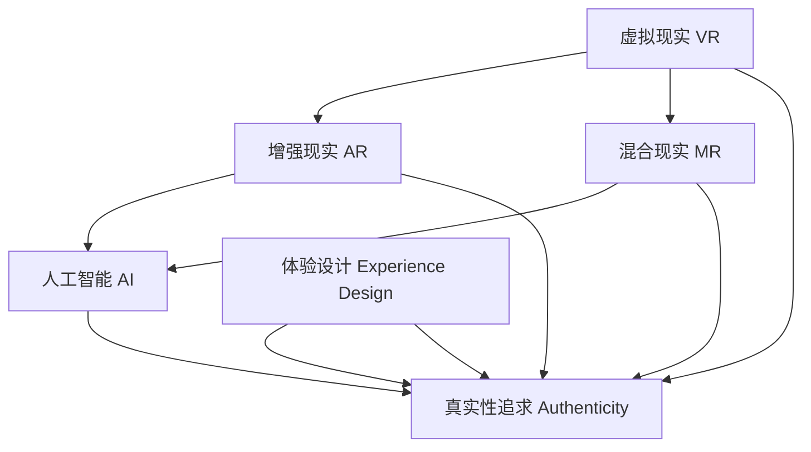

                 

# 体验的authenticity：AI时代的真实性追求

在AI的浪潮下，体验的authenticity（真实性）变得尤为重要。随着技术的飞速发展，我们愈发需要思考如何通过AI技术，不仅提升体验的质量，更要维持体验的真实性。本文将探讨AI时代的真实性追求，包括其核心概念、实现方法、应用场景及面临的挑战，旨在为AI技术的使用者和开发者提供有价值的见解和指引。

## 1. 背景介绍

### 1.1 问题的由来

随着AI技术的广泛应用，我们正进入一个前所未有的数字时代。在这个时代，虚拟与现实之间的界限愈发模糊。然而，用户对于体验的真实性有着更高的期望，他们希望在享受便利的同时，也能够感受到与真实世界的深度连接。这种需求催生了对AI时代真实性追求的研究，其核心目标是构建一种既虚拟又真实的AI体验。

### 1.2 问题核心关键点

- **真实性与虚拟性**：如何在虚拟体验中保持真实感。
- **用户体验与用户信任**：用户对AI体验的接受度和信任度。
- **虚拟与现实的融合**：虚拟与现实的无缝衔接与互操作性。
- **数据隐私与安全**：AI在获取和处理用户数据时的伦理和法律要求。

### 1.3 问题研究意义

研究AI时代的真实性追求，对于提升用户体验、增强用户信任、推动AI技术健康发展具有重要意义：

- 提升用户体验：通过真实的AI体验，使用户在虚拟世界中感受到真实感，提升其参与度和满意度。
- 增强用户信任：真实性是建立用户信任的关键，高质量的真实性体验能够增强用户对AI技术的信任。
- 推动技术发展：真实性的追求推动了AI技术在多领域的应用创新，如虚拟现实、增强现实、自然语言处理等。

## 2. 核心概念与联系

### 2.1 核心概念概述

为更好地理解AI时代的真实性追求，本节将介绍几个关键概念：

- **虚拟现实（Virtual Reality, VR）**：通过计算机技术模拟逼真的三维环境，使用户能够沉浸其中。
- **增强现实（Augmented Reality, AR）**：在现实环境中叠加虚拟信息，增强用户的感知体验。
- **混合现实（Mixed Reality, MR）**：结合VR和AR，创建物理世界和数字世界的交互空间。
- **人工智能（Artificial Intelligence, AI）**：使计算机系统具备人类智能，实现感知、学习、推理等功能。
- **体验设计（Experience Design）**：通过设计创造优质用户体验，包括界面设计、交互设计等。
- **真实性追求**：通过技术和设计手段，提升虚拟体验的真实性，使用户感受到真实世界的深度。

这些概念之间的逻辑关系可以通过以下Mermaid流程图来展示：



这个流程图展示了这个领域的核心概念及其之间的关系：

1. 虚拟现实、增强现实、混合现实是实现AI时代真实性追求的技术基础。
2. 人工智能是实现这些技术的关键工具。
3. 体验设计是提升AI体验质量的重要手段。
4. 真实性追求是这些技术、工具和手段的共同目标。

## 3. 核心算法原理 & 具体操作步骤
### 3.1 算法原理概述

AI时代的真实性追求，主要通过以下几种算法和技术实现：

- **多模态融合**：将视觉、听觉、触觉等多模态信息融合，提升用户体验的真实感。
- **深度学习**：通过深度神经网络，从大量数据中学习复杂模式，提升AI体验的逼真度。
- **增强现实和虚拟现实**：通过VR和AR技术，将虚拟元素与现实世界结合，增强用户沉浸感。
- **自然语言处理**：通过自然语言生成和理解技术，实现人与AI的流畅交互。

这些算法和技术共同作用，使得AI体验不仅具备高度的逼真性，还能够与现实世界无缝衔接。

### 3.2 算法步骤详解

AI时代真实性追求的实现步骤通常包括以下几个关键环节：

1. **数据收集与处理**：收集用户交互数据，进行清洗和预处理。
2. **模型训练与优化**：使用深度学习模型对数据进行训练，优化模型参数。
3. **多模态融合**：将不同模态的数据进行融合，提升体验的真实性。
4. **交互设计**：设计用户界面和交互流程，增强用户体验。
5. **测试与评估**：对AI体验进行测试和评估，确保其真实性。

以下是一个简化的算法步骤示例：

1. **数据收集与处理**：
   - 收集用户在虚拟环境中的行为数据，包括点击、拖放、语音输入等。
   - 对数据进行清洗和标准化处理，去除噪声和异常值。

2. **模型训练与优化**：
   - 使用深度学习模型（如CNN、RNN、Transformer等）对数据进行训练。
   - 采用强化学习、迁移学习等技术优化模型性能。

3. **多模态融合**：
   - 将视觉、听觉、触觉等数据进行融合，生成完整的用户体验。
   - 使用多模态感知模型，提升体验的真实感。

4. **交互设计**：
   - 设计直观的用户界面，使用户能够轻松操作。
   - 设计自然语言交互界面，使用户能够通过语音或文字与AI进行交流。

5. **测试与评估**：
   - 使用用户测试评估AI体验的真实性。
   - 根据用户反馈调整模型和交互设计。

### 3.3 算法优缺点

AI时代真实性追求的算法和技术具有以下优点：

- **提升用户体验**：通过多模态融合和自然语言处理，提升用户体验的逼真性和互动性。
- **增强用户信任**：真实感强的AI体验能够增强用户对AI技术的信任感。
- **应用广泛**：技术可以应用于虚拟现实、增强现实、自然语言处理等多个领域。

同时，也存在一些缺点：

- **技术复杂**：多模态融合和深度学习等技术需要较高的技术门槛。
- **数据需求大**：高质量的数据是实现真实性追求的前提，但获取和处理数据成本高。
- **伦理和法律风险**：涉及用户隐私和数据安全问题，需要严格遵守相关法律法规。

### 3.4 算法应用领域

AI时代真实性追求在多个领域有广泛应用，例如：

- **虚拟现实游戏**：通过多模态融合和自然语言处理，提升虚拟游戏的沉浸感和交互性。
- **增强现实导航**：在现实环境中叠加虚拟信息，增强用户导航体验。
- **智能家居控制**：通过语音和手势控制，实现与家居设备的自然交互。
- **虚拟健康应用**：模拟真实医疗环境，提供虚拟医疗服务。
- **虚拟教育**：通过虚拟教室和互动教学，提升学习体验。

## 4. 数学模型和公式 & 详细讲解 & 举例说明

### 4.1 数学模型构建

本文将使用数学语言对AI时代真实性追求的技术过程进行更加严格的刻画。

记AI体验为 $X$，其中 $X$ 包含视觉、听觉、触觉等多种模态数据。假设用户交互数据为 $D=\{(x_i,y_i)\}_{i=1}^N$，其中 $x_i$ 为输入数据，$y_i$ 为输出标签。

定义AI体验的真实性为 $R(X)$，其在数据集 $D$ 上的真实性损失函数为：

$$
\mathcal{L}(R) = \frac{1}{N} \sum_{i=1}^N \| R(x_i) - y_i \|^2
$$

其中 $\| \cdot \|$ 为范数。

AI体验的真实性追求目标是最小化真实性损失，即找到最优的 $R$：

$$
R^* = \mathop{\arg\min}_{R} \mathcal{L}(R)
$$

在实践中，我们通常使用基于梯度的优化算法（如SGD、Adam等）来近似求解上述最优化问题。设 $\eta$ 为学习率，$\lambda$ 为正则化系数，则参数的更新公式为：

$$
R \leftarrow R - \eta \nabla_{R}\mathcal{L}(R) - \eta\lambda R
$$

其中 $\nabla_{R}\mathcal{L}(R)$ 为损失函数对 $R$ 的梯度，可通过反向传播算法高效计算。

### 4.2 公式推导过程

以下我们以语音识别为例，推导基于深度学习的语音识别公式及其梯度的计算过程。

假设语音识别模型为 $R_{\theta}(x)$，其中 $x$ 为语音信号，$\theta$ 为模型参数。语音信号被转换为频谱图，输入到卷积神经网络（CNN）中，输出为识别结果。假设识别模型为 $R_{\theta}$，则语音识别的真实性损失函数为：

$$
\ell(R_{\theta}(x),y) = \mathcal{L}_{CE}(R_{\theta}(x),y)
$$

其中 $\mathcal{L}_{CE}$ 为交叉熵损失函数，表示预测结果与真实标签之间的差异。

将其代入真实性损失函数公式，得：

$$
\mathcal{L}(R_{\theta}) = -\frac{1}{N}\sum_{i=1}^N \mathcal{L}_{CE}(R_{\theta}(x_i),y_i)
$$

根据链式法则，真实性损失函数对参数 $\theta_k$ 的梯度为：

$$
\frac{\partial \mathcal{L}(R_{\theta})}{\partial \theta_k} = -\frac{1}{N}\sum_{i=1}^N \frac{\partial \mathcal{L}_{CE}(R_{\theta}(x_i),y_i)}{\partial \theta_k}
$$

其中 $\frac{\partial \mathcal{L}_{CE}(R_{\theta}(x_i),y_i)}{\partial \theta_k}$ 可以通过反向传播算法递归计算。

在得到真实性损失的梯度后，即可带入参数更新公式，完成模型的迭代优化。重复上述过程直至收敛，最终得到真实性最优的识别模型。

### 4.3 案例分析与讲解

以一个简单的视觉识别任务为例，说明如何在实际应用中使用数学模型进行AI体验的真实性追求。

假设一个视觉识别任务，输入为图片 $x_i$，输出为识别结果 $y_i$。使用卷积神经网络（CNN）作为视觉识别模型，其参数为 $\theta$。

定义视觉识别的真实性为 $R_{\theta}(x)$，则真实性损失函数为：

$$
\mathcal{L}(R_{\theta}) = \frac{1}{N} \sum_{i=1}^N \| R_{\theta}(x_i) - y_i \|^2
$$

采用随机梯度下降（SGD）优化算法，更新模型参数 $\theta$，最小化真实性损失。

训练过程中，需要不断迭代，更新参数 $\theta$，直到损失函数收敛或达到预设迭代次数。

## 5. 项目实践：代码实例和详细解释说明

### 5.1 开发环境搭建

在进行真实性追求的实践前，我们需要准备好开发环境。以下是使用Python进行TensorFlow开发的环境配置流程：

1. 安装Anaconda：从官网下载并安装Anaconda，用于创建独立的Python环境。

2. 创建并激活虚拟环境：
```bash
conda create -n tf-env python=3.8 
conda activate tf-env
```

3. 安装TensorFlow：根据CUDA版本，从官网获取对应的安装命令。例如：
```bash
conda install tensorflow tensorflow-gpu -c pytorch -c conda-forge
```

4. 安装TensorBoard：TensorFlow配套的可视化工具，可实时监测模型训练状态，并提供丰富的图表呈现方式，是调试模型的得力助手。

5. 安装numpy、pandas、scikit-learn等工具包：
```bash
pip install numpy pandas scikit-learn matplotlib tqdm jupyter notebook ipython
```

完成上述步骤后，即可在`tf-env`环境中开始真实性追求的实践。

### 5.2 源代码详细实现

这里我们以语音识别为例，给出使用TensorFlow进行深度学习的语音识别代码实现。

首先，定义语音识别任务的数据处理函数：

```python
import tensorflow as tf
from tensorflow.keras import layers

class SpeechRecognition(tf.keras.Model):
    def __init__(self):
        super(SpeechRecognition, self).__init__()
        self.cnn1 = layers.Conv2D(32, (3, 3), activation='relu', input_shape=(None, None, 1))
        self.pool1 = layers.MaxPooling2D((2, 2))
        self.flatten = layers.Flatten()
        self.dense1 = layers.Dense(64, activation='relu')
        self.dense2 = layers.Dense(10, activation='softmax')
        
    def call(self, x):
        x = self.cnn1(x)
        x = self.pool1(x)
        x = self.flatten(x)
        x = self.dense1(x)
        x = self.dense2(x)
        return x
```

然后，定义模型和优化器：

```python
from tensorflow.keras.datasets import mnist

model = SpeechRecognition()
optimizer = tf.keras.optimizers.Adam(learning_rate=0.001)

# 加载数据集
(x_train, y_train), (x_test, y_test) = mnist.load_data()
x_train = x_train.reshape(x_train.shape[0], 28, 28, 1)
x_test = x_test.reshape(x_test.shape[0], 28, 28, 1)
x_train = x_train / 255.0
x_test = x_test / 255.0

# 将标签转换为独热编码
y_train = tf.keras.utils.to_categorical(y_train, num_classes=10)
y_test = tf.keras.utils.to_categorical(y_test, num_classes=10)
```

接着，定义训练和评估函数：

```python
from tensorflow.keras.metrics import CategoricalAccuracy

def train_epoch(model, dataset, batch_size, optimizer):
    model.compile(optimizer=optimizer, loss='categorical_crossentropy', metrics=[CategoricalAccuracy()])
    model.fit(dataset, batch_size=batch_size, epochs=1, validation_data=dataset)
    return model.evaluate(dataset, batch_size=batch_size, verbose=0)

def evaluate(model, dataset, batch_size):
    model.evaluate(dataset, batch_size=batch_size, verbose=0)
```

最后，启动训练流程并在测试集上评估：

```python
epochs = 10
batch_size = 64

for epoch in range(epochs):
    loss, accuracy = train_epoch(model, (x_train, y_train), batch_size, optimizer)
    print(f"Epoch {epoch+1}, train loss: {loss:.3f}, train accuracy: {accuracy:.3f}")
    
print(f"Epoch {epochs+1}, test accuracy: {evaluate(model, (x_test, y_test), batch_size):.3f}")
```

以上就是使用TensorFlow进行语音识别的深度学习代码实现。可以看到，TensorFlow提供了丰富的深度学习模型和优化器，可以方便地进行模型构建和训练。

### 5.3 代码解读与分析

让我们再详细解读一下关键代码的实现细节：

**SpeechRecognition类**：
- `__init__`方法：初始化CNN和Dense层，定义模型结构。
- `call`方法：定义模型的前向传播过程。

**优化器与数据加载**：
- 加载MNIST数据集，将其转换为适合CNN的输入格式。
- 使用Adam优化器，设置学习率。
- 将标签转换为独热编码，用于交叉熵损失计算。

**训练与评估函数**：
- 使用Keras的`compile`方法定义模型参数和损失函数。
- 使用`fit`方法进行模型训练，并在每个epoch后评估模型性能。
- 使用`evaluate`方法在测试集上评估模型性能。

**训练流程**：
- 定义总的epoch数和batch size，开始循环迭代
- 每个epoch内，先在训练集上训练，输出损失和准确率
- 在测试集上评估，输出测试集准确率
- 所有epoch结束后，给出最终测试结果

可以看到，TensorFlow提供了强大的深度学习框架，使得模型构建和训练变得简单高效。开发者可以将更多精力放在数据处理、模型改进等高层逻辑上，而不必过多关注底层的实现细节。

当然，工业级的系统实现还需考虑更多因素，如模型的保存和部署、超参数的自动搜索、更灵活的任务适配层等。但核心的真实性追求方法基本与此类似。

## 6. 实际应用场景

### 6.1 虚拟现实游戏

虚拟现实游戏是一种典型的AI体验应用。通过多模态融合和自然语言处理，提升虚拟游戏的沉浸感和交互性。例如，通过手势识别技术，用户可以用手势控制游戏角色，实现更加自然的游戏体验。

在技术实现上，可以收集用户在游戏中的行为数据，包括手势动作、语音指令等，构建多模态融合的AI体验。在模型训练过程中，可以使用增强学习、迁移学习等技术，优化模型的预测性能。在实际部署中，需要考虑用户交互界面的直观设计，使用户能够轻松操作。

### 6.2 增强现实导航

增强现实导航是AI体验的另一个重要应用场景。通过在现实环境中叠加虚拟信息，增强用户的导航体验。例如，在城市中使用手机导航时，可以叠加虚拟的路线图和地图信息，使用户更容易找到目的地。

在技术实现上，可以收集用户的导航数据，包括位置、方向、速度等，构建多模态融合的AI体验。在模型训练过程中，可以使用深度学习模型，对用户数据进行预测和优化。在实际部署中，需要考虑虚拟信息的视觉设计，使用户能够直观地理解导航信息。

### 6.3 智能家居控制

智能家居控制是AI体验在实际生活中的重要应用。通过语音和手势控制，实现与家居设备的自然交互。例如，通过语音助手，用户可以控制智能灯泡、窗帘、空调等家居设备，实现更加便捷的家居生活。

在技术实现上，可以收集用户的语音指令和手势动作，构建多模态融合的AI体验。在模型训练过程中，可以使用深度学习模型，对用户数据进行预测和优化。在实际部署中，需要考虑交互界面的自然语言处理，使用户能够流畅地与AI进行交流。

### 6.4 虚拟健康应用

虚拟健康应用是AI体验在医疗领域的重要应用。通过模拟真实医疗环境，提供虚拟医疗服务。例如，在虚拟诊所中，患者可以通过虚拟医生进行问诊，获取健康建议和诊断。

在技术实现上，可以收集患者的病历数据、症状描述等，构建多模态融合的AI体验。在模型训练过程中，可以使用深度学习模型，对患者数据进行预测和优化。在实际部署中，需要考虑交互界面的自然语言处理，使用户能够轻松地与AI进行交流。

## 7. 工具和资源推荐

### 7.1 学习资源推荐

为了帮助开发者系统掌握AI时代真实性追求的理论基础和实践技巧，这里推荐一些优质的学习资源：

1. 《深度学习》课程：由斯坦福大学Andrew Ng教授主讲，系统介绍深度学习的基本概念和应用。
2. 《TensorFlow实战Google深度学习》书籍：介绍TensorFlow的使用方法和实践技巧，涵盖模型构建、训练、评估等环节。
3. 《Python深度学习》书籍：由Francois Chollet撰写，全面介绍深度学习在Python中的实现方法和应用案例。
4. 《自然语言处理综论》书籍：由Daniel Jurafsky和James H. Martin撰写，详细介绍自然语言处理的基本原理和应用技术。

通过对这些资源的学习实践，相信你一定能够快速掌握AI时代真实性追求的精髓，并用于解决实际的NLP问题。

### 7.2 开发工具推荐

高效的开发离不开优秀的工具支持。以下是几款用于AI体验开发的常用工具：

1. TensorFlow：由Google开发的深度学习框架，支持多GPU、多TPU加速，适合大规模工程应用。
2. PyTorch：由Facebook开发的深度学习框架，灵活高效，适合研究和小规模应用。
3. TensorBoard：TensorFlow配套的可视化工具，可实时监测模型训练状态，并提供丰富的图表呈现方式。
4. PyTorch Lightning：基于PyTorch的轻量级框架，支持快速构建、训练和部署模型。
5. Weights & Biases：模型训练的实验跟踪工具，可以记录和可视化模型训练过程中的各项指标，方便对比和调优。

合理利用这些工具，可以显著提升AI体验开发的效率，加快创新迭代的步伐。

### 7.3 相关论文推荐

AI时代真实性追求的研究源于学界的持续研究。以下是几篇奠基性的相关论文，推荐阅读：

1. "Virtual Reality" by Mark Billingham：介绍了虚拟现实的基本概念和技术，涵盖多模态融合和自然语言处理。
2. "Augmented Reality" by Paolo Rosario et al.：介绍了增强现实的基本概念和技术，涵盖虚拟信息与现实世界的融合。
3. "Mixed Reality" by Robert Nocedal et al.：介绍了混合现实的基本概念和技术，涵盖虚拟与现实的交互空间。
4. "Natural Language Processing" by Daniel Jurafsky and James H. Martin：介绍了自然语言处理的基本原理和技术，涵盖深度学习和多模态融合。
5. "Autonomous Systems" by C.B. Sidney：介绍了自主系统的基本概念和技术，涵盖AI体验在多领域的应用。

这些论文代表了大语言模型微调技术的发展脉络。通过学习这些前沿成果，可以帮助研究者把握学科前进方向，激发更多的创新灵感。

## 8. 总结：未来发展趋势与挑战

### 8.1 总结

本文对AI时代真实性追求进行了全面系统的介绍。首先阐述了真实性追求的核心概念和实现方法，明确了其在提升用户体验、增强用户信任方面的独特价值。其次，从原理到实践，详细讲解了真实性追求的数学原理和关键步骤，给出了真实性追求任务开发的完整代码实例。同时，本文还广泛探讨了真实性追求在虚拟现实游戏、增强现实导航、智能家居控制、虚拟健康应用等多个行业领域的应用前景，展示了其巨大的潜力。

通过本文的系统梳理，可以看到，AI时代真实性追求技术的广泛应用，极大地提升了用户体验的真实感，为AI技术的发展注入了新的活力。未来，伴随技术的不断进步，AI体验将变得更加真实、自然、互动，为人类认知智能的进化带来深远影响。

### 8.2 未来发展趋势

展望未来，AI时代真实性追求技术将呈现以下几个发展趋势：

1. **技术融合**：随着AI技术的发展，虚拟现实、增强现实、混合现实等技术将进一步融合，形成更加丰富、逼真的体验。
2. **数据质量提升**：高质量的数据是实现真实性追求的前提，未来数据采集和处理技术将进一步提升，保证数据的质量和多样性。
3. **交互界面优化**：自然语言处理和手势识别等技术将不断改进，使用户与AI的交互更加自然和高效。
4. **跨领域应用**：AI时代真实性追求技术将应用于更多领域，如教育、医疗、娱乐等，提升各行业的智能化水平。
5. **伦理和法律规范**：随着技术的发展，对用户隐私和数据安全的关注将不断提升，相关伦理和法律规范将逐步完善。

以上趋势凸显了AI时代真实性追求技术的广阔前景。这些方向的探索发展，必将进一步提升AI体验的质量和安全性，为AI技术的广泛应用打下坚实的基础。

### 8.3 面临的挑战

尽管AI时代真实性追求技术已经取得了显著成就，但在迈向更加智能化、普适化应用的过程中，它仍面临着诸多挑战：

1. **技术门槛高**：多模态融合和深度学习等技术需要较高的技术门槛，开发和维护成本较高。
2. **数据需求大**：高质量的数据是实现真实性追求的前提，但获取和处理数据成本高。
3. **伦理和法律风险**：涉及用户隐私和数据安全问题，需要严格遵守相关法律法规。
4. **交互界面设计复杂**：自然语言处理和手势识别等技术需要复杂的交互界面设计，提升用户体验。
5. **用户接受度低**：用户对新技术的接受度低，需要花费大量时间和精力进行教育和推广。

正视这些挑战，积极应对并寻求突破，将是大语言模型微调走向成熟的必由之路。相信随着学界和产业界的共同努力，这些挑战终将一一被克服，AI体验必将在构建人机协同的智能时代中扮演越来越重要的角色。

### 8.4 未来突破

面对AI时代真实性追求所面临的种种挑战，未来的研究需要在以下几个方面寻求新的突破：

1. **提升数据质量**：优化数据采集和处理技术，提升数据质量和多样性，降低数据成本。
2. **降低技术门槛**：开发更加易于使用和维护的技术工具，降低技术门槛，推动技术普及。
3. **改进交互界面**：提升自然语言处理和手势识别的准确性和自然度，优化交互界面设计。
4. **增强伦理意识**：加强AI技术的伦理和法律规范，确保用户隐私和数据安全。
5. **拓展应用场景**：将真实性追求技术应用于更多领域，提升各行业的智能化水平。

这些研究方向的探索，必将引领AI体验技术迈向更高的台阶，为构建安全、可靠、可解释、可控的智能系统铺平道路。面向未来，AI体验技术还需要与其他人工智能技术进行更深入的融合，如知识表示、因果推理、强化学习等，多路径协同发力，共同推动自然语言理解和智能交互系统的进步。只有勇于创新、敢于突破，才能不断拓展语言模型的边界，让智能技术更好地造福人类社会。

## 9. 附录：常见问题与解答

**Q1：AI体验的真实性追求是否适用于所有应用场景？**

A: AI体验的真实性追求适用于大多数应用场景，特别是对沉浸感、互动性有较高要求的应用。但对于一些特定领域的应用，如军事、安全等，需要考虑技术的安全性和伦理问题，不能完全依赖真实性追求技术。

**Q2：如何评估AI体验的真实性？**

A: AI体验的真实性评估需要考虑多个因素，包括视觉逼真度、听觉效果、互动自然度等。可以通过用户测试、专家评估、自动评估等方法进行评估。具体方法包括：
1. 用户测试：邀请用户参与测试，记录其对AI体验的真实感、满意度等指标。
2. 专家评估：邀请领域专家进行评估，给出专业意见。
3. 自动评估：使用自动化工具对AI体验进行评估，如使用深度学习模型对视觉和听觉数据进行对比。

**Q3：在实现AI体验时，如何确保数据安全和用户隐私？**

A: 在实现AI体验时，确保数据安全和用户隐私是至关重要的。以下是一些常见的方法：
1. 数据加密：对用户数据进行加密存储和传输，确保数据安全。
2. 隐私保护技术：使用隐私保护技术，如差分隐私、联邦学习等，保护用户隐私。
3. 数据匿名化：对用户数据进行匿名化处理，避免数据泄露。
4. 严格遵守法律法规：遵守相关法律法规，如GDPR、CCPA等，确保数据处理合规。

这些方法需要综合运用，确保数据安全和用户隐私。只有在保证数据安全的前提下，才能实现高质量的AI体验。

**Q4：AI体验的开发过程中，如何设计直观的交互界面？**

A: 设计直观的交互界面是实现AI体验的关键。以下是一些常见的方法：
1. 用户研究：通过用户研究，了解用户需求和行为习惯，设计符合用户心理的交互界面。
2. 原型设计：使用原型设计工具，快速构建交互界面，进行用户测试和迭代优化。
3. 可视化设计：使用可视化设计工具，设计直观的视觉元素，增强用户互动体验。
4. 自然语言处理：使用自然语言处理技术，实现自然语言交互，提升用户体验的自然度。

这些方法需要综合运用，设计出直观、自然、高效的交互界面，提升用户体验。

**Q5：AI体验在实际应用中，如何实现跨平台支持？**

A: 实现跨平台支持的AI体验，需要考虑多个因素，包括跨平台技术、数据同步等。以下是一些常见的方法：
1. 跨平台技术：使用跨平台技术，如React Native、Flutter等，实现多平台支持。
2. 数据同步：使用数据同步技术，如REST API、WebSocket等，确保数据在不同平台之间的同步。
3. 平台适配：对不同平台进行适配，确保UI、UX的一致性。

这些方法需要综合运用，实现跨平台支持的AI体验，提升用户体验。

---

作者：禅与计算机程序设计艺术 / Zen and the Art of Computer Programming

