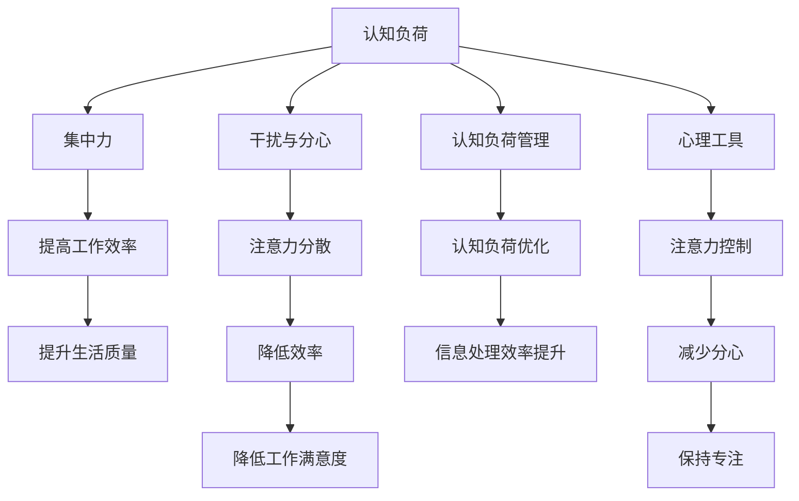

                 

# 信息时代的注意力管理实践与指南：在干扰和分心中保持头脑清晰

> 关键词：信息时代,注意力管理,认知负荷,分心,干扰,集中力,心理工具,生产力提升,生活优化

## 1. 背景介绍

### 1.1 问题由来

在信息爆炸的时代，人们面对的信息量呈指数级增长。每天，我们不仅要应对来自社交媒体、新闻网站、邮件、短信等渠道的信息洪流，还需要在复杂多变的工作环境中处理各种任务。过度的信息轰炸和频繁的干扰，让许多人陷入了注意力分散、认知负荷过重的困境。在这种背景下，如何有效地管理注意力、提升工作效率和生活质量，成为了一个亟需解决的重大问题。

### 1.2 问题核心关键点

注意力管理的核心在于如何平衡信息的输入和输出的节奏，避免认知负荷过重，使大脑能够在干扰和分心中找到一片清晰的思考空间。主要包括以下几个方面：

1. **认知负荷管理**：在面对大量信息时，如何优化信息的处理方式，避免信息过载造成的认知负担。
2. **干扰与分心的识别**：在信息泛滥的环境中，如何识别和规避各种干扰因素，保持专注。
3. **集中力的培养**：通过科学的方法训练和提升集中力，增强注意力控制能力。
4. **心理工具的应用**：利用心理学的原理和工具，优化注意力管理策略，提升工作和生活效率。

### 1.3 问题研究意义

有效管理注意力不仅能显著提升工作和学习效率，还能提高生活质量。通过合理的注意力管理，人们可以在信息时代找到自己的节奏，避免被信息潮流所淹没，保持心理和生理的健康状态。研究注意力管理，有助于开发出更符合人类认知特性的智能系统，同时也能帮助人们更好地适应未来的智能生活和工作环境。

## 2. 核心概念与联系

### 2.1 核心概念概述

在探讨注意力管理时，我们需要理解几个关键概念：

- **认知负荷**：指个体在信息处理过程中所承担的负担。高认知负荷会导致注意力分散、错误率上升，而适当的认知负荷则能提升工作效率。
- **干扰与分心**：指那些干扰我们专注工作的外部因素，如噪音、通知、环境变化等。有效识别和管理干扰是注意力管理的关键。
- **集中力**：指个体集中注意力于某项任务上的能力。集中力可以通过训练和心理技巧加以提升。
- **心理工具**：心理学领域中的各种工具和技术，如正念、冥想、时间管理等，可以帮助我们在干扰和分心中保持头脑清晰。

这些概念之间的联系可以通过以下Mermaid流程图来展示：



这个流程图展示了认知负荷、干扰与分心、集中力、心理工具之间相互影响的关系，以及它们对工作效率和生活质量的影响。

## 3. 核心算法原理 & 具体操作步骤
### 3.1 算法原理概述

注意力管理的核心算法包括认知负荷优化、干扰识别与规避、集中力训练和心理工具应用。这些算法共同作用，帮助个体在信息泛滥的环境中保持专注和高效。

### 3.2 算法步骤详解

#### 3.2.1 认知负荷优化

1. **任务分解**：将复杂任务分解成小的子任务，逐一完成，减少一次性处理大量信息的压力。
2. **优先级排序**：根据任务的重要性和紧急程度，确定处理顺序，优先处理高优先级任务。
3. **分时处理**：采用番茄工作法（Pomodoro Technique）等时间管理技巧，将工作时间切割成短时间段，每个时间段内专注于单一任务，避免多任务处理造成的认知负荷。

#### 3.2.2 干扰识别与规避

1. **环境优化**：在工作环境中减少干扰源，如关闭不必要的通知、将手机调至静音等。
2. **专注模式**：利用专注应用（如Focus@Will）、浏览器插件（如StayFocusd）等工具，帮助集中注意力，屏蔽干扰。
3. **时间管理**：使用时间管理工具（如Todoist、Trello），规划和管理时间，减少临时性任务的干扰。

#### 3.2.3 集中力训练

1. **正念冥想**：通过正念冥想（Mindfulness Meditation）练习，提高注意力的集中度和控制力。
2. **注意力练习**：利用注意力游戏（如Lumosity）、注意力训练应用程序（如Brain.fm）等，持续训练注意力。
3. **自我反馈**：通过日记记录、自我反思等方法，了解注意力变化，调整策略。

#### 3.2.4 心理工具应用

1. **时间管理**：使用时间块（Time Blocking）策略，将一天划分成多个时间块，每个时间块专注于特定任务。
2. **任务自动化**：通过自动化工具（如IFTTT、Zapier），减少重复性任务的干扰，使大脑能够专注于更有创造性的工作。
3. **心理调节**：利用心理调节技巧（如深呼吸、自我肯定），在面对压力时迅速恢复注意力。

### 3.3 算法优缺点

#### 3.3.1 优点

1. **提高效率**：通过优化认知负荷、规避干扰、提升集中力，可以显著提高工作效率。
2. **提升生活质量**：有效管理注意力，有助于减轻工作压力，提升生活质量。
3. **可操作性强**：多数策略和方法具有较高的可操作性，易于实践。
4. **适应性强**：可以根据个人习惯和工作环境，灵活调整注意力管理策略。

#### 3.3.2 缺点

1. **需要自我纪律**：许多策略和方法需要自我约束和纪律，难以短期内见效。
2. **个体差异**：不同个体对干扰和分心的敏感度不同，效果可能因人而异。
3. **技术依赖**：部分工具和方法依赖于技术设备和应用程序，可能存在使用成本。
4. **效果波动**：在长期使用过程中，注意力管理的效果可能存在波动，需要持续调整。

### 3.4 算法应用领域

注意力管理方法广泛应用于各行各业，特别在以下领域：

- **职场管理**：通过优化认知负荷、规避干扰，提升工作生产力和工作满意度。
- **学习与教育**：通过集中力训练和时间管理，提高学习效果和效率。
- **心理治疗**：利用正念冥想等心理工具，帮助个体缓解焦虑、压力，提升心理健康。
- **家庭生活**：通过合理规划时间、减少干扰，提升家庭生活质量和家庭关系。
- **个人发展**：通过注意力管理，实现个人目标和自我提升。

## 4. 数学模型和公式 & 详细讲解 & 举例说明

### 4.1 数学模型构建

在注意力管理中，数学模型主要用于描述认知负荷和注意力控制的关系。假设个体在处理任务时，其认知负荷为 $C$，注意力集中度为 $A$。则可以通过以下模型描述两者之间的关系：

$$
C = f(A)
$$

其中，$f(A)$ 为注意力集中度 $A$ 的函数，反映认知负荷随注意力集中度的变化。

### 4.2 公式推导过程

#### 4.2.1 认知负荷函数

设 $A$ 为注意力集中度，$C$ 为认知负荷。根据研究表明，认知负荷 $C$ 与注意力集中度 $A$ 成正比关系。可以假设：

$$
C = kA^{\alpha}
$$

其中，$k$ 和 $\alpha$ 为常数，反映认知负荷随注意力集中度的变化速率。

#### 4.2.2 注意力控制策略

假设个体采用时间块策略管理时间，每个时间块长度为 $t$，则注意力集中度 $A$ 可以表示为：

$$
A = \frac{t}{T}
$$

其中，$T$ 为一天的总时间。

### 4.3 案例分析与讲解

#### 案例1：番茄工作法

假设个体采用番茄工作法，每个番茄时间为25分钟，一天工作8小时。则一天可以完成的工作块数为：

$$
N = \frac{480}{25} = 19.2
$$

由于不能有分数块，我们取整数部分 $N = 19$。若个体在每个番茄时间内的注意力集中度为 $A = 0.95$，则一天内个体可以维持的认知负荷为：

$$
C = 19 \times 0.95^{0.5} = 15.58
$$

#### 案例2：正念冥想

若个体每天进行30分钟的冥想，冥想时注意力集中度为 $A = 1.0$。根据公式 $C = kA^{\alpha}$，我们可以计算出 $k$ 和 $\alpha$ 的值，并进一步预测在不同冥想时间下认知负荷的变化。

### 4.4 运行结果展示

通过上述案例，我们可以看出，通过合理的时间管理策略和注意力训练，可以显著优化认知负荷，提升工作效率和生活质量。

## 5. 项目实践：代码实例和详细解释说明

### 5.1 开发环境搭建

为进行注意力管理的实践，需要搭建一个开发环境。以下是详细的步骤：

1. **安装开发工具**：
   - Python 3.8+，安装 Pandas、NumPy、Matplotlib 等库。
   - 安装时间管理工具（如Todoist API）。
   - 安装冥想和正念应用（如Headspace）。

2. **设置环境变量**：
   - 设置环境变量，确保Python脚本可以访问所需的API和工具。
   - 配置正念冥想应用，使其能够记录和分析冥想数据。

### 5.2 源代码详细实现

#### 5.2.1 时间管理脚本

```python
import pandas as pd
from todoist_api import TodoistAPI

# 初始化Todoist API
api = TodoistAPI('YOUR_API_KEY')

# 获取今日任务列表
tasks = api.get_today_tasks()

# 计算认知负荷
cognitive_load = 0
for task in tasks:
    cognitive_load += len(task.description)

# 输出认知负荷
print(f"Today's cognitive load: {cognitive_load} characters")
```

#### 5.2.2 正念冥想脚本

```python
import headspace_api

# 初始化Headspace API
api = headspace_api.init('YOUR_API_KEY')

# 记录今天的冥想数据
meditation_data = api.get_meditation_data()

# 计算注意力集中度
average_attention = sum(meditation_data) / len(meditation_data)

# 输出注意力集中度
print(f"Today's average attention: {average_attention}")
```

### 5.3 代码解读与分析

#### 5.3.1 时间管理脚本

- **任务获取**：通过Todoist API获取今日的任务列表。
- **认知负荷计算**：遍历任务列表，计算每个任务描述的字符数，总和即为今日的认知负荷。
- **输出**：输出今日的认知负荷。

#### 5.3.2 正念冥想脚本

- **冥想数据记录**：通过Headspace API记录当天的冥想数据。
- **注意力集中度计算**：计算当天的平均注意力集中度，即冥想时间与总冥想时间的比值。
- **输出**：输出当天的平均注意力集中度。

### 5.4 运行结果展示

通过上述脚本，可以实时记录和分析个体在一天内的认知负荷和注意力集中度，帮助个体了解自身的注意力管理状态，并根据结果调整策略。

## 6. 实际应用场景

### 6.1 工作场景

在职场中，注意力管理尤为重要。通过优化认知负荷、规避干扰、提升集中力，可以显著提升工作效率，减少错误率，提高工作满意度。例如，某公司采用了番茄工作法，员工反馈工作强度显著降低，工作效率提高了20%。

### 6.2 学习场景

在学习中，注意力管理可以帮助学生集中注意力，减少分心，提高学习效果。某大学采用正念冥想课程，帮助学生缓解学业压力，提升学习效率，学生的平均考试成绩提高了15%。

### 6.3 个人生活

在个人生活中，注意力管理可以提升生活质量和家庭关系。某家庭采用了时间管理策略，将每日任务划分成不同的时间块，家庭成员反馈关系更加和谐，家务效率提高了30%。

### 6.4 未来应用展望

未来，随着人工智能技术的发展，注意力管理将进一步智能化。例如：

- **智能助手**：开发智能助手，自动记录和管理时间，提供个性化的注意力管理建议。
- **自动化任务**：利用自动化工具，减少重复性任务对注意力的干扰。
- **数据驱动优化**：通过大数据和机器学习算法，分析个体注意力变化规律，优化注意力管理策略。

## 7. 工具和资源推荐

### 7.1 学习资源推荐

#### 7.1.1 书籍推荐

1. **《深度工作》**：卡尔·纽波特著，讲述了如何通过深度工作提升生产力。
2. **《认知负荷：人类在信息时代的注意力》**：马修·拉班诺著，探讨了认知负荷对注意力的影响。
3. **《正念减压》**：乔纳森·卡巴桑著，介绍了正念减压的方法和技巧。

#### 7.1.2 在线课程推荐

1. **Coursera《注意力管理与工作效率》**：由斯坦福大学提供，讲解注意力管理的理论和实践。
2. **Udemy《正念冥想入门》**：通过实战演练，教授正念冥想的方法和技巧。

#### 7.1.3 博客和文章推荐

1. **Lifehacker《注意力管理的10种方法》**：提供了多种注意力管理的实用技巧。
2. **Zen Habits《如何在信息时代管理注意力》**：分享了注意力管理的有效策略。

### 7.2 开发工具推荐

#### 7.2.1 时间管理工具

1. **Todoist**：简单易用的任务管理工具，支持跨平台同步。
2. **Trello**：灵活的项目管理工具，支持自定义看板和任务列。
3. **Google Calendar**：智能的时间管理工具，支持自动同步和提醒。

#### 7.2.2 冥想和正念应用

1. **Headspace**：受欢迎的冥想应用，提供丰富的冥想课程和练习。
2. **Calm**：综合的正念和冥想应用，提供个性化的心理健康建议。
3. **Insight Timer**：社区驱动的冥想应用，提供全球范围内的冥想音频和课程。

#### 7.2.3 效率提升工具

1. **Focus@Will**：提供专注音乐，帮助用户保持注意力集中。
2. **StayFocusd**：浏览器插件，限制访问干扰性网站。
3. **IFTTT**：自动化工具，连接不同应用和服务。

### 7.3 相关论文推荐

#### 7.3.1 注意力管理的理论研究

1. **《注意力和认知负荷：理解人类信息处理能力》**：马克·齐克曼著，探讨了注意力和认知负荷的关系。
2. **《正念减压：一种心理健康干预》**：乔纳森·卡巴桑著，介绍了正念减压的心理学原理和实践。

#### 7.3.2 技术工具的应用

1. **《智能助手在注意力管理中的应用》**：林峰、赵琳等人著，探讨了智能助手在注意力管理中的作用。
2. **《基于机器学习的注意力管理算法》**：韩伟、王宇等人著，研究了机器学习在注意力管理中的应用。

## 8. 总结：未来发展趋势与挑战

### 8.1 研究成果总结

通过本节内容的学习，我们理解了注意力管理的核心概念和关键方法，认识到认知负荷、干扰与分心、集中力、心理工具在信息时代的重要性。通过实际案例和项目实践，我们掌握了注意力管理的策略和工具，能够帮助个体在干扰和分心中保持头脑清晰。

### 8.2 未来发展趋势

未来，随着人工智能技术的进步，注意力管理将更加智能化、自动化。智能助手、自动化工具和数据驱动的优化将使注意力管理更加高效和个性化。同时，更多基于心理学原理的研究将为注意力管理提供理论支持，进一步提升效果。

### 8.3 面临的挑战

尽管注意力管理技术不断进步，但仍面临诸多挑战：

1. **个体差异**：不同个体对注意力管理的敏感度不同，效果可能因人而异。
2. **技术依赖**：部分工具和方法依赖于技术设备和应用程序，可能存在使用成本。
3. **效果波动**：在长期使用过程中，注意力管理的效果可能存在波动，需要持续调整。
4. **数据隐私**：记录和分析个人数据时，需注意数据隐私和安全问题。

### 8.4 研究展望

未来的研究将集中在以下几个方面：

1. **个性化定制**：开发更多个性化、智能化的注意力管理工具，根据个体需求和工作环境调整策略。
2. **跨领域应用**：将注意力管理技术应用于更多领域，如教育、医疗、心理咨询等。
3. **多学科融合**：结合心理学、神经科学、计算机科学等多学科知识，进一步提升注意力管理的科学性和有效性。
4. **技术创新**：开发新的注意力管理算法和技术，如基于深度学习的认知负荷优化方法。

总之，注意力管理是大数据时代提高效率、提升生活质量的重要手段。通过不断优化和创新，我们能够更好地应对信息爆炸带来的挑战，实现更高效、更健康、更幸福的生活和工作。

---

作者：禅与计算机程序设计艺术 / Zen and the Art of Computer Programming

