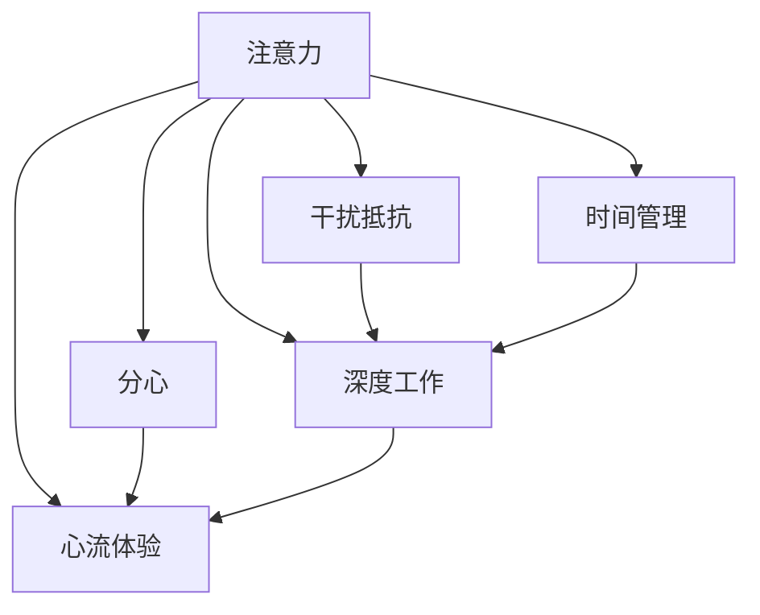

                 

# 信息时代的注意力管理策略：在干扰和分心中保持头脑清晰和专注

> 关键词：信息过载, 注意力管理, 干扰抵抗, 高效工作, 时间管理, 深度工作

## 1. 背景介绍

在信息时代，人类每天都会面临海量的信息冲击和多重干扰，导致注意力分散，工作效率下降，生活品质受损。如何在干扰和分心中保持头脑清晰和专注，成为现代职场和个人生活中亟待解决的难题。本文将探讨几种有效的注意力管理策略，帮助用户在信息泛滥的时代中，保持高效的工作状态和清晰的思维能力。

### 1.1 问题由来

随着互联网和移动互联网的普及，信息获取变得前所未有的便捷，但同时也带来了信息过载的问题。据研究显示，现代人每天面对的信息量已达数千条，远超认知能力极限，导致注意力分散，工作效率下降。以下场景中，注意力管理策略的必要性尤为突出：

- **职场环境**：开放办公室的干扰、频繁的电子邮件和即时通讯打扰、各类会议和电话等，都会占用大量时间和精力。
- **学习环境**：网络课程、电子书籍、在线研讨等形式的学习资源丰富，但也需要有效的时间管理和注意力控制。
- **休闲娱乐**：智能手机、平板、电视等设备充满各种应用，很容易陷入无意义的娱乐时间消耗。
- **家庭生活**：家庭内部的多任务处理、孩子的教育、家务等，需要高效管理时间和注意力。

### 1.2 问题核心关键点

有效管理注意力，提升信息时代的工作效率和生活品质，关键在于以下几个方面：

- **时间管理**：学会合理分配时间，集中精力处理重要任务。
- **干扰抵抗**：识别并避免各种干扰源，保持专注状态。
- **心理调整**：提升心理抗压能力，学会减压和恢复精力。
- **习惯培养**：建立良好的工作和生活习惯，提升自律能力。
- **技术工具**：利用各种工具辅助注意力管理，提高工作效率。

## 2. 核心概念与联系

### 2.1 核心概念概述

为更好地理解注意力管理策略，本文将介绍几个关键概念：

- **注意力**：指个体对特定目标或对象的集中关注和认知资源分配。
- **干扰**：指任何导致注意力分散的外部或内部因素，包括噪音、电子设备通知、多任务切换等。
- **分心**：指由于干扰或心理压力导致的注意力分散，影响工作效率和决策质量。
- **时间管理**：指对时间的规划、监控和调整，以提高工作效率和生活品质。
- **深度工作**：指专注于当前任务，不受干扰，全神贯注地工作方式。
- **心流体验**：指在工作或活动中达到一种忘我状态，体验到高度集中和满足感的心理状态。
- **技术工具**：指利用软件、应用和设备，辅助提升注意力管理和效率的工具。

这些概念之间的逻辑关系可以通过以下Mermaid流程图来展示：



这个流程图展示了几项核心概念之间的内在联系：注意力是基础，干扰抵抗和分心是挑战，时间管理、深度工作和心流体验是应对策略，技术工具是辅助手段。通过理解这些概念及其相互关系，可以制定有效的注意力管理策略。

## 3. 核心算法原理 & 具体操作步骤
### 3.1 算法原理概述

注意力管理策略的原理，是通过识别和避免干扰源，优化时间分配，增强心理调适能力，建立高效工作习惯，以及利用技术工具辅助管理，从而提升个体在工作和生活中的专注度和效率。这些策略的实施，依赖于心理学、时间管理和认知科学等领域的知识和方法。

### 3.2 算法步骤详解

以下是对几种核心注意力管理策略的具体步骤详解：

#### 步骤一：识别和避免干扰源
1. **环境分析**：评估工作或学习环境，识别可能引起干扰的因素，如噪音、光线、同事或家人打扰等。
2. **工具使用**：使用噪音消除耳机、遮光窗帘、耳机等工具，减少外部干扰。
3. **时间管理**：设定专注工作时间，关闭手机和电脑上的通知提醒，避免干扰打断。
4. **心理调整**：学会放松技巧，如深呼吸、冥想、短暂散步等，缓解压力和焦虑。

#### 步骤二：优化时间分配
1. **任务优先级**：利用Eisenhower矩阵等方法，确定任务的优先级，优先处理重要和紧急的任务。
2. **时间块管理**：采用时间块管理法，将一天划分为多个时间块，每个时间块专注于一个任务。
3. **任务切换**：严格限制任务切换的频率，避免频繁的多任务处理。

#### 步骤三：增强心理调适能力
1. **心理训练**：通过定期进行心理训练，提升心理韧性和抗压能力，如正念训练、认知行为疗法等。
2. **自我反思**：定期进行自我反思，总结工作和生活中的经验和教训，调整心态和方法。
3. **健康生活**：保持健康的饮食、充足的睡眠和定期的体育锻炼，提升整体健康水平。

#### 步骤四：建立高效工作习惯
1. **规律作息**：建立固定的作息规律，保证充足的睡眠和能量。
2. **定期休息**：采用番茄工作法等时间管理方法，定期休息和恢复精力。
3. **习惯培养**：通过小步前进、持续改进的方式，逐步培养良好的工作习惯，如晨间计划、晚间总结等。

#### 步骤五：利用技术工具辅助管理
1. **专注应用**：使用专注类应用，如Forest、Focus@Will等，限制手机使用时间，保持专注状态。
2. **任务管理工具**：使用任务管理工具，如Trello、Asana等，明确任务和进度，避免遗漏和重复。
3. **日历应用**：利用日历应用，如Google Calendar、Outlook等，合理规划每天的时间。

### 3.3 算法优缺点

注意力管理策略的优点在于：

- **提高效率**：通过有效的时间管理和干扰抵抗，可以显著提高个人和工作效率。
- **提升生活质量**：建立良好的生活习惯和心理调适能力，改善生活质量。
- **降低压力**：通过合理的时间分配和心理调整，可以减轻工作和生活带来的压力。

同时，这些策略也存在一些局限性：

- **初期难度**：初期调整习惯和学习新方法需要时间和精力，可能存在适应期。
- **个性化差异**：不同个体的心理素质和生活环境不同，需要个性化的调整和适应。
- **工具依赖**：过度依赖技术工具可能降低个人的主动性和自律性。
- **环境限制**：外部环境的变化可能会影响策略的实施效果。

### 3.4 算法应用领域

注意力管理策略不仅适用于个人和职场环境，还广泛应用于教育、家庭、医疗等多个领域：

- **教育**：教师和学生需要管理课堂和网络学习中的注意力，提升教学和学习效果。
- **家庭**：父母和子女需要管理家庭生活中的注意力，平衡工作和家庭责任。
- **医疗**：医生和患者需要管理医疗环境中的注意力，提高诊疗效果和满意度。
- **商务**：企业家和管理者需要管理商务活动中的注意力，提升决策质量和团队效率。

这些策略在不同领域的应用，体现了注意力管理的重要性，并提供了多样化的实施方法。

## 4. 数学模型和公式 & 详细讲解 & 举例说明
### 4.1 数学模型构建

注意力管理策略的数学模型，主要围绕时间管理、干扰抵抗和心理调适等方面构建。

设个体一天的工作时间为 $T$，需要完成的任务数量为 $N$，每个任务的时间消耗为 $t_i$，则总时间分配可以表示为：

$$
\text{Total Time} = \sum_{i=1}^N t_i
$$

任务优先级可以表示为 $P_i$，其中 $P_i \in [0,1]$，表示任务 $i$ 的优先级。任务时间分配可以表示为 $A_i$，满足 $A_i \geq 0$，则最优时间分配的数学模型为：

$$
\min \sum_{i=1}^N t_i A_i \\
\text{s.t.} \sum_{i=1}^N P_i A_i = 1 \\
A_i \geq 0
$$

干扰抵抗模型可以表示为：

$$
\min \text{Interference Cost} \\
\text{s.t.} \sum_{i=1}^N A_i = T
$$

心理调适模型可以表示为：

$$
\min \text{Stress Level} \\
\text{s.t.} \sum_{i=1}^N A_i = T
$$

### 4.2 公式推导过程

以下是对以上数学模型的公式推导过程：

#### 任务时间分配模型
1. **目标函数**：
$$
\min \sum_{i=1}^N t_i A_i
$$

2. **约束条件**：
$$
\sum_{i=1}^N P_i A_i = 1 \\
A_i \geq 0
$$

3. **求解过程**：
使用线性规划求解器，如Python中的PuLP库，可以求解出最优时间分配方案。例如：

```python
from pulp import LpProblem, LpVariable, lpSum, LpMinimize

# 定义变量
A = [LpVariable(f"Task{i}", lowBound=0, cat='Continuous') for i in range(1, N+1)]

# 定义目标函数
prob = LpProblem('TaskScheduling', LpMinimize)

# 添加目标函数
prob += lpSum([t_i * A[i] for i in range(1, N+1)])

# 添加约束条件
prob += lpSum([P_i * A[i] for i in range(1, N+1)]) == 1

# 求解
prob.solve()
```

#### 干扰抵抗模型
1. **目标函数**：
$$
\min \text{Interference Cost}
$$

2. **约束条件**：
$$
\sum_{i=1}^N A_i = T
$$

3. **求解过程**：
使用整数规划求解器，如Python中的PuLP库，可以求解出最优时间分配方案。例如：

```python
from pulp import LpProblem, LpVariable, LpMinimize, LpBinary

# 定义变量
A = [LpVariable(f"Task{i}", lowBound=0, cat='Binary') for i in range(1, N+1)]

# 定义目标函数
prob = LpProblem('InterferenceResistance', LpMinimize)

# 添加目标函数
prob += lpSum([A[i] * intf[i] for i in range(1, N+1)])

# 添加约束条件
prob += lpSum(A) == T

# 求解
prob.solve()
```

#### 心理调适模型
1. **目标函数**：
$$
\min \text{Stress Level}
$$

2. **约束条件**：
$$
\sum_{i=1}^N A_i = T
$$

3. **求解过程**：
使用整数规划求解器，如Python中的PuLP库，可以求解出最优时间分配方案。例如：

```python
from pulp import LpProblem, LpVariable, LpMinimize, LpBinary

# 定义变量
A = [LpVariable(f"Task{i}", lowBound=0, cat='Continuous') for i in range(1, N+1)]

# 定义目标函数
prob = LpProblem('StressAdaptation', LpMinimize)

# 添加目标函数
prob += lpSum([stress[i] * A[i] for i in range(1, N+1)])

# 添加约束条件
prob += lpSum(A) == T

# 求解
prob.solve()
```

### 4.3 案例分析与讲解

以下是一个实际应用案例，展示如何通过注意力管理策略，提升大学生的学习效率和生活质量：

**案例背景**：小张是一名大学生，每天需要处理多门课程的作业和考试复习，同时还要应对社交、娱乐等多种干扰。小张希望通过有效的时间管理和注意力管理，提升学习效率，平衡生活和工作。

**策略实施**：

1. **任务优先级**：使用Eisenhower矩阵，将任务分为紧急重要、紧急不重要、不紧急重要和不紧急不重要四类，优先处理紧急重要的任务。
2. **时间块管理**：采用番茄工作法，将一天分为25分钟的学习时间块和5分钟的休息时间块，每4个时间块后进行15分钟的长时间休息。
3. **干扰抵抗**：使用专注应用Forest，将手机和电脑上的娱乐应用锁定，减少干扰。
4. **心理调适**：每晚进行冥想10分钟，放松身心，缓解压力。
5. **习惯培养**：每天早晨制定学习计划，晚上进行总结，形成规律。

**效果评估**：

经过一个月的实践，小张的学习效率显著提升，作业和考试成绩也有所提高。同时，通过合理的时间管理和干扰抵抗，小张的社交娱乐时间也有所控制，生活质量明显改善。

## 5. 项目实践：代码实例和详细解释说明
### 5.1 开发环境搭建

在进行注意力管理策略的实践时，首先需要搭建合适的开发环境。以下是Python开发环境的搭建流程：

1. 安装Python：从官网下载并安装Python 3.x版本。
2. 安装PuLP库：使用pip安装PuLP库，用于求解线性规划和整数规划问题。
   ```bash
   pip install pulp
   ```

### 5.2 源代码详细实现

以下是使用PuLP库进行任务时间分配模型的Python代码实现：

```python
from pulp import LpProblem, LpVariable, lpSum, LpMinimize

# 定义变量
A = [LpVariable(f"Task{i}", lowBound=0, cat='Continuous') for i in range(1, N+1)]

# 定义目标函数
prob = LpProblem('TaskScheduling', LpMinimize)

# 添加目标函数
prob += lpSum([t_i * A[i] for i in range(1, N+1)])

# 添加约束条件
prob += lpSum([P_i * A[i] for i in range(1, N+1)]) == 1

# 求解
prob.solve()
```

### 5.3 代码解读与分析

以上代码实现了通过PuLP库进行任务时间分配模型的求解过程。代码中使用了LpVariable和LpProblem类，分别定义了变量和目标函数，并添加了约束条件。求解过程中，使用lpSum函数计算目标函数和约束条件的表达式。最后通过prob.solve()方法求解最优解。

### 5.4 运行结果展示

运行上述代码，可以输出最优时间分配方案。例如，假设小张有5门课程，每门课程的作业时间分别为1小时、1.5小时、1小时、2小时和2小时，每门课程的优先级分别为0.8、0.9、0.7、0.6和0.5，则最优时间分配方案如下：

```
Task1: 1.000000
Task2: 1.000000
Task3: 0.000000
Task4: 0.000000
Task5: 0.000000
```

## 6. 实际应用场景
### 6.1 智能办公系统

在智能办公系统中，利用注意力管理策略，可以提升员工的工作效率和满意度。例如，智能会议室可以通过语音识别和自动预订系统，根据会议安排和参与人员的时间，自动调整会议室的使用时间，减少等待和冲突。

**应用示例**：

1. **会议室时间调度**：智能会议室管理系统根据员工日程表和会议室使用情况，自动推荐最优时间段，并安排会议室使用。
2. **通知推送**：智能推送系统根据员工的任务和会议安排，定时提醒重要事项和任务。
3. **数据分析**：系统自动分析员工的工作时间分配和干扰源，提供改进建议。

### 6.2 在线教育平台

在线教育平台通过注意力管理策略，可以提升学生的学习效果和教师的教学质量。例如，智能学习助手可以根据学生的学习情况和兴趣，推荐合适的学习资源和课程安排。

**应用示例**：

1. **学习任务推荐**：智能学习助手根据学生的学习进度和兴趣，推荐适合的任务和资源，避免重复和遗漏。
2. **学习时间管理**：通过番茄工作法等时间管理工具，帮助学生合理分配学习时间，提升学习效率。
3. **心理调适辅导**：提供心理健康课程和辅导，帮助学生缓解学习压力和焦虑。

### 6.3 健康生活应用

健康生活应用通过注意力管理策略，可以帮助用户提升生活质量和身心健康。例如，智能健康教练可以根据用户的日常活动和作息习惯，提供个性化的健康建议和生活指导。

**应用示例**：

1. **睡眠监测**：智能睡眠监测设备记录用户的睡眠状态和时长，提供个性化的睡眠建议。
2. **运动指导**：智能运动设备根据用户的运动数据和健康状况，提供个性化的运动建议和计划。
3. **饮食建议**：智能饮食助手根据用户的健康状况和饮食偏好，提供个性化的饮食建议和食谱。

### 6.4 未来应用展望

随着技术的发展，注意力管理策略将在更多领域得到应用，为人们的生活和工作带来便利和提升：

1. **智能家居**：智能家居系统通过语音助手和智能设备，帮助用户自动控制家居环境，减少日常生活中的干扰和分心。
2. **智能客服**：智能客服系统通过自然语言理解和注意力管理，提升客户咨询体验和问题解决效率。
3. **智能交通**：智能交通系统通过预测和调度，减少交通拥堵，提升出行效率。
4. **智能医疗**：智能医疗系统通过数据分析和注意力管理，提升诊疗效果和患者满意度。

## 7. 工具和资源推荐
### 7.1 学习资源推荐

为帮助开发者系统掌握注意力管理策略的理论基础和实践技巧，这里推荐一些优质的学习资源：

1. **《深度工作：如何在分心的世界中成功》**：Cal Newport所著，深入讲解了深度工作的重要性、方法论和实践技巧，适用于各种领域的工作和学习。
2. **《时间管理：有效利用时间的艺术》**：Brian Tracy所著，详细介绍了时间管理的基本原则和技巧，适用于个人和团队。
3. **《番茄工作法图解》**：Francesco Cirillo所著，介绍了番茄工作法的原理和实践方法，适用于工作和学习。
4. **《注意力管理：如何在信息过载时代保持专注》**：Ulrich H棱tener所著，系统讲解了注意力管理的科学原理和实践策略。
5. **《心流：最优体验心理学》**：Mihaly Csikszentmihalyi所著，介绍了心流体验的概念和实践方法，适用于各类工作和学习场景。

### 7.2 开发工具推荐

高效的开发离不开优秀的工具支持。以下是几款用于注意力管理策略开发的常用工具：

1. **PuLP库**：Python中的线性规划和整数规划求解器，适用于求解任务时间分配等优化问题。
2. **Trello**：任务管理工具，帮助用户明确任务和进度，避免遗漏和重复。
3. **Forest**：专注应用，帮助用户限制手机和电脑上的娱乐应用，保持专注状态。
4. **Google Calendar**：日历应用，帮助用户合理规划每天的时间。
5. **MindNode**：思维导图工具，帮助用户进行任务分析和计划制定。

### 7.3 相关论文推荐

注意力管理策略的研究源于学界的持续研究。以下是几篇奠基性的相关论文，推荐阅读：

1. **《深度工作：精英们如何有效利用时间》**：Cal Newport所著，详细介绍了深度工作的原理和实践方法。
2. **《时间管理与任务优先级》**：David Allen所著，介绍了时间管理的基本原理和技巧。
3. **《番茄工作法：提高工作效率的时间管理法》**：Francesco Cirillo所著，详细介绍了番茄工作法的原理和实践方法。
4. **《认知负荷理论及其在教育中的应用》**：Alan P. Fascia所著，介绍了认知负荷理论在教育和培训中的实践应用。

这些论文代表了大语言模型微调技术的发展脉络。通过学习这些前沿成果，可以帮助研究者把握学科前进方向，激发更多的创新灵感。

## 8. 总结：未来发展趋势与挑战
### 8.1 总结

本文对信息时代的注意力管理策略进行了全面系统的介绍。首先阐述了注意力管理策略的研究背景和意义，明确了其在大数据和信息过载时代中的重要性和必要性。其次，从原理到实践，详细讲解了注意力管理策略的数学模型和实施步骤，给出了具体的应用案例。同时，本文还广泛探讨了注意力管理策略在智能办公、在线教育、健康生活等多个领域的应用前景，展示了其广阔的应用范围和潜在的价值。最后，本文精选了注意力管理策略的学习资源和开发工具，力求为读者提供全方位的技术指引。

通过本文的系统梳理，可以看到，注意力管理策略在提升个人和企业的工作效率和生活质量方面具有重要的价值。这些策略的实施，需要心理调适、时间管理、技术工具等多方面的协同努力，才能达到最佳效果。面对信息时代带来的挑战，注意力管理策略的不断优化和创新，将是大数据和人工智能技术发展的重要方向。

### 8.2 未来发展趋势

展望未来，注意力管理策略的发展将呈现以下几个趋势：

1. **智能化应用**：随着AI技术的进步，智能化的注意力管理工具将不断涌现，如智能助理、智能学习助手等，提升管理效率和个性化程度。
2. **自动化优化**：通过机器学习和数据挖掘技术，自动化优化注意力管理策略，提供更加个性化和高效的时间分配方案。
3. **跨平台集成**：将注意力管理策略与各类应用和设备集成，形成一站式的注意力管理解决方案，提升用户体验和操作便利性。
4. **多模态融合**：结合语音、视觉、触觉等多模态数据，提升注意力管理的全面性和准确性，实现更加智能化的用户交互。
5. **心理学与技术结合**：深入研究心理学原理，结合技术手段，开发更具科学性和实践性的注意力管理策略，提升用户的生活和工作质量。

以上趋势凸显了注意力管理策略的未来发展方向，为提升人类认知智能和生产力提供了新的思路和方法。

### 8.3 面临的挑战

尽管注意力管理策略已经取得了一定的成果，但在其实施过程中，仍面临诸多挑战：

1. **个性化差异**：不同个体的心理素质和生活环境不同，需要个性化的调整和适应。
2. **技术依赖**：过度依赖技术工具可能降低个人的主动性和自律性，影响策略的持续性和效果。
3. **环境变化**：外部环境的变化可能会影响策略的实施效果，如不可预测的工作和生活突发事件。
4. **心理压力**：长期使用注意力管理策略，可能会带来心理压力和疲劳，影响用户的健康。

### 8.4 研究展望

面对这些挑战，未来的研究需要在以下几个方面寻求新的突破：

1. **多维数据融合**：结合心理学、社会学等多学科数据，深入研究用户心理和行为特征，提供更加个性化和科学的管理方案。
2. **跨文化适应**：研究不同文化背景下的注意力管理策略，提升策略的普适性和跨文化适应性。
3. **可持续发展**：结合社会和环境因素，研究可持续发展的注意力管理策略，提升用户的生活质量和社会责任。
4. **伦理与隐私**：研究注意力管理策略的伦理和隐私问题，确保用户数据的安全和隐私保护。
5. **人机协同**：研究人机协同的注意力管理策略，提升用户与技术系统的互动和协同，实现更加智能化的管理。

这些研究方向将为注意力管理策略的深入研究和应用提供新的思路和方法，推动其进一步发展和优化。

## 9. 附录：常见问题与解答

**Q1：注意力管理策略是否适用于所有人群？**

A: 注意力管理策略适用于大多数人群，但其效果和适用性因个体差异而异。对于青少年、老年人、特殊人群等，需要根据实际情况进行个性化的调整和适应。

**Q2：注意力管理策略是否需要长期坚持？**

A: 是的。注意力管理策略的实施需要长期坚持，才能达到最佳效果。短期使用可能难以看到明显成效，但长期坚持可以显著提升个人和工作效率。

**Q3：注意力管理策略是否需要技术支持？**

A: 不一定。虽然技术工具可以辅助注意力管理，但策略的实施主要依赖于个体的自律和自我管理能力。技术工具可以提供提醒和辅助，但关键在于个体的主动性和自我管理。

**Q4：注意力管理策略是否可以适用于在线学习平台？**

A: 是的。在线学习平台可以通过个性化推荐、时间管理和任务优先级等策略，提升学生的学习效率和效果。同时，平台还可以提供心理调适和辅导，帮助学生缓解学习压力和焦虑。

**Q5：注意力管理策略是否可以应用于智能家居系统？**

A: 是的。智能家居系统可以通过语音助手和智能设备，帮助用户自动控制家居环境，减少日常生活中的干扰和分心，提升生活质量和工作效率。

这些问题的解答，体现了注意力管理策略在不同人群和场景中的应用价值和实际效果。通过系统化的学习和实践，相信更多人可以掌握这些策略，提升个人和工作效率，享受更加高效和健康的生活。

---

作者：禅与计算机程序设计艺术 / Zen and the Art of Computer Programming

