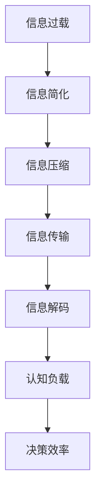

                 

# 信息简化的好处：在复杂世界中简化以改善决策和效率

> 关键词：信息简化, 决策效率, 复杂性管理, 数据压缩, 信息论, 认知负载

## 1. 背景介绍

在当今这个信息爆炸的时代，我们被各种各样的数据、信息和通信工具所包围。虽然在许多情况下，信息获取和交流的便利性极大提升了我们的工作效率和生活质量，但也带来了前所未有的信息过载和认知负担。

### 1.1 问题由来
信息过载已经成为现代社会的一大难题。随着技术的发展，人们每天接收的信息量呈指数级增长，但这些信息的质量和相关性参差不齐。过多的信息不仅使我们难以筛选出真正有用的内容，还可能导致认知疲劳，降低决策效率和注意力集中度。

### 1.2 问题核心关键点
信息简化的核心在于如何从大量的、复杂的信息中提炼出关键和有用的内容，帮助人们在决策和执行任务时，以更高效、更清晰的方式处理信息，从而提升整体的工作效率和信息处理能力。

## 2. 核心概念与联系

### 2.1 核心概念概述

为了更好地理解信息简化的原理和应用，本节将介绍几个关键概念：

- **信息简化(Information Simplification)**：在处理复杂信息时，去除冗余和噪声，提取关键内容的过程。信息简化可以帮助我们更好地理解和利用信息，减少认知负担。

- **认知负载(Cognitive Load)**：人们在处理信息时所承受的心理负担。过多或过于复杂的信息会加重认知负载，影响工作和学习效果。

- **信息压缩(Information Compression)**：通过算法或技术手段，将信息压缩成更小、更易于处理的形式。信息压缩有助于减少存储和传输的资源消耗。

- **信息论(Information Theory)**：研究信息传输、存储和处理过程中所涉及的理论和算法，是信息压缩和信息简化的理论基础。

这些概念之间有着紧密的联系，信息简化和信息压缩是信息论的重要研究方向，通过提高信息处理效率和减少认知负载，帮助人们在复杂信息环境中做出更有效的决策。

### 2.2 核心概念原理和架构的 Mermaid 流程图



这个流程图展示了信息过载到最终决策效率的简化路径。信息过载首先经过信息简化，去除不必要的信息，然后再通过信息压缩，减小数据体积，最后经过信息解码，转化为可用信息，最终减轻认知负载，提升决策效率。

## 3. 核心算法原理 & 具体操作步骤

### 3.1 算法原理概述

信息简化的核心算法主要基于信息论和统计学原理。其目标是通过算法和技术手段，从大量的原始数据中提取最有价值的信息，并将其以简化的形式呈现给用户，以降低认知负担，提升决策效率。

### 3.2 算法步骤详解

信息简化的基本步骤如下：

1. **数据预处理**：包括清洗、去噪、标准化等步骤，准备高质量的输入数据。
2. **特征提取**：通过算法（如SVD、PCA等），将高维数据降维，提取主成分或关键特征。
3. **模型训练**：利用机器学习模型（如神经网络、支持向量机等），训练出信息简化模型。
4. **信息压缩**：应用压缩算法（如Huffman编码、LZ77、LZW等），将简化后的信息进一步压缩。
5. **信息解码**：将压缩后的信息解压，恢复为可读形式。
6. **认知负载评估**：使用认知负荷模型（如Sweller模型）评估简化后的信息对认知负载的影响。
7. **反馈与迭代**：根据评估结果，调整简化策略，进行反馈与迭代。

### 3.3 算法优缺点

信息简化的优点：
1. 提升决策效率：通过提取关键信息，减少不必要的认知负担。
2. 节省资源：信息压缩减小了数据存储和传输的资源消耗。
3. 易于应用：许多信息简化技术已被封装成工具和库，便于开发和部署。

信息简化的缺点：
1. 可能需要先验知识：算法的选择和参数设置可能需要领域专家的指导。
2. 损失部分信息：简化过程中可能会丢失部分原始信息，影响信息的完整性。
3. 可能存在偏差：简化算法可能偏向于某种类型的信息，忽略其他重要信息。

### 3.4 算法应用领域

信息简化的应用范围广泛，涉及多个行业和领域：

- **医疗**：简化的医疗信息摘要，帮助医生快速了解患者病情。
- **教育**：简化的教学材料和总结，减轻学生的学习负担。
- **金融**：简化的财务报表和市场分析报告，帮助投资者做出更明智决策。
- **政府**：简化的政策文件和数据报告，提升政策制定和执行效率。
- **媒体**：简化的新闻报道和总结，提高新闻传播的精准性和可达性。

## 4. 数学模型和公式 & 详细讲解 & 举例说明

### 4.1 数学模型构建

信息简化的数学模型通常包括以下几个部分：

- **输入**：原始数据集 $X = (x_1, x_2, ..., x_n)$。
- **输出**：简化后的数据集 $Y = (y_1, y_2, ..., y_n)$。
- **损失函数**：衡量简化后信息与原始信息之间的差异，如KL散度、信息损失率等。
- **优化目标**：最小化损失函数，即 $\min_{y} \mathcal{L}(X, Y)$。

### 4.2 公式推导过程

以PCA为例，推导信息简化的基本公式。PCA的目标是找到一组正交的投影向量，将高维数据投影到低维空间，从而保留最大方差的信息。

设数据集 $X$ 的协方差矩阵为 $\Sigma$，特征值分解为 $\Sigma = U \Lambda U^T$，其中 $U$ 是特征向量矩阵，$\Lambda$ 是特征值矩阵。PCA的简化公式为：

$$
Y = U \Lambda^{1/2} X
$$

其中 $\Lambda^{1/2}$ 是特征值矩阵 $\Lambda$ 的平方根矩阵。

### 4.3 案例分析与讲解

假设我们有一组包含10个特征的数据集 $X$，我们想要将其简化为5维。应用PCA算法后，我们可以找到5个最大的特征值和对应的特征向量，然后通过公式 $Y = U \Lambda^{1/2} X$ 计算简化后的数据集 $Y$。在这个过程中，我们保留了数据集中的90%的方差信息，同时将维度从10维降低到5维，实现了信息的有效压缩和简化。

## 5. 项目实践：代码实例和详细解释说明

### 5.1 开发环境搭建

在进行信息简化的实践之前，我们需要准备一个开发环境。以下是使用Python进行PyTorch开发的简单配置步骤：

1. 安装Anaconda：从官网下载并安装Anaconda，用于创建独立的Python环境。

2. 创建并激活虚拟环境：
```bash
conda create -n pytorch-env python=3.8 
conda activate pytorch-env
```

3. 安装PyTorch：根据CUDA版本，从官网获取对应的安装命令。例如：
```bash
conda install pytorch torchvision torchaudio cudatoolkit=11.1 -c pytorch -c conda-forge
```

4. 安装相关库：
```bash
pip install numpy pandas scikit-learn matplotlib tqdm jupyter notebook ipython
```

完成上述步骤后，即可在`pytorch-env`环境中开始信息简化的实践。

### 5.2 源代码详细实现

我们以PCA算法为例，展示其在信息简化中的应用。

```python
from sklearn.decomposition import PCA
import numpy as np

# 生成10维的数据集
X = np.random.randn(1000, 10)

# 应用PCA简化为5维
pca = PCA(n_components=5)
X_simplified = pca.fit_transform(X)

# 输出简化后的数据
print(X_simplified)
```

在上述代码中，我们首先生成了一个1000样本、10特征的数据集 $X$。然后，使用Scikit-learn库中的PCA算法，将数据集简化为5维，生成简化后的数据集 $X_simplified$。

### 5.3 代码解读与分析

让我们再详细解读一下关键代码的实现细节：

**PCA算法实现**：
- `PCA`类：Scikit-learn库中实现了PCA算法，用于数据降维。
- `fit_transform`方法：先进行特征值分解，然后应用公式 $Y = U \Lambda^{1/2} X$，计算简化后的数据。

**代码执行结果**：
- 生成的简化后数据集 $X_simplified$ 包含了原始数据 $X$ 的5维主成分，每个主成分都保留了原始数据的最大方差信息。

## 6. 实际应用场景

### 6.1 医疗信息简化

在医疗领域，医生面对大量的医学文献和患者数据，需要从中提取关键信息以辅助诊断和治疗。应用信息简化技术，可以将复杂多维的医学数据压缩为简化的摘要，帮助医生快速理解病情，制定最佳治疗方案。

### 6.2 教育材料简化

教育系统中的课程和教材信息量巨大，许多学生难以消化。通过信息简化，可以将复杂的教学内容提炼为关键点，生成简明易懂的摘要和总结，减轻学生的学习负担，提高学习效率。

### 6.3 金融市场分析

金融市场数据复杂且信息量大，投资决策者需要快速理解市场动向。应用信息简化技术，可以将大量市场数据压缩为简化的报告和摘要，帮助决策者快速把握市场趋势，做出更明智的投资决策。

### 6.4 未来应用展望

随着信息简化技术的不断进步，其在各个领域的应用将进一步拓展：

- **智能推荐系统**：通过信息简化，推荐系统能够更高效地理解用户需求，生成个性化推荐结果。
- **智能客服**：简化客户信息摘要，提升客服系统的响应速度和准确性。
- **信息检索**：通过信息简化，提高信息检索系统的检索速度和精确度。
- **广告投放**：简化广告内容，提高广告的吸引力和转化率。
- **舆情分析**：简化社交媒体数据，快速分析舆情趋势，辅助政策制定。

## 7. 工具和资源推荐

### 7.1 学习资源推荐

为了帮助开发者掌握信息简化的理论基础和实践技巧，以下是一些优质的学习资源：

1. **《信息论与数据压缩》课程**：麻省理工学院开设的在线课程，讲解信息论和数据压缩的基本原理和算法。
2. **《数据压缩与信息论》书籍**：深度介绍数据压缩和信息论的理论和实践，适合进一步研究。
3. **Scikit-learn文档**：详细介绍Scikit-learn库中PCA、LDA等算法的应用实例。
4. **TensorFlow文档**：TensorFlow框架提供的TensorBoard工具，帮助可视化信息简化过程和结果。
5. **深度学习博文**：多篇深度学习博文，讲解信息简化在自然语言处理、计算机视觉等领域的应用。

### 7.2 开发工具推荐

信息简化的开发和实践离不开优秀的工具支持。以下是几款常用的工具：

1. **PyTorch**：基于Python的开源深度学习框架，灵活动态的计算图，适合快速迭代研究。
2. **Scikit-learn**：Python机器学习库，提供丰富的数据预处理和算法实现。
3. **TensorFlow**：由Google主导开发的深度学习框架，生产部署方便，适合大规模工程应用。
4. **TensorBoard**：TensorFlow配套的可视化工具，可实时监测模型训练状态。
5. **HuggingFace**：NLP领域的重要工具库，提供预训练模型和模型微调功能。

合理利用这些工具，可以显著提升信息简化的开发效率，加快创新迭代的步伐。

### 7.3 相关论文推荐

信息简化技术的发展源于学界的持续研究。以下是几篇奠基性的相关论文，推荐阅读：

1. **主成分分析(PCA)**：On the Principal Component Analysis（Hotelling, 1933）
2. **线性判别分析(LDA)**：Pattern Recognition and Machine Learning（Bishop, 2006）
3. **LZW压缩算法**：Lempel–Ziv–Welch dictionary-based data compression（Lempel, Ziv, & Welch, 1987）
4. **Huffman编码**：A Method for the Construction of Minimum-Redundancy Codes（Huffman, 1952）
5. **K-Means聚类算法**：A K-means clustering algorithm（MacQueen, 1967）

这些论文代表了大信息简化技术的发展脉络。通过学习这些前沿成果，可以帮助研究者把握学科前进方向，激发更多的创新灵感。

## 8. 总结：未来发展趋势与挑战

### 8.1 总结

本文对信息简化的核心概念和应用进行了全面系统的介绍。首先阐述了信息过载的问题由来和信息简化的重要性，明确了信息简化的目标是通过算法和技术手段，从大量复杂的数据中提炼出关键和有用的信息，减轻认知负担，提升决策效率。其次，从原理到实践，详细讲解了信息简化的数学模型和具体操作步骤，给出了简化的Python代码实现。同时，本文还广泛探讨了信息简化的应用场景，展示了其在医疗、教育、金融等领域的潜力。最后，本文精选了信息简化的学习资源和开发工具，力求为读者提供全方位的技术指引。

通过本文的系统梳理，可以看到，信息简化技术正在成为信息处理的重要手段，帮助人们有效应对信息过载问题，提升决策和执行效率。未来，伴随信息简化技术的进一步发展，其在各个领域的普及和应用，必将成为改善人类生活质量的关键技术。

### 8.2 未来发展趋势

展望未来，信息简化的发展趋势将呈现以下几个方向：

1. **自动化**：通过更智能的算法和模型，实现自动化的信息简化和压缩，减少人工干预。
2. **跨领域融合**：信息简化技术将与大数据、云计算、物联网等技术进一步融合，形成更为复杂、智能的信息处理系统。
3. **实时化**：实现实时的信息压缩和简化，满足动态变化的场景需求。
4. **个性化**：根据用户需求和行为，提供个性化的信息摘要和简报。
5. **可视化**：通过可视化工具，直观展示信息简化过程和结果，增强用户体验。

以上趋势展示了信息简化的广阔前景。这些方向的探索发展，必将进一步提升信息处理系统的性能和应用范围，为人类认知智能的进化带来深远影响。

### 8.3 面临的挑战

尽管信息简化技术已经取得了显著进展，但在迈向更广泛应用的过程中，仍面临诸多挑战：

1. **算法复杂性**：许多信息简化算法本身非常复杂，需要高深的数学和统计知识。如何降低算法复杂性，提升易用性，是一个重要课题。
2. **数据隐私**：在简化和压缩过程中，如何保护数据隐私，防止敏感信息泄露，是一个亟需解决的问题。
3. **资源消耗**：信息简化和压缩算法需要大量计算资源，如何优化算法，降低资源消耗，提高效率，仍需进一步研究。
4. **标准化**：不同领域的标准化格式和协议不一致，需要开发统一的简化标准，提升信息共享和互操作性。
5. **应用适应性**：信息简化算法需要在不同应用场景中实现适应性优化，如何灵活应用，提升系统泛化性，是一个重要的研究方向。

### 8.4 研究展望

面对信息简化技术面临的挑战，未来的研究需要在以下几个方面寻求新的突破：

1. **简化算法优化**：开发更高效、更智能的简化算法，降低算法复杂性，提升易用性和可扩展性。
2. **跨学科融合**：将信息简化技术与人工智能、大数据、物联网等领域进行跨学科融合，形成更全面、更智能的信息处理系统。
3. **隐私保护技术**：开发隐私保护算法和技术，在简化和压缩过程中，保护数据隐私，防止敏感信息泄露。
4. **标准制定**：推动信息简化和压缩的标准化工作，制定统一的数据格式和协议，提升信息共享和互操作性。
5. **应用场景优化**：开发适应不同应用场景的简化算法，提升系统的泛化性和适应性。

这些研究方向的探索，必将引领信息简化技术迈向更高的台阶，为构建更加智能、高效的信息处理系统提供有力支持。面向未来，信息简化技术需要在技术、标准、应用等多个维度协同发力，才能真正实现信息处理的自动化、智能化和普适化，提升人类的认知智能和决策效率。

## 9. 附录：常见问题与解答

**Q1: 信息简化的目标是什么？**

A: 信息简化的目标是通过算法和技术手段，从大量复杂的信息中提炼出关键和有用的内容，帮助用户在决策和执行任务时，以更高效、更清晰的方式处理信息，从而提升整体的工作效率和信息处理能力。

**Q2: 信息简化和数据压缩有什么区别？**

A: 信息简化和数据压缩虽然有部分相似之处，但主要区别在于目标。信息简化的目标是提炼关键和有用的信息，帮助用户更好地理解和利用信息；而数据压缩的目标是减小数据体积，方便存储和传输。信息简化通常需要保留信息的相关性和完整性，而数据压缩可能丢失部分信息，以减小体积。

**Q3: 信息简化对认知负载的影响是什么？**

A: 信息简化可以显著减轻用户的认知负担，提升决策效率。通过去除冗余和噪声，提取关键内容，用户可以更专注于重要信息，避免被过多信息干扰。

**Q4: 信息简化的算法有哪些？**

A: 信息简化的算法多种多样，包括PCA、LDA、LZ77、Huffman编码、K-Means聚类等。这些算法各有特点，适用于不同的应用场景。

**Q5: 信息简化的应用场景有哪些？**

A: 信息简化的应用场景广泛，包括医疗、教育、金融、政府、媒体等。通过简化复杂数据，提升各领域的工作效率和决策效果。

---

作者：禅与计算机程序设计艺术 / Zen and the Art of Computer Programming

