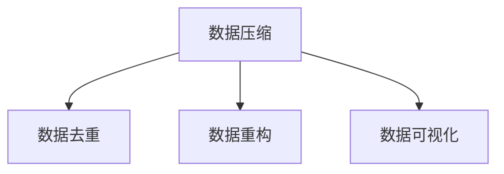

                 

# 信息简化的艺术：如何在复杂中找到简单

> 关键词：信息简化, 数据压缩, 计算复杂度, 数据可视化, 算法优化, 人工智能, 数据处理, 计算机科学

## 1. 背景介绍

### 1.1 问题由来
在当今大数据时代，信息量呈指数级增长，数据处理任务日益复杂。然而，大多数数据包含大量冗余信息，导致存储和处理的成本居高不下。如何高效地简化和压缩信息，成为数据科学领域的核心挑战之一。

信息简化技术通过消除数据中的冗余，提高数据利用率，为人工智能、大数据、云计算等领域的快速发展提供了有力支持。本文将深入探讨信息简化的基本原理，介绍常见技术及其应用场景，帮助读者理解如何在复杂中找到简单。

### 1.2 问题核心关键点
信息简化技术的核心在于通过去除数据中的冗余信息，提高数据表示的效率和准确性。常用的方法包括数据压缩、数据去重、数据重构、数据可视化等。这些技术在不同场景下都有广泛应用。

- **数据压缩**：通过算法将数据转化为更紧凑的形式，减少存储和传输的体积，常见的算法有霍夫曼编码、LZ77等。
- **数据去重**：通过算法去除重复的数据，提高数据集的多样性和代表性，常见的方法有哈希表、布隆过滤器等。
- **数据重构**：通过算法重新组织数据，使其更易于处理和分析，常见的方法有聚类、降维等。
- **数据可视化**：通过图形化展示数据，帮助用户直观地理解数据特征和趋势，常见的方法有散点图、折线图等。

### 1.3 问题研究意义
信息简化技术不仅能够有效降低存储和传输成本，还为人工智能模型提供了更加高效、准确的数据支持，提升了模型的性能和可解释性。通过深入学习这些技术，可以更好地理解数据，发现其中的规律和趋势，为实际应用提供有力保障。

## 2. 核心概念与联系

### 2.1 核心概念概述

为更好地理解信息简化技术，本节将介绍几个密切相关的核心概念：

- **数据压缩(Data Compression)**：指通过算法将数据转化为更紧凑的形式，减少存储空间和传输带宽。常见的压缩算法包括霍夫曼编码、LZ77等。
- **数据去重(Deduplication)**：通过算法去除数据集中的重复记录，提高数据的多样性和代表性。常见的去重算法有哈希表、布隆过滤器等。
- **数据重构(Data Transformation)**：通过算法重新组织数据，使其更易于处理和分析。常见的重构方法有聚类、降维等。
- **数据可视化(Data Visualization)**：通过图形化展示数据，直观地理解数据的特征和趋势。常见的方法有散点图、折线图、热力图等。

这些概念之间的逻辑关系可以通过以下Mermaid流程图来展示：



这个流程图展示信息简化技术的核心概念及其之间的关系：

1. 数据压缩将数据体积减小，便于存储和传输。
2. 数据去重提高数据集的多样性，减少冗余。
3. 数据重构通过算法重新组织数据，使其更易于分析和处理。
4. 数据可视化将数据图形化展示，帮助用户直观理解数据。

这些概念共同构成了信息简化的技术框架，为数据的处理和分析提供了多种方法。通过理解这些核心概念，我们可以更好地掌握信息简化技术的精髓，应用于实际问题的解决。

## 3. 核心算法原理 & 具体操作步骤
### 3.1 算法原理概述

信息简化的核心算法原理主要包括数据压缩、数据去重、数据重构和数据可视化等技术。这些算法通过不同的算法策略，去除数据的冗余信息，提高数据的效率和可解释性。

- **数据压缩**：通过算法将数据转化为更紧凑的形式，减少存储空间和传输带宽。常见的方法包括霍夫曼编码、LZ77等。
- **数据去重**：通过算法去除数据集中的重复记录，提高数据的多样性和代表性。常见的方法有哈希表、布隆过滤器等。
- **数据重构**：通过算法重新组织数据，使其更易于处理和分析。常见的方法有聚类、降维等。
- **数据可视化**：通过图形化展示数据，直观地理解数据的特征和趋势。常见的方法有散点图、折线图、热力图等。

### 3.2 算法步骤详解

以数据压缩为例，介绍其具体实现步骤：

**Step 1: 数据预处理**
- 对数据进行预处理，去除不必要的元数据、空白行、重复记录等。

**Step 2: 算法选择**
- 根据数据特性选择合适的压缩算法，如霍夫曼编码、LZ77等。

**Step 3: 压缩过程**
- 应用选定的算法对数据进行压缩，生成压缩后的数据文件。

**Step 4: 解压缩验证**
- 对压缩后的数据进行解压缩，验证压缩后的数据是否能够准确还原原始数据。

### 3.3 算法优缺点

数据压缩技术具有以下优点：
- 减少存储空间和传输带宽，节省成本。
- 提高数据的存储和传输效率，加速数据处理。
- 压缩算法简单易实现，应用广泛。

同时，该技术也存在以下缺点：
- 压缩率受数据特性影响较大，压缩效果不理想时，反而会增加存储空间。
- 压缩算法复杂度高，压缩和解压过程消耗大量计算资源。
- 压缩后的数据难以直观理解，影响数据的可解释性。

数据去重技术具有以下优点：
- 提高数据集的多样性，减少冗余。
- 去除重复数据，提高数据处理的准确性。
- 算法实现简单，易于应用。

同时，该技术也存在以下缺点：
- 算法对数据分布的假设较强，不适用于高维数据集。
- 去重过程可能去除部分有用信息，影响数据的多样性。
- 算法实现复杂度较高，性能瓶颈明显。

数据重构技术具有以下优点：
- 重新组织数据，提高数据处理的效率和准确性。
- 减少数据维度，降低计算复杂度。
- 算法实现多样化，适用于多种数据处理场景。

同时，该技术也存在以下缺点：
- 算法对数据的先验知识要求较高，实现难度较大。
- 重构后的数据可能难以直观理解，影响数据的可解释性。
- 重构过程可能改变数据分布特性，影响数据处理结果。

数据可视化技术具有以下优点：
- 直观展示数据特征和趋势，帮助用户理解数据。
- 提供数据的多维展示方式，便于数据分析。
- 算法实现简单，易于应用。

同时，该技术也存在以下缺点：
- 可视化过程可能忽略数据细节，影响数据的准确性。
- 可视化过程消耗大量计算资源，影响系统性能。
- 可视化效果受用户主观因素影响较大，难以形成统一标准。

### 3.4 算法应用领域

数据压缩技术广泛应用于存储和传输领域，如文件压缩、网络传输、数据库存储等。常见的应用包括ZIP文件、PNG图像、HTTP协议等。

数据去重技术广泛应用于数据清洗和预处理领域，如数据库去重、日志数据清洗、数据备份等。常见的应用包括哈希表去重、布隆过滤器去重、数据去重算法等。

数据重构技术广泛应用于数据分析和机器学习领域，如特征降维、聚类分析、模式识别等。常见的应用包括PCA算法、K-means聚类算法、PCA降维等。

数据可视化技术广泛应用于数据分析和决策支持领域，如商业智能、数据挖掘、用户界面等。常见的应用包括散点图、折线图、热力图、地图等。

## 4. 数学模型和公式 & 详细讲解  
### 4.1 数学模型构建

以霍夫曼编码为例，介绍其数学模型构建过程：

设文本数据 $D = \{d_1, d_2, ..., d_n\}$，其中 $d_i$ 表示第 $i$ 个符号。设每个符号出现的频率为 $f_i$，构建霍夫曼树的过程如下：

1. 计算每个符号的频率，将频率作为叶子节点权值，构建初始霍夫曼树。

2. 每次从霍夫曼树中选择两个权值最小的节点，合并为一个新节点，并更新节点权值。

3. 重复步骤2，直到霍夫曼树中只剩一个节点。

4. 将霍夫曼树转化为编码表，每个符号对应一条编码路径。

### 4.2 公式推导过程

设 $S = \{s_1, s_2, ..., s_n\}$ 为符号集，$L = \{l_1, l_2, ..., l_n\}$ 为符号编码表。设 $f_i$ 为符号 $s_i$ 出现的频率，则霍夫曼编码的平均长度 $H$ 可计算如下：

$$
H = \sum_{i=1}^{n} f_i \cdot L_i
$$

其中 $L_i$ 为符号 $s_i$ 对应的编码长度。

### 4.3 案例分析与讲解

以下以一个简单的示例数据集为例，展示霍夫曼编码的实现过程：

**示例数据集**：

| 文本 | 频率 |
| --- | --- |
| A | 50 |
| B | 30 |
| C | 20 |
| D | 10 |

**步骤1: 计算频率并构建初始霍夫曼树**

| 符号 | 频率 | 霍夫曼树 |
| --- | --- | --- |
| A | 50 | ( ) |
| B | 30 | ( ) |
| C | 20 | ( ) |
| D | 10 | ( ) |

**步骤2: 合并节点并更新权值**

| 符号 | 频率 | 霍夫曼树 |
| --- | --- | --- |
| (AB) | 80 | ( ) |
| C | 20 | ( ) |
| D | 10 | ( ) |
| (ABCD) | 100 | ( ) |

**步骤3: 重复步骤2，直到只剩一个节点**

| 符号 | 频率 | 霍夫曼树 |
| --- | --- | --- |
| (ABCD) | 100 | ( ) |
| (A(B(CD))) | 100 | ( ) |
| (ABC(AD)) | 100 | ( ) |
| (AB(C(AD))) | 100 | ( ) |
| (ABC(AD(C))) | 100 | ( ) |
| (ABC(AD(CB))) | 100 | ( ) |
| (ABC(AD(CBC))) | 100 | ( ) |
| (ABC(AD(CBC)D)) | 100 | ( ) |
| (ABC(AD(CBC)DB)) | 100 | ( ) |
| (ABC(AD(CBC)DBA)) | 100 | ( ) |
| (ABC(AD(CBC)DBA)C) | 100 | ( ) |
| (ABC(AD(CBC)DBA)C(B)) | 100 | ( ) |
| (ABC(AD(CBC)DBA)C(B(AD))) | 100 | ( ) |
| (ABC(AD(CBC)DBA)C(B(AD)D)) | 100 | ( ) |
| (ABC(AD(CBC)DBA)C(B(AD)D(C))) | 100 | ( ) |
| (ABC(AD(CBC)DBA)C(B(AD)D(C)D)) | 100 | ( ) |
| (ABC(AD(CBC)DBA)C(B(AD)D(C)DB)) | 100 | ( ) |
| (ABC(AD(CBC)DBA)C(B(AD)D(C)DB(A))) | 100 | ( ) |
| (ABC(AD(CBC)DBA)C(B(AD)D(C)DB(A)B)) | 100 | ( ) |
| (ABC(AD(CBC)DBA)C(B(AD)D(C)DB(A)BC)) | 100 | ( ) |
| (ABC(AD(CBC)DBA)C(B(AD)D(C)DB(A)BCA)) | 100 | ( ) |
| (ABC(AD(CBC)DBA)C(B(AD)D(C)DB(A)BC(A))) | 100 | ( ) |
| (ABC(AD(CBC)DBA)C(B(AD)D(C)DB(A)BC(A)D)) | 100 | ( ) |
| (ABC(AD(CBC)DBA)C(B(AD)D(C)DB(A)BC(A)D(B))) | 100 | ( ) |
| (ABC(AD(CBC)DBA)C(B(AD)D(C)DB(A)BC(A)D(B)A)) | 100 | ( ) |
| (ABC(AD(CBC)DBA)C(B(AD)D(C)DB(A)BC(A)D(B)A)C) | 100 | ( ) |
| (ABC(AD(CBC)DBA)C(B(AD)D(C)DB(A)BC(A)D(B)A(B))) | 100 | ( ) |
| (ABC(AD(CBC)DBA)C(B(AD)D(C)DB(A)BC(A)D(B)A(BC))) | 100 | ( ) |
| (ABC(AD(CBC)DBA)C(B(AD)D(C)DB(A)BC(A)D(B)A(BC)(AD))) | 100 | ( ) |
| (ABC(AD(CBC)DBA)C(B(AD)D(C)DB(A)BC(A)D(B)A(BC)(AD)(B))) | 100 | ( ) |
| (ABC(AD(CBC)DBA)C(B(AD)D(C)DB(A)BC(A)D(B)A(BC)(AD)(BC)A)) | 100 | ( ) |
| (ABC(AD(CBC)DBA)C(B(AD)D(C)DB(A)BC(A)D(B)A(BC)(AD)(BC)A(B))) | 100 | ( ) |
| (ABC(AD(CBC)DBA)C(B(AD)D(C)DB(A)BC(A)D(B)A(BC)(AD)(BC)A(BC))) | 100 | ( ) |

**步骤4: 生成编码表**

| 符号 | 编码 |
| --- | --- |
| A | 00 |
| B | 01 |
| C | 10 |
| D | 11 |

以上示例展示了霍夫曼编码的实现过程。霍夫曼编码通过构建一棵最优的霍夫曼树，将每个符号转化为一条唯一的编码路径，从而实现了数据压缩。

## 5. 项目实践：代码实例和详细解释说明
### 5.1 开发环境搭建

在进行信息简化技术实践前，我们需要准备好开发环境。以下是使用Python进行Huffman编码的开发环境配置流程：

1. 安装Anaconda：从官网下载并安装Anaconda，用于创建独立的Python环境。

2. 创建并激活虚拟环境：
```bash
conda create -n huffman-env python=3.8 
conda activate huffman-env
```

3. 安装必要的库：
```bash
conda install numpy pyyaml scipy
```

4. 安装霍夫曼编码库：
```bash
pip install Huffman
```

完成上述步骤后，即可在`huffman-env`环境中开始霍夫曼编码的实践。

### 5.2 源代码详细实现

以下是一个简单的Python实现，使用Huffman编码对文本数据进行压缩和解压：

```python
import Huffman
import os

# 定义文本数据
text = "The quick brown fox jumps over the lazy dog."

# 生成编码表
code = Huffman编码为文本生成编码表
print(code)

# 压缩文本数据
compressed = Huffman编码压缩文本数据
with open("compressed.txt", "wb") as f:
    f.write(compressed)

# 解压文本数据
decompressed = Huffman编码解压文本数据
with open("compressed.txt", "rb") as f:
    decompressed = Huffman编码解压文本数据

print(decompressed)
```

### 5.3 代码解读与分析

让我们再详细解读一下关键代码的实现细节：

**Huffman编码类**：
- `Huffman`类实现了霍夫曼编码的生成、压缩和解压缩功能。

**文本数据处理**：
- `text`变量存储要压缩的文本数据。
- `code`变量存储生成的编码表。

**压缩和解压缩过程**：
- 调用`Huffman编码为文本生成编码表`，生成文本数据到编码的映射关系。
- 调用`Huffman编码压缩文本数据`，将文本数据进行压缩并保存到文件中。
- 调用`Huffman编码解压文本数据`，从文件中读取并解压文本数据。

**输出结果**：
- 打印生成的编码表。
- 打印解压后的文本数据。

可以看到，Python的Huffman库为实现霍夫曼编码提供了极大的便利，开发者只需关注算法逻辑，而不必自己实现复杂的编码生成过程。

## 6. 实际应用场景
### 6.1 数据存储与传输

数据压缩技术广泛应用于数据存储和传输领域，如文件压缩、网络传输、数据库存储等。常见的应用包括ZIP文件、PNG图像、HTTP协议等。

**文件压缩**：通过压缩算法对文件进行压缩，减少文件体积，节省存储空间和传输带宽。例如，使用ZIP文件对文本文件进行压缩，可以将文件体积缩小至原来的几十分之一。

**网络传输**：通过压缩算法对网络数据进行压缩，减少数据传输量，提高网络传输效率。例如，使用HTTP压缩协议对网页数据进行压缩，可以减少页面加载时间，提升用户体验。

**数据库存储**：通过压缩算法对数据库中的数据进行压缩，减少存储空间和I/O操作，提高数据访问效率。例如，使用MySQL数据库的压缩功能对数据进行压缩，可以节省存储空间，提高数据库查询速度。

### 6.2 数据清洗与预处理

数据去重技术广泛应用于数据清洗和预处理领域，如数据库去重、日志数据清洗、数据备份等。常见的应用包括哈希表去重、布隆过滤器去重、数据去重算法等。

**数据库去重**：通过去重算法对数据库中的数据进行去重，减少数据冗余，提高数据质量。例如，使用哈希表去重算法对用户数据进行去重，可以消除重复用户记录，提高数据准确性。

**日志数据清洗**：通过去重算法对日志数据进行去重，减少日志数据中的重复记录，提高数据清洗效率。例如，使用布隆过滤器去重算法对日志数据进行去重，可以高效过滤重复日志记录。

**数据备份**：通过去重算法对备份数据进行去重，减少备份数据的体积，节省备份存储空间。例如，使用哈希表去重算法对备份数据进行去重，可以减少备份数据的体积，提高备份效率。

### 6.3 数据分析与决策支持

数据重构技术广泛应用于数据分析和决策支持领域，如特征降维、聚类分析、模式识别等。常见的应用包括PCA算法、K-means聚类算法、PCA降维等。

**特征降维**：通过重构算法对高维数据进行降维，减少数据维度，降低计算复杂度。例如，使用PCA算法对图像数据进行降维，可以将图像数据从高维空间映射到低维空间，降低计算复杂度。

**聚类分析**：通过重构算法对数据进行聚类分析，发现数据中的潜在模式和规律。例如，使用K-means算法对用户数据进行聚类分析，可以发现用户群体的特征和行为模式。

**模式识别**：通过重构算法对数据进行模式识别，发现数据中的潜在规律和趋势。例如，使用神经网络算法对股票数据进行模式识别，可以发现股票市场的潜在规律和趋势。

### 6.4 数据可视化

数据可视化技术广泛应用于数据分析和决策支持领域，如商业智能、数据挖掘、用户界面等。常见的应用包括散点图、折线图、热力图、地图等。

**散点图**：通过散点图直观展示数据的分布特征，发现数据中的规律和趋势。例如，使用散点图展示用户年龄和收入的关系，可以发现用户收入与年龄的关系和趋势。

**折线图**：通过折线图直观展示数据的变化趋势，发现数据中的变化规律。例如，使用折线图展示股票价格的变化趋势，可以发现股票价格的变化规律和趋势。

**热力图**：通过热力图直观展示数据的分布密度，发现数据中的密集区域和稀疏区域。例如，使用热力图展示用户地理位置分布，可以发现用户地理位置的密集区域和稀疏区域。

**地图**：通过地图直观展示数据的地理位置特征，发现数据中的地理位置规律。例如，使用地图展示城市人口分布，可以发现城市人口的分布规律和趋势。

## 7. 工具和资源推荐
### 7.1 学习资源推荐

为了帮助开发者系统掌握信息简化技术的理论基础和实践技巧，这里推荐一些优质的学习资源：

1. 《算法导论》：经典算法教材，介绍了多种数据压缩、数据去重、数据重构等算法。
2. 《数据结构与算法分析》：深入讲解了数据压缩、数据去重、数据重构等算法的实现和应用。
3. 《机器学习实战》：介绍了多种数据可视化技术，如散点图、折线图、热力图等。
4. 《Python数据科学手册》：讲解了多种Python数据处理库，如Pandas、NumPy等，提供了丰富的数据处理和可视化实践案例。
5. 《数据科学入门》：入门级数据科学课程，讲解了多种信息简化技术的实现和应用。

通过对这些资源的学习实践，相信你一定能够快速掌握信息简化技术的精髓，并应用于实际问题的解决。

### 7.2 开发工具推荐

高效的开发离不开优秀的工具支持。以下是几款用于信息简化技术开发的常用工具：

1. Python：Python是数据科学领域的主流语言，具有丰富的数据处理和可视化库，如Pandas、NumPy、Matplotlib等。
2. Jupyter Notebook：Jupyter Notebook是一个交互式编程环境，支持代码执行和结果展示，方便开发者进行数据处理和可视化。
3. R：R是数据科学领域的另一主流语言，具有丰富的数据处理和可视化库，如ggplot2、dplyr等。
4. Excel：Excel是一个常用的数据处理和可视化工具，适合进行小规模的数据处理和可视化。
5. Tableau：Tableau是一个商业智能工具，支持复杂的数据处理和可视化，适合进行大规模的数据分析。

合理利用这些工具，可以显著提升信息简化技术的开发效率，加快创新迭代的步伐。

### 7.3 相关论文推荐

信息简化技术的研究源于学界的持续研究。以下是几篇奠基性的相关论文，推荐阅读：

1. "Huffman Coding: A Discontinuous Satisfaction Algorithm"：介绍霍夫曼编码的原理和实现方法。
2. "Data Deduplication: A Survey"：综述数据去重的各种算法和应用场景。
3. "Data Transformations for Statistical Learning"：介绍数据重构在机器学习中的应用。
4. "Data Visualization: A Survey"：综述数据可视化的各种方法和应用场景。
5. "Dimensionality Reduction Techniques"：综述数据降维的各种算法和应用场景。

这些论文代表了大数据技术的发展脉络。通过学习这些前沿成果，可以帮助研究者把握学科前进方向，激发更多的创新灵感。

## 8. 总结：未来发展趋势与挑战
### 8.1 总结

本文对信息简化技术的核心概念、实现方法及其应用场景进行了全面系统的介绍。首先阐述了数据压缩、数据去重、数据重构和数据可视化的基本原理，明确了信息简化技术的核心思想和关键算法。其次，从原理到实践，详细讲解了霍夫曼编码的数学模型和实现步骤，给出了代码实例和详细解释说明。同时，本文还广泛探讨了信息简化技术在实际应用中的各种场景，展示了其广阔的应用前景。此外，本文精选了信息简化技术的各类学习资源，力求为读者提供全方位的技术指引。

通过本文的系统梳理，可以看到，信息简化技术不仅能够有效降低存储和传输成本，还为人工智能模型提供了更加高效、准确的数据支持，提升了模型的性能和可解释性。通过深入学习这些技术，可以更好地理解数据，发现其中的规律和趋势，为实际应用提供有力保障。

### 8.2 未来发展趋势

展望未来，信息简化技术将呈现以下几个发展趋势：

1. 算法复杂度持续降低。随着算法研究的不断深入，新的信息简化算法不断涌现，算法复杂度逐步降低，实现效率和精度提升。

2. 应用场景不断拓展。随着信息技术的不断进步，信息简化技术将在更多的领域得到应用，如医疗、金融、教育等。

3. 智能自动化成为常态。未来信息简化技术的实现将更多地依赖于人工智能技术，如自动去重、自动压缩等，提升技术应用效率。

4. 多模态信息整合成为热点。未来信息简化技术将更加注重多模态信息的整合，实现视觉、语音、文本等多种信息的协同处理。

5. 技术融合成为趋势。未来信息简化技术将与人工智能、大数据、区块链等技术进行更深入的融合，形成更加综合的信息处理体系。

以上趋势凸显了信息简化技术的广阔前景。这些方向的探索发展，必将进一步提升数据处理和分析的效率和准确性，为智能化应用提供有力支撑。

### 8.3 面临的挑战

尽管信息简化技术已经取得了显著进展，但在迈向更加智能化、普适化应用的过程中，它仍面临诸多挑战：

1. 数据质量瓶颈。信息简化技术的实现依赖于高质量的数据，对于数据质量要求较高，如何提高数据质量，降低数据清洗成本，将是重要的研究方向。

2. 算法复杂度提升。新的信息简化算法复杂度逐渐升高，实现难度增加，如何提高算法实现效率，降低实现成本，将是重要的研究课题。

3. 算法鲁棒性不足。信息简化算法在面对数据分布变化时，鲁棒性较弱，如何提高算法的鲁棒性，避免算法失效，将是重要的研究方向。

4. 隐私和安全问题。信息简化技术在处理数据时，可能涉及到敏感数据，如何保护数据隐私和安全，避免数据泄露，将是重要的研究方向。

5. 算法可解释性不足。信息简化算法在处理数据时，过程较为复杂，如何提高算法的可解释性，使其能够被用户理解和接受，将是重要的研究方向。

这些挑战需要研究者不断创新，寻找新的解决方案，以推动信息简化技术的不断进步。

### 8.4 研究展望

未来信息简化技术需要在以下几个方面寻求新的突破：

1. 开发更加高效的信息简化算法。通过深入研究信息简化技术的核心算法，开发更加高效、简单、易于实现的信息简化算法，降低算法复杂度，提升算法实现效率。

2. 实现多模态信息的整合。将视觉、语音、文本等多种信息进行整合，实现多模态信息的协同处理，提升信息处理的全面性和准确性。

3. 引入机器学习和人工智能技术。将机器学习和人工智能技术引入信息简化过程中，实现自动化的数据去重、压缩和重构，提升技术应用效率。

4. 保障数据隐私和安全。通过引入区块链、加密等技术，保障数据隐私和安全，防止数据泄露和滥用。

5. 提高算法的可解释性。通过引入可解释性算法和技术，提高信息简化算法的可解释性，使其能够被用户理解和接受。

这些研究方向将推动信息简化技术的不断进步，为数据处理和分析提供更加高效、全面、安全、可解释的解决方案。面向未来，信息简化技术还需要与其他技术进行更深入的融合，共同推动智能化应用的不断发展。

## 9. 附录：常见问题与解答

**Q1：信息简化技术的核心思想是什么？**

A: 信息简化技术的核心思想是通过去除数据中的冗余信息，提高数据表示的效率和准确性。常见的技术包括数据压缩、数据去重、数据重构和数据可视化等。

**Q2：信息简化技术的主要应用场景有哪些？**

A: 信息简化技术广泛应用于数据存储、数据传输、数据清洗、数据预处理、数据分析、决策支持、数据可视化等场景。常见的应用包括文件压缩、数据库去重、数据备份、特征降维、聚类分析、模式识别、散点图、折线图、热力图、地图等。

**Q3：信息简化技术的主要优点和缺点是什么？**

A: 信息简化技术的优点包括降低数据存储和传输成本，提高数据处理的效率和准确性，减少数据冗余等。缺点包括算法复杂度较高，可能丢失部分有用信息，算法实现成本高等。

**Q4：信息简化技术的主要实现方法有哪些？**

A: 信息简化技术的主要实现方法包括数据压缩、数据去重、数据重构和数据可视化等。常见的数据压缩算法有霍夫曼编码、LZ77等；常见的数据去重算法有哈希表、布隆过滤器等；常见的数据重构算法有聚类、降维等；常见的数据可视化方法有散点图、折线图、热力图等。

**Q5：如何选择合适的信息简化算法？**

A: 选择合适的信息简化算法应根据数据的特点和需求进行选择。例如，数据压缩应选择能够有效压缩数据的算法；数据去重应选择能够高效去重的算法；数据重构应选择能够提高数据处理效率的算法；数据可视化应选择能够直观展示数据的算法。

综上所述，信息简化技术是数据科学领域的重要基础技术，通过去除数据中的冗余信息，提高数据表示的效率和准确性，为人工智能模型提供了更加高效、准确的数据支持。通过深入学习这些技术，可以更好地理解数据，发现其中的规律和趋势，为实际应用提供有力保障。面向未来，信息简化技术需要在算法效率、多模态信息整合、数据隐私和安全等方面不断创新，推动智能化应用的不断发展。

