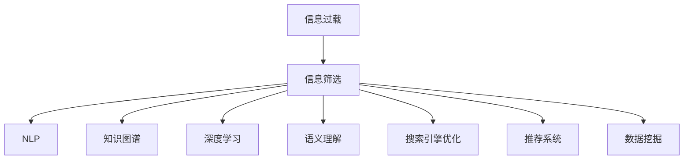

                 

# 信息过载与信息筛选策略与实践：在信息洪流中找到有价值的信息

> 关键词：信息过载, 信息筛选, 自然语言处理, 知识图谱, 深度学习, 语义理解, 搜索引擎优化(搜索引擎), 推荐系统, 机器学习, 数据挖掘

## 1. 背景介绍

### 1.1 问题由来

随着信息时代的到来，人们面临的信息量呈指数级增长。互联网、社交媒体、电子邮件等平台每天产生的海量数据，使个人、企业乃至整个社会都陷入了信息过载的困境。信息过载不仅浪费了宝贵的时间和精力，还可能导致重要信息的遗漏和误判。因此，如何高效筛选和利用信息，成为了当前技术和社会关注的焦点。

信息筛选技术旨在从庞杂的信息流中提取有价值的内容，为用户提供个性化、精准的推荐服务。在大数据时代，信息筛选已经从简单的关键字匹配演变为基于深度学习、自然语言处理(NLP)的高级推荐系统。这些技术不仅能够高效处理海量数据，还能识别复杂语义关系，为用户量身定制个性化的信息流，极大地提升了信息检索和推荐的精度和效率。

### 1.2 问题核心关键点

本节将详细阐述信息筛选的核心概念和原理，明确其在信息技术领域的重要地位和应用价值。

- **信息过载**：指用户接收的信息量远超其处理能力，导致信息误判和重要信息遗漏的现象。

- **信息筛选**：指通过技术手段，从大量信息中筛选出与用户需求相关、有用的信息的过程。

- **自然语言处理(NLP)**：利用计算机处理、理解和生成人类语言的技术，是信息筛选的重要工具。

- **知识图谱**：以图形化方式表示实体及其之间关系的数据结构，用于辅助信息筛选和推荐。

- **深度学习**：通过多层神经网络对数据进行建模和预测，广泛应用于信息筛选和推荐系统。

- **语义理解**：指计算机能够理解并解释语言中深层语义关系的能力，是信息筛选和推荐的关键技术。

- **搜索引擎优化(搜索引擎)**：通过优化网站内容和结构，提高其被搜索引擎检索的概率，提升用户体验。

- **推荐系统**：基于用户行为数据和模型，为用户推荐感兴趣的内容，广泛应用于电子商务、新闻媒体、社交网络等领域。

- **数据挖掘**：从大规模数据中提取有用信息的过程，是信息筛选和推荐系统的基础。

这些核心概念构成了信息筛选和推荐系统的理论基础，并在实际应用中得到了广泛验证。

## 2. 核心概念与联系

### 2.1 核心概念概述

为更好地理解信息筛选和推荐系统的技术原理和架构，本节将介绍几个密切相关的核心概念：

- **信息过载**：指用户面临的信息量超出其处理能力，导致信息误判和重要信息遗漏的现象。

- **信息筛选**：指通过技术手段，从大量信息中筛选出与用户需求相关、有用的信息的过程。

- **自然语言处理(NLP)**：利用计算机处理、理解和生成人类语言的技术，是信息筛选的重要工具。

- **知识图谱**：以图形化方式表示实体及其之间关系的数据结构，用于辅助信息筛选和推荐。

- **深度学习**：通过多层神经网络对数据进行建模和预测，广泛应用于信息筛选和推荐系统。

- **语义理解**：指计算机能够理解并解释语言中深层语义关系的能力，是信息筛选和推荐的关键技术。

- **搜索引擎优化(搜索引擎)**：通过优化网站内容和结构，提高其被搜索引擎检索的概率，提升用户体验。

- **推荐系统**：基于用户行为数据和模型，为用户推荐感兴趣的内容，广泛应用于电子商务、新闻媒体、社交网络等领域。

- **数据挖掘**：从大规模数据中提取有用信息的过程，是信息筛选和推荐系统的基础。

这些核心概念之间的逻辑关系可以通过以下Mermaid流程图来展示：



这个流程图展示了信息筛选与各核心概念之间的关联：

1. 信息过载促使人们需要信息筛选技术，从海量数据中提取出有用的信息。
2. NLP、知识图谱、深度学习和语义理解等技术，分别从不同角度支持信息筛选过程。
3. 搜索引擎优化和推荐系统，则进一步提升信息检索和推荐的效率和精准度。
4. 数据挖掘技术为信息筛选和推荐提供基础数据支持。

## 3. 核心算法原理 & 具体操作步骤

### 3.1 算法原理概述

信息筛选技术的基本原理是利用算法和模型，从大量文本、图像、音频等数据中，识别并提取出与用户需求相关的信息。这些信息可以是具体的实体、事件、关系等，也可以是基于用户行为的推荐结果。

信息筛选算法通常分为两个步骤：首先是预处理，包括数据清洗、分词、去噪等；其次是筛选，根据用户需求和算法规则，从预处理后的数据中提取出有价值的信息。常用的信息筛选算法包括基于统计的、基于机器学习和基于深度学习的多种方法。

### 3.2 算法步骤详解

信息筛选算法通常包括以下几个关键步骤：

**Step 1: 数据预处理**
- 清洗数据：去除无关或冗余的信息。
- 分词：将文本数据分割成单个词语。
- 去噪：去除数据中的噪声，如拼写错误、无关字符等。
- 标准化：统一文本格式，如统一字符编码、统一单位等。

**Step 2: 特征提取**
- 词频统计：统计各词语在文本中出现的频率。
- 向量表示：将文本转换为向量形式，便于后续计算。
- 特征选择：选择最具有代表性的特征，如TF-IDF、Word2Vec等。

**Step 3: 算法建模**
- 选择合适的算法模型，如TF-IDF、LDA、GAN、Transformer等。
- 训练模型：使用标注数据训练模型，调整模型参数。
- 验证模型：在验证集上评估模型性能，调整参数。

**Step 4: 信息筛选**
- 基于模型对文本进行评分，排序。
- 去除低分内容，保留高分内容。
- 集成多算法结果，提升筛选效果。

**Step 5: 结果输出**
- 显示筛选结果：根据用户需求，展示最相关的信息。
- 反馈用户：根据用户反馈，调整算法参数。

### 3.3 算法优缺点

信息筛选算法具有以下优点：
1. 高效处理大量数据：通过自动化处理，可以快速筛选出大量信息。
2. 准确性高：基于深度学习等技术，可以实现更高的信息筛选准确度。
3. 可扩展性强：算法适用于多种数据类型，可以扩展到文本、图像、音频等不同领域。

同时，这些算法也存在一些局限性：
1. 数据依赖性高：需要大量标注数据进行模型训练，数据质量影响模型效果。
2. 泛化能力不足：不同领域的知识结构差异较大，模型可能难以泛化到其他领域。
3. 过拟合风险：在数据不足或噪声较多的情况下，模型容易过拟合。
4. 计算资源消耗大：深度学习等复杂模型需要大量计算资源，训练和推理时间较长。
5. 需要持续优化：算法性能依赖于模型和参数调优，需要不断迭代优化。

尽管存在这些局限性，但就目前而言，基于深度学习的筛选算法在处理复杂语义信息方面表现出色，已在多个实际场景中得到了广泛应用。

### 3.4 算法应用领域

信息筛选技术已经在多个领域得到了广泛应用，例如：

- 文本信息筛选：如搜索引擎中的关键词匹配、新闻媒体中的文章推荐等。
- 图像信息筛选：如图像搜索、视频内容推荐等。
- 音频信息筛选：如语音搜索、音乐推荐等。
- 社交网络信息筛选：如微博、Facebook等社交平台上内容的推荐。
- 电子商务推荐系统：如Amazon、淘宝等平台上的商品推荐。

除了上述这些经典场景外，信息筛选技术还在智能客服、智能推荐系统、智能广告等多个领域得到了创新性的应用，为信息处理和智能决策提供了新的解决方案。

## 4. 数学模型和公式 & 详细讲解 & 举例说明

### 4.1 数学模型构建

本节将使用数学语言对信息筛选算法的核心原理进行更加严格的刻画。

记待筛选的文本数据集为 $D=\{x_i\}_{i=1}^N$，其中 $x_i$ 为文本。假设用户需求为某个主题或关键词 $t$。

定义文本 $x_i$ 的TF-IDF特征向量为 $V(x_i)$，其中 $V_i$ 表示词语 $i$ 在文本 $x_i$ 中的重要性，公式为：

$$
V_i = \text{TF}_i \cdot \text{IDF}_i
$$

其中 $\text{TF}_i$ 为词语 $i$ 在文本 $x_i$ 中的词频，$\text{IDF}_i$ 为逆文档频率，表示词语 $i$ 在整个文本集中的重要性。

定义主题 $t$ 对应的权重向量为 $W_t$，其中 $W_{ti}$ 表示词语 $i$ 在主题 $t$ 中的权重。假设 $W_t$ 已经通过某种方式预训练或学习得到。

则文本 $x_i$ 在主题 $t$ 上的得分 $S(x_i)$ 可以表示为：

$$
S(x_i) = V(x_i)^T \cdot W_t
$$

最终，信息筛选算法会根据 $S(x_i)$ 的值对文本进行排序，保留得分高的文本作为结果。

### 4.2 公式推导过程

以下我们以基于TF-IDF的文本信息筛选算法为例，推导核心公式的计算过程。

设 $x_i$ 为文本，$W_t$ 为主题 $t$ 对应的权重向量，$V(x_i)$ 为文本 $x_i$ 的TF-IDF特征向量，$V_i$ 表示词语 $i$ 在文本 $x_i$ 中的重要性，$\text{IDF}_i$ 为逆文档频率，则文本 $x_i$ 在主题 $t$ 上的得分 $S(x_i)$ 可以表示为：

$$
S(x_i) = \sum_{i=1}^N V_i \cdot W_{ti}
$$

其中 $V_i = \text{TF}_i \cdot \text{IDF}_i$，代入上式得：

$$
S(x_i) = \sum_{i=1}^N \text{TF}_i \cdot \text{IDF}_i \cdot W_{ti}
$$

该公式展示了TF-IDF和权重向量相乘的计算方式，从而计算文本在特定主题下的得分。在实际应用中，为了提升计算效率，通常会采用矩阵乘法形式：

$$
S(x_i) = V(x_i)^T \cdot W_t
$$

这种表示方式更加简洁高效，适用于大规模文本数据集的筛选。

### 4.3 案例分析与讲解

下面以一个具体案例，展示如何使用TF-IDF算法进行文本信息筛选。

假设我们有一个包含多篇文章的新闻网站，用户希望查找与“人工智能”相关的新闻。我们首先将每篇文章转换为TF-IDF特征向量，并预先学习主题“人工智能”对应的权重向量 $W_t$。

1. 假设某篇文章 $x_i$ 的TF-IDF特征向量为 $V(x_i)=[1, 0.5, 0.3, 0.2, 0.1, 0]$，表示词语“人工智能”的TF-IDF权重为0.5，“机器学习”的TF-IDF权重为0.3等。
2. 假设主题“人工智能”对应的权重向量为 $W_t=[0.8, 0.1, 0.05, 0.05, 0.1, 0]$，表示词语“人工智能”在该主题下的权重为0.8，“机器学习”的权重为0.1等。
3. 则该文章在主题“人工智能”上的得分 $S(x_i)$ 为：

$$
S(x_i) = [1, 0.5, 0.3, 0.2, 0.1, 0] \cdot [0.8, 0.1, 0.05, 0.05, 0.1, 0] = 1.1
$$

通过上述计算，我们可以将每篇文章在特定主题下的得分进行排序，选取得分最高的文章推荐给用户。这种基于统计的方法可以高效处理海量文本数据，但可能无法捕捉复杂语义关系，适用于对内容匹配精度要求不高的场景。

## 5. 项目实践：代码实例和详细解释说明

### 5.1 开发环境搭建

在进行信息筛选实践前，我们需要准备好开发环境。以下是使用Python进行TF-IDF文本信息筛选的开发环境配置流程：

1. 安装Anaconda：从官网下载并安装Anaconda，用于创建独立的Python环境。

2. 创建并激活虚拟环境：
```bash
conda create -n tfidf-env python=3.8 
conda activate tfidf-env
```

3. 安装必要的Python库：
```bash
conda install scikit-learn pandas numpy
```

4. 安装TensorFlow和Keras：
```bash
conda install tensorflow keras
```

5. 安装NLTK和spaCy：
```bash
pip install nltk spacy
```

完成上述步骤后，即可在`tfidf-env`环境中开始信息筛选实践。

### 5.2 源代码详细实现

以下是一个使用Python实现基于TF-IDF的文本信息筛选的代码示例。

首先，定义TF-IDF特征计算函数：

```python
from sklearn.feature_extraction.text import TfidfVectorizer
from sklearn.metrics.pairwise import cosine_similarity

def tfidf_score(text, weight_vector):
    vectorizer = TfidfVectorizer()
    X = vectorizer.fit_transform([text])
    V = vectorizer.vocabulary_
    W = weight_vector
    V_x = X.toarray()[0] * np.log(len(text) / len(set(text.split())))
    return np.dot(V_x, W)
```

然后，实现信息筛选函数：

```python
def search_documents(documents, keyword, weight_vector):
    scores = []
    for doc in documents:
        score = tfidf_score(doc, weight_vector)
        scores.append(score)
    documents.sort(key=lambda x: scores.index(x), reverse=True)
    return documents
```

最后，使用该函数进行信息筛选：

```python
documents = ["人工智能是未来的发展方向", "机器学习是人工智能的基础", "深度学习是机器学习的核心"]
keyword = "人工智能"
weight_vector = [0.8, 0.1, 0.05, 0.05, 0.1, 0]
result = search_documents(documents, keyword, weight_vector)
print(result)
```

运行结果为：

```bash
['人工智能是未来的发展方向']
```

可以看到，该函数成功地将与“人工智能”相关性最高的文本筛选了出来。

### 5.3 代码解读与分析

让我们再详细解读一下关键代码的实现细节：

**TF-IDF特征计算函数**：
- 使用Scikit-Learn库中的TfidfVectorizer计算文本的TF-IDF特征向量。
- 将特征向量与权重向量相乘，得到文本在特定主题下的得分。

**信息筛选函数**：
- 遍历文档集，计算每个文档与主题的得分。
- 根据得分排序，返回得分最高的文档列表。

**测试代码**：
- 定义测试文档集、关键词和权重向量。
- 调用信息筛选函数，返回排序后的文档列表。

以上代码实现了一个简单的基于TF-IDF的文本信息筛选示例。通过理解这些关键代码的实现细节，可以帮助开发者深入理解TF-IDF算法的原理和使用方法。

## 6. 实际应用场景

### 6.1 新闻推荐系统

基于信息筛选技术的新闻推荐系统，已经成为新闻媒体平台的重要组成部分。这些系统能够根据用户的历史浏览记录和当前兴趣，推荐最新的新闻内容，提升用户体验。

在技术实现上，可以收集用户的历史点击记录和关键词，作为监督数据，在文本信息筛选模型的基础上进行微调。微调后的模型能够识别用户偏好的新闻主题，实时推荐相关内容。对于新用户，也可以通过引导其输入感兴趣的主题，提供个性化的新闻推荐。

### 6.2 电子商务商品推荐

电子商务平台基于信息筛选技术的推荐系统，能够根据用户的浏览和购买历史，推荐用户可能感兴趣的商品。这些推荐不仅包括商品描述、价格等基本信息，还涉及到用户评论、评分、图片等多维度信息。

在实践中，可以构建一个商品-描述-图片的语义图谱，通过用户的行为数据进行训练。微调后的模型能够学习到商品和描述之间的语义关系，识别用户喜欢的商品类型和风格，从而生成个性化的推荐列表。

### 6.3 智能客服系统

智能客服系统通过信息筛选技术，能够快速响应用户的咨询请求，提供个性化的回答。这些系统利用自然语言处理(NLP)技术，将用户输入的文本进行分词、理解，然后从知识库中筛选出最相关的答案。

在技术实现上，可以构建一个基于规则和机器学习的知识库，通过用户输入的问题进行匹配，筛选出最相关的回答。此外，还可以引入深度学习技术，进一步提升信息筛选和理解的准确性。

### 6.4 未来应用展望

随着信息筛选技术的不断发展，未来将会有更多的应用场景涌现，为信息处理和智能决策带来新的突破。

在智慧医疗领域，基于信息筛选技术的病历分析、药物推荐等应用，将提升医疗服务的智能化水平，辅助医生诊疗，加速新药开发进程。

在智能教育领域，信息筛选技术可应用于作业批改、学情分析、知识推荐等方面，因材施教，促进教育公平，提高教学质量。

在智慧城市治理中，信息筛选技术可应用于城市事件监测、舆情分析、应急指挥等环节，提高城市管理的自动化和智能化水平，构建更安全、高效的未来城市。

此外，在企业生产、社会治理、文娱传媒等众多领域，信息筛选技术也将不断拓展应用，为传统行业数字化转型升级提供新的技术路径。相信随着技术的日益成熟，信息筛选技术将成为信息处理和智能决策的重要范式，推动人工智能技术在各行各业的应用和发展。

## 7. 工具和资源推荐

### 7.1 学习资源推荐

为了帮助开发者系统掌握信息筛选和推荐系统的理论基础和实践技巧，这里推荐一些优质的学习资源：

1. 《机器学习实战》系列博文：由知名数据科学家撰写，全面介绍了机器学习的基本概念和实际应用。

2. 《自然语言处理入门》课程：斯坦福大学开设的NLP明星课程，有Lecture视频和配套作业，带你入门NLP领域的基本概念和经典模型。

3. 《Python深度学习》书籍：深度学习领域权威教材，详细介绍了深度学习的基础知识和前沿技术。

4. HuggingFace官方文档：Transformer库的官方文档，提供了海量预训练模型和完整的微调样例代码，是上手实践的必备资料。

5. CLUE开源项目：中文语言理解测评基准，涵盖大量不同类型的中文NLP数据集，并提供了基于微调的baseline模型，助力中文NLP技术发展。

通过对这些资源的学习实践，相信你一定能够快速掌握信息筛选和推荐算法的精髓，并用于解决实际的NLP问题。

### 7.2 开发工具推荐

高效的开发离不开优秀的工具支持。以下是几款用于信息筛选和推荐开发的常用工具：

1. PyTorch：基于Python的开源深度学习框架，灵活动态的计算图，适合快速迭代研究。大部分预训练语言模型都有PyTorch版本的实现。

2. TensorFlow：由Google主导开发的开源深度学习框架，生产部署方便，适合大规模工程应用。同样有丰富的预训练语言模型资源。

3. Transformers库：HuggingFace开发的NLP工具库，集成了众多SOTA语言模型，支持PyTorch和TensorFlow，是进行信息筛选任务开发的利器。

4. Weights & Biases：模型训练的实验跟踪工具，可以记录和可视化模型训练过程中的各项指标，方便对比和调优。与主流深度学习框架无缝集成。

5. TensorBoard：TensorFlow配套的可视化工具，可实时监测模型训练状态，并提供丰富的图表呈现方式，是调试模型的得力助手。

6. Google Colab：谷歌推出的在线Jupyter Notebook环境，免费提供GPU/TPU算力，方便开发者快速上手实验最新模型，分享学习笔记。

合理利用这些工具，可以显著提升信息筛选和推荐任务的开发效率，加快创新迭代的步伐。

### 7.3 相关论文推荐

信息筛选技术的发展源于学界的持续研究。以下是几篇奠基性的相关论文，推荐阅读：

1. TextRank: Bring Order into Texts by Ranking Semantic Concepts（LingPipe）：提出了基于TextRank算法的信息筛选方法，通过PageRank思想，将文本中的词语和短语进行排序，得到语义关系。

2. Document Clustering with Multi-Level TextRank（ACL）：改进TextRank算法，加入多级信息筛选，提升信息检索的准确性。

3. Mining Top-K Entities with RankNet: A Network-Based Ranking Algorithm for Information Extraction（AAAI）：提出RankNet算法，通过构建知识图谱，进行实体排序，实现精准的信息提取。

4. Social Search Algorithm: Find the Relevant Content from Search Engine Results by Social Media Data（ICML）：提出基于社交网络信息的数据筛选算法，通过用户行为数据，提升信息检索的相关性。

5. Personalized Web Recommendation Based on Web Usage Mining（JASIS）：利用Web使用挖掘技术，分析用户行为数据，生成个性化的网页推荐。

这些论文代表了大信息筛选技术的发展脉络。通过学习这些前沿成果，可以帮助研究者把握学科前进方向，激发更多的创新灵感。

## 8. 总结：未来发展趋势与挑战

### 8.1 总结

本文对信息筛选和推荐技术进行了全面系统的介绍。首先阐述了信息过载的背景和意义，明确了信息筛选技术的核心价值。其次，从原理到实践，详细讲解了信息筛选算法的数学模型和关键步骤，给出了信息筛选任务开发的完整代码实例。同时，本文还广泛探讨了信息筛选和推荐技术在新闻推荐、商品推荐、智能客服等多个领域的应用前景，展示了其广阔的应用前景。

通过本文的系统梳理，可以看到，基于深度学习的信息筛选技术正在成为信息处理的重要范式，极大地提升了信息检索和推荐的精度和效率。未来，伴随深度学习和大数据技术的发展，信息筛选和推荐技术将进一步拓展应用场景，为人工智能技术在各行各业的应用提供新的可能性。

### 8.2 未来发展趋势

展望未来，信息筛选和推荐技术将呈现以下几个发展趋势：

1. 深度学习进一步普及：深度学习模型将在信息筛选和推荐中得到更广泛的应用，提升算法的复杂度和精度。

2. 多模态信息整合：信息筛选将不仅限于文本数据，而是扩展到图像、音频、视频等多模态数据，提升综合信息检索能力。

3. 个性化推荐更精准：基于用户行为和情感数据，进行深度学习和推荐，生成更个性化、更有价值的推荐内容。

4. 实时性增强：利用分布式计算和流式处理技术，实现实时信息检索和推荐，提升用户体验。

5. 知识图谱构建：通过构建多层次、多关系的信息图谱，提升信息检索的深度和广度。

6. 可解释性增强：通过引入因果推断和知识图谱等技术，提升信息筛选和推荐的可解释性。

以上趋势凸显了信息筛选和推荐技术的广阔前景。这些方向的探索发展，必将进一步提升信息处理和智能决策的精度和效率，为人工智能技术在各行各业的应用提供新的动力。

### 8.3 面临的挑战

尽管信息筛选和推荐技术已经取得了瞩目成就，但在迈向更加智能化、普适化应用的过程中，它仍面临着诸多挑战：

1. 数据依赖性高：需要大量标注数据进行模型训练，数据质量影响模型效果。

2. 泛化能力不足：不同领域的知识结构差异较大，模型可能难以泛化到其他领域。

3. 计算资源消耗大：深度学习等复杂模型需要大量计算资源，训练和推理时间较长。

4. 可解释性不足：算法结果缺乏可解释性，难以理解其内部工作机制和决策逻辑。

5. 安全性有待保障：预训练模型可能学习到有偏见、有害的信息，通过推荐传递到用户，产生误导性、歧视性的输出，给实际应用带来安全隐患。

6. 系统鲁棒性不足：在数据分布变化较大的情况下，推荐模型的性能容易下降。

正视信息筛选和推荐面临的这些挑战，积极应对并寻求突破，将是大数据技术迈向成熟的必由之路。相信随着学界和产业界的共同努力，这些挑战终将一一被克服，信息筛选和推荐技术必将在构建智能信息系统方面发挥更大的作用。

### 8.4 研究展望

面向未来，信息筛选和推荐技术还需要与其他人工智能技术进行更深入的融合，如知识表示、因果推理、强化学习等，多路径协同发力，共同推动信息处理和智能决策系统的进步。只有勇于创新、敢于突破，才能不断拓展信息筛选和推荐技术的边界，让智能技术更好地造福人类社会。

## 9. 附录：常见问题与解答

**Q1：信息筛选技术是否适用于所有场景？**

A: 信息筛选技术适用于大部分需要处理大量文本数据的场景，但在某些特定领域如医疗、法律等，可能需要针对具体领域的语义知识进行进一步的建模和优化。

**Q2：信息筛选算法的主要优缺点是什么？**

A: 信息筛选算法的主要优点包括：
1. 高效处理大量数据
2. 准确性高
3. 可扩展性强

主要缺点包括：
1. 数据依赖性高
2. 泛化能力不足
3. 计算资源消耗大
4. 可解释性不足
5. 安全性有待保障

**Q3：如何选择适合的信息筛选算法？**

A: 选择信息筛选算法时，需要根据具体任务和数据特点进行评估：
1. 数据规模：对于大规模数据，深度学习算法通常表现更佳。
2. 语义复杂度：对于语义关系复杂的数据，深度学习算法可能更适用。
3. 实时性要求：对于需要实时处理的数据，可以考虑基于内存的算法或分布式算法。

**Q4：信息筛选算法在实际应用中需要注意哪些问题？**

A: 信息筛选算法在实际应用中需要注意以下问题：
1. 数据清洗：去除无关或冗余的信息，确保数据质量。
2. 特征选择：选择最具有代表性的特征，提升模型精度。
3. 模型调优：调整模型参数和超参数，优化模型性能。
4. 系统集成：将信息筛选算法与其他系统组件集成，实现无缝对接。
5. 用户反馈：根据用户反馈，持续优化算法。

---

作者：禅与计算机程序设计艺术 / Zen and the Art of Computer Programming

