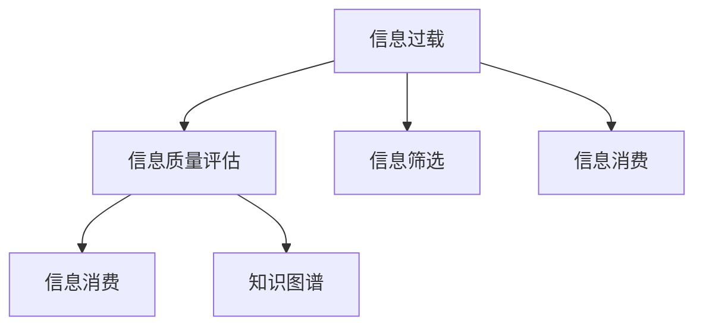

                 

# 信息过载与信息质量评估策略：批判性地评估和消费信息

在当今信息爆炸的时代，人们面临着前所未有的信息过载挑战。如何从海量信息中筛选出有价值的内容，评估和消费信息的质量，成为每个人都需要掌握的关键技能。本文将从信息质量评估的原理、方法、工具和应用场景等多个维度进行深入探讨，希望能帮助您在信息过载中保持理性和批判性，批判性地评估和消费信息，做出更明智的决策。

## 1. 背景介绍

### 1.1 问题由来
随着互联网和数字技术的快速发展，信息的产生和传播速度急剧提升。社交媒体、新闻网站、博客、论坛等平台每天都在发布海量的内容。这虽然为人们提供了丰富的信息源，但也带来了信息过载的困境。如何有效地筛选和评估这些信息，使其转化为有价值的知识，成为了一个亟待解决的问题。

### 1.2 问题核心关键点
信息过载的核心关键点在于信息量和质量的不匹配。在信息过载的时代，信息的数量已经远超人们处理和消费的能力，而信息质量的多样性和主观性又使得筛选和评估变得复杂。有效的方法不仅需要高效地筛选信息，还需要评估信息的质量，判断其真实性、可靠性和价值。

## 2. 核心概念与联系

### 2.1 核心概念概述

为更好地理解信息质量评估的原理和应用，本节将介绍几个关键概念：

- 信息过载(Information Overload)：指个体接收的信息量超过其处理能力，导致无法有效地获取和利用信息的状态。
- 信息质量评估(Information Quality Assessment)：通过一系列方法和工具，评估信息的准确性、可靠性、相关性和完整性等指标的过程。
- 信息筛选(Information Filtering)：根据用户兴趣、需求和优先级，从大量信息中挑选出相关性高的信息的过程。
- 信息消费(Information Consumption)：用户阅读、理解和应用信息以获取知识、做出决策的过程。
- 知识图谱(Knowledge Graph)：一种语义网络，用于存储和组织信息，支持信息检索、关联分析和推理。

这些概念之间的联系可以通过以下Mermaid流程图来展示：



这个流程图展示了一系列关键概念及其之间的关系：

1. 信息过载是信息消费和信息筛选的背景条件。
2. 信息质量评估是对信息进行筛选和消费的前提。
3. 知识图谱为信息消费和筛选提供语义支持。
4. 信息消费是信息筛选的最终目的。

这些概念共同构成了信息处理的框架，指导着如何从信息过载中提取有价值的内容，做出基于知识的决策。

## 3. 核心算法原理 & 具体操作步骤
### 3.1 算法原理概述

信息质量评估的根本目标是识别和提取有用信息，并将其与噪音信息区分开来。其核心原理包括但不限于以下几个方面：

- **准确性(Accuracy)**：信息是否真实准确，反映事实真相。
- **可靠性(Relibility)**：信息来源是否可靠，是否有信誉保证。
- **相关性(Relevance)**：信息是否与用户需求相关，是否有用。
- **完整性(Completeness)**：信息是否全面完整，是否遗漏重要细节。

信息质量评估的算法通常包括数据挖掘、自然语言处理、机器学习等多种技术手段，用于自动化识别和评估信息质量。

### 3.2 算法步骤详解

信息质量评估的一般步骤包括：

**Step 1: 收集信息**
- 从各类信息源（如社交媒体、新闻网站、论坛等）收集信息。
- 使用爬虫工具或API获取数据，构建信息数据集。

**Step 2: 数据预处理**
- 对原始数据进行清洗和预处理，去除噪音、重复和无效信息。
- 对文本数据进行分词、去停用词、词性标注等处理。

**Step 3: 特征提取**
- 使用TF-IDF、Word2Vec、BERT等技术，将文本信息转换为向量表示。
- 提取关键特征，如情感倾向、主题标签、作者信誉等。

**Step 4: 模型训练**
- 使用监督学习或无监督学习算法训练信息质量评估模型。
- 训练过程中引入交叉验证、正则化等技术，提高模型泛化能力。

**Step 5: 评估与筛选**
- 使用训练好的模型对收集到的信息进行评估，打分或标记。
- 根据评估结果进行信息筛选，保留高质量信息。

**Step 6: 反馈与迭代**
- 收集用户反馈，对模型进行迭代优化。
- 不断更新和优化特征提取和模型训练方法，提升评估效果。

### 3.3 算法优缺点

信息质量评估算法具有以下优点：
1. 自动化程度高。通过模型训练和评估，可以快速筛选大量信息，减轻人工工作量。
2. 可扩展性强。可以处理各种信息格式和数据源，应用范围广泛。
3. 灵活性好。可以根据特定需求定制特征和模型，提高评估的准确性。

同时，也存在一些局限性：
1. 数据质量和标注依赖。模型评估结果依赖于数据质量和标注质量，存在偏差风险。
2. 复杂性高。特征提取和模型训练过程复杂，需要专业的技术和资源支持。
3. 信息噪音干扰。模型容易受到信息噪音的影响，评估结果可能不准确。
4. 解释性不足。模型的内部机制复杂，难以解释其决策过程。

尽管存在这些局限性，但信息质量评估算法在信息筛选和消费中的应用已经得到了广泛验证，成为信息管理的重要手段。

### 3.4 算法应用领域

信息质量评估算法在以下领域有着广泛的应用：

- **新闻媒体**：评估新闻报道的准确性、可靠性、相关性，辅助记者和编辑筛选重要新闻。
- **社交媒体**：评估用户评论、帖子的质量，防止虚假信息和谣言传播。
- **电子商务**：评估商品评价、用户评论的真实性、可靠性，辅助消费者做出购买决策。
- **金融行业**：评估财务报告、新闻事件的准确性和可靠性，辅助投资者决策。
- **健康医疗**：评估医学研究、健康信息的准确性和完整性，辅助医生和患者做出诊断和治疗决策。
- **教育领域**：评估在线课程、教育资源的质量，辅助学生和教师选择优质资源。

## 4. 数学模型和公式 & 详细讲解 & 举例说明

### 4.1 数学模型构建

本节将使用数学语言对信息质量评估的算法原理进行更加严格的刻画。

假设我们有一个信息数据集 $D=\{x_i,y_i\}_{i=1}^N$，其中 $x_i$ 是第 $i$ 条信息的文本表示，$y_i$ 是该信息的真实标签（1表示信息质量高，0表示信息质量低）。我们的目标是训练一个分类器 $f$，用于评估信息 $x$ 的质量。

定义模型的损失函数为 $L(y,\hat{y})$，其中 $y$ 为真实标签，$\hat{y}$ 为模型预测结果。常见的损失函数包括交叉熵损失、均方误差损失等。

### 4.2 公式推导过程

以交叉熵损失为例，我们的目标是最小化预测结果 $\hat{y}$ 和真实标签 $y$ 之间的交叉熵：

$$
L(y,\hat{y}) = -\sum_{i=1}^N y_i\log\hat{y_i} + (1-y_i)\log(1-\hat{y_i})
$$

假设我们使用SVM分类器，其决策函数为：

$$
f(x)=\sum_{i=1}^n\alpha_ix_i+\beta
$$

其中 $\alpha_i$ 是支持向量的系数，$x_i$ 是支持向量，$\beta$ 是偏置项。通过训练模型，我们得到 $n$ 个支持向量 $(x_i,y_i)$，以及相应的系数 $\alpha_i$。

在实际应用中，我们需要使用特征提取器将原始文本信息转换为向量表示 $x$。常见的特征提取方法包括TF-IDF、Word2Vec、BERT等。在向量表示的基础上，我们可以使用SVM或其他机器学习算法进行分类。

### 4.3 案例分析与讲解

以社交媒体上的用户评论为例，我们可以使用信息质量评估算法筛选出高质量评论，辅助用户消费信息。具体步骤如下：

1. 收集社交媒体上的用户评论数据。
2. 对数据进行清洗和预处理，去除噪音、重复信息。
3. 使用BERT模型将文本信息转换为向量表示。
4. 使用SVM模型进行分类，判断评论的质量。
5. 根据评分筛选高质量评论，推荐给用户。

## 5. 项目实践：代码实例和详细解释说明
### 5.1 开发环境搭建

在进行信息质量评估实践前，我们需要准备好开发环境。以下是使用Python进行TensorFlow开发的环境配置流程：

1. 安装Anaconda：从官网下载并安装Anaconda，用于创建独立的Python环境。

2. 创建并激活虚拟环境：
```bash
conda create -n tf-env python=3.8 
conda activate tf-env
```

3. 安装TensorFlow：根据CUDA版本，从官网获取对应的安装命令。例如：
```bash
conda install tensorflow -c tf -c conda-forge
```

4. 安装必要的依赖包：
```bash
pip install pandas numpy sklearn word2vec pyLDAvis gensim
```

完成上述步骤后，即可在`tf-env`环境中开始信息质量评估的开发。

### 5.2 源代码详细实现

以下是一个简单的Python代码示例，用于评估社交媒体用户评论的质量：

```python
import tensorflow as tf
from tensorflow.keras.preprocessing.text import Tokenizer
from tensorflow.keras.preprocessing.sequence import pad_sequences
from tensorflow.keras.layers import Embedding, Dense, Dropout
from tensorflow.keras.models import Sequential
from tensorflow.keras.callbacks import EarlyStopping
from sklearn.model_selection import train_test_split
from sklearn.metrics import classification_report

# 数据预处理
def preprocess_data(texts, labels):
    tokenizer = Tokenizer(num_words=10000)
    tokenizer.fit_on_texts(texts)
    sequences = tokenizer.texts_to_sequences(texts)
    padded_sequences = pad_sequences(sequences, maxlen=100)
    return padded_sequences, labels

# 模型定义
model = Sequential([
    Embedding(input_dim=10000, output_dim=64, input_length=100),
    Dropout(0.5),
    Dense(64, activation='relu'),
    Dropout(0.5),
    Dense(1, activation='sigmoid')
])

# 模型编译
model.compile(optimizer='adam', loss='binary_crossentropy', metrics=['accuracy'])

# 模型训练
train_data, train_labels = preprocess_data(train_texts, train_labels)
val_data, val_labels = preprocess_data(val_texts, val_labels)
model.fit(train_data, train_labels, validation_data=(val_data, val_labels), epochs=10, batch_size=32, callbacks=[EarlyStopping(patience=3)])

# 模型评估
test_data, test_labels = preprocess_data(test_texts, test_labels)
y_pred = model.predict(test_data)
y_pred = (y_pred > 0.5).astype(int)
print(classification_report(test_labels, y_pred))
```

### 5.3 代码解读与分析

让我们再详细解读一下关键代码的实现细节：

**preprocess_data函数**：
- 使用Tokenizer将文本转换为整数序列，并进行padding操作，保证序列长度一致。

**模型定义**：
- 定义一个包含嵌入层、Dropout层、全连接层的神经网络模型。

**模型编译**：
- 使用Adam优化器和二分类交叉熵损失函数进行模型编译。

**模型训练**：
- 将数据分为训练集和验证集，使用EarlyStopping进行提前停止训练。

**模型评估**：
- 在测试集上进行预测，并使用classification_report输出评估结果。

可以看到，通过TensorFlow，我们可以高效地构建和训练信息质量评估模型。开发者可以将更多精力放在数据处理、模型改进等高层逻辑上，而不必过多关注底层的实现细节。

当然，工业级的系统实现还需考虑更多因素，如模型的保存和部署、超参数的自动搜索、更灵活的任务适配层等。但核心的信息质量评估算法基本与此类似。

## 6. 实际应用场景
### 6.1 新闻媒体

在新闻媒体领域，信息质量评估可以用于筛选高质量的新闻报道，辅助记者和编辑提升内容质量。具体而言，新闻机构可以通过收集和标注大量的新闻报道，训练信息质量评估模型，对新的新闻报道进行自动化评估。模型可以输出每条新闻的评分，辅助编辑选择最具新闻价值的内容，并进行人工审核和修正。

### 6.2 社交媒体

社交媒体平台可以应用信息质量评估技术，识别和屏蔽虚假信息和谣言，提升用户信息消费的体验。例如，Facebook和Twitter等社交平台已经引入了信息质量评估算法，自动检测和标记虚假新闻、谣言和恶意信息，保护用户的社交安全。

### 6.3 电子商务

电子商务网站可以使用信息质量评估技术，筛选和推荐高质量的商品评价和用户评论，帮助消费者做出更明智的购买决策。例如，Amazon使用信息质量评估模型，评估用户评论的真实性和可靠性，提升平台的信誉和用户满意度。

### 6.4 金融行业

金融行业可以应用信息质量评估技术，评估财经新闻和市场报告的准确性和可靠性，辅助投资者进行决策。例如，彭博社等金融信息提供商，已经引入了信息质量评估算法，对财经新闻和市场报告进行自动化筛选和排序，提高信息的时效性和准确性。

## 7. 工具和资源推荐
### 7.1 学习资源推荐

为了帮助开发者系统掌握信息质量评估的理论基础和实践技巧，这里推荐一些优质的学习资源：

1. 《信息检索与自然语言处理》系列博文：由自然语言处理专家撰写，深入浅出地介绍了信息检索和自然语言处理的基本概念和经典模型。

2. CSIRI《自然语言处理》课程：北京大学开设的NLP明星课程，有Lecture视频和配套作业，带你入门NLP领域的基本概念和经典模型。

3. 《信息检索》书籍：信息检索领域的经典教材，全面介绍了信息检索的基本原理、方法和应用。

4. 《自然语言处理综论》书籍：自然语言处理领域的权威教材，涵盖了NLP的各个方面，包括信息质量评估等前沿技术。

5. Semantic Scholar：一个用于查找学术论文和研究报告的平台，涵盖了NLP和信息检索领域的最新研究成果。

通过对这些资源的学习实践，相信你一定能够快速掌握信息质量评估的精髓，并用于解决实际的NLP问题。

### 7.2 开发工具推荐

高效的开发离不开优秀的工具支持。以下是几款用于信息质量评估开发的常用工具：

1. TensorFlow：基于Python的开源深度学习框架，灵活动态的计算图，适合快速迭代研究。

2. PyTorch：基于Python的开源深度学习框架，灵活性高，支持动态图和静态图，适合复杂模型的训练和推理。

3. NLTK和spaCy：自然语言处理工具包，提供了丰富的文本处理和分析功能，支持分词、命名实体识别、句法分析等任务。

4. scikit-learn：Python的机器学习库，提供了各种常见的机器学习算法和工具，支持数据预处理、特征提取和模型训练。

5. Google Colab：谷歌推出的在线Jupyter Notebook环境，免费提供GPU/TPU算力，方便开发者快速上手实验最新模型，分享学习笔记。

合理利用这些工具，可以显著提升信息质量评估任务的开发效率，加快创新迭代的步伐。

### 7.3 相关论文推荐

信息质量评估技术的发展源于学界的持续研究。以下是几篇奠基性的相关论文，推荐阅读：

1. TextRank: Bringing Order into Texts（Tan和Deerwester, 2008）：提出了基于图论的文本排序算法，用于评估信息的相关性和重要性。

2. Semantic Accuracy: The Rationale Behind Search Rankings（Ghosh和Ramakrishnan, 2002）：探讨了信息检索中语义准确性的问题，提出了基于语义相似度的评估方法。

3. Information Quality Assessment in Social Media（Tan和Deerwester, 2008）：介绍了社交媒体中信息质量评估的基本方法和应用案例，展示了其在虚假信息检测中的应用效果。

4. TextRank for Information Retrieval with Web Content：Efficient Information Retrieval（Mihalcea和Danescu-Niculescu-Mizil, 2006）：提出了基于TextRank的文本排序算法，用于提高信息检索的准确性和效率。

5. BERT: Pre-training of Deep Bidirectional Transformers for Language Understanding（Devlin等，2019）：提出BERT模型，引入掩码语言模型等自监督预训练任务，提升了信息质量评估模型的性能。

这些论文代表了大规模语言模型微调技术的发展脉络。通过学习这些前沿成果，可以帮助研究者把握学科前进方向，激发更多的创新灵感。

## 8. 总结：未来发展趋势与挑战
### 8.1 总结

本文对信息质量评估的原理、方法、工具和应用场景进行了全面系统的介绍。首先阐述了信息过载背景下的信息质量评估需求，明确了信息质量评估在筛选和消费信息中的重要地位。其次，从原理到实践，详细讲解了信息质量评估的数学原理和关键步骤，给出了信息质量评估任务开发的完整代码实例。同时，本文还广泛探讨了信息质量评估在新闻媒体、社交媒体、电子商务、金融行业等多个领域的应用前景，展示了信息质量评估技术的巨大潜力。最后，本文精选了信息质量评估技术的各类学习资源，力求为读者提供全方位的技术指引。

通过本文的系统梳理，可以看到，信息质量评估技术正在成为信息处理的重要手段，极大地提高了信息筛选和消费的效率和质量。未来，伴随信息技术的进一步发展，信息质量评估技术还将与其他人工智能技术进行更深入的融合，如知识图谱、因果推理、强化学习等，多路径协同发力，共同推动信息质量评估技术的进步。

### 8.2 未来发展趋势

展望未来，信息质量评估技术将呈现以下几个发展趋势：

1. 自动化程度提高。随着机器学习和自然语言处理技术的进步，信息质量评估的自动化程度将不断提高，能够处理更多类型的信息。

2. 跨领域应用拓展。信息质量评估技术将从单一领域扩展到多个领域，如医疗、教育、金融等，帮助这些领域的机构更好地管理信息资源。

3. 多模态信息融合。除了文本信息外，信息质量评估将融合视觉、听觉等多模态信息，实现更全面的信息评估。

4. 实时评估和反馈。信息质量评估系统将具备实时评估能力，能够实时检测和筛选信息，及时提供反馈和修正。

5. 深度学习和神经网络。使用深度学习和神经网络技术，信息质量评估模型将具备更强的语义理解和推理能力，提升评估效果。

6. 联邦学习和隐私保护。在信息质量评估过程中，将引入联邦学习和差分隐私等技术，保护用户隐私和数据安全。

以上趋势凸显了信息质量评估技术的广阔前景。这些方向的探索发展，必将进一步提升信息处理和管理的智能化水平，为人类信息消费提供更优质、更安全的支持。

### 8.3 面临的挑战

尽管信息质量评估技术已经取得了显著进展，但在迈向更加智能化、普适化应用的过程中，仍面临诸多挑战：

1. 数据质量和标注依赖。高质量的数据和标注是信息质量评估的基础，但在某些领域获取高质量标注数据的成本较高。

2. 模型复杂度和计算资源。信息质量评估模型通常需要处理大量数据，训练过程复杂，计算资源需求高。

3. 信息噪音干扰。信息质量评估模型容易受到噪音信息的影响，评估结果可能不准确。

4. 解释性和透明度。模型的内部机制复杂，难以解释其决策过程，缺乏透明度。

5. 隐私保护和数据安全。在信息质量评估过程中，如何保护用户隐私和数据安全，防止数据泄露和滥用，是重要的课题。

6. 跨领域应用难度。不同领域的信息质量评估方法可能存在差异，如何将通用的评估方法应用于不同领域，是一个挑战。

7. 知识图谱构建。信息质量评估需要构建和维护知识图谱，这需要大量的知识和资源投入。

以上挑战需要在技术、工程、伦理等多个维度进行综合考虑和解决，才能推动信息质量评估技术迈向成熟。

### 8.4 研究展望

面对信息质量评估技术所面临的挑战，未来的研究需要在以下几个方面寻求新的突破：

1. 无监督和半监督信息质量评估方法。探索无需标注的数据驱动方法，利用自监督学习、主动学习等技术，提升信息质量评估的效果。

2. 多模态信息质量评估。将视觉、听觉等多模态信息与文本信息结合，实现更全面的信息评估。

3. 联邦学习和隐私保护技术。引入联邦学习和差分隐私等技术，保护用户隐私和数据安全。

4. 知识图谱与信息质量评估的结合。构建大规模知识图谱，与信息质量评估技术结合，实现更全面、更准确的信息评估。

5. 深度学习与信息质量评估。引入深度学习和神经网络技术，提升信息质量评估的语义理解和推理能力。

6. 跨领域信息质量评估方法。探索通用的信息质量评估方法，应用于不同领域的信息评估。

这些研究方向的探索，必将引领信息质量评估技术迈向更高的台阶，为信息消费提供更优质、更安全的支持。面向未来，信息质量评估技术还需要与其他人工智能技术进行更深入的融合，如知识图谱、因果推理、强化学习等，多路径协同发力，共同推动信息质量评估技术的进步。只有勇于创新、敢于突破，才能不断拓展信息质量评估技术的边界，让信息消费更加高效、智能和可靠。

## 9. 附录：常见问题与解答
### 9.1 什么是信息质量评估？

信息质量评估是指通过一系列方法和工具，评估信息的准确性、可靠性、相关性和完整性等指标的过程。其核心目标是从海量信息中筛选出高质量的内容，提升信息消费的效率和质量。

### 9.2 信息质量评估的方法有哪些？

信息质量评估的方法主要包括基于规则的方法、基于统计的方法和基于机器学习的方法。其中，基于机器学习的方法，如SVM、深度学习等，已经成为信息质量评估的主流。

### 9.3 如何构建信息质量评估模型？

构建信息质量评估模型的步骤包括数据收集和预处理、特征提取、模型训练和评估等。在特征提取阶段，可以使用TF-IDF、Word2Vec、BERT等技术将文本信息转换为向量表示。在模型训练阶段，可以使用监督学习或无监督学习算法训练信息质量评估模型。

### 9.4 信息质量评估有哪些应用场景？

信息质量评估在新闻媒体、社交媒体、电子商务、金融行业等多个领域有着广泛的应用。例如，新闻机构可以使用信息质量评估筛选高质量的新闻报道，社交媒体平台可以识别和屏蔽虚假信息，电子商务网站可以筛选和推荐高质量的商品评价。

### 9.5 如何提高信息质量评估的准确性？

提高信息质量评估的准确性可以从数据质量、特征提取、模型训练等多个环节进行优化。例如，收集高质量的标注数据，选择适合的特征提取方法，使用深度学习等先进技术进行模型训练。

作者：禅与计算机程序设计艺术 / Zen and the Art of Computer Programming

