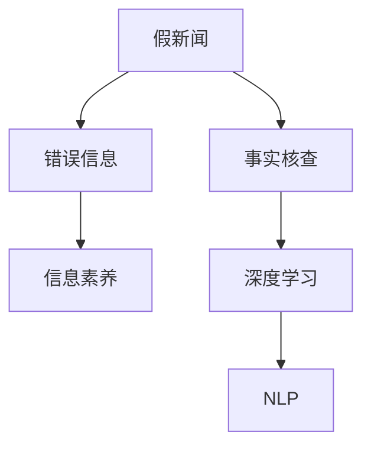

                 

# 信息验证和信息批判性思考指南：在假新闻和错误信息时代导航

## 1. 背景介绍

### 1.1 问题由来
随着互联网的普及，信息的获取和传播变得前所未有的便捷。然而，在“人人皆可发声”的时代，信息的真实性、准确性也面临着巨大的挑战。假新闻、错误信息、虚假声明等成为信息时代的新“顽疾”。这些信息不仅误导公众，造成恐慌和混乱，更可能引发严重的社会问题。如何在真假信息交织的海洋中，辨识真伪，保持批判性思考，成为了每个公民和从业者必须掌握的基本技能。

### 1.2 问题核心关键点
信息验证和信息批判性思考的核心在于：
- **信息源的可靠性**：判断信息来源是否可靠，是辨别真伪的第一步。
- **内容的合理性**：分析信息内容是否合乎逻辑，是否存在矛盾和不一致之处。
- **证据的有效性**：检查信息是否提供了足够、可靠的证据，是否存在夸大或虚构。
- **作者的背景**：了解作者的身份和背景，是否存在潜在的利益冲突或偏见。
- **社交网络的反馈**：参考社交网络上的讨论和评论，判断信息是否被广泛接受或质疑。

### 1.3 问题研究意义
掌握信息验证和批判性思考技能，对个人和社会都具有重要意义：
- 个人层面，能够避免被错误信息误导，维护自身决策的独立性和科学性。
- 社会层面，有利于构建基于事实的信息环境，促进社会和谐稳定。
- 职业层面，信息批判性思考是新闻、法律、教育、政治等众多领域的专业技能，直接影响工作质量和社会信任。
- 科技层面，随着深度学习、自然语言处理等技术的进步，准确信息验证的需求更加迫切，成为AI研究的重要方向。

## 2. 核心概念与联系

### 2.1 核心概念概述

为更好地理解信息验证和信息批判性思考，本节将介绍几个密切相关的核心概念：

- **假新闻(Fake News)**：指故意编造、传播的虚假信息，通常用于政治宣传、商业欺诈等目的。
- **错误信息(Misinformation)**：指实际存在的真实信息，但被误传、误解，导致公众认知偏差。
- **事实核查(Verification)**：指通过验证证据和逻辑，判断信息真实性的过程。
- **信息素养(Literacy)**：指个人获取、分析、评估和应用信息的能力，包括批判性思考、信息源选择等。
- **深度学习(Deep Learning)**：指利用多层神经网络进行复杂数据模式识别的技术，在信息验证中主要应用于文本分类、情感分析、事实核查等任务。
- **自然语言处理(NLP)**：指通过算法和模型处理自然语言数据的学科，在信息验证中用于文本理解、语义分析、证据提取等环节。

这些概念之间的逻辑关系可以通过以下Mermaid流程图来展示：



这个流程图展示了大语言模型的核心概念及其之间的关系：

1. 假新闻和错误信息是信息验证的对象。
2. 事实核查是辨别真伪的过程。
3. 信息素养是个体应对信息的能力。
4. 深度学习和自然语言处理技术是实现事实核查和信息素养的重要工具。

## 3. 核心算法原理 & 具体操作步骤
### 3.1 算法原理概述

信息验证和信息批判性思考的本质，是通过机器学习技术对信息进行自动化的证据提取和逻辑推理。其核心思想是：将信息验证任务视为一个二分类问题，即判断文本是否为假新闻或错误信息，然后利用监督学习、深度学习等技术构建分类器，通过训练大量有标签的数据集，训练出一个能够在新的数据上准确预测的模型。

形式化地，设 $D=\{(x_i,y_i)\}_{i=1}^N$ 为训练集，$x_i$ 表示文本，$y_i$ 表示标签（0表示假新闻，1表示非假新闻），$M_{\theta}$ 为模型，其中 $\theta$ 为模型参数。则信息验证的目标是找到最优参数 $\theta^*$，使得模型在测试集上的准确率最大化：

$$
\theta^* = \mathop{\arg\max}_{\theta} \mathcal{P}(y_i=1 | M_{\theta}(x_i))
$$

其中 $\mathcal{P}(y_i=1 | M_{\theta}(x_i))$ 表示模型对 $x_i$ 是否为假新闻的概率预测，通常使用交叉熵损失函数 $\mathcal{L}(\theta)$ 来衡量模型的预测准确度。

### 3.2 算法步骤详解

信息验证的监督学习过程包括以下几个关键步骤：

**Step 1: 数据准备**
- 收集大量有标签的文本数据，标注为假新闻或非假新闻。
- 将数据划分为训练集、验证集和测试集，通常要求训练集和测试集的数据分布相似。

**Step 2: 模型选择**
- 选择合适的深度学习模型作为信息验证的分类器。
- 常用的模型包括卷积神经网络(CNN)、递归神经网络(RNN)、长短时记忆网络(LSTM)、Transformer等。

**Step 3: 模型训练**
- 使用训练集数据，通过前向传播计算损失函数，并反向传播更新模型参数。
- 定期在验证集上评估模型性能，根据验证集上的损失调整学习率等超参数。

**Step 4: 模型评估**
- 在测试集上评估模型性能，使用准确率、精确率、召回率等指标评估分类器的表现。
- 分析模型在各类假新闻和错误信息上的表现，评估模型的泛化能力。

**Step 5: 模型应用**
- 使用训练好的模型对新的文本数据进行分类，判断是否为假新闻或错误信息。
- 对于疑似假新闻或错误信息，进一步进行深入验证，提供详细的证据和推理过程。

### 3.3 算法优缺点

信息验证的监督学习方法具有以下优点：
1. 自动化程度高。通过构建机器学习模型，可以自动化地进行证据提取和逻辑推理，减少人工干预。
2. 适应性强。深度学习模型可以处理大规模的文本数据，适应不同领域和类型的信息验证任务。
3. 泛化能力强。模型在大量标注数据上进行训练，能够有效泛化到新数据。
4. 易于部署。构建好的模型可以导出为API服务，方便集成到其他系统进行信息验证。

同时，该方法也存在一定的局限性：
1. 依赖标注数据。模型的训练效果很大程度上取决于标注数据的质量和数量，高质量标注数据的获取成本较高。
2. 泛化能力有限。模型可能对特定的信息风格或领域存在偏见，泛化能力有限。
3. 可解释性不足。深度学习模型往往像“黑盒”，难以解释其内部的决策过程。
4. 对抗样本问题。模型可能受到对抗样本的攻击，导致误判。

尽管存在这些局限性，但就目前而言，信息验证的监督学习方法仍是处理假新闻和错误信息的重要手段。未来相关研究的重点在于如何进一步降低对标注数据的依赖，提高模型的泛化能力，同时兼顾可解释性和鲁棒性等因素。

### 3.4 算法应用领域

信息验证的监督学习范式已经在新闻事实核查、社交媒体分析、广告审查等多个领域得到广泛应用，展示了其强大的能力：

- 新闻事实核查：利用模型对新闻文本进行事实核查，判断是否包含假新闻元素。
- 社交媒体分析：分析社交媒体上的文本数据，识别和移除假新闻和错误信息。
- 广告审查：检测广告内容中的误导性信息和虚假宣传。
- 政治分析：分析政治竞选中的信息传播情况，检测假新闻和误导性言论。

除了上述这些经典应用外，信息验证技术还在舆情监控、公共健康、金融风控等领域展现了广阔的应用前景。随着深度学习、自然语言处理等技术的不断进步，相信信息验证技术将在更多领域发挥重要作用。

## 4. 数学模型和公式 & 详细讲解  
### 4.1 数学模型构建

本节将使用数学语言对信息验证的监督学习过程进行更加严格的刻画。

设信息验证模型的训练集为 $D=\{(x_i,y_i)\}_{i=1}^N$，其中 $x_i$ 表示文本，$y_i$ 表示标签（0表示假新闻，1表示非假新闻）。定义模型 $M_{\theta}$ 在输入 $x_i$ 上的概率预测为 $\mathcal{P}(y_i=1 | M_{\theta}(x_i))$，则模型的交叉熵损失函数 $\mathcal{L}(\theta)$ 定义为：

$$
\mathcal{L}(\theta) = -\frac{1}{N}\sum_{i=1}^N [y_i\log \mathcal{P}(y_i=1 | M_{\theta}(x_i)) + (1-y_i)\log(1-\mathcal{P}(y_i=1 | M_{\theta}(x_i)))
$$

其中 $\log \mathcal{P}(y_i=1 | M_{\theta}(x_i))$ 表示模型预测 $x_i$ 为假新闻的概率，$\log(1-\mathcal{P}(y_i=1 | M_{\theta}(x_i)))$ 表示模型预测 $x_i$ 为非假新闻的概率。

模型的优化目标是最小化交叉熵损失，即找到最优参数：

$$
\theta^* = \mathop{\arg\min}_{\theta} \mathcal{L}(\theta)
$$

在实践中，我们通常使用基于梯度的优化算法（如SGD、Adam等）来近似求解上述最优化问题。设 $\eta$ 为学习率，则参数的更新公式为：

$$
\theta \leftarrow \theta - \eta \nabla_{\theta}\mathcal{L}(\theta)
$$

其中 $\nabla_{\theta}\mathcal{L}(\theta)$ 为损失函数对参数 $\theta$ 的梯度，可通过反向传播算法高效计算。

### 4.2 公式推导过程

以下我们以二分类任务为例，推导交叉熵损失函数及其梯度的计算公式。

设模型 $M_{\theta}$ 在输入 $x$ 上的概率预测为 $\mathcal{P}(y=1 | M_{\theta}(x))$，真实标签 $y \in \{0,1\}$。则二分类交叉熵损失函数定义为：

$$
\mathcal{L}(\theta) = -\frac{1}{N}\sum_{i=1}^N [y_i\log \mathcal{P}(y_i=1 | M_{\theta}(x_i)) + (1-y_i)\log(1-\mathcal{P}(y_i=1 | M_{\theta}(x_i)))
$$

将其代入模型损失函数公式，得：

$$
\mathcal{L}(\theta) = -\frac{1}{N}\sum_{i=1}^N [y_i\log \sigma(\mathcal{W}x_i+b) + (1-y_i)\log(1-\sigma(\mathcal{W}x_i+b))]
$$

其中 $\sigma$ 为sigmoid激活函数，$\mathcal{W}$ 为模型的权重矩阵，$b$ 为偏置项。

根据链式法则，损失函数对参数 $\theta$ 的梯度为：

$$
\frac{\partial \mathcal{L}(\theta)}{\partial \theta} = -\frac{1}{N}\sum_{i=1}^N [\frac{y_i}{\sigma(\mathcal{W}x_i+b)} - \frac{1-y_i}{1-\sigma(\mathcal{W}x_i+b)}] \nabla_{\theta}\mathcal{L}(\theta)
$$

其中 $\nabla_{\theta}\mathcal{L}(\theta)$ 为损失函数对参数 $\theta$ 的梯度，可通过反向传播算法高效计算。

在得到损失函数的梯度后，即可带入参数更新公式，完成模型的迭代优化。重复上述过程直至收敛，最终得到适应信息验证任务的最优模型参数 $\theta^*$。

## 5. 项目实践：代码实例和详细解释说明
### 5.1 开发环境搭建

在进行信息验证实践前，我们需要准备好开发环境。以下是使用Python进行PyTorch开发的环境配置流程：

1. 安装Anaconda：从官网下载并安装Anaconda，用于创建独立的Python环境。

2. 创建并激活虚拟环境：
```bash
conda create -n pytorch-env python=3.8 
conda activate pytorch-env
```

3. 安装PyTorch：根据CUDA版本，从官网获取对应的安装命令。例如：
```bash
conda install pytorch torchvision torchaudio cudatoolkit=11.1 -c pytorch -c conda-forge
```

4. 安装Transformers库：
```bash
pip install transformers
```

5. 安装各类工具包：
```bash
pip install numpy pandas scikit-learn matplotlib tqdm jupyter notebook ipython
```

完成上述步骤后，即可在`pytorch-env`环境中开始信息验证实践。

### 5.2 源代码详细实现

这里我们以基于BERT的信息验证模型为例，给出使用Transformers库的信息验证PyTorch代码实现。

首先，定义信息验证任务的数据处理函数：

```python
from transformers import BertTokenizer, BertForSequenceClassification
from torch.utils.data import Dataset
import torch

class InfoVerificationDataset(Dataset):
    def __init__(self, texts, labels, tokenizer, max_len=128):
        self.texts = texts
        self.labels = labels
        self.tokenizer = tokenizer
        self.max_len = max_len
        
    def __len__(self):
        return len(self.texts)
    
    def __getitem__(self, item):
        text = self.texts[item]
        label = self.labels[item]
        
        encoding = self.tokenizer(text, return_tensors='pt', max_length=self.max_len, padding='max_length', truncation=True)
        input_ids = encoding['input_ids'][0]
        attention_mask = encoding['attention_mask'][0]
        
        # 将标签转化为[0,1]之间的浮点数
        label = torch.tensor([label], dtype=torch.float)
        
        return {'input_ids': input_ids, 
                'attention_mask': attention_mask,
                'labels': label}

# 创建dataset
tokenizer = BertTokenizer.from_pretrained('bert-base-cased')
train_dataset = InfoVerificationDataset(train_texts, train_labels, tokenizer)
dev_dataset = InfoVerificationDataset(dev_texts, dev_labels, tokenizer)
test_dataset = InfoVerificationDataset(test_texts, test_labels, tokenizer)
```

然后，定义模型和优化器：

```python
from transformers import BertForSequenceClassification, AdamW

model = BertForSequenceClassification.from_pretrained('bert-base-cased', num_labels=2)

optimizer = AdamW(model.parameters(), lr=2e-5)
```

接着，定义训练和评估函数：

```python
from torch.utils.data import DataLoader
from tqdm import tqdm
from sklearn.metrics import classification_report

device = torch.device('cuda') if torch.cuda.is_available() else torch.device('cpu')
model.to(device)

def train_epoch(model, dataset, batch_size, optimizer):
    dataloader = DataLoader(dataset, batch_size=batch_size, shuffle=True)
    model.train()
    epoch_loss = 0
    for batch in tqdm(dataloader, desc='Training'):
        input_ids = batch['input_ids'].to(device)
        attention_mask = batch['attention_mask'].to(device)
        labels = batch['labels'].to(device)
        model.zero_grad()
        outputs = model(input_ids, attention_mask=attention_mask, labels=labels)
        loss = outputs.loss
        epoch_loss += loss.item()
        loss.backward()
        optimizer.step()
    return epoch_loss / len(dataloader)

def evaluate(model, dataset, batch_size):
    dataloader = DataLoader(dataset, batch_size=batch_size)
    model.eval()
    preds, labels = [], []
    with torch.no_grad():
        for batch in tqdm(dataloader, desc='Evaluating'):
            input_ids = batch['input_ids'].to(device)
            attention_mask = batch['attention_mask'].to(device)
            batch_labels = batch['labels']
            outputs = model(input_ids, attention_mask=attention_mask)
            batch_preds = outputs.logits.argmax(dim=1).to('cpu').tolist()
            batch_labels = batch_labels.to('cpu').tolist()
            for pred, label in zip(batch_preds, batch_labels):
                preds.append(pred)
                labels.append(label)
                
    print(classification_report(labels, preds))
```

最后，启动训练流程并在测试集上评估：

```python
epochs = 5
batch_size = 16

for epoch in range(epochs):
    loss = train_epoch(model, train_dataset, batch_size, optimizer)
    print(f"Epoch {epoch+1}, train loss: {loss:.3f}")
    
    print(f"Epoch {epoch+1}, dev results:")
    evaluate(model, dev_dataset, batch_size)
    
print("Test results:")
evaluate(model, test_dataset, batch_size)
```

以上就是使用PyTorch对BERT进行信息验证任务的完整代码实现。可以看到，得益于Transformers库的强大封装，我们可以用相对简洁的代码完成BERT模型的加载和信息验证任务的开发。

### 5.3 代码解读与分析

让我们再详细解读一下关键代码的实现细节：

**InfoVerificationDataset类**：
- `__init__`方法：初始化文本、标签、分词器等关键组件。
- `__len__`方法：返回数据集的样本数量。
- `__getitem__`方法：对单个样本进行处理，将文本输入编码为token ids，将标签转化为[0,1]之间的浮点数，并对其进行定长padding，最终返回模型所需的输入。

**训练和评估函数**：
- 使用PyTorch的DataLoader对数据集进行批次化加载，供模型训练和推理使用。
- 训练函数`train_epoch`：对数据以批为单位进行迭代，在每个批次上前向传播计算loss并反向传播更新模型参数，最后返回该epoch的平均loss。
- 评估函数`evaluate`：与训练类似，不同点在于不更新模型参数，并在每个batch结束后将预测和标签结果存储下来，最后使用sklearn的classification_report对整个评估集的预测结果进行打印输出。

**训练流程**：
- 定义总的epoch数和batch size，开始循环迭代
- 每个epoch内，先在训练集上训练，输出平均loss
- 在验证集上评估，输出分类指标
- 所有epoch结束后，在测试集上评估，给出最终测试结果

可以看到，PyTorch配合Transformers库使得信息验证任务的开发变得更加高效。开发者可以将更多精力放在数据处理、模型改进等高层逻辑上，而不必过多关注底层的实现细节。

当然，工业级的系统实现还需考虑更多因素，如模型的保存和部署、超参数的自动搜索、更灵活的任务适配层等。但核心的信息验证范式基本与此类似。

## 6. 实际应用场景
### 6.1 新闻事实核查

基于大语言模型的信息验证技术，可以广泛应用于新闻事实核查。传统的事实核查过程依赖大量的人工和专家的专业知识，耗时耗力且主观性强。而使用信息验证模型，可以自动化地对新闻文本进行事实核查，大大提高核查效率和准确性。

在技术实现上，可以收集新闻领域的历史核查记录，将新闻文本和核查结果构建成监督数据，在此基础上对预训练模型进行信息验证训练。训练后的模型能够自动理解新闻文本，并判断其是否包含假新闻元素。对于疑似假新闻，可以进一步进行深入的证据分析和事实验证，确保核查结果的准确性。

### 6.2 社交媒体分析

社交媒体上的文本数据量庞大、种类繁多，是假新闻和错误信息的主要传播渠道。基于大语言模型的信息验证技术，可以自动化地对社交媒体上的文本数据进行分析，识别和移除假新闻和错误信息，维护社交环境的健康和秩序。

在具体应用中，可以收集社交媒体上的文本数据，结合用户的行为数据和社交关系数据，构建监督数据集。通过训练信息验证模型，识别出含有误导信息的文本，并打上标签进行标记和删除，从而净化社交媒体环境。

### 6.3 广告审查

广告是企业重要的营销渠道，但也可能包含误导性信息和虚假宣传。基于大语言模型的信息验证技术，可以自动化地对广告文本进行审查，确保广告内容的真实性和合规性。

在实践中，可以收集广告领域的历史审查记录，将广告文本和审查结果构建成监督数据，在此基础上对预训练模型进行信息验证训练。训练后的模型能够自动分析广告文本，并判断其是否存在误导性和虚假宣传，从而减少广告欺诈和虚假宣传的风险。

### 6.4 未来应用展望

随着深度学习、自然语言处理等技术的不断发展，基于信息验证技术的应用场景将更加广泛，为信息时代的健康发展提供有力保障。

在智慧政府领域，基于信息验证技术构建的智能客服系统、舆情监测系统、公共服务平台，将大幅提升政府治理的智能化水平，构建更加透明、可信的政府形象。

在智能医疗领域，基于信息验证技术构建的医疗问答、病历分析、药品推荐系统，将提升医疗服务的准确性和安全性，辅助医生决策，提升患者满意度。

在金融风控领域，基于信息验证技术构建的风险预警、欺诈检测、信用评估系统，将提升金融服务的可信度和安全性，保护投资者利益。

此外，在教育培训、电子商务、司法审查等多个领域，基于信息验证技术的人工智能应用也将不断涌现，为信息时代的各个行业提供坚实的技术支持。相信随着技术的日益成熟，信息验证技术将成为信息时代的重要基石，保障信息环境的健康和稳定。

## 7. 工具和资源推荐
### 7.1 学习资源推荐

为了帮助开发者系统掌握信息验证和信息批判性思考的理论基础和实践技巧，这里推荐一些优质的学习资源：

1. 《深度学习之自然语言处理》系列博文：由深度学习专家撰写，深入浅出地介绍了NLP中的关键技术，包括信息验证在内的众多方向。

2. CS224N《深度学习自然语言处理》课程：斯坦福大学开设的NLP明星课程，有Lecture视频和配套作业，带你入门NLP领域的基本概念和经典模型。

3. 《Natural Language Processing with Transformers》书籍：Transformers库的作者所著，全面介绍了如何使用Transformers库进行NLP任务开发，包括信息验证在内的诸多范式。

4. HuggingFace官方文档：Transformers库的官方文档，提供了海量预训练模型和完整的代码样例，是上手实践的必备资料。

5. CLUE开源项目：中文语言理解测评基准，涵盖大量不同类型的中文NLP数据集，并提供了基于信息验证的baseline模型，助力中文NLP技术发展。

通过对这些资源的学习实践，相信你一定能够快速掌握信息验证和信息批判性思考的精髓，并用于解决实际的信息问题。
### 7.2 开发工具推荐

高效的开发离不开优秀的工具支持。以下是几款用于信息验证开发的常用工具：

1. PyTorch：基于Python的开源深度学习框架，灵活动态的计算图，适合快速迭代研究。大部分预训练语言模型都有PyTorch版本的实现。

2. TensorFlow：由Google主导开发的开源深度学习框架，生产部署方便，适合大规模工程应用。同样有丰富的预训练语言模型资源。

3. Transformers库：HuggingFace开发的NLP工具库，集成了众多SOTA语言模型，支持PyTorch和TensorFlow，是进行信息验证任务的开发利器。

4. Weights & Biases：模型训练的实验跟踪工具，可以记录和可视化模型训练过程中的各项指标，方便对比和调优。与主流深度学习框架无缝集成。

5. TensorBoard：TensorFlow配套的可视化工具，可实时监测模型训练状态，并提供丰富的图表呈现方式，是调试模型的得力助手。

6. Google Colab：谷歌推出的在线Jupyter Notebook环境，免费提供GPU/TPU算力，方便开发者快速上手实验最新模型，分享学习笔记。

合理利用这些工具，可以显著提升信息验证任务的开发效率，加快创新迭代的步伐。

### 7.3 相关论文推荐

信息验证和信息批判性思考的研究源于学界的持续研究。以下是几篇奠基性的相关论文，推荐阅读：

1. Snopes and Online Trust and Media Literacy：介绍了传统事实核查方法，探讨了在线环境下媒体素养教育的重要性。

2. The Ethics of Misinformation Research：讨论了误导信息研究中的伦理问题，强调了学术责任和社会责任。

3. Fact-Checking with Artificial Intelligence: Opportunities and Challenges：探讨了AI在事实核查中的应用，分析了其潜在的优势和局限。

4. Automated Fact-Checking: A Survey of Techniques, Results, and Challenges：总结了自动事实核查的最新研究成果和面临的挑战，为未来的研究指明了方向。

5. The Role of Machine Learning in Fact-Checking：讨论了机器学习在事实核查中的应用，评估了其效果和潜力。

这些论文代表了大语言模型信息验证技术的发展脉络。通过学习这些前沿成果，可以帮助研究者把握学科前进方向，激发更多的创新灵感。

## 8. 总结：未来发展趋势与挑战

### 8.1 总结

本文对基于监督学习的信息验证方法进行了全面系统的介绍。首先阐述了信息验证和信息批判性思考的研究背景和意义，明确了信息验证在真假信息判断、社交媒体分析、广告审查等领域的独特价值。其次，从原理到实践，详细讲解了信息验证的数学原理和关键步骤，给出了信息验证任务开发的完整代码实例。同时，本文还广泛探讨了信息验证技术在智慧政府、智能医疗、金融风控等多个领域的应用前景，展示了其强大的能力。此外，本文精选了信息验证技术的各类学习资源，力求为读者提供全方位的技术指引。

通过本文的系统梳理，可以看到，基于大语言模型的信息验证技术在真假信息判断、社交媒体分析、广告审查等方面展现出强大的能力，成为维护信息环境的有效手段。信息验证的监督学习方法已经成为处理假新闻和错误信息的重要工具，广泛应用于新闻事实核查、社交媒体分析、广告审查等多个领域，展示了其广泛的应用前景。未来，伴随深度学习、自然语言处理等技术的不断进步，基于信息验证技术的应用场景将更加广泛，为信息时代的健康发展提供有力保障。

### 8.2 未来发展趋势

展望未来，信息验证技术将呈现以下几个发展趋势：

1. 模型规模持续增大。随着算力成本的下降和数据规模的扩张，预训练语言模型的参数量还将持续增长。超大规模语言模型蕴含的丰富语言知识，有望支撑更加复杂的信息验证任务。

2. 信息验证范式日趋多样化。除了传统的监督学习范式外，未来会涌现更多半监督、无监督、自监督的学习方法，提高模型的泛化能力和鲁棒性。

3. 多模态信息验证崛起。当前的信息验证主要聚焦于文本数据，未来将进一步拓展到图像、视频、语音等多模态数据验证。多模态信息的融合，将显著提升模型的信息理解和验证能力。

4. 信息验证系统的智能化水平提升。未来信息验证系统将更多地融合知识图谱、逻辑推理等技术，增强模型的信息整合能力和推理能力。

5. 对抗样本防御能力增强。模型可能受到对抗样本的攻击，导致误判。如何增强模型的抗干扰能力，提高系统的鲁棒性，将成为重要的研究方向。

6. 信息验证的实时性提升。基于深度学习的信息验证模型往往需要较长的时间进行训练和推理，未来将探索更加高效的模型结构和技术，提升信息验证的实时性和响应速度。

以上趋势凸显了信息验证技术的广阔前景。这些方向的探索发展，必将进一步提升信息验证系统的性能和应用范围，为信息时代的健康发展提供有力保障。

### 8.3 面临的挑战

尽管信息验证技术已经取得了瞩目成就，但在迈向更加智能化、普适化应用的过程中，它仍面临着诸多挑战：

1. 标注成本瓶颈。尽管深度学习模型在信息验证任务中表现优异，但其训练过程仍然依赖大量有标签数据。高质量标注数据的获取成本较高，如何降低对标注样本的依赖，将是一大难题。

2. 泛化能力有限。模型可能对特定的信息风格或领域存在偏见，泛化能力有限。如何提高模型的泛化能力，增强模型的通用性，仍然是一个需要解决的问题。

3. 对抗样本问题。模型可能受到对抗样本的攻击，导致误判。如何增强模型的抗干扰能力，提高系统的鲁棒性，将是重要的研究方向。

4. 可解释性不足。深度学习模型往往像“黑盒”，难以解释其内部的决策过程。如何赋予模型更强的可解释性，确保其决策透明公正，也将是一个重要的研究方向。

5. 知识整合能力不足。现有的信息验证模型往往局限于文本数据，难以灵活吸收和运用更广泛的先验知识。如何提高模型的知识整合能力，增强其信息理解能力，将是未来的一个重要研究方向。

这些挑战表明，信息验证技术仍需在模型结构、训练方法、模型解释等方面进行深入研究，方能更好地应对现实世界中的信息验证需求。

### 8.4 研究展望

面向未来，信息验证技术需要在以下几个方面寻求新的突破：

1. 探索无监督和半监督信息验证方法。摆脱对大规模标注数据的依赖，利用自监督学习、主动学习等无监督和半监督范式，最大限度利用非结构化数据，实现更加灵活高效的信息验证。

2. 研究多模态信息验证技术。将文本、图像、视频、语音等多种模态信息进行融合，构建多模态信息验证模型，增强模型的信息理解和验证能力。

3. 引入更多先验知识。将符号化的先验知识，如知识图谱、逻辑规则等，与神经网络模型进行巧妙融合，引导信息验证过程学习更准确、合理的语言模型。

4. 结合因果分析和博弈论工具。将因果分析方法引入信息验证模型，识别出模型决策的关键特征，增强输出解释的因果性和逻辑性。借助博弈论工具刻画人机交互过程，主动探索并规避模型的脆弱点，提高系统稳定性。

5. 纳入伦理道德约束。在模型训练目标中引入伦理导向的评估指标，过滤和惩罚有偏见、有害的输出倾向。同时加强人工干预和审核，建立模型行为的监管机制，确保输出符合人类价值观和伦理道德。

这些研究方向的探索，必将引领信息验证技术迈向更高的台阶，为信息时代的健康发展提供有力保障。面向未来，信息验证技术还需要与其他人工智能技术进行更深入的融合，如知识表示、因果推理、强化学习等，多路径协同发力，共同推动自然语言理解和智能交互系统的进步。只有勇于创新、敢于突破，才能不断拓展信息验证技术的边界，让智能技术更好地造福人类社会。

## 9. 附录：常见问题与解答

**Q1：信息验证技术是否适用于所有信息类型？**

A: 信息验证技术主要适用于文本数据，但对于图像、视频、音频等多模态信息，也需要开发相应的验证模型。图像识别、视频分析、语音识别等技术可以辅助信息验证，提高其准确性和全面性。

**Q2：信息验证技术的准确性和可靠性如何保障？**

A: 信息验证技术的准确性和可靠性主要依赖于训练数据的质量和模型结构的设计。高质量的标注数据和多样化的训练集可以有效提高模型的泛化能力和鲁棒性。同时，引入对抗样本防御、多模态融合等技术，也能提升模型的可靠性和安全性。

**Q3：信息验证技术如何应用于实际生产环境？**

A: 信息验证技术可以部署为API服务，集成到其他应用系统中。在生产环境中，需要考虑模型的实时性、稳定性和扩展性，确保系统的稳定运行和高效响应。

**Q4：信息验证技术如何处理对抗样本攻击？**

A: 对抗样本攻击是信息验证模型面临的重大挑战。现有方法包括对抗样本检测、鲁棒模型训练等。对抗样本检测可以检测并过滤掉恶意样本，鲁棒模型训练可以提高模型对对抗样本的鲁棒性。

**Q5：信息验证技术在实际应用中需要注意哪些问题？**

A: 在实际应用中，信息验证技术需要注意数据隐私、模型解释、系统安全性等问题。数据隐私保护需要确保数据的匿名化和最小化使用，模型解释需要提高模型的可解释性和透明性，系统安全性需要确保模型的可靠性和鲁棒性。

通过本文的系统梳理，可以看到，信息验证技术在真假信息判断、社交媒体分析、广告审查等方面展现出强大的能力，成为维护信息环境的有效手段。未来，伴随深度学习、自然语言处理等技术的不断进步，基于信息验证技术的应用场景将更加广泛，为信息时代的健康发展提供有力保障。相信随着技术的日益成熟，信息验证技术将成为信息时代的重要基石，保障信息环境的健康和稳定。

