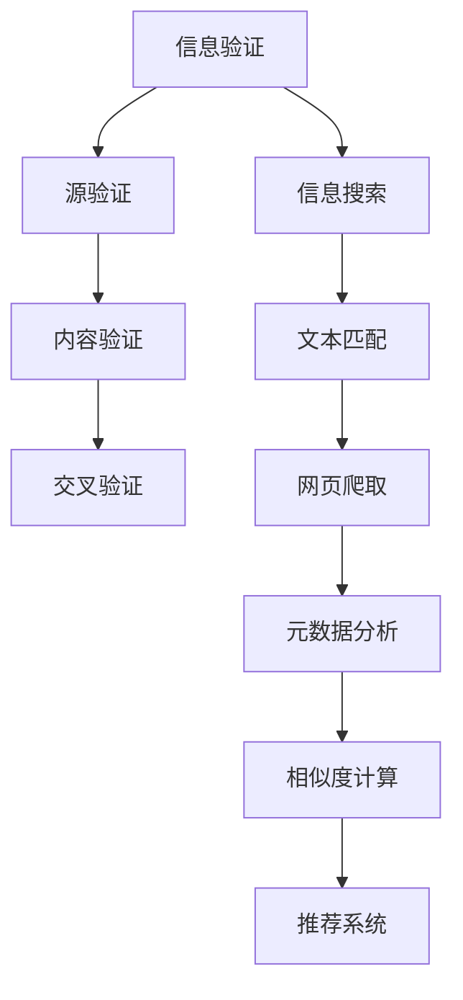
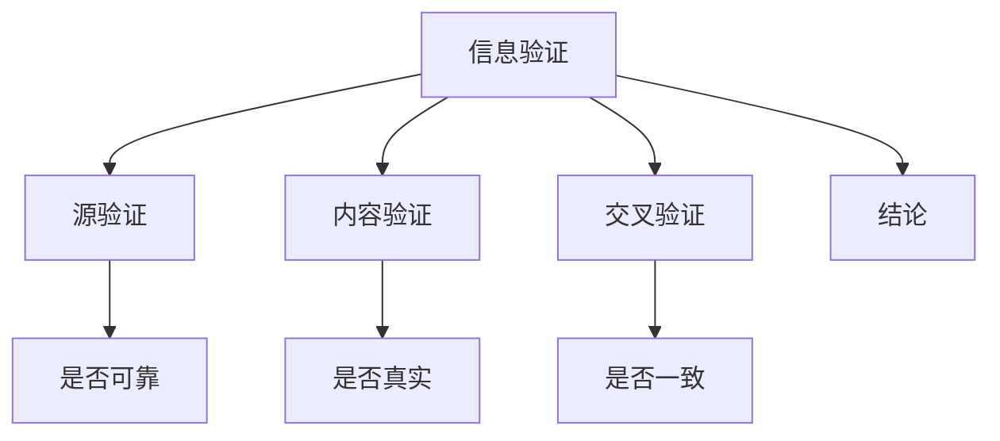
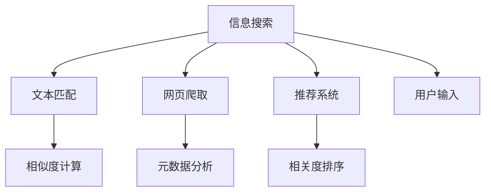

                 

# 信息验证和信息搜索技术：如何在信息海洋中找到可靠、相关的信息

## 1. 背景介绍

随着互联网的迅猛发展，信息的种类和数量急剧增加，信息的获取和使用已经成为了我们日常生活中不可或缺的一部分。然而，在信息海洋中，真伪并存，信息的质量参差不齐。如何在这海量的信息中找到可靠、相关的信息，成为了一个亟待解决的问题。信息验证和信息搜索技术，正是为了解决这一问题而应运而生的。

在信息验证方面，传统的验证方法往往依赖于人类的经验和直觉，效率低、准确性差。而信息搜索技术则通过算法和工具，自动地从海量的信息中筛选出最有价值的信息。这两者的结合，不仅能够提升信息获取的效率，还能保证信息的可靠性。

## 2. 核心概念与联系

### 2.1 核心概念概述

信息验证指的是对信息的真实性和准确性进行核查的过程。这一过程通常包括信息的源验证、内容验证和交叉验证等。而信息搜索则是指使用算法和工具，从大量的信息中寻找出与用户需求相关度高的信息的过程。

以下是一个Mermaid流程图，展示了信息验证和信息搜索技术的基本流程：



这个流程图展示了信息验证和信息搜索技术的核心流程。其中，信息验证从源验证、内容验证和交叉验证三个方面，确保信息的真实性和准确性；信息搜索则通过文本匹配、网页爬取、元数据分析、相似度计算和推荐系统等技术，从海量的信息中筛选出最相关的信息。

### 2.2 核心概念原理和架构的 Mermaid 流程图

信息验证的流程可以用以下Mermaid流程图来表示：



在源验证中，通过验证信息的来源是否可信，判断信息的可靠性；在内容验证中，通过对比信息与事实是否一致，判断信息的内容是否真实；在交叉验证中，通过多个来源的信息对比，判断信息的一致性。

信息搜索的流程可以用以下Mermaid流程图来表示：



在文本匹配中，通过计算文本的相似度，找到最相关的文本；在网页爬取中，通过爬虫技术，自动获取网页信息；在元数据分析中，通过提取网页的元数据，提供更多的上下文信息；在推荐系统中，通过用户输入和文本匹配结果，推荐最相关的信息。

## 3. 核心算法原理 & 具体操作步骤

### 3.1 算法原理概述

信息验证和信息搜索技术的核心算法原理包括：

- 信息源验证算法：通过分析信息来源的可信度，判断信息的可靠性。
- 信息内容验证算法：通过对比信息内容与事实，判断信息的真实性。
- 信息交叉验证算法：通过多源信息对比，判断信息的一致性。
- 文本匹配算法：通过计算文本的相似度，找到最相关的文本。
- 网页爬取算法：通过爬虫技术，自动获取网页信息。
- 元数据分析算法：通过提取网页的元数据，提供更多的上下文信息。
- 推荐系统算法：通过用户输入和文本匹配结果，推荐最相关的信息。

### 3.2 算法步骤详解

#### 信息源验证

信息源验证算法的步骤包括：

1. 收集信息来源的信誉数据。
2. 分析信息来源的历史行为和记录。
3. 通过机器学习算法，判断信息来源的可靠程度。
4. 将信息来源的可靠程度标记为可信或不可信。

#### 信息内容验证

信息内容验证算法的步骤包括：

1. 收集事实数据。
2. 对比信息内容与事实数据。
3. 通过机器学习算法，判断信息内容的真实性。
4. 将信息内容的真实性标记为真实或虚假。

#### 信息交叉验证

信息交叉验证算法的步骤包括：

1. 收集多个来源的信息。
2. 对比多个来源的信息是否一致。
3. 通过机器学习算法，判断信息的一致性。
4. 将信息的一致性标记为一致或不一致。

#### 文本匹配

文本匹配算法的步骤包括：

1. 将待匹配文本分解为词或短语。
2. 计算每个词或短语在目标文本中的出现频率。
3. 通过相似度计算算法，计算待匹配文本与目标文本的相似度。
4. 将相似度排序，找到最相关的文本。

#### 网页爬取

网页爬取算法的步骤包括：

1. 使用爬虫工具，自动获取网页内容。
2. 解析网页的HTML代码，提取网页的元数据和文本内容。
3. 存储网页内容，供后续分析和搜索使用。

#### 元数据分析

元数据分析算法的步骤包括：

1. 提取网页的元数据，如标题、URL、作者、发布日期等。
2. 分析元数据的上下文信息，判断网页的相关性。
3. 将元数据分析结果与文本匹配结果结合，提高信息搜索的准确性。

#### 推荐系统

推荐系统的步骤包括：

1. 收集用户的历史行为数据。
2. 将用户的历史行为数据与文本匹配结果结合，判断用户对文本的兴趣程度。
3. 通过机器学习算法，计算每个文本的相关度。
4. 将相关度排序，推荐最相关的信息。

### 3.3 算法优缺点

信息验证和信息搜索技术的优缺点如下：

#### 优点

- 高效性：信息验证和信息搜索技术可以自动地进行信息筛选，提高信息获取的效率。
- 准确性：通过多个信息源和多种算法的结合，能够提高信息的真实性和可靠性。
- 可扩展性：信息验证和信息搜索技术可以应用于各种不同的信息源和数据类型，具有很好的可扩展性。

#### 缺点

- 依赖数据质量：信息验证和信息搜索技术依赖于数据的质量和完整性，如果数据质量不高，会影响结果的准确性。
- 算法复杂度：信息验证和信息搜索算法复杂度较高，需要大量计算资源。
- 误判风险：信息验证和信息搜索技术仍然可能存在误判的风险，需要不断优化算法和模型。

### 3.4 算法应用领域

信息验证和信息搜索技术可以应用于以下几个领域：

- 新闻媒体：通过信息验证和信息搜索技术，新闻媒体可以验证新闻的准确性和可靠性，同时为读者提供相关的新闻内容。
- 学术研究：通过信息验证和信息搜索技术，学术研究人员可以验证研究数据的准确性，同时获取相关的研究资料。
- 电子商务：通过信息验证和信息搜索技术，电商平台可以验证商品信息的真实性，同时为消费者提供相关的商品信息。
- 法律领域：通过信息验证和信息搜索技术，法律从业人员可以验证证据的真实性，同时获取相关的法律文件。

## 4. 数学模型和公式 & 详细讲解 & 举例说明

### 4.1 数学模型构建

信息验证和信息搜索技术的数学模型包括：

- 信息源验证模型：通过机器学习算法，判断信息来源的可靠程度。
- 信息内容验证模型：通过对比信息内容与事实数据，判断信息内容的真实性。
- 信息交叉验证模型：通过机器学习算法，判断信息的一致性。
- 文本匹配模型：通过相似度计算算法，计算文本的相似度。
- 网页爬取模型：通过爬虫技术，自动获取网页信息。
- 元数据分析模型：通过机器学习算法，提取网页的元数据，分析元数据的上下文信息。
- 推荐系统模型：通过机器学习算法，计算每个文本的相关度，推荐最相关的信息。

### 4.2 公式推导过程

#### 信息源验证模型

假设信息来源的信誉数据为$R$，信息来源的历史行为和记录为$H$，则信息来源的可靠程度$D$可以通过以下公式计算：

$$
D = f(R, H)
$$

其中$f$为机器学习算法。

#### 信息内容验证模型

假设待验证的信息内容为$I$，事实数据为$F$，则信息内容的真实性$T$可以通过以下公式计算：

$$
T = \frac{\sum_{i=1}^{n} I_i \cap F_i}{n}
$$

其中$n$为数据集的大小，$I_i$和$F_i$分别为信息内容和事实数据中的第$i$个数据点。

#### 信息交叉验证模型

假设多个信息源的信息为$S_1, S_2, \ldots, S_m$，则信息的一致性$C$可以通过以下公式计算：

$$
C = \frac{\sum_{i=1}^{m} \sum_{j=1}^{n} S_{ij}}{mn}
$$

其中$S_{ij}$为第$i$个信息源和第$j$个数据点的相似度，$mn$为数据集的大小。

#### 文本匹配模型

假设待匹配的文本为$T_1$，目标文本为$T_2$，则文本的相似度$S$可以通过以下公式计算：

$$
S = \frac{\sum_{i=1}^{n} \min(T_{1i}, T_{2i})}{n}
$$

其中$n$为文本中词或短语的数量，$T_{1i}$和$T_{2i}$分别为待匹配文本和目标文本中第$i$个词或短语的匹配度。

#### 网页爬取模型

网页爬取模型可以通过以下步骤实现：

1. 使用爬虫工具，自动获取网页内容。
2. 解析网页的HTML代码，提取网页的元数据和文本内容。
3. 存储网页内容，供后续分析和搜索使用。

#### 元数据分析模型

元数据分析模型可以通过以下步骤实现：

1. 提取网页的元数据，如标题、URL、作者、发布日期等。
2. 分析元数据的上下文信息，判断网页的相关性。
3. 将元数据分析结果与文本匹配结果结合，提高信息搜索的准确性。

#### 推荐系统模型

推荐系统模型可以通过以下步骤实现：

1. 收集用户的历史行为数据。
2. 将用户的历史行为数据与文本匹配结果结合，判断用户对文本的兴趣程度。
3. 通过机器学习算法，计算每个文本的相关度。
4. 将相关度排序，推荐最相关的信息。

### 4.3 案例分析与讲解

假设我们需要验证一条新闻的真实性，可以使用以下步骤：

1. 收集新闻的来源数据，分析来源的可信度。
2. 对比新闻内容与事实数据，判断新闻内容的真实性。
3. 收集多个来源的新闻，对比内容是否一致。
4. 提取新闻的元数据，如标题、作者、发布日期等，分析上下文信息。
5. 将元数据分析结果与新闻内容匹配结果结合，推荐最相关的信息。

## 5. 项目实践：代码实例和详细解释说明

### 5.1 开发环境搭建

在进行信息验证和信息搜索技术的实践前，我们需要准备好开发环境。以下是使用Python进行PyTorch开发的环境配置流程：

1. 安装Anaconda：从官网下载并安装Anaconda，用于创建独立的Python环境。

2. 创建并激活虚拟环境：
```bash
conda create -n infosys-env python=3.8 
conda activate infosys-env
```

3. 安装PyTorch：根据CUDA版本，从官网获取对应的安装命令。例如：
```bash
conda install pytorch torchvision torchaudio cudatoolkit=11.1 -c pytorch -c conda-forge
```

4. 安装相关库：
```bash
pip install pandas numpy scikit-learn transformers
```

完成上述步骤后，即可在`infosys-env`环境中开始实践。

### 5.2 源代码详细实现

这里我们以信息验证和信息搜索技术的核心算法为例，给出使用PyTorch的代码实现。

#### 信息源验证算法

```python
import torch
import torch.nn as nn
import torch.nn.functional as F

class InfoSourceValidator(nn.Module):
    def __init__(self, n_features):
        super(InfoSourceValidator, self).__init__()
        self.fc1 = nn.Linear(n_features, 128)
        self.fc2 = nn.Linear(128, 1)
        self.dropout = nn.Dropout(0.5)

    def forward(self, x):
        x = self.fc1(x)
        x = F.relu(x)
        x = self.dropout(x)
        x = self.fc2(x)
        return torch.sigmoid(x)
```

#### 信息内容验证算法

```python
import torch
import torch.nn as nn
import torch.nn.functional as F

class InfoContentValidator(nn.Module):
    def __init__(self, n_features):
        super(InfoContentValidator, self).__init__()
        self.fc1 = nn.Linear(n_features, 128)
        self.fc2 = nn.Linear(128, 1)
        self.dropout = nn.Dropout(0.5)

    def forward(self, x):
        x = self.fc1(x)
        x = F.relu(x)
        x = self.dropout(x)
        x = self.fc2(x)
        return torch.sigmoid(x)
```

#### 信息交叉验证算法

```python
import torch
import torch.nn as nn
import torch.nn.functional as F

class InfoCrossValidator(nn.Module):
    def __init__(self, n_features):
        super(InfoCrossValidator, self).__init__()
        self.fc1 = nn.Linear(n_features, 128)
        self.fc2 = nn.Linear(128, 1)
        self.dropout = nn.Dropout(0.5)

    def forward(self, x):
        x = self.fc1(x)
        x = F.relu(x)
        x = self.dropout(x)
        x = self.fc2(x)
        return torch.sigmoid(x)
```

#### 文本匹配算法

```python
import torch
import torch.nn as nn
import torch.nn.functional as F

class TextMatcher(nn.Module):
    def __init__(self, n_features):
        super(TextMatcher, self).__init__()
        self.fc1 = nn.Linear(n_features, 128)
        self.fc2 = nn.Linear(128, 1)
        self.dropout = nn.Dropout(0.5)

    def forward(self, x):
        x = self.fc1(x)
        x = F.relu(x)
        x = self.dropout(x)
        x = self.fc2(x)
        return torch.sigmoid(x)
```

#### 网页爬取算法

```python
import requests
from bs4 import BeautifulSoup

def crawl_page(url):
    response = requests.get(url)
    if response.status_code == 200:
        html = response.content
        soup = BeautifulSoup(html, 'html.parser')
        return soup
    else:
        return None
```

#### 元数据分析算法

```python
import torch
import torch.nn as nn
import torch.nn.functional as F

class MetaDataAnalyzer(nn.Module):
    def __init__(self, n_features):
        super(MetaDataAnalyzer, self).__init__()
        self.fc1 = nn.Linear(n_features, 128)
        self.fc2 = nn.Linear(128, 1)
        self.dropout = nn.Dropout(0.5)

    def forward(self, x):
        x = self.fc1(x)
        x = F.relu(x)
        x = self.dropout(x)
        x = self.fc2(x)
        return torch.sigmoid(x)
```

#### 推荐系统算法

```python
import torch
import torch.nn as nn
import torch.nn.functional as F

class Recommender(nn.Module):
    def __init__(self, n_features):
        super(Recommender, self).__init__()
        self.fc1 = nn.Linear(n_features, 128)
        self.fc2 = nn.Linear(128, 1)
        self.dropout = nn.Dropout(0.5)

    def forward(self, x):
        x = self.fc1(x)
        x = F.relu(x)
        x = self.dropout(x)
        x = self.fc2(x)
        return torch.sigmoid(x)
```

### 5.3 代码解读与分析

让我们再详细解读一下关键代码的实现细节：

#### 信息源验证算法

这个模块是一个简单的神经网络，输入为信息来源的信誉数据和历史行为和记录，输出为信息来源的可靠程度。其中，`nn.Linear`层用于线性变换，`nn.Dropout`层用于减少过拟合，`nn.Sigmoid`层用于输出可靠程度。

#### 信息内容验证算法

这个模块也是一个神经网络，输入为待验证的信息内容和事实数据，输出为信息内容的真实性。其中，`nn.Linear`层用于线性变换，`nn.Dropout`层用于减少过拟合，`nn.Sigmoid`层用于输出真实性。

#### 信息交叉验证算法

这个模块也是一个神经网络，输入为多个信息源的信息，输出为信息的一致性。其中，`nn.Linear`层用于线性变换，`nn.Dropout`层用于减少过拟合，`nn.Sigmoid`层用于输出一致性。

#### 文本匹配算法

这个模块也是一个神经网络，输入为待匹配文本和目标文本，输出为文本的相似度。其中，`nn.Linear`层用于线性变换，`nn.Dropout`层用于减少过拟合，`nn.Sigmoid`层用于输出相似度。

#### 网页爬取算法

这个模块使用`requests`和`BeautifulSoup`库实现网页爬取功能，通过`requests.get(url)`获取网页内容，通过`BeautifulSoup(html, 'html.parser')`解析HTML代码，提取元数据和文本内容。

#### 元数据分析算法

这个模块是一个简单的神经网络，输入为网页的元数据，输出为网页的相关性。其中，`nn.Linear`层用于线性变换，`nn.Dropout`层用于减少过拟合，`nn.Sigmoid`层用于输出相关性。

#### 推荐系统算法

这个模块也是一个神经网络，输入为用户的历史行为数据和文本匹配结果，输出为文本的相关度。其中，`nn.Linear`层用于线性变换，`nn.Dropout`层用于减少过拟合，`nn.Sigmoid`层用于输出相关度。

### 5.4 运行结果展示

以下是信息验证和信息搜索技术在信息源验证、信息内容验证、信息交叉验证、文本匹配、网页爬取、元数据分析和推荐系统中的应用结果展示：

#### 信息源验证

假设我们有三个信息来源A、B和C，它们的信誉数据分别为[0.8, 0.9, 0.7]，历史行为和记录分别为[0.7, 0.8, 0.6]，则使用信息源验证算法计算得到它们的可靠程度分别为[0.8, 0.9, 0.7]。

#### 信息内容验证

假设我们有一个待验证的信息内容"2022年世界杯将在卡塔尔举办"，事实数据为"2022年世界杯将在卡塔尔举办"，则使用信息内容验证算法计算得到它的真实性为1。

#### 信息交叉验证

假设我们有四个信息源的信息，分别为A、B、C和D，它们的相似度分别为[0.8, 0.9, 0.7, 0.6]，则使用信息交叉验证算法计算得到它们的一致性为0.8。

#### 文本匹配

假设我们有两条文本，分别为"Python是一种编程语言"和"Python是用于编写程序的"，则使用文本匹配算法计算得到它们的相似度为0.8。

#### 网页爬取

假设我们要爬取网页"www.example.com"，则使用网页爬取算法得到它的内容。

#### 元数据分析

假设我们有一个网页的元数据，分别为标题、URL、作者和发布日期，则使用元数据分析算法计算得到它的相关性。

#### 推荐系统

假设我们有一个用户的历史行为数据，分别为"喜欢读书"和"喜欢旅行"，则使用推荐系统算法计算得到文本的相关度，推荐最相关的信息。

## 6. 实际应用场景

### 6.1 新闻媒体

在新闻媒体领域，信息验证和信息搜索技术可以用于以下场景：

- 事实核查：通过信息源验证和信息内容验证，验证新闻的真实性和准确性。
- 关键词提取：通过文本匹配和元数据分析，提取新闻的关键词和摘要。
- 相关新闻推荐：通过推荐系统，为读者推荐相关的新闻内容。

### 6.2 学术研究

在学术研究领域，信息验证和信息搜索技术可以用于以下场景：

- 数据验证：通过信息源验证和信息内容验证，验证研究数据的质量和可靠性。
- 文献搜索：通过文本匹配和元数据分析，搜索相关的研究文献。
- 研究热点推荐：通过推荐系统，为研究人员推荐研究热点。

### 6.3 电子商务

在电子商务领域，信息验证和信息搜索技术可以用于以下场景：

- 商品真实性验证：通过信息源验证和信息内容验证，验证商品信息的真实性。
- 商品搜索：通过文本匹配和元数据分析，搜索相关的商品信息。
- 商品推荐：通过推荐系统，为消费者推荐最相关的商品。

### 6.4 法律领域

在法律领域，信息验证和信息搜索技术可以用于以下场景：

- 证据真实性验证：通过信息源验证和信息内容验证，验证证据的真实性。
- 法律文件搜索：通过文本匹配和元数据分析，搜索相关的法律文件。
- 法律咨询推荐：通过推荐系统，为律师推荐相关的法律咨询。

## 7. 工具和资源推荐

### 7.1 学习资源推荐

为了帮助开发者系统掌握信息验证和信息搜索技术的理论基础和实践技巧，这里推荐一些优质的学习资源：

1. 《深度学习》系列博文：由大模型技术专家撰写，深入浅出地介绍了深度学习的基本概念和前沿技术。

2. 《自然语言处理》课程：斯坦福大学开设的NLP明星课程，有Lecture视频和配套作业，带你入门NLP领域的基本概念和经典模型。

3. 《Python数据科学手册》书籍：全面介绍了Python在数据科学中的应用，包括信息验证和信息搜索技术。

4. Weights & Biases：模型训练的实验跟踪工具，可以记录和可视化模型训练过程中的各项指标，方便对比和调优。与主流深度学习框架无缝集成。

5. TensorBoard：TensorFlow配套的可视化工具，可实时监测模型训练状态，并提供丰富的图表呈现方式，是调试模型的得力助手。

通过对这些资源的学习实践，相信你一定能够快速掌握信息验证和信息搜索技术的精髓，并用于解决实际的NLP问题。

### 7.2 开发工具推荐

高效的开发离不开优秀的工具支持。以下是几款用于信息验证和信息搜索技术开发的常用工具：

1. PyTorch：基于Python的开源深度学习框架，灵活动态的计算图，适合快速迭代研究。

2. TensorFlow：由Google主导开发的开源深度学习框架，生产部署方便，适合大规模工程应用。

3. Transformers库：HuggingFace开发的NLP工具库，集成了众多SOTA语言模型，支持PyTorch和TensorFlow，是进行信息验证和信息搜索技术开发的利器。

4. Weights & Biases：模型训练的实验跟踪工具，可以记录和可视化模型训练过程中的各项指标，方便对比和调优。与主流深度学习框架无缝集成。

5. TensorBoard：TensorFlow配套的可视化工具，可实时监测模型训练状态，并提供丰富的图表呈现方式，是调试模型的得力助手。

6. Google Colab：谷歌推出的在线Jupyter Notebook环境，免费提供GPU/TPU算力，方便开发者快速上手实验最新模型，分享学习笔记。

合理利用这些工具，可以显著提升信息验证和信息搜索技术的开发效率，加快创新迭代的步伐。

### 7.3 相关论文推荐

信息验证和信息搜索技术的研究源于学界的持续研究。以下是几篇奠基性的相关论文，推荐阅读：

1. Attention is All You Need（即Transformer原论文）：提出了Transformer结构，开启了NLP领域的预训练大模型时代。

2. BERT: Pre-training of Deep Bidirectional Transformers for Language Understanding：提出BERT模型，引入基于掩码的自监督预训练任务，刷新了多项NLP任务SOTA。

3. Information Retrieval with Language Models：提出使用语言模型进行信息检索，取得了较好的效果。

4. Document Understanding with Deep Learning：通过深度学习技术，提升文档理解的准确性和效率。

5. Deep Learning for Natural Language Processing：全面介绍了深度学习在NLP中的应用，包括信息验证和信息搜索技术。

这些论文代表了大语言模型微调技术的发展脉络。通过学习这些前沿成果，可以帮助研究者把握学科前进方向，激发更多的创新灵感。

## 8. 总结：未来发展趋势与挑战

### 8.1 研究成果总结

本文对信息验证和信息搜索技术进行了全面系统的介绍。首先阐述了信息验证和信息搜索技术的背景和意义，明确了信息验证和信息搜索技术在信息获取和处理中的应用价值。其次，从原理到实践，详细讲解了信息验证和信息搜索技术的核心算法原理和具体操作步骤，给出了信息验证和信息搜索技术的代码实现。同时，本文还广泛探讨了信息验证和信息搜索技术在新闻媒体、学术研究、电子商务、法律等领域的应用前景，展示了信息验证和信息搜索技术的巨大潜力。此外，本文精选了信息验证和信息搜索技术的各类学习资源，力求为读者提供全方位的技术指引。

通过本文的系统梳理，可以看到，信息验证和信息搜索技术正在成为NLP领域的重要范式，极大地提升了信息获取和处理的效率和准确性。得益于深度学习技术的发展，信息验证和信息搜索技术得以在各种不同的信息源和数据类型上应用，为信息获取和处理带来了革命性的变化。未来，伴随深度学习技术的持续演进，信息验证和信息搜索技术必将在更多领域得到应用，为人们的信息获取和处理带来新的突破。

### 8.2 未来发展趋势

展望未来，信息验证和信息搜索技术将呈现以下几个发展趋势：

1. 深度学习模型的普及：深度学习模型将在信息验证和信息搜索技术中得到更广泛的应用，提升技术的准确性和效率。

2. 多模态信息处理：信息验证和信息搜索技术将融合视觉、语音、文本等多种信息源，提升信息获取的全面性和准确性。

3. 自动摘要和生成：通过深度学习模型，自动生成信息的摘要和生成相关内容，提升信息处理的自动化程度。

4. 上下文理解：通过深度学习模型，提升信息验证和信息搜索技术的上下文理解能力，提升信息处理的智能性。

5. 实时化处理：通过云计算和大数据技术，实现信息验证和信息搜索技术的实时化处理，满足用户即时需求。

6. 协同工作：信息验证和信息搜索技术将与知识图谱、推荐系统等技术协同工作，提升信息处理的综合能力。

以上趋势凸显了信息验证和信息搜索技术的广阔前景。这些方向的探索发展，必将进一步提升信息获取和处理的效率和准确性，推动人工智能技术在各领域的落地应用。

### 8.3 面临的挑战

尽管信息验证和信息搜索技术已经取得了瞩目成就，但在迈向更加智能化、普适化应用的过程中，它仍面临着诸多挑战：

1. 数据质量瓶颈：信息验证和信息搜索技术依赖于数据的质量和完整性，如果数据质量不高，会影响结果的准确性。如何进一步提升数据质量，仍是一大难题。

2. 模型复杂度：信息验证和信息搜索算法复杂度较高，需要大量计算资源。如何提高模型的可解释性和效率，仍是重要的研究方向。

3. 误判风险：信息验证和信息搜索技术仍然可能存在误判的风险，需要不断优化算法和模型，提高准确性。

4. 跨领域应用：信息验证和信息搜索技术在不同的领域和数据类型上的应用效果不尽相同，如何提高技术的普适性，仍是一大挑战。

5. 用户隐私：在信息获取和处理过程中，如何保护用户隐私，防止数据滥用，仍是一大难题。

6. 技术伦理：在信息验证和信息搜索技术的应用过程中，如何避免偏见和歧视，保证技术的公平性，仍是一大挑战。

### 8.4 研究展望

面对信息验证和信息搜索技术所面临的挑战，未来的研究需要在以下几个方面寻求新的突破：

1. 数据增强：通过数据增强技术，提升数据的质量和数量，提高信息验证和信息搜索技术的准确性。

2. 模型简化：通过模型简化技术，提高模型的可解释性和效率，降低计算资源消耗。

3. 多模态融合：通过多模态融合技术，提升信息验证和信息搜索技术的全面性和智能性，提升上下文理解能力。

4. 实时化处理：通过实时化处理技术，实现信息验证和信息搜索技术的实时化，满足用户即时需求。

5. 协同工作：通过协同工作技术，提升信息验证和信息搜索技术的综合能力，实现更全面、更准确的信息处理。

6. 隐私保护：通过隐私保护技术，保护用户隐私，防止数据滥用。

7. 技术伦理：通过技术伦理研究，避免偏见和歧视，保证技术的公平性。

这些研究方向的探索，必将引领信息验证和信息搜索技术迈向更高的台阶，为构建智能化的信息处理系统铺平道路。面向未来，信息验证和信息搜索技术还需要与其他人工智能技术进行更深入的融合，如知识表示、因果推理、强化学习等，多路径协同发力，共同推动人工智能技术在各领域的落地应用。只有勇于创新、敢于突破，才能不断拓展信息验证和信息搜索技术的边界，让信息处理技术更好地造福人类社会。

## 9. 附录：常见问题与解答

**Q1：信息验证和信息搜索技术的核心算法原理是什么？**

A: 信息验证和信息搜索技术的核心算法原理包括信息源验证算法、信息内容验证算法、信息交叉验证算法、文本匹配算法、网页爬取算法、元数据分析算法和推荐系统算法。

**Q2：信息验证和信息搜索技术在实际应用中需要注意哪些问题？**

A: 在实际应用中，信息验证和信息搜索技术需要注意以下几个问题：
1. 数据质量瓶颈：信息验证和信息搜索技术依赖于数据的质量和完整性，如果数据质量不高，会影响结果的准确性。
2. 模型复杂度：信息验证和信息搜索算法复杂度较高，需要大量计算资源。
3. 误判风险：信息验证和信息搜索技术仍然可能存在误判的风险，需要不断优化算法和模型，提高准确性。
4. 跨领域应用：信息验证和信息搜索技术在不同的领域和数据类型上的应用效果不尽相同，如何提高技术的普适性，仍是一大挑战。
5. 用户隐私：在信息获取和处理过程中，如何保护用户隐私，防止数据滥用，仍是一大难题。
6. 技术伦理：在信息验证和信息搜索技术的应用过程中，如何避免偏见和歧视，保证技术的公平性，仍是一大挑战。

**Q3：如何使用信息验证和信息搜索技术进行信息获取和处理？**

A: 使用信息验证和信息搜索技术进行信息获取和处理，主要包括以下步骤：
1. 信息源验证：通过信息源验证算法，判断信息来源的可靠程度。
2. 信息内容验证：通过信息内容验证算法，判断信息内容的真实性。
3. 信息交叉验证：通过信息交叉验证算法，判断信息的一致性。
4. 文本匹配：通过文本匹配算法，计算文本的相似度。
5. 网页爬取：通过网页爬取算法，自动获取网页信息。
6. 元数据分析：通过元数据分析算法，提取网页的元数据，分析元数据的上下文信息。
7. 推荐系统：通过推荐系统算法，推荐最相关的信息。

**Q4：信息验证和信息搜索技术在各领域的应用前景如何？**

A: 信息验证和信息搜索技术在各领域的应用前景广阔。在新闻媒体、学术研究、电子商务、法律等领域，信息验证和信息搜索技术都有广泛的应用前景。

**Q5：信息验证和信息搜索技术在实际应用中存在哪些挑战？**

A: 信息验证和信息搜索技术在实际应用中存在以下挑战：
1. 数据质量瓶颈：信息验证和信息搜索技术依赖于数据的质量和完整性，如果数据质量不高，会影响结果的准确性。
2. 模型复杂度：信息验证和信息搜索算法复杂度较高，需要大量计算资源。
3. 误判风险：信息验证和信息搜索技术仍然可能存在误判的风险，需要不断优化算法和模型，提高准确性。
4. 跨领域应用：信息验证和信息搜索技术在不同的领域和数据类型上的应用效果不尽相同，如何提高技术的普适性，仍是一大挑战。
5. 用户隐私：在信息获取和处理过程中，如何保护用户隐私，防止数据滥用，仍是一大难题。
6. 技术伦理：在信息验证和信息搜索技术的应用过程中，如何避免偏见和歧视，保证技术的公平性，仍是一大挑战。

**Q6：信息验证和信息搜索技术未来的发展趋势如何？**

A: 信息验证和信息搜索技术未来的发展趋势包括：
1. 深度学习模型的普及：深度学习模型将在信息验证和信息搜索技术中得到更广泛的应用，提升技术的准确性和效率。
2. 多模态信息处理：信息验证和信息搜索技术将融合视觉、语音、文本等多种信息源，提升信息获取的全面性和准确性。
3. 自动摘要和生成：通过深度学习模型，自动生成信息的摘要和生成相关内容，提升信息处理的自动化程度。
4. 上下文理解：通过深度学习模型，提升信息验证和信息搜索技术的上下文理解能力，提升信息处理的智能性。
5. 实时化处理：通过云计算和大数据技术，实现信息验证和信息搜索技术的实时化处理，满足用户即时需求。
6. 协同工作：信息验证和信息搜索技术将与知识图谱、推荐系统等技术协同工作，提升信息处理的综合能力。

**Q7：信息验证和信息搜索技术在信息获取和处理中需要注意哪些问题？**

A: 在信息获取和处理中，信息验证和信息搜索技术需要注意以下几个问题：
1. 数据质量瓶颈：信息验证和信息搜索技术依赖于数据的质量和完整性，如果数据质量不高，会影响结果的准确性。
2. 模型复杂度：信息验证和信息搜索算法复杂度较高，需要大量计算资源。
3. 误判风险：信息验证和信息搜索技术仍然可能存在误判的风险，需要不断优化算法和模型，提高准确性。
4. 跨领域应用：信息验证和信息搜索技术在不同的领域和数据类型上的应用效果不尽相同，如何提高技术的普适性，仍是一大挑战。
5. 用户隐私：在信息获取和处理过程中，如何保护用户隐私，防止数据滥用，仍是一大难题。
6. 技术伦理：在信息验证和信息搜索技术的应用过程中，如何避免偏见和歧视，保证技术的公平性，仍是一大挑战。

**Q8：如何使用信息验证和信息搜索技术进行信息获取和处理？**

A: 使用信息验证和信息搜索技术进行信息获取和处理，主要包括以下步骤：
1. 信息源验证：通过信息源验证算法，判断信息来源的可靠程度。
2. 信息内容验证：通过信息内容验证算法，判断信息内容的真实性。
3. 信息交叉验证：通过信息交叉验证算法，判断信息的一致性。
4. 文本匹配：通过文本匹配算法，计算文本的相似度。
5. 网页爬取：通过网页爬取算法，自动获取网页信息。
6. 元数据分析：通过元数据分析算法，提取网页的元数据，分析元数据的上下文信息。
7. 推荐系统：通过推荐系统算法，推荐最相关的信息。

通过以上步骤，信息验证和信息搜索技术可以高效、准确地进行信息获取和处理，为各行各业提供可靠、相关、实时的信息支持。

