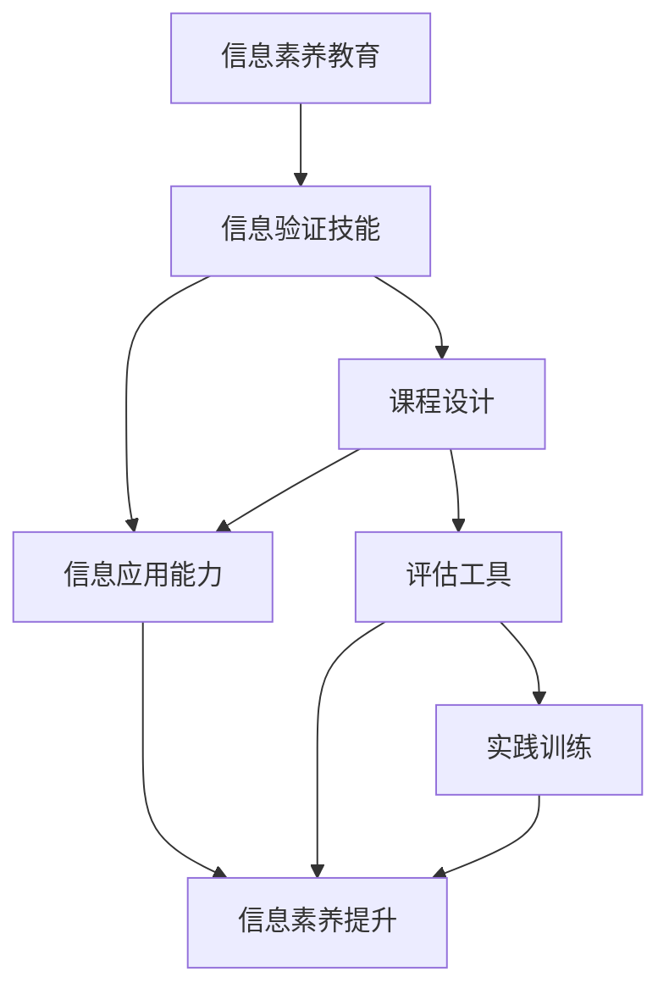

                 

# 信息验证和信息素养教育重要性：为数字时代培养信息素养能力

## 1. 背景介绍

在当今数字化和信息化的时代背景下，信息技术的迅猛发展极大地改变了人们获取、处理和利用信息的方式。信息的广泛性和多样性给社会带来了前所未有的便利，但同时也带来了新的挑战。信息时代，人们面临着海量的信息、复杂的信息环境和信息质量参差不齐的问题。如何在这一环境下培养人们的信息素养，提高信息验证能力，是数字时代信息素养教育面临的重要课题。

### 1.1 信息素养定义
信息素养通常被定义为一组能够有效评估、查找、获取、理解和应用信息的技能和能力。它不仅包括了传统的文献检索、批判性思维和逻辑分析等技能，还包含了对数字信息的判断、评估和管理能力。

### 1.2 信息素养的重要性
在现代社会中，信息素养的重要性体现在多个方面：
1. **学习与教育**：信息素养提升了学习效率，帮助学习者获取更准确、全面的知识。
2. **职业发展**：在知识更新迅速的职业生涯中，信息素养能够帮助从业者快速适应新情况，提升工作效率。
3. **信息消费**：信息素养能够帮助个人在面对海量的信息时，选择和评估最可信的信息来源。
4. **公共健康**：信息素养有助于识别和甄别不实信息，避免谣言和假新闻对公共健康的影响。
5. **社会治理**：信息素养提升了社会参与度，有助于构建更加透明和有效的社会治理体系。

## 2. 核心概念与联系

### 2.1 核心概念概述

在讨论信息素养教育的重要性之前，需要理解以下几个核心概念：

1. **信息验证**：信息验证是指通过一系列方法和工具，对信息的真实性、准确性和可靠性进行评估的过程。
2. **信息素养教育**：信息素养教育是系统地教授人们如何有效地获取、评估、管理和应用信息的教育过程。
3. **数字时代**：数字时代是指信息技术和互联网在社会各个领域广泛应用的时代，人们依赖数字化信息进行决策和沟通。
4. **信息素养能力**：信息素养能力包括识别、获取、评估和应用信息的能力，以及使用数字化工具的能力。

### 2.2 核心概念的联系

这些核心概念之间存在紧密的联系。信息验证是信息素养教育的核心技能之一，数字时代背景下，信息素养能力的发展离不开信息验证技能的培养。信息素养教育则通过系统训练，提高人们的信息验证能力，从而在数字时代中更好地应对信息洪流。

### 2.3 信息验证和信息素养教育的流程

为了更清楚地理解信息验证和信息素养教育的流程，以下是一个简单的Mermaid流程图：



这个流程图展示了信息素养教育的过程，从课程设计、信息验证技能训练到信息应用能力的提升，最终形成信息素养能力的全面提升。

## 3. 核心算法原理 & 具体操作步骤

### 3.1 算法原理概述

信息验证的算法原理基于对信息源的评估、信息的对比和验证。其主要过程包括：

1. **信息源评估**：评估信息来源的权威性、可信度和可靠性。
2. **信息对比验证**：通过与其他可信的信息源进行对比，验证信息的真实性和一致性。
3. **信息处理与判断**：结合各种信息和背景知识，对信息进行综合分析和判断。

### 3.2 算法步骤详解

信息验证的详细步骤如下：

1. **确定信息需求**：明确需要验证的信息内容和目标。
2. **选择信息源**：选择权威、可信的信息源。
3. **获取信息**：通过查询、阅读等方式获取所需信息。
4. **信息评估**：评估信息源的权威性、信息内容的一致性和真实性。
5. **信息对比验证**：通过与其他可信的信息源进行对比，验证信息的真实性和一致性。
6. **综合判断**：结合多种信息源和背景知识，综合分析信息，得出结论。

### 3.3 算法优缺点

信息验证算法的主要优点包括：
1. **提高信息质量**：通过系统地评估和对比，确保信息的质量和准确性。
2. **减少误导信息**：识别和剔除不实和有害信息，保护用户免受误导。
3. **提升决策质量**：基于可靠的信息做出更好的决策。

其缺点包括：
1. **耗时耗力**：信息验证过程需要投入大量时间和精力。
2. **依赖专业技能**：需要专业的信息素养和信息验证技能。
3. **技术门槛高**：部分信息验证技术可能要求较高的技术门槛。

### 3.4 算法应用领域

信息验证和信息素养教育在多个领域有广泛的应用，包括但不限于：

- **教育**：在学术研究和知识传播中，通过信息验证提升学术质量。
- **公共卫生**：验证健康信息，防止谣言和假新闻对公共卫生产生负面影响。
- **商业与经济**：确保商业信息准确性，帮助企业做出明智的商业决策。
- **新闻与媒体**：提升新闻和媒体报道的准确性和可靠性。
- **社交网络**：甄别网络上的信息真实性，减少假新闻和网络谣言的传播。

## 4. 数学模型和公式 & 详细讲解 & 举例说明

### 4.1 数学模型构建

信息验证的数学模型可以从多个角度建立，以下介绍一种基于统计学的模型：

设 $X$ 为信息源的特征向量，$Y$ 为信息的真实性评分，则信息验证模型可表示为：

$$
Y = f(X; \theta)
$$

其中 $f$ 为模型函数，$\theta$ 为模型参数。

### 4.2 公式推导过程

在上述模型中，$X$ 可能包含多个特征，如信息源的权威性、作者背景、出版时间等。通过训练模型，可以学习这些特征对信息真实性的影响，从而对新信息进行评估。

### 4.3 案例分析与讲解

以新闻文章的验证为例，假设有两个新闻源 $A$ 和 $B$，报道了同一事件。可以提取多个特征，如作者背景、发布日期、引用数据来源等。通过训练模型，可以学习这些特征对文章真实性的影响，并根据新文章的信息源特征进行评估。

## 5. 项目实践：代码实例和详细解释说明

### 5.1 开发环境搭建

在信息验证项目实践中，需要安装Python和相关库，包括：

1. Python：安装最新版本的Python，推荐使用Anaconda。
2. Pandas：用于数据处理。
3. NumPy：用于数学计算。
4. Scikit-learn：用于构建和训练模型。
5. NLTK：用于文本处理和分析。
6. NLTK的textcat模块：用于文本分类，辅助信息源评估。

### 5.2 源代码详细实现

以下是一个简单的Python代码示例，用于验证新闻文章的真实性：

```python
import pandas as pd
from sklearn.feature_extraction.text import TfidfVectorizer
from sklearn.linear_model import LogisticRegression

# 数据加载
data = pd.read_csv('news.csv')

# 特征提取
vectorizer = TfidfVectorizer()
X = vectorizer.fit_transform(data['text'])

# 模型训练
model = LogisticRegression()
model.fit(X, data['label'])

# 信息验证
new_news = ['这个消息是真的吗？']
X_new = vectorizer.transform(new_news)
prediction = model.predict_proba(X_new)
print(prediction)
```

### 5.3 代码解读与分析

这段代码首先加载了一个新闻数据集，然后通过TF-IDF特征提取，将新闻文本转换为向量。使用逻辑回归模型训练数据集，并在新的新闻文本上进行预测。

## 6. 实际应用场景

### 6.1 信息素养教育的必要性

在数字化时代，信息素养教育变得尤为重要。以下列出几个实际应用场景：

1. **学术研究**：学术研究中，研究人员需要通过信息验证确保引用文献的真实性和可靠性，避免误导性信息影响研究结果。
2. **新闻媒体**：新闻从业人员需要具备信息验证能力，确保报道的准确性和可靠性，防止假新闻的传播。
3. **商业决策**：企业在进行市场分析和决策时，需要验证相关信息的真实性，避免误导性信息的干扰。
4. **公共卫生**：在疫情和公共健康事件中，需要验证相关信息，防止谣言和假新闻的传播。
5. **政策制定**：政府在制定政策时需要验证相关信息的真实性，确保政策的科学性和准确性。

### 6.2 未来应用展望

未来，信息素养教育和信息验证技术将进一步融合，呈现出以下几个趋势：

1. **自动化信息验证**：随着人工智能技术的发展，自动化信息验证将变得更加高效和精准。
2. **智能信息推荐**：通过机器学习算法，推荐可信的信息源，辅助用户快速获取高质量信息。
3. **跨领域应用**：信息验证技术将扩展到更多领域，如法律、金融、医学等，提升各领域的信息质量。
4. **教育与培训**：信息素养教育将与在线教育、虚拟现实等技术结合，提供沉浸式学习体验。
5. **多模态信息验证**：结合文本、图像、视频等多种模态，进行综合信息验证，提升信息的全面性和准确性。

## 7. 工具和资源推荐

### 7.1 学习资源推荐

为了提升信息素养教育的效果，推荐以下学习资源：

1. **Coursera《信息素养教育》课程**：由美国加州大学伯克利分校开设，全面介绍信息素养教育的理论和方法。
2. **图书馆资源**：包括数据库、电子期刊、在线课程等，提供丰富的信息验证和学习资料。
3. **Google Scholar**：提供大量学术论文和文献资源，辅助学术研究和信息验证。
4. **Khan Academy**：提供免费在线课程，涵盖信息素养教育的各个方面。

### 7.2 开发工具推荐

为了支持信息验证项目，推荐以下开发工具：

1. **Python**：功能强大、灵活性高，是信息验证项目的首选语言。
2. **Jupyter Notebook**：便于编写、测试和分享代码，适合教育和研究用途。
3. **GitHub**：提供版本控制和协作功能，方便团队开发和项目管理。
4. **Google Colab**：提供免费的GPU和TPU资源，适合进行大规模的信息验证实验。

### 7.3 相关论文推荐

为了深入了解信息验证和信息素养教育的研究进展，推荐以下论文：

1. **信息验证模型的研究进展**：介绍信息验证技术的最新进展，包括统计模型、深度学习模型等。
2. **信息素养教育的评估与改进**：研究信息素养教育的效果评估和改进方法，提出新的教育模式和工具。
3. **自动化信息验证技术**：探讨自动化信息验证技术的应用和挑战，提出新的算法和技术方案。
4. **多模态信息验证**：研究结合文本、图像、视频等多种模态的信息验证方法，提升信息的全面性和准确性。

## 8. 总结：未来发展趋势与挑战

### 8.1 研究成果总结

信息验证和信息素养教育的研究已经取得了显著成果，主要体现在以下几个方面：

1. **信息验证技术的提升**：统计模型和深度学习模型在信息验证中的应用，提升了信息验证的准确性和效率。
2. **信息素养教育体系的构建**：建立了较为完善的信息素养教育体系，提升了公众的信息素养能力。
3. **跨领域应用**：信息素养教育和信息验证技术在多个领域得到了广泛应用，提高了各领域的决策和分析能力。

### 8.2 未来发展趋势

未来，信息验证和信息素养教育将呈现以下几个发展趋势：

1. **自动化和智能化**：随着人工智能技术的进步，自动化和智能化信息验证将变得更加普遍。
2. **跨模态和综合信息验证**：结合多种信息模态，进行综合信息验证，提升信息的全面性和准确性。
3. **教育与培训的融合**：信息素养教育将与在线教育、虚拟现实等技术结合，提供更加多样化和沉浸式的学习体验。
4. **全球化和本土化**：信息素养教育将在全球范围内推广，同时根据不同地区的文化和教育需求，进行本土化定制。

### 8.3 面临的挑战

尽管信息验证和信息素养教育已经取得了一定的进展，但仍面临以下挑战：

1. **数据质量和数量不足**：信息验证需要大量高质量的数据，而获取这些数据往往存在困难。
2. **技术门槛高**：部分信息验证技术需要较高的技术门槛，普通用户难以掌握。
3. **隐私和伦理问题**：信息验证和信息素养教育过程中，可能涉及用户隐私和伦理问题，需要引起重视。

### 8.4 研究展望

未来，信息验证和信息素养教育需要从以下几个方面进行深入研究：

1. **大数据与云计算**：利用大数据和云计算技术，提升信息验证的数据处理和计算能力。
2. **跨学科研究**：结合计算机科学、教育学、心理学等多学科知识，提升信息素养教育的科学性和有效性。
3. **国际合作**：加强国际合作，推动信息素养教育的全球化和标准化。
4. **技术伦理**：探讨信息验证技术在伦理、隐私和公平性方面的挑战，提出新的解决方案。

总之，信息验证和信息素养教育是数字时代的重要课题，其发展和进步将极大地提升公众的信息素养能力，推动社会的数字化转型和智能化发展。

## 9. 附录：常见问题与解答

### 常见问题与解答

**Q1: 什么是信息素养教育？**

A: 信息素养教育是一种旨在提升人们获取、评估、管理和应用信息能力的教育过程。包括传统的信息检索、批判性思维、逻辑分析等技能，以及数字信息判断、评估和管理能力。

**Q2: 信息验证对个人和组织有什么影响？**

A: 信息验证能够提高个人和组织的信息素养能力，减少误导性信息的传播，提升决策和分析的准确性，从而带来更好的工作和学习效果。

**Q3: 如何提高信息验证能力？**

A: 提高信息验证能力需要系统学习和实践，包括学习相关知识和技能，使用专业工具，培养批判性思维和逻辑分析能力，参与实际信息验证任务等。

**Q4: 信息验证和信息素养教育是否适用于所有人群？**

A: 信息验证和信息素养教育对于所有人群都是有益的，特别是那些在信息获取和处理中存在困难的人群。

**Q5: 信息素养教育在数字时代的重要性和必要性是什么？**

A: 信息素养教育在数字时代尤为重要，因为信息量的爆炸和信息质量的参差不齐使得人们需要具备更强的信息验证能力和信息管理能力，以更好地应对信息洪流。

---

作者：禅与计算机程序设计艺术 / Zen and the Art of Computer Programming

