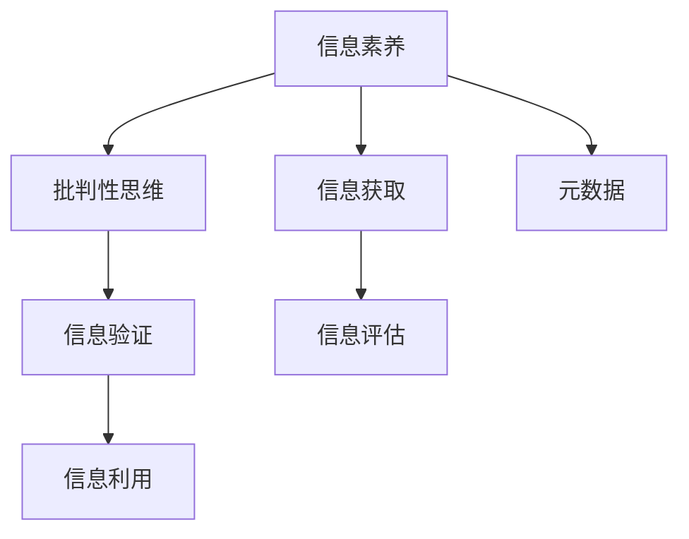
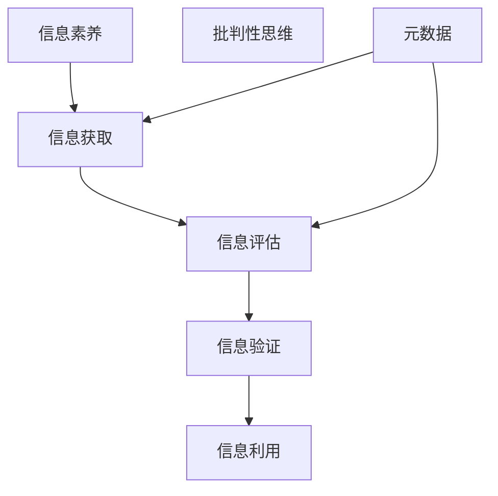

                 

# 信息验证和信息素养能力：为数字时代培养批判性思维者和信息素养者

## 1. 背景介绍

### 1.1 问题由来

在当今数字化快速发展的时代，信息洪流无所不在。无论是社交媒体、在线论坛、新闻网站还是科学论文，信息都以指数级的速度增长，人人都在主动或被动地消费和传播信息。但与此同时，误导性、虚假信息和错误认知也无处不在，对于信息识别和批判性分析能力提出了更高的要求。

在数字化转型的浪潮中，各行各业都面临从传统业务模式向数字业务模式转型的挑战，信息验证和信息素养能力成为决策者、从业者必备的关键能力。以医疗健康行业为例，医生和医护人员需要依赖大量的医学文献和数据信息来支持诊断和治疗决策，而错误或过时的信息可能导致误诊、误治等严重后果。

培养批判性思维者和信息素养者，通过系统性训练和教育，提升其在面对海量信息时的信息识别、判断和应对能力，有助于构建健康、安全、高效的信息消费环境。这一能力不仅限于学术研究或技术开发，更成为普通公民提升知识素养、维护社会稳定、促进社会进步的重要基础。

### 1.2 问题核心关键点

基于这一背景，本文将从信息验证和信息素养能力的基本概念、核心算法原理、具体操作步骤、实际应用场景等方面进行全面探讨。我们将深入分析当前信息验证和信息素养能力面临的挑战，并提出相应的策略和解决方案，以期对数字化时代的信息素养培养实践提供更全面的指导。

## 2. 核心概念与联系

### 2.1 核心概念概述

为更好地理解信息验证和信息素养能力的训练过程，本节将介绍几个关键核心概念及其联系：

- **信息素养（Information Literacy）**：指个体识别、评估和有效使用信息的能力，包括搜索、评估和应用信息的技能。信息素养强调信息获取、信息分析、信息利用和信息评估四个环节。

- **批判性思维（Critical Thinking）**：指个体在面对问题时，能够独立思考、分析并评估信息的来源、可靠性和有效性，从而做出合理、合法的判断和决策。

- **信息验证（Information Verification）**：指通过科学、系统的方法，验证信息的真实性、准确性和可信度。信息验证依赖于丰富的知识背景、系统性工具和科学方法。

- **元数据（Metadata）**：为描述和标识资源而提供的信息，包括资源的内容、来源、创建时间、作者、修改历史等，是信息验证的基础。

这些核心概念之间的联系可以通过以下Mermaid流程图来展示：



这个流程图展示了信息素养能力的各个环节及其相互联系：

1. **信息获取**：通过搜索和查找，获取所需信息。
2. **信息评估**：对信息来源、质量和时效进行评估，判断信息的可信度。
3. **信息验证**：通过系统方法验证信息的真实性，提升判断的准确性。
4. **信息利用**：将验证过的信息应用于决策或进一步分析。
5. **元数据**：提供关于信息的额外信息，有助于信息评估和验证。

### 2.2 核心概念原理和架构的 Mermaid 流程图



### 2.3 核心概念联系

- **信息素养和批判性思维**：信息素养是批判性思维的基础，通过培养信息素养能力，可以提升个体在面对海量信息时的判断能力和分析能力，从而做出更为理性和合理的决策。
- **信息验证和信息素养**：信息验证是信息素养能力的核心环节之一，通过系统性训练，提高个体在信息获取和应用环节中的判断力和验证力，确保信息来源的可靠性和准确性。
- **信息验证和批判性思维**：批判性思维是信息验证的重要目标，通过信息验证提升判断能力，使个体能够在面对复杂信息时，具备独立思考和科学判断的能力。
- **信息获取和信息评估**：信息获取是信息素养能力的前提，信息评估是信息验证的基础，两者共同构建了信息素养能力的核心链条。

## 3. 核心算法原理 & 具体操作步骤

### 3.1 算法原理概述

信息验证和信息素养能力训练的核心算法原理，主要围绕信息评估和信息验证两个方面展开：

- **信息评估算法**：通过元数据分析、来源评估、信息时效性判断等方法，对信息的可靠性和准确性进行评估。
- **信息验证算法**：结合统计学、计算科学等方法，对信息的真实性进行验证，包括内容一致性检查、数据真实性验证等。

这些算法共同构成了一个系统的信息素养培养框架，使个体能够在海量信息中高效、准确地获取、评估、验证和使用信息。

### 3.2 算法步骤详解

基于信息验证和信息素养能力的核心算法原理，一般的信息素养培养操作步骤如下：

**Step 1: 信息获取**

1. **信息搜索**：利用搜索引擎、学术数据库、图书馆资源等工具，获取相关信息。
2. **信息筛选**：根据关键词、主题、时效性等标准筛选相关信息，缩小信息范围。

**Step 2: 信息评估**

1. **元数据分析**：对资源的元数据进行分析，如作者、出版日期、引用次数等，判断信息来源的可靠性和权威性。
2. **来源评估**：评估信息来源的可靠性和可信度，如权威机构的报告、专家学者的研究等。
3. **内容评估**：通过比较多个信息源的内容一致性和逻辑连贯性，判断信息的准确性和真实性。

**Step 3: 信息验证**

1. **数据一致性检查**：通过数据交叉验证，检查信息的一致性，避免信息中的矛盾和错误。
2. **数据真实性验证**：通过统计学方法、计算验证等方式，判断数据来源的真实性，如检查数据样本的分布特征等。

**Step 4: 信息利用**

1. **应用信息**：将验证过的信息应用于决策或进一步分析，如科学研究、商业决策等。
2. **知识总结**：将信息进行归纳总结，形成系统的知识体系，便于后续检索和应用。

### 3.3 算法优缺点

信息验证和信息素养能力训练的算法具有以下优点：

- **系统性**：通过系统的步骤和标准，确保信息评估和验证的全面性和准确性。
- **可操作性**：每个步骤都有具体的执行方法，易于实际操作和推广。
- **可扩展性**：适用于各种类型的信息获取和验证，具有广泛的应用场景。

同时，该算法也存在一定的局限性：

- **时间成本高**：评估和验证信息需要消耗大量时间和精力，尤其是在海量信息面前，难以高效应对。
- **专业性强**：信息评估和验证需要较强的专业知识背景，对初学者而言难度较大。
- **依赖资源**：评估和验证的准确性高度依赖于信息来源的可靠性，一旦信息来源不可靠，评估结果也可能失准。

### 3.4 算法应用领域

信息验证和信息素养能力训练的算法在多个领域都有广泛的应用：

- **医疗健康**：医生通过系统评估和验证医学文献和数据，提升诊断和治疗的准确性。
- **法律**：律师通过评估和验证法律文本和案例，为案件提供有力证据。
- **教育**：教师通过评估和验证教育资源，提升教学质量。
- **商业**：商人通过评估和验证市场信息，做出科学决策。
- **政府**：公务员通过评估和验证政策数据，制定合理的政策。

## 4. 数学模型和公式 & 详细讲解 & 举例说明

### 4.1 数学模型构建

信息验证和信息素养能力训练的数学模型构建，主要基于信息评估和信息验证的核心概念：

1. **信息评估模型**：通过元数据分析、来源评估、内容评估等方法，构建信息评估矩阵，对信息进行多维度评估。
2. **信息验证模型**：通过数据一致性检查、数据真实性验证等方法，构建信息验证矩阵，判断信息的真实性。

### 4.2 公式推导过程

以下我们以信息评估为例，推导元数据分析的具体数学模型：

假设信息源 $S$ 的元数据包括作者 $A$、出版日期 $D$、引用次数 $R$、权威性 $C$ 等指标。根据信息评估标准，设定元数据指标权重 $w_A, w_D, w_R, w_C$，则信息源的评估得分 $score(S)$ 可表示为：

$$
score(S) = w_A \cdot A + w_D \cdot D + w_R \cdot R + w_C \cdot C
$$

其中，权重 $w_A, w_D, w_R, w_C$ 应根据具体应用场景进行调整，以保证评估结果的合理性。

### 4.3 案例分析与讲解

假设某医疗健康领域的研究论文 $S$ 的元数据如下：

- 作者 $A$：John Smith，医学博士
- 出版日期 $D$：2023年1月1日
- 引用次数 $R$：100次
- 权威性 $C$：权威医学期刊

根据上述模型，可以计算出论文的评估得分：

$$
score(S) = w_A \cdot 1 + w_D \cdot 1 + w_R \cdot 0.5 + w_C \cdot 1
$$

若 $w_A=0.2, w_D=0.2, w_R=0.5, w_C=0.1$，则评估得分：

$$
score(S) = 0.2 \cdot 1 + 0.2 \cdot 1 + 0.5 \cdot 0.5 + 0.1 \cdot 1 = 0.9
$$

这意味着论文的评估得分为0.9分，在信息评估体系中属于较高评分，表明其具有较高的可靠性和可信度。

## 5. 项目实践：代码实例和详细解释说明

### 5.1 开发环境搭建

在进行信息验证和信息素养能力训练的实践前，我们需要准备好开发环境。以下是使用Python进行实践的环境配置流程：

1. 安装Anaconda：从官网下载并安装Anaconda，用于创建独立的Python环境。

2. 创建并激活虚拟环境：
```bash
conda create -n info-skill python=3.8 
conda activate info-skill
```

3. 安装必要的Python包：
```bash
pip install pandas numpy scikit-learn nltk
```

4. 下载元数据和信息源数据：
```bash
wget http://example.com/elements.xlsx
```

完成上述步骤后，即可在`info-skill`环境中开始实践。

### 5.2 源代码详细实现

下面我们以元数据分析和评估为例，给出使用Python进行信息验证和信息素养能力训练的代码实现。

首先，定义元数据分析函数：

```python
import pandas as pd

def analyze_metadata(dataframe):
    """
    分析信息源的元数据，计算评估得分
    """
    # 定义元数据指标和权重
    metadata = dataframe[['author', 'pub_date', 'citation_count', 'authority_score']]
    weights = {'author': 0.2, 'pub_date': 0.2, 'citation_count': 0.5, 'authority_score': 0.1}
    
    # 计算评估得分
    score = (metadata * weights).sum(axis=1)
    
    return score
```

然后，定义信息评估函数：

```python
def evaluate_information(dataframe):
    """
    对信息源进行评估，返回评估得分
    """
    # 获取元数据
    metadata = dataframe[['author', 'pub_date', 'citation_count', 'authority_score']]
    
    # 调用元数据分析函数
    score = analyze_metadata(metadata)
    
    return score
```

最后，启动元数据分析和评估流程：

```python
# 加载信息源数据
dataframe = pd.read_csv('info_sources.csv')

# 调用信息评估函数
scores = evaluate_information(dataframe)

# 输出评估结果
print(scores)
```

以上代码实现了对信息源的元数据分析和评估，得到每个信息源的评估得分。通过这个简单的示例，可以看到信息验证和信息素养能力训练的基本流程和方法。

### 5.3 代码解读与分析

**analyze_metadata函数**：
- 输入参数为信息源的元数据数据框。
- 根据定义的元数据指标和权重，计算每个信息源的评估得分。
- 返回一个包含每个信息源评估得分的数组。

**evaluate_information函数**：
- 输入参数为信息源数据框。
- 调用元数据分析函数，对信息源进行评估。
- 返回每个信息源的评估得分。

**main代码**：
- 加载信息源数据，包括作者、出版日期、引用次数和权威性等元数据。
- 调用信息评估函数，对每个信息源进行评估。
- 输出评估结果，即每个信息源的评估得分。

这个简单的示例展示了信息验证和信息素养能力训练的基本流程和方法，通过系统化的元数据分析，可以对信息源进行全面评估，提升信息素养能力。

## 6. 实际应用场景

### 6.1 医疗健康

在医疗健康领域，信息验证和信息素养能力训练具有重要意义。医生和医护人员需要依据大量的医学文献和数据进行诊断和治疗决策，错误的或过时的信息可能导致误诊、误治等严重后果。通过信息验证和信息素养能力训练，可以显著提升医生和医护人员的决策准确性和可靠性。

具体应用包括：
- **医学文献评估**：医生通过系统评估和验证医学文献，确保诊断和治疗依据的可靠性和时效性。
- **数据真实性验证**：医护人员通过验证和分析临床数据，确保数据的真实性和准确性，避免因数据错误导致的误诊和误治。

### 6.2 法律

在法律领域，信息验证和信息素养能力训练同样至关重要。律师需要通过评估和验证法律文本和案例，为案件提供有力的证据和依据。通过系统化训练，律师可以提升其在法律领域的信息素养能力，增强案件的胜诉概率。

具体应用包括：
- **法律文本评估**：律师通过系统评估和验证法律文本，确保引用和使用的法律依据准确无误。
- **案例研究分析**：律师通过分析案例，验证和分析案例的可靠性，为案件提供有力的依据。

### 6.3 教育

在教育领域，信息验证和信息素养能力训练能够提升教师的教学质量和学生的学习效果。教师需要依据大量的教育资源进行教学设计，错误的或过时的信息可能导致教学内容的偏差和误导。通过信息验证和信息素养能力训练，可以提升教师和学生的信息素养能力，确保教学内容的准确性和可靠性。

具体应用包括：
- **教育资源评估**：教师通过系统评估和验证教育资源，确保教学内容的准确性和时效性。
- **知识总结和应用**：教师通过系统总结和应用知识，提升教学效果，学生通过系统学习，提升学习效果。

### 6.4 商业

在商业领域，信息验证和信息素养能力训练能够提升商人的决策质量和企业的运营效率。商人需要依据大量的市场信息进行商业决策，错误的或过时的信息可能导致决策失误和资源浪费。通过信息验证和信息素养能力训练，可以提升商人的信息素养能力，增强决策的科学性和可靠性。

具体应用包括：
- **市场信息评估**：商人通过系统评估和验证市场信息，确保市场数据的准确性和可靠性。
- **决策分析**：商人通过系统分析市场信息，做出科学、合理的商业决策。

### 6.5 政府

在政府领域，信息验证和信息素养能力训练能够提升公务员的决策能力和政策制定质量。公务员需要依据大量的政策数据和信息进行决策和制定政策，错误的或过时的信息可能导致政策失误和资源浪费。通过信息验证和信息素养能力训练，可以提升公务员的信息素养能力，增强决策的科学性和可靠性。

具体应用包括：
- **政策数据评估**：公务员通过系统评估和验证政策数据，确保政策的准确性和时效性。
- **政策分析**：公务员通过系统分析政策数据，制定科学、合理的政策。

### 6.6 未来应用展望

随着数字化时代的到来，信息验证和信息素养能力训练的应用场景将不断拓展。未来，信息验证和信息素养能力训练将在更多领域得到应用，为各行各业带来变革性影响：

- **智慧城市治理**：通过系统评估和验证城市事件和舆情信息，提升城市治理的科学性和精确性。
- **社会管理**：通过系统评估和验证社会数据，提升社会管理的效率和质量。
- **环境保护**：通过系统评估和验证环境数据，提升环境保护的科学性和可行性。
- **文化传承**：通过系统评估和验证文化遗产信息，提升文化遗产保护和传承的质量和效率。

## 7. 工具和资源推荐

### 7.1 学习资源推荐

为了帮助开发者系统掌握信息验证和信息素养能力的理论基础和实践技巧，这里推荐一些优质的学习资源：

1. **《信息素养能力培养指南》**：系统介绍了信息素养能力的各个环节，包括信息获取、信息评估、信息验证和信息利用等。
2. **《批判性思维导论》**：介绍了批判性思维的基本概念和训练方法，强调独立思考和科学判断的重要性。
3. **《Python数据分析实战》**：通过Python编程实践，介绍了信息验证和信息素养能力的系统性应用，适合初学者入门。
4. **《信息素养能力训练案例集》**：提供了大量信息验证和信息素养能力的实践案例，有助于理解和应用信息素养训练的方法。
5. **Coursera《信息素养和批判性思维》课程**：由知名大学和专家教授授课，系统讲解信息素养和批判性思维的训练方法。

通过对这些资源的学习实践，相信你一定能够快速掌握信息验证和信息素养能力的关键技能，并用于解决实际的信息素养挑战。

### 7.2 开发工具推荐

高效的信息验证和信息素养能力训练需要依靠优秀的工具支持。以下是几款常用的信息素养训练工具：

1. **Python**：作为主流的编程语言，Python拥有丰富的库和框架，适合系统性信息素养训练。
2. **Pandas**：用于数据处理和分析，适合对海量信息进行系统性评估和验证。
3. **NumPy**：用于数学计算和科学分析，适合进行信息验证中的统计分析和计算验证。
4. **Scikit-learn**：用于机器学习和数据挖掘，适合进行信息验证中的数据一致性和真实性检查。
5. **Nltk**：用于自然语言处理，适合进行信息评估中的元数据分析和文本处理。

合理利用这些工具，可以显著提升信息验证和信息素养能力训练的开发效率，加快创新迭代的步伐。

### 7.3 相关论文推荐

信息验证和信息素养能力的发展源于学界的持续研究。以下是几篇奠基性的相关论文，推荐阅读：

1. **《信息素养能力培养体系的研究》**：系统介绍了信息素养能力的培养体系，提出了系统性训练方法和具体实施步骤。
2. **《批判性思维训练的理论与实践》**：介绍了批判性思维的基本概念和训练方法，强调逻辑推理和科学判断的重要性。
3. **《数据真实性验证方法研究》**：介绍了数据真实性验证的基本方法和实践案例，强调系统性和科学性。
4. **《信息素养能力训练的实验研究》**：通过实验研究，探讨信息素养能力训练的有效性和可操作性。
5. **《智慧城市治理中的信息素养培养》**：探讨了智慧城市治理中的信息素养培养方法，强调系统性训练和科学评估的重要性。

这些论文代表了大语言模型微调技术的发展脉络。通过学习这些前沿成果，可以帮助研究者把握学科前进方向，激发更多的创新灵感。

## 8. 总结：未来发展趋势与挑战

### 8.1 研究成果总结

本文对信息验证和信息素养能力训练的基本概念、核心算法原理、具体操作步骤、实际应用场景等方面进行了全面探讨。首先介绍了信息验证和信息素养能力的核心概念和联系，明确了信息验证和信息素养能力训练的基本流程和方法。其次，从原理到实践，详细讲解了信息验证和信息素养能力训练的数学模型和操作步骤，给出了信息素养训练的完整代码实例。同时，本文还广泛探讨了信息验证和信息素养能力训练在多个行业领域的应用前景，展示了信息素养能力训练的巨大潜力。

通过本文的系统梳理，可以看到，信息验证和信息素养能力训练在数字化时代的重要性，以及其作为个体必备能力的基础作用。信息素养能力训练不仅限于学术研究或技术开发，更成为普通公民提升知识素养、维护社会稳定、促进社会进步的重要基础。未来，随着信息素养能力训练的不断深入，个体将具备更高的信息识别、判断和应对能力，社会将迈向更加智能、高效、公正的发展路径。

### 8.2 未来发展趋势

展望未来，信息验证和信息素养能力训练将呈现以下几个发展趋势：

1. **系统性提升**：随着技术的不断进步，信息验证和信息素养能力训练将逐渐系统化、标准化，提高训练的准确性和可靠性。
2. **智能化增强**：通过引入人工智能技术，如自然语言处理、机器学习等，提升信息验证和信息素养能力训练的效率和精度。
3. **跨领域应用**：信息验证和信息素养能力训练的应用范围将进一步拓展，涵盖更多行业和领域，提升各行各业的信息素养水平。
4. **多模态融合**：结合视觉、语音、文本等多模态信息，提升信息验证和信息素养能力训练的综合能力。
5. **社会化推广**：通过教育培训、公共服务等多种形式，将信息验证和信息素养能力训练推广到全社会，提升公众的信息素养水平。

这些趋势将进一步推动信息验证和信息素养能力训练的发展，使其成为数字化时代的重要能力培养手段。

### 8.3 面临的挑战

尽管信息验证和信息素养能力训练已经取得了显著进展，但在未来发展中仍面临以下挑战：

1. **资源获取难度**：高质量的信息源和元数据获取难度大，特别是在小众或特殊领域，难以获得充足的数据资源。
2. **技术门槛高**：信息验证和信息素养能力训练需要较强的技术背景，对普通用户而言门槛较高。
3. **应用场景局限**：信息验证和信息素养能力训练目前主要应用于特定行业和领域，泛化性和普适性有待提升。
4. **隐私和安全风险**：信息验证和信息素养能力训练涉及大量敏感数据，隐私保护和安全风险亟待解决。
5. **伦理和社会责任**：信息验证和信息素养能力训练在应用过程中，需要考虑伦理和社会责任，确保技术的公平性和公正性。

### 8.4 研究展望

面对信息验证和信息素养能力训练所面临的挑战，未来的研究需要在以下几个方面寻求新的突破：

1. **数据获取方法**：探索大规模、高质量数据资源获取方法，特别是在小众和特殊领域，提升数据获取的全面性和覆盖率。
2. **技术普及路径**：设计易学易用的信息验证和信息素养能力训练工具，降低技术门槛，提升普通用户的使用体验。
3. **跨领域应用**：研究跨领域信息素养能力训练方法，提升信息素养能力训练的泛化性和普适性，使其在更多行业和领域得到应用。
4. **隐私和安全保护**：设计隐私保护和安全风险防范机制，确保信息验证和信息素养能力训练的应用过程中数据安全和隐私保护。
5. **伦理和社会责任**：制定信息验证和信息素养能力训练的伦理规范和责任框架，确保技术的公平性和公正性。

这些研究方向将引领信息验证和信息素养能力训练的进一步发展，为数字化时代的信息素养培养提供新的解决方案。面向未来，信息验证和信息素养能力训练需要与其他人工智能技术进行更深入的融合，如知识表示、因果推理、强化学习等，多路径协同发力，共同推动信息素养能力训练的进步。只有勇于创新、敢于突破，才能不断拓展信息素养能力训练的边界，让信息素养能力成为个体和社会的核心竞争力。

## 9. 附录：常见问题与解答

**Q1：如何提升个人的信息素养能力？**

A: 提升个人的信息素养能力，可以从以下几个方面入手：
1. **系统学习**：通过系统学习信息素养课程和相关书籍，掌握信息验证和信息素养能力的基本方法和技能。
2. **实践操作**：通过实际操作和实践，积累信息验证和信息素养能力的经验，提升实际操作能力。
3. **反思总结**：在实际操作中，不断反思和总结经验教训，提升信息素养能力的深度和广度。
4. **持续学习**：信息素养能力的提升是一个持续过程，需要不断学习和实践，才能保持信息素养能力的先进性和前沿性。

**Q2：如何评估信息源的可靠性？**

A: 评估信息源的可靠性，可以从以下几个方面入手：
1. **元数据分析**：分析信息源的元数据，如作者、出版日期、引用次数、权威性等，判断信息来源的可靠性和权威性。
2. **来源评估**：评估信息源的来源，如权威机构、知名学者等，判断信息来源的可信度。
3. **内容评估**：通过比较多个信息源的内容一致性和逻辑连贯性，判断信息的准确性和真实性。
4. **数据一致性检查**：通过数据交叉验证，检查信息的一致性，避免信息中的矛盾和错误。
5. **数据真实性验证**：通过统计学方法、计算验证等方式，判断数据来源的真实性，如检查数据样本的分布特征等。

**Q3：信息验证和信息素养能力训练需要多少时间？**

A: 信息验证和信息素养能力训练的时间成本因任务复杂度和训练水平不同而异。一般来说，系统学习信息素养课程和相关书籍需要较长时间，实际操作和实践需要根据具体情况而定。但通过系统性训练，可以显著提升信息素养能力，使其在短时间内发挥作用。

**Q4：信息验证和信息素养能力训练对信息源的要求是什么？**

A: 信息验证和信息素养能力训练对信息源的要求包括：
1. **信息源的多样性**：信息源应涵盖多种类型和领域，确保信息的全面性和代表性。
2. **信息源的权威性**：信息源应来自权威、可信的机构和学者，确保信息的可靠性和可信度。
3. **信息源的时效性**：信息源应具有时效性，确保信息的当前性和实用性。
4. **信息源的丰富性**：信息源应包含丰富的元数据和背景信息，确保信息的完整性和可靠性。

**Q5：信息验证和信息素养能力训练的算法优缺点是什么？**

A: 信息验证和信息素养能力训练的算法具有以下优点：
1. **系统性**：通过系统的步骤和标准，确保信息评估和验证的全面性和准确性。
2. **可操作性**：每个步骤都有具体的执行方法，易于实际操作和推广。
3. **可扩展性**：适用于各种类型的信息获取和验证，具有广泛的应用场景。

同时，该算法也存在一定的局限性：
1. **时间成本高**：评估和验证信息需要消耗大量时间和精力，尤其是在海量信息面前，难以高效应对。
2. **专业性强**：信息评估和验证需要较强的专业知识背景，对初学者而言难度较大。
3. **依赖资源**：评估和验证的准确性高度依赖于信息来源的可靠性，一旦信息来源不可靠，评估结果也可能失准。

---

作者：禅与计算机程序设计艺术 / Zen and the Art of Computer Programming

