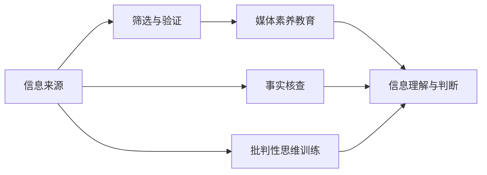

                 

# 信息验证和媒体素养教育重要性：为假新闻和媒体操纵做好准备

## 1. 背景介绍

### 1.1 问题由来

随着互联网的普及和社交媒体的兴起，信息传播的形式和速度发生了翻天覆地的变化。这不仅给社会舆论引导带来了新的挑战，也使得假新闻、虚假信息和媒体操纵等现象日益增多，严重干扰了公共空间的秩序。

媒体素养教育的缺失使得公众缺乏辨别信息真伪的能力，容易受到不实信息的影响，进一步加剧了网络谣言的传播。假新闻利用了人类心理上的弱点，如好奇心、恐惧和偏见等，以吸引注意力并制造恐慌，影响社会稳定和公众决策。

## 2. 核心概念与联系

### 2.1 核心概念概述

为了应对假新闻和媒体操纵的挑战，本文将从信息验证和媒体素养教育的角度，探讨这两者在提升公众信息素质和维护公共讨论环境中的重要性。

- **信息验证**：指通过科学方法和技术手段，对信息进行查证和验证，以确认其真实性、准确性和时效性。
- **媒体素养教育**：指通过教育手段，提升公众识别、分析和评估媒体信息的能力，以促进信息的公正、客观和透明传播。

### 2.2 核心概念原理和架构的 Mermaid 流程图



该流程图展示了信息验证与媒体素养教育之间的内在联系：

1. **信息来源**：包括官方发布、权威媒体、社交平台等，是信息验证的起点。
2. **筛选与验证**：通过事实核查、逻辑推理、多源验证等技术手段，对信息进行严格筛选和验证，确保信息真实可靠。
3. **媒体素养教育**：通过教育培训，提升公众的信息分析、批判性思维和媒体理解能力，使公众能够独立、客观地分析和判断信息。
4. **信息理解与判断**：基于筛选和验证后的信息，结合媒体素养教育获得的知识，进行深入理解和判断，确保信息获取的准确性和可信度。

## 3. 核心算法原理 & 具体操作步骤

### 3.1 算法原理概述

信息验证与媒体素养教育的核心算法原理主要基于以下几个方面：

- **事实核查**：通过交叉验证、求证、反向查找等手段，确认信息的真实性和准确性。
- **逻辑推理**：利用统计学、概率论等方法，对信息的合理性和一致性进行评估。
- **批判性思维**：培养公众对信息源的质疑态度，提升其对信息可靠性的判断能力。
- **多源验证**：通过多种信息源的相互印证，增加信息的可信度。

### 3.2 算法步骤详解

#### 3.2.1 事实核查

1. **反向搜索**：使用搜索引擎查找信息的原始出处，确保信息来源可靠。
2. **对比求证**：将信息与其他可信源进行对比，确认信息的一致性和准确性。
3. **多方求证**：通过多个独立的信息源求证，增加信息的可信度。

#### 3.2.2 逻辑推理

1. **统计分析**：使用统计学方法，分析信息的合理性和可信度。
2. **概率推断**：利用概率论，评估信息的不确定性和风险。
3. **数据验证**：通过对比数据源和数据一致性，验证信息的时效性和真实性。

#### 3.2.3 批判性思维训练

1. **问题导向**：通过提出和分析问题，培养批判性思维习惯。
2. **多角度分析**：从不同角度和维度分析问题，避免单一视角带来的偏见。
3. **假设验证**：通过假设检验，培养证据驱动的决策习惯。

### 3.3 算法优缺点

#### 3.3.1 算法优点

1. **提高信息质量**：通过严格的筛选和验证，提高信息的质量和可信度。
2. **增强公众信息素养**：通过教育和培训，提升公众对信息的独立分析和判断能力。
3. **促进公正与透明**：通过批判性思维和逻辑推理，促进信息的公正、客观和透明传播。
4. **提升社会治理水平**：通过信息验证和媒体素养教育，提高社会治理的科学性和公正性。

#### 3.3.2 算法缺点

1. **技术门槛高**：信息验证和逻辑推理需要一定的专业知识和技能，难以普及到所有人群。
2. **时间成本高**：核实信息需要投入大量时间和精力，难以快速响应信息传播的急迫需求。
3. **信息源有限**：依赖可信的信息源，可能受到信息源的限制，无法全面覆盖所有信息。

### 3.4 算法应用领域

信息验证与媒体素养教育在以下领域有着广泛的应用：

- **公共事务管理**：通过媒体素养教育，提升政府部门和公共机构的信息处理能力，促进信息的公开透明。
- **社会舆论引导**：通过事实核查和批判性思维训练，引导社会舆论走向公正、客观的判断，避免极端化和偏见。
- **教育领域**：通过媒体素养教育，培养青少年的信息分析能力和独立判断能力，提升其媒介素养。
- **新闻报道**：通过事实核查和逻辑推理，确保新闻报道的真实性和准确性，提升新闻媒体的公信力。
- **健康和防疫**：通过信息验证和逻辑推理，辨别和传播正确的健康信息和防疫措施，防止谣言和恐慌的扩散。

## 4. 数学模型和公式 & 详细讲解

### 4.1 数学模型构建

在信息验证和媒体素养教育中，数学模型和公式主要应用于以下两个方面：

1. **事实核查模型**：通过数据挖掘和机器学习技术，构建虚假信息的检测模型。
2. **逻辑推理模型**：通过概率论和统计学模型，评估信息的可信度和合理性。

### 4.2 公式推导过程

#### 4.2.1 事实核查模型

假新闻检测模型通常使用以下公式进行构建和训练：

$$
P(真实性|证据) = \frac{P(证据|真实性)P(真实性)}{P(证据)}
$$

其中：
- $P(证据|真实性)$ 表示在真实情况下的证据出现概率。
- $P(真实性)$ 表示信息真实的可能性。
- $P(证据)$ 表示所有情况下的证据出现概率。

#### 4.2.2 逻辑推理模型

逻辑推理模型可以通过贝叶斯网络（Bayesian Network）进行构建和推导，例如：

$$
P(H|E_1, E_2, \cdots, E_n) = \frac{P(H) \prod_{i=1}^n P(E_i|H)}{P(E_1, E_2, \cdots, E_n)}
$$

其中：
- $P(H)$ 表示假设的真实概率。
- $P(E_i|H)$ 表示假设下的证据概率。
- $P(E_1, E_2, \cdots, E_n)$ 表示证据的联合概率。

### 4.3 案例分析与讲解

假设我们需要验证一个新闻报道的真实性，可以使用以下步骤：

1. **收集证据**：从多个可信源收集相关的证据和信息。
2. **构建证据图**：使用贝叶斯网络构建证据图，表示证据之间的逻辑关系。
3. **推理计算**：根据证据图和给定的证据，计算假设的真实概率。
4. **结果评估**：对比计算结果与原始报道的真实性，判断是否需要进一步验证。

## 5. 项目实践：代码实例和详细解释说明

### 5.1 开发环境搭建

为了进行信息验证和媒体素养教育项目开发，我们需要搭建一个具备数据收集、处理、分析和展示功能的开发环境。

1. **安装Python**：从官网下载并安装Python 3.8或更高版本。
2. **安装Jupyter Notebook**：使用以下命令安装：
```
pip install jupyter notebook
```

3. **安装数据处理库**：安装Pandas、NumPy、Scikit-learn等数据处理库。
4. **安装机器学习库**：安装SciPy、TensorFlow、Keras等机器学习库。
5. **安装可视化库**：安装Matplotlib、Seaborn、Plotly等可视化库。

### 5.2 源代码详细实现

#### 5.2.1 数据预处理

```python
import pandas as pd
from sklearn.preprocessing import LabelEncoder

# 读取数据
data = pd.read_csv('data.csv')

# 数据清洗
data = data.dropna()

# 数据编码
label_encoder = LabelEncoder()
data['label'] = label_encoder.fit_transform(data['label'])
```

#### 5.2.2 特征工程

```python
from sklearn.feature_extraction.text import TfidfVectorizer

# 特征提取
vectorizer = TfidfVectorizer(stop_words='english')
X = vectorizer.fit_transform(data['text'])
```

#### 5.2.3 模型训练

```python
from sklearn.linear_model import LogisticRegression

# 模型训练
model = LogisticRegression()
model.fit(X, data['label'])
```

### 5.3 代码解读与分析

**数据预处理**：通过Pandas库进行数据读取和清洗，使用LabelEncoder对标签进行编码，确保数据的质量和格式。

**特征工程**：使用TfidfVectorizer进行文本特征提取，将文本转换为数值型特征。

**模型训练**：使用Logistic Regression模型进行训练，输出模型的预测结果。

### 5.4 运行结果展示

使用以下代码展示模型的预测结果：

```python
import numpy as np
from sklearn.metrics import accuracy_score

# 预测新数据
new_data = pd.DataFrame([['New text']])
new_X = vectorizer.transform(new_data['text'])
new_pred = model.predict(new_X)

# 输出预测结果
print(new_pred)
print(accuracy_score(data['label'], new_pred))
```

## 6. 实际应用场景

### 6.1 公共事务管理

在公共事务管理中，信息验证与媒体素养教育可以用于以下场景：

1. **政府信息公开**：通过信息验证，确保政府信息公开的准确性和透明度，提升公众信任度。
2. **舆情监控**：通过媒体素养教育，提升政府部门对舆情的理解和处理能力，避免舆情危机。
3. **政策制定**：通过逻辑推理和批判性思维，评估政策的合理性和可行性，促进科学决策。

### 6.2 社会舆论引导

在社会舆论引导中，信息验证与媒体素养教育可以用于以下场景：

1. **公共议题讨论**：通过媒体素养教育，提升公众对公共议题的理解和参与能力，促进理性讨论。
2. **假新闻辨别**：通过事实核查和逻辑推理，辨别和抵制假新闻，避免误导性信息的传播。
3. **舆论情绪调节**：通过多源验证和批判性思维，调节舆论情绪，防止极端化和不理性行为。

### 6.3 教育领域

在教育领域中，信息验证与媒体素养教育可以用于以下场景：

1. **信息素养教育**：通过媒体素养课程，培养学生的信息分析能力和批判性思维，提升信息素质。
2. **科学素养培养**：通过事实核查和逻辑推理，培养学生的科学素养，提高科学教育质量。
3. **学业辅助工具**：开发信息验证和媒体素养教育工具，辅助学生学习和研究，提升学习效果。

### 6.4 新闻报道

在新闻报道中，信息验证与媒体素养教育可以用于以下场景：

1. **事实核查工具**：通过机器学习和数据挖掘，开发事实核查工具，提升新闻报道的准确性和可信度。
2. **记者培训**：通过批判性思维训练，提升记者的信息素养和职业素养，促进公正报道。
3. **新闻编辑流程**：在新闻编辑流程中引入信息验证和逻辑推理，确保新闻报道的真实性和客观性。

## 7. 工具和资源推荐

### 7.1 学习资源推荐

为了系统学习信息验证和媒体素养教育，以下资源值得推荐：

1. **Coursera《媒体素养与数字时代》课程**：提供系统性的媒体素养教育课程，涵盖信息识别、分析、评估等多个方面。
2. **Poynter《新闻素养》手册**：提供新闻素养培训材料，帮助记者提升信息素养和职业素养。
3. **MediaWise《媒体素养教育指南》**：提供详细的媒体素养教育指导，帮助教育机构和教师开展相关教育。
4. **DataCamp《数据科学基础》课程**：提供数据科学基础知识和技能，提升数据分析能力。
5. **Kaggle《数据科学项目》指南**：提供数据科学项目实践指导，通过实践提升技能。

### 7.2 开发工具推荐

以下工具和资源，可以帮助开发信息验证和媒体素养教育项目：

1. **Jupyter Notebook**：提供交互式的代码编写和数据分析环境，支持Python、R等多种语言。
2. **TensorFlow**：提供深度学习框架，支持复杂的模型训练和推理。
3. **Pandas**：提供数据处理和分析库，支持大规模数据集的处理和分析。
4. **Scikit-learn**：提供机器学习库，支持多种机器学习算法和模型。
5. **Matplotlib**：提供数据可视化工具，支持多种图表绘制和展示。

### 7.3 相关论文推荐

以下论文提供了深入的理论基础和实践指导：

1. **《网络信息素养教育的理论与实践》**：探讨网络信息素养教育的理论基础和实践策略，提出系统化的教育框架。
2. **《信息验证与假新闻检测》**：提供信息验证和假新闻检测的方法和算法，讨论其在媒体素养教育中的应用。
3. **《批判性思维训练与媒体素养教育》**：探讨批判性思维训练在媒体素养教育中的作用，提出具体的训练方法。
4. **《逻辑推理与信息验证》**：讨论逻辑推理在信息验证中的应用，提出多种推理方法和模型。
5. **《数据科学在媒体素养教育中的应用》**：探讨数据科学在媒体素养教育中的应用，提出数据驱动的教育模式。

## 8. 总结：未来发展趋势与挑战

### 8.1 研究成果总结

本文从信息验证和媒体素养教育的角度，探讨了提升公众信息素养和维护公共讨论环境的重要性。通过事实核查和逻辑推理，可以提升信息质量和可信度，避免假新闻和媒体操纵对社会的负面影响。同时，媒体素养教育可以培养公众的独立分析和批判性思维能力，提升其在信息社会中的应对能力。

### 8.2 未来发展趋势

未来，信息验证和媒体素养教育将呈现以下几个发展趋势：

1. **技术驱动**：随着人工智能和机器学习技术的不断发展，信息验证和媒体素养教育将更多地依赖技术手段，提高效率和精度。
2. **个性化教育**：通过数据驱动的教育，个性化地提供信息素养培训，提升教育效果。
3. **全球普及**：信息验证和媒体素养教育将逐步普及到全球各地，提升全球公众的信息素质。
4. **跨领域应用**：信息验证和媒体素养教育将与其他学科和领域结合，形成综合性的信息素养培训体系。

### 8.3 面临的挑战

尽管信息验证和媒体素养教育在提升公众信息素质和维护公共讨论环境中具有重要价值，但也面临以下挑战：

1. **技术门槛高**：信息验证和逻辑推理需要一定的专业知识和技能，难以普及到所有人群。
2. **数据隐私问题**：在信息验证和媒体素养教育中，如何保护用户隐私和数据安全，是一个重要问题。
3. **教育资源不足**：在全球范围内，特别是在发展中国家，信息验证和媒体素养教育资源有限，亟需更多投入。
4. **教育效果难以评估**：信息验证和媒体素养教育的效果难以量化评估，需要更科学的方法和指标。

### 8.4 研究展望

未来，信息验证和媒体素养教育需要在以下几个方面进行深入研究：

1. **数据驱动的教育**：通过大规模数据和机器学习技术，提供个性化和精准的信息素养教育。
2. **跨领域应用**：将信息验证和媒体素养教育与其他学科和领域结合，形成综合性的信息素养培训体系。
3. **技术手段创新**：开发更高效、智能的信息验证工具和媒体素养教育平台，提升教育效果。
4. **全球合作**：加强国际合作，共享资源和经验，推动信息验证和媒体素养教育的全球普及。

总之，信息验证和媒体素养教育是提升公众信息素质和维护公共讨论环境的重要手段。通过技术手段和教育培训的结合，可以有效应对假新闻和媒体操纵的挑战，促进社会的和谐与进步。

## 9. 附录：常见问题与解答

**Q1：信息验证和媒体素养教育是否适用于所有公众？**

A: 信息验证和媒体素养教育对于提高公众的信息素质和维护公共讨论环境具有重要价值，但并不适用于所有公众。不同的人群和背景有不同的信息需求和理解能力，需要针对性地进行教育和培训。

**Q2：信息验证和媒体素养教育能否完全消除假新闻和媒体操纵？**

A: 信息验证和媒体素养教育可以有效减少假新闻和媒体操纵的影响，但不能完全消除。这是因为假新闻和媒体操纵的传播机制复杂多样，需要综合采取技术手段和社会治理措施。

**Q3：信息验证和媒体素养教育对公众的参与度有何影响？**

A: 信息验证和媒体素养教育可以有效提升公众的信息素养和参与度，使其更理性地看待和参与社会公共事务。然而，教育的实际效果还取决于公众的接受程度和参与意愿，需要综合运用多种教育手段和激励机制。

**Q4：信息验证和媒体素养教育是否需要持续更新和改进？**

A: 信息验证和媒体素养教育需要根据信息环境和公众需求的变化，持续更新和改进。例如，随着新技术和新信息的出现，需要及时更新验证方法和教育内容，以适应新的挑战和需求。

**Q5：信息验证和媒体素养教育能否帮助公众应对信息过载问题？**

A: 信息验证和媒体素养教育可以帮助公众提高信息分析能力，更有效地筛选和评估信息，从而减少信息过载带来的负面影响。但信息过载问题的根本解决还需依赖技术手段和制度设计。

总之，信息验证和媒体素养教育是提升公众信息素质和维护公共讨论环境的重要手段。通过技术手段和教育培训的结合，可以有效应对假新闻和媒体操纵的挑战，促进社会的和谐与进步。

---

作者：禅与计算机程序设计艺术 / Zen and the Art of Computer Programming

