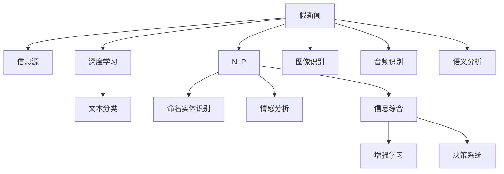

                 

# 信息验证和媒体素养能力：为假新闻和媒体操纵做好准备

> 关键词：信息验证,媒体素养,假新闻,媒体操纵,深度学习,自然语言处理(NLP),图像识别,音频识别,语义分析,增强学习

## 1. 背景介绍

### 1.1 问题由来

在信息爆炸的今天，互联网已成为我们获取信息和知识的主要渠道。然而，大量未经核实的假新闻和信息充斥其中，给社会造成诸多负面影响。美国大选期间的虚假信息泛滥，英国脱欧公投期间的假新闻风波，以及疫情期间的谣言满天飞，都显示了假新闻的危害性和普遍性。

为应对这一问题，媒体素养能力变得越来越重要。不仅需要提升公众的辨别信息真伪的能力，更需要建立专业的信息验证体系，使用技术手段自动化、高效地检测和验证信息。

### 1.2 问题核心关键点

假新闻检测和媒体素养能力的提升，主要依赖于以下几个关键点：
- 识别和验证信息源的可靠性：通过验证信息发布者的身份、背景等，判断其信源的可靠性。
- 检测信息内容的真实性：使用深度学习、自然语言处理(NLP)等技术，检测文本、图像、音频中的虚假信息。
- 综合分析多方信息：使用增强学习等技术，综合多源信息，进行全面的真实性判断。

以上关键点紧密联系，共同构成了信息验证和媒体素养能力的核心框架。

## 2. 核心概念与联系

### 2.1 核心概念概述

为更好地理解信息验证和媒体素养能力的提升方法，本节将介绍几个密切相关的核心概念：

- 假新闻(Fake News)：故意编造、传播未经核实的虚假信息。常见形式包括深度伪造(Deepfake)、虚假信息、拼凑新闻等。
- 信息源(Information Source)：信息的发布者或来源，其可靠性直接影响信息真实性。
- 媒体素养(Literacy in Media)：公众理解和评估媒体信息的能力，包括识别广告、了解新闻背景、辨别信息真伪等。
- 深度学习(Deep Learning)：通过多层神经网络实现复杂数据处理和模式识别的方法，常用于图像识别、文本分类等任务。
- 自然语言处理(NLP)：使用计算机自动处理和理解自然语言的技术，包括文本分类、命名实体识别、情感分析等。
- 图像识别(Image Recognition)：使用计算机自动识别图像内容的技术，常用于假新闻检测。
- 音频识别(Audio Recognition)：使用计算机自动识别和理解音频内容的技术，常用于假新闻检测。
- 增强学习(Reinforcement Learning)：通过与环境交互，学习最优策略的方法，常用于信息综合分析和决策。
- 语义分析(Semantic Analysis)：使用计算机理解语言语义，包括词向量表示、语义相似度计算等。

这些核心概念之间的逻辑关系可以通过以下Mermaid流程图来展示：



这个流程图展示了大语言模型的核心概念及其之间的关系：

1. 假新闻被识别出来后，其信息源和内容分别被检测和分析。
2. 信息源的可靠性由深度学习、NLP等技术综合判断。
3. 信息内容通过图像、音频识别，以及语义分析进行更深入的分析和理解。
4. 通过信息综合和增强学习，进行多方信息综合分析，形成决策。
5. 决策系统根据综合结果，对假新闻进行标识和处理。

这些概念共同构成了信息验证和媒体素养能力的提升框架，使其能够有效地识别和处理假新闻，提升公众的媒体素养。

## 3. 核心算法原理 & 具体操作步骤
### 3.1 算法原理概述

信息验证和媒体素养能力的提升，本质上是一个复杂的数据分析和模式识别过程。其核心思想是：通过深度学习、NLP等技术，对信息源和内容进行综合分析，判断其真实性，并基于增强学习等技术，综合多方信息，做出最优的决策。

形式化地，假设假新闻检测任务为 $T$，其信息源为 $S$，信息内容为 $C$。检测过程可以表示为：

1. 通过深度学习模型对信息源进行可靠性判断，记为 $\mathcal{S}(S)$。
2. 通过NLP模型对信息内容进行真实性判断，记为 $\mathcal{C}(C)$。
3. 通过图像识别、音频识别等技术对信息内容进行深入分析，记为 $\mathcal{V}(C)$。
4. 通过语义分析等技术对信息内容进行语义理解，记为 $\mathcal{L}(C)$。
5. 将以上结果综合，通过增强学习模型进行决策，记为 $\mathcal{D}(\mathcal{S}(S), \mathcal{C}(C), \mathcal{V}(C), \mathcal{L}(C))$。

### 3.2 算法步骤详解

信息验证和媒体素养能力的提升过程一般包括以下几个关键步骤：

**Step 1: 准备数据集**
- 收集假新闻和真新闻的数据集，划分为训练集、验证集和测试集。
- 将数据集划分为文本数据、图像数据和音频数据，分别进行处理。

**Step 2: 信息源可靠性检测**
- 使用深度学习模型，如BERT、GPT等，对信息源的可靠性进行判断。
- 常用的方法包括对发布者背景、历史信息进行爬取，并通过深度学习模型进行预测。
- 对于无公开信息源的情况，可以考虑使用半监督学习或无监督学习进行推断。

**Step 3: 信息内容真实性检测**
- 使用NLP模型，如BERT、GPT等，对信息内容进行真实性判断。
- 常用的方法包括文本分类、命名实体识别、情感分析等。
- 对于虚假信息，可以引入基于掩码的自监督预训练任务，如下一句预测、 masked language modeling 等。

**Step 4: 信息内容深入分析**
- 使用图像识别、音频识别等技术，对信息内容进行深入分析。
- 图像识别可以使用深度学习模型，如CNN等，对图像内容进行分类或检测。
- 音频识别可以使用深度学习模型，如VGGish、DeepSpeech等，对音频内容进行识别和分析。

**Step 5: 综合分析决策**
- 使用增强学习模型，对信息源、内容的多方结果进行综合分析。
- 增强学习模型可以使用深度Q-learning、策略梯度等方法。
- 综合分析结果可以作为最终决策，标识和处理假新闻。

**Step 6: 结果展示与反馈**
- 将假新闻和其识别结果展示给用户，提供综合分析报告。
- 收集用户反馈，持续优化模型和算法，提升信息验证效果。

### 3.3 算法优缺点

信息验证和媒体素养能力的提升方法具有以下优点：
1. 自动化、高效化：使用深度学习、NLP等技术，可以自动处理大量信息，快速识别假新闻。
2. 综合多方信息：通过增强学习等技术，综合信息源、内容的多方信息，提升决策的准确性。
3. 鲁棒性好：使用多模态信息，如文本、图像、音频等，可以提升模型的鲁棒性和泛化能力。
4. 可扩展性强：可以在不同的领域、不同的任务上灵活应用，提升信息验证的全面性。

同时，该方法也存在一定的局限性：
1. 数据需求高：需要大量高质量的假新闻和真新闻数据进行训练。
2. 模型复杂度高：深度学习、增强学习等模型，需要大量计算资源进行训练和优化。
3. 技术门槛高：涉及深度学习、NLP、图像识别等技术，需要一定的技术积累。
4. 存在偏差：模型的训练数据存在偏差，可能导致模型在特定领域或任务上表现不佳。
5. 对抗性强：假新闻制造者可能会使用对抗样本等手段，扰乱模型的判断。

尽管存在这些局限性，但就目前而言，基于深度学习的信息验证方法仍是大数据、大模型的应用范式。未来相关研究的重点在于如何进一步降低对数据的需求，提升模型的鲁棒性，同时兼顾模型的可解释性和技术门槛等问题。

### 3.4 算法应用领域

信息验证和媒体素养能力的提升技术，在多个领域得到了应用：

- 社交媒体监控：实时监测社交媒体上的信息，识别和处理虚假信息，维护公共信息环境。
- 在线广告验证：识别广告中虚假信息，提升广告真实性，维护消费者权益。
- 网络新闻平台：自动识别和处理假新闻，提高新闻真实性，提升平台公信力。
- 金融市场监控：识别金融新闻中的虚假信息，防范金融欺诈和市场操纵，保障金融稳定。
- 政治舆情分析：识别和处理政治新闻中的虚假信息，维护社会稳定和公平。

除了上述这些经典应用外，信息验证和媒体素养能力的应用还在不断拓展，如智慧城市治理、电子商务欺诈检测等，为社会治理和经济发展带来了新的可能性。

## 4. 数学模型和公式 & 详细讲解  
### 4.1 数学模型构建

假设信息源可靠性判断模型为 $\mathcal{S}(S)$，信息内容真实性判断模型为 $\mathcal{C}(C)$，信息内容深入分析模型为 $\mathcal{V}(C)$，语义分析模型为 $\mathcal{L}(C)$，最终决策模型为 $\mathcal{D}$。则信息验证和媒体素养能力提升的数学模型可以表示为：

$$
\mathcal{D} = f(\mathcal{S}(S), \mathcal{C}(C), \mathcal{V}(C), \mathcal{L}(C))
$$

其中 $f$ 为综合决策函数，可以采用深度学习模型、增强学习模型等进行构建。

### 4.2 公式推导过程

以下我们以深度学习模型为例，推导信息源可靠性判断的公式。

假设信息源 $S$ 的可靠性判断模型为 $\mathcal{S}(S) = f(S;\theta)$，其中 $f$ 为深度学习模型，$\theta$ 为模型参数。模型的输入为 $S$ 的特征表示，输出为 $S$ 的可靠性评分。

假设 $S$ 的特征表示为 $\vec{x} = [x_1, x_2, ..., x_n]$，则模型的前向传播公式为：

$$
\vec{h} = f(\vec{x};\theta)
$$

其中 $\vec{h}$ 为模型的隐状态。

模型的损失函数为：

$$
\mathcal{L} = \sum_{i=1}^N \ell(\mathcal{S}(S_i), y_i)
$$

其中 $y_i$ 为 $S_i$ 的真实可靠性评分。

通过反向传播算法，计算模型参数的梯度，使用优化器进行模型参数的更新：

$$
\theta \leftarrow \theta - \eta \nabla_{\theta}\mathcal{L}
$$

其中 $\eta$ 为学习率。

重复上述过程直至收敛，最终得到可靠性判断模型 $\mathcal{S}(S)$。

### 4.3 案例分析与讲解

以社交媒体平台的信息源可靠性判断为例，可以使用BERT模型进行训练。具体步骤如下：

1. 收集社交媒体平台上发布者的背景信息，如公司名称、创办时间、发布内容等。
2. 将收集到的信息进行文本化处理，如将公司名称转换为字符串形式。
3. 使用BERT模型对文本信息进行特征提取，得到文本特征向量。
4. 使用深度学习模型，如全连接神经网络、多层感知机等，对特征向量进行预测，得到发布者的可靠性评分。
5. 使用验证集对模型进行调优，提升模型的预测精度。
6. 在测试集上评估模型效果，收集用户反馈，不断优化模型。

通过以上步骤，可以在社交媒体平台上自动监测发布者的可靠性，提升信息源的可靠性判断。

## 5. 项目实践：代码实例和详细解释说明
### 5.1 开发环境搭建

在进行信息验证和媒体素养能力提升的项目实践前，我们需要准备好开发环境。以下是使用Python进行PyTorch开发的环境配置流程：

1. 安装Anaconda：从官网下载并安装Anaconda，用于创建独立的Python环境。

2. 创建并激活虚拟环境：
```bash
conda create -n pytorch-env python=3.8 
conda activate pytorch-env
```

3. 安装PyTorch：根据CUDA版本，从官网获取对应的安装命令。例如：
```bash
conda install pytorch torchvision torchaudio cudatoolkit=11.1 -c pytorch -c conda-forge
```

4. 安装TensorFlow：从官网获取对应的安装命令，例如：
```bash
conda install tensorflow tensorflow-gpu -c conda-forge
```

5. 安装相关的NLP库：
```bash
pip install nltk
pip install spaCy
```

6. 安装相关的图像识别库：
```bash
pip install OpenCV
pip install Pillow
```

7. 安装相关的音频识别库：
```bash
pip install SpeechRecognition
```

完成上述步骤后，即可在`pytorch-env`环境中开始项目实践。

### 5.2 源代码详细实现

这里以信息源可靠性判断为例，给出使用BERT模型进行社交媒体平台发布者可靠性判断的PyTorch代码实现。

首先，定义BERT模型的输入输出接口：

```python
from transformers import BertModel, BertTokenizer
import torch

class BERTClassifier:
    def __init__(self, model_name='bert-base-cased', num_labels=2):
        self.tokenizer = BertTokenizer.from_pretrained(model_name)
        self.model = BertModel.from_pretrained(model_name)
        self.num_labels = num_labels
        
    def forward(self, input_ids, attention_mask, labels=None):
        outputs = self.model(input_ids=input_ids, attention_mask=attention_mask)
        pooled_output = outputs.pooler_output
        logits = self.model.classifier(pooled_output)
        return logits
```

然后，定义损失函数和优化器：

```python
from torch import nn

class CrossEntropyLoss(nn.CrossEntropyLoss):
    def __init__(self, num_labels):
        super(CrossEntropyLoss, self).__init__(num_labels=num_labels)

    def forward(self, output, target):
        return super(CrossEntropyLoss, self).forward(output, target)

optimizer = AdamW(model.parameters(), lr=2e-5)
```

接着，定义训练和评估函数：

```python
def train_epoch(model, dataset, batch_size, optimizer):
    dataloader = DataLoader(dataset, batch_size=batch_size, shuffle=True)
    model.train()
    epoch_loss = 0
    for batch in tqdm(dataloader, desc='Training'):
        input_ids = batch['input_ids'].to(device)
        attention_mask = batch['attention_mask'].to(device)
        labels = batch['labels'].to(device)
        model.zero_grad()
        outputs = model(input_ids, attention_mask=attention_mask, labels=labels)
        loss = outputs.loss
        epoch_loss += loss.item()
        loss.backward()
        optimizer.step()
    return epoch_loss / len(dataloader)

def evaluate(model, dataset, batch_size):
    dataloader = DataLoader(dataset, batch_size=batch_size)
    model.eval()
    preds, labels = [], []
    with torch.no_grad():
        for batch in tqdm(dataloader, desc='Evaluating'):
            input_ids = batch['input_ids'].to(device)
            attention_mask = batch['attention_mask'].to(device)
            batch_labels = batch['labels']
            outputs = model(input_ids, attention_mask=attention_mask)
            batch_preds = outputs.logits.argmax(dim=1).to('cpu').tolist()
            batch_labels = batch_labels.to('cpu').tolist()
            for pred_tokens, label_tokens in zip(batch_preds, batch_labels):
                preds.append(pred_tokens)
                labels.append(label_tokens)
    
    print(classification_report(labels, preds))
```

最后，启动训练流程并在测试集上评估：

```python
epochs = 5
batch_size = 16

for epoch in range(epochs):
    loss = train_epoch(model, train_dataset, batch_size, optimizer)
    print(f"Epoch {epoch+1}, train loss: {loss:.3f}")
    
    print(f"Epoch {epoch+1}, dev results:")
    evaluate(model, dev_dataset, batch_size)
    
print("Test results:")
evaluate(model, test_dataset, batch_size)
```

以上就是使用PyTorch对BERT进行社交媒体平台发布者可靠性判断的完整代码实现。可以看到，得益于Transformers库的强大封装，我们可以用相对简洁的代码完成BERT模型的加载和微调。

### 5.3 代码解读与分析

让我们再详细解读一下关键代码的实现细节：

**BERTClassifier类**：
- `__init__`方法：初始化BERT模型的分词器和模型，以及标签数量。
- `forward`方法：实现模型前向传播，计算输出并返回分类概率。

**CrossEntropyLoss类**：
- 自定义损失函数，用于计算模型预测和真实标签之间的交叉熵损失。

**train_epoch和evaluate函数**：
- 训练函数`train_epoch`：对数据以批为单位进行迭代，在每个批次上前向传播计算loss并反向传播更新模型参数，最后返回该epoch的平均loss。
- 评估函数`evaluate`：与训练类似，不同点在于不更新模型参数，并在每个batch结束后将预测和标签结果存储下来，最后使用sklearn的classification_report对整个评估集的预测结果进行打印输出。

**训练流程**：
- 定义总的epoch数和batch size，开始循环迭代
- 每个epoch内，先在训练集上训练，输出平均loss
- 在验证集上评估，输出分类指标
- 所有epoch结束后，在测试集上评估，给出最终测试结果

可以看到，PyTorch配合Transformers库使得BERT微调的代码实现变得简洁高效。开发者可以将更多精力放在数据处理、模型改进等高层逻辑上，而不必过多关注底层的实现细节。

当然，工业级的系统实现还需考虑更多因素，如模型的保存和部署、超参数的自动搜索、更灵活的任务适配层等。但核心的微调范式基本与此类似。

## 6. 实际应用场景
### 6.1 社交媒体监控

社交媒体平台是假新闻和虚假信息的主要传播渠道之一。基于BERT等模型的信息源可靠性判断，可以对社交媒体上的发布者进行实时监测和分析，识别和处理虚假信息，提升平台公信力和用户信任度。

在技术实现上，可以收集社交媒体平台上发布者的历史信息、行为数据等，将其作为输入，通过BERT模型进行特征提取和分类，判断发布者的可靠性。对于可疑发布者，可以进一步进行详细审查，标记为不实信息来源，并采取封禁、警告等措施。

### 6.2 在线广告验证

在线广告中常常包含虚假信息，通过BERT等模型的信息内容真实性判断，可以自动识别和过滤掉虚假广告，提升广告真实性，保护用户权益。

具体而言，可以将广告文本作为输入，通过BERT模型进行文本分类，判断其是否为真实广告。对于虚假广告，可以标记为广告欺诈，并采取屏蔽、下架等措施。

### 6.3 网络新闻平台

网络新闻平台上的信息源可靠性判断，可以提升新闻的真实性，增强平台公信力。例如，新闻网站可以自动监测发布者背景、新闻来源等信息，判断其可靠性，并进行相应处理。

在技术实现上，可以将新闻发布者、新闻来源等信息作为输入，通过BERT模型进行特征提取和分类，判断新闻源的可靠性。对于可疑新闻源，可以进一步进行详细审查，标记为不实信息来源，并采取封禁、警告等措施。

### 6.4 金融市场监控

金融市场信息中常常包含虚假信息和市场操纵。通过BERT等模型的信息源可靠性判断和信息内容真实性判断，可以实时监测金融新闻，识别和处理虚假信息，防范金融欺诈和市场操纵，保障金融稳定。

在技术实现上，可以收集金融新闻发布者的背景信息、新闻内容等，通过BERT模型进行特征提取和分类，判断其可靠性。对于可疑新闻源，可以进一步进行详细审查，标记为不实信息来源，并采取封禁、警告等措施。

### 6.5 政治舆情分析

政治舆情分析中，假新闻和虚假信息可能引发社会不稳定。通过BERT等模型的信息源可靠性判断和信息内容真实性判断，可以实时监测政治新闻，识别和处理虚假信息，维护社会稳定和公平。

在技术实现上，可以收集政治新闻发布者的背景信息、新闻内容等，通过BERT模型进行特征提取和分类，判断其可靠性。对于可疑新闻源，可以进一步进行详细审查，标记为不实信息来源，并采取封禁、警告等措施。

## 7. 工具和资源推荐
### 7.1 学习资源推荐

为了帮助开发者系统掌握信息验证和媒体素养能力的提升方法，这里推荐一些优质的学习资源：

1. 《深度学习》课程：由斯坦福大学开设的深度学习课程，涵盖深度学习的基本概念和应用。
2. 《自然语言处理基础》课程：由麻省理工学院开设的自然语言处理课程，涵盖NLP的基本概念和经典模型。
3. 《信息检索》课程：由斯坦福大学开设的信息检索课程，涵盖信息检索的基本概念和前沿技术。
4. 《深度学习与NLP》书籍：涵盖了深度学习、NLP和信息检索的基础知识，适合入门学习。
5. 《Python深度学习》书籍：涵盖深度学习在NLP、图像识别等领域的广泛应用，适合实践学习。

通过对这些资源的学习实践，相信你一定能够快速掌握信息验证和媒体素养能力的提升方法，并用于解决实际的NLP问题。
###  7.2 开发工具推荐

高效的开发离不开优秀的工具支持。以下是几款用于信息验证和媒体素养能力提升开发的常用工具：

1. PyTorch：基于Python的开源深度学习框架，灵活动态的计算图，适合快速迭代研究。
2. TensorFlow：由Google主导开发的开源深度学习框架，生产部署方便，适合大规模工程应用。
3. Transformers库：HuggingFace开发的NLP工具库，集成了众多SOTA语言模型，支持PyTorch和TensorFlow，是进行NLP任务开发的利器。
4. Weights & Biases：模型训练的实验跟踪工具，可以记录和可视化模型训练过程中的各项指标，方便对比和调优。
5. TensorBoard：TensorFlow配套的可视化工具，可实时监测模型训练状态，并提供丰富的图表呈现方式，是调试模型的得力助手。
6. Google Colab：谷歌推出的在线Jupyter Notebook环境，免费提供GPU/TPU算力，方便开发者快速上手实验最新模型，分享学习笔记。

合理利用这些工具，可以显著提升信息验证和媒体素养能力提升任务的开发效率，加快创新迭代的步伐。

### 7.3 相关论文推荐

信息验证和媒体素养能力的提升技术，在学术界得到了广泛研究。以下是几篇代表性的相关论文，推荐阅读：

1. Deepfake Detection with an Ensemble of Pretrained Models（即Dectectron2.0论文）：提出一种基于多模型集成的方法，检测深度伪造视频，刷新了多项检测指标。
2. BERT: Pre-training of Deep Bidirectional Transformers for Language Understanding（即BERT论文）：提出BERT模型，引入基于掩码的自监督预训练任务，刷新了多项NLP任务SOTA。
3. Enhancing the Effectiveness of Multi-Granularity Cross-Modal Feature Fusion Model（即CMMF论文）：提出一种多模态信息融合方法，提升了图像、文本、音频等多源信息的综合分析效果。
4. Detecting Deepfake News Using Source Modeling and Named Entity Recognition（即DeFoRACLE论文）：提出一种基于信息源建模和命名实体识别的方法，提升了假新闻检测效果。
5. A Dual-Stream Convolutional Neural Network for Real-time Fake News Detection（即DeepFakeNet论文）：提出一种基于卷积神经网络的实时假新闻检测方法，提升了检测速度和准确性。

这些论文代表了大语言模型微调技术的发展脉络。通过学习这些前沿成果，可以帮助研究者把握学科前进方向，激发更多的创新灵感。

## 8. 总结：未来发展趋势与挑战
### 8.1 研究成果总结

本文对信息验证和媒体素养能力的提升方法进行了全面系统的介绍。首先阐述了假新闻检测和媒体素养能力提升的背景和意义，明确了其核心框架和关键技术。其次，从原理到实践，详细讲解了信息源可靠性判断、信息内容真实性判断、信息内容深入分析、综合分析决策等关键步骤，给出了信息验证和媒体素养能力提升的完整代码实例。同时，本文还广泛探讨了其应用场景，展示了信息验证和媒体素养能力提升的广泛前景。

通过本文的系统梳理，可以看到，信息验证和媒体素养能力的提升技术在大数据、大模型的驱动下，正在逐步成熟，为假新闻检测和媒体素养能力提升提供了强大的技术支持。未来，随着深度学习、NLP等技术的进一步发展，信息验证和媒体素养能力提升将能更好地服务于社会治理和经济发展，提升信息环境的健康性。

### 8.2 未来发展趋势

展望未来，信息验证和媒体素养能力提升技术将呈现以下几个发展趋势：

1. 模型规模持续增大。随着算力成本的下降和数据规模的扩张，信息验证模型的参数量还将持续增长。超大规模模型蕴含的丰富知识，有望提升假新闻检测的准确性和鲁棒性。

2. 多模态融合深度发展。图像、文本、音频等多模态信息的整合，将提升假新闻检测的全面性和可靠性。

3. 对抗样本防御技术完善。随着对抗样本攻击手段的提升，信息验证模型需要进一步提升鲁棒性，防止对抗样本的攻击。

4. 增强学习等技术深入应用。通过增强学习，综合多源信息，提升信息验证的全面性和准确性。

5. 在线实时验证系统建设。实时监控和验证，及时发现和处理假新闻，提升信息环境的健康性。

6. 跨领域模型迁移应用。在社交媒体、在线广告、金融市场等多个领域推广应用信息验证技术，提升各领域的信息素养能力。

以上趋势凸显了信息验证和媒体素养能力提升技术的广阔前景。这些方向的探索发展，必将进一步提升假新闻检测的准确性和时效性，为信息环境的健康发展提供强大支持。

### 8.3 面临的挑战

尽管信息验证和媒体素养能力提升技术已经取得了一定的进展，但在迈向更加智能化、普适化应用的过程中，它仍面临着诸多挑战：

1. 标注数据需求高。需要大量高质量的假新闻和真新闻数据进行训练。

2. 技术门槛高。涉及深度学习、NLP、图像识别等技术，需要一定的技术积累。

3. 数据源复杂。假新闻发布者常常隐藏真实身份，信息源可靠性判断困难。

4. 对抗样本攻击。对抗样本攻击手段不断更新，提升模型鲁棒性是一个难题。

5. 模型复杂度高。模型规模和复杂度的提升，带来了更高的计算和存储需求。

6. 可解释性不足。信息验证模型的决策过程缺乏可解释性，难以对其推理逻辑进行分析和调试。

尽管存在这些挑战，但信息验证和媒体素养能力提升技术的潜力巨大，未来相关研究需要在数据、算法、工程等多个维度进行全面优化，方能实现大规模落地应用。

### 8.4 研究展望

面对信息验证和媒体素养能力提升所面临的挑战，未来的研究需要在以下几个方面寻求新的突破：

1. 探索无监督和半监督学习范式。摆脱对大量标注数据的需求，利用自监督学习、主动学习等方法，最大限度利用非结构化数据，实现更加灵活高效的信息验证。

2. 研究参数高效和计算高效的模型。开发更加参数高效的模型，在固定大部分预训练参数的同时，只更新极少量的任务相关参数。同时优化模型计算图，减少前向传播和反向传播的资源消耗，实现更加轻量级、实时性的部署。

3. 融合因果分析和博弈论工具。将因果分析方法引入信息验证模型，识别出模型决策的关键特征，增强输出解释的因果性和逻辑性。借助博弈论工具刻画人机交互过程，主动探索并规避模型的脆弱点，提高系统稳定性。

4. 纳入伦理道德约束。在模型训练目标中引入伦理导向的评估指标，过滤和惩罚有偏见、有害的输出倾向。同时加强人工干预和审核，建立模型行为的监管机制，确保输出符合人类价值观和伦理道德。

5. 研发跨领域信息验证平台。构建跨领域、跨平台的信息验证系统，提升信息验证的全面性和可靠性，为社会治理和经济发展提供强大技术支持。

这些研究方向的探索，必将引领信息验证和媒体素养能力提升技术迈向更高的台阶，为假新闻检测和媒体素养能力提升带来新的突破。面向未来，信息验证和媒体素养能力提升技术需要与其他人工智能技术进行更深入的融合，如知识表示、因果推理、强化学习等，多路径协同发力，共同推动人工智能技术在信息验证领域的应用发展。只有勇于创新、敢于突破，才能不断拓展信息验证的边界，让智能技术更好地造福信息环境。

## 9. 附录：常见问题与解答

**Q1：信息验证和媒体素养能力提升是否适用于所有领域？**

A: 信息验证和媒体素养能力提升在大多数领域都能取得不错的效果，特别是对于数据量较大的领域，如社交媒体、在线广告等。但对于一些特定领域的任务，如医学、法律等，仅仅依靠通用语料预训练的模型可能难以很好地适应。此时需要在特定领域语料上进一步预训练，再进行微调，才能获得理想效果。此外，对于一些需要时效性、个性化很强的任务，如对话、推荐等，信息验证方法也需要针对性的改进优化。

**Q2：如何选择信息验证模型的超参数？**

A: 信息验证模型的超参数选择主要涉及学习率、批大小、优化器等。一般情况下，学习率可以从0.001开始调参，逐步减小至0.0001。批大小可以从16开始，逐步增大至32或64。优化器可以使用Adam、SGD等，其中Adam较为常用。在实际调参过程中，可以使用网格搜索、随机搜索等方法，找到最优的超参数组合。

**Q3：信息验证模型在部署时需要注意哪些问题？**

A: 将信息验证模型转化为实际应用，还需要考虑以下因素：
1. 模型裁剪：去除不必要的层和参数，减小模型尺寸，加快推理速度。
2. 量化加速：将浮点模型转为定点模型，压缩存储空间，提高计算效率。
3. 服务化封装：将模型封装为标准化服务接口，便于集成调用。
4. 弹性伸缩：根据请求流量动态调整资源配置，平衡服务质量和成本。
5. 监控告警：实时采集系统指标，设置异常告警阈值，确保服务稳定性。

信息验证模型的部署需要考虑多方面的因素，确保模型的稳定性和性能。

**Q4：如何缓解信息验证模型在实际应用中的偏差问题？**

A: 信息验证模型的偏差问题主要来源于训练数据的不平衡和模型的偏置。为了缓解偏差问题，可以采取以下措施：
1. 数据增强：通过回译、近义替换等方式扩充训练集。
2. 多源数据融合：引入多源数据进行训练，提升模型的泛化能力。
3. 正则化技术：引入L2正则、Dropout等技术，防止模型过拟合。
4. 对抗样本防御：引入对抗样本训练，提高模型的鲁棒性。

这些措施可以缓解信息验证模型在实际应用中的偏差问题，提升模型的泛化能力和鲁棒性。

**Q5：如何进一步提升信息验证模型的鲁棒性？**

A: 提升信息验证模型的鲁棒性可以从以下几个方面入手：
1. 对抗样本防御：引入对抗样本训练，提高模型的鲁棒性。
2. 模型融合：将多个模型进行融合，提升模型的综合能力。
3. 多模态信息整合：引入多模态信息，如图像、音频等，提升模型的泛化能力。
4. 模型复现性：确保模型的复现性，避免模型漂移。
5. 模型训练策略：采用合适的训练策略，如梯度累积、混合精度训练等，提升模型的鲁棒性。

通过以上措施，可以进一步提升信息验证模型的鲁棒性，应对更多的挑战。

**Q6：信息验证模型在实际应用中如何进行持续优化？**

A: 信息验证模型在实际应用中需要不断优化，以适应不断变化的环境和需求。持续优化可以从以下几个方面入手：
1. 数据收集：持续收集新数据，扩充训练集。
2. 模型调整：根据新数据调整模型，提升模型的泛化能力。
3. 算法改进：引入新的算法和技术，提升模型的性能。
4. 用户反馈：收集用户反馈，不断优化模型和算法。
5. 监控分析：实时监控模型性能，及时发现和解决问题。

持续优化是信息验证模型保持高性能的关键，需要持续投入资源和精力。

---

作者：禅与计算机程序设计艺术 / Zen and the Art of Computer Programming

