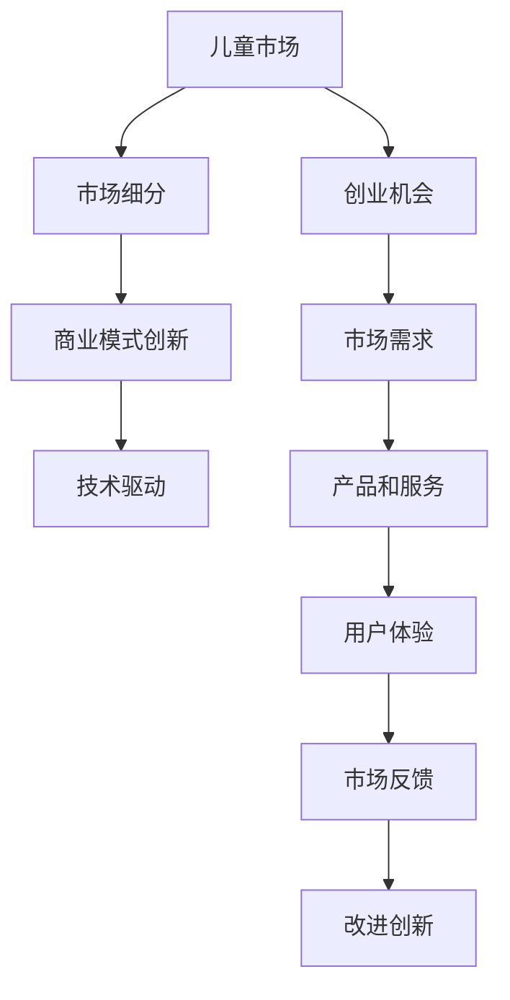

                 

# 儿童经济创业：儿童市场的无限可能

## 1. 背景介绍

### 1.1 问题由来

随着经济的持续发展和人口结构的变化，儿童市场正逐渐成为一个新的经济增长点。全球范围内，儿童消费的年增长率在6%至10%之间，远高于其他市场的增长率。而在中国，儿童市场已经成为最具潜力的消费市场之一。根据预测，到2025年，中国儿童消费市场规模有望达到5万亿人民币，成为全球最大的儿童市场。

然而，当前中国儿童市场的消费模式和产品结构仍然存在不少问题。比如，传统玩具和游戏产品的创新能力不足，高质量儿童教育资源的匮乏，以及缺乏针对儿童的金融服务。这些问题制约了儿童市场的发展潜力，也给创业者带来了巨大的机会。

### 1.2 问题核心关键点

儿童市场之所以备受关注，关键在于以下几个方面：

1. **消费潜力大**：儿童市场的消费增速远高于其他市场，且随着社会对儿童健康、教育等领域的关注度提升，儿童消费的增长将更为强劲。
2. **多领域融合**：儿童市场的消费不仅限于玩具和游戏，还包括教育、健康、金融等多个领域，多领域的交叉融合将带来更多的商业机会。
3. **需求多样化**：随着生活水平的提高，儿童的需求也在不断变化，个性化、定制化的产品和服务越来越受到青睐。
4. **科技驱动**：科技在儿童市场的渗透率不断提升，如智能玩具、远程教育、健康监测等，科技驱动的产品和服务将成为新的增长点。
5. **政策利好**：政府对儿童健康、教育等领域的政策支持力度加大，为儿童市场的发展提供了良好的政策环境。

这些问题核心关键点指向了儿童市场的无限可能性，以及创业者在这一领域内可以探索的广阔空间。

## 2. 核心概念与联系

### 2.1 核心概念概述

要深入了解儿童市场的创业机会，首先需要理解几个核心概念：

- **儿童市场**：指的是以儿童为主要消费对象的市场，包括儿童玩具、游戏、教育、健康、金融等各个领域。
- **创业机会**：指的是在特定市场环境下，创业者可以利用的有利条件和资源，如市场空白、技术优势、政策支持等。
- **市场细分**：将市场按照一定的标准进行分类，以便更好地理解和挖掘市场潜力。例如，按照年龄、性别、地域、消费习惯等维度进行细分。
- **商业模式创新**：指在传统商业模式基础上进行创新，创造出新的价值模式和市场机会，如SaaS模式、订阅模式等。
- **技术驱动**：利用最新技术手段，如人工智能、大数据、物联网等，提升产品的智能化和个性化水平，满足儿童及其家庭的多样化需求。

这些概念之间的联系主要体现在：

- **儿童市场**是创业机会的来源，创业者需深入了解市场需求和消费习惯。
- **市场细分**帮助创业者识别潜在的细分市场和目标客户，制定更具针对性的营销策略。
- **商业模式创新**和**技术驱动**是实现市场潜力的关键，通过创新商业模式和技术手段，提升市场竞争力和用户体验。

### 2.2 核心概念原理和架构的 Mermaid 流程图



这个流程图展示了儿童市场创业的全流程，从市场需求分析到产品和服务设计，再到技术驱动和商业模式创新，最终实现市场反馈和持续改进的循环。

## 3. 核心算法原理 & 具体操作步骤

### 3.1 算法原理概述

儿童市场的创业机会分析，本质上是进行市场细分和需求分析的过程。这一过程可以借助一系列算法和模型来实现，如聚类算法、回归分析、决策树等。

聚类算法可以将市场按照不同的特征进行分类，识别出具有相似需求的客户群体。回归分析可以用来预测儿童消费行为和趋势，为产品设计和市场营销提供数据支持。决策树可以帮助识别出影响儿童消费的主要因素，从而制定更有针对性的营销策略。

### 3.2 算法步骤详解

儿童市场创业机会分析的算法步骤主要包括以下几个步骤：

1. **数据收集**：收集与儿童市场相关的数据，如人口统计数据、消费行为数据、市场规模数据等。
2. **数据清洗和预处理**：对收集到的数据进行清洗和预处理，包括数据去重、缺失值填充、异常值处理等。
3. **特征工程**：从原始数据中提取有意义的特征，如儿童年龄、性别、消费金额、消费频率等。
4. **市场细分**：使用聚类算法对市场进行细分，识别出不同的客户群体。
5. **需求分析**：通过回归分析和决策树等模型，分析儿童消费行为和影响因素。
6. **机会识别**：结合市场细分和需求分析结果，识别出潜在的创业机会。
7. **策略制定**：根据识别出的机会，制定相应的商业模式和技术策略。
8. **实施与评估**：实施商业策略和技术方案，并持续监测和评估市场反馈。

### 3.3 算法优缺点

儿童市场创业机会分析的算法具有以下优点：

- **数据驱动**：通过大量数据支持，能够更准确地识别市场需求和细分市场。
- **模型灵活**：算法可以根据不同的数据特征和目标进行调整，适用于多种场景。
- **结果可解释**：模型分析结果具有较高的可解释性，便于理解和应用。

同时，算法也存在一些缺点：

- **数据依赖性**：算法结果高度依赖数据质量，数据不准确或不完整会影响分析结果。
- **计算复杂度高**：部分算法需要较长的计算时间和资源，特别是在大数据集上。
- **假设限制**：算法通常基于一定的假设，如数据分布假设、特征独立假设等，这些假设可能不符合实际情况。

### 3.4 算法应用领域

儿童市场创业机会分析的算法主要应用于以下领域：

- **市场调研**：用于市场分析和趋势预测，为产品开发和营销策略提供依据。
- **产品设计**：通过分析儿童需求，指导产品创新和设计。
- **营销策略**：识别出目标客户群体，制定更具针对性的营销策略。
- **风险评估**：评估市场风险和竞争态势，制定应对策略。
- **政策研究**：分析政府政策对儿童市场的潜在影响，为政策制定提供参考。

## 4. 数学模型和公式 & 详细讲解 & 举例说明

### 4.1 数学模型构建

儿童市场创业机会分析的数学模型可以包括以下几个部分：

- **聚类算法模型**：如K-means聚类、层次聚类等，用于市场细分。
- **回归分析模型**：如线性回归、逻辑回归、决策树回归等，用于需求分析和趋势预测。
- **决策树模型**：如CART、C4.5等，用于识别影响因素和制定营销策略。

### 4.2 公式推导过程

以K-means聚类算法为例，其核心公式如下：

$$
K-means = \arg\min_{C_k, \mu_k} \sum_{i=1}^n \min_{k=1,\dots,K} ||x_i - \mu_k||^2
$$

其中，$C_k$表示第$k$个聚类中心，$\mu_k$表示第$k$个聚类的均值，$x_i$表示第$i$个样本，$K$表示聚类数。

该公式表示最小化样本到聚类中心的距离和，即最小化每个样本与所属聚类中心的距离和。通过迭代求解，可以得到最优的聚类中心和聚类结果。

### 4.3 案例分析与讲解

假设我们收集了100个儿童家庭的数据，包括儿童年龄、家庭收入、消费金额等特征。使用K-means算法对这些数据进行聚类，可以将这些家庭分为5个不同的细分市场。进一步，我们可以使用回归分析来预测每个细分市场的消费金额，从而识别出高潜力的细分市场。最后，使用决策树分析影响消费金额的主要因素，如家庭收入、儿童年龄等，制定相应的营销策略。

## 5. 项目实践：代码实例和详细解释说明

### 5.1 开发环境搭建

为了进行儿童市场创业机会分析，首先需要搭建好开发环境。以下是一个简单的搭建流程：

1. **安装Python**：从官网下载并安装Python，建议使用3.6及以上版本。
2. **安装Pandas和Numpy**：这两个库是数据分析的基础库。
3. **安装Scikit-learn**：用于机器学习和数据建模。
4. **安装Matplotlib和Seaborn**：用于数据可视化。
5. **安装K-means库**：如scikit-learn自带的K-means算法，或使用其他开源库。
6. **安装决策树库**：如scikit-learn自带的Decision Tree算法，或使用其他开源库。
7. **安装TensorFlow或PyTorch**：用于深度学习模型的训练和预测。

### 5.2 源代码详细实现

以下是一个简单的Python代码示例，用于K-means聚类和回归分析：

```python
import pandas as pd
from sklearn.cluster import KMeans
from sklearn.linear_model import LinearRegression

# 读取数据
data = pd.read_csv('children_market_data.csv')

# 数据预处理
data = data.dropna()

# K-means聚类
kmeans = KMeans(n_clusters=5)
data['cluster'] = kmeans.fit_predict(data)

# 回归分析
X = data[['age', 'income']]
y = data['consumption']
regressor = LinearRegression()
regressor.fit(X, y)
```

### 5.3 代码解读与分析

- **数据读取和预处理**：使用Pandas库读取数据，并进行缺失值处理和异常值处理。
- **K-means聚类**：使用scikit-learn的K-means算法进行聚类，将数据分为5个不同的细分市场。
- **回归分析**：使用scikit-learn的LinearRegression进行回归分析，预测每个细分市场的消费金额。

### 5.4 运行结果展示

运行上述代码后，可以得到聚类结果和回归分析结果，具体如下：

- **聚类结果**：输出每个样本的聚类标签。
- **回归分析结果**：输出回归模型的系数和截距。

## 6. 实际应用场景

### 6.1 智能玩具设计

智能玩具是儿童市场的典型应用场景之一。通过分析儿童的偏好和行为，可以设计出更符合儿童需求的智能玩具。例如，通过分析儿童的互动行为，可以设计出能够互动、自适应的智能玩具，提升玩具的趣味性和教育价值。

### 6.2 远程教育平台

远程教育平台可以提供个性化的教育内容，满足儿童的学习需求。通过分析儿童的学习行为和反馈，可以不断优化教育内容和教学方法，提升教育效果。例如，可以根据儿童的学习进度和兴趣，推荐相应的学习资源和练习题。

### 6.3 健康监测系统

儿童健康监测系统可以帮助家长实时了解儿童的健康状况。通过分析儿童的生理指标和生活习惯，可以提供个性化的健康建议和干预方案。例如，可以根据儿童的运动量和饮食情况，推荐相应的运动和饮食建议。

### 6.4 未来应用展望

随着科技的不断进步，儿童市场的创业机会将更加多样和广泛。未来，儿童市场的创业机会将涵盖以下方面：

- **人工智能应用**：如智能玩具、智能家居等，将人工智能技术应用于儿童教育和生活中。
- **虚拟现实体验**：通过虚拟现实技术，提供更加沉浸式的教育和娱乐体验。
- **个性化服务**：利用大数据和人工智能技术，提供个性化的教育、健康、娱乐等服务。
- **跨领域融合**：如教育、健康、娱乐等领域的深度融合，创造更多创新产品和应用。
- **政策支持和引导**：政府在儿童市场的政策支持和引导，将为创业者提供更多的机遇和便利。

## 7. 工具和资源推荐

### 7.1 学习资源推荐

为了帮助创业者了解儿童市场，掌握创业机会分析的方法和工具，推荐以下学习资源：

- **《儿童经济学》**：介绍儿童市场的经济特征和消费行为，提供系统的市场分析方法。
- **《人工智能与儿童教育》**：探讨人工智能技术在儿童教育中的应用，提供前沿的案例和解决方案。
- **《儿童健康监测系统设计》**：介绍儿童健康监测系统的设计和实现，提供实际应用案例。
- **Kaggle儿童市场数据集**：包含多个儿童市场相关的数据集，用于数据挖掘和建模练习。
- **Coursera儿童市场课程**：提供儿童市场分析的在线课程，包括市场调研、数据建模、商业策略等方面。

### 7.2 开发工具推荐

儿童市场创业机会分析的开发工具包括：

- **Python**：数据分析和机器学习的首选语言，适合进行数据处理和建模。
- **Pandas**：数据分析的基础库，用于数据清洗和预处理。
- **scikit-learn**：机器学习库，提供多种算法模型和工具。
- **TensorFlow**：深度学习框架，用于构建和训练复杂的神经网络模型。
- **K-means**：聚类算法库，用于市场细分。
- **决策树库**：如scikit-learn自带的Decision Tree算法，用于分析影响因素和制定策略。

### 7.3 相关论文推荐

以下是几篇重要的相关论文，推荐阅读：

- **《儿童市场的消费特征与驱动因素研究》**：分析了儿童市场的消费特征和驱动因素，提供了市场细分和需求分析的方法。
- **《人工智能在儿童教育中的应用》**：探讨了人工智能技术在儿童教育中的应用，提供了创新产品和解决方案。
- **《健康监测系统在儿童中的应用》**：介绍了健康监测系统的设计和实现，提供了实际应用案例。
- **《儿童市场的商业模式创新》**：分析了儿童市场的商业模式，提供了创新策略和实践经验。

## 8. 总结：未来发展趋势与挑战

### 8.1 总结

本文对儿童市场的创业机会进行了全面系统的分析。首先，我们介绍了儿童市场的背景和核心关键点，明确了创业机会的多样性和潜力。其次，我们从核心概念和算法原理入手，详细讲解了如何通过数据挖掘和建模技术识别出儿童市场的创业机会。最后，我们给出了具体的项目实践案例和实际应用场景，展示了儿童市场创业的广阔前景。

通过本文的系统梳理，可以看到，儿童市场的创业机会分析需要综合运用数据挖掘、机器学习、商业分析等技术手段，才能全面挖掘市场潜力。创业者需要不断学习、实践和创新，才能在这一领域内取得成功。

### 8.2 未来发展趋势

展望未来，儿童市场创业将呈现以下几个发展趋势：

- **数据驱动**：随着数据的不断积累和技术的进步，数据驱动的决策将更加精准和高效。
- **跨领域融合**：儿童市场的边界将进一步拓展，跨领域融合将带来更多的商业机会。
- **技术创新**：人工智能、大数据、物联网等技术将深度渗透儿童市场，提供更多的创新产品和应用。
- **政策利好**：政府对儿童市场的政策支持和引导将为创业者提供更多的机遇和便利。
- **个性化服务**：利用大数据和人工智能技术，提供更加个性化、定制化的服务和产品。

### 8.3 面临的挑战

尽管儿童市场创业前景广阔，但仍然面临不少挑战：

- **数据获取难度**：高质量的儿童市场数据难以获取，数据质量和完整性问题突出。
- **技术门槛高**：数据挖掘和建模技术需要较高的技术门槛，一般企业难以独立完成。
- **市场竞争激烈**：儿童市场竞争激烈，新产品和服务的出现速度较快。
- **法律法规限制**：儿童市场的特殊性需要更多的法律法规支持和保护，如隐私保护、产品质量等。

### 8.4 研究展望

面对这些挑战，未来的研究需要在以下几个方面寻求新的突破：

- **数据获取和处理技术**：开发更加高效的数据获取和处理技术，保证数据的准确性和完整性。
- **技术工具的易用性**：开发更易用的数据分析和建模工具，降低技术门槛，提高企业的数据分析能力。
- **多领域融合创新**：结合多领域的知识和技术，推动跨领域融合创新，创造更多新的商业机会。
- **法律法规支持**：加强法律法规建设，保护儿童的权益，促进儿童市场的健康发展。

这些研究方向的探索，必将引领儿童市场创业进入新的发展阶段，为儿童市场的繁荣和创新提供新的动力。

## 9. 附录：常见问题与解答

**Q1：如何确定儿童市场的细分市场？**

A: 确定儿童市场的细分市场需要综合考虑多个因素，如儿童的年龄、性别、家庭收入、消费习惯等。常用的方法包括K-means聚类、层次聚类等。具体步骤包括：

1. 收集数据，进行初步分析，确定主要特征。
2. 使用聚类算法对数据进行分类，识别出不同的细分市场。
3. 对每个细分市场进行分析，确定其特点和需求。

**Q2：如何选择合适的市场细分指标？**

A: 选择合适的市场细分指标需要考虑多个因素，如数据获取难度、细分市场的大小、细分市场的稳定性等。常用的指标包括：

1. 年龄：按年龄将儿童市场分为不同年龄段的市场，如0-3岁、3-6岁、6-12岁等。
2. 性别：按性别将儿童市场分为男童市场和女童市场。
3. 家庭收入：按家庭收入将市场分为高收入、中等收入、低收入等细分市场。
4. 消费金额：按消费金额将市场分为高消费、中等消费、低消费等细分市场。
5. 地域：按地域将市场分为城市、郊区、农村等细分市场。

**Q3：如何利用人工智能技术提升儿童市场的创业机会？**

A: 利用人工智能技术提升儿童市场的创业机会，可以从以下几个方面入手：

1. 智能玩具：利用人工智能技术设计出互动性、自适应的智能玩具，提升玩具的趣味性和教育价值。
2. 远程教育：利用人工智能技术提供个性化的教育内容和教学方法，提升教育效果。
3. 健康监测：利用人工智能技术进行儿童健康监测和数据分析，提供个性化的健康建议和干预方案。
4. 推荐系统：利用人工智能技术进行个性化推荐，提升用户体验和满意度。

**Q4：如何评估儿童市场的投资价值？**

A: 评估儿童市场的投资价值需要综合考虑多个因素，如市场规模、增长潜力、竞争态势、法律法规环境等。常用的方法包括：

1. 市场调研：通过问卷调查、深度访谈等方式，获取市场数据和消费者反馈，分析市场潜力和趋势。
2. 数据分析：利用数据分析技术，对市场数据进行分析和挖掘，识别出潜在的投资机会。
3. 竞争分析：对竞争对手进行分析，评估其市场份额和优劣势。
4. 法律法规分析：分析法律法规环境，评估法律法规对市场的影响。

**Q5：如何保护儿童的隐私和数据安全？**

A: 保护儿童的隐私和数据安全是儿童市场创业的重要责任和义务，可以从以下几个方面入手：

1. 数据加密：对存储和传输的数据进行加密，防止数据泄露和攻击。
2. 匿名化处理：对敏感数据进行匿名化处理，防止数据被滥用。
3. 访问控制：对数据的访问进行严格控制，只允许授权人员和系统访问。
4. 法律法规遵循：遵循相关的法律法规和标准，如《儿童个人信息保护条例》等。

---

作者：禅与计算机程序设计艺术 / Zen and the Art of Computer Programming

