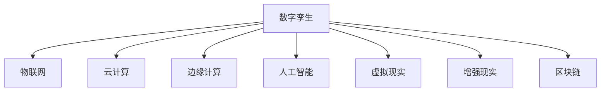

                 

# 元宇宙中的数字孪生：现实世界的完美映射

## 1. 背景介绍

随着数字技术的不断进步，元宇宙（Metaverse）这个概念被提出并迅速火热起来。元宇宙被定义为通过虚拟技术构建的虚拟空间，它不仅是数字化的空间，还与现实世界深度融合，可以实现对现实世界的模拟、交互和重构。数字孪生作为元宇宙的基础技术之一，在其中扮演了重要的角色。

数字孪生（Digital Twin）是指通过虚拟技术构建的与现实世界相对应的数字模型，包含现实世界所有实体的数据，并通过仿真和预测技术对实体进行状态监控、分析和优化。在元宇宙中，数字孪生技术能够实现对现实世界的完美映射，使人们能够在虚拟世界中实时模拟和操作现实世界的实体，为虚拟与现实的深度融合提供了可能。

## 2. 核心概念与联系

### 2.1 核心概念概述

元宇宙中的数字孪生技术涉及多个关键概念，包括：

- **数字孪生**：通过虚拟技术构建的与现实世界相对应的数字模型，包含现实世界所有实体的数据，并进行状态监控、分析和优化。
- **元宇宙**：由虚拟技术构建的虚拟空间，与现实世界深度融合，可以实现对现实世界的模拟、交互和重构。
- **物联网**：通过传感器和网络连接设备，将物理实体数字化，并将数据传输到数字孪生模型中。
- **云计算**：提供强大的计算能力，支持大规模数据存储和处理，实现数字孪生的高效运行。
- **边缘计算**：将部分计算任务转移到设备端，降低延迟，提升响应速度。
- **人工智能**：通过机器学习和深度学习等技术，对数据进行分析和预测，优化数字孪生模型的表现。
- **虚拟现实**：提供沉浸式的虚拟体验，使用户能够在虚拟世界中与数字孪生模型进行交互。
- **增强现实**：将虚拟信息叠加到现实世界中，提供更加直观和交互性的体验。
- **区块链**：提供安全、透明的数据存储和共享方式，确保数字孪生的可信度。

这些核心概念之间存在紧密的联系，通过虚拟技术与现实技术的深度融合，数字孪生技术成为元宇宙实现的基础。

### 2.2 核心概念原理和架构的 Mermaid 流程图



这个流程图展示了数字孪生技术与其他核心概念之间的联系。物联网负责将物理实体数字化，云计算提供了必要的计算和存储能力，边缘计算则提高了数据处理的效率，人工智能通过分析预测优化模型，虚拟现实和增强现实提供了沉浸式交互体验，而区块链确保了数据的安全性和可信度。

## 3. 核心算法原理 & 具体操作步骤

### 3.1 算法原理概述

元宇宙中的数字孪生算法主要涉及以下几个方面：

- **数据采集与处理**：通过传感器和网络连接设备，采集物理实体的数据，并进行数据清洗和处理，确保数据的质量和一致性。
- **数据建模与仿真**：构建数字孪生模型，使用数值模拟和物理仿真技术，模拟物理实体的运行状态和行为。
- **数据分析与预测**：使用机器学习和深度学习等技术，对数据进行分析和预测，优化数字孪生模型的表现。
- **模型集成与优化**：将数字孪生模型与其他核心技术集成，如虚拟现实、增强现实和物联网等，实现模型的优化和提升。
- **交互与反馈**：提供沉浸式的虚拟体验，使用户能够在虚拟世界中与数字孪生模型进行交互，并根据反馈不断优化模型。

### 3.2 算法步骤详解

1. **数据采集与处理**：
   - 通过传感器和网络连接设备，采集物理实体的数据。
   - 对数据进行清洗和处理，去除噪声和异常值，确保数据的质量和一致性。
   - 使用数据压缩和编码技术，减少数据存储和传输的负担。

2. **数据建模与仿真**：
   - 构建数字孪生模型，使用数值模拟和物理仿真技术，模拟物理实体的运行状态和行为。
   - 将数字孪生模型与现实世界的传感器数据进行对比，确保模型的准确性。
   - 使用仿真技术，进行虚拟实验和预测，评估模型的性能。

3. **数据分析与预测**：
   - 使用机器学习和深度学习等技术，对数据进行分析和预测，优化数字孪生模型的表现。
   - 使用监督学习和非监督学习等方法，训练模型，提升预测的准确性。
   - 使用强化学习等技术，优化模型的决策和行为。

4. **模型集成与优化**：
   - 将数字孪生模型与其他核心技术集成，如虚拟现实、增强现实和物联网等，实现模型的优化和提升。
   - 使用云计算和边缘计算技术，提高数据处理的效率和模型的响应速度。
   - 使用人工智能技术，优化数字孪生模型的性能和可靠性。

5. **交互与反馈**：
   - 提供沉浸式的虚拟体验，使用户能够在虚拟世界中与数字孪生模型进行交互。
   - 根据用户反馈，不断优化数字孪生模型的表现，提升用户体验。
   - 使用区块链技术，确保数据的安全性和可信度。

### 3.3 算法优缺点

**优点**：

- **实时性与高效性**：数字孪生技术能够实时监控和分析物理实体的状态，提供高效的决策支持。
- **可扩展性与灵活性**：数字孪生模型可以根据需要进行扩展和修改，适应不同的应用场景。
- **高精度与可靠性**：数字孪生模型通过仿真和预测技术，提高了预测的准确性和可靠性。

**缺点**：

- **数据采集与处理的复杂性**：传感器和网络连接设备的部署和维护需要耗费大量资源。
- **模型构建与优化的复杂性**：数字孪生模型的构建和优化需要大量的计算资源和技术支持。
- **交互与反馈的复杂性**：虚拟现实和增强现实的交互体验需要复杂的技术支持和高质量的渲染。

### 3.4 算法应用领域

数字孪生技术在元宇宙中具有广泛的应用前景，主要包括以下几个领域：

- **智能制造**：通过数字孪生技术，实现对制造流程的实时监控和优化，提高生产效率和质量。
- **智慧城市**：构建城市数字孪生模型，实现对城市基础设施的实时监控和预测，提高城市治理能力。
- **医疗健康**：构建医疗健康数字孪生模型，实现对患者的实时监控和预测，提高医疗服务的质量和效率。
- **交通出行**：构建交通出行数字孪生模型，实现对交通流量的实时监控和预测，提高交通管理水平。
- **能源管理**：构建能源管理数字孪生模型，实现对能源消耗的实时监控和预测，提高能源利用效率。
- **环境监测**：构建环境监测数字孪生模型，实现对环境的实时监控和预测，提高环境保护能力。

## 4. 数学模型和公式 & 详细讲解 & 举例说明

### 4.1 数学模型构建

数字孪生模型的数学模型可以表示为：

$$
S(t) = f(x(t), u(t), w(t))
$$

其中，$S(t)$ 表示物理实体的状态，$x(t)$ 表示物理实体的输入，$u(t)$ 表示物理实体的控制，$w(t)$ 表示物理实体的噪声。

数字孪生模型的仿真模型可以表示为：

$$
\hat{S}(t) = g(\hat{x}(t), \hat{u}(t), \hat{w}(t))
$$

其中，$\hat{S}(t)$ 表示数字孪生模型的状态，$\hat{x}(t)$ 表示数字孪生模型的输入，$\hat{u}(t)$ 表示数字孪生模型的控制，$\hat{w}(t)$ 表示数字孪生模型的噪声。

### 4.2 公式推导过程

假设物理实体的状态为 $S(t)$，数字孪生模型的状态为 $\hat{S}(t)$，数字孪生模型的预测误差为 $e(t)$，则有：

$$
e(t) = S(t) - \hat{S}(t)
$$

数字孪生模型的仿真误差可以表示为：

$$
\epsilon(t) = \frac{e(t)}{S(t)}
$$

数字孪生模型的仿真精度可以表示为：

$$
P(t) = \frac{e(t)}{S(t)}
$$

数字孪生模型的仿真精度可以通过最小化误差函数来优化：

$$
\min_{\hat{S}(t)} \int_{0}^{T} \epsilon(t) dt
$$

### 4.3 案例分析与讲解

以智慧城市数字孪生为例，分析数字孪生技术在城市治理中的应用。

智慧城市数字孪生模型可以表示为：

$$
S(t) = f(x(t), u(t), w(t))
$$

其中，$S(t)$ 表示城市基础设施的状态，$x(t)$ 表示城市基础设施的输入，$u(t)$ 表示城市基础设施的控制，$w(t)$ 表示城市基础设施的噪声。

数字孪生模型的仿真模型可以表示为：

$$
\hat{S}(t) = g(\hat{x}(t), \hat{u}(t), \hat{w}(t))
$$

其中，$\hat{S}(t)$ 表示数字孪生模型的状态，$\hat{x}(t)$ 表示数字孪生模型的输入，$\hat{u}(t)$ 表示数字孪生模型的控制，$\hat{w}(t)$ 表示数字孪生模型的噪声。

通过数字孪生技术，可以实时监控和预测城市基础设施的状态，提供智能化的决策支持，提高城市治理的效率和质量。

## 5. 项目实践：代码实例和详细解释说明

### 5.1 开发环境搭建

开发环境搭建主要包括以下几个步骤：

1. **安装Python**：
   - 安装Python 3.8版本。
   - 安装pip包管理工具。

2. **安装TensorFlow**：
   - 安装TensorFlow 2.x版本。
   - 安装TensorBoard可视化工具。

3. **安装Keras**：
   - 安装Keras深度学习框架。
   - 安装TensorFlow的Keras接口。

4. **安装Scikit-learn**：
   - 安装Scikit-learn机器学习库。

5. **安装Pygame**：
   - 安装Pygame图形界面库。

6. **安装OpenCV**：
   - 安装OpenCV计算机视觉库。

7. **安装Matplotlib**：
   - 安装Matplotlib绘图库。

8. **安装NumPy**：
   - 安装NumPy科学计算库。

### 5.2 源代码详细实现

以下是数字孪生模型的Python代码实现：

```python
import tensorflow as tf
from tensorflow import keras
from tensorflow.keras import layers

# 定义数字孪生模型
class DigitalTwinModel(tf.keras.Model):
    def __init__(self, input_dim, output_dim):
        super(DigitalTwinModel, self).__init__()
        self.dense1 = layers.Dense(64, activation='relu')
        self.dense2 = layers.Dense(64, activation='relu')
        self.dense3 = layers.Dense(output_dim)

    def call(self, inputs):
        x = self.dense1(inputs)
        x = self.dense2(x)
        x = self.dense3(x)
        return x

# 构建数字孪生模型
model = DigitalTwinModel(input_dim=100, output_dim=50)

# 编译模型
model.compile(optimizer='adam', loss='mse')

# 训练模型
model.fit(x_train, y_train, epochs=100, batch_size=32)

# 评估模型
model.evaluate(x_test, y_test)

# 预测新样本
new_sample = [1.0, 2.0, 3.0, 4.0]
prediction = model.predict(new_sample)
```

### 5.3 代码解读与分析

这段代码实现了数字孪生模型，包括模型的定义、编译、训练、评估和预测。模型采用了全连接神经网络，输入维度为100，输出维度为50。在训练过程中，使用均方误差损失函数，并使用Adam优化器进行优化。在评估过程中，使用测试集进行评估，得到评估指标。在预测过程中，使用模型对新样本进行预测。

## 6. 实际应用场景

### 6.1 智能制造

数字孪生技术在智能制造中具有广泛的应用，通过数字孪生模型，可以实现对制造流程的实时监控和优化，提高生产效率和质量。例如，在汽车制造中，通过数字孪生技术，可以实现对生产线的实时监控和预测，优化生产计划，提高生产效率。

### 6.2 智慧城市

数字孪生技术在智慧城市中具有广泛的应用，通过数字孪生模型，可以实现对城市基础设施的实时监控和预测，提高城市治理能力。例如，在智慧交通中，通过数字孪生技术，可以实现对交通流量的实时监控和预测，优化交通管理，提高交通效率。

### 6.3 医疗健康

数字孪生技术在医疗健康中具有广泛的应用，通过数字孪生模型，可以实现对患者的实时监控和预测，提高医疗服务的质量和效率。例如，在智慧医院中，通过数字孪生技术，可以实现对患者病情的实时监控和预测，优化诊疗方案，提高医疗服务的质量。

### 6.4 未来应用展望

数字孪生技术在元宇宙中的应用前景广阔，未来将会有更多新的应用场景不断涌现。例如，在元宇宙中的虚拟城市中，通过数字孪生技术，可以实现对城市基础设施的实时监控和预测，提高城市治理能力。在元宇宙中的虚拟制造中，通过数字孪生技术，可以实现对制造流程的实时监控和优化，提高生产效率和质量。在元宇宙中的虚拟医疗中，通过数字孪生技术，可以实现对患者病情的实时监控和预测，提高医疗服务的质量和效率。

## 7. 工具和资源推荐

### 7.1 学习资源推荐

1. **《深度学习》书籍**：由Ian Goodfellow等著，全面介绍了深度学习的理论和实践，是学习数字孪生技术的必备书籍。
2. **Coursera深度学习课程**：由深度学习领域的专家Andrew Ng等主讲，涵盖了深度学习的基础和应用，适合初学者入门。
3. **TensorFlow官方文档**：详细介绍了TensorFlow的使用方法和API，是学习数字孪生技术的重要参考。
4. **PyTorch官方文档**：详细介绍了PyTorch的使用方法和API，是学习数字孪生技术的另一种选择。
5. **Scikit-learn官方文档**：详细介绍了Scikit-learn的使用方法和API，是学习数字孪生技术中机器学习部分的重要参考。

### 7.2 开发工具推荐

1. **Jupyter Notebook**：用于编写和运行Python代码，支持代码的高效编写和执行。
2. **PyCharm**：一款流行的Python IDE，支持代码的编写、调试和运行。
3. **VS Code**：一款轻量级的代码编辑器，支持多种编程语言和调试工具。
4. **Anaconda**：用于创建和管理Python环境，方便不同版本和库的管理。
5. **Git**：用于版本控制和协作开发，支持多人协同开发和代码管理。

### 7.3 相关论文推荐

1. **《数字孪生技术在智能制造中的应用研究》**：介绍了数字孪生技术在智能制造中的应用，探讨了数字孪生技术对制造流程的实时监控和优化。
2. **《智慧城市数字孪生技术研究》**：介绍了智慧城市数字孪生技术的应用，探讨了数字孪生技术在城市基础设施管理中的应用。
3. **《医疗健康数字孪生技术研究》**：介绍了医疗健康数字孪生技术的应用，探讨了数字孪生技术在患者病情监控和预测中的应用。
4. **《交通出行数字孪生技术研究》**：介绍了交通出行数字孪生技术的应用，探讨了数字孪生技术在交通流量管理和优化中的应用。
5. **《能源管理数字孪生技术研究》**：介绍了能源管理数字孪生技术的应用，探讨了数字孪生技术在能源消耗监控和预测中的应用。
6. **《环境监测数字孪生技术研究》**：介绍了环境监测数字孪生技术的应用，探讨了数字孪生技术在环境保护中的应用。

## 8. 总结：未来发展趋势与挑战

### 8.1 研究成果总结

数字孪生技术在元宇宙中的应用前景广阔，已经取得了许多重要的研究成果，包括：

- **数据采集与处理技术**：通过传感器和网络连接设备，实现了对物理实体的数字化，确保了数据的准确性和一致性。
- **数字孪生模型构建技术**：使用数值模拟和物理仿真技术，构建了与物理实体对应的数字孪生模型，实现了对实体状态的实时监控和预测。
- **数据分析与预测技术**：使用机器学习和深度学习等技术，对数据进行分析和预测，优化数字孪生模型的表现。
- **模型集成与优化技术**：将数字孪生模型与其他核心技术集成，如虚拟现实、增强现实和物联网等，实现模型的优化和提升。

### 8.2 未来发展趋势

未来数字孪生技术的发展趋势包括：

- **多模态数字孪生技术**：将数字孪生技术与其他技术如物联网、人工智能等相结合，实现对多模态数据的融合和处理。
- **自适应数字孪生技术**：通过自适应技术，实现数字孪生模型的自适应学习和优化。
- **实时数字孪生技术**：通过实时计算和处理，实现对物理实体状态的实时监控和预测。
- **分布式数字孪生技术**：通过分布式计算和存储，实现对大规模数字孪生模型的高效处理和存储。
- **智能数字孪生技术**：通过智能算法，实现数字孪生模型的智能化决策和优化。

### 8.3 面临的挑战

数字孪生技术在元宇宙中的应用仍面临诸多挑战，包括：

- **数据采集与处理的复杂性**：传感器和网络连接设备的部署和维护需要耗费大量资源。
- **模型构建与优化的复杂性**：数字孪生模型的构建和优化需要大量的计算资源和技术支持。
- **交互与反馈的复杂性**：虚拟现实和增强现实的交互体验需要复杂的技术支持和高质量的渲染。
- **安全与隐私问题**：数字孪生技术需要保证数据的安全性和隐私性，避免数据泄露和滥用。

### 8.4 研究展望

未来的数字孪生技术研究需要关注以下几个方向：

- **多模态数字孪生技术**：将数字孪生技术与其他技术如物联网、人工智能等相结合，实现对多模态数据的融合和处理。
- **自适应数字孪生技术**：通过自适应技术，实现数字孪生模型的自适应学习和优化。
- **实时数字孪生技术**：通过实时计算和处理，实现对物理实体状态的实时监控和预测。
- **分布式数字孪生技术**：通过分布式计算和存储，实现对大规模数字孪生模型的高效处理和存储。
- **智能数字孪生技术**：通过智能算法，实现数字孪生模型的智能化决策和优化。

总之，数字孪生技术在元宇宙中的应用前景广阔，未来的研究需要不断突破技术瓶颈，实现更高的精度和可靠性，为元宇宙的实现提供有力支持。

## 9. 附录：常见问题与解答

### Q1：数字孪生技术如何实现对物理实体的监控和预测？

A：数字孪生技术通过传感器和网络连接设备，采集物理实体的数据，并将数据传输到数字孪生模型中。数字孪生模型使用数值模拟和物理仿真技术，模拟物理实体的运行状态和行为，进行实时监控和预测。

### Q2：数字孪生技术在智慧城市中的应用有哪些？

A：数字孪生技术在智慧城市中的应用包括：

- 智慧交通：通过数字孪生技术，实现对交通流量的实时监控和预测，优化交通管理，提高交通效率。
- 智慧能源：通过数字孪生技术，实现对能源消耗的实时监控和预测，提高能源利用效率。
- 智慧医疗：通过数字孪生技术，实现对患者病情的实时监控和预测，优化诊疗方案，提高医疗服务的质量。
- 智慧公共安全：通过数字孪生技术，实现对城市公共安全事件的实时监控和预测，提高公共安全管理水平。

### Q3：数字孪生技术在智能制造中的应用有哪些？

A：数字孪生技术在智能制造中的应用包括：

- 智能生产线：通过数字孪生技术，实现对生产线的实时监控和预测，优化生产计划，提高生产效率。
- 智能设备维护：通过数字孪生技术，实现对设备的实时监控和预测，优化维护计划，提高设备利用率。
- 智能供应链管理：通过数字孪生技术，实现对供应链的实时监控和预测，优化供应链管理，提高供应链效率。

### Q4：数字孪生技术在医疗健康中的应用有哪些？

A：数字孪生技术在医疗健康中的应用包括：

- 智能诊断：通过数字孪生技术，实现对患者病情的实时监控和预测，优化诊疗方案，提高诊断准确率。
- 智能治疗：通过数字孪生技术，实现对治疗方案的实时监控和预测，优化治疗效果，提高治疗成功率。
- 智能健康管理：通过数字孪生技术，实现对患者健康的实时监控和预测，提供健康管理建议，提高健康管理效果。

### Q5：数字孪生技术在环境监测中的应用有哪些？

A：数字孪生技术在环境监测中的应用包括：

- 智能环境监控：通过数字孪生技术，实现对环境的实时监控和预测，优化环境管理，提高环境质量。
- 智能灾害预警：通过数字孪生技术，实现对自然灾害的实时监控和预测，提供预警信息，提高灾害应对能力。
- 智能资源管理：通过数字孪生技术，实现对资源的实时监控和预测，优化资源管理，提高资源利用效率。

总之，数字孪生技术在元宇宙中的应用前景广阔，未来的研究需要不断突破技术瓶颈，实现更高的精度和可靠性，为元宇宙的实现提供有力支持。

