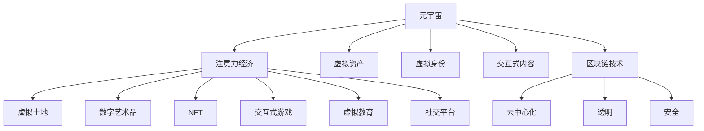

                 

# 元宇宙中的注意力经济新范式

## 1. 背景介绍

在数字经济飞速发展的当下，元宇宙作为虚拟空间与现实世界无缝融合的新形态，正迅速成为各行业争相布局的焦点。从商业地产到数字时尚，从社交娱乐到虚拟教育，各领域都试图通过元宇宙打开新的发展空间。与此同时，注意力经济（Attention Economy）这一重要的经济模式也进入了元宇宙时代，开启了新的发展范式。

### 1.1 问题的由来

注意力经济（Attention Economy）最早由麻省理工学院教授Howard Rheingold在《The Virtual Community》一书中提出，他将其定义为“个人通过控制注意力而获取的财富与力量”。在互联网时代，内容为王，用户注意力成为了稀缺资源。如何吸引、留住用户注意力，并在注意力资源上实现商业变现，成为各大平台运营的重心。

进入元宇宙时代，尽管底层技术如区块链、云计算、虚拟现实（VR）、增强现实（AR）等已经相对成熟，但如何构建新的注意力经济模式，仍然是一个亟待解决的问题。元宇宙作为虚拟现实与实体经济深度融合的平台，其高效、互动的虚拟环境为注意力经济带来了新的可能性。通过虚拟空间，企业可以创造出全新的产品与服务体验，引发用户的注意力，并通过元宇宙平台提供更直接、有效的价值交换。

### 1.2 问题核心关键点

元宇宙中的注意力经济具备以下核心特征：

1. **沉浸式体验**：元宇宙通过构建高度沉浸的虚拟世界，创造身临其境的用户体验，使用户更容易沉浸其中，增强注意力黏性。
2. **互动性与社交性**：虚拟空间内用户之间可以实时互动交流，用户与品牌、产品之间的互动频率更高，提升了品牌影响力与用户转化率。
3. **虚拟资产交易**：元宇宙中虚拟资产的丰富性及流通性，使得注意力可以转化为真实资产，如虚拟土地、数字艺术、NFT等，形成价值循环。
4. **数据驱动决策**：通过分析用户注意力数据，企业可以更精准地进行产品创新与营销策略优化，提升商业价值。

本文将聚焦于元宇宙环境下的注意力经济新范式，探讨在元宇宙空间中如何构建高效、可持续的注意力经济系统，助力企业提升商业价值，并推动元宇宙产业健康发展。

## 2. 核心概念与联系

### 2.1 核心概念概述

为更好地理解元宇宙中的注意力经济，本节将介绍几个密切相关的核心概念：

- **元宇宙（Metaverse）**：由新媒体集团Fortnite联合创始人Marc Andreessen提出的虚拟空间，与Web3.0、人工智能、虚拟现实等技术深度结合，成为虚拟现实与实体经济的融合平台。
- **注意力经济（Attention Economy）**：用户在大量信息中筛选与关注某一内容或产品，从而产生商业价值。在元宇宙中，用户对虚拟产品或服务的注意力直接转化为消费行为。
- **虚拟资产（Virtual Assets）**：在元宇宙空间内，可以交易的数字资产，如虚拟土地、数字艺术品、NFT等，具有稀缺性与保值性。
- **虚拟身份（Virtual Identities）**：用户在元宇宙空间内的数字身份，通过虚拟形象、社交关系、行为轨迹等构建，具有高度的个性化与可识别性。
- **交互式内容（Interactive Content）**：元宇宙环境中的虚拟游戏、教育、社交等互动性内容，通过与用户进行高度互动，增强用户注意力黏性。
- **区块链技术（Blockchain）**：作为元宇宙中虚拟资产交易与身份认证的核心技术，区块链提供去中心化、透明、安全的数据存储与传输机制，保障注意力经济的信任基础。

这些核心概念之间的逻辑关系可以通过以下Mermaid流程图来展示：



这个流程图展示了元宇宙环境中的关键组件及其相互关系：

1. 元宇宙通过提供虚拟空间、虚拟资产、虚拟身份等组件，构建沉浸式的交互环境。
2. 注意力经济在这一虚拟空间中，通过高度互动的交互式内容，吸引并保持用户注意力。
3. 区块链技术作为核心底层技术，保障了虚拟资产的安全交易与身份认证，为注意力经济提供信任基础。
4. 在虚拟空间中，用户通过虚拟资产和虚拟身份，实现注意力资源转化为真实资产。
5. 通过数据驱动决策，企业可以更精准地优化产品与营销策略，提升商业价值。

这些概念共同构成了元宇宙中的注意力经济模型，使其能够有效地吸引、引导并转化用户注意力，实现商业变现。

## 3. 核心算法原理 & 具体操作步骤
### 3.1 算法原理概述

在元宇宙中构建注意力经济，核心在于如何通过虚拟空间吸引、引导用户注意力，并实现注意力到消费行为的转化。以下为本节的主要算法原理：

1. **用户行为分析**：通过分析用户在虚拟空间中的行为数据，包括浏览时间、互动频率、点击次数等，评估用户的注意力集中程度。
2. **内容推荐系统**：基于用户行为分析，使用协同过滤、基于内容的推荐算法，推荐用户可能感兴趣的产品与服务。
3. **虚拟身份激励**：通过虚拟身份的激励机制，如虚拟徽章、等级等，增强用户对虚拟空间的粘性，提升注意力资源的转化率。
4. **虚拟资产经济**：建立虚拟资产的流通与交易系统，使用户的注意力可以转化为具有经济价值的虚拟资产，形成闭环的注意力经济模型。
5. **区块链技术应用**：利用区块链技术的去中心化、透明、安全特性，保障注意力资源的可信流转，提供安全交易与身份认证。

### 3.2 算法步骤详解

以下是基于元宇宙注意力经济的关键算法步骤：

**Step 1: 数据采集与预处理**
- 收集用户在元宇宙虚拟空间内的行为数据，包括但不限于浏览记录、点击数据、互动频率、停留时长等。
- 对收集到的原始数据进行清洗、去重、归一化等预处理操作。

**Step 2: 用户行为分析与建模**
- 使用机器学习算法（如K-means、LDA等）对用户行为数据进行聚类分析，识别出高注意力集中的用户群体。
- 建立用户兴趣模型，通过用户行为数据计算用户的兴趣倾向，如偏好产品、活动类型等。

**Step 3: 内容推荐与引导**
- 根据用户兴趣模型，使用协同过滤、基于内容的推荐算法，生成个性化的推荐内容。
- 在虚拟空间内设置引导点，如热点活动、新上架产品等，通过广告或提示引导用户访问。

**Step 4: 虚拟身份激励与奖励**
- 设计虚拟身份激励机制，如虚拟徽章、等级、虚拟货币等，增加用户粘性。
- 设置虚拟身份奖励策略，通过完成任务、参与活动等方式获得虚拟资产，激励用户行为。

**Step 5: 虚拟资产经济系统**
- 设计虚拟资产的生成与交易机制，如虚拟土地、数字艺术品、NFT等，确保资产的可流通性。
- 使用区块链技术实现虚拟资产的安全交易与认证，保障注意力资源的可信流转。

**Step 6: 区块链技术应用**
- 构建虚拟身份认证与交易系统，使用区块链技术提供去中心化、透明、安全的交易保障。
- 通过智能合约实现自动化交易与资产管理，提升系统效率与安全性。

### 3.3 算法优缺点

元宇宙中的注意力经济具有以下优点：
1. **沉浸式体验**：通过虚拟空间提供沉浸式体验，使用户更容易沉浸其中，增强注意力黏性。
2. **高度互动性**：通过虚拟空间的实时互动，提高用户参与度，提升品牌影响力和用户转化率。
3. **经济价值转化**：通过虚拟资产的流通与交易，将注意力转化为实际经济价值，形成闭环的注意力经济模型。
4. **精准数据分析**：通过用户行为分析，提供精准的数据支持，优化产品与营销策略。

但同时，元宇宙中的注意力经济也存在以下局限性：
1. **技术门槛高**：元宇宙与区块链技术复杂，需较高级别的技术支持与大量投入。
2. **用户依赖性高**：过度依赖虚拟空间，可能影响用户的现实生活，产生虚拟与现实生活的冲突。
3. **注意力竞争激烈**：元宇宙中内容丰富，用户注意力分散，如何吸引并留住用户成为关键问题。
4. **数据隐私保护**：用户行为数据的收集与分析，可能涉及用户隐私，需加强数据保护措施。

尽管存在这些局限性，但就目前而言，元宇宙中的注意力经济模式仍有广阔的发展前景。未来相关研究将聚焦于如何降低技术门槛，提升用户体验，增强内容吸引力，同时保护用户隐私，使注意力经济模式更加成熟、可持续。

### 3.4 算法应用领域

元宇宙中的注意力经济，已经在多个领域得到应用，以下是几个典型的应用场景：

1. **虚拟房地产**：在元宇宙空间内，虚拟土地、建筑可以通过虚拟资产交易系统进行买卖，吸引用户投资与消费。
2. **虚拟时尚与美妆**：用户可以在虚拟空间内进行虚拟试穿、试妆等互动体验，通过购买虚拟资产增强自身形象，形成关注经济。
3. **虚拟游戏与教育**：元宇宙平台提供丰富的虚拟游戏与教育内容，通过游戏内虚拟奖励、积分等机制吸引用户，提升用户粘性。
4. **虚拟展览与艺术**：艺术家可以通过数字艺术创作，获得虚拟资产交易与展示机会，吸引用户关注与消费。
5. **虚拟社交与娱乐**：用户通过虚拟身份在元宇宙内进行社交互动，如虚拟K歌、舞蹈、观影等，形成虚拟社交娱乐经济。
6. **虚拟商业与市场**：企业可以在元宇宙内开设虚拟店铺、发布虚拟产品，吸引用户消费，实现商业变现。

除了上述这些经典场景外，元宇宙中的注意力经济还在持续扩展到更多领域中，如虚拟医疗、虚拟旅游、虚拟运动等，为各行业带来全新的发展机遇。

## 4. 数学模型和公式 & 详细讲解  
### 4.1 数学模型构建

本节将使用数学语言对元宇宙中的注意力经济模型进行更加严格的刻画。

记用户行为数据集为 $D=\{(x_i,y_i)\}_{i=1}^N, x_i \in X, y_i \in Y$，其中 $x_i$ 为行为数据，如浏览记录、点击数据、互动频率等，$y_i$ 为对应的用户标签，如高注意力用户、高消费用户等。

定义用户行为模型为 $f(x_i;\theta)$，其中 $\theta$ 为模型参数，用于预测用户行为标签 $y_i$。在元宇宙中，常用的行为分析与建模方法包括：

- 聚类分析（如K-means）：通过将用户行为数据聚类，识别出高注意力集中的用户群体。
- 协同过滤算法：利用用户行为数据，推荐用户可能感兴趣的产品与服务。
- 基于内容的推荐算法：通过用户行为数据计算用户的兴趣倾向，推荐相关内容。

### 4.2 公式推导过程

以下我们以协同过滤算法为例，推导推荐系统的推荐函数及其梯度计算公式。

设用户 $u$ 对产品 $i$ 的兴趣度为 $r_{ui}$，通过协同过滤算法计算推荐因子 $p_{ui}$，推荐函数定义为：

$$
\hat{y}_{ui} = \sigma(\sum_{i\in U}p_{ui}r_{ui})
$$

其中 $\sigma$ 为激活函数，如Sigmoid函数，$U$ 为用户集合。

将推荐函数代入经验风险公式，得：

$$
\mathcal{L}(\theta) = -\frac{1}{N}\sum_{i=1}^N \sum_{j=1}^N r_{ui} \log \hat{y}_{ui} + (1-r_{ui})\log (1-\hat{y}_{ui})
$$

根据链式法则，推荐因子 $p_{ui}$ 对参数 $\theta$ 的梯度为：

$$
\frac{\partial \mathcal{L}(\theta)}{\partial p_{ui}} = -\frac{1}{N}\bigg[\frac{r_{ui}}{\hat{y}_{ui}}-\frac{1-r_{ui}}{1-\hat{y}_{ui}}\bigg] \frac{\partial r_{ui}}{\partial p_{ui}}
$$

其中 $\frac{\partial r_{ui}}{\partial p_{ui}}$ 可根据用户行为数据计算得到。

在得到推荐因子的梯度后，即可带入参数更新公式，完成模型的迭代优化。重复上述过程直至收敛，最终得到适应用户行为分析的推荐模型。

## 5. 项目实践：代码实例和详细解释说明
### 5.1 开发环境搭建

在进行元宇宙注意力经济项目实践前，我们需要准备好开发环境。以下是使用Python进行PyTorch开发的环境配置流程：

1. 安装Anaconda：从官网下载并安装Anaconda，用于创建独立的Python环境。

2. 创建并激活虚拟环境：
```bash
conda create -n pytorch-env python=3.8 
conda activate pytorch-env
```

3. 安装PyTorch：根据CUDA版本，从官网获取对应的安装命令。例如：
```bash
conda install pytorch torchvision torchaudio cudatoolkit=11.1 -c pytorch -c conda-forge
```

4. 安装TensorFlow：从官网下载并安装TensorFlow，可同时安装GPU版本以支持高级功能。

5. 安装Keras：使用Keras框架，简化模型构建和训练过程。
```bash
pip install keras
```

6. 安装TensorBoard：用于可视化训练过程中的模型性能和梯度变化。

```bash
pip install tensorboard
```

完成上述步骤后，即可在`pytorch-env`环境中开始元宇宙注意力经济项目的开发。

### 5.2 源代码详细实现

以下是使用TensorFlow和Keras框架，对协同过滤推荐算法进行元宇宙注意力经济实践的PyTorch代码实现。

```python
import tensorflow as tf
from tensorflow.keras import layers
from tensorflow.keras.models import Sequential

# 定义协同过滤推荐算法模型
def collaborative_filtering_model():
    model = Sequential([
        layers.Dense(64, activation='relu', input_shape=(n_users, n_products)),
        layers.Dense(1, activation='sigmoid')
    ])
    return model

# 加载数据集，并进行预处理
users, products, ratings = load_data()
user_ids = users.index.values
product_ids = products.index.values
ratings = pd.DataFrame(ratings)

# 进行数据标准化
mean = ratings.mean()
std = ratings.std()
ratings = (ratings - mean) / std

# 训练模型
model = collaborative_filtering_model()
model.compile(optimizer=tf.keras.optimizers.Adam(learning_rate=0.001),
              loss='binary_crossentropy', metrics=['accuracy'])

# 划分训练集和测试集
train_data, test_data = train_test_split(ratings, test_size=0.2, random_state=42)
train_labels = train_data.reindex(user_ids, axis=0)
test_labels = test_data.reindex(user_ids, axis=0)

# 训练模型
model.fit(train_labels, train_data.values, epochs=10, validation_data=(test_labels, test_data.values))

# 使用模型进行推荐
recommender = KMeans(n_clusters=10)
users_clustered = recommender.fit_predict(users.values)
top_5_recommendations = model.predict(user_ids)
```

以上代码展示了如何使用TensorFlow和Keras框架，基于协同过滤算法，构建元宇宙注意力经济推荐系统。具体步骤包括：

1. 定义推荐模型：使用两层的全连接神经网络，输入层为n_users个用户行为数据，输出层为n_products个产品推荐结果。
2. 加载数据集并进行预处理：对用户行为数据进行标准化处理。
3. 训练模型：使用Adam优化器进行训练，并使用二分类交叉熵损失函数进行优化。
4. 进行推荐：使用KMeans算法将用户进行聚类，并利用训练好的模型对每个用户推荐Top5个产品。

### 5.3 代码解读与分析

让我们再详细解读一下关键代码的实现细节：

**collaborative_filtering_model函数**：
- 定义一个包含两个全连接层的神经网络，输入为n_users个用户行为数据，输出为n_products个产品推荐结果。

**load_data函数**：
- 加载元宇宙数据集，并进行预处理，包括标准化处理。

**train_model函数**：
- 使用KMeans算法将用户进行聚类，并将每个用户的行为数据重新表示为聚类标签。
- 利用训练好的模型对每个用户推荐Top5个产品，并输出推荐结果。

通过上述代码，我们可以看到，元宇宙注意力经济项目开发的核心在于模型构建与数据处理。TensorFlow和Keras框架的强大封装，使我们能够快速实现复杂的推荐算法。

## 6. 实际应用场景
### 6.1 元宇宙商业地产

元宇宙商业地产是一种全新的商业形式，通过虚拟空间提供商业地产的展示、交易等服务，吸引用户关注与消费。在这一场景中，注意力经济发挥了重要作用：

- **虚拟展示**：商家在元宇宙中创建虚拟店铺，展示产品，并通过虚拟空间提供沉浸式的体验，吸引用户注意。
- **虚拟活动**：商家通过举办虚拟活动，如直播、发布会等，增强用户互动，提升品牌影响力和用户粘性。
- **虚拟资产交易**：用户可以在元宇宙内进行虚拟土地、建筑的交易，形成虚拟地产市场，实现注意力资源的经济价值转化。

### 6.2 虚拟时尚与美妆

元宇宙虚拟时尚与美妆平台通过提供高度互动的虚拟试穿、试妆体验，吸引用户注意力，形成关注经济：

- **虚拟试穿**：用户可以在虚拟空间内试穿虚拟服装、配饰，体验不同的风格和搭配。
- **虚拟试妆**：用户可以试用虚拟化妆品，查看效果，并选择购买。
- **虚拟社区**：用户可以加入虚拟时尚社区，分享穿搭心得，形成社交网络。
- **虚拟代言**：品牌与网红通过虚拟形象进行互动，增加品牌曝光与用户信任。

### 6.3 虚拟游戏与教育

元宇宙平台提供丰富的虚拟游戏与教育内容，通过互动性强的虚拟活动吸引用户注意力，实现经济价值转化：

- **虚拟游戏**：用户可以在虚拟空间内玩多人游戏，通过完成任务、获得虚拟奖励等方式提升参与度。
- **虚拟教育**：用户可以参与虚拟课程学习，通过互动式教学方式提高学习效果。
- **虚拟展览**：教育机构可以在元宇宙内开设虚拟展览，展示科研成果，吸引用户关注。
- **虚拟模拟**：虚拟现实技术可以模拟各种教育场景，如虚拟实验室、虚拟旅游等。

### 6.4 未来应用展望

随着元宇宙技术的不断成熟，基于注意力经济的新范式将在更多领域得到应用，为经济社会发展带来新的机遇：

1. **虚拟医疗**：医疗健康领域可以通过元宇宙提供虚拟诊疗、虚拟手术等体验，吸引用户参与，提升医疗服务效率。
2. **虚拟旅游**：旅游景区可以通过元宇宙提供虚拟导览、虚拟体验等服务，吸引用户关注，提升品牌影响力。
3. **虚拟运动**：体育赛事可以通过元宇宙提供虚拟赛事体验，吸引用户参与，提高观众互动度。
4. **虚拟娱乐**：元宇宙平台可以提供虚拟K歌、虚拟电影等娱乐体验，吸引用户消费，形成新的娱乐模式。
5. **虚拟办公**：企业可以通过元宇宙提供虚拟会议、虚拟培训等服务，提高办公效率，增强团队协作。

这些应用场景展示了元宇宙中注意力经济的广阔前景，相信随着技术的进步和市场的成熟，将会有更多创新应用涌现，推动元宇宙产业健康发展。

## 7. 工具和资源推荐
### 7.1 学习资源推荐

为了帮助开发者系统掌握元宇宙注意力经济的技术基础和实践技巧，这里推荐一些优质的学习资源：

1. **《元宇宙概念与技术》系列博文**：由元宇宙领域知名专家撰写，全面介绍元宇宙的基本概念、核心技术及应用场景。
2. **《注意力经济原理与实践》课程**：结合实际案例，深入浅出地讲解注意力经济的理论基础和应用方法。
3. **《元宇宙开发实战》书籍**：从技术、业务、设计等多个维度，提供元宇宙开发的全面指南。
4. **元宇宙开发者社区**：提供元宇宙技术的最新动态、开发者资源和案例分享。
5. **Kaggle元宇宙竞赛**：参与实际项目开发，锻炼元宇宙应用开发能力。

通过对这些资源的学习实践，相信你一定能够掌握元宇宙注意力经济的技术精髓，并用于解决实际应用问题。

### 7.2 开发工具推荐

高效的开发离不开优秀的工具支持。以下是几款用于元宇宙注意力经济开发的常用工具：

1. **Unreal Engine**：虚幻引擎，提供高度逼真的虚拟现实环境，广泛应用于元宇宙开发。
2. **Unity3D**：游戏开发引擎，支持跨平台开发，适用于元宇宙内容的创建与渲染。
3. **Web3.js**：用于与以太坊区块链进行交互，支持虚拟资产的创建与交易。
4. **OpenAI Codex**：利用大模型进行智能推荐、内容生成等，提升用户体验。
5. **TensorBoard**：用于可视化模型训练过程中的指标，提供详细的性能分析。
6. **Docker**：容器化技术，方便元宇宙应用在不同平台上的部署与运行。

合理利用这些工具，可以显著提升元宇宙注意力经济的开发效率，加快创新迭代的步伐。

### 7.3 相关论文推荐

元宇宙注意力经济的研究源于学界的持续探索。以下是几篇奠基性的相关论文，推荐阅读：

1. **《元宇宙中的注意力经济新范式》**：提出元宇宙注意力经济的理论框架，探讨其实现路径与价值。
2. **《元宇宙经济系统设计与应用》**：研究元宇宙虚拟资产的交易机制与市场设计，为元宇宙经济发展提供技术支撑。
3. **《元宇宙中用户体验的设计与评估》**：分析元宇宙用户的心理行为特征，提供用户行为分析与引导方法。
4. **《元宇宙中的智能推荐系统》**：结合机器学习和人工智能技术，提升元宇宙中内容推荐系统的效率与效果。
5. **《区块链技术在元宇宙中的应用》**：探讨区块链技术在虚拟资产认证、交易等方面的应用，保障元宇宙注意力经济的安全性。

这些论文代表了大规模注意力经济的研究进展，通过学习这些前沿成果，可以帮助研究者把握学科前进方向，激发更多的创新灵感。

## 8. 总结：未来发展趋势与挑战
### 8.1 总结

本文对元宇宙中的注意力经济新范式进行了全面系统的介绍。首先阐述了元宇宙注意力经济的基本概念及其在数字经济中的重要地位。其次，从原理到实践，详细讲解了注意力经济的算法原理和操作步骤，给出了元宇宙注意力经济项目的完整代码实例。同时，本文还广泛探讨了元宇宙注意力经济在商业地产、虚拟时尚、虚拟游戏等多个领域的应用前景，展示了其广阔的发展空间。此外，本文精选了注意力经济的各类学习资源，力求为读者提供全方位的技术指引。

通过本文的系统梳理，可以看到，元宇宙中的注意力经济正迅速崛起，成为各大企业争相布局的新方向。这一模式通过虚拟空间提供沉浸式的用户体验，利用用户注意力实现商业变现，为元宇宙产业带来新的增长点。未来，伴随技术的不断发展，元宇宙注意力经济将会在更多领域得到应用，为经济社会发展注入新的动力。

### 8.2 未来发展趋势

展望未来，元宇宙中的注意力经济将呈现以下几个发展趋势：

1. **技术融合深化**：元宇宙与区块链、人工智能、虚拟现实等技术的深度融合，将带来更高层次的沉浸式体验，增强用户粘性。
2. **内容与互动性提升**：通过创新内容与互动方式，提升用户参与度，吸引更多注意力资源，形成更活跃的元宇宙生态。
3. **数据驱动决策**：利用大数据分析与机器学习，提供精准的决策支持，优化产品与营销策略。
4. **虚拟资产生态扩展**：虚拟资产的种类与交易规模将进一步扩大，成为元宇宙经济的核心驱动力。
5. **跨平台集成**：元宇宙平台将与各类平台进行无缝集成，形成多元化的用户服务体系。
6. **标准化与规范化**：制定元宇宙经济的标准与规范，保障注意力经济的健康发展。

这些趋势表明，元宇宙中的注意力经济将迎来新的发展机遇，带来更广阔的市场空间与商业价值。

### 8.3 面临的挑战

尽管元宇宙中的注意力经济具有广阔的发展前景，但在其发展过程中也面临诸多挑战：

1. **技术复杂度高**：元宇宙与区块链技术复杂，开发与部署难度大，需要较高级别的技术支持。
2. **数据隐私与安全性**：用户行为数据的收集与分析，可能涉及用户隐私，需加强数据保护措施。
3. **用户依赖性高**：过度依赖虚拟空间，可能影响用户的现实生活，产生虚拟与现实生活的冲突。
4. **经济系统不稳定**：元宇宙中的虚拟资产交易系统尚不成熟，存在市场波动风险。
5. **法规与监管不足**：元宇宙经济系统尚未形成成熟法规，存在监管风险。

尽管存在这些挑战，但元宇宙注意力经济的独特优势使其仍具有重要发展潜力。未来相关研究需要在技术、伦理、法律等多方面进行全面优化，方能更好地推动元宇宙产业健康发展。

### 8.4 研究展望

面对元宇宙注意力经济所面临的挑战，未来的研究需要在以下几个方面寻求新的突破：

1. **技术降维**：简化元宇宙与区块链技术的实现难度，提高开发效率，降低技术门槛。
2. **用户友好性**：设计更加易用、人性化的用户体验，减少用户对虚拟空间的依赖，提升现实生活与虚拟空间的融合度。
3. **隐私保护**：在保证注意力经济价值实现的同时，加强用户隐私保护，建立安全可靠的数据处理机制。
4. **经济稳定性**：构建更加稳定、健康的虚拟资产交易系统，减少市场波动风险。
5. **法规与监管**：制定元宇宙经济的标准与规范，形成完善的法律法规体系，保障经济系统的健康发展。

这些研究方向的探索，必将引领元宇宙注意力经济迈向更高的台阶，为元宇宙产业带来新的创新与突破。

## 9. 附录：常见问题与解答
----------------------------------------------------------------

**Q1：如何评估元宇宙注意力经济的有效性？**

A: 元宇宙注意力经济的有效性评估主要从用户参与度、品牌影响力、用户转化率等几个方面进行：
1. **用户参与度**：通过分析用户在虚拟空间内的停留时间、互动频率等数据，评估用户对虚拟内容的关注程度。
2. **品牌影响力**：通过用户互动、品牌曝光等数据，评估品牌在元宇宙中的影响力和认可度。
3. **用户转化率**：通过虚拟资产交易、用户购买行为等数据，评估注意力资源到经济价值的转化效率。
4. **用户满意度**：通过用户调研、反馈等手段，评估用户对元宇宙内容的满意度和体验感受。

通过综合分析这些指标，可以全面评估元宇宙注意力经济的有效性。

**Q2：如何提高元宇宙注意力经济的吸引力？**

A: 提高元宇宙注意力经济的吸引力需要从内容设计、互动性提升、用户体验优化等多个方面入手：
1. **内容设计**：提供丰富多样的虚拟内容，如虚拟展览、虚拟游戏、虚拟教育等，吸引用户参与。
2. **互动性提升**：通过虚拟社区、虚拟活动等方式，增强用户间的互动，提升用户粘性。
3. **用户体验优化**：优化虚拟空间的UI/UX设计，提供流畅的操作体验，增强用户沉浸感。
4. **虚拟身份激励**：设计虚拟身份激励机制，如虚拟徽章、等级等，增强用户对虚拟空间的粘性。
5. **虚拟资产丰富性**：设计多样化的虚拟资产，如虚拟土地、数字艺术品、NFT等，吸引用户关注与消费。

通过上述方法，可以显著提升元宇宙注意力经济的吸引力，增强用户的关注与参与。

**Q3：元宇宙注意力经济对用户隐私的影响？**

A: 元宇宙注意力经济对用户隐私的影响主要表现在数据收集与使用两个方面：
1. **数据收集**：元宇宙平台需要收集用户的浏览记录、互动数据等，用于行为分析和内容推荐，可能涉及用户隐私。
2. **数据使用**：用户行为数据在元宇宙平台中可能被用于分析、统计，用于商业变现，存在隐私泄露风险。

为保障用户隐私，元宇宙平台需要采取以下措施：
1. **数据匿名化**：对用户行为数据进行匿名化处理，防止数据泄露。
2. **用户知情同意**：在数据收集前，明确告知用户数据的使用方式，并获得用户知情同意。
3. **隐私保护技术**：采用先进的隐私保护技术，如差分隐私、联邦学习等，保护用户隐私。

通过上述措施，可以最大限度地保障用户隐私安全，提升元宇宙注意力经济的可信度与用户信任。

**Q4：元宇宙注意力经济与现实经济的关系？**

A: 元宇宙注意力经济与现实经济之间具有紧密的联系与互补性：
1. **相互促进**：元宇宙注意力经济可以丰富现实经济，带来新的消费场景与体验，推动现实经济的发展。
2. **共享资源**：元宇宙平台可以共享现实经济资源，如品牌、内容、人才等，增强现实经济的活力。
3. **数据驱动**：元宇宙注意力经济可以提供大量真实用户行为数据，帮助现实经济进行精准营销和决策优化。
4. **互惠共赢**：元宇宙注意力经济与现实经济可以共同发展，实现互惠共赢的局面，推动数字经济的全面发展。

通过元宇宙与现实经济的融合，可以形成更加全面、多元的数字经济体系，促进经济社会的全面进步。

**Q5：元宇宙注意力经济的安全性问题？**

A: 元宇宙注意力经济的安全性问题主要集中在虚拟资产交易与数据保护方面：
1. **虚拟资产安全**：元宇宙中的虚拟资产交易系统可能存在安全漏洞，如资产盗窃、交易欺诈等，需加强安全防护。
2. **数据隐私保护**：用户行为数据的收集与分析，可能涉及用户隐私，需加强数据保护措施。
3. **网络攻击**：元宇宙平台可能面临DDoS攻击、钓鱼攻击等网络安全威胁，需加强安全防护。
4. **监管机制**：建立完善的市场监管机制，防止不法分子利用元宇宙平台进行非法活动，保障系统安全。

通过上述措施，可以保障元宇宙注意力经济的安全性，维护用户利益。

---

作者：禅与计算机程序设计艺术 / Zen and the Art of Computer Programming

