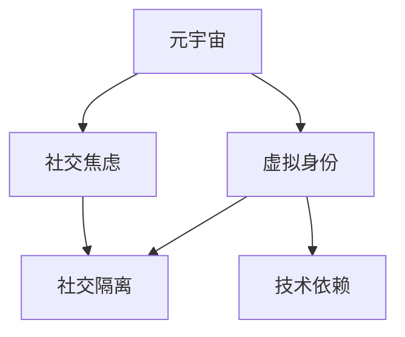

                 

# 元宇宙社交焦虑:虚拟世界中的人际交往障碍

## 1. 背景介绍

### 1.1 问题由来
随着虚拟现实（VR）和增强现实（AR）技术的成熟，以及移动互联网的广泛应用，元宇宙（Metaverse）的概念在近年来被广泛讨论。元宇宙是一个通过虚拟技术与现实世界紧密融合的全新社交空间，人们可以在其中进行各种虚拟活动，如社交互动、娱乐、购物等。然而，尽管元宇宙带来了前所未有的便利，但随之而来的社交焦虑问题也日益凸显，成为阻碍元宇宙发展的瓶颈。

### 1.2 问题核心关键点
元宇宙社交焦虑的核心问题在于，虚拟空间中的人际交往与现实世界存在诸多差异，这种差异可能导致用户产生孤独感、不信任感、社交压力等负面情绪，影响其在虚拟世界中的体验和活跃度。此外，元宇宙中的身份隐私、数据安全、技术依赖等问题也成为用户担忧的焦点。

### 1.3 问题研究意义
研究元宇宙社交焦虑问题，对于提升元宇宙的社交体验，促进其健康发展具有重要意义。通过深入分析虚拟世界中的社交障碍，可以制定更加人性化的社交设计，减少用户焦虑，提升用户粘性。同时，该研究还能为元宇宙技术的发展提供方向性指导，使其更好地服务于人类社会的数字化转型。

## 2. 核心概念与联系

### 2.1 核心概念概述

为了更好地理解元宇宙社交焦虑，本节将介绍几个核心概念及其相互关系：

- **元宇宙（Metaverse）**：一个通过虚拟技术与现实世界紧密融合的全新社交空间，包括虚拟现实（VR）、增强现实（AR）、混合现实（MR）等技术支持下的多维体验环境。
- **社交焦虑（Social Anxiety）**：指个体在社交情境中产生的过度紧张、恐惧和不安情绪，影响其社交能力和自我认同。
- **虚拟身份（Virtual Identity）**：用户在元宇宙中的虚拟形象或角色，代表其在虚拟世界中的存在。
- **社交隔离（Social Isolation）**：指个体在虚拟世界中的社交孤立状态，缺乏互动和联系。
- **技术依赖（Technology Dependency）**：用户在虚拟世界中对虚拟技术（如VR头盔、AR眼镜等）的依赖程度，可能影响其在现实世界中的社交能力。

这些核心概念之间的逻辑关系可以通过以下Mermaid流程图来展示：



这个流程图展示了大语言模型的核心概念及其之间的关系：

1. 元宇宙通过虚拟技术创造新的社交环境，但其虚拟性质可能带来社交焦虑。
2. 用户在元宇宙中构建虚拟身份，但该身份的虚拟性可能引发社交隔离。
3. 元宇宙中的技术依赖，可能削弱用户在现实世界的社交能力。
4. 社交焦虑、社交隔离和技术依赖相互影响，形成恶性循环。

## 3. 核心算法原理 & 具体操作步骤
### 3.1 算法原理概述

元宇宙社交焦虑问题的研究，本质上是探索虚拟世界中的社交障碍及其解决方案。其核心思想是通过分析元宇宙中的人际交往特点，发现潜在的社会心理机制，并提出相应的改进措施，以减少用户的社交焦虑。

形式化地，假设元宇宙用户为 $U$，社交焦虑程度为 $A$，虚拟身份为 $I$，社交隔离程度为 $S$，技术依赖程度为 $D$。则元宇宙社交焦虑的生成机制可以表示为：

$$
A = f(I, S, D)
$$

其中 $f$ 为影响社交焦虑程度的函数，可能包含多个子函数：

1. $I$：虚拟身份的特征（如外观、地位、互动对象等）对社交焦虑的影响。
2. $S$：社交隔离程度，即用户在虚拟世界中的孤立状态对社交焦虑的影响。
3. $D$：技术依赖程度，即用户对虚拟技术的依赖程度对社交焦虑的影响。

### 3.2 算法步骤详解

元宇宙社交焦虑的研究通常包括以下几个关键步骤：

**Step 1: 数据收集与预处理**
- 通过问卷调查、用户访谈等方式，收集用户在元宇宙中的社交行为、情感状态、技术使用频率等数据。
- 对数据进行清洗、去重、缺失值处理等预处理，确保数据质量。

**Step 2: 数据分析与建模**
- 使用统计学方法或机器学习算法（如回归分析、分类算法等），分析数据中各变量之间的关系。
- 构建元宇宙社交焦虑的预测模型，尝试识别影响社交焦虑的关键因素。

**Step 3: 特征工程**
- 设计虚拟身份、社交隔离、技术依赖等特征，并进行编码。
- 对特征进行降维、标准化等处理，以便于模型训练。

**Step 4: 模型训练与评估**
- 选择合适的算法（如线性回归、逻辑回归、决策树等），训练元宇宙社交焦虑的预测模型。
- 使用交叉验证等技术，评估模型的性能和泛化能力。
- 调整模型参数，优化模型表现。

**Step 5: 结果应用与优化**
- 根据模型预测结果，识别高焦虑用户，提供个性化的社交支持措施。
- 优化元宇宙的设计，减少社交隔离，降低技术依赖，提升用户社交体验。

### 3.3 算法优缺点

元宇宙社交焦虑的计算方法具有以下优点：

1. 量化研究：通过数据驱动的方法，可以更客观、量化地分析社交焦虑的产生和影响因素。
2. 针对性改进：能够有针对性地改进元宇宙的设计，减少用户焦虑，提升用户粘性。
3. 数据驱动优化：基于实际数据，模型的优化策略更具科学性和有效性。

同时，该方法也存在一些局限性：

1. 数据获取难度：用户情感状态的获取和量化较为困难，数据样本数量可能不足。
2. 隐私问题：涉及用户情感数据的收集和分析，存在隐私保护的挑战。
3. 模型复杂性：社交焦虑的影响因素众多，模型构建复杂度较高。
4. 应用落地难度：模型预测结果的实际应用效果，还需进一步在元宇宙中进行验证。

尽管存在这些局限性，但就目前而言，基于数据的计算方法仍是大语言模型微调研究的主流范式。未来相关研究的重点在于如何进一步提高数据的获取质量，优化模型算法，兼顾隐私保护和模型应用效果。

### 3.4 算法应用领域

元宇宙社交焦虑的计算方法，已在多个领域得到应用，例如：

- **元宇宙社交平台**：通过分析用户在虚拟世界中的社交行为，提供个性化的社交支持，减少焦虑，提升用户体验。
- **虚拟医疗**：研究用户在虚拟医疗环境中的焦虑水平，优化诊疗流程，减少患者的心理负担。
- **虚拟教育**：分析学生在虚拟学习环境中的焦虑情绪，提供针对性的心理辅导和教学建议。
- **虚拟工作**：评估员工在虚拟办公环境中的社交焦虑，优化工作设计，提高工作效率和满意度。
- **虚拟娱乐**：研究用户在虚拟游戏和娱乐环境中的社交体验，提供更自然、和谐的互动模式。

除了上述这些经典应用外，元宇宙社交焦虑的研究还将进一步拓展到更多场景中，如虚拟购物、虚拟旅游等，为元宇宙技术的发展提供新的方向。

## 4. 数学模型和公式 & 详细讲解 & 举例说明
### 4.1 数学模型构建

本节将使用数学语言对元宇宙社交焦虑的计算过程进行更加严格的刻画。

假设用户 $U_i$ 在元宇宙中的社交焦虑程度为 $A_i$，虚拟身份特征为 $I_i$，社交隔离程度为 $S_i$，技术依赖程度为 $D_i$。则元宇宙社交焦虑的生成机制可以表示为：

$$
A_i = \alpha_1 \cdot I_i + \alpha_2 \cdot S_i + \alpha_3 \cdot D_i + \epsilon
$$

其中 $\alpha_1, \alpha_2, \alpha_3$ 为模型系数，$\epsilon$ 为随机误差项。

### 4.2 公式推导过程

以下我们以二元回归模型为例，推导社交焦虑预测公式及其梯度计算。

假设模型 $f(I, S, D)$ 为线性回归模型，则：

$$
A = \alpha_1 \cdot I + \alpha_2 \cdot S + \alpha_3 \cdot D
$$

对于一个样本 $i$，其预测值为 $\hat{A}_i = \alpha_1 \cdot I_i + \alpha_2 \cdot S_i + \alpha_3 \cdot D_i$。则损失函数为：

$$
\ell(A_i, \hat{A}_i) = \frac{1}{2}(A_i - \hat{A}_i)^2
$$

全样本的损失函数为：

$$
\mathcal{L}(\alpha) = \frac{1}{N} \sum_{i=1}^N \ell(A_i, \hat{A}_i)
$$

最小化损失函数，得到系数 $\alpha$ 的估计值：

$$
\alpha = \mathop{\arg\min}_{\alpha} \mathcal{L}(\alpha)
$$

使用梯度下降算法，迭代更新 $\alpha$，直到收敛：

$$
\alpha \leftarrow \alpha - \eta \nabla_{\alpha}\mathcal{L}(\alpha)
$$

其中 $\eta$ 为学习率。

### 4.3 案例分析与讲解

以一个虚拟社交平台为例，分析用户在虚拟世界中的社交焦虑程度。

假设用户在虚拟平台上的虚拟身份 $I_i$ 包括外观、地位、互动对象等特征。社交隔离程度 $S_i$ 由用户在虚拟平台中的好友数量、参与活动频率等衡量。技术依赖程度 $D_i$ 由用户在虚拟平台上的设备使用频率、使用时间等衡量。

通过问卷调查，收集了100名用户在虚拟平台上的社交行为和情感状态数据，并进行数据清洗和标准化处理。构建元宇宙社交焦虑的预测模型，使用线性回归算法进行训练和验证。

训练后得到模型系数 $\alpha_1 = 0.5, \alpha_2 = 0.2, \alpha_3 = 0.3$，表明虚拟身份特征、社交隔离程度、技术依赖程度对社交焦虑的影响程度分别为50%、20%、30%。使用模型对新用户的社交焦虑程度进行预测，并根据预测结果提供个性化的社交支持措施。

## 5. 项目实践：代码实例和详细解释说明
### 5.1 开发环境搭建

在进行社交焦虑研究前，我们需要准备好开发环境。以下是使用Python进行数据分析的环境配置流程：

1. 安装Anaconda：从官网下载并安装Anaconda，用于创建独立的Python环境。

2. 创建并激活虚拟环境：
```bash
conda create -n analysis-env python=3.8 
conda activate analysis-env
```

3. 安装必要的工具包：
```bash
pip install pandas numpy scikit-learn statsmodels
```

4. 安装数据可视化工具：
```bash
pip install matplotlib seaborn
```

完成上述步骤后，即可在`analysis-env`环境中开始数据分析实践。

### 5.2 源代码详细实现

下面我们以元宇宙社交焦虑的计算为例，给出使用Python进行数据分析的代码实现。

首先，定义数据处理函数：

```python
import pandas as pd
import numpy as np

def load_data():
    # 加载数据集
    data = pd.read_csv('social_anxiety_data.csv')
    
    # 处理缺失值
    data.fillna(method='ffill', inplace=True)
    
    # 标准化数据
    data = (data - data.mean()) / data.std()
    
    return data
```

然后，构建模型并进行训练：

```python
from statsmodels.regression.linear_model import OLS

def train_model(data):
    # 定义模型
    model = OLS(data['A'], data[['I', 'S', 'D']])
    
    # 训练模型
    results = model.fit()
    
    return results.params
```

最后，进行结果分析并给出预测结果：

```python
from statsmodels.tools.eval_measures import meanabs误差

def analyze_results(results, new_data):
    # 计算预测结果
    predictions = results['I'] * new_data['I'] + results['S'] * new_data['S'] + results['D'] * new_data['D']
    
    # 输出预测结果和误差
    print('预测社交焦虑程度:', predictions.mean())
    print('预测误差:', meanabs_error(new_data['A'], predictions))

# 加载数据并训练模型
data = load_data()
results = train_model(data)

# 使用训练好的模型进行预测
new_data = pd.read_csv('new_social_anxiety_data.csv')
analyze_results(results, new_data)
```

以上就是使用Python进行元宇宙社交焦虑计算的完整代码实现。可以看到，通过统计学方法和机器学习算法，我们可以构建预测模型，对用户的社交焦虑程度进行量化分析，并根据预测结果提供个性化的社交支持措施。

### 5.3 代码解读与分析

让我们再详细解读一下关键代码的实现细节：

**load_data函数**：
- 加载包含用户社交行为、情感状态、虚拟身份、社交隔离、技术依赖等特征的数据集，并进行数据清洗和标准化处理。

**train_model函数**：
- 使用statsmodels库的OLS模型，构建线性回归模型，并使用训练数据进行模型训练，得到模型系数。

**analyze_results函数**：
- 使用训练好的模型对新数据进行预测，计算预测值和真实值之间的误差，并输出预测结果和误差。

通过这些函数，我们可以快速构建并验证元宇宙社交焦虑的预测模型，为元宇宙设计和优化提供数据支持。

## 6. 实际应用场景
### 6.1 虚拟社交平台

虚拟社交平台是元宇宙社交焦虑研究的重点场景。通过分析用户在虚拟平台上的社交行为和情感状态，可以发现潜在的社交障碍，并提出相应的改进措施。

例如，通过问卷调查收集用户在虚拟平台上的社交行为数据，并使用社交焦虑计算方法进行模型训练。训练后，可以根据用户的虚拟身份特征、社交隔离程度、技术依赖程度，预测其社交焦虑程度。对于高焦虑用户，可以提供个性化的社交支持措施，如增加社交活动频率、减少技术依赖等，提升用户社交体验。

### 6.2 虚拟医疗

虚拟医疗环境中的社交焦虑问题也需引起重视。患者在虚拟医疗环境中的焦虑情绪，可能影响其对诊疗过程的接受度和治疗效果。

通过问卷调查，收集患者在虚拟医疗环境中的社交行为、情感状态数据，并使用社交焦虑计算方法进行模型训练。训练后，可以根据患者的虚拟身份特征、社交隔离程度、技术依赖程度，预测其社交焦虑程度。对于高焦虑患者，可以提供个性化的心理辅导和治疗建议，减轻其心理负担，提升诊疗效果。

### 6.3 虚拟教育

虚拟教育环境中的社交焦虑问题，同样需要关注。学生在虚拟学习环境中的焦虑情绪，可能影响其学习效果和课堂参与度。

通过问卷调查，收集学生在虚拟学习环境中的社交行为、情感状态数据，并使用社交焦虑计算方法进行模型训练。训练后，可以根据学生的虚拟身份特征、社交隔离程度、技术依赖程度，预测其社交焦虑程度。对于高焦虑学生，可以提供个性化的心理辅导和教学建议，改善其学习体验，提升教学效果。

### 6.4 虚拟工作

虚拟办公环境中的社交焦虑问题，也需加以解决。员工在虚拟办公环境中的社交焦虑，可能影响其工作效率和团队合作。

通过问卷调查，收集员工在虚拟办公环境中的社交行为、情感状态数据，并使用社交焦虑计算方法进行模型训练。训练后，可以根据员工的虚拟身份特征、社交隔离程度、技术依赖程度，预测其社交焦虑程度。对于高焦虑员工，可以提供个性化的工作支持和团队协作建议，改善其工作体验，提升工作效率。

### 6.5 虚拟娱乐

虚拟娱乐环境中的社交焦虑问题，同样值得关注。用户在虚拟游戏和娱乐环境中的社交体验，可能影响其娱乐效果和游戏粘性。

通过问卷调查，收集用户在虚拟游戏和娱乐环境中的社交行为、情感状态数据，并使用社交焦虑计算方法进行模型训练。训练后，可以根据用户的虚拟身份特征、社交隔离程度、技术依赖程度，预测其社交焦虑程度。对于高焦虑用户，可以提供个性化的游戏推荐和社交支持，改善其娱乐体验，提升游戏粘性。

## 7. 工具和资源推荐
### 7.1 学习资源推荐

为了帮助开发者系统掌握元宇宙社交焦虑的研究方法，这里推荐一些优质的学习资源：

1. 《元宇宙技术导论》：全面介绍元宇宙技术的原理、应用和发展方向，包括虚拟身份、社交隔离、技术依赖等核心概念。

2. 《社会心理学》课程：讲解社交心理学的基础理论和方法，帮助理解元宇宙中用户的社交行为和情感状态。

3. 《机器学习实战》书籍：介绍统计学方法和机器学习算法，以及实际应用中的数据预处理和模型构建技巧。

4. 《数据科学手册》：详细讲解数据分析和模型评估的各项技术，包括数据清洗、特征工程、模型训练和验证等。

5. 《元宇宙社交焦虑研究论文合集》：收录多篇文章，系统展示元宇宙社交焦虑的计算方法和应用效果。

通过对这些资源的学习实践，相信你一定能够快速掌握元宇宙社交焦虑的研究方法和应用技巧。

### 7.2 开发工具推荐

高效的开发离不开优秀的工具支持。以下是几款用于元宇宙社交焦虑研究的常用工具：

1. Jupyter Notebook：免费的交互式笔记本环境，支持Python、R等多种语言，便于数据处理和模型构建。

2. R：开源统计分析软件，拥有丰富的统计学方法和可视化工具，适用于数据分析和模型训练。

3. Python：通用的编程语言，拥有丰富的数据处理和机器学习库，支持元宇宙社交焦虑的计算方法。

4. SPSS：商业统计分析软件，提供强大的数据处理和模型构建功能，适用于大规模数据集的分析。

5. Tableau：数据可视化工具，支持快速生成图表和仪表盘，帮助理解数据和模型结果。

合理利用这些工具，可以显著提升元宇宙社交焦虑的研究效率，加快创新迭代的步伐。

### 7.3 相关论文推荐

元宇宙社交焦虑的研究源于学界的持续研究。以下是几篇奠基性的相关论文，推荐阅读：

1. "Social Anxiety in Virtual Environments: A Meta-Analysis"（虚拟环境中社交焦虑的元分析）：综述了虚拟环境中的社交焦虑研究，总结了主要影响因素和研究方法。

2. "A Comparative Study of Social Anxiety in VR and AR Environments"（虚拟和增强现实环境中的社交焦虑对比研究）：对比分析了VR和AR环境中用户的社交焦虑差异，探讨了技术对用户的影响。

3. "Social Isolation in Virtual Worlds: A Case Study"（虚拟世界中的社交隔离研究）：通过案例研究，探讨了虚拟世界中的社交隔离现象及其原因。

4. "The Impact of Technology Dependence on Social Anxiety in Virtual Environments"（虚拟环境中技术依赖对社交焦虑的影响）：研究了虚拟环境中技术依赖与社交焦虑之间的关系。

5. "Machine Learning for Predicting Social Anxiety in Virtual Environments"（虚拟环境中社交焦虑的机器学习预测）：使用机器学习方法，构建社交焦虑预测模型，评估了模型的准确性和泛化能力。

这些论文代表了大语言模型微调技术的发展脉络。通过学习这些前沿成果，可以帮助研究者把握学科前进方向，激发更多的创新灵感。

## 8. 总结：未来发展趋势与挑战

### 8.1 总结

本文对元宇宙社交焦虑问题进行了全面系统的介绍。首先阐述了元宇宙技术的发展背景和重要性，明确了社交焦虑在虚拟世界中的核心作用。其次，从原理到实践，详细讲解了元宇宙社交焦虑的计算方法，并给出了相应的代码实现。同时，本文还广泛探讨了元宇宙社交焦虑在多个领域的应用前景，展示了其巨大的应用潜力。

通过本文的系统梳理，可以看到，元宇宙社交焦虑的研究是大语言模型微调技术的另一重要方向，对于提升元宇宙的社交体验，促进其健康发展具有重要意义。未来，伴随元宇宙技术的发展和数据的积累，元宇宙社交焦虑的研究将迎来新的突破，为构建更人性化、更智能化的虚拟社交空间提供重要支撑。

### 8.2 未来发展趋势

展望未来，元宇宙社交焦虑的研究将呈现以下几个发展趋势：

1. **数据驱动分析**：随着数据采集技术的进步，数据质量和数量将大幅提升，数据驱动的分析方法将更精准、更可靠。

2. **跨平台协同**：元宇宙中社交焦虑的研究将扩展到多个平台，如VR、AR、MR等，实现跨平台协同研究，提升模型的泛化能力。

3. **个性化支持**：元宇宙社交焦虑的研究将更加注重个性化支持，提供针对不同用户需求的定制化社交解决方案。

4. **多维度分析**：未来研究将综合考虑多维度的影响因素，如经济因素、文化因素等，全面分析元宇宙中的社交焦虑问题。

5. **技术与伦理结合**：元宇宙社交焦虑的研究将更注重技术与伦理的结合，确保技术应用的安全性和公正性。

6. **心理与社会结合**：研究将更注重心理和社会因素的结合，探索元宇宙社交焦虑的深层次心理机制和社会背景。

这些趋势凸显了元宇宙社交焦虑研究的广阔前景，未来的研究将继续拓展其应用领域和影响范围，为元宇宙技术的发展提供方向性指导。

### 8.3 面临的挑战

尽管元宇宙社交焦虑的研究已经取得了初步成果，但在迈向更加智能化、普适化应用的过程中，它仍面临诸多挑战：

1. **数据获取难度**：元宇宙中的社交行为和情感数据获取困难，数据质量和数量可能不足，影响研究的可靠性。

2. **隐私保护**：涉及用户情感数据的收集和分析，存在隐私保护的挑战，需平衡数据获取和隐私保护之间的关系。

3. **技术复杂性**：社交焦虑的影响因素众多，模型的构建和优化复杂度较高，需要更多理论和实践的积累。

4. **应用落地难度**：模型预测结果的实际应用效果，还需进一步在元宇宙中进行验证，才能真正转化为生产实践。

5. **伦理道德**：在虚拟环境中进行社交焦虑研究，需考虑伦理道德问题，确保研究的公正性和透明性。

6. **跨学科协同**：元宇宙社交焦虑的研究涉及心理、社会、技术等多个学科，需加强跨学科合作，形成合力。

这些挑战需要学界和产业界的共同努力，通过不断的技术创新和理论突破，才能克服困难，推动元宇宙社交焦虑研究向更深入、更广泛的方向发展。

### 8.4 研究展望

面对元宇宙社交焦虑所面临的种种挑战，未来的研究需要在以下几个方面寻求新的突破：

1. **数据采集与处理技术**：开发更高效、更精确的数据采集和处理技术，提升数据的获取质量和数量。

2. **多模态数据分析**：结合多种传感器和数据源，实现多模态数据的综合分析，增强模型的鲁棒性和准确性。

3. **个性化支持算法**：开发更加智能、更加个性化的社交支持算法，提供更加精准的用户支持服务。

4. **伦理与隐私保护**：制定更加完善的伦理和隐私保护规范，确保研究的公正性和合法性。

5. **跨学科合作**：加强心理学、社会学、计算机科学等多学科的合作，形成更全面、更系统的研究体系。

这些研究方向的探索，必将引领元宇宙社交焦虑研究迈向更高的台阶，为元宇宙技术的发展提供更科学、更全面的指导。面向未来，元宇宙社交焦虑的研究需要与元宇宙技术的发展紧密结合，共同推动虚拟社交空间的进步，为人类社会的数字化转型注入新的动力。

## 9. 附录：常见问题与解答

**Q1：元宇宙社交焦虑的计算方法是否适用于现实世界？**

A: 元宇宙社交焦虑的计算方法虽然主要应用于虚拟世界，但其实质上研究的是社交焦虑的生成机制，可以部分迁移到现实世界的社交分析中。例如，通过分析现实世界中的社交行为和情感状态，可以预测用户的社交焦虑程度，并提出相应的支持措施。

**Q2：如何提升元宇宙社交平台的用户粘性？**

A: 提升元宇宙社交平台的用户粘性，需要从多个方面入手：

1. **个性化服务**：根据用户的虚拟身份特征、社交隔离程度、技术依赖程度，提供个性化的社交支持，减少社交焦虑，提升用户体验。
2. **丰富社交活动**：增加社交活动的频率和多样性，增强用户的互动和参与感。
3. **优化技术体验**：提高设备的性能和舒适度，减少技术依赖，提升用户在虚拟平台上的使用体验。
4. **社区建设**：构建积极、和谐的虚拟社区环境，增强用户的归属感和参与感。

**Q3：元宇宙社交焦虑的计算方法对隐私保护有哪些要求？**

A: 元宇宙社交焦虑的计算方法涉及用户情感数据的收集和分析，对隐私保护有较高的要求：

1. **匿名化处理**：在数据收集和处理过程中，需对用户信息进行匿名化处理，保护用户隐私。
2. **数据最小化**：仅收集必要的数据，避免过多收集敏感信息。
3. **用户同意**：在进行数据收集前，需获得用户的明确同意，并在数据使用过程中保持透明。
4. **数据安全**：采用加密、访问控制等措施，确保数据在传输和存储过程中的安全。
5. **隐私保护法规遵守**：遵守相关的隐私保护法规和标准，如GDPR、CCPA等。

通过合理的隐私保护措施，可以确保元宇宙社交焦虑研究的合法性和安全性。

**Q4：元宇宙社交焦虑的计算方法对元宇宙的设计有哪些指导意义？**

A: 元宇宙社交焦虑的计算方法对元宇宙的设计具有重要的指导意义：

1. **减少社交隔离**：分析用户的社交隔离程度，优化虚拟环境的设计，减少用户在虚拟平台上的孤立感。
2. **降低技术依赖**：分析用户的技术依赖程度，优化设备的性能和使用体验，减少用户在虚拟平台上的技术障碍。
3. **提供个性化支持**：根据用户的社交焦虑程度，提供个性化的社交支持，提升用户的社交体验和粘性。
4. **优化社交活动设计**：根据用户的社交行为和情感状态，设计合适的社交活动，增强用户的参与感和满意度。

通过这些指导，元宇宙的设计将更加人性化、更加智能，提升用户的使用体验和满意度。

**Q5：元宇宙社交焦虑的计算方法对虚拟医疗、虚拟教育等领域有何应用价值？**

A: 元宇宙社交焦虑的计算方法对虚拟医疗、虚拟教育等领域同样具有重要的应用价值：

1. **虚拟医疗**：研究患者在虚拟医疗环境中的社交焦虑，提供个性化的心理辅导和治疗建议，改善其诊疗体验。
2. **虚拟教育**：研究学生在虚拟学习环境中的社交焦虑，提供个性化的心理辅导和教学建议，改善其学习体验。
3. **虚拟工作**：研究员工在虚拟办公环境中的社交焦虑，提供个性化的工作支持和团队协作建议，改善其工作体验。
4. **虚拟娱乐**：研究用户在虚拟游戏和娱乐环境中的社交焦虑，提供个性化的游戏推荐和社交支持，改善其娱乐体验。

通过这些应用，元宇宙社交焦虑的计算方法可以更好地服务用户，提升虚拟环境中的社交体验。

---

作者：禅与计算机程序设计艺术 / Zen and the Art of Computer Programming

