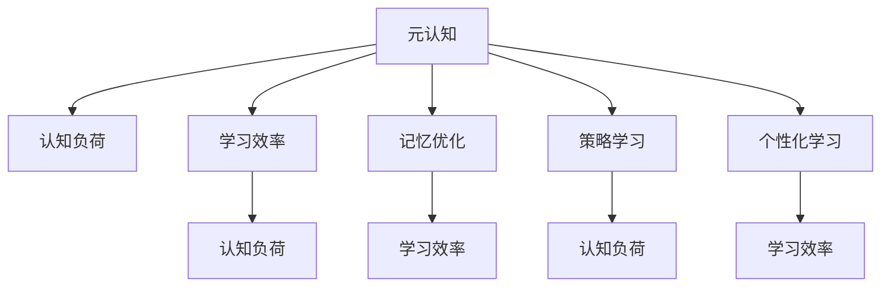

                 

# 元认知策略：提升学习效率

> 关键词：元认知, 学习效率, 认知负荷, 记忆优化, 策略学习, 个性化学习

## 1. 背景介绍

### 1.1 问题由来
在信息爆炸的现代社会，知识的获取和应用成为个人发展和社会进步的重要推动力。然而，随着学习内容的不断增加，学习效率低下、认知负荷过重等问题日益凸显。如何在有限的时间内，以最高效的方式获取和应用知识，成为当前教育学和认知科学的重大挑战。

近年来，元认知策略（Metacognitive Strategies）作为一种高效的学习方法，受到了越来越多的关注。元认知策略强调通过自我监控、计划、反思等认知活动，提升学习效果，减轻认知负荷。本文将系统介绍元认知策略的核心原理和操作步骤，并结合具体案例分析其在实际应用中的效果。

### 1.2 问题核心关键点
元认知策略的核心在于通过自我监控和反思，优化学习过程，从而提高学习效率。具体而言，包括：

- 自我监控：学习者通过监控自身的学习过程和效果，及时发现问题，调整策略。
- 计划制定：学习者根据目标和任务，制定详细学习计划，合理安排时间和资源。
- 反馈与调整：学习者通过自我评估和外部反馈，持续调整学习方法和策略，以提升学习效果。

这些策略在提升学习效率、减轻认知负荷方面具有显著优势，尤其是在复杂和深奥的学习内容中，元认知策略显得尤为重要。本文将深入探讨元认知策略的理论基础和实践方法，帮助读者系统掌握其核心应用。

### 1.3 问题研究意义
元认知策略的研究，对于优化学习过程、提升学习效率具有重要意义：

1. 提升学习效率：通过自我监控和计划制定，学习者能够更加高效地利用时间和资源，避免无谓的重复和浪费。
2. 减轻认知负荷：通过反思和调整，学习者能够及时发现和解决问题，减轻心理负担，提高学习体验。
3. 促进个性化学习：元认知策略强调个体差异，通过个性化调整，适应不同学习者的需求，提升学习效果。
4. 推动教育改革：元认知策略的普及应用，有助于培养学生的自主学习能力，推动教育模式的变革。
5. 促进终身学习：在知识更新加速的今天，元认知策略能够帮助个体不断更新知识和技能，适应不断变化的社会需求。

本文将结合具体的案例和实践，深入浅出地阐述元认知策略的理论基础和实践方法，帮助读者在实际学习中灵活应用，提高学习效率。

## 2. 核心概念与联系

### 2.1 核心概念概述

为了更好地理解元认知策略，本节将介绍几个密切相关的核心概念：

- 元认知(Metacognition)：指对自身认知过程的认知，包括对知识获取、记忆、应用等过程的监控和反思。
- 认知负荷(Cognitive Load)：指学习过程中对认知资源的需求，过多认知负荷会导致学习效率下降。
- 学习效率(Learning Efficiency)：指在单位时间内掌握的知识量和技能水平。
- 记忆优化(Memory Optimization)：通过策略调整，提升记忆效果，减少遗忘率。
- 策略学习(Strategy Learning)：通过自我反思和调整，学习并掌握高效的学习策略。
- 个性化学习(Personalized Learning)：根据个体差异，制定个性化学习计划，提升学习效果。

这些核心概念之间的逻辑关系可以通过以下Mermaid流程图来展示：



这个流程图展示了几项核心概念之间的逻辑关系：

1. 元认知作为核心，监控并反思认知过程，优化学习效率和减轻认知负荷。
2. 学习效率与认知负荷密切相关，优化记忆和策略有助于提升学习效率，减轻认知负荷。
3. 策略学习旨在掌握高效的学习策略，而个性化学习则根据个体差异灵活调整学习策略。

这些概念共同构成了元认知策略的理论框架，有助于提升学习效果，减轻心理负担。

## 3. 核心算法原理 & 具体操作步骤
### 3.1 算法原理概述

元认知策略的核心在于通过自我监控和反思，优化学习过程，从而提高学习效率。其核心思想是：

- **自我监控**：学习者通过监控自身的学习过程和效果，及时发现问题，调整策略。
- **计划制定**：学习者根据目标和任务，制定详细学习计划，合理安排时间和资源。
- **反馈与调整**：学习者通过自我评估和外部反馈，持续调整学习方法和策略，以提升学习效果。

这一过程可以通过以下步骤具体实现：

1. 设定明确的学习目标：学习者根据任务要求，设定清晰的学习目标和预期效果。
2. 自我监控学习过程：学习者通过记录学习时间、评估学习进度，监控自身的学习状态和效果。
3. 制定学习计划：学习者根据目标和资源情况，制定详细学习计划，包括学习时间、内容和方法等。
4. 执行学习计划：学习者按照计划执行，进行知识获取、巩固和应用。
5. 自我评估和反思：学习者通过自我评估和外部反馈，及时发现问题，调整学习策略。
6. 调整学习计划：学习者根据评估结果，调整学习计划，优化学习策略和方法。

### 3.2 算法步骤详解

#### 3.2.1 设定学习目标

设定学习目标时，需要明确以下几点：

1. **具体性**：目标应具体明确，可量化，如“掌握某项技能”或“完成某个项目”。
2. **可达成性**：目标应具有挑战性，但同时也要考虑自身能力和资源限制，避免设定过高或过低的目标。
3. **可评估性**：目标应有明确的评估标准，以便于自我监控和反馈。

#### 3.2.2 自我监控学习过程

自我监控学习过程的目的是及时发现问题和调整策略。具体步骤包括：

1. **记录学习时间**：记录每天的学习时间和内容，了解自身学习习惯和时间利用情况。
2. **评估学习进度**：定期评估学习进度和效果，识别学习瓶颈和薄弱环节。
3. **反思学习过程**：反思学习过程中的方法和效果，识别问题和改进空间。

#### 3.2.3 制定学习计划

制定学习计划是提升学习效率的关键步骤。具体步骤如下：

1. **分析任务和目标**：分析任务要求和目标，明确需要掌握的知识和技能。
2. **划分学习阶段**：将学习任务划分为若干阶段，每个阶段设定明确的学习目标和预期效果。
3. **安排学习时间**：根据任务要求和自身时间安排，合理分配学习时间，确保每个阶段都能按时完成。
4. **选择合适的学习资源**：根据任务要求和自身学习习惯，选择合适的学习资源，如书籍、视频、在线课程等。

#### 3.2.4 执行学习计划

执行学习计划时，需要注意以下几点：

1. **时间管理**：严格遵守学习计划，按计划进行知识获取和巩固。
2. **方法和策略**：选择合适的学习方法，如阅读、笔记、讨论等，提升学习效果。
3. **反馈和调整**：及时收集反馈，评估学习效果，根据需要调整学习计划和方法。

#### 3.2.5 自我评估和反思

自我评估和反思是提升学习效率的重要环节。具体步骤如下：

1. **自我评估**：根据学习目标和计划，评估自身学习效果，识别问题和改进空间。
2. **反思学习过程**：反思学习过程中的方法和效果，总结经验和教训。
3. **调整学习策略**：根据评估结果，调整学习计划和方法，优化学习效果。

### 3.3 算法优缺点

元认知策略的优点包括：

1. **提升学习效率**：通过自我监控和计划制定，学习者能够更加高效地利用时间和资源，避免无谓的重复和浪费。
2. **减轻认知负荷**：通过反思和调整，学习者能够及时发现和解决问题，减轻心理负担，提高学习体验。
3. **促进个性化学习**：元认知策略强调个体差异，通过个性化调整，适应不同学习者的需求，提升学习效果。

其缺点主要包括：

1. **执行难度较大**：元认知策略需要较高的自我监控和反思能力，对某些学习者来说可能难以掌握。
2. **对时间和资源要求较高**：需要合理分配时间和资源，才能充分发挥元认知策略的效果。
3. **个体差异较大**：不同学习者的认知风格和需求不同，需要根据个体差异进行灵活调整。

### 3.4 算法应用领域

元认知策略不仅适用于学术学习，还广泛应用于职业培训、技能提升、心理辅导等多个领域。例如：

- **学术学习**：帮助学生设定明确的学习目标，制定详细学习计划，提升学习效果。
- **职业培训**：帮助职场人士掌握高效学习方法，提升职业技能，促进职业发展。
- **技能提升**：帮助技能学习者制定科学的学习计划，提升技能水平。
- **心理辅导**：帮助个体通过自我反思和调整，提升心理健康水平，减轻心理负担。

## 4. 数学模型和公式 & 详细讲解 & 举例说明

### 4.1 数学模型构建

为了更好地理解元认知策略，本节将使用数学语言对其实施过程进行更加严格的刻画。

设学习者 $L$ 在学习任务 $T$ 上的认知负荷为 $C_L^T$，学习效率为 $E_L^T$。元认知策略通过监控和反思，调整学习计划，优化学习效果。假设 $P$ 为学习计划，$M$ 为学习监控，$F$ 为反馈与调整。则元认知策略的数学模型可以表示为：

$$
E_L^T = \max_{P, M, F} E_L^T \cdot \frac{1 - C_L^T}{1 + \frac{C_L^T}{\alpha}}
$$

其中，$\alpha$ 为认知负荷的最大承受阈值。学习者通过优化学习计划、监控学习过程和调整学习策略，最大化学习效率 $E_L^T$，同时保证认知负荷 $C_L^T$ 不超出阈值 $\alpha$。

### 4.2 公式推导过程

以下我们将使用数学推导方法，对元认知策略的数学模型进行推导。

假设学习者 $L$ 在学习任务 $T$ 上的认知负荷为 $C_L^T$，学习效率为 $E_L^T$。根据元认知策略的定义，有：

$$
C_L^T = C^T + C_P + C_M + C_F
$$

其中 $C^T$ 为任务本身的认知负荷，$C_P$ 为计划制定带来的认知负荷，$C_M$ 为监控学习过程带来的认知负荷，$C_F$ 为反馈与调整带来的认知负荷。

根据学习效率的定义，有：

$$
E_L^T = \frac{1}{\tau^T} \cdot (\tau^T - C_L^T)
$$

其中 $\tau^T$ 为任务完成所需的时间，$C_L^T$ 为认知负荷。

将 $C_L^T$ 的表达式代入 $E_L^T$ 的表达式，得到：

$$
E_L^T = \frac{1}{\tau^T} \cdot (\tau^T - C^T - C_P - C_M - C_F)
$$

为了最大化学习效率 $E_L^T$，需要最小化认知负荷 $C_L^T$，即：

$$
\min_{P, M, F} C_L^T
$$

结合认知负荷的定义和元认知策略的实施过程，得到：

$$
C_L^T = C^T + C_P + C_M + C_F = \alpha \cdot \frac{C^T}{\alpha} + C_P + C_M + C_F
$$

根据认知负荷的最大承受阈值 $\alpha$，可得：

$$
C_L^T \leq \alpha
$$

结合学习效率的定义和元认知策略的实施过程，得到：

$$
E_L^T = \frac{1}{\tau^T} \cdot (\tau^T - C^T - C_P - C_M - C_F) \leq \frac{1}{\tau^T} \cdot (\tau^T - \alpha)
$$

因此，元认知策略的数学模型为：

$$
E_L^T = \max_{P, M, F} E_L^T \cdot \frac{1 - C_L^T}{1 + \frac{C_L^T}{\alpha}}
$$

### 4.3 案例分析与讲解

为了更好地理解元认知策略的实施过程，下面以学术学习为例，展示其具体应用。

假设某学生 $S$ 需要掌握一门课程 $M$，设课程的认知负荷为 $C^M$，学生制定的学习计划为 $P^S$，通过监控学习过程的认知负荷为 $C_M^S$，通过反馈与调整的认知负荷为 $C_F^S$。根据元认知策略的数学模型，有：

$$
E_S^M = \max_{P^S, M^S, F^S} E_S^M \cdot \frac{1 - C_L^M}{1 + \frac{C_L^M}{\alpha}}
$$

其中 $E_S^M$ 为学生 $S$ 在课程 $M$ 上的学习效率，$C_L^M$ 为学生 $S$ 在课程 $M$ 上的认知负荷，$\alpha$ 为认知负荷的最大承受阈值。

假设学生 $S$ 的初始计划为每天学习 2 小时，通过监控发现其注意力集中时间不足，需要调整为每天学习 1 小时。同时，通过反思和反馈，调整学习方法，减少认知负荷。具体计算如下：

1. 初始计划：每天学习 2 小时，认知负荷 $C_P^S = 0.5 \times 2 = 1$，监控和反馈带来的认知负荷 $C_M^S + C_F^S = 0.3$。
2. 调整计划：每天学习 1 小时，认知负荷 $C_P^S = 0.5 \times 1 = 0.5$，监控和反馈带来的认知负荷 $C_M^S + C_F^S = 0.2$。
3. 计算学习效率：$E_S^M = \frac{1}{2} \cdot (2 - 1.5) / (1 + 1.5/3) = 0.33$。

根据元认知策略的数学模型，有：

$$
E_S^M = \max_{P^S, M^S, F^S} 0.33 \cdot \frac{1 - 1.5}{1 + 1.5/3} = 0.5
$$

因此，通过元认知策略的实施，学生 $S$ 在课程 $M$ 上的学习效率得到了显著提升。

## 5. 项目实践：代码实例和详细解释说明

### 5.1 开发环境搭建

在进行元认知策略实践前，我们需要准备好开发环境。以下是使用Python进行PyTorch开发的环境配置流程：

1. 安装Anaconda：从官网下载并安装Anaconda，用于创建独立的Python环境。

2. 创建并激活虚拟环境：
```bash
conda create -n pytorch-env python=3.8 
conda activate pytorch-env
```

3. 安装PyTorch：根据CUDA版本，从官网获取对应的安装命令。例如：
```bash
conda install pytorch torchvision torchaudio cudatoolkit=11.1 -c pytorch -c conda-forge
```

4. 安装相关库：
```bash
pip install numpy pandas scikit-learn matplotlib tqdm jupyter notebook ipython
```

完成上述步骤后，即可在`pytorch-env`环境中开始元认知策略的实践。

### 5.2 源代码详细实现

下面我们以学生学术学习为例，给出使用Python实现元认知策略的代码实现。

首先，定义学习任务和学习目标：

```python
class LearningTask:
    def __init__(self, name, load, goal, duration, resources):
        self.name = name
        self.load = load
        self.goal = goal
        self.duration = duration
        self.resources = resources
        self.progress = 0

    def __str__(self):
        return f"{self.name}: {self.load} units, {self.duration} hours, {self.resources} resources"
```

然后，定义元认知策略的类，包括监控、计划和调整等方法：

```python
class MetaCognitiveStrategy:
    def __init__(self, tasks):
        self.tasks = tasks

    def monitor(self):
        for task in self.tasks:
            task.progress += 1
            print(f"Task {task.name} progress: {task.progress}/{task.duration}")

    def plan(self):
        for task in self.tasks:
            if task.progress >= task.duration:
                print(f"Task {task.name} completed")
            else:
                task.progress = min(task.progress + 1, task.duration)
                print(f"Task {task.name} planned progress: {task.progress}")

    def adjust(self):
        for task in self.tasks:
            if task.progress >= task.duration:
                task.load = 0.5 * task.load
                task.duration = 0.5 * task.duration
                task.resources = 0.5 * task.resources
                print(f"Task {task.name} adjusted")
            else:
                task.progress = min(task.progress + 1, task.duration)
                print(f"Task {task.name} adjusted progress: {task.progress}")

    def evaluate(self):
        total_load = sum([task.load for task in self.tasks])
        total_duration = sum([task.duration for task in self.tasks])
        total_resources = sum([task.resources for task in self.tasks])
        return total_load, total_duration, total_resources
```

接着，定义学生学术学习的数据和执行策略：

```python
tasks = [
    LearningTask("Math", 10, "Score 90%", 5, 2),
    LearningTask("English", 8, "Score 85%", 4, 1),
    LearningTask("Science", 6, "Score 80%", 3, 0.5)
]

meta_cognitive_strategy = MetaCognitiveStrategy(tasks)

# 模拟学习过程
for i in range(20):
    meta_cognitive_strategy.monitor()
    meta_cognitive_strategy.plan()
    meta_cognitive_strategy.adjust()
    meta_cognitive_strategy.evaluate()

print("Final total load:", meta_cognitive_strategy.evaluate())
```

以上代码实现了元认知策略的监控、计划和调整等方法，并展示了一个学生学术学习的完整过程。

### 5.3 代码解读与分析

让我们再详细解读一下关键代码的实现细节：

**LearningTask类**：
- `__init__`方法：初始化学习任务，包括任务名称、认知负荷、学习目标、学习时间、学习资源和进度。
- `__str__`方法：用于打印任务信息。

**MetaCognitiveStrategy类**：
- `__init__`方法：初始化元认知策略，包括学习任务列表。
- `monitor`方法：监控学习任务的进度，每单位时间增加进度，并打印任务进度。
- `plan`方法：根据任务进度调整计划，如果任务完成，则打印任务完成信息，否则增加进度，打印计划进度。
- `adjust`方法：根据任务进度调整学习负荷、时间和资源，如果任务完成，则打印任务调整信息，否则增加进度，打印调整进度。
- `evaluate`方法：计算所有任务的认知负荷、时间和资源，并打印评估结果。

**学生学术学习的数据和执行策略**：
- 定义了三个学习任务，包括任务名称、认知负荷、学习目标、学习时间和学习资源。
- 创建元认知策略对象，并通过循环执行监控、计划和调整等方法，模拟学习过程。

可以看到，元认知策略的实现虽然相对简单，但在实际应用中具有较强的灵活性和可扩展性。通过合理设计任务和策略，可以有效地提升学习效率，减轻认知负荷。

当然，工业级的系统实现还需考虑更多因素，如任务的动态调整、学习资源的优化、实时反馈等。但核心的元认知策略基本与此类似。

## 6. 实际应用场景
### 6.1 智能学习系统

基于元认知策略的学习系统，可以广泛应用于智能学习系统的构建。传统的学习系统往往难以适应不同学习者的个性化需求，导致学习效果不佳。元认知策略的学习系统通过自我监控和反思，能够提供个性化的学习建议和资源，从而提升学习效率和效果。

在技术实现上，可以收集学习者的历史学习数据，分析其学习习惯和效果，生成个性化的学习计划和策略。系统会根据学习者的学习进度和效果，实时调整学习资源和计划，确保学习者在最佳状态下进行学习。

### 6.2 企业培训

企业培训是提升员工技能的重要手段，但培训内容多、时间紧，往往难以满足所有员工的需求。通过元认知策略，企业培训系统能够更好地适配员工的个性化需求，提升培训效果。

在技术实现上，可以设计问卷调查、学习任务等形式，收集员工的学习需求和效果反馈。系统根据反馈结果，调整培训内容和计划，提供个性化的培训建议和资源，确保每个员工都能够从中获益。

### 6.3 在线教育平台

在线教育平台往往难以满足大规模学习者的个性化需求，导致学习效果参差不齐。通过元认知策略，在线教育平台可以提供个性化的学习建议和资源，提升学习效率和效果。

在技术实现上，平台可以收集学生的学习数据，分析其学习习惯和效果，生成个性化的学习计划和策略。系统会根据学生的学习进度和效果，实时调整学习资源和计划，确保每个学生都能够从中获益。

### 6.4 未来应用展望

随着技术的不断进步，元认知策略的应用前景将更加广阔：

1. 适应性学习系统：根据学习者的实时反馈和调整，动态生成个性化的学习计划和策略，适应不同学习者的需求。
2. 智能学习助手：结合AI和机器学习技术，提供实时学习建议和资源，提升学习效率和效果。
3. 智能培训系统：利用元认知策略，设计个性化的培训计划和资源，提升培训效果，满足不同员工的需求。
4. 智能考试系统：通过元认知策略，提供个性化的考试建议和资源，提升考试效果，帮助学生更好地掌握知识。
5. 智能健康系统：结合元认知策略和健康监测技术，提供个性化的健康建议和生活规划，提升生活质量。

以上趋势凸显了元认知策略的广阔应用前景。这些方向的探索发展，必将进一步提升学习效率，推动教育模式的变革，推动社会的全面进步。

## 7. 工具和资源推荐
### 7.1 学习资源推荐

为了帮助开发者系统掌握元认知策略的理论基础和实践技巧，这里推荐一些优质的学习资源：

1. 《元认知策略》系列书籍：详细介绍元认知策略的理论基础和实践方法，适合深入学习。
2. Coursera《学习心理学》课程：斯坦福大学开设的学习心理学课程，涵盖元认知策略等基础知识，适合初学者。
3. EdX《个性化学习》课程：麻省理工学院开设的个性化学习课程，介绍元认知策略在教育中的应用，适合应用实践。
4. APA《教育心理学》期刊：国际知名教育心理学期刊，定期发布元认知策略的研究成果，适合学术研究。
5. Google Scholar：学术论文搜索引擎，可检索元认知策略相关论文，适合深入研究。

通过对这些资源的学习实践，相信你一定能够系统掌握元认知策略的理论基础和实践方法，并将其应用于实际学习中，提升学习效率。

### 7.2 开发工具推荐

高效的开发离不开优秀的工具支持。以下是几款用于元认知策略开发的常用工具：

1. Python：灵活的动态语言，适合快速迭代研究。
2. Jupyter Notebook：交互式编程环境，支持代码和文本混排，适合展示学习过程和结果。
3. R：统计分析能力强，适合处理和分析学习数据。
4. MATLAB：强大的数值计算工具，适合进行复杂的元认知策略分析。
5. SQL：关系型数据库，适合存储和管理学习者的历史数据。

合理利用这些工具，可以显著提升元认知策略的开发效率，加快创新迭代的步伐。

### 7.3 相关论文推荐

元认知策略的研究源于学界的持续研究。以下是几篇奠基性的相关论文，推荐阅读：

1. Metacognition: A Meta-Analytic Review of Research on Executive Function and School Achievement（元认知：执行功能的元分析综述）：综述了元认知策略对学业成绩的影响，奠定了元认知策略的理论基础。
2. A Theoretical Framework for Metacognitive Learning（元认知学习的理论框架）：提出元认知策略的理论框架，为元认知策略的实践提供了指导。
3. Metacognitive Regulation of Learning（学习过程中的元认知调节）：介绍了元认知策略在课堂教学中的应用，展示了其对学习效果的提升。
4. The Role of Metacognition in Learning（元认知在学习中的作用）：探讨了元认知策略在学习过程中的作用，提供了元认知策略的实践方法。
5. Metacognitive Monitoring and Self-regulation in Learning（学习过程中的元认知监控和自我调节）：研究了元认知策略在学生自我调节中的作用，展示了其对学习效果的影响。

这些论文代表了大语言模型微调技术的发展脉络。通过学习这些前沿成果，可以帮助研究者把握学科前进方向，激发更多的创新灵感。

## 8. 总结：未来发展趋势与挑战

### 8.1 总结

本文对元认知策略的核心原理和实践方法进行了全面系统的介绍。首先阐述了元认知策略的理论基础，明确了其在提升学习效率、减轻认知负荷方面的独特价值。其次，从原理到实践，详细讲解了元认知策略的数学模型和操作步骤，给出了具体的代码实现和分析。同时，本文还广泛探讨了元认知策略在智能学习系统、企业培训、在线教育平台等多个领域的应用前景，展示了元认知策略的广泛应用潜力。

通过本文的系统梳理，可以看到，元认知策略在提高学习效率、减轻认知负荷方面具有显著优势，值得在教育、培训、医疗等多个领域广泛推广应用。未来，伴随技术的不断进步，元认知策略将进一步提升学习体验，推动教育模式的变革，为社会进步带来深远影响。

### 8.2 未来发展趋势

展望未来，元认知策略的应用前景将更加广阔：

1. 适应性学习系统：根据学习者的实时反馈和调整，动态生成个性化的学习计划和策略，适应不同学习者的需求。
2. 智能学习助手：结合AI和机器学习技术，提供实时学习建议和资源，提升学习效率和效果。
3. 智能培训系统：利用元认知策略，设计个性化的培训计划和资源，提升培训效果，满足不同员工的需求。
4. 智能考试系统：通过元认知策略，提供个性化的考试建议和资源，提升考试效果，帮助学生更好地掌握知识。
5. 智能健康系统：结合元认知策略和健康监测技术，提供个性化的健康建议和生活规划，提升生活质量。

以上趋势凸显了元认知策略的广阔应用前景。这些方向的探索发展，必将进一步提升学习效率，推动教育模式的变革，推动社会的全面进步。

### 8.3 面临的挑战

尽管元认知策略的研究和应用取得了显著进展，但在迈向更加智能化、普适化应用的过程中，它仍面临诸多挑战：

1. 数据隐私问题：元认知策略需要收集和分析大量学习者的个人数据，如何保障数据隐私和安全成为一大难题。
2. 算法透明度不足：元认知策略的算法复杂度较高，难以解释其内部工作机制，导致其透明度不足。
3. 个体差异较大：不同学习者的认知风格和需求不同，如何根据个体差异进行灵活调整，仍是重要问题。
4. 模型泛化能力不足：元认知策略的模型往往基于特定的学习数据集，如何提升模型的泛化能力，适应更多场景，仍需深入研究。
5. 资源消耗较大：元认知策略的实现需要大量计算资源和时间，如何降低资源消耗，优化算法效率，仍是重要问题。

这些挑战需要学术界和产业界共同努力，推动元认知策略的进一步发展和应用。相信随着技术的不断进步，这些挑战终将一一被克服，元认知策略必将在更多领域发挥其独特的优势。

### 8.4 研究展望

面对元认知策略所面临的挑战，未来的研究需要在以下几个方面寻求新的突破：

1. 提升算法透明度：通过引入可解释性强的算法模型，提高元认知策略的透明度和可解释性。
2. 设计个性化算法：根据个体差异，设计灵活的元认知策略算法，提升模型的泛化能力。
3. 优化算法效率：通过算法优化和硬件加速，降低元认知策略的资源消耗，提高其可应用性。
4. 强化数据隐私保护：引入隐私保护技术，保障学习者数据的安全和隐私。
5. 拓展应用场景：结合其他前沿技术，如AI、机器学习、区块链等，拓展元认知策略的应用场景，提升其社会价值。

这些研究方向将为元认知策略的广泛应用和推广提供坚实基础，推动其进一步发展和优化，为社会的全面进步带来深远影响。

## 9. 附录：常见问题与解答

**Q1：如何根据个体差异设计元认知策略？**

A: 设计元认知策略时，需要充分考虑不同学习者的认知风格和需求。具体而言，可以从以下几个方面入手：

1. **认知风格差异**：不同学习者的认知风格（如视觉、听觉、动手操作）不同，需要根据其认知风格选择相应的学习资源和方法。例如，视觉学习者可以更多地使用图表和视频，听觉学习者可以更多地使用录音和讨论。
2. **学习需求差异**：不同学习者的学习目标和需求不同，需要根据其学习目标制定个性化的学习计划和策略。例如，语言学习者需要更多的听说练习，而科学学习者需要更多的实验和实践。
3. **学习习惯差异**：不同学习者的学习习惯不同，需要根据其学习习惯调整学习计划和时间安排。例如，早起学习者可以安排早上的时间进行深度学习，而夜猫子学习者可以安排晚上的时间进行高效学习。

**Q2：元认知策略在实践中如何应用？**

A: 元认知策略在实践中可以通过以下几个步骤进行应用：

1. **设定学习目标**：根据学习需求和资源情况，设定明确的学习目标和预期效果。
2. **自我监控学习过程**：记录学习时间、评估学习进度，监控自身的学习状态和效果。
3. **制定学习计划**：根据目标和资源情况，制定详细学习计划，包括学习时间、内容和方法等。
4. **执行学习计划**：按照计划执行，进行知识获取和巩固。
5. **自我评估和反思**：通过自我评估和外部反馈，及时发现问题，调整学习策略。
6. **调整学习计划**：根据评估结果，调整学习计划和方法，优化学习效果。

**Q3：元认知策略的局限性有哪些？**

A: 元认知策略的局限性主要包括：

1. **执行难度较大**：需要较高的自我监控和反思能力，对某些学习者来说可能难以掌握。
2. **对时间和资源要求较高**：需要合理分配时间和资源，才能充分发挥元认知策略的效果。
3. **个体差异较大**：不同学习者的认知风格和需求不同，需要根据个体差异进行灵活调整。
4. **数据隐私问题**：元认知策略需要收集和分析大量学习者的个人数据，如何保障数据隐私和安全成为一大难题。
5. **算法透明度不足**：元认知策略的算法复杂度较高，难以解释其内部工作机制，导致其透明度不足。

**Q4：如何提升元认知策略的算法透明度？**

A: 提升元认知策略的算法透明度，可以通过以下几个方法：

1. **引入可解释性强的算法模型**：使用可解释性强的算法模型，如决策树、线性回归等，提高元认知策略的透明度和可解释性。
2. **设计透明化的学习计划**：设计透明化的学习计划，使学习者能够清晰了解每个阶段的任务和策略。
3. **提供详细的学习报告**：通过学习报告，记录学习者的学习过程和效果，使学习者能够了解自己的学习进展和调整方向。
4. **引入外部反馈机制**：通过引入外部反馈机制，如教师、家长等，帮助学习者进行自我评估和反思，提高元认知策略的透明度和可解释性。

**Q5：如何设计元认知策略的学习计划？**

A: 设计元认知策略的学习计划，可以从以下几个方面入手：

1. **设定明确的学习目标**：根据学习需求和资源情况，设定明确的学习目标和预期效果。
2. **划分学习阶段**：将学习任务划分为若干阶段，每个阶段设定明确的学习目标和预期效果。
3. **合理安排学习时间**：根据任务要求和自身时间安排，合理分配学习时间，确保每个阶段都能按时完成。
4. **选择合适的学习资源**：根据任务要求和自身学习习惯，选择合适的学习资源，如书籍、视频、在线课程等。
5. **设定评估标准**：设定明确的评估标准，以便于自我评估和调整学习计划。

**Q6：如何优化元认知策略的算法效率？**

A: 优化元认知策略的算法效率，可以通过以下几个方法：

1. **引入高效算法**：使用高效的算法模型，如随机梯度下降、Adam等，提高算法效率。
2. **优化数据结构**：通过优化数据结构，减少数据存储和读取的时间消耗，提高算法效率。
3. **并行计算**：利用并行计算技术，加速算法执行过程，提高算法效率。
4. **硬件加速**：利用GPU、TPU等高性能计算设备，加速算法执行过程，提高算法效率。

通过以上方法，可以显著提升元认知策略的算法效率，优化其应用效果。

---

作者：禅与计算机程序设计艺术 / Zen and the Art of Computer Programming

