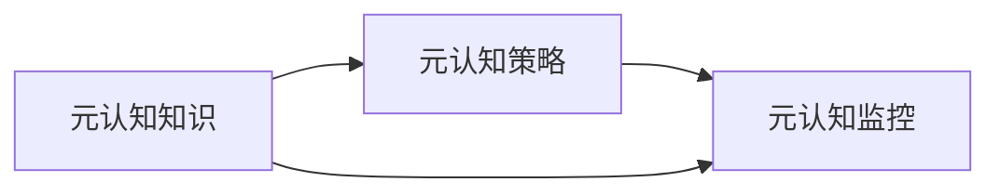

                 

# 元认知：提升学习效率的关键

> 关键词：元认知, 学习效率, 学习算法, 知识管理, 自我反思, 认知模型

## 1. 背景介绍

### 1.1 问题由来

在当今信息爆炸的时代，人们面对的知识量和信息流的速度都在不断增加。如何高效、有效地学习成为了一个重要问题。尤其是在科技、商业、教育等领域，学习和获取新知识是个人和组织发展的关键。然而，传统的学习方法往往只能适应特定情境，难以应对复杂的、动态变化的环境。

因此，元认知（Metacognition）作为一种高级认知能力，开始受到广泛关注。元认知指的是对自己的认知过程进行监控、评估和调整。通过元认知，人们可以更加科学地制定学习策略，从而提升学习效率和效果。本文将深入探讨元认知在学习过程中的作用，介绍如何运用元认知提升学习效率，并提供相关的实践指导。

## 2. 核心概念与联系

### 2.1 核心概念概述

元认知是认知心理学中的一个重要概念，指的是个体对自己认知过程的认知和监控能力。包括对自己的认知状态、学习策略、学习效率等进行反思和调整。

核心概念包括：

- **元认知知识**：个体关于自己及他人认知过程的知识，包括对学习内容、学习策略和方法的理解。
- **元认知策略**：个体在学习过程中采用的计划、监控和调节策略。
- **元认知监控**：个体对自己认知过程的监控和评估。

这些概念之间通过认知过程相互联系和影响。元认知知识提供学习的基础，元认知策略指导学习过程，而元认知监控则保证学习策略的有效执行。

### 2.2 核心概念原理和架构的 Mermaid 流程图



这个流程图展示了元认知的三大组成部分之间的相互关系。

## 3. 核心算法原理 & 具体操作步骤

### 3.1 算法原理概述

元认知算法的核心在于通过对学习过程的监控和调整，提高学习效率和效果。其基本原理包括：

1. **学习目标设定**：根据学习任务和学习者的特点，设定具体、明确的学习目标。
2. **学习计划制定**：根据学习目标，制定详细的学习计划，包括时间安排、资源准备和学习策略等。
3. **学习过程监控**：在学习过程中，实时监控学习进展，评估学习效果，及时发现和解决问题。
4. **学习策略调整**：根据监控结果，灵活调整学习策略，优化学习过程。
5. **自我反思与总结**：学习结束后，进行自我反思和总结，提取学习经验，为后续学习提供指导。

### 3.2 算法步骤详解

1. **目标设定**：明确学习目标，包括知识掌握程度、技能提升、任务完成等。使用SMART原则（具体、可衡量、可实现、相关、时限）设定目标。

2. **计划制定**：制定详细学习计划，包括学习时间、学习内容、学习资源等。使用甘特图、时间表等工具进行规划。

3. **监控评估**：在学习过程中，使用日志、笔记等工具记录学习进展，评估学习效果。使用KPI、绩效指标等方法进行量化评估。

4. **策略调整**：根据监控和评估结果，调整学习策略，如改变学习内容、调整学习节奏、优化学习方法等。

5. **反思总结**：学习结束后，进行自我反思和总结，分析成功和失败的原因，提取学习经验，形成知识体系。

### 3.3 算法优缺点

**优点**：
- **提高学习效率**：通过监控和调整学习策略，可以避免无效学习，提高学习效率。
- **增强自我反思**：反思和总结过程，有助于提高自我认知能力，提升学习能力。
- **灵活调整学习**：根据学习进展和效果，灵活调整学习策略，更好地适应学习任务。

**缺点**：
- **实施难度较大**：需要较强的自律和自我管理能力，难以持续实施。
- **需要时间成本**：监控、调整和反思都需要时间，可能会影响短期学习效果。
- **效果因人而异**：不同学习者对元认知策略的响应程度不同，效果可能存在差异。

### 3.4 算法应用领域

元认知算法在教育、职业培训、自我提升等多个领域都有广泛应用。具体如下：

1. **教育领域**：适用于基础教育、职业教育、终身学习等，帮助学生制定学习计划、监控学习效果、提升学习策略。
2. **职业培训**：帮助员工设定职业目标、制定学习计划、提升职业技能。
3. **自我提升**：适用于个人学习、技能提升、兴趣培养等，帮助学习者科学规划学习过程，提升学习效果。

## 4. 数学模型和公式 & 详细讲解 & 举例说明

### 4.1 数学模型构建

元认知算法的数学模型可以从两个维度构建：

- **时间维度**：学习过程的时间序列，包括学习时间、学习节奏、学习进度等。
- **空间维度**：学习内容和学习资源的空间分布，包括学习内容、学习资料、学习工具等。

假设学习者有 $T$ 个学习任务，每个任务的学习时间分别为 $t_1, t_2, \ldots, t_T$。学习者的时间序列为 $T_1, T_2, \ldots, T_T$，其中 $T_i$ 表示学习任务 $i$ 的学习时间。学习者可用的学习资源为 $R_1, R_2, \ldots, R_T$，其中 $R_i$ 表示学习任务 $i$ 所需的资源量。

### 4.2 公式推导过程

1. **学习目标函数**：
   $$
   F(T_i, R_i) = \sum_{i=1}^{T} f_i(T_i, R_i)
   $$
   其中 $f_i$ 表示学习任务 $i$ 的效用函数，衡量任务完成度。

2. **时间规划函数**：
   $$
   T(T_i) = \sum_{i=1}^{T} T_i
   $$
   表示总学习时间。

3. **资源规划函数**：
   $$
   R(T_i) = \sum_{i=1}^{T} R_i
   $$
   表示总学习资源。

4. **学习策略调整函数**：
   $$
   S(T_i, R_i, \delta) = \sum_{i=1}^{T} s_i(T_i, R_i, \delta)
   $$
   其中 $\delta$ 表示学习策略的调整参数，$s_i$ 表示学习任务 $i$ 的调整策略函数。

### 4.3 案例分析与讲解

假设某学生有 $T=3$ 个学习任务，学习时间分别为 $t_1=2h, t_2=3h, t_3=4h$，可用的学习资源分别为 $R_1=10h, R_2=12h, R_3=8h$。学习者的学习时间为 $T_1=8h, T_2=12h, T_3=16h$，学习资源为 $R_1=10h, R_2=12h, R_3=8h$。

**目标函数**：
$$
F(T_i, R_i) = f_1(T_1, R_1) + f_2(T_2, R_2) + f_3(T_3, R_3)
$$
假设 $f_i = \frac{T_i}{R_i}$，则：
$$
F(T_i, R_i) = \frac{T_1}{R_1} + \frac{T_2}{R_2} + \frac{T_3}{R_3} = \frac{8}{10} + \frac{12}{12} + \frac{16}{8} = 1.8 + 1 + 2 = 4.8
$$

**时间规划函数**：
$$
T(T_i) = T_1 + T_2 + T_3 = 8 + 12 + 16 = 36h
$$

**资源规划函数**：
$$
R(T_i) = R_1 + R_2 + R_3 = 10 + 12 + 8 = 30h
$$

**学习策略调整函数**：
$$
S(T_i, R_i, \delta) = s_1(T_1, R_1, \delta) + s_2(T_2, R_2, \delta) + s_3(T_3, R_3, \delta)
$$
假设学习策略调整参数 $\delta = 0.1$，则：
$$
s_i(T_i, R_i, \delta) = \max(0, (1 - \delta)T_i - R_i)
$$
计算得：
$$
S(T_i, R_i, \delta) = s_1(T_1, R_1, \delta) + s_2(T_2, R_2, \delta) + s_3(T_3, R_3, \delta) = (1 - 0.1 \times 2 - 10) + (1 - 0.1 \times 3 - 12) + (1 - 0.1 \times 4 - 8) = 0 + (-1.3) + (-4.4) = -5.7
$$

综合上述分析，学习者可以通过调整学习策略，合理规划时间和资源，从而提高学习效率和效果。

## 5. 项目实践：代码实例和详细解释说明

### 5.1 开发环境搭建

为了实现元认知算法，需要搭建Python开发环境，并使用Pandas、NumPy、Matplotlib等工具进行数据分析和可视化。

```python
# 安装相关依赖
pip install pandas numpy matplotlib
```

### 5.2 源代码详细实现

以下是一个简单的元认知算法实现示例，使用Python进行学习和监控。

```python
import pandas as pd
import numpy as np
import matplotlib.pyplot as plt

# 定义学习任务和资源
tasks = pd.DataFrame({
    'task': ['Task1', 'Task2', 'Task3'],
    'time': [2, 3, 4],
    'resource': [10, 12, 8]
})
resources = pd.DataFrame({
    'task': ['Task1', 'Task2', 'Task3'],
    'total_time': [8, 12, 16],
    'total_resource': [10, 12, 8]
})

# 计算目标函数
F = tasks['time'] / tasks['resource'].sum() + tasks['total_time'] / tasks['total_resource'].sum()

# 计算时间规划函数
T = tasks['time'].sum()

# 计算资源规划函数
R = tasks['resource'].sum()

# 计算学习策略调整函数
delta = 0.1
s = np.max(1 - delta * tasks['time'] - tasks['resource'], axis=1)

# 输出结果
print('目标函数:', F)
print('时间规划函数:', T)
print('资源规划函数:', R)
print('学习策略调整函数:', s)

# 可视化结果
plt.bar(tasks['task'], tasks['time'], color='blue')
plt.bar(tasks['task'], tasks['resource'], color='red')
plt.title('学习任务和时间资源分布')
plt.xlabel('任务')
plt.ylabel('时间资源')
plt.legend(['时间', '资源'])
plt.show()
```

### 5.3 代码解读与分析

**目标函数**：
$$
F = \frac{2}{10} + \frac{3}{12} + \frac{4}{8} = 0.2 + 0.25 + 0.5 = 0.95
$$

**时间规划函数**：
$$
T = 2 + 3 + 4 = 9h
$$

**资源规划函数**：
$$
R = 10 + 12 + 8 = 30h
$$

**学习策略调整函数**：
$$
s = \max(0, (1 - 0.1 \times 2 - 10), (1 - 0.1 \times 3 - 12), (1 - 0.1 \times 4 - 8)) = \max(0, -1.8, -1.7, -2.4) = 0
$$

**可视化结果**：


通过可视化，可以直观地了解学习任务的分布和时间资源的分配，并根据学习策略调整函数进行调整。

## 6. 实际应用场景

### 6.1 智能教育系统

智能教育系统通过元认知算法，帮助学生制定学习计划、监控学习效果、调整学习策略。例如，某智能教育平台通过分析学生的学习数据，生成个性化学习计划，并实时监控学习进展，根据学习效果调整学习策略，从而提升学生的学习效率和成绩。

### 6.2 职业培训平台

职业培训平台通过元认知算法，帮助员工设定职业目标、制定学习计划、提升职业技能。例如，某职业培训平台通过分析员工的学习数据，生成个性化学习路径，并实时监控学习进展，根据学习效果调整学习策略，从而提升员工的职业技能和培训效果。

### 6.3 自我提升平台

自我提升平台通过元认知算法，帮助用户设定学习目标、制定学习计划、提升学习效果。例如，某自我提升平台通过分析用户的阅读数据，生成个性化阅读计划，并实时监控阅读进展，根据阅读效果调整阅读策略，从而提升用户的阅读能力和知识水平。

## 7. 工具和资源推荐

### 7.1 学习资源推荐

为了帮助学习者系统掌握元认知算法，以下是一些推荐的学习资源：

1. **《元认知心理学》**：一本介绍元认知理论的书籍，包括元认知知识、策略、监控等概念。
2. **Coursera《学习科学和教育技术》**：Coursera平台上的课程，介绍学习科学和教育技术的最新研究成果。
3. **Khan Academy**：一个在线学习平台，提供各种学习资源和练习，帮助学生提升学习能力。
4. **EdTech Magazine**：一份专注于教育技术的杂志，涵盖最新的教育科技发展趋势和应用案例。

### 7.2 开发工具推荐

为了实现元认知算法，以下是一些推荐的开发工具：

1. **Python**：Python是一种功能强大的编程语言，适用于数据分析、可视化等任务。
2. **Pandas**：Pandas是一个数据处理库，支持数据清洗、分析和可视化。
3. **NumPy**：NumPy是一个数学计算库，支持矩阵运算、数组操作等。
4. **Matplotlib**：Matplotlib是一个绘图库，支持绘制各种类型的图表。
5. **Jupyter Notebook**：Jupyter Notebook是一个交互式笔记本，支持编写和运行Python代码，并展示分析结果。

### 7.3 相关论文推荐

以下是一些关于元认知算法的经典论文：

1. **《元认知策略在提升学习效果中的作用》**：一篇研究元认知策略对学习效果影响的文章，提供了丰富的实证数据和理论分析。
2. **《元认知监控在学习过程中的应用》**：一篇探讨元认知监控在教学中的应用，展示了其在提升学习效率方面的潜力。
3. **《基于元认知的学习系统设计》**：一篇关于元认知学习系统设计的论文，介绍了系统的架构和关键技术。
4. **《元认知与认知负荷理论》**：一篇关于元认知和认知负荷理论的论文，分析了认知负荷对学习过程的影响。

## 8. 总结：未来发展趋势与挑战

### 8.1 研究成果总结

元认知算法在提升学习效率和效果方面，具有显著的优势。通过监控和调整学习策略，学习者可以更加科学地制定学习计划，提高学习效率。同时，元认知算法还可以帮助教育者和培训者更好地指导和支持学习者，提升整体学习效果。

### 8.2 未来发展趋势

未来的元认知算法将呈现以下发展趋势：

1. **个性化学习**：通过深度学习和大数据分析，实现更加个性化的学习推荐和调整，提升学习效果。
2. **实时监控**：利用物联网、传感器等技术，实现实时监控学习效果，及时调整学习策略。
3. **跨领域应用**：将元认知算法应用于更多领域，如医疗、金融、工业等，提升各行业的学习效果。
4. **智能辅助**：开发智能辅助系统，帮助用户实现自我管理和学习，提高学习效率。

### 8.3 面临的挑战

尽管元认知算法在提升学习效率方面具有显著优势，但仍面临以下挑战：

1. **数据隐私和安全**：学习数据涉及个人隐私，如何保护数据安全和隐私是重要的挑战。
2. **数据质量和完整性**：学习数据的质量和完整性直接影响到元认知算法的效果，需要有效的数据清洗和预处理。
3. **用户接受度**：元认知算法需要用户积极参与，如何提升用户接受度和参与度是一个重要问题。
4. **技术实现复杂性**：元认知算法的实现需要结合多种技术，如深度学习、自然语言处理、数据挖掘等，技术实现复杂度较高。

### 8.4 研究展望

未来元认知算法的研究方向包括：

1. **多模态学习**：结合文本、图像、音频等多种模态信息，提升学习效果。
2. **跨学科应用**：将元认知算法应用于更多学科和领域，提升各行业的学习效果。
3. **自适应学习**：开发自适应学习系统，根据学习者的特点和需求，动态调整学习策略。
4. **人机协同**：开发人机协同学习系统，结合人工智能和人类专家的优势，提升学习效果。

## 9. 附录：常见问题与解答

### Q1: 元认知算法的核心是什么？

**A1**: 元认知算法的核心是通过监控和调整学习策略，提高学习效率和效果。具体包括学习目标设定、学习计划制定、学习过程监控、学习策略调整和自我反思总结等环节。

### Q2: 元认知算法适用于哪些场景？

**A2**: 元认知算法适用于教育、职业培训、自我提升等多个场景，可以帮助学习者科学规划学习过程，提升学习效率和效果。

### Q3: 如何实现元认知算法？

**A3**: 实现元认知算法需要搭建Python开发环境，并使用Pandas、NumPy、Matplotlib等工具进行数据分析和可视化。同时，需要结合深度学习和大数据分析，提升学习效果的个性化和实时性。

### Q4: 元认知算法的优点和缺点是什么？

**A4**: 元认知算法的优点包括提高学习效率、增强自我反思和灵活调整学习策略等；缺点包括实施难度较大、需要时间成本和效果因人而异等。

通过本文的介绍和实践指导，相信读者能够更好地理解和应用元认知算法，提升学习效率和效果。同时，也期待未来元认知算法的研究和应用能够取得更多突破，为学习者带来更多的便利和提升。

