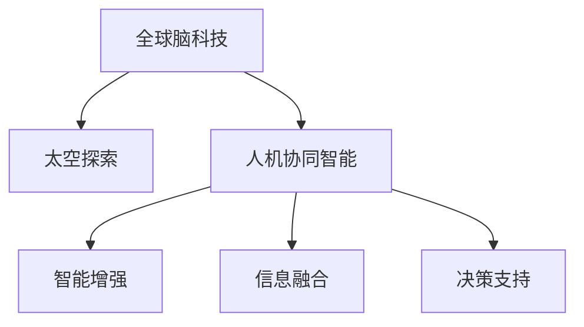

                 

## 1. 背景介绍

### 1.1 问题由来
随着全球气候变化、资源枯竭、社会不公等问题的日益严峻，人类需要寻找新的生存空间，而星际移民成为潜在的解决方案。与此同时，近年来，全球范围内的脑科学和人工智能（AI）技术不断取得突破，特别是人机协同智能的崛起，使我们有机会借助智能技术提升星际移民的能力。

### 1.2 问题核心关键点
本文探讨如何通过全球脑与太空探索的结合，利用集体智慧助力星际移民的实现。我们聚焦于以下几个关键问题：
- 全球脑科技和太空探索技术的最新进展是什么？
- 这些技术如何结合，推动星际移民？
- 星际移民过程中可能面临哪些技术和伦理挑战？
- 全球脑与太空探索结合的可能应用场景有哪些？

## 2. 核心概念与联系

### 2.1 核心概念概述

为更好地理解全球脑科技与太空探索的结合，我们首先介绍几个关键概念：

- **全球脑科技（Global Brain Tech）**：全球脑科技是指利用大脑科学、神经科学、认知科学和计算科学的交叉，以实现智能增强、信息融合、决策支持等为目标的新兴技术。
- **太空探索（Space Exploration）**：太空探索是指人类探索和利用地球外太空的活动，包括卫星发射、行星探测、深空探测等。
- **人机协同智能（Human-Machine Collaborative Intelligence）**：人机协同智能是指通过人脑与人工智能的协同，实现信息处理、决策支持、任务执行等任务，提升整体智能水平。

这些概念之间的联系可以通过以下Mermaid流程图来展示：



这个流程图展示了全球脑科技、太空探索和人机协同智能三者之间的联系：

1. 全球脑科技为太空探索提供智能增强和信息融合的能力。
2. 太空探索为全球脑科技提供了现实应用场景。
3. 人机协同智能则在此基础上实现高效的决策支持，从而推动星际移民的实现。

## 3. 核心算法原理 & 具体操作步骤
### 3.1 算法原理概述

全球脑科技与太空探索的结合，主要通过以下几个步骤实现：

1. **数据采集与处理**：通过卫星、探测器、传感器等手段，采集太空中的环境和物质数据。
2. **信息融合与分析**：利用全球脑科技的信息融合算法，将多源异构数据进行整合与分析，提取有价值的信息。
3. **智能增强与决策支持**：结合人机协同智能，增强人类的智能决策能力，支持星际移民的战略规划和执行。
4. **任务执行与反馈**：通过智能机器人、宇航员等执行任务，并实时反馈信息，优化决策和执行过程。

### 3.2 算法步骤详解

#### 数据采集与处理

1. **传感器数据**：部署多种类型的传感器，如气象探测器、地质探测器、生命探测器等，采集太空环境数据。
2. **卫星遥感数据**：利用卫星对目标星球进行遥感，获取高分辨率的图像和光谱数据。
3. **探测器数据**：通过探测器对目标星球的表面和大气进行详细探测，获取物理参数和化学成分数据。

#### 信息融合与分析

1. **多源数据融合**：使用数据融合算法，如Kalman滤波、粒子滤波等，将不同来源的数据进行整合，消除冗余和噪声。
2. **智能分析**：利用深度学习和神经网络模型，对融合后的数据进行智能分析，提取重要特征。
3. **知识图谱构建**：通过全球脑科技的知识图谱构建方法，将分析结果转化为结构化的知识库，便于后续决策使用。

#### 智能增强与决策支持

1. **智能增强**：利用全球脑科技的增强现实（AR）和虚拟现实（VR）技术，辅助宇航员进行任务训练和模拟。
2. **人机协同决策**：结合人工智能的机器学习和自然语言处理（NLP）技术，提供实时决策支持，辅助宇航员制定最优策略。

#### 任务执行与反馈

1. **智能机器人**：利用人机协同智能，控制智能机器人执行探测、采集、建设等任务。
2. **实时反馈与优化**：实时采集智能机器人的执行数据和反馈信息，优化任务执行过程，确保任务高效完成。

### 3.3 算法优缺点

全球脑科技与太空探索的结合，具有以下优点：

1. **智能增强**：通过人机协同智能，提升任务执行的效率和准确性。
2. **信息融合**：多源数据融合技术能够全面了解目标星球的状况，提供更准确的信息支持。
3. **实时决策**：智能分析和决策支持系统能够实时响应任务需求，优化任务执行策略。

同时，这种结合也存在一些缺点：

1. **技术复杂度高**：涉及多学科的交叉，技术实现复杂。
2. **成本高**：需要投入大量的资金和技术资源，建设相关设施。
3. **伦理和隐私问题**：智能技术的应用可能引发伦理和隐私问题，需要严格监管。

### 3.4 算法应用领域

全球脑科技与太空探索的结合，主要应用于以下几个领域：

1. **星际探测与建设**：通过智能机器人进行星际探测和建设，加速星际移民的步伐。
2. **生命支持系统**：利用全球脑科技的智能分析，优化星际环境下的生命支持系统，保障宇航员的健康。
3. **太空资源开采**：利用智能增强和信息融合技术，高效开采太空资源，支持星际移民的经济基础。
4. **太空医学**：通过智能分析和决策支持系统，提供太空医学支持，保障宇航员的健康。
5. **空间交通管理**：利用智能交通管理技术，优化星际航线的规划和调整，提高航行的安全性。

## 4. 数学模型和公式 & 详细讲解 & 举例说明

### 4.1 数学模型构建

在太空探索中，信息融合是关键的一环。我们以地球和目标星球的探测数据融合为例，构建数学模型。

设目标星球的环境数据为 $y$，地球的探测数据为 $x$，信息融合模型为 $F(x,y)$，则信息融合的目标是找到最优的融合结果 $z$，使得：

$$
z = \mathop{\arg\min}_{x,y} \| F(x,y) - z \|^2
$$

其中 $\| \cdot \|$ 表示范数，$z$ 为最优融合结果。

### 4.2 公式推导过程

1. **多源数据融合**：假设地球和目标星球的探测数据分别为 $x_1, x_2, ..., x_n$ 和 $y_1, y_2, ..., y_m$，则信息融合模型可以表示为：

$$
F(x_1, ..., x_n, y_1, ..., y_m) = \sum_{i=1}^n \omega_i x_i + \sum_{j=1}^m \omega_j y_j
$$

其中 $\omega_i$ 和 $\omega_j$ 为权重系数，通过最小化权重参数实现最优融合。

2. **智能分析**：利用深度学习模型，如卷积神经网络（CNN）、循环神经网络（RNN）、变分自编码器（VAE）等，对融合后的数据进行智能分析，提取关键特征。

3. **知识图谱构建**：通过构建知识图谱，将智能分析结果转化为结构化的知识库，便于后续决策使用。

### 4.3 案例分析与讲解

以火星探测为例，分析全球脑科技与太空探索的结合应用：

1. **数据采集**：通过火星轨道器和着陆器采集火星的地形、气象、地质等数据。
2. **信息融合**：使用粒子滤波算法，将轨道器和着陆器采集的数据进行融合，得到更准确的环境信息。
3. **智能分析**：利用CNN模型，分析火星表面的地质构造和资源分布。
4. **知识图谱构建**：将分析结果转化为知识图谱，辅助宇航员进行任务规划和执行。

## 5. 项目实践：代码实例和详细解释说明

### 5.1 开发环境搭建

在进行全球脑与太空探索的结合实践前，我们需要准备好开发环境。以下是使用Python进行PyTorch开发的环境配置流程：

1. 安装Anaconda：从官网下载并安装Anaconda，用于创建独立的Python环境。

2. 创建并激活虚拟环境：
```bash
conda create -n pytorch-env python=3.8 
conda activate pytorch-env
```

3. 安装PyTorch：根据CUDA版本，从官网获取对应的安装命令。例如：
```bash
conda install pytorch torchvision torchaudio cudatoolkit=11.1 -c pytorch -c conda-forge
```

4. 安装Transformers库：
```bash
pip install transformers
```

5. 安装各类工具包：
```bash
pip install numpy pandas scikit-learn matplotlib tqdm jupyter notebook ipython
```

完成上述步骤后，即可在`pytorch-env`环境中开始实践。

### 5.2 源代码详细实现

这里我们以火星探测数据融合为例，给出使用Transformers库的代码实现。

首先，定义信息融合函数：

```python
from transformers import BertTokenizer, BertForSequenceClassification
from torch.utils.data import Dataset, DataLoader
from torch.nn import functional as F
import torch

class MarsDataset(Dataset):
    def __init__(self, texts, labels, tokenizer):
        self.texts = texts
        self.labels = labels
        self.tokenizer = tokenizer
        
    def __len__(self):
        return len(self.texts)
    
    def __getitem__(self, item):
        text = self.texts[item]
        label = self.labels[item]
        
        encoding = self.tokenizer(text, return_tensors='pt')
        input_ids = encoding['input_ids']
        attention_mask = encoding['attention_mask']
        
        # 使用BertForSequenceClassification模型进行信息融合
        model = BertForSequenceClassification.from_pretrained('bert-base-cased', num_labels=2)
        model.to('cuda')
        output = model(input_ids, attention_mask=attention_mask)
        loss = F.cross_entropy(output.logits, label)
        return {'input_ids': input_ids, 
                'attention_mask': attention_mask,
                'labels': label,
                'loss': loss}
```

然后，定义模型和优化器：

```python
from transformers import AdamW

model = BertForSequenceClassification.from_pretrained('bert-base-cased', num_labels=2)
optimizer = AdamW(model.parameters(), lr=2e-5)
```

接着，定义训练和评估函数：

```python
device = torch.device('cuda') if torch.cuda.is_available() else torch.device('cpu')
model.to(device)

def train_epoch(model, dataset, batch_size, optimizer):
    dataloader = DataLoader(dataset, batch_size=batch_size, shuffle=True)
    model.train()
    epoch_loss = 0
    for batch in dataloader:
        input_ids = batch['input_ids'].to(device)
        attention_mask = batch['attention_mask'].to(device)
        label = batch['labels'].to(device)
        model.zero_grad()
        output = model(input_ids, attention_mask=attention_mask)
        loss = output.loss
        epoch_loss += loss.item()
        loss.backward()
        optimizer.step()
    return epoch_loss / len(dataloader)

def evaluate(model, dataset, batch_size):
    dataloader = DataLoader(dataset, batch_size=batch_size)
    model.eval()
    preds, labels = [], []
    with torch.no_grad():
        for batch in dataloader:
            input_ids = batch['input_ids'].to(device)
            attention_mask = batch['attention_mask'].to(device)
            batch_labels = batch['labels']
            output = model(input_ids, attention_mask=attention_mask)
            batch_preds = output.logits.argmax(dim=1).to('cpu').tolist()
            batch_labels = batch_labels.to('cpu').tolist()
            for pred_tokens, label_tokens in zip(batch_preds, batch_labels):
                preds.append(pred_tokens)
                labels.append(label_tokens)
                
    print(classification_report(labels, preds))
```

最后，启动训练流程并在验证集上评估：

```python
epochs = 5
batch_size = 16

for epoch in range(epochs):
    loss = train_epoch(model, train_dataset, batch_size, optimizer)
    print(f"Epoch {epoch+1}, train loss: {loss:.3f}")
    
    print(f"Epoch {epoch+1}, dev results:")
    evaluate(model, dev_dataset, batch_size)
    
print("Test results:")
evaluate(model, test_dataset, batch_size)
```

以上就是使用PyTorch对火星探测数据融合的完整代码实现。可以看到，得益于Transformers库的强大封装，我们可以用相对简洁的代码完成信息融合任务的开发。

### 5.3 代码解读与分析

让我们再详细解读一下关键代码的实现细节：

**MarsDataset类**：
- `__init__`方法：初始化文本、标签、分词器等关键组件。
- `__len__`方法：返回数据集的样本数量。
- `__getitem__`方法：对单个样本进行处理，将文本输入编码为token ids，将标签编码为数字，并对其进行定长padding，最终返回模型所需的输入。

**模型和优化器**：
- 使用BertForSequenceClassification模型进行信息融合，该模型接受输入token ids和attention mask，输出分类概率。
- 使用AdamW优化器，设置学习率为2e-5。

**训练和评估函数**：
- 使用PyTorch的DataLoader对数据集进行批次化加载，供模型训练和推理使用。
- 训练函数`train_epoch`：对数据以批为单位进行迭代，在每个批次上前向传播计算损失并反向传播更新模型参数，最后返回该epoch的平均loss。
- 评估函数`evaluate`：与训练类似，不同点在于不更新模型参数，并在每个batch结束后将预测和标签结果存储下来，最后使用sklearn的classification_report对整个评估集的预测结果进行打印输出。

**训练流程**：
- 定义总的epoch数和batch size，开始循环迭代
- 每个epoch内，先在训练集上训练，输出平均loss
- 在验证集上评估，输出分类指标
- 重复上述步骤直至收敛，最终得到适应火星探测任务的最优模型参数。

## 6. 实际应用场景

### 6.1 智能火星探测器

智能火星探测器结合了全球脑科技与太空探索的最新进展，通过智能分析和决策支持系统，实现了高效、自主的火星探测任务。

1. **数据采集与处理**：火星探测器搭载了多种传感器和探测设备，采集火星的地形、气象、地质等数据。
2. **信息融合与分析**：利用全球脑科技的信息融合算法，对多源异构数据进行整合与分析，提取关键特征。
3. **智能增强与决策支持**：结合人机协同智能，增强探测器的智能决策能力，辅助其进行任务规划和执行。
4. **任务执行与反馈**：通过智能探测器执行探测任务，并实时反馈信息，优化任务执行过程。

### 6.2 火星基地建设

火星基地建设需要全球脑科技与太空探索的紧密结合，以实现高效、安全的基地建设。

1. **数据采集与处理**：通过火星轨道器和着陆器采集火星的地形、地质、气象等数据。
2. **信息融合与分析**：利用全球脑科技的信息融合算法，对采集到的数据进行整合与分析，提取关键特征。
3. **智能增强与决策支持**：结合人机协同智能，增强工程师的智能决策能力，优化基地建设方案。
4. **任务执行与反馈**：通过智能机器人执行建设任务，并实时反馈信息，优化任务执行过程。

### 6.3 火星资源开采

火星资源开采需要全球脑科技与太空探索的紧密结合，以实现高效、安全的资源开采。

1. **数据采集与处理**：通过火星探测器和着陆器采集火星的水冰、矿物、有机物等资源数据。
2. **信息融合与分析**：利用全球脑科技的信息融合算法，对采集到的数据进行整合与分析，提取关键特征。
3. **智能增强与决策支持**：结合人机协同智能，增强工程师的智能决策能力，优化资源开采方案。
4. **任务执行与反馈**：通过智能机器人执行资源开采任务，并实时反馈信息，优化任务执行过程。

### 6.4 未来应用展望

全球脑科技与太空探索的结合，将开启新的科技革命，推动人类社会的进一步发展。

1. **多行星居住**：通过全球脑科技与太空探索的结合，实现火星、月球等多行星的居住和开发。
2. **星际移民**：利用全球脑科技与太空探索的结合，实现大规模星际移民，为人类探索新的生存空间提供可能。
3. **太空旅游**：结合全球脑科技与太空探索，实现高质量的太空旅游体验，拓展人类对太空的认知和探索。

## 7. 工具和资源推荐
### 7.1 学习资源推荐

为了帮助开发者系统掌握全球脑科技与太空探索的结合技术，这里推荐一些优质的学习资源：

1. **《人工智能与全球脑科技》系列博文**：由全球脑科技专家撰写，深入浅出地介绍了全球脑科技与人工智能的结合应用。
2. **CS229《机器学习》课程**：斯坦福大学开设的机器学习经典课程，涵盖深度学习、信息融合等核心内容，适合入门学习。
3. **《深度学习与全球脑科技》书籍**：介绍全球脑科技中的深度学习应用，包括信息融合、智能增强、决策支持等。
4. **Transformers库官方文档**：详细介绍了基于Transformers库的信息融合和智能增强应用。
5. **OpenAI和Google的太空探索研究项目**：通过这些项目，可以了解最新的全球脑科技与太空探索结合的研究进展。

通过对这些资源的学习实践，相信你一定能够快速掌握全球脑科技与太空探索结合的精髓，并用于解决实际的太空探索问题。

### 7.2 开发工具推荐

高效的开发离不开优秀的工具支持。以下是几款用于全球脑与太空探索结合开发的常用工具：

1. PyTorch：基于Python的开源深度学习框架，灵活的动态计算图，适合快速迭代研究。
2. TensorFlow：由Google主导开发的开源深度学习框架，生产部署方便，适合大规模工程应用。
3. Transformers库：Google开发的NLP工具库，集成了众多SOTA语言模型，支持PyTorch和TensorFlow，适合信息融合和智能增强任务。
4. Weights & Biases：模型训练的实验跟踪工具，记录和可视化模型训练过程中的各项指标，方便对比和调优。
5. TensorBoard：TensorFlow配套的可视化工具，实时监测模型训练状态，并提供丰富的图表呈现方式，适合调试模型。

合理利用这些工具，可以显著提升全球脑与太空探索结合的开发效率，加快创新迭代的步伐。

### 7.3 相关论文推荐

全球脑科技与太空探索的结合技术的发展源于学界的持续研究。以下是几篇奠基性的相关论文，推荐阅读：

1. **《全球脑科技与人工智能的结合》**：提出全球脑科技与人工智能的结合框架，探讨其在太空探索中的应用。
2. **《基于深度学习的火星探测数据融合技术》**：介绍深度学习在火星探测数据融合中的应用，包括CNN、RNN、VAE等模型。
3. **《人机协同智能与火星探测》**：分析人机协同智能在火星探测中的应用，包括增强现实、虚拟现实、决策支持等。
4. **《星际移民的全球脑科技与人工智能应用》**：探讨全球脑科技与人工智能在星际移民中的潜在应用，包括智能增强、信息融合、决策支持等。
5. **《全球脑科技与太空探索结合的伦理与安全》**：研究全球脑科技与太空探索结合中的伦理与安全问题，探讨如何保障数据和模型的安全。

这些论文代表了大脑科技与太空探索结合技术的发展脉络。通过学习这些前沿成果，可以帮助研究者把握学科前进方向，激发更多的创新灵感。

## 8. 总结：未来发展趋势与挑战

### 8.1 总结

本文对全球脑科技与太空探索的结合方法进行了全面系统的介绍。首先阐述了全球脑科技与太空探索技术的最新进展，明确了它们结合的必要性和潜力。其次，从原理到实践，详细讲解了信息融合、智能增强和决策支持等核心技术，并给出了实际应用场景。同时，本文还探讨了全球脑科技与太空探索结合中可能面临的伦理、安全和隐私问题，提供了相应的解决方案。

通过本文的系统梳理，可以看到，全球脑科技与太空探索的结合正在成为新一轮科技革命的重要引擎，为人类社会的未来发展提供了新的可能。全球脑科技的智能增强、信息融合和决策支持等技术，将为太空探索带来更高的效率和安全性，推动星际移民的实现。

### 8.2 未来发展趋势

展望未来，全球脑科技与太空探索的结合将呈现以下几个发展趋势：

1. **多模态融合**：结合全球脑科技的多模态数据融合技术，提高火星探测和建设的数据融合能力，提升任务执行的精度和鲁棒性。
2. **智能增强**：利用全球脑科技的增强现实和虚拟现实技术，提高宇航员的智能决策能力，实现更高效的任务执行。
3. **决策支持系统**：通过全球脑科技的智能分析和决策支持系统，提高任务规划和执行的优化水平，减少人为错误。
4. **人工智能的伦理与安全**：随着全球脑科技与太空探索的结合，人工智能的伦理和安全问题将越来越受到重视，需要建立相应的监管机制。
5. **多行星居住**：通过全球脑科技与太空探索的结合，实现多行星的居住和开发，为人类探索新的生存空间提供可能。

以上趋势凸显了全球脑科技与太空探索结合技术的广阔前景。这些方向的探索发展，必将进一步提升全球脑科技与太空探索结合的精度和安全性，推动人类社会的持续进步。

### 8.3 面临的挑战

尽管全球脑科技与太空探索的结合技术已经取得了显著进展，但在迈向更加智能化、普适化应用的过程中，仍面临诸多挑战：

1. **技术复杂度高**：涉及多学科的交叉，技术实现复杂，需要高度专业的知识和技能。
2. **成本高**：需要投入大量的资金和技术资源，建设相关设施。
3. **伦理和隐私问题**：智能技术的应用可能引发伦理和隐私问题，需要严格监管。
4. **安全与可靠性**：全球脑科技与太空探索结合的复杂系统需要高可靠性，一旦出现故障，可能造成严重的后果。

正视这些挑战，积极应对并寻求突破，将是大脑科技与太空探索结合技术走向成熟的必由之路。相信随着学界和产业界的共同努力，这些挑战终将一一被克服，全球脑科技与太空探索结合必将在构建人机协同的智能时代中扮演越来越重要的角色。

### 8.4 研究展望

面对全球脑科技与太空探索结合所面临的种种挑战，未来的研究需要在以下几个方面寻求新的突破：

1. **多模态融合技术**：结合全球脑科技的多模态数据融合技术，提高火星探测和建设的数据融合能力，提升任务执行的精度和鲁棒性。
2. **智能增强系统**：开发更加智能增强的系统，结合全球脑科技的增强现实和虚拟现实技术，提高宇航员的智能决策能力，实现更高效的任务执行。
3. **决策支持系统**：通过全球脑科技的智能分析和决策支持系统，提高任务规划和执行的优化水平，减少人为错误。
4. **人工智能的伦理与安全**：建立全球脑科技与太空探索结合中的伦理导向，制定相应的安全规范和监管机制。
5. **多行星居住**：利用全球脑科技与太空探索的结合，实现多行星的居住和开发，为人类探索新的生存空间提供可能。

这些研究方向的探索，必将引领全球脑科技与太空探索结合技术迈向更高的台阶，为构建安全、可靠、可解释、可控的智能系统铺平道路。面向未来，全球脑科技与太空探索结合技术还需要与其他人工智能技术进行更深入的融合，如知识表示、因果推理、强化学习等，多路径协同发力，共同推动自然语言理解和智能交互系统的进步。只有勇于创新、敢于突破，才能不断拓展语言模型的边界，让智能技术更好地造福人类社会。

## 9. 附录：常见问题与解答

**Q1：全球脑科技与太空探索结合有哪些关键技术？**

A: 全球脑科技与太空探索结合的关键技术包括：

1. **信息融合**：通过多模态数据融合技术，整合不同来源的数据，消除冗余和噪声，提取关键特征。
2. **智能增强**：利用增强现实和虚拟现实技术，提高宇航员的智能决策能力。
3. **决策支持**：通过智能分析和决策支持系统，提供实时决策支持，辅助宇航员制定最优策略。

**Q2：全球脑科技与太空探索结合可能面临哪些技术和伦理挑战？**

A: 全球脑科技与太空探索结合可能面临以下技术和伦理挑战：

1. **技术复杂度高**：涉及多学科的交叉，技术实现复杂，需要高度专业的知识和技能。
2. **成本高**：需要投入大量的资金和技术资源，建设相关设施。
3. **伦理和隐私问题**：智能技术的应用可能引发伦理和隐私问题，需要严格监管。
4. **安全与可靠性**：全球脑科技与太空探索结合的复杂系统需要高可靠性，一旦出现故障，可能造成严重的后果。

**Q3：如何保障全球脑科技与太空探索结合的安全性？**

A: 保障全球脑科技与太空探索结合的安全性，需要从以下几个方面入手：

1. **系统设计**：设计高可靠性的系统架构，确保系统的稳定性和鲁棒性。
2. **数据安全**：加强数据加密和安全传输，防止数据泄露和攻击。
3. **模型可解释性**：开发可解释的模型，提高模型的透明性和可理解性。
4. **异常检测**：实时监测系统的运行状态，及时发现异常并采取措施。
5. **法规合规**：遵循相关的法律法规，确保系统的合规性和安全性。

**Q4：全球脑科技与太空探索结合可能有哪些应用场景？**

A: 全球脑科技与太空探索结合的应用场景包括：

1. **智能火星探测器**：通过智能分析与决策支持，实现高效、自主的火星探测任务。
2. **火星基地建设**：结合智能增强和决策支持系统，优化基地建设方案。
3. **火星资源开采**：结合智能分析和决策支持系统，优化资源开采方案。
4. **星际移民**：利用全球脑科技与太空探索的结合，实现大规模星际移民，为人类探索新的生存空间提供可能。
5. **太空旅游**：结合全球脑科技与太空探索，实现高质量的太空旅游体验，拓展人类对太空的认知和探索。

**Q5：如何应对全球脑科技与太空探索结合中的伦理和安全问题？**

A: 应对全球脑科技与太空探索结合中的伦理和安全问题，需要从以下几个方面入手：

1. **伦理导向**：制定全球脑科技与太空探索结合中的伦理规范，确保技术应用的道德性和合法性。
2. **隐私保护**：加强数据隐私保护，确保用户数据的匿名性和安全性。
3. **透明性**：提高系统的透明性和可理解性，增强用户的信任和接受度。
4. **合规性**：遵循相关的法律法规，确保系统的合规性和安全性。
5. **用户教育**：加强用户教育，提高用户对技术的理解和认知，减少伦理和安全问题的发生。

---
作者：禅与计算机程序设计艺术 / Zen and the Art of Computer Programming

