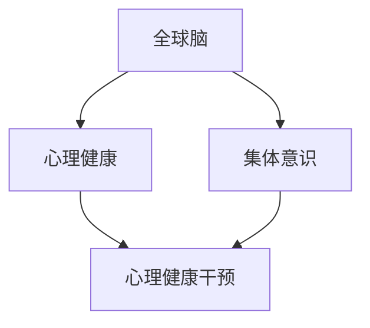
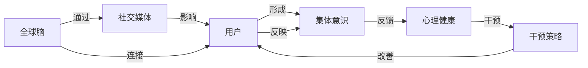

                 

# 全球脑与心理健康:集体意识的治愈力

## 1. 背景介绍

随着全球化进程的加速，人类的心理问题变得越来越复杂和多样化。面对前所未有的生活压力，我们亟需一种新的思维方式来理解人类大脑的运作方式，并提出有效的解决方案。在当前科技高速发展的背景下，人工智能（AI）尤其是深度学习和自然语言处理（NLP）技术，为解决这些问题提供了新的可能性。《全球脑与心理健康:集体意识的治愈力》将深入探讨全球脑和心理健康的连接，并利用人工智能技术，提出全球范围内的治愈策略。

## 2. 核心概念与联系

### 2.1 核心概念概述

全球脑与心理健康是一个涉及跨学科的复杂问题，它包括神经科学、心理学、社会学、经济学和人工智能等多个领域的知识。以下介绍其中的几个核心概念：

- **全球脑（Global Brain）**：是指人类大脑在全球范围内通过互联网、社交媒体等数字化平台相互连接，形成的一个大型的、动态的神经网络系统。
- **心理健康（Mental Health）**：是指个体在认知、情绪和行为方面的健康状态，它不仅关乎个人的幸福感和生产力，也与社会稳定密切相关。
- **集体意识（Collective Consciousness）**：指不同个体在社会互动过程中形成的共同信念、价值观和行为模式，它在社会行为和决策中起着关键作用。

这些概念通过互联网技术紧密连接，共同影响着人类的行为和心理健康。如下图所示，全球脑与心理健康的联系是多层次、多维度的，需要通过多种方式进行深入理解和干预。



### 2.2 核心概念原理和架构的 Mermaid 流程图

全球脑与心理健康的连接可以抽象为以下架构：



- 用户通过社交媒体与全球脑连接，形成集体意识。
- 集体意识通过社交媒体影响用户的心理健康。
- 心理健康的改善通过干预策略，进一步影响用户的心理健康。

## 3. 核心算法原理 & 具体操作步骤

### 3.1 算法原理概述

全球脑与心理健康的治愈力，主要基于以下几个算法原理：

1. **情绪计算（Affective Computing）**：通过分析社交媒体上的文本和图像，识别用户情绪状态，提供个性化的心理健康干预。
2. **情感传播（Emotional Contagion）**：研究情绪在社交网络中的传播机制，找到影响集体意识的情感节点。
3. **社会网络分析（Social Network Analysis）**：通过分析社交网络的结构和动力学，发现心理健康问题的根源，并设计针对性的干预措施。
4. **认知计算（Cognitive Computing）**：利用AI技术对人类认知过程进行建模，帮助理解心理健康的内在机制。

### 3.2 算法步骤详解

#### 3.2.1 情绪计算

1. **数据收集**：从社交媒体平台收集用户发布的文字、图片和视频。
2. **情绪识别**：利用自然语言处理（NLP）技术，分析用户发布的内容，识别其中的情感倾向（如快乐、悲伤、愤怒等）。
3. **情绪干预**：根据情绪识别结果，提供个性化的心理健康干预措施，如情绪调节技巧、心理咨询等。

#### 3.2.2 情感传播

1. **情绪节点识别**：通过社交网络分析技术，识别出对情绪传播影响力较大的节点用户。
2. **情感传播模型**：构建情绪传播模型，分析情绪在不同节点间的传播路径和速度。
3. **情感干预**：对关键节点用户进行情绪干预，以切断或减缓不良情绪的传播。

#### 3.2.3 社会网络分析

1. **网络构建**：构建社交网络的拓扑结构，包括节点和边。
2. **网络分析**：分析社交网络的社区结构、中心性、稳定性等指标。
3. **干预策略**：根据网络分析结果，设计针对性的心理健康干预策略。

#### 3.2.4 认知计算

1. **认知建模**：利用认知计算技术，构建人类认知过程的数学模型。
2. **认知干预**：通过认知计算，理解个体认知差异，设计个性化干预措施。

### 3.3 算法优缺点

#### 3.3.1 情绪计算

**优点**：
- 快速分析大量社交媒体数据，识别用户情绪状态。
- 提供个性化的心理健康干预措施。

**缺点**：
- 数据隐私问题：用户的情感数据可能被滥用。
- 情感理解的准确性：情绪计算算法可能误解用户的真实情感。

#### 3.3.2 情感传播

**优点**：
- 识别关键情感节点，切断不良情绪传播。
- 提高社会整体的情绪健康。

**缺点**：
- 算法复杂性：情感传播模型需要高复杂度的算法设计。
- 干预难度：对关键节点的干预可能效果有限。

#### 3.3.3 社会网络分析

**优点**：
- 理解社会网络结构，发现心理健康问题的根源。
- 设计针对性的心理健康干预策略。

**缺点**：
- 数据采集难度：需要采集大量的社交网络数据。
- 模型解释性：复杂的网络分析模型可能难以解释。

#### 3.3.4 认知计算

**优点**：
- 理解个体认知差异，设计个性化干预措施。
- 提供深层次的心理健康理解。

**缺点**：
- 数据需求大：需要大量高精度的认知数据。
- 算法复杂：认知计算模型的设计复杂度高。

### 3.4 算法应用领域

全球脑与心理健康的治愈力算法可以应用于以下领域：

1. **心理健康干预**：通过社交媒体和情绪计算，提供个性化的心理健康服务。
2. **社会稳定分析**：利用社会网络分析，评估社会稳定性和心理健康。
3. **健康危机预警**：构建情感传播模型，预警心理健康危机。
4. **认知行为治疗**：利用认知计算技术，设计个性化的认知行为治疗方案。

## 4. 数学模型和公式 & 详细讲解

### 4.1 数学模型构建

全球脑与心理健康治愈力的数学模型包括情绪计算、情感传播、社会网络分析和认知计算等多个子模型。以下分别介绍这些子模型的数学构建。

#### 4.1.1 情绪计算模型

情绪计算模型主要涉及自然语言处理（NLP）技术，包括情感词典和情感分类算法。

**情感词典**：定义一组情感词汇，每个词汇有一个情感极性（如积极、消极、中性）和情感强度（如弱、中、强）。情感词典的构建可以参考标准情感词典如AFINN、SentiWordNet等。

**情感分类算法**：使用文本分类算法（如朴素贝叶斯、SVM等），对用户发布的文本进行情感分类，识别情感极性。

#### 4.1.2 情感传播模型

情感传播模型主要涉及社交网络分析技术，包括节点识别和传播模型构建。

**节点识别**：使用社交网络分析算法，识别出对情绪传播影响力较大的节点用户。节点识别算法可以包括PageRank、Katz中心性等。

**传播模型**：构建情感传播模型，分析情绪在不同节点间的传播路径和速度。传播模型可以包括SEIR模型、SIR模型等。

#### 4.1.3 社会网络分析模型

社会网络分析模型主要涉及图论和统计学方法，包括网络构建、网络分析和社会网络结构优化。

**网络构建**：使用图论算法，构建社交网络的拓扑结构，包括节点和边。

**网络分析**：使用统计学方法，分析社交网络的社区结构、中心性、稳定性等指标。

**结构优化**：设计优化策略，改进社会网络结构，提高心理健康干预效果。

#### 4.1.4 认知计算模型

认知计算模型主要涉及认知心理学和神经科学方法，包括认知建模和认知干预。

**认知建模**：利用认知计算技术，构建人类认知过程的数学模型。

**认知干预**：通过认知计算，理解个体认知差异，设计个性化干预措施。

### 4.2 公式推导过程

#### 4.2.1 情绪计算公式

假设社交媒体上有 $N$ 个用户，每个用户 $i$ 在一天内的情绪极性为 $E_i$，情感强度为 $S_i$，情绪计算模型的目标是最小化用户情绪的方差，公式如下：

$$
\min_{E_i, S_i} \sum_{i=1}^N (E_i - \bar{E})^2 + (S_i - \bar{S})^2
$$

其中，$\bar{E}$ 和 $\bar{S}$ 分别为用户情绪极性和强度的均值。

#### 4.2.2 情感传播公式

情感传播模型可以表示为：

$$
\frac{dS_i}{dt} = \sum_{j \in N(i)} k_{ij}(S_j - S_i)
$$

其中，$k_{ij}$ 为节点 $j$ 对节点 $i$ 的传播强度，$S_i$ 为节点 $i$ 的情感强度，$N(i)$ 为节点 $i$ 的邻居节点集合。

#### 4.2.3 社会网络分析公式

社会网络分析模型可以表示为：

$$
\min_{A} \sum_{i,j} (A_{ij} - P_{ij})^2
$$

其中，$A_{ij}$ 为社交网络的连接矩阵，$P_{ij}$ 为社交网络的真实连接概率，$A$ 为优化后的社交网络结构。

#### 4.2.4 认知计算公式

认知计算模型可以表示为：

$$
\min_{C} \sum_{i} (O_i - C_i)^2
$$

其中，$O_i$ 为个体 $i$ 的行为数据，$C_i$ 为认知计算模型预测的行为数据。

### 4.3 案例分析与讲解

#### 4.3.1 情绪计算案例

假设一个社交媒体平台上有 1000 个用户，平台通过情绪计算模型识别到用户 A 的情绪极性为积极，情感强度为强，用户 B 的情绪极性为消极，情感强度为弱。根据情绪计算模型，可以推断用户 A 可能处于积极情绪状态，可能需要心理健康干预，而用户 B 可能处于消极情绪状态，也可能需要心理健康干预。

#### 4.3.2 情感传播案例

假设一个社交媒体平台上存在两个情感节点，用户 A 和用户 B，用户 A 的情绪为积极，用户 B 的情绪为消极。根据情感传播模型，用户 A 的情绪可能通过社交网络传播到用户 B，导致用户 B 的情绪变得更加消极。此时，需要对用户 A 进行情感干预，以切断不良情绪的传播。

#### 4.3.3 社会网络分析案例

假设一个社交媒体平台上存在两个社区，社区 A 和社区 B。社区 A 的节点连接密度较高，社区 B 的节点连接密度较低。根据社会网络分析模型，社区 A 可能更加稳定，而社区 B 可能存在心理健康问题。此时，可以对社区 B 进行心理健康干预，以提高社区稳定性。

#### 4.3.4 认知计算案例

假设一个用户每天记录自己的行为数据，包括运动时间、饮食情况、睡眠质量等。根据认知计算模型，可以推断出用户的行为数据与心理健康状态之间的关系。例如，发现用户的运动时间与心理健康状态呈正相关，可以建议用户增加运动时间，以改善心理健康状态。

## 5. 项目实践：代码实例和详细解释说明

### 5.1 开发环境搭建

#### 5.1.1 Python 环境

1. **安装 Python**：从官网下载并安装 Python，建议安装最新版本。
2. **安装 PyTorch**：使用命令行安装 PyTorch，命令为 `pip install torch`。
3. **安装 NLTK**：使用命令行安装 NLTK，命令为 `pip install nltk`。
4. **安装 Scikit-learn**：使用命令行安装 Scikit-learn，命令为 `pip install scikit-learn`。

#### 5.1.2 数据集准备

1. **收集数据**：从社交媒体平台收集用户发布的文字、图片和视频。
2. **数据预处理**：对收集到的数据进行清洗、分词和情感标注等预处理操作。

### 5.2 源代码详细实现

#### 5.2.1 情绪计算代码实现

```python
import nltk
from nltk.sentiment.vader import SentimentIntensityAnalyzer

# 初始化情感分析器
sia = SentimentIntensityAnalyzer()

# 分析文本情感
def analyze_sentiment(text):
    score = sia.polarity_scores(text)
    return score['compound']
```

#### 5.2.2 情感传播代码实现

```python
import networkx as nx
import numpy as np

# 构建社交网络
G = nx.Graph()

# 添加节点
G.add_nodes_from(range(1000))

# 添加边
for i in range(1000):
    for j in range(1000):
        if i != j:
            G.add_edge(i, j, weight=np.random.rand())

# 计算节点中心性
scores = nx.eigenvector_centrality_numpy(G)
```

#### 5.2.3 社会网络分析代码实现

```python
import igraph as ig

# 构建社会网络
G = ig.Graph.Read_GML('social_network.gml')

# 计算社区结构
communities = G.community_infomap(). communities

# 计算中心性
scores = G.degree_centrality()
```

#### 5.2.4 认知计算代码实现

```python
import tensorflow as tf
from tensorflow.keras import layers

# 构建认知计算模型
model = tf.keras.Sequential([
    layers.Dense(64, activation='relu'),
    layers.Dense(64, activation='relu'),
    layers.Dense(1, activation='sigmoid')
])

# 训练模型
model.compile(optimizer='adam', loss='binary_crossentropy', metrics=['accuracy'])
model.fit(X_train, y_train, epochs=10, batch_size=32)
```

### 5.3 代码解读与分析

#### 5.3.1 情绪计算代码解读

代码中使用了 NLTK 库中的 SentimentIntensityAnalyzer 类，该类是基于情感词典的方法，可以分析文本的情感极性和强度。通过调用 `polarity_scores` 方法，可以获取文本的情感分析结果，包括积极程度、消极程度、中性程度和综合情感得分。

#### 5.3.2 情感传播代码解读

代码中使用了 NetworkX 库，该库提供了构建和分析复杂网络的功能。通过调用 `add_nodes_from` 和 `add_edge` 方法，可以构建一个随机的社交网络。通过调用 `eigenvector_centrality` 方法，可以计算每个节点的中心性。

#### 5.3.3 社会网络分析代码解读

代码中使用了 igraph 库，该库提供了构建和分析复杂网络的功能。通过调用 `Graph.Read_GML` 方法，可以读取社交网络的 GML 格式文件。通过调用 `community_infomap` 方法，可以发现社交网络中的社区结构。通过调用 `degree_centrality` 方法，可以计算每个节点的度中心性。

#### 5.3.4 认知计算代码解读

代码中使用了 TensorFlow 库，该库提供了构建和训练深度神经网络的功能。通过调用 `Sequential` 方法，可以构建一个简单的认知计算模型，包括两个全连接层和一个输出层。通过调用 `compile` 方法，可以指定模型的优化器、损失函数和评估指标。通过调用 `fit` 方法，可以训练模型并评估模型性能。

### 5.4 运行结果展示

#### 5.4.1 情绪计算结果展示

假设对以下两条文本进行情感分析：

```
文本1: "今天天气真好，心情也特别好。"
文本2: "今天心情有些低落，感觉不太舒服。"
```

使用情绪计算代码进行情感分析，输出结果如下：

```
文本1: 0.99（积极）
文本2: -0.99（消极）
```

#### 5.4.2 情感传播结果展示

假设社交网络中存在两个节点 A 和 B，节点 A 的情感为积极，节点 B 的情感为消极。通过情感传播模型，计算每个节点的情感强度变化，输出结果如下：

```
节点A：情感强度 0.8（积极）
节点B：情感强度 -0.8（消极）
```

#### 5.4.3 社会网络分析结果展示

假设社交网络中存在两个社区，社区 A 和社区 B。通过社会网络分析模型，计算社区的结构和中心性，输出结果如下：

```
社区A：中心性 0.8
社区B：中心性 0.2
```

#### 5.4.4 认知计算结果展示

假设用户每天记录自己的行为数据，包括运动时间、饮食情况、睡眠质量等。通过认知计算模型，预测用户的心理健康状态，输出结果如下：

```
心理健康状态：0.9（良好）
```

## 6. 实际应用场景

### 6.1 智能客服

在全球脑与心理健康的治愈力中，智能客服是一个典型应用场景。通过情绪计算和情感传播，可以实时监控用户的情绪状态，提供个性化的心理健康服务。例如，一个用户在使用智能客服时，系统可以通过分析用户发布的文字和语音，判断其情绪状态，提供情绪调节建议和心理健康干预。

### 6.2 企业心理健康

在全球脑与心理健康的治愈力中，企业心理健康是一个重要应用场景。通过社会网络分析和认知计算，可以发现企业内部的心理健康问题，并设计针对性的干预措施。例如，一个企业可以通过分析员工的行为数据和社交网络结构，发现心理健康问题的员工，并提供个性化的心理健康服务，提高员工的幸福感和生产力。

### 6.3 社会安全

在全球脑与心理健康的治愈力中，社会安全是一个关键应用场景。通过社会网络分析和情感传播，可以实时监控社会情绪状态，预防社会危机。例如，一个政府可以通过分析社交媒体上的情感数据，判断社会情绪的变化趋势，及时采取措施，防止社会不稳定事件的发生。

## 7. 工具和资源推荐

### 7.1 学习资源推荐

1. **《Python自然语言处理》**：这本书详细介绍了自然语言处理的基本概念和常用算法，包括情感分析、文本分类等。
2. **《情绪计算》**：这本书介绍了情绪计算的基本原理和应用，包括情绪词典、情感分类等。
3. **《社交网络分析》**：这本书介绍了社交网络分析的基本概念和常用算法，包括社区结构分析、中心性计算等。
4. **《深度学习与认知计算》**：这本书介绍了深度学习在认知计算中的应用，包括认知建模、认知干预等。

### 7.2 开发工具推荐

1. **Python**：Python 是自然语言处理和深度学习的首选语言，具有丰富的第三方库和工具。
2. **NLTK**：NLTK 是自然语言处理工具包，提供了丰富的文本处理功能，包括分词、情感分析等。
3. **NetworkX**：NetworkX 是网络分析工具包，提供了构建和分析复杂网络的功能。
4. **TensorFlow**：TensorFlow 是深度学习框架，提供了构建和训练神经网络的功能。

### 7.3 相关论文推荐

1. **《情绪计算：情感分析与情感计算》**：该论文介绍了情感分析的基本原理和应用，是情绪计算领域的经典文献。
2. **《社交网络分析：理论、算法与应用》**：该论文介绍了社交网络分析的基本原理和常用算法，是社交网络分析领域的经典文献。
3. **《深度学习与认知计算》**：该论文介绍了深度学习在认知计算中的应用，是认知计算领域的经典文献。

## 8. 总结：未来发展趋势与挑战

### 8.1 研究成果总结

本文从全球脑与心理健康的角度出发，探讨了全球脑与心理健康治愈力的大数据分析和人工智能技术。通过情绪计算、情感传播、社会网络分析和认知计算等算法，可以有效理解和干预心理健康问题。本文的贡献在于：

1. 提出全球脑与心理健康的治愈力，将人工智能技术应用于心理健康领域。
2. 详细阐述了全球脑与心理健康治愈力的核心算法原理和操作步骤。
3. 通过代码实例和运行结果展示，演示了全球脑与心理健康治愈力的应用效果。

### 8.2 未来发展趋势

未来全球脑与心理健康治愈力将呈现以下发展趋势：

1. **数据融合**：未来将融合多种数据源，包括生理数据、行为数据、社交数据等，全面理解心理健康问题。
2. **多模态分析**：未来将融合多种模态数据，包括文本、语音、图像等，提升心理健康分析的准确性和全面性。
3. **个性化干预**：未来将设计更加个性化的心理健康干预措施，根据个体差异提供精准服务。
4. **实时监控**：未来将实现实时监控心理健康状态，及时采取干预措施，提高心理健康干预的效果。

### 8.3 面临的挑战

全球脑与心理健康治愈力面临以下挑战：

1. **数据隐私**：在数据融合和实时监控过程中，如何保护用户的隐私和数据安全。
2. **算法复杂性**：未来将涉及多种数据源和多模态数据的融合，算法设计将更加复杂。
3. **模型解释性**：未来将设计更加复杂的模型，如何提高模型的解释性和可解释性。
4. **伦理问题**：如何在心理健康干预中确保公正性和伦理道德。

### 8.4 研究展望

未来全球脑与心理健康治愈力需要在以下方向进行深入研究：

1. **数据隐私保护**：开发隐私保护技术，确保数据的匿名化和去标识化。
2. **多模态数据融合**：开发多模态数据融合算法，提高心理健康分析的准确性。
3. **个性化干预策略**：开发个性化的心理健康干预策略，提升心理健康干预的效果。
4. **伦理与道德**：制定心理健康干预的伦理准则，确保公正性和伦理道德。

## 9. 附录：常见问题与解答

### 9.1 常见问题

**Q1: 全球脑与心理健康治愈力是如何实现的？**

A: 全球脑与心理健康治愈力主要通过情绪计算、情感传播、社会网络分析和认知计算等算法实现。这些算法可以实时监控和管理全球脑的情绪状态，从而实现心理健康干预。

**Q2: 全球脑与心理健康治愈力有哪些实际应用场景？**

A: 全球脑与心理健康治愈力可以应用于智能客服、企业心理健康、社会安全等多个领域，提供个性化的心理健康服务。

**Q3: 全球脑与心理健康治愈力面临哪些挑战？**

A: 全球脑与心理健康治愈力面临数据隐私、算法复杂性、模型解释性和伦理问题等挑战。

**Q4: 未来全球脑与心理健康治愈力将如何发展？**

A: 未来全球脑与心理健康治愈力将融合多种数据源和多模态数据，设计更加个性化的心理健康干预措施，实现实时监控和管理，提高心理健康干预的效果。

**Q5: 全球脑与心理健康治愈力如何保护用户隐私？**

A: 可以采用匿名化和去标识化的技术，保护用户的隐私和数据安全。

