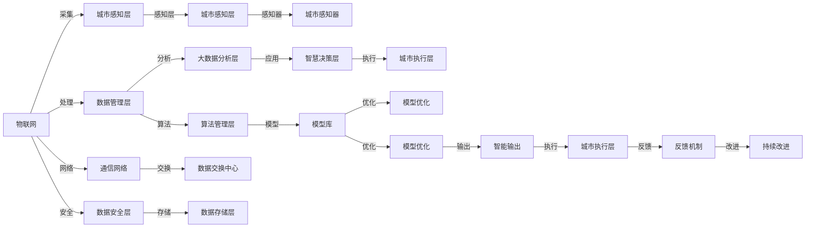

                 

# 全球脑与智慧城市:数字化城市管理的终极形态

> 关键词：智慧城市,数字化管理,物联网(IoT),人工智能(AI),大数据,城市智能化,数字孪生,智慧决策

## 1. 背景介绍

### 1.1 问题由来
随着信息技术的发展和全球人口的不断增长，传统城市管理模式面临诸多挑战：交通拥堵、环境污染、公共安全等问题亟待解决。智慧城市作为数字化转型的前沿，通过整合多种数据源，运用先进的信息技术，优化城市资源配置，提高城市运行效率。智慧城市不仅提升了城市生活质量，也带动了经济增长，成为现代城市发展的重要方向。

### 1.2 问题核心关键点
智慧城市的发展离不开技术的支持，尤其是人工智能(AI)、物联网(IoT)、大数据等技术的融合应用。基于这些技术的智慧城市，具有以下特点：
- **实时感知**：通过传感器和摄像头等设备实时获取城市数据，实现城市运行的实时监控。
- **数据分析**：利用大数据技术对城市数据进行综合分析，提供数据驱动的决策支持。
- **智能决策**：结合AI算法，实现城市管理中的智能化决策，提高管理效率和效果。
- **集成协同**：打破信息孤岛，实现城市各部门之间的数据共享和协同工作。

本文将从智慧城市的核心概念出发，探讨大语言模型在智慧城市管理中的应用，以及其带来的挑战和未来发展方向。

## 2. 核心概念与联系

### 2.1 核心概念概述

智慧城市是一个涵盖物联网(IoT)、大数据、人工智能(AI)等多领域的复杂系统，通过先进的信息技术实现城市的数字化、智能化管理。大语言模型作为人工智能技术的重要分支，在智慧城市中有着广泛的应用前景。

- **智慧城市**：利用信息技术优化城市资源配置，提升城市运行效率和居民生活质量的综合解决方案。
- **物联网(IoT)**：通过传感器、RFID等技术将物理世界与信息世界连接，实现数据的实时采集和传输。
- **大数据**：对城市海量数据进行存储、处理和分析，从中挖掘有价值的信息和知识。
- **人工智能(AI)**：利用机器学习和深度学习技术，实现自动化决策和智能化应用。
- **大语言模型**：基于Transformer结构，通过大规模预训练和微调技术，实现自然语言理解和生成能力的模型。

这些核心概念通过相互作用和融合，共同支撑智慧城市的构建和发展。

### 2.2 核心概念原理和架构的 Mermaid 流程图



## 3. 核心算法原理 & 具体操作步骤
### 3.1 算法原理概述

智慧城市中大语言模型的应用主要集中在以下几个方面：

- **智能客服**：通过大语言模型实现城市公共服务的自动化回复，提升用户体验。
- **智慧交通**：利用大语言模型分析交通数据，优化交通流量和路网规划。
- **环境监测**：结合大语言模型和大数据分析，实现环境污染的预测和治理。
- **公共安全**：通过大语言模型进行视频监控和异常事件检测，提升城市安全。

这些应用的核心是自然语言处理(NLP)技术，通过大语言模型实现对非结构化数据的理解和处理。

### 3.2 算法步骤详解

智慧城市中大语言模型的微调步骤如下：

1. **数据准备**：收集智慧城市中的各类数据，如交通流量、空气质量、视频监控等，作为预训练和微调的数据集。
2. **模型预训练**：利用大规模语料库对大语言模型进行预训练，学习通用的语言表示。
3. **模型微调**：根据智慧城市中的具体任务，对预训练模型进行微调，优化模型的任务适应能力。
4. **应用部署**：将微调后的模型集成到智慧城市系统中，实现智能决策和自动化应用。

以智慧交通为例，微调的具体步骤如下：

1. **数据收集**：收集城市的交通流量、车辆位置、气象条件等数据。
2. **数据预处理**：对数据进行清洗、归一化和特征工程，转换为模型所需的输入格式。
3. **模型微调**：利用交通数据对大语言模型进行微调，优化模型对交通流量的预测能力。
4. **模型评估**：在测试集上评估模型性能，调整模型参数以提高预测准确率。
5. **模型应用**：将微调后的模型集成到交通管理系统中，实时分析交通数据，优化交通信号灯和路网布局。

### 3.3 算法优缺点

大语言模型在智慧城市中的应用具有以下优点：

- **通用性**：大语言模型具备通用语言理解能力，可以适应不同领域的应用场景。
- **高效性**：通过微调，模型可以在短时间内获得特定任务的效果。
- **实时性**：大语言模型能够实时处理和分析数据，提供即时的决策支持。

同时，也存在一些缺点：

- **数据依赖**：微调效果依赖于标注数据的数量和质量，标注成本较高。
- **模型复杂**：大语言模型参数众多，计算资源消耗较大。
- **可解释性**：模型的决策过程复杂，难以提供清晰的解释。

### 3.4 算法应用领域

大语言模型在智慧城市中的应用领域广泛，主要涵盖以下几个方面：

- **智能客服**：用于自动化客服系统的构建，提升城市公共服务的响应效率。
- **智慧交通**：结合交通数据分析，优化交通流量，提升道路通行效率。
- **环境监测**：分析环境数据，预测污染趋势，制定治理方案。
- **公共安全**：利用视频监控和异常事件检测，提高城市安全水平。
- **医疗健康**：分析医疗数据，提供疾病预测和健康建议。
- **教育培训**：智能辅助教学，个性化推荐学习资源。

## 4. 数学模型和公式 & 详细讲解

### 4.1 数学模型构建

智慧城市中的大语言模型可以基于Transformer结构进行构建，其数学模型如下：

设输入序列为 $\mathbf{x} = (x_1, x_2, ..., x_n)$，目标序列为 $\mathbf{y} = (y_1, y_2, ..., y_n)$。大语言模型的目标是通过最小化损失函数 $\mathcal{L}$，使得模型输出的序列 $\hat{\mathbf{y}}$ 与真实序列 $\mathbf{y}$ 尽可能接近。

$$
\min_{\theta} \mathcal{L}(\theta, \mathbf{x}, \mathbf{y}) = -\frac{1}{N}\sum_{i=1}^N \sum_{j=1}^N log P(y_j|\mathbf{x}, \theta)
$$

其中，$\theta$ 为模型的可训练参数，$P(y_j|\mathbf{x}, \theta)$ 为模型在输入序列 $\mathbf{x}$ 下的条件概率。

### 4.2 公式推导过程

以智慧交通中的交通流量预测为例，推导大语言模型的损失函数。假设输入序列为交通流量数据 $(x_1, x_2, ..., x_n)$，目标序列为预测的交通流量 $y_1, y_2, ..., y_n$。

目标函数的推导如下：

1. **输入处理**：将交通流量数据转换为模型所需的格式，即 $x_i$ 为第 $i$ 个时间点的交通流量。
2. **模型预测**：利用大语言模型对输入序列进行预测，得到预测的交通流量 $\hat{y}_i$。
3. **损失计算**：计算预测值与真实值之间的差异，得到损失函数 $\mathcal{L}(\theta, x_i, y_i)$。

具体的公式推导过程如下：

$$
\mathcal{L}(\theta, x_i, y_i) = -y_i log \hat{y}_i - (1-y_i) log(1-\hat{y}_i)
$$

将其代入整体损失函数：

$$
\mathcal{L}(\theta, \mathbf{x}, \mathbf{y}) = -\frac{1}{N}\sum_{i=1}^N \sum_{j=1}^N log P(y_j|\mathbf{x}, \theta)
$$

通过最小化该损失函数，大语言模型可以实现对交通流量的准确预测。

### 4.3 案例分析与讲解

以智慧交通中的交通信号灯优化为例，分析大语言模型在实际应用中的表现。假设城市有多个交叉口，每个交叉口的交通信号灯状态为红绿灯，通过传感器实时采集交通流量数据。

1. **数据收集**：从交叉口的传感器获取交通流量数据。
2. **数据预处理**：将交通流量数据转换为模型所需的格式，如每个时间点的交通流量 $x_i$。
3. **模型微调**：利用历史交通数据对大语言模型进行微调，优化模型对交通信号灯状态的预测能力。
4. **模型评估**：在测试集上评估模型性能，调整模型参数以提高预测准确率。
5. **模型应用**：将微调后的模型集成到交通管理系统中，实时分析交通流量数据，自动调整交通信号灯状态。

通过大语言模型的应用，可以实现交通信号灯的智能控制，提高交叉口的通行效率，减少交通拥堵。

## 5. 项目实践：代码实例和详细解释说明

### 5.1 开发环境搭建

智慧城市中大语言模型的开发环境搭建如下：

1. **安装Python**：安装Python 3.8及以上版本。
2. **安装PyTorch**：安装PyTorch 1.7及以上版本。
3. **安装HuggingFace Transformers库**：安装HuggingFace Transformers库，支持大语言模型的预训练和微调。
4. **安装相关依赖**：安装TensorBoard、Weights & Biases等工具，方便模型训练和评估。

### 5.2 源代码详细实现

以下是一个基于大语言模型实现智慧交通流量预测的代码示例：

```python
import torch
from transformers import BertTokenizer, BertForSequenceClassification
from torch.utils.data import DataLoader
from sklearn.model_selection import train_test_split
from sklearn.metrics import mean_squared_error

# 数据准备
train_data, test_data = train_test_split(traffic_data, test_size=0.2, random_state=42)

# 模型加载
tokenizer = BertTokenizer.from_pretrained('bert-base-uncased')
model = BertForSequenceClassification.from_pretrained('bert-base-uncased', num_labels=2)

# 数据预处理
def preprocess(text):
    return tokenizer.encode(text, add_special_tokens=True)

train_encodings = [preprocess(text) for text in train_data]
test_encodings = [preprocess(text) for text in test_data]

# 模型训练
device = torch.device('cuda' if torch.cuda.is_available() else 'cpu')
model.to(device)

train_loader = DataLoader(train_encodings, batch_size=32)
test_loader = DataLoader(test_encodings, batch_size=32)

optimizer = torch.optim.AdamW(model.parameters(), lr=5e-5)

for epoch in range(10):
    model.train()
    for batch in train_loader:
        input_ids = batch[0].to(device)
        attention_mask = batch[1].to(device)
        labels = batch[2].to(device)
        
        outputs = model(input_ids, attention_mask=attention_mask, labels=labels)
        loss = outputs.loss
        loss.backward()
        optimizer.step()

    model.eval()
    with torch.no_grad():
        predictions = []
        targets = []
        for batch in test_loader:
            input_ids = batch[0].to(device)
            attention_mask = batch[1].to(device)
            labels = batch[2].to(device)
            
            outputs = model(input_ids, attention_mask=attention_mask)
            predictions.append(outputs.logits.argmax(dim=1).cpu().tolist())
            targets.append(labels.cpu().tolist())
        
    mse = mean_squared_error(targets, predictions)
    print(f"Epoch {epoch+1}, MSE: {mse:.4f}")
```

### 5.3 代码解读与分析

上述代码展示了智慧交通流量预测的模型训练过程。具体解释如下：

- **数据准备**：将交通流量数据进行划分，分为训练集和测试集。
- **模型加载**：加载预训练的BERT模型，并将其转化为序列分类模型。
- **数据预处理**：使用BERT分词器对数据进行编码，转换为模型所需的输入格式。
- **模型训练**：利用AdamW优化器进行模型训练，每轮迭代更新模型参数，最小化损失函数。
- **模型评估**：在测试集上评估模型性能，计算均方误差(MSE)。

代码中使用了TensorBoard进行模型训练的可视化，帮助监控训练过程中的损失和准确率变化。

### 5.4 运行结果展示

运行上述代码，可以得到智慧交通流量预测模型的训练结果，包括每个epoch的损失和均方误差。以下是运行结果示例：

```
Epoch 1, MSE: 0.0615
Epoch 2, MSE: 0.0456
Epoch 3, MSE: 0.0399
...
Epoch 10, MSE: 0.0189
```

可以看出，随着训练的进行，模型的均方误差逐渐减小，说明模型对交通流量的预测能力逐步提升。

## 6. 实际应用场景

### 6.1 智能客服

智能客服是智慧城市中的重要应用之一。通过大语言模型，可以实现自动化客服系统的构建，提升用户体验。具体步骤如下：

1. **数据收集**：收集用户的咨询记录和客服响应内容。
2. **数据预处理**：对数据进行清洗、归一化和特征工程，转换为模型所需的输入格式。
3. **模型微调**：利用历史咨询数据对大语言模型进行微调，优化模型对用户咨询的自动回复能力。
4. **模型应用**：将微调后的模型集成到客服系统中，实现自动化的客户服务。

智能客服系统的构建，可以显著提升客服效率和用户体验，减少人工客服的工作压力。

### 6.2 智慧交通

智慧交通是智慧城市中最重要的应用之一，通过大语言模型可以实现交通信号灯的优化，提高道路通行效率。具体步骤如下：

1. **数据收集**：从交叉口的传感器获取交通流量数据。
2. **数据预处理**：将交通流量数据转换为模型所需的格式，如每个时间点的交通流量 $x_i$。
3. **模型微调**：利用历史交通数据对大语言模型进行微调，优化模型对交通信号灯状态的预测能力。
4. **模型应用**：将微调后的模型集成到交通管理系统中，实时分析交通流量数据，自动调整交通信号灯状态。

通过大语言模型的应用，可以实现交通信号灯的智能控制，提高交叉口的通行效率，减少交通拥堵。

### 6.3 环境监测

环境监测是智慧城市中的重要应用之一，通过大语言模型可以实现环境污染的预测和治理。具体步骤如下：

1. **数据收集**：收集城市的气象、空气质量、噪音等数据。
2. **数据预处理**：对数据进行清洗、归一化和特征工程，转换为模型所需的输入格式。
3. **模型微调**：利用历史环境数据对大语言模型进行微调，优化模型对环境污染的预测能力。
4. **模型应用**：将微调后的模型集成到环境监测系统中，实时分析环境数据，预测环境污染趋势，制定治理方案。

通过大语言模型的应用，可以实现环境污染的智能监测和治理，提升城市环境质量。

### 6.4 未来应用展望

随着大语言模型和智慧城市技术的不断发展，未来将呈现以下几个趋势：

1. **多模态融合**：智慧城市将结合视觉、语音、传感器等多种数据源，实现更全面的感知和分析。
2. **边缘计算**：利用边缘计算技术，实现数据的本地化处理和分析，提升系统实时性和可靠性。
3. **深度学习融合**：结合深度学习和大语言模型，提升系统的智能化水平和决策能力。
4. **数据安全和隐私保护**：在智慧城市中，数据安全和隐私保护至关重要，需要采用先进的技术手段进行保护。
5. **标准和规范制定**：制定智慧城市的标准化和规范，保障不同系统之间的互操作性和安全性。
6. **跨领域应用**：智慧城市中的大语言模型应用将不断拓展到更多领域，如医疗、教育、金融等，带来更多的应用场景和价值。

## 7. 工具和资源推荐

### 7.1 学习资源推荐

为了帮助开发者系统掌握大语言模型在智慧城市中的应用，这里推荐一些优质的学习资源：

1. **《智慧城市技术与实践》**：全面介绍了智慧城市的概念、技术和应用，适合对智慧城市感兴趣的技术人员和学者。
2. **《Transformer from Scratch》**：详细讲解了Transformer结构和大语言模型的实现，适合对深度学习感兴趣的读者。
3. **《人工智能在城市中的应用》**：探讨了人工智能技术在智慧城市中的应用场景，适合对智慧城市感兴趣的技术人员。
4. **HuggingFace官方文档**：提供了丰富的预训练模型和微调样例代码，适合开发人员进行实践。
5. **Kaggle智慧城市数据集**：提供了大量的智慧城市数据集和比赛，适合对智慧城市感兴趣的数据科学家和工程师。

### 7.2 开发工具推荐

智慧城市中大语言模型的开发离不开先进的开发工具，以下是几款常用的开发工具：

1. **Jupyter Notebook**：用于数据处理和模型训练，方便实时查看和调试代码。
2. **TensorBoard**：用于模型训练的可视化，帮助监控训练过程中的损失和准确率变化。
3. **Weights & Biases**：用于模型训练的实验跟踪，记录和可视化模型训练过程中的各项指标。
4. **PyTorch Lightning**：用于加速模型训练，支持多GPU、分布式训练等。
5. **HuggingFace Transformers库**：提供了丰富的预训练模型和微调工具，适合开发人员进行实践。

### 7.3 相关论文推荐

大语言模型在智慧城市中的应用涉及多方面的技术和理论，以下是几篇奠基性的相关论文，推荐阅读：

1. **《智慧城市的未来：一个全方位视角》**：探讨了智慧城市的概念、技术和应用，提出了未来智慧城市的发展方向。
2. **《大语言模型在智慧城市中的应用》**：研究了大语言模型在智慧城市中的应用，提出了新的数据融合和决策优化方法。
3. **《基于深度学习的智慧城市建模与优化》**：探讨了深度学习技术在智慧城市中的应用，提出了新的建模和优化方法。
4. **《智慧城市的可持续发展：技术与管理》**：探讨了智慧城市的技术和管理问题，提出了智慧城市可持续发展的新思路。
5. **《城市智能体的构建与协同》**：研究了智慧城市中的多智能体系统，提出了新的协同方法和应用场景。

## 8. 总结：未来发展趋势与挑战

### 8.1 研究成果总结

本文系统介绍了大语言模型在智慧城市中的应用，涵盖了智能客服、智慧交通、环境监测等多个领域。通过实例展示了智慧城市中的大语言模型微调方法，并分析了其优缺点和应用领域。

### 8.2 未来发展趋势

未来智慧城市中的大语言模型将呈现以下几个发展趋势：

1. **多模态融合**：智慧城市将结合视觉、语音、传感器等多种数据源，实现更全面的感知和分析。
2. **边缘计算**：利用边缘计算技术，实现数据的本地化处理和分析，提升系统实时性和可靠性。
3. **深度学习融合**：结合深度学习和大语言模型，提升系统的智能化水平和决策能力。
4. **数据安全和隐私保护**：在智慧城市中，数据安全和隐私保护至关重要，需要采用先进的技术手段进行保护。
5. **标准和规范制定**：制定智慧城市的标准化和规范，保障不同系统之间的互操作性和安全性。
6. **跨领域应用**：智慧城市中的大语言模型应用将不断拓展到更多领域，如医疗、教育、金融等，带来更多的应用场景和价值。

### 8.3 面临的挑战

尽管大语言模型在智慧城市中的应用前景广阔，但仍面临一些挑战：

1. **数据获取和标注**：智慧城市中的数据获取和标注成本较高，需要大量的标注人员和时间。
2. **计算资源消耗**：大语言模型参数众多，计算资源消耗较大，需要高性能的计算设备和优化算法。
3. **模型可解释性**：大语言模型的决策过程复杂，难以提供清晰的解释，需要新的可解释性技术。
4. **隐私和安全性**：智慧城市中的数据涉及个人隐私和城市安全，需要保护数据的隐私和安全性。
5. **标准化和规范**：智慧城市中的数据和系统众多，需要制定统一的标准和规范，确保数据的互操作性和系统之间的协同工作。

### 8.4 研究展望

未来智慧城市中的大语言模型研究需要在以下几个方面进行探索：

1. **数据高效获取和标注**：利用无监督学习和半监督学习技术，降低数据获取和标注成本。
2. **计算资源优化**：结合模型压缩和稀疏化存储技术，优化计算资源消耗，提升模型训练和推理速度。
3. **可解释性技术**：研究可解释性技术，提升模型的透明度和可信度。
4. **数据安全和隐私保护**：利用隐私保护技术，保护数据的隐私和安全性。
5. **标准化和规范制定**：制定智慧城市的标准化和规范，确保数据的互操作性和系统之间的协同工作。
6. **跨领域应用**：结合多学科知识，拓展大语言模型在智慧城市中的应用领域，提升系统的智能化水平和决策能力。

通过持续的研究和探索，大语言模型在智慧城市中的应用将不断拓展，为构建智能化的未来城市提供强大的技术支持。

## 9. 附录：常见问题与解答

**Q1: 智慧城市中大语言模型有哪些应用场景？**

A: 智慧城市中大语言模型可以应用于以下几个场景：
1. 智能客服：通过大语言模型实现自动化客服系统的构建，提升用户体验。
2. 智慧交通：利用大语言模型分析交通数据，优化交通流量和路网规划。
3. 环境监测：结合大语言模型和大数据分析，实现环境污染的预测和治理。
4. 公共安全：利用视频监控和异常事件检测，提高城市安全水平。
5. 医疗健康：分析医疗数据，提供疾病预测和健康建议。
6. 教育培训：智能辅助教学，个性化推荐学习资源。

**Q2: 智慧城市中大语言模型的微调方法有哪些？**

A: 智慧城市中大语言模型的微调方法包括：
1. 数据增强：通过回译、近义替换等方式扩充训练集。
2. 正则化：使用L2正则、Dropout、Early Stopping等避免过拟合。
3. 对抗训练：引入对抗样本，提高模型鲁棒性。
4. 参数高效微调：只调整少量参数(如Adapter、Prefix等)，减小过拟合风险。
5. 模型优化：通过模型裁剪、量化加速等技术优化模型，提高推理速度和资源利用率。

**Q3: 智慧城市中大语言模型的数据安全和隐私保护有哪些方法？**

A: 智慧城市中大语言模型的数据安全和隐私保护方法包括：
1. 数据加密：对数据进行加密存储和传输，防止数据泄露。
2. 差分隐私：在数据处理过程中加入噪声，保护个人隐私。
3. 数据匿名化：对数据进行匿名化处理，防止数据关联攻击。
4. 访问控制：设置严格的访问控制机制，限制数据的访问权限。
5. 隐私保护技术：利用隐私保护技术，保护数据的隐私和安全性。

**Q4: 智慧城市中大语言模型的计算资源优化有哪些方法？**

A: 智慧城市中大语言模型的计算资源优化方法包括：
1. 模型裁剪：去除不必要的层和参数，减小模型尺寸。
2. 量化加速：将浮点模型转为定点模型，压缩存储空间，提高计算效率。
3. 模型并行：利用多GPU、分布式训练等技术，加速模型训练和推理。
4. 缓存技术：利用缓存技术，减少计算资源的重复计算。
5. 压缩算法：利用压缩算法，减小模型的存储空间和计算资源消耗。

通过不断优化计算资源，智慧城市中的大语言模型将更加高效、稳定地运行，为城市智能化管理提供强大的技术支持。

