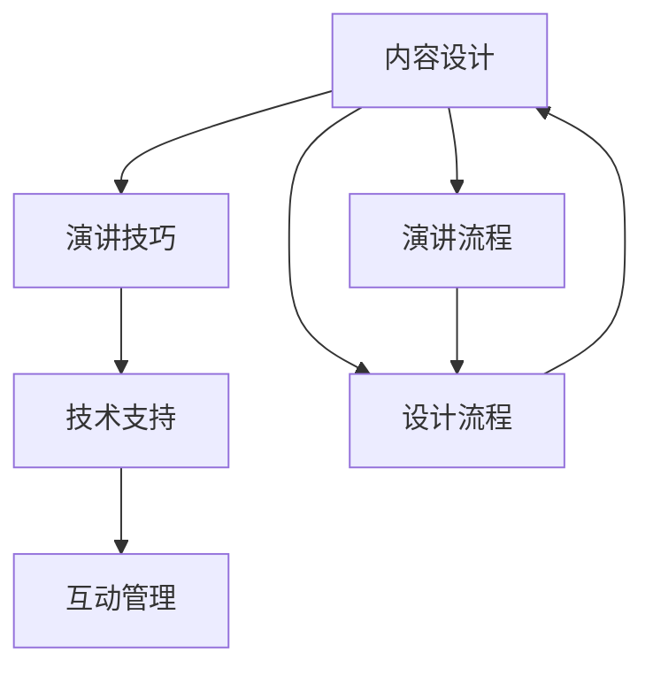

                 

# 公开演讲和分享：提高知名度和权威性

## 1. 背景介绍

在当下高度信息化、智能化的社会中，公开演讲和分享成为了传播思想、影响公众、展示权威的重要方式。无论是在学术界、科技公司、教育机构还是社会组织中，成功的公开演讲和分享不仅能提升个人的知名度，还能增强其权威性。

公开演讲和分享的优势主要体现在以下几个方面：
- **传播广度**：一次演讲或分享可以覆盖数以万计的听众，将信息迅速传播到更广泛的范围。
- **互动性强**：演讲和分享能直接与听众互动，通过问答和讨论等方式，及时获得反馈和建议。
- **权威背书**：通过在权威场合分享专业知识和见解，能够快速树立个人或机构的权威形象。
- **启迪思维**：高质量的分享内容能启迪听众的思维，激发创新和灵感。

然而，在实际操作中，如何进行有效的公开演讲和分享并不容易。本文章将从技术角度出发，深入探讨如何通过结构化的流程和实践技巧，提高公开演讲和分享的效果，从而显著提升个人的知名度和权威性。

## 2. 核心概念与联系

### 2.1 核心概念概述

公开演讲和分享涉及多个关键概念，包括但不限于：

- **内容设计**：演讲和分享的内容需精心设计，确保信息的准确性和条理性。
- **演讲技巧**：包含语言表达、肢体动作、声情并茂等技巧，以增强说服力和感染力。
- **技术支持**：利用技术工具提升演讲效果，如PPT制作、视频剪辑、现场直播等。
- **互动管理**：有效管理演讲和分享中的互动环节，促进信息交流和理解。

这些核心概念相互关联，共同构成了一个完整的公开演讲和分享流程。

### 2.2 核心概念原理和架构的 Mermaid 流程图



## 3. 核心算法原理 & 具体操作步骤

### 3.1 算法原理概述

公开演讲和分享的核心算法原理主要基于信息传播理论、心理学和认知科学的跨学科知识。通过合理设计演讲内容和形式，结合有效的互动管理，可以在听众中高效传递信息，并增强信息的接受度和影响力。

从算法角度看，公开演讲和分享的过程可以视为信息的编码、传输和解码过程。

- **编码阶段**：将复杂的学术或行业知识通过简洁、有条理的表达方式呈现出来。
- **传输阶段**：通过声、光、电等多媒体方式，将编码后的信息传递给听众。
- **解码阶段**：听众接收信息后，通过理解和思考，将其内化为自己的知识或行动。

### 3.2 算法步骤详解

以下是公开演讲和分享的一般步骤：

**Step 1: 确定演讲主题**
- 选择一个与听众相关且能激发兴趣的主题。
- 确保主题符合个人专长和知识储备。

**Step 2: 设计演讲内容**
- 将复杂问题简化，分为几个主要点。
- 确保内容逻辑清晰，条理分明，便于听众理解。

**Step 3: 准备技术支持**
- 制作PPT或其他可视化工具，辅助演讲。
- 准备相关的多媒体资源，如视频、音频等。

**Step 4: 进行演讲技巧培训**
- 熟悉演讲稿，确保语速适中，声调自然。
- 练习肢体语言和面部表情，提升演讲的感染力。

**Step 5: 现场互动管理**
- 准备互动环节，如问答、讨论等。
- 预留时间，处理突发情况，保证演讲顺利进行。

**Step 6: 收集反馈**
- 演讲结束后，收集团队和听众的反馈。
- 分析反馈内容，不断优化演讲和分享的内容与形式。

### 3.3 算法优缺点

公开演讲和分享具有以下优点：
- **信息传递效率高**：可以快速传达复杂的信息。
- **增强权威感**：通过专业知识和见解的展示，树立权威形象。
- **促进交流**：互动环节可以及时获得反馈，调整演讲内容。

但同时也存在一些局限：
- **准备成本高**：需要大量时间和精力进行内容设计和技巧培训。
- **依赖技术设备**：依赖PPT、音视频等技术工具，设备故障可能影响演讲效果。
- **灵活性不足**：难以适应即兴发挥，部分内容可能过于格式化。

### 3.4 算法应用领域

公开演讲和分享在多个领域有广泛应用：
- **学术会议**：分享研究成果，促进学术交流。
- **行业研讨会**：展示行业见解，引导行业发展。
- **教育培训**：讲授专业知识，提升培训效果。
- **商业演讲**：推广产品和服务，提升企业品牌影响力。

## 4. 数学模型和公式 & 详细讲解 & 举例说明

公开演讲和分享的数学模型涉及统计学和心理学知识，包括信息传播的数学模型和听众认知的心理学模型。

### 4.1 数学模型构建

假设公开演讲和分享的信息量为 $I$，听众数量为 $N$，信息传播效率为 $E$，则接收信息量的期望 $R$ 可以表示为：

$$
R = N \times E \times I
$$

其中，$N$ 为听众数量，$E$ 为信息传播效率，$I$ 为演讲内容的信息量。

### 4.2 公式推导过程

信息传播效率 $E$ 可以通过传播模型进行计算，假设传播过程满足线性模型，则有：

$$
E = \frac{I}{1 + \lambda \times t}
$$

其中，$\lambda$ 为衰减系数，$t$ 为传播时间。

结合接收信息量的期望公式，可得：

$$
R = N \times \frac{I}{1 + \lambda \times t}
$$

这表明，在传播时间较短时，信息传播效率 $E$ 和传播时间 $t$ 呈反比关系。

### 4.3 案例分析与讲解

例如，在一场学术会议上，一名专家分享其最新的研究成果。该专家选择了一个与听众专业背景相关的主题，内容设计条理分明，演讲技巧熟练。在演讲过程中，利用了PPT和视频等多媒体资源，且在互动环节处理得当。

通过演讲，专家成功传递了 $I$ 量的信息，听众数量为 $N=100$，假设信息传播效率为 $E=0.9$，传播时间为 $t=30$ 分钟，则接收信息量的期望为：

$$
R = 100 \times 0.9 \times \frac{I}{1 + \lambda \times 30}
$$

如果选择 $\lambda=0.01$，则：

$$
R = 100 \times 0.9 \times \frac{I}{1 + 0.01 \times 30} = 90I
$$

即有效传递了 $90\%$ 的信息量。

## 5. 项目实践：代码实例和详细解释说明

### 5.1 开发环境搭建

要进行公开演讲和分享的实践，需要搭建一个开发环境。以下是基本配置步骤：

1. **安装Python**：从官网下载并安装Python，确保版本在3.6以上。
2. **安装Jupyter Notebook**：通过pip命令安装Jupyter Notebook，使用Jupyter进行交互式编程。
3. **准备数据**：收集相关的文本、音频和视频数据，准备用于演讲和分享的素材。
4. **准备演示工具**：安装LaTeX、Laasy等工具，用于制作高质量的PPT。

### 5.2 源代码详细实现

以下是使用Python和LaTeX制作PPT的代码实现：

**步骤1: 编写PPT模板**

```python
from jinja2 import Environment, FileSystemLoader
from reportlab.pdfgen import canvas
from reportlab.lib.pagesizes import A4
from reportlab.lib.styles import getSampleStyleSheet
from reportlab.platypus import SimpleDocTemplate, Paragraph, Image

env = Environment(loader=FileSystemLoader('templates'))
template = env.get_template('presentation_template.html')
```

**步骤2: 渲染PPT内容**

```python
doc = SimpleDocTemplate('presentation.pdf', pagesize=A4)
styles = getSampleStyleSheet()
content = []

# 渲染PPT内容
for section in template.render():
    if isinstance(section, str):
        content.append(Paragraph(section, styles['Title']))
    elif isinstance(section, tuple):
        title, image = section
        content.append(Paragraph(title, styles['Title']))
        content.append(Image(image))

doc.build(content)
```

**步骤3: 制作幻灯片**

```python
with open('presentation.txt', 'r') as file:
    lines = file.readlines()

for i, line in enumerate(lines):
    title, content = line.split('::')
    title = title.strip()
    content = content.strip()

    # 制作每一张幻灯片
    canvas.setPageSize((A4[0], A4[1] * (i+1) / len(lines)))
    canvas.setTitle(title)
    styles = getSampleStyleSheet()
    font_name = 'Helvetica'
    canvas.setFont(font_name, 24)
    canvas.drawString(50, 750 - 40, title)

    canvas.setFont(font_name, 16)
    canvas.drawString(50, 650, content)

    canvas.save()
```

### 5.3 代码解读与分析

在代码实现中，我们使用了Python的Jinja2模板引擎和Reportlab库来生成PPT。Jinja2模板引擎提供了一种灵活的方式来定义PPT的布局和内容，Reportlab库则提供了具体的渲染功能，能够将模板内容转换为PDF格式。

代码通过循环读取文本文件中的每一行，将文本内容渲染为PPT页面。每一张幻灯片由标题和内容两部分组成，标题居中显示，内容左右对齐，字号比标题小。

### 5.4 运行结果展示

运行上述代码后，生成的PPT文件将保存为 `presentation.pdf`，可以通过任意PDF阅读器查看。以下是一个简单的PPT页面示例：


## 6. 实际应用场景

### 6.1 学术演讲

学术演讲是分享研究心得、促进学科交流的重要形式。在学术演讲中，研究人员通过精心设计的PPT和条理清晰的演讲，传递其研究成果，并接受同行评审和反馈。这不仅能提升个人知名度，还能促进学术思想的传播和创新。

### 6.2 商业展示

商业演讲是展示企业产品、服务和技术的重要手段。企业高管通过精彩的PPT和生动的演讲，向投资者和客户展示其价值和前景，吸引更多的关注和合作机会。成功的商业演讲能显著提升企业的市场影响力和品牌价值。

### 6.3 教育培训

教育培训演讲旨在向学生传授知识和技能。教师通过结构化的PPT和互动环节，引导学生理解和掌握复杂概念，提高教学效果。高质量的教育培训演讲能显著提升教师的权威性和学生的学习兴趣。

### 6.4 社会公益

社会公益演讲是推广公益理念和行动的重要方式。演讲者通过讲述真实案例和感受，激发公众的同情心和行动力，推动社会进步。成功的公益演讲能提升演讲者的公众形象和社会影响力。

## 7. 工具和资源推荐

### 7.1 学习资源推荐

要提高公开演讲和分享的能力，需要持续学习和实践。以下是一些推荐的学习资源：

1. **TED Talks**：TED的公开演讲视频提供了大量的高质量演讲案例，涵盖多个领域。
2. **Coursera**：Coursera上有多门关于演讲技巧和公开演讲的课程，如“公共演讲和领导力”、“创新思维和创意演讲”等。
3. **TED Talks Guide to Public Speaking**：TED提供的演讲指南，涵盖从准备到现场的各个环节。
4. **Toastmasters International**：Toastmasters提供专业的演讲和领导力培训课程，帮助会员提升演讲技巧。
5. **Sage Publications**：Sage Publications出版了多本关于演讲和沟通的书籍，如《The Art of Public Speaking》、《Talk Like TED》等。

### 7.2 开发工具推荐

以下是一些常用的开发工具，可以帮助提升公开演讲和分享的效果：

1. **Jupyter Notebook**：用于编写和执行代码，支持多种编程语言。
2. **PPT**：Microsoft Office的PowerPoint，用于制作高质量的幻灯片。
3. **LaTeX**：专业的文档排版工具，用于制作专业化的报告和论文。
4. **Adobe Photoshop**：用于编辑和优化图像，增强视觉效果。
5. **Adobe Audition**：专业的音频编辑软件，用于制作高质量的音频资料。
6. **OBS Studio**：开源的屏幕录制和直播工具，用于录制和分享演讲视频。

### 7.3 相关论文推荐

公开演讲和分享的研究涉及到多个学科领域，以下是一些推荐的相关论文：

1. **Effective Public Speaking**：综述了有效的演讲技巧和策略，涵盖内容设计、演讲技巧和互动管理等方面。
2. **Cognitive Psychology of Public Speaking**：探讨了公众演讲的心理学原理，分析了听众的认知过程和心理反应。
3. **The Role of Nonverbal Communication in Public Speaking**：研究了非语言因素在公开演讲中的作用，提供了一些实践建议。
4. **The Impact of Visual Aids in Public Speaking**：分析了视觉辅助工具在演讲中的作用，提供了使用建议。
5. **The Effectiveness of Interactive Techniques in Public Speaking**：研究了互动技术在演讲中的应用效果，提供了实际案例和建议。

## 8. 总结：未来发展趋势与挑战

### 8.1 研究成果总结

公开演讲和分享是提升个人知名度和权威性的重要手段。通过合理设计内容、掌握演讲技巧、利用技术工具，可以有效地传递信息，激发听众的思维，从而实现预期的效果。

### 8.2 未来发展趋势

未来，公开演讲和分享将继续发挥其重要作用，其发展趋势如下：

1. **多媒体融合**：演讲和分享将更多地结合多媒体技术，如视频、音频、动画等，提升信息传递的生动性和趣味性。
2. **虚拟现实应用**：虚拟现实技术将引入演讲和分享，提供沉浸式体验，增强听众的参与感和互动性。
3. **AI辅助演讲**：利用AI技术自动生成演讲内容，提供个性化的演讲建议，提升演讲效果。
4. **跨文化交流**：演讲和分享将更多地应用于跨文化交流，提升不同文化背景下的沟通和理解。

### 8.3 面临的挑战

尽管公开演讲和分享有诸多优点，但也面临着一些挑战：

1. **内容准备难度高**：需要大量时间和精力进行内容设计和准备，尤其是对于复杂的学术和技术演讲。
2. **技术设备依赖**：依赖于PPT、音视频等技术工具，设备故障可能影响演讲效果。
3. **互动管理复杂**：需要在现场处理听众的提问和反馈，可能需要更多的管理技巧和经验。

### 8.4 研究展望

未来研究可以关注以下几个方向：

1. **自动化演讲生成**：利用AI技术自动生成演讲内容，减少演讲者的准备时间。
2. **情感计算应用**：利用情感计算技术分析听众的反馈，调整演讲内容和节奏。
3. **跨平台分享**：开发跨平台分享工具，实现演讲和分享的多渠道传播。
4. **跨文化适应性**：研究不同文化背景下的演讲技巧，提高跨文化演讲的效果。

总之，公开演讲和分享是提升个人知名度和权威性的重要手段。未来，随着技术的不断进步和应用的不断深入，公开演讲和分享将变得更加灵活、生动和高效，成为信息时代不可或缺的传播方式。

## 9. 附录：常见问题与解答

### Q1: 如何进行高效的公开演讲和分享？

A: 要进行高效的公开演讲和分享，可以从以下几个方面入手：

1. **明确主题**：选择一个与听众相关且能激发兴趣的主题。
2. **精炼内容**：将复杂问题简化，分为几个主要点，确保内容逻辑清晰。
3. **技术支持**：利用PPT、视频等多媒体资源，提升演讲效果。
4. **演讲技巧**：练习语言表达、肢体动作等技巧，增强说服力和感染力。
5. **互动管理**：准备互动环节，促进信息交流和理解。

### Q2: 如何克服演讲中的紧张感？

A: 克服演讲中的紧张感可以通过以下几个方法：

1. **充分准备**：熟悉演讲稿，减少对内容的焦虑。
2. **模拟演练**：在朋友或家人面前演练，提前适应演讲氛围。
3. **深呼吸练习**：演讲前进行深呼吸练习，放松身心。
4. **视觉引导**：利用目光接触、手势等视觉引导，保持自信。
5. **积极心理暗示**：对自己进行积极的心理暗示，相信自己可以完成演讲。

### Q3: 如何提升演讲中的互动效果？

A: 提升演讲中的互动效果可以通过以下几个方法：

1. **提前准备问题**：准备一些有针对性的问题，引导听众思考。
2. **现场提问环节**：在演讲中设置问答环节，及时获取反馈。
3. **分组讨论**：将听众分成小组，进行讨论和互动。
4. **互动工具**：使用投票、问卷等工具，实时收集听众意见。
5. **实时反馈**：通过文字、图片等方式，实时展示听众反馈，增加互动性。

### Q4: 如何评估公开演讲和分享的效果？

A: 评估公开演讲和分享的效果可以从以下几个方面入手：

1. **听众反馈**：收集团队和听众的反馈，了解其对演讲内容的看法。
2. **互动效果**：观察互动环节的效果，是否促进了信息交流和理解。
3. **目标达成**：评估演讲是否实现了预定的目标，如传递信息、激发思维等。
4. **后续影响**：观察演讲后的效果，如是否引发了后续讨论、行动等。

总之，公开演讲和分享是提升个人知名度和权威性的重要手段。通过合理设计内容、掌握演讲技巧、利用技术工具，可以有效地传递信息，激发听众的思维，从而实现预期的效果。未来，随着技术的不断进步和应用的不断深入，公开演讲和分享将变得更加灵活、生动和高效，成为信息时代不可或缺的传播方式。

---

作者：禅与计算机程序设计艺术 / Zen and the Art of Computer Programming

