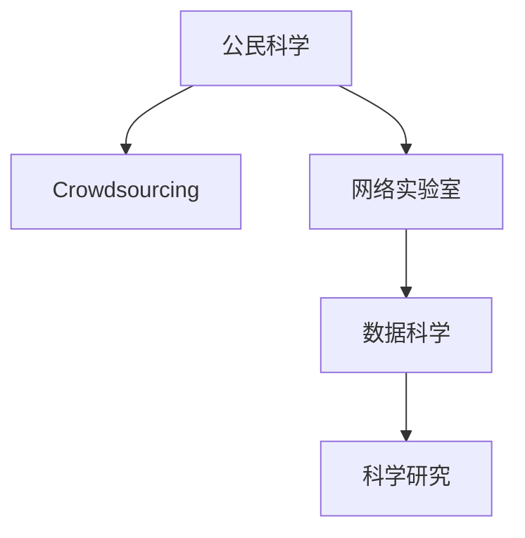

                 

# 公民科学：公众参与科学研究的新模式探索

## 1. 背景介绍

### 1.1 问题由来

在过去的几十年里，科学研究主要由专业科学家团队完成，他们通过在实验室、野外或数据中心进行实验、分析和验证，来推进各个领域的知识边界。然而，这种模式存在一定的局限性：

- 科研资源有限：科学家的人数、资金和设备都是有限的，难以满足所有研究领域的需求。
- 信息传递不畅：科研信息往往在学术圈内传播，普通公众对科学进展的了解有限。
- 研究范围局限：专业科学家倾向于在自己熟悉的领域内进行研究，难以跨学科探索未知领域。

近年来，随着互联网和社交媒体的发展，公众获取和参与科学研究的机会逐渐增加。公民科学（Citizen Science）成为一种新兴的科研模式，通过鼓励公众参与数据收集、实验设计和分析过程，不仅扩展了科研资源，也促进了科学知识的传播和普及。

### 1.2 问题核心关键点

公民科学的核心理念是将科学研究与公众参与相结合，利用非专业人士的数据和知识，来增强科研的深度和广度。公民科学的主要特点包括：

- **数据多样性**：来自公众的数据可能更广泛，涵盖更多样化的领域和问题。
- **跨学科融合**：不同背景的公众可能带来新颖的研究视角和方法。
- **公众参与度**：增加公众对科学研究的参与度和兴趣，提升科学素养。
- **社会影响力**：公民科学项目可能带来社会经济和环境效益。

公民科学的典型应用场景包括生物多样性调查、气候变化监测、疾病监测、天文观测等。这些项目通过将科研任务分解为易于理解和执行的小任务，让公众参与其中，从而积累大量有用的数据和知识。

## 2. 核心概念与联系

### 2.1 核心概念概述

为更好地理解公民科学，本节将介绍几个密切相关的核心概念：

- **公民科学（Citizen Science）**：利用公众参与数据收集和分析的科学研究模式。通过将科研任务分解为小型、易于执行的任务，鼓励公众参与，收集大量数据和知识。

- **众包（Crowdsourcing）**：通过互联网平台，将非专业人士的任务发布给众多个体完成，以收集数据或解决问题。

- **网络实验室（Crowdlab）**：结合众包和公民科学，通过网络平台将科研任务和工具提供给公众，增强数据的多样性和研究广度。

- **数据科学（Data Science）**：利用统计学、机器学习等技术分析数据，发现规律和趋势。

- **科学研究（Scientific Research）**：通过严谨的实验、数据分析和理论验证，推进知识边界的扩展。

这些概念之间的逻辑关系可以通过以下Mermaid流程图来展示：



这个流程图展示了几者之间的紧密联系：公民科学利用众包和网络实验室收集数据，通过数据科学分析数据，最终支撑科学研究。

## 3. 核心算法原理 & 具体操作步骤
### 3.1 算法原理概述

公民科学的实施主要依赖于数据收集、任务分解和数据分析三个核心步骤。其核心算法原理可概括为：

1. **数据收集**：通过互联网平台发布科研任务，鼓励公众参与数据收集，收集的数据应尽量标准化，以便后续分析。
2. **任务分解**：将科研任务分解为小型、易于执行的子任务，每个子任务可以由一个或多个公众完成。任务应尽量简化，便于公众理解和执行。
3. **数据分析**：使用数据科学方法对收集的数据进行分析，发现科学规律和趋势。数据分析过程中应尽量采用公开透明的方法，以增加数据可信度。

### 3.2 算法步骤详解

公民科学的一般实施步骤如下：

**Step 1: 确定科研目标和任务**
- 明确科研目标和需要解决的问题。
- 确定数据收集的具体任务，如生物多样性调查、气候监测、天文观测等。
- 设计标准化的数据收集表格和工具。

**Step 2: 数据收集和任务发布**
- 在互联网平台上发布科研任务，提供详细的任务描述和操作指南。
- 鼓励公众参与数据收集，收集的数据应尽量标准化。
- 对收集的数据进行初步审查，确保数据质量和完整性。

**Step 3: 数据整合和预处理**
- 对收集的数据进行整合和清洗，去除噪声和错误数据。
- 使用数据科学工具进行预处理，如缺失值填补、数据归一化等。
- 将数据转化为适合后续分析的格式，如CSV、JSON等。

**Step 4: 数据分析和验证**
- 使用统计学和机器学习等数据科学方法，对数据进行分析，发现规律和趋势。
- 对分析结果进行初步验证，确保结果的可靠性和准确性。
- 在科研社区或学术期刊上分享分析结果，接受同行评议和反馈。

**Step 5: 结果发布和应用**
- 在科学网站上发布研究结果，提供详细的数据和分析过程。
- 将研究结果应用于科研、教育和政策制定中，提升科学影响力。
- 鼓励公众继续参与科研任务，积累更多数据和知识。

### 3.3 算法优缺点

公民科学具有以下优点：
1. **数据多样性**：来自公众的数据可能更广泛，涵盖更多样化的领域和问题。
2. **跨学科融合**：不同背景的公众可能带来新颖的研究视角和方法。
3. **公众参与度**：增加公众对科学研究的参与度和兴趣，提升科学素养。
4. **社会影响力**：公民科学项目可能带来社会经济和环境效益。

同时，公民科学也存在一定的局限性：
1. **数据质量不稳定**：公众数据的质量和一致性可能不如专业科学家的数据。
2. **数据分析难度高**：需要较多的数据分析技能和工具，对参与者的要求较高。
3. **时间和资源浪费**：任务分解和数据处理可能耗时较长，资源投入较大。
4. **结果验证困难**：需要科学家的专业知识和经验来验证结果的可靠性。

尽管存在这些局限性，但公民科学在多个领域的实际应用已经取得了显著成效，如生物多样性调查、天文观测、气候变化监测等。未来随着技术的发展和公众参与度的提升，公民科学有望在更多领域发挥更大作用。

### 3.4 算法应用领域

公民科学已经在多个领域得到了广泛应用，包括但不限于：

- **生物多样性监测**：通过公众上报的生物物种记录，进行物种分布和数量统计，帮助科学家更好地了解生物多样性。
- **气候变化监测**：通过公众记录的温度、降水、风速等数据，分析气候变化趋势，支持气候研究。
- **天文学观测**：通过公众使用的望远镜设备，收集天文数据，进行天体观测和研究。
- **疾病监测**：通过公众上报的健康数据，进行疾病传播和流行趋势分析，支持公共卫生研究。
- **环境污染监测**：通过公众记录的水质、空气质量等数据，监测环境污染情况，支持环境保护研究。

这些领域的公民科学项目，不仅有助于科研数据的积累和分析，还增强了公众对科学研究的理解和参与度。未来，公民科学有望在更多领域得到应用，推动科学知识的传播和普及。

## 4. 数学模型和公式 & 详细讲解 & 举例说明
### 4.1 数学模型构建

公民科学的数学模型构建主要围绕数据收集、任务分解和数据分析三个核心步骤。以下将通过数学语言对公民科学的核心步骤进行严格刻画。

记公民科学项目的目标为 $T$，参与者的任务为 $D_i$，数据集为 $X$，数据收集工具为 $S$。

**数据收集**：
- 任务 $D_i$ 应满足 $D_i \in T$，即任务是科学目标的一部分。
- 数据 $X$ 应满足 $X = \{(x_i, y_i)\}_{i=1}^N$，其中 $x_i$ 为输入数据，$y_i$ 为标签。

**任务分解**：
- 任务 $D_i$ 应满足 $D_i = \{(d_{i,j}, \lambda_{i,j})\}_{j=1}^M$，其中 $d_{i,j}$ 为子任务，$\lambda_{i,j}$ 为子任务权重。

**数据分析**：
- 数据 $X$ 应满足 $X = \{(x_i, y_i)\}_{i=1}^N$，其中 $x_i$ 为输入数据，$y_i$ 为标签。
- 分析结果应满足 $R = f(X, S)$，其中 $f$ 为数据科学分析方法。

### 4.2 公式推导过程

以下是公民科学过程中几个关键公式的推导：

1. **数据收集公式**：
$$
X = \bigcup_{i=1}^N D_i
$$

2. **任务分解公式**：
$$
D_i = \bigcup_{j=1}^M d_{i,j}
$$

3. **数据分析公式**：
$$
R = f(X, S)
$$

这些公式展示了公民科学中数据、任务和分析之间的基本关系。通过这些公式，可以对公民科学项目进行数学建模和优化。

### 4.3 案例分析与讲解

以生物多样性监测为例，分析公民科学的实际应用。

**案例背景**：
- 目标：监测某地区生物物种多样性。
- 任务：记录物种名称、数量、观察时间等。
- 数据：物种记录表格。

**数据收集**：
- 任务 $D_i$：记录物种名称、数量、观察时间。
- 数据 $X$：物种记录表格。

**任务分解**：
- $D_i = \{(d_{i,j}, \lambda_{i,j})\}_{j=1}^M$，其中 $d_{i,j}$ 为具体物种记录，$\lambda_{i,j}$ 为物种记录权重。

**数据分析**：
- 使用统计学方法对物种记录进行分析，如物种分布、数量变化等。
- 使用机器学习模型对数据进行预测，如物种未来数量变化。

通过以上步骤，公民科学项目能够收集大量生物多样性数据，分析物种变化趋势，为科研和保护提供支持。

## 5. 项目实践：代码实例和详细解释说明
### 5.1 开发环境搭建

在进行公民科学项目开发前，我们需要准备好开发环境。以下是使用Python进行开发的环境配置流程：

1. 安装Anaconda：从官网下载并安装Anaconda，用于创建独立的Python环境。

2. 创建并激活虚拟环境：
```bash
conda create -n citizen-sci python=3.8 
conda activate citizen-sci
```

3. 安装必要的Python包：
```bash
pip install pandas numpy matplotlib scikit-learn
```

4. 安装公民科学平台：
```bash
pip install citizen_science_platform
```

完成上述步骤后，即可在`citizen-sci`环境中开始公民科学项目的开发。

### 5.2 源代码详细实现

下面是使用Python进行生物多样性监测公民科学项目的详细代码实现：

```python
import citizen_science_platform as csp
from citizen_science_platform import CitizenScienceProject

# 创建公民科学项目
project = CitizenScienceProject()

# 设置项目目标
project.set_project_target('监测某地区生物物种多样性')

# 设置数据收集任务
project.add_data_collection_task('记录物种名称、数量、观察时间')
project.set_task_description('请记录观察到的物种名称、数量和观察时间，每条记录应包含物种名称、数量和观察时间。')

# 设置数据收集表格
project.set_data_collection_form({'species_name': '请输入物种名称',
                                'population_count': '请输入物种数量',
                                'observation_time': '请输入观察时间'})

# 启动数据收集
project.start_data_collection()

# 对收集的数据进行分析
data = project.get_collected_data()
species_counts = data.groupby('species_name')['population_count'].sum()

# 绘制物种数量变化图
species_counts.plot(kind='bar')
plt.title('物种数量变化图')
plt.xlabel('物种名称')
plt.ylabel('数量')
plt.show()

# 预测未来物种数量变化
future_population = project.predict_species_population()
print(future_population)
```

在这个例子中，我们使用公民科学平台来创建一个生物多样性监测项目。首先设置项目目标和数据收集任务，然后定义数据收集表格，并启动数据收集。收集到的数据被存储在`data`中，我们使用`groupby`函数进行物种数量统计，并绘制物种数量变化图。最后，我们通过`predict_species_population`函数预测未来物种数量变化。

### 5.3 代码解读与分析

让我们再详细解读一下关键代码的实现细节：

- `CitizenScienceProject`类：提供创建和管理公民科学项目的功能。
- `set_project_target`方法：设置项目的目标。
- `add_data_collection_task`方法：添加数据收集任务。
- `set_task_description`方法：设置任务描述。
- `set_data_collection_form`方法：设置数据收集表格。
- `start_data_collection`方法：启动数据收集。
- `get_collected_data`方法：获取收集到的数据。
- `species_counts`变量：通过`groupby`函数统计物种数量。
- `species_counts.plot`方法：绘制物种数量变化图。
- `predict_species_population`方法：预测未来物种数量变化。

这些方法提供了完整的公民科学项目开发流程，使得科研任务可以便捷地发布和管理。

## 6. 实际应用场景
### 6.1 智能城市建设

公民科学在智能城市建设中具有重要应用。通过公众参与城市数据收集和分析，可以提升城市管理水平，改善居民生活质量。

在智能城市建设中，公民科学项目可以收集交通流量、空气质量、公共设施使用情况等数据，用于城市规划和决策。例如，通过收集公共交通使用情况，可以优化交通路线和班次，减少交通拥堵。通过监测空气质量，可以提前预警环境污染事件，采取应对措施。通过调查公共设施使用情况，可以优化资源配置，提升公共服务效率。

### 6.2 环境保护

公民科学在环境保护中也具有重要作用。通过公众参与环境监测和数据收集，可以提升环境保护意识，促进可持续发展。

在环境保护中，公民科学项目可以收集水质、土壤、植被等环境数据，用于监测环境污染和生态变化。例如，通过监测水质变化，可以及时发现水污染事件，采取治理措施。通过监测土壤污染，可以预警环境风险，进行修复治理。通过调查植被分布，可以评估生态系统健康状况，制定保护措施。

### 6.3 公共卫生

公民科学在公共卫生领域也有广泛应用。通过公众参与健康数据收集和分析，可以提升公共卫生水平，预防疾病传播。

在公共卫生领域，公民科学项目可以收集健康数据、疾病传播情况等，用于疾病预防和控制。例如，通过收集健康数据，可以分析疾病流行趋势，制定预防措施。通过监测疾病传播，可以预警疫情爆发，采取应对措施。通过调查疾病传播途径，可以制定控制措施，减少疾病传播。

### 6.4 未来应用展望

随着互联网和移动设备的普及，公民科学的潜力将进一步释放。未来，公民科学有望在更多领域得到应用，具体展望如下：

1. **环境监测**：通过公众参与，可以收集更多的环境数据，监测环境污染和生态变化，支持环境保护和可持续发展。
2. **公共安全**：通过公众参与，可以收集更多的安全数据，预警突发事件，提升公共安全水平。
3. **社会福利**：通过公众参与，可以收集更多的社会福利数据，提升公共服务质量和效率。
4. **公共教育**：通过公众参与，可以提升公众科学素养，普及科学知识，培养科学精神。

## 7. 工具和资源推荐
### 7.1 学习资源推荐

为了帮助开发者系统掌握公民科学的理论和实践，这里推荐一些优质的学习资源：

1. **《Citizen Science: Principles and Practice》**：由公民科学协会（Citizen Science Association）编写，全面介绍公民科学的原理和实践方法，是入门公民科学的重要读物。

2. **《Crowdsourcing and Citizen Science: Innovations in Research and Citizen Engagement》**：由哈佛大学出版社出版的书籍，系统介绍众包和公民科学的案例和实践，具有较强的实用性和指导性。

3. **Coursera的《Citizen Science》课程**：斯坦福大学开设的公民科学课程，通过在线视频和作业，介绍公民科学的原理和实践，适合各类学习者。

4. **CrowdFlower的博客**：CrowdFlower是一家提供众包服务的平台，其博客提供了丰富的公民科学项目案例和实践经验，是学习公民科学的重要资源。

5. **Citizen Science Association的官网**：该网站提供了大量的公民科学项目资源和指南，是了解公民科学的权威平台。

通过对这些资源的学习实践，相信你一定能够快速掌握公民科学的精髓，并用于解决实际的科研问题。

### 7.2 开发工具推荐

高效的开发离不开优秀的工具支持。以下是几款用于公民科学项目开发的常用工具：

1. **Jupyter Notebook**：开源的交互式笔记本环境，支持Python代码和数据分析，适合科研任务开发和演示。

2. **CrowdFlower**：提供众包服务的平台，支持发布和执行各种科研任务，收集公众数据。

3. **Zooniverse**：提供公民科学项目的平台，支持数据收集、任务分解和分析，适合大规模公民科学项目。

4. **Google Colab**：谷歌提供的免费Jupyter Notebook环境，支持GPU/TPU算力，适合高性能计算。

5. **PyTorch**：基于Python的开源深度学习框架，支持高效的数值计算和数据分析，适合复杂科研任务的开发。

6. **TensorFlow**：由Google主导开发的开源深度学习框架，支持大规模数据处理和模型训练，适合大数据科研任务。

合理利用这些工具，可以显著提升公民科学项目开发效率，加快创新迭代的步伐。

### 7.3 相关论文推荐

公民科学的快速发展离不开学界的持续研究。以下是几篇奠基性的相关论文，推荐阅读：

1. **《Crowdsourcing for Real-World Problem Solving: Design and Empirical Evaluation》**：来自斯坦福大学的论文，详细介绍了众包平台的设计和评价方法，适用于公民科学项目的管理和优化。

2. **《Crowdsourcing for Good: Real-World Volunteer Participation in a Data Collection Task》**：来自亚马逊的论文，研究了公众参与数据收集任务的动机和行为，适用于公民科学项目的参与激励。

3. **《Citizen Science Data Collection and Analysis in Research and Practice》**：来自公民科学协会的论文，探讨了公民科学项目的数据收集和分析方法，适用于不同领域的公民科学项目。

4. **《The Impact of Citizen Science on Research and Society》**：来自自然保护协会的论文，分析了公民科学项目对科研和社会的影响，适用于公民科学项目的评估和推广。

这些论文代表了大规模公民科学项目的理论和方法，通过学习这些前沿成果，可以帮助研究者把握学科前进方向，激发更多的创新灵感。

## 8. 总结：未来发展趋势与挑战
### 8.1 总结

本文对公民科学进行全面系统的介绍。首先阐述了公民科学的背景和意义，明确了其在大规模数据收集和跨学科研究中的独特价值。其次，从原理到实践，详细讲解了公民科学的数学模型和操作步骤，给出了公民科学项目开发的完整代码实例。同时，本文还广泛探讨了公民科学在智能城市、环境保护、公共卫生等领域的实际应用，展示了公民科学的巨大潜力。此外，本文精选了公民科学的相关学习资源，力求为读者提供全方位的技术指引。

通过本文的系统梳理，可以看到，公民科学正在成为科研数据收集和跨学科研究的重要范式，极大地拓展了科研资源和研究范围，为科学知识的传播和普及提供了新的途径。未来，伴随互联网和移动设备的普及，公民科学有望在更多领域发挥更大作用，为人类社会的可持续发展提供新的动力。

### 8.2 未来发展趋势

展望未来，公民科学的发展趋势如下：

1. **数据质量提升**：通过引入自动化数据审核和清洗技术，提高公众数据的质量和一致性。
2. **跨学科融合**：通过引入更多跨学科的研究任务，促进不同领域知识的融合和创新。
3. **公众参与激励**：通过设计更具吸引力和激励性的任务，提高公众参与度和兴趣。
4. **智能化分析**：通过引入人工智能和机器学习技术，提升数据分析的自动化和智能化水平。
5. **全球协作**：通过全球化的数据共享和协同研究，提升公民科学项目的规模和影响力。

这些趋势凸显了公民科学的发展前景，预示着未来将有更多公众参与科研任务，推动科学知识的传播和应用。

### 8.3 面临的挑战

尽管公民科学在多个领域已经取得了显著成效，但在迈向更加智能化、普适化应用的过程中，它仍面临诸多挑战：

1. **数据质量不稳定**：公众数据的质量和一致性可能不如专业科学家的数据。
2. **数据分析难度高**：需要较多的数据分析技能和工具，对参与者的要求较高。
3. **时间和资源浪费**：任务分解和数据处理可能耗时较长，资源投入较大。
4. **结果验证困难**：需要科学家的专业知识和经验来验证结果的可靠性。
5. **技术局限性**：现有技术可能无法完全满足大规模公民科学项目的复杂需求。

尽管存在这些挑战，但公民科学的发展前景广阔，未来有望通过技术进步和政策支持，克服现有难题，推动公民科学在更多领域得到应用。

### 8.4 研究展望

面向未来，公民科学的探索方向如下：

1. **自动化数据审核**：开发自动化数据审核和清洗工具，提高数据质量和一致性。
2. **跨学科融合工具**：开发跨学科数据融合和分析工具，促进不同领域知识的融合和创新。
3. **公众参与激励**：设计更具吸引力和激励性的任务，提高公众参与度和兴趣。
4. **智能化分析方法**：引入人工智能和机器学习技术，提升数据分析的自动化和智能化水平。
5. **全球协作平台**：建立全球化的数据共享和协同研究平台，提升公民科学项目的规模和影响力。

这些研究方向将进一步推动公民科学的发展，为科研数据的收集和分析提供新的工具和方法，促进科学知识的传播和应用。

## 9. 附录：常见问题与解答

**Q1：公民科学是否适用于所有科研领域？**

A: 公民科学适用于数据收集和分析任务较多的科研领域，如环境监测、公共卫生、生物多样性等。但对于需要进行复杂实验验证的任务，如物理实验、化学实验等，公民科学可能无法胜任。

**Q2：如何设计公众参与的科研任务？**

A: 设计公众参与的科研任务时，应考虑以下几个因素：
1. **任务简单易执行**：将科研任务分解为小型、易于执行的子任务，避免过于复杂和繁琐的任务。
2. **任务有明确指引**：提供详细的任务描述和操作指南，帮助公众理解任务。
3. **任务有吸引力**：设计具有吸引力和激励性的任务，提高公众参与度。
4. **任务有反馈机制**：提供及时的反馈和奖励机制，激励公众参与。

**Q3：如何提高公民科学项目的数据质量？**

A: 提高公民科学项目的数据质量需要多方面努力：
1. **数据审核机制**：引入自动化数据审核和清洗工具，提高数据质量和一致性。
2. **任务设计优化**：设计更具吸引力和激励性的任务，提高公众参与度和兴趣。
3. **公众培训**：提供数据收集和分析的培训，提高公众的科学素养和技术水平。
4. **数据共享和协作**：建立数据共享和协作平台，促进数据的高效利用和分析。

**Q4：公民科学项目如何选择合适的数据收集工具？**

A: 选择合适的数据收集工具需要考虑以下几个因素：
1. **易用性**：选择用户界面友好、操作简单的工具，降低公众的使用门槛。
2. **可靠性**：选择数据收集工具稳定可靠，减少数据丢失和错误。
3. **可扩展性**：选择具有良好扩展性的工具，适应不同规模的数据收集需求。
4. **兼容性**：选择与已有数据收集系统兼容的工具，提高数据集成和分析的效率。

通过以上措施，可以最大限度地提升公民科学项目的数据质量，确保科研任务的高效和准确执行。

**Q5：公民科学项目如何应对公众参与度不足的问题？**

A: 公民科学项目应对公众参与度不足的问题，可以采取以下措施：
1. **任务设计优化**：设计更具吸引力和激励性的任务，提高公众参与度。
2. **公众培训**：提供数据收集和分析的培训，提高公众的科学素养和技术水平。
3. **社区互动**：建立互动社区，鼓励公众交流和分享，增强参与感。
4. **激励机制**：设计合理的激励机制，如奖励、认证等，鼓励公众参与。

通过这些措施，可以激发公众的参与热情，提高公民科学项目的参与度和效果。

---

作者：禅与计算机程序设计艺术 / Zen and the Art of Computer Programming

