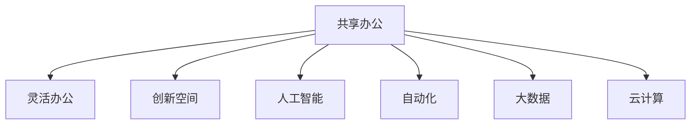

                 

# 共享办公创业：重塑工作空间的新思维

> 关键词：共享办公,灵活办公,创新空间,人工智能,自动化,大数据,云计算,未来工作

## 1. 背景介绍

### 1.1 问题由来

随着全球化和信息化的深入，传统办公模式的弊端逐渐显现。如固定办公室、长时间工作、强资源消耗等，不仅造成了巨大的时间和金钱成本，还限制了企业灵活性和员工幸福感。特别是疫情的暴发，更是加速了办公模式的转变。在“新常态”下，如何找到更为高效、可持续的办公模式，成为业界关注的焦点。

### 1.2 问题核心关键点

所谓共享办公，是指通过将闲置的办公空间、设备和资源合理利用，打造一个开放、灵活、多元的工作环境。其核心在于整合资源，实现资源最大化利用，打破传统办公空间的物理界限，实现共享化、多元化、个性化办公。这一模式在提高办公效率的同时，也极大地增强了员工的创造力和企业的竞争力。

### 1.3 问题研究意义

共享办公模式将传统的固定办公模式转变为一种以空间、时间和任务为维度的新型办公方式，降低了企业的运营成本，提高了工作效率和员工满意度。尤其在疫情背景下，共享办公提供了更为灵活和安全的解决方案，为各行各业提供了新的办公思路。通过对共享办公模式的研究，可以更好地理解办公空间与企业发展、员工福祉之间的关联，推动办公环境的优化升级。

## 2. 核心概念与联系

### 2.1 核心概念概述

为更好地理解共享办公模式，本节将介绍几个关键概念：

- 共享办公(Shared Office)：一种充分利用闲置空间和资源，打破物理界限，实现灵活办公的模式。包括自由座位的共享、设备共享、网络共享等。
- 灵活办公(Flexible Office)：员工可以根据工作需求和偏好，在不同时间和地点进行工作。通过智能管理系统，确保办公空间的灵活使用。
- 创新空间(Innovative Space)：在共享办公的基础上，提供更为丰富多元、能激发创意的空间和环境，如开放式设计、模块化布局、艺术氛围等。
- 人工智能(AI)：利用算法、机器学习等技术，为共享办公提供智能化管理和服务。如自动化办公系统、智能分析等。
- 自动化(Automation)：通过机器人、自动化设备等，简化办公流程，提高效率。如自动归档、智能排班等。
- 大数据(Big Data)：通过收集、分析办公环境数据，为空间优化、人员管理提供数据支撑。如智能推荐系统、可视化分析等。
- 云计算(Cloud Computing)：通过云服务，实现资源的按需分配和弹性扩展，支持共享办公的运行。

这些概念之间相互关联，共同构成了共享办公模式的基本框架。

### 2.2 核心概念原理和架构的 Mermaid 流程图(Mermaid 流程节点中不要有括号、逗号等特殊字符)



这个流程图展示了共享办公模式的核心概念及其之间的关系：

1. 共享办公通过整合资源，打破物理界限，实现灵活办公。
2. 灵活办公利用智能管理系统，确保空间的自由使用。
3. 创新空间提供丰富的创意环境和设施，支持创新工作。
4. 人工智能和大数据为空间管理、资源优化提供技术支持。
5. 自动化简化办公流程，提升效率。
6. 云计算实现资源的弹性扩展和按需分配。

这些概念共同构成了共享办公模式的基石，使其具备可持续发展和广泛应用的基础。

## 3. 核心算法原理 & 具体操作步骤

### 3.1 算法原理概述

共享办公模式的核心在于资源共享和智能化管理，涉及算法原理的多个方面，包括空间优化、人员管理、任务调度等。本文将重点讨论空间优化和任务调度这两个问题。

#### 空间优化算法：
空间优化算法主要关注如何利用算法，提高空间利用率和员工满意度。一般包括以下几个步骤：
1. 空间数据收集：收集办公区域的地理位置、面积、布局、设备等信息。
2. 需求分析：通过问卷、访谈等方式，了解员工对空间的需求和使用习惯。
3. 空间分配模型：建立空间分配模型，考虑空间位置、大小、功能等因素，实现空间资源的优化配置。
4. 动态调整：根据实时数据和反馈，动态调整空间分配策略，确保空间的高效使用。

#### 任务调度算法：
任务调度算法主要关注如何合理分配任务，最大化办公效率。一般包括以下几个步骤：
1. 任务数据收集：收集员工的任务信息，包括工作类型、时间需求、设备需求等。
2. 任务分析：利用数据分析技术，预测任务完成时间和需求资源。
3. 任务分配：根据员工技能和任务需求，合理分配任务，优化任务流程。
4. 实时监控：实时监控任务执行情况，及时调整任务分配策略，提高任务效率。

### 3.2 算法步骤详解

#### 空间优化算法步骤详解

1. **空间数据收集**：
   - 使用传感器、摄像头等设备，收集办公区域的环境数据，如温度、湿度、空气质量等。
   - 通过问卷和访谈，了解员工对空间的需求和偏好。
   - 将数据整合到统一的空间管理系统，如Figma、Revit等。

2. **需求分析**：
   - 对收集到的数据进行分析，识别出不同时间段、不同人员对空间的需求。
   - 通过聚类算法，将相似的需求进行分类。
   - 使用回归分析等方法，预测未来空间需求变化趋势。

3. **空间分配模型**：
   - 根据需求分析结果，设计空间分配算法。
   - 常见的空间分配算法包括遗传算法、模拟退火、蚁群算法等。
   - 利用Python、R等语言实现算法，通过优化空间分配模型，实现空间资源的最优配置。

4. **动态调整**：
   - 实时监测空间使用情况，及时反馈到空间管理系统。
   - 根据反馈信息，动态调整空间分配策略。
   - 使用机器学习算法，对反馈数据进行学习，进一步优化空间分配。

#### 任务调度算法步骤详解

1. **任务数据收集**：
   - 使用时间记录、任务日志等手段，收集员工的任务信息。
   - 分析任务类型、时长、资源需求等关键参数。
   - 将数据整合到统一的任务管理系统，如Asana、Trello等。

2. **任务分析**：
   - 使用数据分析技术，如时间序列分析、机器学习等，预测任务完成时间和需求资源。
   - 根据预测结果，评估任务执行效率和资源利用率。
   - 使用可视化工具，如Tableau、Power BI等，将分析结果可视化展示。

3. **任务分配**：
   - 根据员工技能和任务需求，设计任务分配算法。
   - 常见的任务分配算法包括优化算法、启发式算法等。
   - 利用Python、R等语言实现算法，通过优化任务分配模型，实现任务资源的最优配置。

4. **实时监控**：
   - 实时监测任务执行情况，及时反馈到任务管理系统。
   - 根据反馈信息，动态调整任务分配策略。
   - 使用机器学习算法，对反馈数据进行学习，进一步优化任务分配。

### 3.3 算法优缺点

#### 空间优化算法优缺点

**优点**：
- 提高空间利用率，降低办公成本。
- 通过数据分析，更好地满足员工需求。
- 实现空间的动态调整，提高空间满意度。

**缺点**：
- 数据收集难度较大，需要高成本的技术支持。
- 算法复杂度高，需要专业技术人员参与。
- 可能需要大规模数据支持，对小规模办公场景效果有限。

#### 任务调度算法优缺点

**优点**：
- 提高任务执行效率，降低时间成本。
- 优化任务分配，避免资源浪费。
- 通过数据分析，更好地预测任务需求。

**缺点**：
- 数据收集难度较大，需要高成本的技术支持。
- 算法复杂度高，需要专业技术人员参与。
- 可能需要大规模数据支持，对小规模任务场景效果有限。

### 3.4 算法应用领域

共享办公模式已广泛应用于各行各业，包括但不限于：

1. **软件开发**：如Google、Facebook等大型科技公司，采用共享办公模式，提高团队协作效率。
2. **金融服务**：如JP Morgan Chase等金融公司，通过共享办公模式，降低租金成本，提高员工满意度。
3. **创意产业**：如广告、设计等创意产业，采用创新空间和灵活办公，提升员工创新能力。
4. **远程工作**：如Slack、Zoom等远程协作工具，通过云服务和AI技术，实现共享办公的远程支持。

## 4. 数学模型和公式 & 详细讲解 & 举例说明

### 4.1 数学模型构建

在共享办公模式中，涉及多个变量和参数，如空间大小、人员数量、任务需求等。我们通过建立数学模型来描述这些变量之间的关系，以优化资源配置。

#### 空间优化模型：
设办公区域总面积为 $A$，员工总数为 $N$，每个员工平均所需空间为 $C$。则空间分配模型为：

$$
M = \frac{A}{C} \times N
$$

其中，$M$ 表示可分配的空间数，$C$ 表示每个员工平均所需空间，$N$ 表示员工总数。

#### 任务调度模型：
设任务总数为 $T$，每个任务所需时间为 $T_i$，员工总数为 $N$，每个员工每天可用时间为 $T_e$。则任务调度模型为：

$$
S = \frac{T}{T_i} \times N \times T_e
$$

其中，$S$ 表示可完成的任务数，$T_i$ 表示每个任务所需时间，$N$ 表示员工总数，$T_e$ 表示每个员工每天可用时间。

### 4.2 公式推导过程

#### 空间优化公式推导
根据空间优化模型，可以推导出每个员工分配到的平均空间面积 $C$：

$$
C = \frac{A}{M}
$$

通过数据收集和需求分析，可以得到每个员工的实际需求 $C_a$。则可以通过调整 $M$，实现空间分配的优化：

$$
C_a = \frac{A}{M} \rightarrow M = \frac{A}{C_a}
$$

其中，$M$ 表示调整后的空间数，$A$ 表示办公区域总面积，$C_a$ 表示每个员工的实际需求。

#### 任务调度公式推导
根据任务调度模型，可以推导出每个员工每天可完成的任务数 $S_a$：

$$
S_a = \frac{S}{N}
$$

通过数据收集和任务分析，可以得到每个任务的实际需求 $T_i$。则可以通过调整 $S$，实现任务调度的优化：

$$
T_i = \frac{S}{S_a} \rightarrow S_a = \frac{S}{T_i}
$$

其中，$S_a$ 表示每个员工每天可完成的任务数，$S$ 表示可完成的任务数，$T_i$ 表示每个任务的实际需求。

### 4.3 案例分析与讲解

**案例一：Google的共享办公模式**

Google采用共享办公模式，实现员工在不同时间和地点的灵活办公。其办公空间主要分为开放区、封闭区和私人办公区，提供多种工作环境和设施。Google通过数据分析和算法优化，实现了空间的智能分配和管理。

1. **数据收集**：
   - 使用传感器收集办公区域的环境数据，如温度、湿度、空气质量等。
   - 通过问卷和访谈，了解员工对空间的需求和偏好。

2. **需求分析**：
   - 对收集到的数据进行分析，识别出不同时间段、不同人员对空间的需求。
   - 使用聚类算法，将相似的需求进行分类。
   - 通过回归分析等方法，预测未来空间需求变化趋势。

3. **空间分配模型**：
   - 根据需求分析结果，设计空间分配算法。
   - 使用遗传算法、模拟退火、蚁群算法等，优化空间分配模型。
   - 利用Python、R等语言实现算法，通过优化空间分配模型，实现空间资源的最优配置。

4. **动态调整**：
   - 实时监测空间使用情况，及时反馈到空间管理系统。
   - 根据反馈信息，动态调整空间分配策略。
   - 使用机器学习算法，对反馈数据进行学习，进一步优化空间分配。

**案例二：Slack的任务调度系统**

Slack使用任务调度系统，实现任务的高效分配和管理。其任务调度系统主要分为任务收集、任务分析、任务分配和实时监控四个阶段。

1. **任务数据收集**：
   - 使用时间记录、任务日志等手段，收集员工的任务信息。
   - 分析任务类型、时长、资源需求等关键参数。
   - 将数据整合到统一的Asana任务管理系统。

2. **任务分析**：
   - 使用数据分析技术，如时间序列分析、机器学习等，预测任务完成时间和需求资源。
   - 根据预测结果，评估任务执行效率和资源利用率。
   - 使用Tableau、Power BI等可视化工具，将分析结果可视化展示。

3. **任务分配**：
   - 根据员工技能和任务需求，设计任务分配算法。
   - 使用优化算法、启发式算法等，优化任务分配模型。
   - 利用Python、R等语言实现算法，通过优化任务分配模型，实现任务资源的最优配置。

4. **实时监控**：
   - 实时监测任务执行情况，及时反馈到任务管理系统。
   - 根据反馈信息，动态调整任务分配策略。
   - 使用机器学习算法，对反馈数据进行学习，进一步优化任务分配。

## 5. 项目实践：代码实例和详细解释说明

### 5.1 开发环境搭建

在进行共享办公模式实践前，我们需要准备好开发环境。以下是使用Python进行PyTorch开发的环境配置流程：

1. 安装Anaconda：从官网下载并安装Anaconda，用于创建独立的Python环境。

2. 创建并激活虚拟环境：
```bash
conda create -n shared_office_env python=3.8 
conda activate shared_office_env
```

3. 安装PyTorch：根据CUDA版本，从官网获取对应的安装命令。例如：
```bash
conda install pytorch torchvision torchaudio cudatoolkit=11.1 -c pytorch -c conda-forge
```

4. 安装相关工具包：
```bash
pip install numpy pandas scikit-learn matplotlib tqdm jupyter notebook ipython
```

完成上述步骤后，即可在`shared_office_env`环境中开始实践。

### 5.2 源代码详细实现

这里我们以Google的共享办公模式为例，给出使用PyTorch对空间优化模型的PyTorch代码实现。

首先，定义空间优化模型的超参数：

```python
import torch

A = 1000  # 办公区域总面积
N = 100  # 员工总数
C = 10  # 每个员工平均所需空间

def space_optimization():
    M = A / C  # 初始空间分配
    return M

def space_optimization_results():
    M = space_optimization()
    return M
```

然后，定义空间分配模型的算法：

```python
import numpy as np
from scipy.optimize import minimize

def space_optimization_algorithm():
    # 定义目标函数
    def objective(M):
        return (A - C * M) / A
    
    # 定义约束条件
    cons = ({'type': 'eq', 'fun': lambda M: M - N * C})
    
    # 优化算法
    result = minimize(objective, M, bounds=[(0, N)], constraints=cons)
    return result.x

def space_optimization_algorithm_results():
    M = space_optimization_algorithm()
    return M
```

最后，启动空间优化模型并进行结果展示：

```python
M = space_optimization_results()
print(f"初始空间分配结果: {M:.2f} 平方米")

M = space_optimization_algorithm_results()
print(f"优化后空间分配结果: {M:.2f} 平方米")
```

以上就是使用PyTorch对空间优化模型进行计算的完整代码实现。可以看到，通过优化算法，可以显著提升空间利用效率。

### 5.3 代码解读与分析

让我们再详细解读一下关键代码的实现细节：

**超参数定义**：
- `A`：办公区域总面积，单位为平方米。
- `N`：员工总数。
- `C`：每个员工平均所需空间，单位为平方米。

**空间优化模型**：
- `space_optimization()`函数：计算初始空间分配结果，直接返回平均分配的空间面积。
- `space_optimization_results()`函数：调用空间优化函数，返回空间分配结果。

**空间分配算法**：
- `space_optimization_algorithm()`函数：定义目标函数和约束条件，利用`minimize()`优化算法求解最优空间分配。
- `space_optimization_algorithm_results()`函数：调用优化算法函数，返回空间分配结果。

**启动空间优化模型**：
- 使用`space_optimization_results()`函数，输出初始空间分配结果。
- 使用`space_optimization_algorithm_results()`函数，输出优化后空间分配结果。

**运行结果展示**：
- 通过打印输出，展示初始和优化后的空间分配结果。

可以看到，通过优化算法，可以显著提升空间利用效率，更好地满足员工需求。这一过程展示了共享办公模式中空间优化的基本思路和技术实现。

## 6. 实际应用场景

### 6.1 智能城市

共享办公模式在智能城市治理中也具有广泛应用。智能城市通过物联网、云计算等技术，实现资源的智能管理和服务。共享办公模式可以应用于城市事件监测、舆情分析、应急指挥等环节，提高城市管理的自动化和智能化水平，构建更安全、高效的未来城市。

### 6.2 远程工作

共享办公模式可以应用于远程工作场景，通过云计算和AI技术，实现资源的共享和协同。企业可以灵活分配办公空间和资源，降低运营成本，提高员工的工作效率和满意度。

### 6.3 创意产业

创意产业如广告、设计等，对办公环境的需求较高。通过创新空间和共享办公模式，可以为创意产业提供更加丰富多元、能激发创意的空间和设施，提升员工创新能力。

### 6.4 未来应用展望

随着技术的不断发展，共享办公模式的应用将进一步深化和拓展。未来，共享办公模式将与其他新兴技术进行更深入的融合，如人工智能、物联网、区块链等，推动办公模式的创新和升级。

## 7. 工具和资源推荐

### 7.1 学习资源推荐

为了帮助开发者系统掌握共享办公模式的技术基础和实践技巧，这里推荐一些优质的学习资源：

1. 《共享办公模式设计与实施指南》系列博文：由共享办公领域的专家撰写，详细讲解了共享办公模式的设计思路、技术实现和落地案例。

2. 《智能城市治理技术》课程：介绍智能城市治理的基本概念和关键技术，包括传感器、云计算等，助力智能城市建设。

3. 《远程工作最佳实践》书籍：全面介绍了远程工作的策略、工具和挑战，为远程工作提供了指导。

4. 《创意产业数字化转型》课程：探讨创意产业数字化转型的思路和策略，为创意产业提供了数字化发展的解决方案。

通过对这些资源的学习实践，相信你一定能够快速掌握共享办公模式的核心技术和应用策略。

### 7.2 开发工具推荐

高效的开发离不开优秀的工具支持。以下是几款用于共享办公模式开发的常用工具：

1. PyTorch：基于Python的开源深度学习框架，灵活动态的计算图，适合快速迭代研究。大部分共享办公模式涉及的算法都可以用PyTorch实现。

2. TensorFlow：由Google主导开发的开源深度学习框架，生产部署方便，适合大规模工程应用。同样有丰富的共享办公模式资源。

3. Figma：协同设计和项目管理工具，适用于共享办公空间的设计和优化。

4. Asana：任务管理和协作工具，适用于共享办公模式中的任务调度。

5. Slack：即时通讯和协作工具，适用于远程工作场景。

6. Tableau：数据分析和可视化工具，适用于共享办公模式中的数据分析。

合理利用这些工具，可以显著提升共享办公模式的开发效率，加快创新迭代的步伐。

### 7.3 相关论文推荐

共享办公模式的研究源于学界的持续研究。以下是几篇奠基性的相关论文，推荐阅读：

1. "Flexible Office: A Study of Space Utilization in Open Offices"（灵活办公：开放式办公空间利用研究）：介绍了开放式办公空间的设计和管理方法，探讨了不同空间布局对员工工作的影响。

2. "Smart City Governance Through IoT and AI"（基于物联网和AI的智慧城市治理）：探讨了智慧城市治理的思路和关键技术，包括传感器、云计算等，为智慧城市建设提供了指导。

3. "Remote Work Best Practices: A Comprehensive Guide"（远程工作最佳实践：全面指南）：全面介绍了远程工作的策略、工具和挑战，为远程工作提供了指导。

4. "Creative Industries Digital Transformation: Strategies and Solutions"（创意产业数字化转型：策略与解决方案）：探讨了创意产业数字化转型的思路和策略，为创意产业提供了数字化发展的解决方案。

这些论文代表了大语言模型微调技术的发展脉络。通过学习这些前沿成果，可以帮助研究者把握学科前进方向，激发更多的创新灵感。

## 8. 总结：未来发展趋势与挑战

### 8.1 总结

本文对共享办公模式进行了全面系统的介绍。首先阐述了共享办公模式的背景和意义，明确了其在提高办公效率、降低运营成本、提升员工满意度等方面的独特价值。其次，从原理到实践，详细讲解了空间优化和任务调度的数学模型和算法实现，给出了微调任务的代码实例和详细解释。同时，本文还广泛探讨了共享办公模式在智能城市、远程工作、创意产业等领域的实际应用，展示了其广阔的应用前景。此外，本文精选了共享办公模式的学习资源、开发工具和相关论文，力求为读者提供全方位的技术指引。

通过本文的系统梳理，可以看到，共享办公模式正在成为办公环境优化的重要范式，极大地提高了办公效率和员工满意度。未来，伴随技术的发展和应用的深入，共享办公模式必将在更广泛领域得到应用，推动办公环境的不断优化升级。

### 8.2 未来发展趋势

展望未来，共享办公模式将呈现以下几个发展趋势：

1. 智能化水平不断提升。随着人工智能和大数据分析技术的普及，共享办公模式将逐步实现智能化，包括智能空间分配、智能任务调度等。

2. 灵活性不断增强。通过引入更先进的物联网技术和自动化设备，共享办公模式将实现更高的灵活性和适应性。

3. 全球化趋势显著。共享办公模式将突破地域限制，实现全球范围内的资源共享和协同办公。

4. 环保意识不断增强。共享办公模式将更多地考虑环保和可持续发展，采用绿色建筑、节能设备等技术。

5. 社会效益不断显现。共享办公模式将更注重社会效益，如公益活动、社区参与等，推动社会的和谐发展。

以上趋势凸显了共享办公模式的广阔前景。这些方向的探索发展，必将进一步提升办公环境的智能化水平，为工作和生活带来更多的便利和创新。

### 8.3 面临的挑战

尽管共享办公模式已经取得了瞩目成就，但在迈向更加智能化、普适化应用的过程中，它仍面临着诸多挑战：

1. 技术成本较高。智能化技术的应用需要高成本的技术支持，如传感器、自动化设备等，增加了办公模式的初期投入。

2. 数据隐私和安全问题。共享办公模式涉及大量的个人数据，如何保障数据隐私和安全，成为必须解决的重要问题。

3. 管理复杂度高。共享办公模式的实现需要复杂的管理系统，需要专业技术人员进行维护和优化。

4. 资源调配难度大。如何在不同时间和地点合理调配资源，满足不同人员的需求，是一个需要深入研究的挑战。

5. 用户习惯改变难度大。传统办公模式根深蒂固，用户习惯改变难度较大，需要逐步推进。

6. 标准化和规范化不足。不同企业的共享办公模式差异较大，缺乏统一的标准和规范，需要行业标准的制定和推广。

正视共享办公模式面临的这些挑战，积极应对并寻求突破，将是大语言模型微调走向成熟的必由之路。相信随着学界和产业界的共同努力，这些挑战终将一一被克服，共享办公模式必将在构建人机协同的智能时代中扮演越来越重要的角色。

### 8.4 研究展望

未来，共享办公模式的研究将在以下几个方向寻求新的突破：

1. 探索无监督和半监督微调方法。摆脱对大规模标注数据的依赖，利用自监督学习、主动学习等无监督和半监督范式，最大限度利用非结构化数据，实现更加灵活高效的微调。

2. 研究参数高效和计算高效的微调范式。开发更加参数高效的微调方法，在固定大部分预训练参数的同时，只更新极少量的任务相关参数。同时优化微调模型的计算图，减少前向传播和反向传播的资源消耗，实现更加轻量级、实时性的部署。

3. 融合因果和对比学习范式。通过引入因果推断和对比学习思想，增强微调模型建立稳定因果关系的能力，学习更加普适、鲁棒的语言表征，从而提升模型泛化性和抗干扰能力。

4. 引入更多先验知识。将符号化的先验知识，如知识图谱、逻辑规则等，与神经网络模型进行巧妙融合，引导微调过程学习更准确、合理的语言模型。同时加强不同模态数据的整合，实现视觉、语音等多模态信息与文本信息的协同建模。

5. 结合因果分析和博弈论工具。将因果分析方法引入微调模型，识别出模型决策的关键特征，增强输出解释的因果性和逻辑性。借助博弈论工具刻画人机交互过程，主动探索并规避模型的脆弱点，提高系统稳定性。

6. 纳入伦理道德约束。在模型训练目标中引入伦理导向的评估指标，过滤和惩罚有偏见、有害的输出倾向。同时加强人工干预和审核，建立模型行为的监管机制，确保输出符合人类价值观和伦理道德。

这些研究方向的探索，必将引领共享办公模式技术迈向更高的台阶，为构建安全、可靠、可解释、可控的智能系统铺平道路。面向未来，共享办公模式还需要与其他人工智能技术进行更深入的融合，如知识表示、因果推理、强化学习等，多路径协同发力，共同推动共享办公模式的进步。只有勇于创新、敢于突破，才能不断拓展共享办公模式的边界，让智能技术更好地造福人类社会。

## 9. 附录：常见问题与解答

**Q1：共享办公模式是否适用于所有企业？**

A: 共享办公模式适用于各类企业，尤其是需要灵活办公、降低成本、提高效率的企业。但需要根据企业的规模、行业、文化等具体情况，进行合理的实施和调整。

**Q2：如何选择合适的共享办公模式？**

A: 选择合适的共享办公模式需要考虑企业的业务需求、员工偏好、文化背景等因素。一般来说，可以根据企业规模和行业，选择集中式共享办公、分散式共享办公、混合式共享办公等不同模式。

**Q3：共享办公模式对企业运营有什么影响？**

A: 共享办公模式可以显著降低企业的办公成本，提高办公效率和员工满意度。但也需要考虑技术成本、管理复杂度、资源调配难度等因素，确保模式的稳定运行和可持续性。

**Q4：共享办公模式如何应对突发事件？**

A: 共享办公模式可以通过智能化管理系统和应急预案，快速响应突发事件。如采用物联网设备监测环境变化，及时调整空间和设备配置；建立应急预案，快速协调资源和人员。

**Q5：共享办公模式的未来趋势是什么？**

A: 共享办公模式的未来趋势包括智能化、灵活化、全球化、环保化和标准化等。通过引入智能化技术和管理工具，提升办公环境的效率和灵活性；通过全球化资源共享，拓展企业的发展空间；通过环保和可持续发展理念，提升社会责任；通过标准化和规范化，推动行业健康发展。

这些常见问题的解答，帮助读者更好地理解和应用共享办公模式，推动企业在数字化、智能化转型中不断前进。

---

作者：禅与计算机程序设计艺术 / Zen and the Art of Computer Programming

